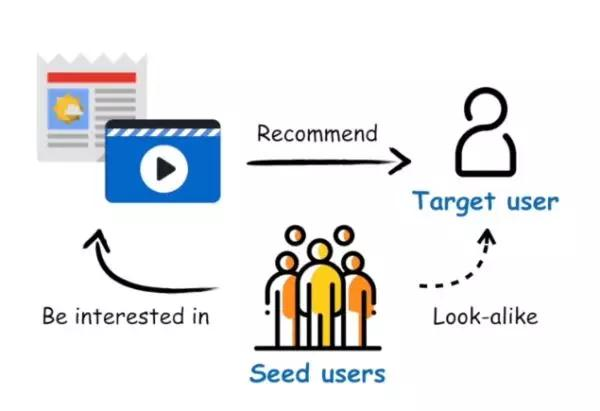
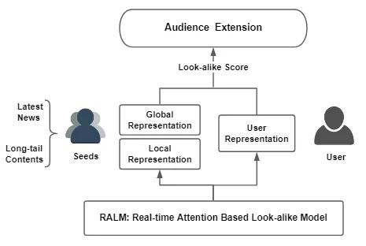
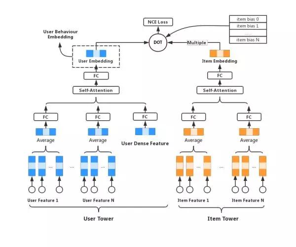
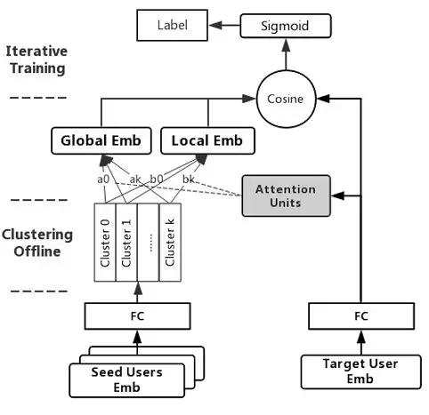
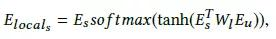
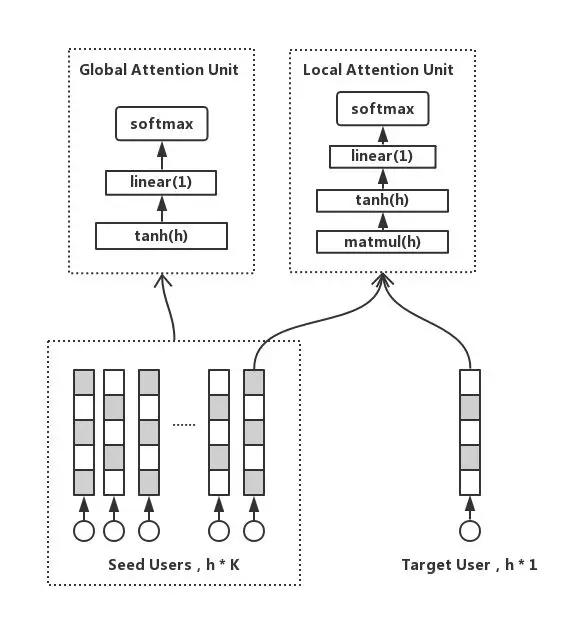
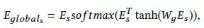
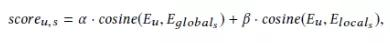
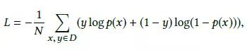
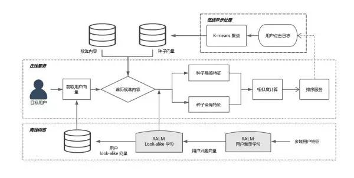

## “看一看”推荐模型揭秘！微信团队提出实时Look-alike算法，解决推荐系统多样性问题  

> 原创：  
> 刘雨丹  
> 发布: AI前线  
> 发布日期: 2019-07-07  

论文作者 |  Yudan Liu, Kaikai Ge, Xu Zhang, Leyu Lin，腾讯微信事业群

编辑 | 陈思  **AI 前线导读：** Look-alike 是广告领域经典的推荐算法，拥有定向能力强、用户扩展精准等优点。本文在微信看一看的推荐场景下对传统 look-alike 进行了改造，使之更适合高时效性的资讯推荐系统。本论文题为《Real-time Attention based Look-alike Model for Recommender System》，已被 KDD 19 接收。

**更多优质内容请关注微信公众号“AI 前线”（ID：ai-front）** 

Fig.0. 微信看一看

微信看一看面向全体微信用户，每天有数百万新闻、视频和公众号文章借由个性化推荐系统完成分发。在微信看一看，我们将各类深度学习算法广泛应用到了推荐系统的各个环节中。新闻资讯、运营专题和小众文章由于缺少历史行为或者倾向长尾，往往曝光效率不高，对此我们提出 RALM 模型尝试解决这个问题。

1\. 背景 1.1. 未被缓解的马太效应

现阶段，Deep Learning 已经在推荐领域中广泛应用，深度模型如 Youtube DNN/WND/DeepFM 等在传统的个性化召回 /CTR 排序都取得了不错的效果，但仍有一些覆盖效果不佳的场景。对于传统的推荐模型来说，item 的历史行为特征对于 pCTR 的影响很大，这也造成模型推荐结果总体趋热（当然大多数场景下热文是大家都爱看的）。因此而来的副作用就是内容体系的马太效应没有得到充分缓解，一些优质的长尾内容，比如运营新闻专题、冷门类目精品等受到打压，无法得到高效的投放。

要解决这个问题，我们不妨思考传统推荐模型的建模思路，大致如下：

1. 获取样本：user, item, label。这里以资讯推荐举例，label 即是否点击（0/1）。注意，这条样本是最原始的信息，包含这一行为的所有信息量；

2. 拆解特征：直接使用行为样本信息损失当然是最低的，但那意味着失去泛化性。所以我们需要引入用户画像、语义信息、统计信息作为 user/item 的表达；

3. 训练权重：拟合样本，学习各特征权重

由上可以看到，从 1 到 2 有一个信息损失的过程。特别是对于 item 的历史行为信息，并没有很完整的表示方式。传统模型里一个 point-wise 的样本用 itemid、统计信息（历史点击率 / 点击次数 / 标签点击率等等）表征 item 行为，但无论是 itemid 还是点击率 / 点击次数，都是倾向于头部历史行为丰富 item 的特征，这也是为什么前文说的马太效应未被缓解。

1.2. Look-alike Model

综上所述，我们需要的是一个能精准建模 item 历史行为的模型。Look-alike 是广告领域流行的一类方法，其核心思想是针对某个 item，先根据历史行为圈定一部分种子用户，然后通过模型寻找与种子用户相似的人群，为他们推荐该 item。

Fig.1. Look-alike 算法原理

由于 look-alike 充分利用了 item 的所有行为信息，因此在定向挖掘长尾内容受众上具有独特的优势。然而相较于广告系统，我们的资讯推荐有如下差异：

1.  **内容时效性要求高** ，一条新闻投放资讯生命周期一般不超过一天；

2.  **候选集更新频率高** ，一天可能有几十上百万条新内容出现。

传统的广告 look-alike 包括 similarity based models \(LSH/user embedding\) 和 regression based models \(LR/xgboost/MLP\)，在广告系统中都得到过验证，但不太适用于资讯推荐。这些模型往往都是针对每个 item 训练一个模型（或者每个 itemid 训练一个 embedding） ，当 item 候选集增加时，模型都需要首先积累样本，然后重训或增量更新，这对于高时效性高频率更新的资讯推荐系统来说是难以接受的。

总结下来，我们最后需要的模型应具备如下特点：

1. 实时扩展用户，无需更新模型，让资讯第一时间触达受众；

2. 保证推荐的准确性和多样性；

3. 支持在线预测。

基于以上，我们提出了 **RALM** \(Realtime Attention-based Look-alike Model\) 模型，它通过 user representation learning 表达用户的兴趣状态，通过 Look-alike learning 学习种子用户群体信息以及目标用户与种子用户群的相似性，从而实现实时且高效的受众用户扩展和内容触达。

2\. 模型

RALM 模型能实现实时扩散的核心在于，我们使用种子用户的特征来代替 item 的历史行为特征，从而将常规 user-item 的模型转换成了 user-users 模型，这意味着任何在系统中有过行为的 item ，都能被表示为 I = Eseeds= f\(\{E\(u1\), E\(u2\), ..., E\(un\)\}\)，其中 un ∈ U，U 为系统用户全集；Eseeds 是 item 种子用户集合的表示。

RALM 的训练包含两部分：User Representation learning 和 Look-alike learning。User Representation learning 的任务是学习 E\(un\)；Look-alike learning 的任务则是基于 E\(un\) 学习 Eseeds。

Fig.2. RALM 算法流程

2.1. User Representation learning

User Representation learning 的任务是学习用户的高阶表示，目的是对繁杂的多域低阶特征做抽象，尽可能全面地表达用户在系统中的状态，便于后续模型的利用。这里可以是个多任务学习，或者输出不同向量空间的多个 embeddings。

我们改进了 Youtube DNN 模型，针对点击样本训练了一版模型，取最后一层隐层作为用户行为 embedding，供后续使用。模型细节计划在 CF 优化专题里详细说明，在此不再赘述。

Fig.3. 用户行为表示学习

2.2. Look-alike learning

从 User Representation learning 得到 user embedding 后，我们将其作为 user 特征，学习种子用户到目标用户的关系，即上文提到的 user-users model。

模型结构  

Fig.4. Look-alike learning

模型结构比较简单，是一个双塔结构。左边称为“seeds tower”，以种子用户的 embeddings 作为输入，经过一层空间转换（全连接 +pRELU），然后分别经过一个 self-attention 单元和一个 productive attention 单元，pooling 后输出向量；模型右边结构称为“target tower”，目标用户 embedding 输入后经过空间转换（与 seeds tower 共享参数），直接与左边向量计算 cosine 相似度。

Local attention

为了计算种子用户群体和目标用户的相似度，我们需要首先把多个用户向量 pooling 成一条。Average 是常用的 pooling 方式，但取均值的结果是趋向群体的中心，也就是大众化的兴趣，丢失了群体中的离群点和个性化兴趣。而一个群体中，必然只有一部分用户是和目标用户兴趣相仿的。基于这些假设，我们加入了 **local attention unit** ，激活种子用户群的局部兴趣点，并且学习到一个和目标用户紧密关联的用户群表达方式，公式如下：

Fig.5. Attention units

这是一个乘法注意力，Wl ∈ Rhxh 表示转换矩阵，Es 表示种子用户，Eu 表示目标用户，Elocal 为种子用户的 local info。

当 item 有 n 个种子用户时，计算 attention 需要 n \* h \* h 次乘法计算，当 n 很大时，计算耗时也会水涨船高，不利于在线预测。为了减少计算次数，我们在这引入聚类。我们用 K-means 把种子用户聚成 k 个类簇，然后令种子用户向量按最近类簇中心聚合成 k 个向量，最后再计算 attention。这样一来，计算次数就从 n \* h \* h 减少至 k \* h \* h，k 只是一个很小的常数。在我们的实践中，k 取 20 是性能与效果的最佳折中点。注意，由于 attention 前的空间转换矩阵是可学习的，所以输入向量也是会变的，因此最好每隔一定 batch 数迭代更新 K-means 的 k 个聚类中心，减少聚类带来的信息损失。

Global attention

除了个性化信息，用户群体还有共性的、与自身组成相关的全局信息。因此我们引入 global attention unit 来捕获这部分群体信息。

Wg ∈ Rsxn 表示全连接矩阵，Eglobal 为种子用户的 global info。本质上这是一个 self-attention，与群体分布更相似的兴趣将会被提取出来。最终我们令 Elocal ， Eglobal 分别与 Eu 求 cosine，加权求和即得到目标用户与种子用户的相似度分数。

Loss

RALM 是个多分类任务（目标用户属于哪一个种子用户群），我们用 negative sampling 的方式采多正多反（点击 item 的种子用户做正例，随机采负例），使用多组交叉熵作为模型 loss 函数。

3\. 系统架构

RALM 模型框架现在已经部署在微信看一看，整体流程如下：

Fig.6. 系统架构图

3.1. 离线训练

离线训练包括 User Representation learning 和 Look-alike learning，最终输出 look-alike 模型参数和 Eu。模型参数可加载到内存，全量用户的 Eu 可存到 kv cache。

3.2. 在线异步处理

在线异步处理主要是针对需要快速更新的数据进行准实时的更新和计算，节约线上请求耗时。包括两部分：拉取用户点击日志，更新线上候选集 item 的种子用户，预计算 Elocal（因为这部分与目标用户无关）；计算 K-means 类簇中心。以上两部分通过词典系统推送到线上内存。

3.3. 在线服务

线上服务首先拉取当前请求 user 的 Eu，然后遍历候选集 item，分别得到各 item 的种子用户 embedding，计算 local/global attention（已预计算），加权得到最终的相似度。相似度分数可以作为后续模型的特征分，也可以通过卡阈值的方式控制曝光。

4\. 一些细节和思考 4.1. 特征

在 RALM 中，我们用 user 特征来表示 item，取代 item 的语义、id、统计类特征，一方面可以得到 item 完整的历史行为表达，另一方面对缺乏丰富统计特征的 item 更加友好。

对于用户，我们用高阶连续特征作为用户特征，而没有使用用户的其他离散特征。是因为如果用低阶特征来表达用户群体，那么我们只能采取统计的方式来构造特征，这会丢失群体大部分信息。而经过表示学习的高阶特征其实已经包含了用户各类低阶特征的交叉，能更加全面地表达用户的信息。并且高阶特征有泛化性，避免表达陷入历史数据的记忆。

4.2. 模型调优

Look-alike learning 的模型很简单，而输入的用户特征又只有一种连续特征，因此很容易受到 User Representation 模型的影响，产生过拟合。我们采取的方式是共享两边全连接层的参数，并且加入 dropout，让模型结构更简单，一定程度上能走得更远。

另外，引入 stacking 的思路，将不同学习目标的其他用户表示 embeddings（如泛兴趣、关系链） concat 作为输入特征，共同训练是我们下一步目标，在 stacking model 中，这也是一个防止模型被带偏、让学习更充分的方法。

4.3. 冷启动曝光

虽然 RALM 计算相似度并不需要太多种子用户，但在 item 初次投放时（种子用户为 0），我们仍需多 item 做初始曝光以获得最初的种子用户。线上我们使用语义特征与用户画像做了简单的 MLP 预估点击率作为曝光策略，当积累足够量（100 以上）种子用户后即可进入 RALM 的正常预测流程。

5\. 总结

RALM 实现了可实时扩展用户的 look-alike 算法，它通过 User Representation learning 和 Look-alike learning 捕捉种子用户群的 local/global 信息，并学习用户群与目标用户的相似度表示，更好地发掘长尾内容的受众用户。通过离线评估和线上 A/B test，RALM 在曝光、CTR、多样性等指标上均取得了更好的效果。注：论文中只用了少量特征学习 representation，效果会打折扣。

附录是 RALM 论文，欢迎大家交流和赐教。

6\. 附录

\[1\].Real-time Attention Based Look-alike Model for Recommender System：https://arxiv.org/abs/1906.05022

本文授权转载自知乎，原文链接：

https://zhuanlan.zhihu.com/p/71951411

