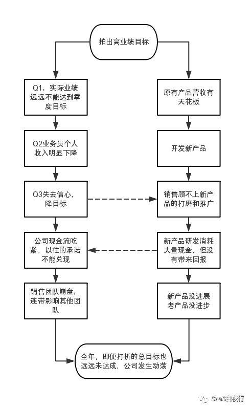
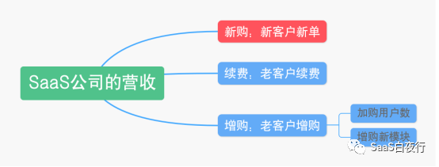
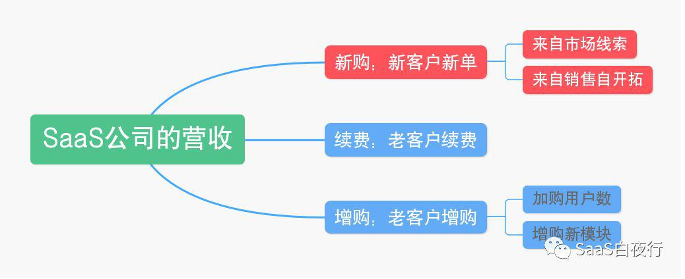

## 如何制定销售目标？| SaaS创业路线图（53）  

> 发布: 吴昊@SaaS  
> 发布日期: 2019-07-09  

编者按：本文来自微信公众号“SaaS白夜行”（ID：SaaSKnight），作者吴昊SaaS，36氪经授权发布。

**作者介绍** **-** 吴昊，多家SaaS公司常年战略及营销顾问，SaaS系列文章作者，目前也在撰写一部SaaS创业书籍。我的每篇文章都来自SaaS公司实战中的困惑，并基于我的经验和思考给出解决问题的思路。解答未必全面，欢迎大家在文末留下自己的疑问或建议，我的这本书将因此获益，由此也能帮到更多的SaaS同路人。

（SaaS创业路线图）

最近有好几个SaaS公司CEO或销售VP问我如何制定销售目标？看来有不少公司都会在6、7月份做销售目标调整啊！

首先，销售目标与公司当年的战略目标紧密相关。

有可能是公司有融资需求，要求营销体系在几个月内将月度收入提高到某个数字；也可能是公司有盈亏持平的需求，需要业绩达到x千万才能实现正向现金流；还可能是公司发展的需求，公司CEO和董事会决定今年的销售的增速是100%或200%？

上面这些呢，都属于拍脑袋决定销售目标。咱们该这样拍销售目标吗？

作为销售部门负责人和销售部门的同事，对完成公司战略任务责无旁贷。捍卫目标就是捍卫每个销售战士的荣誉。

但与此同时，公司层面要提供足够的支撑，保障大部分业务员能够完成自己的销售任务、保障大部分部门能够完成自己的销售任务、保障整个营销服务体系大概率能够完成任务。

因此公司要为营销体系提供资源（包括扩张团队多损耗的资金）、提供组织赋能、提供更多的产品和服务支持。这是每个公司做营销规划必须考虑的事项。

如果“拍脑袋”拍的不对，拍出一个很离谱的目标，最终可能会让整个营销团队走向深渊。关于这一点，我写过一篇相关的文章，大家可以在我的公号下阅读：《[错误的目标把销售团队带向深渊（2年内3个知名公司同样的失败故事）](http://mp.weixin.qq.com/s?__biz=MzIxNjc2MTc2MQ==&mid=2247483683&idx=1&sn=f23ce7336ba56b591611f78a3bc677d2&chksm=978555eda0f2dcfb791dc9a4069857205c9990d43ce37e93f0b60b5444f6d3424c6de80fa22d&scene=21#wechat_redirect)》

我画了一个“过高业绩目标”事件的演化路径，看起来中间每一步选择都是正确的，最后却导致令人扼腕的后果。

所以公司定年度业绩目标，还是要大体合理的。 **销售部门可以在这个总目标的方向上去努力，但是也要制定出合理的落地的步骤和方法。**

沉重的讲完了，下面讲点轻松的。

我的第1份工作就在一家行业排名第一的国企傻傻地干了6年，当时的主要任务是监控6个分公司主营业务运营情况及开发、维护一套自用的主营业务IT系统。因为公司的运营数据在我手上，经常被公司高管请去提供各种角度的经营数字，所以我从那段时间开始就对经营数字很敏感。

十几年之后的2014年，我带领一个SaaS销售团队从1月份的单月营收40万增长到12月份的500万。更神奇的是，当年我们除了业绩目标超额完成之外，还创造了另外一个奇迹：每个月的实际销售收入与年初制定的月度销售目标偏差不超过±10%。公司里的同学们给我起了个外号叫做“神算子”。

最后全年任务是在年度最后一天，也就是12月31日的下午4:00完成；4点后还有很多回款，整个公司超额完成了年度任务。而这个任务是上一年实际收入的的10倍以上。

当然，这与当年该产品在市场上的锋利程度有很大关系，更与团队的士气、状态有关， **每个月都能增长20~30%，靠的是目标清晰、将士用命。**

同时， **这里的销售目标制定方法及销售目标实现思路是正确的。今天我们就用几个公式来拆解一下：该如何制定销售目标？**

SaaS公司的营收来自三块：第1块是新客户的新购，第2块是老客户的续费，第3块是老客户的增购。

老客户的增购包括加购用户数和增购新模块。

_图：SaaS公司营收的组成_

**一、新购收入**

谈新购必须要先谈谈“开源方式”，也就是“客户是怎么来的？”

SaaS圈的公司常见两类极端：一类是99%的成交客户都来自于市场部提供的线索；另一类，99%的成交都来自销售业务员的主动开发。

A、 **以市场线索为主的公司**

这类公司的销售额公式为：

**新购业绩 = 有效市场线索的数量 x 线索成交转化率**

当然，不同公司做线索运营的深度不同，也许还可以考虑“往期未成交线索”的转化率、不同级别的线索转化率不同（需要有SDR团队对线索进行分类分级）做更精细的测算。

**做了这个公式拆分之后，销售部门的任务就很清楚，就是设法提高“转化率”；而市场部门的职责同样清晰，就是“提高有效线索的数量”。**

如果这两个部门向同一个VP（或CEO）汇报，他就要对整个销售结果负责。他需要掌控好市场线索的投放与销售转化产能（也就是成熟销售的人数）之间的平衡，保持整体业绩产出在高水准上。

但一个销售负责人真的就应该只承担转化率的职责吗？

我们再看另一个极端开源类型的SaaS公司：

B、 **成交客户99%来源于销售自开拓**

也就是说，市场能力接近于0。

这类公司的销售业绩公式：

**新购业绩 = 成熟士兵数 x 成熟士兵月均单产（人效）**

如果我们忽略新员工在培养期内产生的业绩，大致就可以用上面这个公式来做全年销售规划。

这种类型的公司销售VP应该非常重视“成熟士兵”的数量。

我举个具体的例子，某公司今年新购目标为5000万，销售VP开始做规划：

1、将任务分解到各个季度：Q1~Q4可以为15%、25%、30%、30%（根据业务增速确定），再将任务拆到每个月；

2、计算出每个月需要多少成熟员工。假设，我们9月份的销售目标是400万，而我们的人均单产是8万元/月。那么在9月份我们就需要400÷8=50个成熟销售；

3、推算需要招募和培养多少销售。假设我们的销售新兵成熟周期为3个月，为期2周的新兵训练营淘汰率20%，前3个月试用期淘汰率30%（简单计算为3个月留存率50%）。如果6月份我们有20名成熟销售，那么就需要在6月初招募60名合格的销售新兵，这样3个月后（9月份）就能得到新成熟的业务员：60人 x 50%留存率 = 30人。加上原有的20名成熟业务员，总共50个成熟业务员。

所以， **销售目标是可以进行推算和精确的执行的。**

至于如何执行，例如如何招募到这么多新员工？如何做培训和筛选？大家可以在我的同系列文章中找答案。

当然，每家公司还有很多实际问题需要考虑。例如，根据成熟员工的流失率在上面的招募计划中增加一点余量。还要考虑市场容量问题：每个区域团队扩张后是否会造成人均单产数字的下降？

如果在年初做销售规划时还不能做这些判断，起码要在每个月观察这些关键指标。

C、 **市场-销售平衡的公司**

回到刚才提出的问题——“一个销售负责人真的就应该只承担转化率的职责吗？”

上面的A、B两类情况都是偏极端的。一个公司的营销体系，应该做好销售自开拓和市场线索两个方向均衡发展。 **只依赖市场线索或只依赖销售自开拓，都是不健康的表现。**

我理解有的销售团队会反馈说我们的产品和目标客户更适合用市场的方式来获得线索。客单价越高、客户规模越大，越难去通过销售去教育客户。

这我很理解。但你去看看，你们公司的销售体系里真的没有人能够自开拓吗？真的没有人能够通过建立深度客情和提供真诚服务获得客户的转介绍吗？

在看看那些另一个极端的公司，那些90%以上依赖销售自开拓的公司，你们的市场能力真的就不能够提升了吗？你们就真的不需要建设品牌吗？

销售能够做的是广泛的覆盖，但只靠销售，在市场上将会越来越难深入目标市场。真正的进入客户心智，还是要依赖市场部的工作。

当然两者的比例关系可以是70：30，也可以是20：80，但不要是1：99或5：95。

作为to B的公司，无论产品轻重，无论目标客户类型如何，都不应该放弃销售自开拓或放弃市场获得线索。因为， **这会是公司未来发展的组织能力短板！**

从这个角度说，作为一个营销负责人，往往需要在做年度营收规划的时候，把销售-市场平衡发展的目的考虑进来。

打比方，如果我们现在完全依赖市场线索，我们就需要考虑增强销售的自开拓动力：我们可以把销售人数增加20%，然后就会发现原有的销售目标只靠市场线索是不能完成，每个业务员都必须做20%左右的客户自开拓。

从咱们业务员的个人角度来看：找客户资料、打陌生电话、只有总机号码需要打电话绕过前台触达KP（采购关键决策人）、拜访一个约好的客户后在附近做做陌生拜访......这都是咱们应该具备的基础能力。如果做了几年销售，还没有做过其中一项或两项，那只能是个能力不完整的业务员。一般环境发生变化，就不能适应。

对于缺乏自开拓经验的销售团队，可以从服务好老客户获得“转介绍”（这也是“自开拓”的一种）开始这件事。

另一个办法是：构建一只全新的直销团队。这只团队在能力培养期（前几个月），公司可以提供高质量的线索，而其长远目标是能够独立进行开源工作。

作为营销一把手要经常考虑销售-市场均衡的问题，特别是在年初和年中的关键节点上。

**二、续费**

我常说，SaaS的本质是续费。

即便在SaaS公司的前3年中，续费在金额上还不能与新购相比，续费仍是SaaS公司最重要的收入。

**续费率不足70%的SaaS公司就不值钱** ，或者说，这样的公司应该按传统公司的市盈率估值，而不应该按10倍的市销率估值。关于saas公司的估值，可以参考我的另一篇文章《[SaaS的本质和SaaS公司的大坑](http://mp.weixin.qq.com/s?__biz=MzIxNjc2MTc2MQ==&mid=2247483673&idx=1&sn=09305a41e6751bf0e1bdc4352b796b64&chksm=978555d7a0f2dcc191788c0535579384b2dd82c30717dc265681b6279b9980aa100083358ee7&scene=21#wechat_redirect)》。

测算续费的公式也很简单：

**续费收入 = 待续金额 x 目标（金额）续费率**

在客户成功部门的实际管理中，我们要注意对付费客户进行分类分级。不同级别的客户的服务力度、服务频率是不同的。

具体的到客户成功部门如何管理目标，如何设定激励方案？我另外再写文章讲解。

**三、增购**

首先增购在公司内部有归属问题。我熟悉的方式是：在新客户首次签约后6个月之内的客户增购以销售为主要负责人，6个月之后是以客户成功经理为主要负责人，当然权责利都是相一致的。

这个期限与产品实施周期、合同是否约定多次付款有很大关系，因此这个时限的设定方式、时长都可能不同。从我接触的SaaS公司看，从3个月到12个月都有。

对于那些产品线丰富的SaaS公司来说，交叉销售，也就是销售更多的新产品给老客户，是提高LTV的重要手段。当然这是公司战略问题，这里也不再赘述。

总结一下，营收目标的公式为：

营收目标 = 新购目标 + 续费目标 + 增购目标

公式很简单，想真正能做好营销规划还需要系统思考和多向外部交流学习。

**四、按月还是按年制定销售目标？**

最后这个问题其实没有标准答案。

A、 **按年定任务**

如果一个企业平稳发展，例如每年30%~50%的增速，当然应该按年制定销售目标，并且在一年当中坚守每个月的目标，保证每月按时达成。

这样从管理层到基层业务员的年度总目标、KPI、激励提成方案都相对容易制定。

**B、按月下任务**

但如果一个企业一年业绩增长几倍甚至十几倍，可能就只能在年初框定一个很粗糙的年度目标，然后每个月根据每个团队的情况下不同任务。

按月下任务的前提是团队成员抗压度高、对公司及团队认同度高，否则大量队友会抱怨“鞭打快牛”。而氛围不好的销售团队很难保障稳健增长的销售业绩。

这类情况下，咱们应该设计更简单、适应度强的目标分配及绩效提成方案。我们要多考虑几个情况：

①如果保持每月增速（甚至超过预期），销售团队应该拿到非常有刺激的个人收入；

②如果增速下降，如何保障销售体系的同事不要出现收入巨幅下降？但同时又要保障遇到困难时，销售团队能够拼尽全力，不能轻言放弃？（好纠结啊！）

③ **高速增长目标意味着超级高压，短期压力带来团队负责人的短视** 。公司在制度设计和工作执行中，如何引导各个团队负责人兼顾当月业绩增长与团队人才及能力的持续提升？

篇幅所限，今天就不再往深讲了。上面这些关于激励和提成的部分，可以参考我的系列文章《[SaaS创业路线图（42）销售提成设计的误区](http://mp.weixin.qq.com/s?__biz=MzIxNjc2MTc2MQ==&mid=2247484011&idx=1&sn=ebd8ffbcffca8fa1191cbbbcac171f0a&chksm=978556a5a0f2dfb3d25c0f5e6446c4da613829a62695adbdac5a2082cff199092e55b9747e28&scene=21#wechat_redirect)》。

还是那句话， **我提供思考框架，创业团队根据情况自己抉择，因为只有你们要对最终结果负责。**

我将来还会围绕“营销规划”做更多思考和探讨，也会用一本书把体系梳理地更完整，欢迎大家留言提问。
