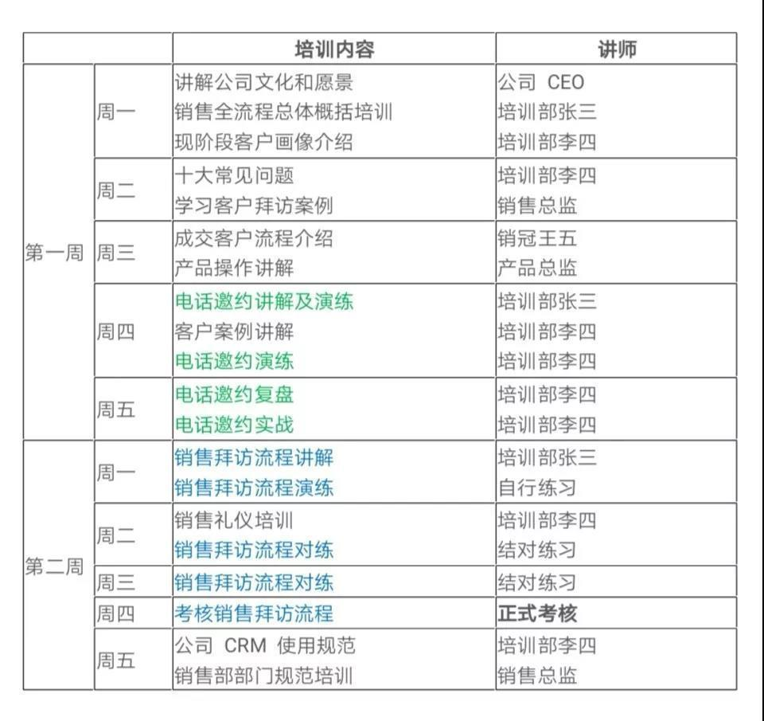
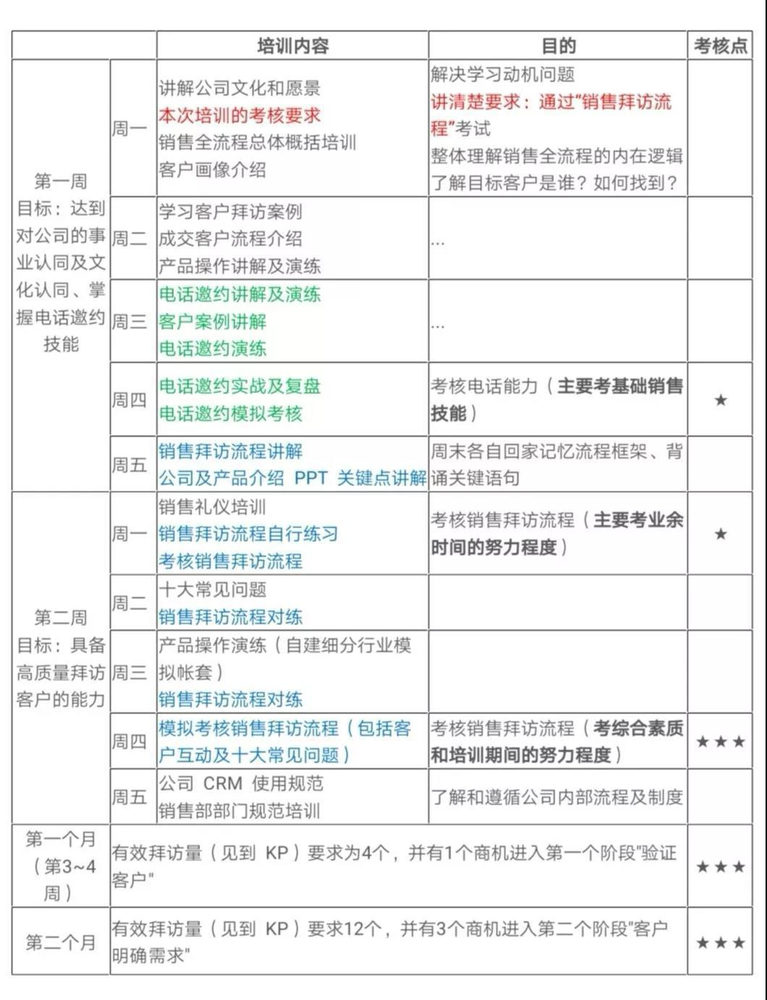
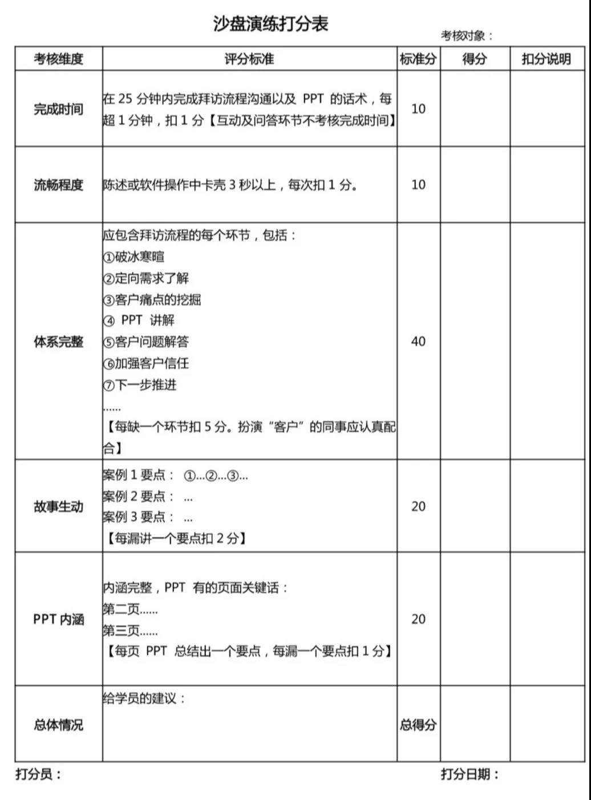

## 如何做好新员工培训？| SaaS创业路线图（52）  

> 发布: 吴昊@SaaS  
> 发布日期: 2019-07-02  

编者按：本文来自微信公众号[“SaaS白夜行”（ID：SaaSKnight）](https://mp.weixin.qq.com/s/p8NFhz705X7PiDYdxhNAhA)，作者吴昊SaaS，36氪经授权发布。

**作者介绍** **-** 吴昊，多家SaaS公司常年战略及营销顾问，SaaS系列文章作者，目前正在筹划写一本SaaS创业书籍。我的每篇文章都来自SaaS公司实战中的困惑，基于我的经验和思考给出解决问题的思路。但解答未必全面，欢迎大家在文末留下自己的疑问或建议，我的书将因此获益，也因此能帮到更多的SaaS同路人。

（SaaS创业路线图）

我系列文章《[SaaS创业路线图（十九）做好团队培训的关键是什么？](http://mp.weixin.qq.com/s?__biz=MzIxNjc2MTc2MQ==&mid=2247483860&idx=1&sn=48ebc2e27b1b08e8fdae259cf1b5f7c7&chksm=9785551aa0f2dc0cabccef4b136bd60fd39fb0080242f5028b51e56189b0e3950d1db31cabfa&scene=21#wechat_redirect)》中提到过：作为新员工入职培训，“筛选”是第一目的。

正好最近同时有2家我做咨询的SaaS公司都在做新员工培训计划，我也做了进一步梳理。今天就借此机会更深入地探讨新员工培训的话题。

在讲培训新员工之前，我先明确一下，“无标准，不复制”。

如果缺乏标准的销售打法，大批招募新人的风险极大。少量招几个新人，还能通过“师傅带徒弟”勉强混过去；一旦招的人多、频率快了，“老师傅”自己忙不过来，缺乏带人的“套路”，大量时间投入却不能见效，“老师傅”自己和新人的业绩就都保不住了。

所以团队扩张期，一定要关注“人效”（人均月产出），既要把新人老人混在一起看（作为每个小团队能否扩张的前提）；也要拆开看入职1个月的平均人效、入职2~3个月的平均人效、入职3~6个月的平均人效，以此评估培训效果、快速调整。

### 一、 **培训计划和思路**

这是一个SaaS公司的销售负责人发给我的培训计划：

我们可以看到，这个培训计划做地还是很细心的，主要包括两部分内容：电话邀约（绿色部分）和拜访流程（蓝色部分），两部分内容都遵循：讲解——演练——实战/考核的过程。这也说明，该公司在销售打法标准化上已经有所积累。

看下来，大部分人会觉得这是一份很正常的培训计划表吧？

其实这个培训计划很单薄，如果我的培训主管提交了一份这样的培训计划，我会提出以下问题：

\* 培训的目的是什么？

\* 培训的考核目标是什么？如何通过考核达到培训目的？

\* 培训的考核目标如何传递给每个新员工？有没有激发他们努力学习的积极性？

\* 有没有给新员工一个清晰的路径，告诉他如何努力就能达到考核目标？

\* 有没有给新员工充分的信心，相信自己能够通过这个路径达到目标？

\* 这条路径上有哪些关键的里程碑（考核项目）？

\* 新员工在第一个、第二个里程碑的考核不能过关如何处理？

\* 新员工在最后一个里程碑不能过关如何处理？

我的建议是，一个培训计划不能只有个时间表，而应该包括以下内容：

\* 公司介绍（讲清愿景/文化和发展机会）， **要能够解决学习动机问题**

\* 一定要 **讲清楚考核要求** ，例如：“第9天顺利通过“销售拜访流程”考试”

\* **考试不要放到最后，而应该分阶段进行** ，目的是：①增加紧迫感，每隔3天左右都有一个要考核的项目；②加快淘汰频率，不合适的人不要留在团队里影响其他人。

\* 基于上面这条，我的建议是：第一周增加一个电话邀约模拟考核；“销售拜访流程考试”时间提前到第6天，但只考“陈述价值”部分，60分过关；第9天，增加一次完整考核（加上与“客户”的模拟互动和十大问题解答），80分过关。

\* **讲清楚如何达到培训要求，训练强度应该是怎样的** 。比如说，练习10遍以上，顺利脱稿讲通3遍以上；两人结对练习5遍以上。

\* **补充后续月份的工作要求** ：第3周起，每周由销售主管拜访1次，并开"药方"（提改进建议）；第1个月，有效拜访量（见到KP）要求为5个，并且商机（进入第一个阶段"验证客户"）要求1个。

\* 第2个月考核：有效拜访量（见到KP）要求12个，并且商机进入第二个阶段"客户明确需求"3个。

以上数字每家SaaS公司都不同，需要根据情况调整。上面没有说到“成交”要求，是因为该企业的客单价超过20万，平均成交周期为2~6个月，所以无法在短时间内考核成交业绩。但越是周期长，越需要考核销售过程，所以增加了对商机阶段的考核。

说了半天背后的逻辑，为了方便理解，我还是输出一个更清晰的培训计划表给大家参考：

### 二、 **沙盘模拟演练**

上面多次提到过沙盘/模拟演练考核，简单介绍一下其形式：几个人坐在一起，一人扮演客户（或多人扮演客户企业中的多个角色）和几个打分员一起考核一位业务员。

沙盘演练（或称模拟演练）的价值是：可以迅速发现团队成员的业务短板、对标准化销售打法的掌握程度和积极努力程度。

相比主管陪访，沙盘演练的优势是：

\* 更节约时间（陪访有时会遇到客户不配合、拜访流程无法走完的情况）

\* 避免尚未合格的业务员打扰客户挫伤品牌形象

\* 更全面地暴露考核对象的能力短板

\* 可以周期进行（ **建议每1~3个月做一次沙盘演练考核，这可以保障所有业务员的技能水准维持在高位上** ）

我们的口号是：平时多流汗，战时少流血。沙盘演练就是最好的练兵工具。

### 三、 **关键的打分表**

那么沙盘演练考核的关键是什么呢？

我还是强调标准化，也就是说，从公司策略设计的角度看，一个高品质、标准化的打分表对沙盘演练考核的质量至关重要。

**一个好的打分表，让不同打分员给出的分数相对接近。** 它提供了一个客观标准，减少因为分数扯皮（当然不能完全避免，所以打分员要有权威和行为公正）。

**一个高品质的打分表也明确了学员们学习的目标** —— 打分表在内容培训结束后就可以发给大家，不必藏着掖着。所以打分表上强调的，一定与业务上的重点一致。

最后，我列一个“首次拜访KP流程”沙盘演练的打分表给大家参考：

按照本打分表，一个学员沙盘演练过关的标准是80分，优秀标准是90分（这个标准是扣分制，得到90分还是相当难的）。

这篇“新员工培训”就先讲到这里。此外还有很多“新兵训练营”运营方面的工作，我放在今后要写的另一篇“销售运营”里再系统介绍。
