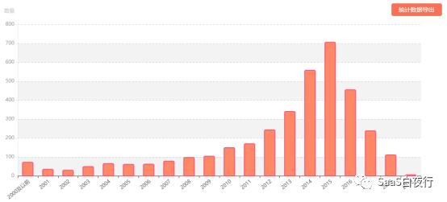
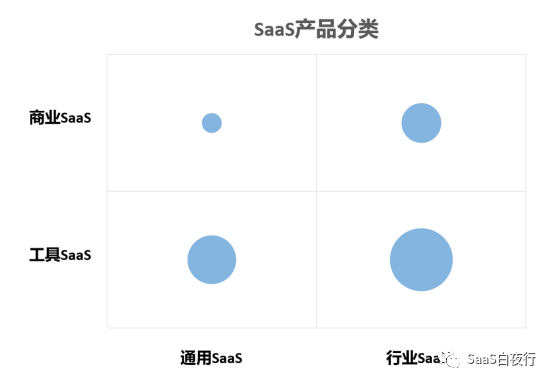
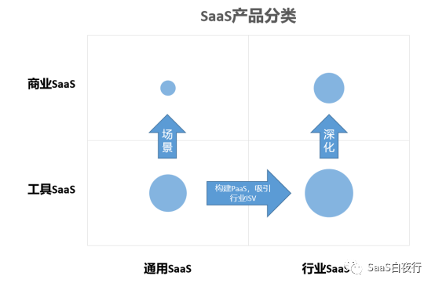

## SaaS产品分类及其发展方向 | SaaS创业路线图（55）  

> 发布: 吴昊@SaaS  
> 发布日期: 2019-07-23  

编者按：本文来自微信公众号[“SaaS白夜行”（ID：SaaSKnight）](https://mp.weixin.qq.com/s/bMUWGGGKkJ-AGW9RP5saPA)，作者吴昊SaaS，36氪经授权发布。

**作者介绍** **-** 吴昊，多家SaaS公司常年战略及营销顾问，SaaS系列文章作者，目前在撰写一部SaaS创业书籍。我的每篇文章都来自SaaS公司实战中的困惑，并基于我的经验和思考给出解决问题的思路。解答未必全面，欢迎大家在文末留下自己的疑问或建议，我的新书将因此获益，由此也能帮到更多的SaaS创业团队。

（SaaS创业路线图）

上周五我作为评委参加了“腾讯SaaS加速器（首期）”复试活动。有122家不同阶段的SaaS公司参加了复试，将有30家公司最终入围加速器的培养计划。

最近艾瑞咨询也出了一份[《2019年中国企业级SaaS行业研究报告》](https://36kr.com/p/5211916)，质量也很不错，推荐大家找来读读。

在国内，业内普遍认为2015年是中国SaaS元年。2014~2016年，企业服务市场，特别是SaaS领域的融资达到了一个高点。根据“IT桔子”（itjuzi.com\)在2019年7月3日的统计数据：目前国内在运营的3629家SaaS公司中，有近一半（47%）是2014~2016这三年中创立的。

（数据来源IT桔子itjuzi.com）

我们认识一个新事物，除了定义，往往是从分类开始的。中国这么多SaaS公司，

如何进行分类呢？

从指导SaaS公司战略的角度出发，我推荐按照两个维度给SaaS公司分类。

### 一、通用SaaS vs 行业SaaS

**通用SaaS产品：**

跨行业的通用产品。例如，北森和Moka的HR产品、纷享销客和销售易的CRM产品、UDesk和智齿科技的智能客服。

**行业SaaS：**

在某个行业内使用的产品。例如，奥琦玮和客如云的餐饮企业SaaS、聚水潭和旺店通的电商SaaS、云朵课堂和校宝在线的教育机构SaaS等。

简而言之，通用SaaS是聚焦某个业务但客户群体是跨行业的，行业SaaS是聚焦一个行业内的多个业务的。

这次腾讯SaaS加速器上，通用SaaS与行业SaaS各占一半。从我接触的大量SaaS公司信息看，2016年及之前创立的SaaS公司中，通用SaaS占比较高；之后随着通用SaaS的赛道被占满，新创立的SaaS公司做行业专属产品的比例更高。

_（实心圆大小——代表市场上该类型SaaS产品的数量）_

### 二、工具SaaS vs 商业SaaS

2016年之前出现的SaaS产品是大多是“工具SaaS”。工具SaaS的主要特点是：为客户企业提供了一个 **提高管理效率的工具** 。这和传统软件的价值一致：做SaaS CRM的还是辅助管理客户、提高销售团队效率的CRM，做SaaS HR系统的还是提供提高人力资源部门工作效率的HR系统。

与传统软件相比，工具类SaaS有很大优势，主要是“按年续费”有产品及服务进化机制上的优势。观察美国SaaS领域的发展状况，也可以看到工具SaaS是主战场。

国内有一个SaaS创业者聚集的社群叫做[“崔牛会”](https://36kr.com/user/17153628)。2018年5月份我与“崔牛会”创始人大崔交流，他和我都注意到一个新类型在国内逐渐出现——“商业SaaS”。

商业SaaS的特点是：除了提供一部分“工具”价值外，还能 **为客户企业增加营收、提供新的营收项目。**

说白了，工具SaaS通过提高效率帮助客户 **省钱** ，而商业SaaS帮客户多 **挣钱** 。

当然，后者是模式创新，已经超过了传统IT人的舒适区；该商业模式的风险也要大得多。

国内的“工具SaaS”十年来历经磨难，2015~2016年大量融资后营收也未见起色。但云化趋势是能推导、也能看得到的，toB业务不可能太快，每年增长30~50%已经很不错。

而商业SaaS产品虽然风险更大，但在国内低管理水平、不成熟的商业环境下，更容易实现快速实现客户价值和自我价值。

商业SaaS有哪些方向呢？我亲眼看到的有下面这些：

**引流**

SaaS产品帮助企业获得更多新客户。引流SaaS往往通过微信关系链、私域流量等方式运转。 **获客工具往往有效果不可持续的风险** ，客户企业也常常由于自己不会运营而影响效果。我看到这类SaaS公司往往需要进行重度专业知识培训、甚至提供代运营。

**切交易**

例如，聚合支付平台就有这个能力，客户企业按使用聚合支付资金流水的x‰支付费用。

**提供金融服务**

为金融机构提供客户企业授权信息，获得金融机构的佣金。我推测未来也会逐渐有更深的方式：例如直接做风控管理提供贷款，当然建立风控体系成本很高，要GMV足够大才能承担。

**供货**

这次参加加速器评选前我还真没想到，国内已经有SaaS企业在很垂直的领域内能够介入到供应链中，为制造企业供货，GMV已达百亿，公司营收及利润也较可观。再想想，美团不也一直在这个方向上努力吗？如果美团占领足够多的餐饮SaaS系统份额，“美团快驴”（进货平台）的价值也会更大。

**提供决策及运营数据**

这个容易理解，如果只是企业内的数据，只能做内部报表；如果能够在部分客户的授权下，提供行业、地域等范围分析，将有更大价值。

**产业互联网**

再往上说，SaaS公司有可能参与到某些行业或领域的产业互联网改造。这些改造肯定要用到SaaS公司的数据或IT能力。有些供应链、价值链的改造可能是SaaS公司主导，当然也可能是行业或领域的寡头企业主导。

### 三、业内对SaaS公司是否该做“商业SaaS”争议颇大

我总结了一下，其中“工具派”认为：作为一个SaaS公司，其优势在于技术和软件工程能力，而非互联网创新。创始团队里可能并没有某个行业的专家，即便有行业专家也未必正好有互联网创新的思考方式，上述新模式的商业风险很大，SaaS公司不应该参其中。SaaS公司就应该不断在专业领域里打磨自己的产品，逐步提升产品价值和服务效果，实现公司的商业价值——提高管理效率。

我认为“工具属性”是SaaS产品的基础，如果本身不是好工具，也很难在竞争中立足。如果咱们通个几年的努力，已经把“工具属性”做到80分、甚至90分了呢？

国内市场竞争将不断加剧、商业环境不断成熟，企业提升内部管理效率的新需求会自然增长，工具型SaaS公司进入成熟期仍然有机会每年增长20~50%（根据上文提到的艾瑞咨询年度报告数据，2018年SaaS市场规模增长47.9%）。

但如果我们稍微激进一些，从我上面提到的角度（相信还有更多其他角度）介入每个行业在“+互联网”时代的改造机遇，主动参与、甚至主动发起这些价值链改造，就有可能获得将公司市值（也就是公司对社会的价值）从几亿提高到几十亿、甚至几百亿的机会。SaaS团队如果在“工具”阶段已经具备基础，身为这个时代的弄潮儿，怎能轻言放弃？！

### 四、各类型SaaS产品间的转化路径

当然，也不是所有SaaS产品都能够转化。我列了几条路径，欢迎大家探讨。

**1、通用SaaS的PaaS路径**

通用SaaS在2015年前后被广泛看好，就是因为他们有类似Salesforce从SaaS到PaaS的发展机会。

**什么是标准的PaaS产品？** 在我看来，这要求PaaS平台有极其丰富、强大、便捷的架构和能力，令ISV（独立软件开发商）能够在PaaS上进行自有行业/领域产品的开发。这是PaaS的“成熟”形态。

在国内，我好像还没有看到过到达这个阶段的PaaS产品。钉钉和企业微信勉强能算，但如果只提供IM（即时通讯）、考勤打卡、账号体系这么浅的能力，对ISV的价值也不大。毕竟腾讯、网易都有产品可以提供IM支撑能力，不需要ISV自己开发，还不用ISV放弃自己的App。

国内的SaaS公司有不少都在做PaaS，但目前大多还在较早期的阶段：

a、SaaS产品提供了二次开发接口，允许客户自有研发团队或其系统集成商在上面做项目级定制开发；（到这个阶段只能说，比SaaS自有研发团队扑上去做“项目定制开发”好一些，至少未来SaaS产品的版本是统一的；将来SaaS产品升级不影响定制开发模块的使用）。

b、能够让公司 **内部SaaS团队** 在 **内部PaaS** 上开发。这个已经与Salesforce的PaaS接近了，但在可用性、易动性、健壮性、可扩展性等方面应该都还有很大的提升空间。

能够走PaaS路径的一定是通用SaaS产品。 **对于行业SaaS来说，做PaaS有点儿小题大做** ，做好数据库设计和可复用组件更靠谱些。当然，如果为了让市场易于理解，把自己叫做PaaS为其它应用提供服务也未尝不可。只是心里要清楚，真别按PaaS的规格要求来做。

“PaaS路径”在中国能否走通、是否还有时间窗？这也是业内争议较大的问题。

我个人认为，国内的通用SaaS公司先完成自己商业上的闭环，也就是说先实现盈利，更重要一些。 **因为只有那些市场能快速检验的，才有机会快速迭代出真正市场需要的产品。** 而快速完成小闭环、然后在其基础上不断做成更大的闭环，才是互联网的思维方式。

**2、行业SaaS从“工具”向“商业”转变**

本文第二部分，主要说的就是这类转变。行业SaaS公司的创始团队大多来自该行业，甚至投资方就是该行业的头部企业，拥有深厚的行业资源和行业认知。

他们在完成了“工具”价值后，在SaaS功能和“数据”的基础上，有机会帮助客户企业：获得更多客户、增加商业增长点、提供新的产品，甚至介入整个供应链、价值链的再造过程.......

**3、通用SaaS增加“场景”价值**

做通用SaaS的公司，我觉得不能轻易放弃原有阵地转向“行业SaaS”。因为转“行业”是需要有天生DNA基础的。

我的建议是要设法找到多个行业中较常见的、能给客户带来增值价值的“场景”。其实现在的通用SaaS中就有不少是切“场景”的：上上签和法大大的电子签约、分贝通和易快报的企业消费管理、同盾的大数据风控服务等。

这些SaaS产品解决的是某特定场景的业务管理需求。相对“通用+工具SaaS”，“通用+商业SaaS”的使用场景更具体，业务边界也更清晰。场景具体了、产品价值锋利了，营销环节才容易突破。

（说明：因为个人信息量所限，以上提及的企业及产品名称排名不分先后；另外，也有大量优秀SaaS企业未被列出）。

今天谈的也是个非常新颖和开放的话题，欢迎大家留言探讨。

**相关文章链接：**

[SaaS创业路线图（廿四）- SaaS公司的商业模式](http://mp.weixin.qq.com/s?__biz=MzIxNjc2MTc2MQ==&mid=2247483908&idx=1&sn=22b8e06068a887755f4165fe1da38f8f&chksm=978556caa0f2dfdcfb906f86ac3edca18084d27f9c18d4c078f7b5a09451ed041118046bf1f0&scene=21#wechat_redirect)

[SaaS创业路线图（三十）再谈商业模式：SaaS公司应该做IT工具还是业务运营？](http://mp.weixin.qq.com/s?__biz=MzIxNjc2MTc2MQ==&mid=2247483938&idx=1&sn=fdba9b356127729fcedfa976f90da3b4&chksm=978556eca0f2dffa922a86c33be05149408968dbf5a68de149fa6c838fff2e54579118965bde&scene=21#wechat_redirect)
