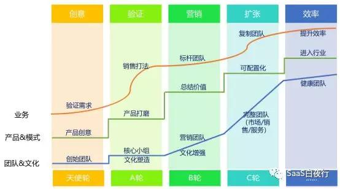
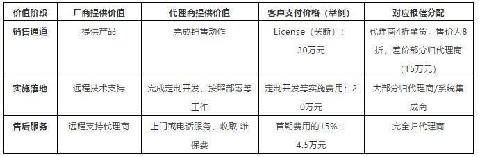
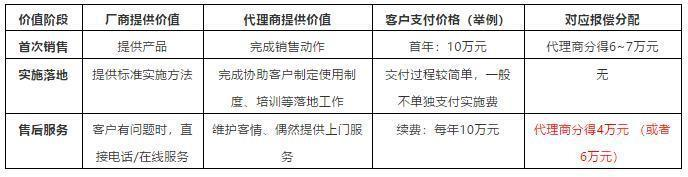

## SaaS公司渠道价值探讨 | SaaS创业路线图（54）  

> 发布: 吴昊@SaaS  
> 发布日期: 2019-07-17  

编者按：本文来自微信公众号[“SaaS白夜行”（ID：SaaSKnight）](https://mp.weixin.qq.com/s/DzXZUTz2PNRq1aXXywyBZg)，作者吴昊SaaS，36氪经授权发布。

> 作者介绍-吴昊，多家SaaS公司常年战略及营销顾问，SaaS系列文章作者，目前也在撰写一部SaaS创业书籍。我的每篇文章都来自SaaS公司实战中的困惑，并基于我的经验和思考给出解决问题的思路。解答未必全面，欢迎大家在文末留下自己的疑问或建议，我的这本书将因此获益，由此也能帮到更多的SaaS同路人。
>

（SaaS创业路线图）

有朋友问我，你的“SaaS创业路线图”系列已经写了五十多篇了，为何没有讲到“渠道”？是的，对于toB销售，渠道应该与直销并重。但我对常规SaaS产品代理体系的价值一直有个很大的疑问，这是我以往不写渠道的主要原因。

当然，随着我深度接触到更多SaaS公司，我对渠道代理商体系的价值有了不同的看法，遂成此文。这次的思考还是很初步的，希望通过这篇文章引起大家的探讨。

**一、传统软件代理商的价值**

对传统软件厂商来说，代理体系提供的价值有三种：

\* 销售通道：把产品销售给客户（相当于厂商直销部门）

\* 实施落地：帮客户完成产品落地部署、系统集成、上线培训等（相当于厂商实施部门）。有系统集成能力的代理商或专业服务提供商，也被称作系统集成商（SI，System Integrator\)。

\* 售后服务：持续上门或电话维保服务（相当于厂商售后部门）

传统软件代理商会承担上面一项或多项职责，对应获取相应报偿。

举个常见的例子，假如厂商A的产品通过代理商B销售给客户：

如果只是销售简单的盒装软件，第二项“实施落地”的费用就很少，第三项“售后服务”的费用也很难收到了。

在这样的价值分配体系下，我们常常见到一个金蝶、用友的软件代理商公司里，实施、开发工程师的人数会比软件销售业务员的人数多几倍。其提供的是多个阶段的价值，也因此得到多个阶段的报偿。

**二、常规SaaS代理商的价值**

我们都知道，SaaS提供的是在线服务，其收费模式与传统软件不同。除了每年收年费，10万客单价以下SaaS产品的交付过程基本不存在安装部署和定制开发的工作（大客户交付会有一周至几个月的实施过程，但也很少涉及代码级开发）。

我们分析一下SaaS代理商在SaaS服务价值链中提供的服务和价值。为了方便理解，我还是举个具体的例子：

右下角这个方块，也就是续费怎么分？这是目前SaaS厂商与代理商最大的争议点。

从SaaS续费模式来说，SaaS公司提供的售后服务已经升级为“客户成功”服务：不再是被动响应客户的疑问，而是要主动帮助客户用好产品、用深产品，以期客户能够按时续费，并有增购新模块、扩容的机会。

同时，按照SaaS公司的商业模式，如果续费分不到“大头”（50%以上），那么可预期的收入就大大降低，SaaS公司的估值都会受很大影响。

但对代理商来说，有一个很大的疑问—— “客户到底是谁的？”

“本来这客户是我找到的，也是我签下来的，但我只在第一年的费用里拿‘大头’，后面的续费我只拿一小部分？”

再加上，厂商可以直接联络客户、客户很多产品方面的问题只能厂商解答，代理商对“客户归属”问题有强烈的不安全感。

—— 我一直不想写这个内容，就是担心写出来会影响咱们SaaS公司与代理商的合作关系。

**但如果我们不正视这个重要的话题，SaaS厂商的渠道就发展不起来。** 今天的现实就是如此，整个国内SaaS圈子里的几千家SaaS公司，有健康代理体系的屈指可数。

“可数”的这几家，大多还是SaaS厂商委曲求全，也就是 —— 把“续费”的大部分返给代理商的。

**三、SaaS代理商的价值设计**

如何解决这个困局？

我认为根上的原因，还是代理商提供的价值不够。传统软件代理商中，稍微上点规模的公司大多都同时具备“销售”、“系统集成”两个能力。

而我们的大量SaaS代理商，还是偏互联网代理的能力模型，只重视销售，而在掌握产品特性、解答客户疑问、帮助客户分析业务流程等方面能力单薄。

当然，这个责任最终还是落在SaaS厂商身上：厂商有责任做好“代理商的价值设计”—— 代理商能提供哪些价值，首先还是与SaaS厂商的产品、收费价格体系有关。其次，也与厂商渠道部的战略设计、落地能力有关。

**SaaS产品的价格体系中，如果只有单纯的软件服务年费，代理商除了首次销售，之后的价值确实没多大。**

好在通过与几家渠道方面比较成功的SaaS厂商交流，我还是看到了几种有希望的模式：

\* 有的SaaS产品的收费本身就是“软件服务年费 + 交易分成”的模式，当地代理商可以承担运营/服务工作，然后就能在“交易分成”中占一部分比例、获得相应报偿。

\* SaaS产品比较复杂，当地代理商可以为客户提供“代运营”的服务，帮助客户用好产品、得到更多价值。这是对代理商价值的提升。对厂商来说，这样做也保障了SaaS产品的上线成功率，对未来续费意义巨大。

\* SaaS产品的使用过程中，客户还额外需要很多客制化的内容，当地代理商也可以通过提供内容带来增值。

也就是说，代理商无论是提供：代运营、内容服务、业务梳理等深度实施、甚至是传统软件时代的“系统集成”、“定制开发”......只要是能在SaaS产品的基础上把“蛋糕做大”，我觉得代理体系的价值就突显出来了，代理商与厂商就不再是“零和游戏”。

此外，我还见到一些代理商用偏门的路子：代理商在SaaS产品上不挣钱，但通过这个知名的SaaS产品获得客户，然后再销售别的产品或服务。其中好坏，我就请大家自己评说吧。

今天这篇的主题是从价值的角度分析如何建立成功的SaaS渠道代理体系。在本篇的初稿完成后，我与几位亲手建立过全国大渠道体系的大佬交流，也在某个SaaS CEO的群里听大家的看法，我发现归结起来有两种实现路径：

**\*路径A —— 利用现有资源，也就是其它厂商的代理商，建立自己的渠道。** 这样的方式比较受限于既有代理商的能力。路径A显然更容易，这也是大部分厂商选择的路线。不过也可以看到，路径A小成很快，大成很难。

**\*路径B —— 根据价值设计（就像上文写的），重新寻找能力和意愿双匹配的企业或个人做新代理商，重建渠道代理体系** （也可以设法改造既有代理商，但这比培养新招进的代理商更难）。路径B的风险是：新代理商存活率有大？新老板做代理是否能持续？总之，稳定性方面的风险可能会造成投入产出不成比例。

至于具体怎么选择，需要结合自身战略目标、短期目标、优势和短板，大家见仁见智了。

**最后总结一下：**

\* 只有常规软件服务年费的SaaS产品，厂商与代理商是“零和游戏”关系，年费就那么多，你多我就少，这样的渠道发展困难重重。（更糟糕地情况是，SaaS厂商允许代理商一次收取多年的软件服务费，这是典型的“饮鸩止渴”）。

\* SaaS厂商如果要做渠道，就有责任做好代理商的价值设计，让代理商承担一定责任也获得相应报偿。同时，SaaS厂商的渠道部门要做好赋能代理商的规划，这个我今后再单独写文章讲述。

今天写的内容比较敏感，肯定有不少不同意见，欢迎大家拍砖！大家拍过来的砖块，我都会做系统思考。
