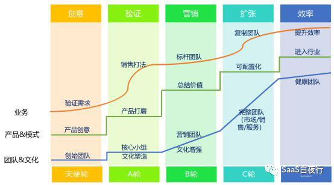

## 通过一个指标提高销售管理效率 | SaaS创业路线图（56）  

> 发布: 吴昊@SaaS  
> 发布日期: 2019-07-31  

编者按：本文来自微信公众号[“SaaS白夜行”（ID：SaaSKnight）](https://mp.weixin.qq.com/s/9pNbHtRGo9eou1ik02RWgA)，作者吴昊SaaS，36氪经授权发布。

**作者介绍** **-** 吴昊，多家SaaS公司常年战略及营销顾问，SaaS系列文章作者，目前在撰写一部SaaS创业书籍。我的每篇文章都来自SaaS公司实战中的困惑，并基于我的经验和思考给出解决问题的思路。解答未必全面，欢迎大家在文末留下自己的疑问或建议，我的新书将因此获益，由此也能帮到更多的SaaS创业团队。

（SaaS创业路线图）

一家年营收几百万的SaaS公司，有3个业务员，其中一位业绩不错，有时候在CEO和产品负责人的帮助下能开大单，但也有时候没有业绩；而其他2位则还欠缺见到客户的门道。

一家年营收几千万的SaaS公司，商机几乎完全来自线上，销售部门人月单产很高，但不知道成交到底是自然转化的，还是销售促成的？

一家年营收过亿的SaaS公司，商机基本依赖销售自开拓，每月都是几十个老业务员出业绩，新人换了一波又一波却留存不下来，士兵数不增长，业绩增长目标成为无源之水......

这些困惑，按照我在“[SaaS创业路线图（39）可复制的市场成功](http://mp.weixin.qq.com/s?__biz=MzIxNjc2MTc2MQ==&mid=2247483997&idx=1&sn=6a664dfe9564edf0284fcf5eb3bd4146&chksm=97855693a0f2df85865f225467cad08b4f88684333f111957fecb9f7225c151536b640d63135&scene=21#wechat_redirect)”中提出的方法，都是可以通过标准化销售打法和复制团队的套路来解决。

但从“可复制的成交（标准销售打法）”到“可复制的人才（招聘、培训）”，再到“可复制的团队”，这个过程需要6~18个月的时间，算是中长期的解决之道。

如果咱们目前的销售管理水平还处于我上面3个例子的水准，我建议可以考虑先从一个较为简单和见效快的方法着手：抓一个关键指标。

### 一、 **找到关键指标**

在我的系列文章“[SaaS创业路线图（53）如何制定销售目标？](http://mp.weixin.qq.com/s?__biz=MzIxNjc2MTc2MQ==&mid=2247484132&idx=1&sn=7202b76aa0534aa490a6b1a5eb0b93ef&chksm=9785562aa0f2df3c56066ad1e56d2eb8d7be36da43024bde6401631caa3ce8865714fbcfda82&scene=21#wechat_redirect)”提到过，从客户来源分，SaaS公司可以分为三类：客户主要来自销售自开拓、主要来自市场线索、两个来源较为均衡。我主要谈前2类，第3类的方法会更复杂一些，但原理一致。

**A、以销售自开拓客户为主的公司**

这类公司的销售业绩公式：

**新购业绩 = 成熟士兵数 x 成熟士兵月均单产（人效）**

这种类型的公司销售VP应该非常重视“成熟士兵”的数量。

我们假定该企业的销售有5个环节：找客户资料 — 电话邀约 — 拜访 — 提案 — 成交。从微观视角，可以看到一个销售漏斗：

**成交客户数量** = 提案数量 \* 提案成交转化率

而 **提案数量** = 拜访数量 \* 拜访提案转化率

**拜访数量** = 电话邀约数量 \* 邀约成功率

**电话邀约数量** = **客户资料数量** \* 客户资料有效率

以上5个粗体部分都是可以管理的数量指标。

那么一个公司应该选择哪个指标作为关键管理指标呢？

这与产品及客户、业务流程、组织特性有很大关系，各家有各家的选择。 **选择关键指标，我们要** **有“重要性”、“易操作”、“易复核”三方面的考量。**

如果是以面销（当面拜访客户）为主的团队，我经常建议抓“拜访量”指标：

1、重要性高：“拜访量”是面销团队的关键环节，可以说是最重要的过程指标；

2、易操作：现在外勤管理App很多，只要执行力没问题，数据是可以准确得到的；全公司各个团队的“拜访量”数量在系统里一目了然；

3、易复核：无论是基层主管、还是公司销售运营部门，都很容易抽查、复核该数据的准确性。

**B、以市场线索为主的公司**

这类公司的销售额公式为：

**新购业绩 = 有效市场线索的数量 x 线索成交转化率**

做了这个公式拆分之后，销售部门的任务就很清楚，就是设法提高“转化率”；而市场部门的职责同样清晰，就是“提高有效线索的数量”。

这句话看起来简单，但我看到很多公司在实际运用中错漏百出。

开篇第2个案例中的公司，考核销售就只看销售业绩。从低到高的业绩还对应从低到高的提成比例。这里带来的问题是，团队及个人的“业绩目标”、业务员个人“提成收入”这两个重要的管理标的都指向同一个方向，就是“销售业绩”。

但一个以市场线索为主的销售部门，最应该管理的是“（有效）线索转化率”。

我们至少应该把“转化率”作为与“销售业绩”同等重要（甚至应该是更重要的）管理指标。

这里也涉及到一个管理指标体系的问题，我们要有“均衡”的概念。如果没有相对制衡的2个指标，只强调一个“业绩”指标，很可能这个团队会发展成为只看业绩、不讲团队、经常为了利益吵地面红耳赤的“独狼”组织。

如何均衡呢？还是以这个例子往深里谈。

在以市场线索为主要客户来源的公司中，如果只对业务员考核销售业绩，业务员就会想方设法多占有更多的线索和客户，甚至某个成交是别人的功劳，自己由于拥有报备权也要想方设法去分一杯羹。

在均衡的设计下，则是另一个图景：一个业务员要想方设法完成自己的业绩目标，例如10万；同时要考虑自己的提成比例（例如转化率5%及以上提成10%，5%以下提成6%）会影响个人收入。这样他就会综合考虑，领线索到一定数量就不再申请，而把机会让给客户数量不足、还有更多精力的同事。

具体操作会比这复杂，例如还要考虑团队负责人的核心指标是什么？如何管理？这里举个例子是为了讲清楚原理。

### 二、 **定义关键指标**

“无文字，不管理”。一个指标确认下来后，一定要用准确的文字描述清楚、避免未来无意或恶意的歧义。

例如“转化率”，要说清楚分子是什么、分母是那个时间范围内获得、获得途径，甚至列明该“时间”采用运营系统中哪个时间字段？如果说到“续费率”，要说清楚是“金额续费率”还是“客户数续费率”？是否刨除某部分特殊客户？等等。

### 三、 **征集意见及宣传**

一个好的制度，应该是受到大家拥护的制度。

制度的设计，先是从上到下的全局考虑，然后是从下到上的意见反馈，最后综合考虑到各方意见设计出可操作、可衡量的方案。

这个征集意见的过程，也是宣传的过程。尽量让相关管理层和大部分同事参与进来。 **有时候反对者要的不是意见被采纳，而是过程中得到尊重。**

虽然这会消耗一些时间，但能一次成功落地才是高效。

### 四、 **数据的获取**

如何保证能够较低成本地获得指标数据？

这当然需要组织保障，每个数据节点上有一位明确的责任人。

我不建议为一个新管理举措上一套复杂的系统。我是学“管理信息系统（MIS\)”科班出身的，在这个领域，大学教授给我最深刻的认知就是：不追求新技术，能实现同样效果的老技术方案更稳健。

也就是说，初期能用Excel解决的，也没有必要上系统。当然，如果现有系统就能提供指标数据，当然更方便。

### 五、 **指标的使用**

上了新指标，管理者肯定会想马上把它放到KPI中，与薪酬挂钩。但我不建议这样做。

第一，新指标也需要建立“基线”。例如，拜访量多少合适？是每周3访还是每周5访？这个需要一段时间积累。

第二，新指标的使用对团队有个适应过程。

第三，凡是与钱挂钩的指标，都可能会被人为扭曲。

我以前带大团队，也考核过程指标 —— 当时每人1000元行动底薪与”拜访量“挂钩。结果呢，只有100人时还好办，可以高要求；团队有1000人时，因为涉及到团队成员的个人收入，团队负责人们就手软了：无效拜访也算进来、拜访老客户的算到拜访新客户里......

结果是，反而拿不到准确数据。某些团队拜访量月初已经出问题了，月底看业绩才被发现。

在管理中，与个人收入挂钩的激励方法都是很硬的，除此之外还有很多“运营”的方式可以做，包括“排名”、“积分”和“荣誉勋章”。而这三样也是一个电子游戏中最主要的3个激励手段，经常玩游戏的同学可以放飞一下。

最后，建立了指标基线（数值），指标就可以用到管理的各个环节。

有这样一个关键指标，总部就能够管理多个分公司、管理上百个分布在全国各地的团队，及时发现问题，给出解决方法。也同时降低了管理难度，也提高了复制管理者和团队的速度。

当然，建立更全面的指标体系，还有一个更漫长的过程。“[SaaS创业路线图（二）](http://mp.weixin.qq.com/s?__biz=MzIxNjc2MTc2MQ==&mid=2247483732&idx=1&sn=9e39952564254d9e1f8a4325d982d4a1&chksm=9785559aa0f2dc8c9aecce96054959d7106e380ff5d62f4e43195c891a9c794fc666655e580b&scene=21#wechat_redirect)”中的第八阶段描述过。至于建立指标体系的过程，我今后的系列文章再讲。

### 后记：

人性趋利避害，这是很正常的。

（在这一点上，我觉得英文词“nature”很传神，可以翻译为“自然”，也可以翻译为“本性”，就是“自然如此的特性”。）

人类商业社会的伟大之处在于：每个成员在追求个人利益的同时，也实现了社会价值。正如亚当·斯密在《国富论》里所说，一个面包师凌晨起床辛辛苦苦地做面包，不是为了帮助别人，而是为了养活家庭；但他的劳作却在客观上帮助千百人吃上了香喷喷的面包，实现了社会价值。

人类社会的机制是几万年进化出来的，有错的部分也会被自然法则削去。而我们在公司里设置机制时，更要考虑“人性”：令每个人都得到正确地引导，帮自己成功的同时成就公司。

我们常说， **没有坏的员工，只有坏的制度** 。如果公司里人人自私自利、侵害公司利益，那也许是公司的机制（进而造成文化）出了问题。
