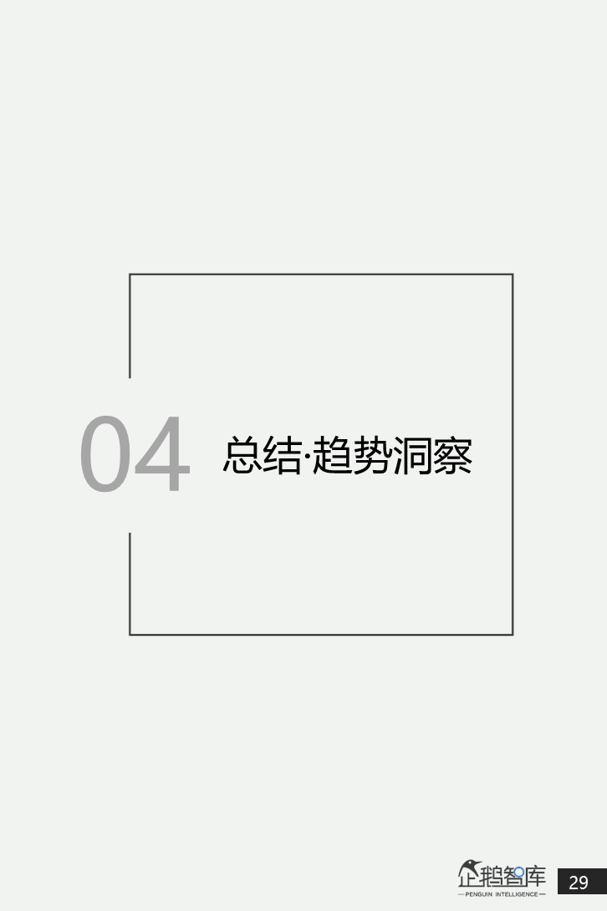

## 1.99亿“头部消费者”：中国白领网民生活&消费报告_36氪  

> 发布: 36氪的朋友们  
> 发布日期: 2019-08-27  

编者按：本文来自微信公众号“[企鹅智库](https://mp.weixin.qq.com/s/Azepz7E_8byo13DPnlkF7g)”（ID：BizNext），作者 腾讯新闻，36氪经授权发布。

>  _有些人不止在消费，_ _他们，还在带动消费。_

作为一个概念，“白领”被普遍认知；作为一个标签，“白领”被过度固化；而作为真实存在的一个群体，我们这个时代的白领们，他们的真实生活和心理，却是有些模糊的。

根据CNNIC发布《中国互联网络发展状况统计报告》，全国网民中月薪达8000元以上人数达到8870万，月薪5000-8000元人数达到1.11亿；在粗估范围内，我国白领网民约为1.99亿。

在整体网民中，他们具备更好的消费能力，更强的消费需求，和相对更高维的消费选择。此外，白领网民的消费理念与行为，对周边亲友的消费偏好也有着不容忽视的影响力。

如果按照平均每个白领网民，可以至少影响到1-2位非重复非白领人群做估算，中国白领网民在消费决策方面的间接影响力，或可额外再覆盖2-4亿人群（包括网民和非网民）。

在这个意义上说，研究中国白领网民，在今天的生活状态和消费观念，不仅是对这样一个庞大头部消费群体的有益洞察，还是对更广泛的中国消费者人群（被带动者）进行一次“提前眺望”，去预测他们在未来有可能出现的新消费特征。

为此， **企鹅智库** 通过对全国范围内25-45岁，月收入在8000元以上的核心白领网民，进行了抽样调研，并以他们作为核心研究对象，来呈现和分析整个白领网民群体的行为和心理，最终撰写发布了 **《中国白领网民生活 &消费调查报告》**。

>  **以下为报告正文：**

