## 潮起潮落，看SaaS如何理性突围？_36氪  

> 发布: 青桐资本  
> 发布日期: 2019-08-27  

编者按：本文来自微信公众号“青桐资本”（ID：qtziben），作者 爱观察的青桐资本，36氪经授权发布。原题目《青桐资本观察：潮起潮落，看SaaS如何理性突围？》

158起融资，31%年复合市场规模增长率，23万付费用户， **中国企业级SaaS自2018年以来，呈现持续回暖态势。**

青桐资本一直关注企业服务的投融资机会， **近期连续服务3个企服项目完成融资** ：成功助力数字化餐饮运营平台[「茂隆科技」](http://mp.weixin.qq.com/s?__biz=MzI5MDQ2NDMxNg==&mid=2247488890&idx=1&sn=0bf33b4722c270acec5bcaea43bd1c7e&chksm=ec1e2229db69ab3f4018195837ad670eaa774e2f7157f42b472c69a73237abf86ac15ab58999&scene=21#wechat_redirect)完成千万级天使轮融资、边缘计算技术与服务提供商[「江行智能」](https://mp.weixin.qq.com/s?__biz=MzI5MDQ2NDMxNg==&mid=2247489044&idx=1&sn=728a10473c0448b671a98f1b7f87f4c3&chksm=ec1e2147db69a851435def088e14b9e5b0127a5685c8a5b89f56449db565a368e95da2136a95&token=874421715&lang=zh_CN&scene=21#wechat_redirect)完成A轮融资和大数据商业决策服务运营商[「SIIT」](https://mp.weixin.qq.com/s?__biz=MzI5MDQ2NDMxNg==&mid=2247489101&idx=1&sn=97664fd3e27d255b41bf5b56ccde0cfe&chksm=ec1e211edb69a808d8c2d494cd333cdbb2cd5d199b99022194ecdaf603efe2d3fef0d17b6418&token=874421715&lang=zh_CN&scene=21#wechat_redirect)完成A 轮融资。

同时，青桐资本发起“企服专场”线上活动，邀请知名投资机构进行实战经验分享。我们邀请了斯道资本投资总监张矩探析了[《中国企业IT服务发展的制约与突破》](https://36kr.com/p/5232078)，光速中国基金助理合伙人王国栋分享了[《新周期里企业服务领域的机会和挑战》](https://36kr.com/p/5238577)。

在企服领域，SaaS告别了2015年高光时刻，发展趋于理性。本文 **将从通用型SaaS、行业垂直型SaaS两大具体类型** ，切入其更细分赛道，全面解析2019年1-7月企业级SaaS现状与机会点。

###  **SaaS持续回暖，付费用户增速达109%**

2019年1-7月SaaS行业 **累计发生158起融资事件** ，青桐资本研究发现，SaaS赛道自2018年回暖以来， **呈现持续增长态势，2019年市场整体继续向上** 。

从市场规模和付费意愿两个维度来看。 **2018年中国SaaS市场规模为243.5亿元，较上年增长47.9%** 。据艾瑞咨询预测，未来三年内中国企业级SaaS市场将保持39%的年复合增长率，到2021年整体市场规模将达到654.2亿元。

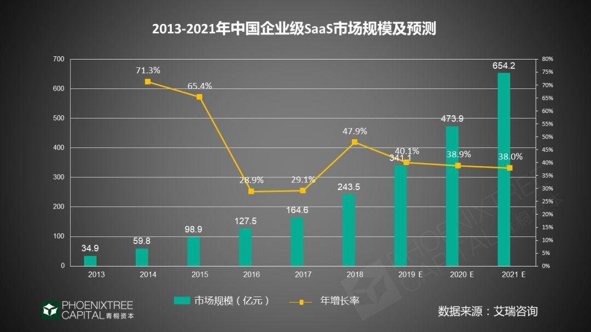

在 **企业对SaaS的付费意愿方面，2019年我国企业SaaS付费用户规模预计将超过54.6万户** 。据前瞻产业研究院数据显示，2018年企业SaaS付费用户规模已达23万户，与2017年相比，增速达109%；对比2013年的1.3万户，五年复合增长率高达78%。无疑，国内企业用户对SaaS服务模式认可度提升，SaaS的商业化和盈利将更有空间。

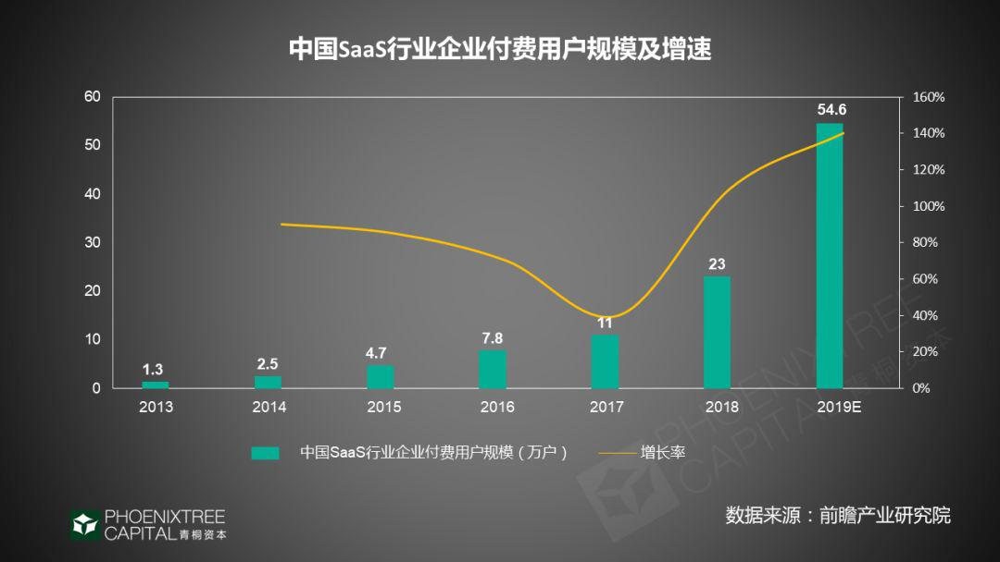

SaaS在国内的发展历程，可谓跌宕起伏、呈曲折向上。2015年被称为中国SaaS元年，据企名片数据，其融资数量达到高点共369起。2017年则是SaaS的发展分水岭，融资数量骤减，呈断崖式下滑。2018年，资本对SaaS的关注开始回暖。市场对SaaS的发展，也趋于理性。 **在企业级SaaS赛道，很少有爆发式的创业公司，无疑，这是一个需要时间的赛道** 。

另外，来自安信证券《风起云涌看 SaaS——中国 SaaS 行业有望迎来跨越式发展》报告也指出，国内 SaaS 行业整体发展落后美国 10 年左右。国内SaaS市场预期与发展模式，一直以来参照美国SaaS市场。必须看到，美国SaaS 产业已进入成熟期，才逐渐出现了Salesforce、Workday等巨头。 **中国SaaS厂商，面临独特的国内市场环境，移动化的普及、电商的发展等机遇** ，无疑将在本土化方面有更大的发展空间。

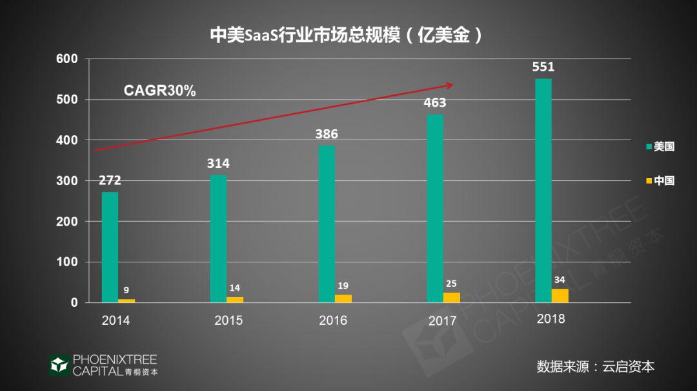

###  ** **2019年SaaS赛道投融资分析****

纵观2019年1-7月国内SaaS投融资情况，青桐资本统计，累积共发生158起投融资事件， **其中通用型SaaS有75起，行业垂直型SaaS有83起。**

从融资轮次来看，A轮项目有26个、B轮26个、C轮19个，D轮4个、战略投资20个， **融资轮次开始往中后期集中** 。

从融资金额来看，青桐资本发现， **有29个项目融资金额上亿** ，占比近20%。其中， **HR SaaS 最多** ，有6个项目融资金额上亿，分别是：点米科技，易路软件，Moka，盖雅工场，乐才科技，iWork365；随后是数据分析类SaaS，有3个；ERP、零售电商、餐饮、视频类SaaS各2个。

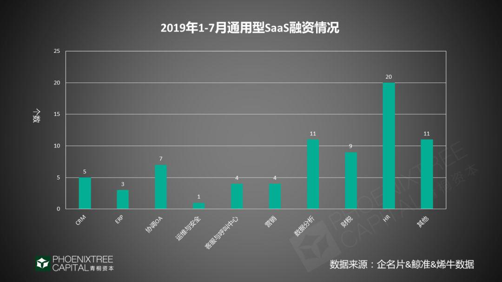

在通用型SaaS方面，融资数据显示， **资本更为青睐3个细分赛道：HR、数据分析，财税SaaS。** 青桐资本研究发现， **HR SaaS有20个项目获得融资，位居首位** ；随后是数据分析类SaaS有11个项目、财税赛道有9个项目。3个细分赛道的融资占比累计超53%。

**在行业垂直型SaaS中，受到资本关注的细分赛道有：零售电商、金融、医疗、餐饮行业。** 其中 **零售电商SaaS最受资本青睐** ，有21个项目获得融资。

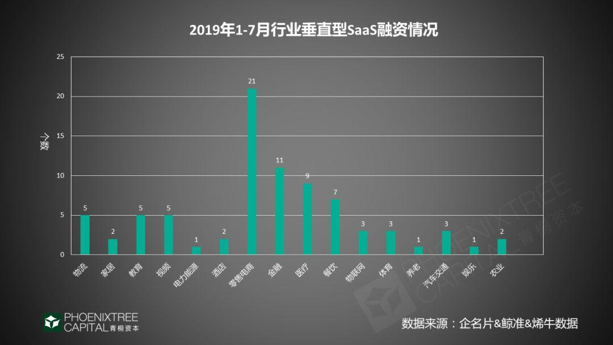

青桐资本研究发现，2019年1-7月互联网巨头在SaaS领域频繁出手，其中 **腾讯完成7起投资；阿里、京东各投资了2起** 。

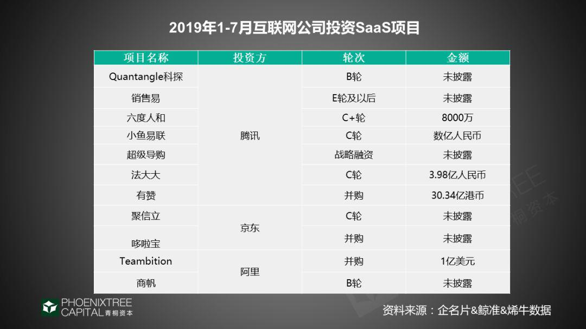

###  ** **通用**** ** **型SaaS后起之秀：HR和财税赛道****

通用型SaaS一直占据中国企业级SaaS主要市场份额。来自艾瑞咨询数据显示，2018年中国 **通用型SaaS市场规模已达到140.2亿元，同比增长42.1%。**

从通用型SaaS的细分类型来看， **CRM市场规模最大** ，约占通用型SaaS 20%；其次为客服与呼叫中心占15%、ERP和通信SaaS各占11%。而从资本青睐角度，2019年截至7月，通用型SaaS累计有75起融资事件中，HR、数据分析、财税SaaS这三个细分赛道更受资本关注。

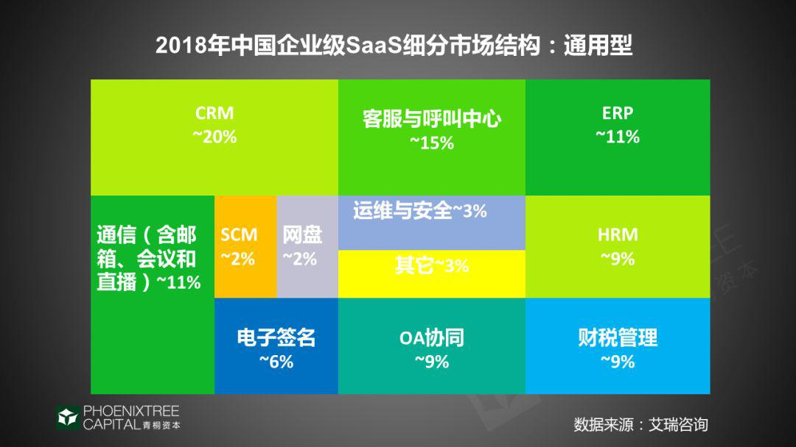

> CRM赛道：格局分散， SCRM崛起

CRM是SaaS行业中率先发展起来的赛道， **核心价值在于导流** ，帮助企业加强销售管理，提升销售效率，能够直接增加收入，因此企业客户付费意愿强。来自Analysys易观报告《中国SAAS CRM市场规模趋势预测2017-2019》预测，2019年中国SaaS CRM市场规模将达到67.9亿元人民币，而在2015年其市场规模仅有23.1亿。

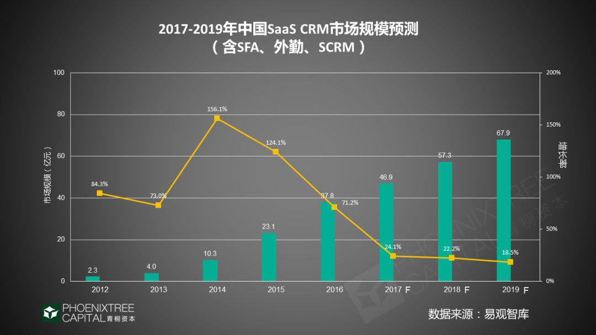

在CRM SaaS赛道，玩家众多，竞争激烈，整体市场比较分散，并未出现绝对的头部公司。

从玩家类型来看，主要有4类： **第一类** ，从传统大型软件公司成功转型，如用友网络，据公司披露的2019半年报显示，SaaS 收入2.86 亿元，增长133.6%。 **第二类** ，互联网巨头，如阿里钉钉、腾讯企业微信。阿里巴巴截至2018年6月，企业客户数量超过700万家；企业微信截至2018年4月，已渗透到50多个行业，注册企业150万家。 **第三类** ，新兴的SaaS 模式CRM 服务供应商，包括八百客、百会和XTOOLS等。 **第四类** ，完全根植于移动端的新型CRM厂商，以纷享销客、销售易和红圈营销为代表，其中，销售易获E轮融资、红圈营销登陆新三板、纷享销客获金蝶国际战略投资。

**SCRM社会化客户关系管理细分赛道崛起。** 根据Forrester 的调研显示，中国城市消费者的社交媒体使用几乎贯穿整个客户购买生命周期的始终。SCRM 的价值，基于社交平台完成用户信息数据搜集，对用户兴趣、社交行为、影响力等做数据分析，并促进裂变产生，从而帮助企业提高营销效率。 **SCRM主要玩家有“六度人和”、“致趣百川”等** 。

> ERP：头部玩家集中，国产品牌占优势

ERP的产品线相对较长，流程全面，涉及企业采购、生产、仓储、销售等多个部门，相比于其他通用型SaaS，定制化程度较高，开发周期较长，因此其SaaS化进程相对较慢。 **据华金证券研究所预测，2020年我国SaaS ERP市场规模将接近115亿元，SaaS ERP 渗透率达到25%。**

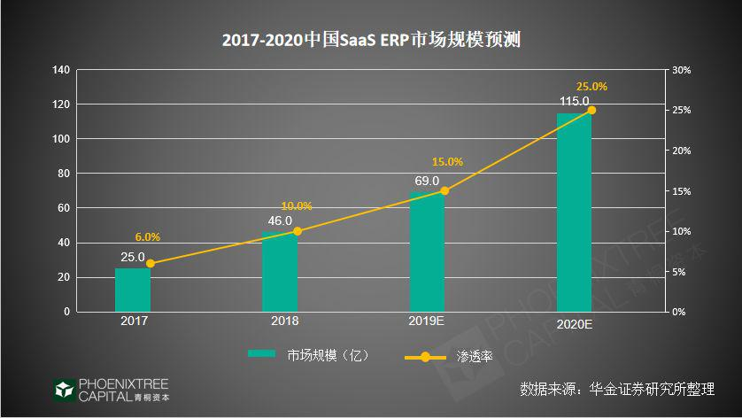

国内SaaS ERP市场格局，头部玩家集中， **用友** 从传统 ERP 软件转型做SaaSERP，凭借其客户资源和行业经验优势， **市占率迅速实现第一** 。来自2017年中国产业信息网数据，用友、SAP、金蝶，分别以 31%、14%和12%占据前三的位置。另外，国产品牌在ERP市场占据绝对优势，在中国前十大 ERP 软件中，有7席为国产品牌，总市场份额达69%。

> HR SaaS： 大器晚成

HR SaaS无疑是资本的香饽饽。来自中商产业研究院数据，我国人力资源服务市场的规模由2013年约1584亿元增至2017年3436亿元，复合年增长率为21.9%，并预期于2022年增至8427亿元。

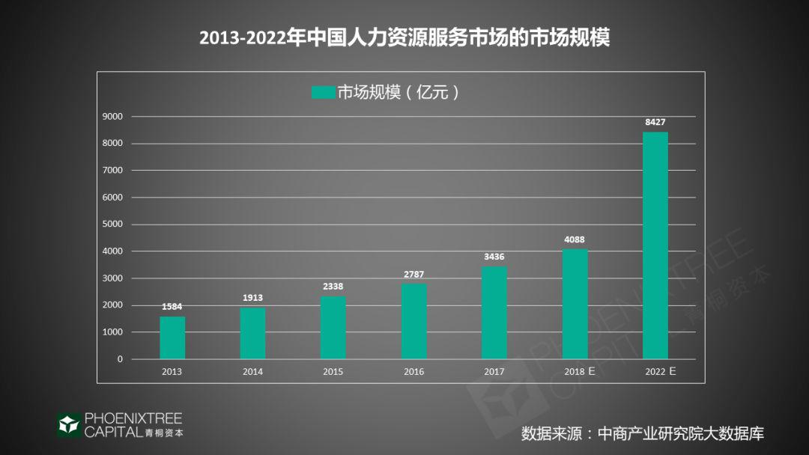

从融资市场，来自艾瑞咨询数据显示， **2017-2018年，HR SaaS获得融资数量最多，有55个** ；青桐资本梳理2019年1-7月的投融资数据发现，HR SaaS有20个项目获得融资，位居通用型SaaS融资数首位。并且，其项目都在B轮及以后， **更偏中后期** 。

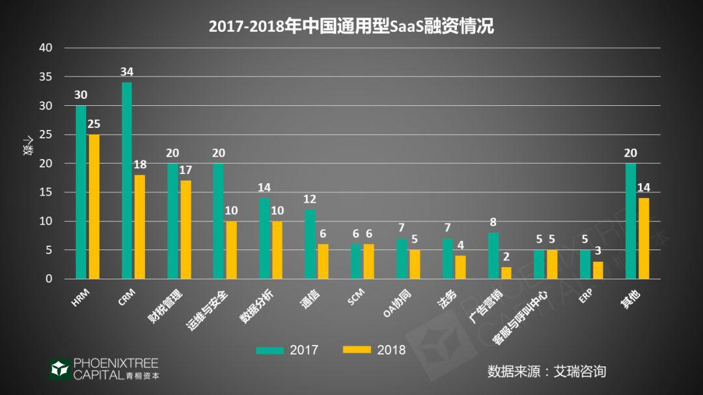

HR SaaS的服务，主要集中招聘、绩效、继任、核心人力、员工调查等业务流程服务。

从玩家来看，HR SaaS玩家众多，国内主要有北森、Moka、钉钉。其中，北森已是招聘SaaS赛道头部玩家。参考美国HR SaaS发展，目前有上百家创业企业，上市公司约有7-8家，市值规模加起来超过1千亿美金，与CRM体量基本持平，头部玩家有Workday等。

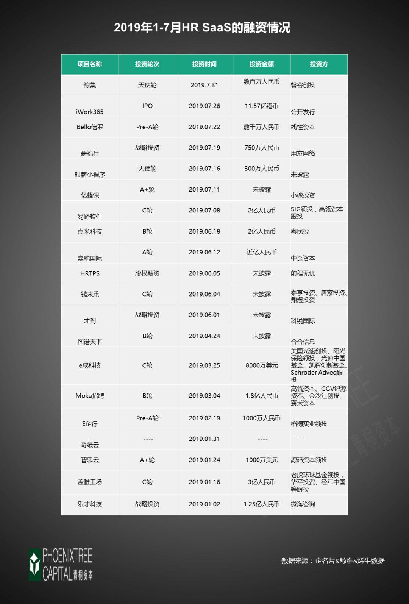

>  **财税管理SaaS：谁将跑赢小微企业市场？**

财税SaaS也是今年备受资本关注的细分赛道之一。来自ToB行业头条预测， **预计国内财税市场规模在1000亿元以上。**

从投融资数据看，2019年1-7月财税SaaS，有9个项目获得融资， **中后期项目偏多。**

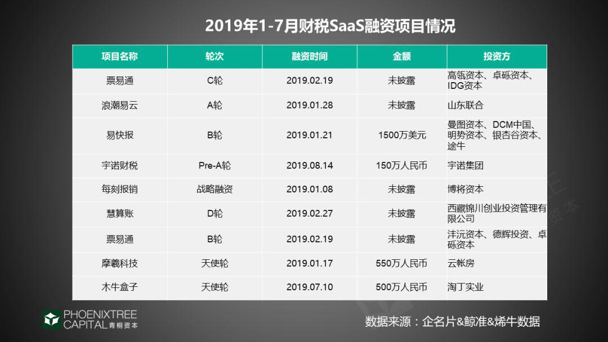

**政策和小微企业规模，是财税SaaS发展的重要推手** 。来自工商总局数据，截止2017年7月中国小微企业数量达到7328.1 万家。2018年，国家税务总局发布《关于发布财务报表数据转换参考标准及完善网上办税系统的通知》，要求办税系统与企业财务软件直接对接，财税相关服务成了中小企业的普遍刚需。

财税SaaS包括帐单支付、票据管理、财务处理、薪资产品、报税服务、税务筹划等服务。主要满足中小企业的财税需求。典型的玩家，有如云帐房、云代账、大账房、易快报和汇联易等。其中，云账房在2018年获得C轮融资，大账房获得奥马电器的战略投资。

**金蝶、用友财税转型云服务，财税SaaS市场格局日渐明确** 。在传统财税软件市场，金蝶、用友处于垄断地位；相继转型SaaS后, 切入小微企业财税服务市场。无疑，其他玩家们将面临两家巨头的挤压，生存压力加大。

> 总结

在国内通用型SaaS中， **CRM、ERP市场规模和渗透率领先，竞争激烈，赛道“人满为患”** ，绕不开传统厂商、互联网巨头的夹击。人力资源管理、财税管理等细分赛道，创业公司的机会更多，资本更为关注。

技术有望成为通用型SaaS新的突破点。 **以最近大热的RPA为例，机器人流程自动化，其技术应用主要集中在财税、人力领域，将进一步解放人力、提升效率。** 国内RPA的客户主要集中在大型上市公司、银行、国企等机构。国内玩家众多，代表性公司有弘玑Cyclone、云扩科技和Uibot等。

###  ** **行业垂直型SaaS：**** ** **离交易更近一步****

行业垂直型SaaS，要求 SaaS厂商对行业要有深刻洞察，准确把握具体行业的痛点，进而提供解决方案。来自艾瑞数据显示，2018年中国行业垂直型SaaS，其年增长率高达56.6%， **超过通用型SaaS** 。

据艾瑞咨询数据，2018年行业垂直型SaaS市场规模达到103.3亿元。零售电商、医疗、物流和餐饮行业SaaS市场份额位列前四，其中， **零售电商SaaS市场规模居首** ，占比26%。无疑，这些行业都是与C 端用户紧密结合，也是互联网最先开始渗透的行业。

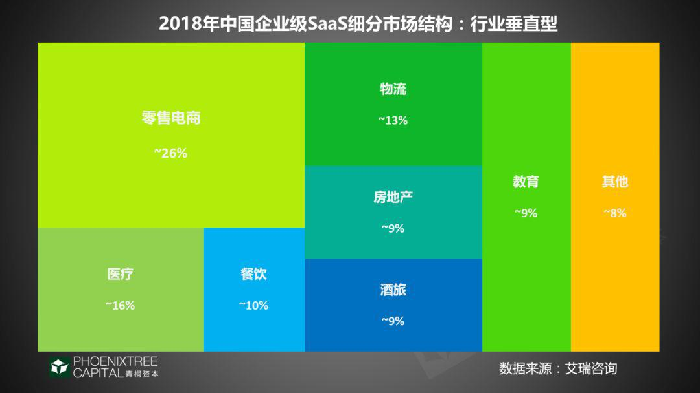

> 零售电商SaaS： 一枝独秀

电商平台商家数量的增加、付费意愿的加强及各类新型电子商务交易模式的产生， **零售电商SaaS率先爆发** 。来自联讯证券研究院数据，2018年阿里、京东、拼多多、微店四大主流电商平台活跃卖家数量达到1196.47万，预计到2020年我国电商服务市场规模将达到241.9亿元。

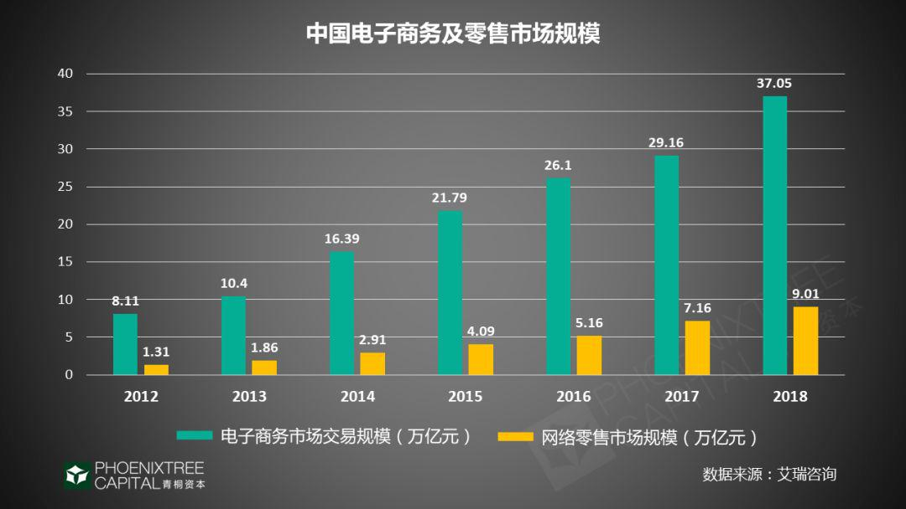

零售电商 SaaS **主要围绕电商核心业务架构** **：** **商品、库存、价格、订单、支付，提供服务** 。从功能看，主要分成3大类：第一类，开店零售直营系统，如易开店、微商城；第二类，订单、分销、批发系统，如招商王、分销王、云起订货等；第三类，数据与电商运营管理，如CRM会员通、货店通、淘打、情报魔方等。

**零售电商SaaS玩家众多，已跑出一定规模的有：** **有赞、微盟、商派、旺店通、聚水潭、管易云、E店宝等** ，其中有赞、微盟均已上市。另外，传统软件公司也对零售电商SaaS市场垂涎，金蝶通过收购管易云切入。

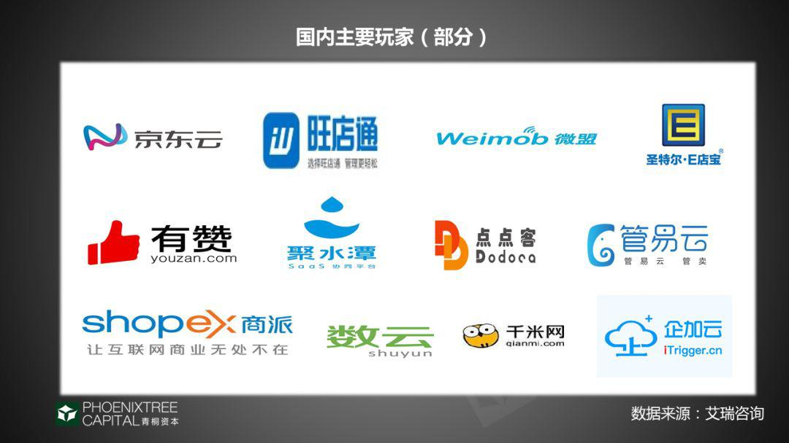

从电商发展历程看，SaaS产品和服务发生变化。在电商行业的上半场， **SaaS产品主要是采用开源的策略，以营销获客为主** ，担任流量生产工具的角色；在电商行业下半场，SaaS产品开始注重节流， **主要聚焦货的流转升级等，核心是数据和供应链** 。

**社交电商崛起，SaaS厂商如何把握社交电商红利？** 目前，交易类SaaS成社交电商最大受益者之一。交易类 SaaS 提供了第三方商家在微信开店必需的工具，包括了开店工具、订单处理、支付、会员管理、营销等功能模块。

> 医疗SaaS：上市公司为主要玩家

医疗信息系统是SaaS的基础。青桐资本关于《[医疗大数据：如何实现商业化变现？](http://mp.weixin.qq.com/s?__biz=MzI5MDQ2NDMxNg==&mid=2247488485&idx=1&sn=709cc18104f9dfa19b0b2829b9a935c7&chksm=ec1e24b6db69ada0bc166db88e8dedab12d4d6116fd81230e8e347a23b89e14324573f5f1f1e&scene=21#wechat_redirect)[》](https://mp.weixin.qq.com/s?__biz=MzI5MDQ2NDMxNg==&mid=2247488485&idx=1&sn=709cc18104f9dfa19b0b2829b9a935c7&chksm=ec1e24b6db69ada0bc166db88e8dedab12d4d6116fd81230e8e347a23b89e14324573f5f1f1e&token=874421715&lang=zh_CN&scene=21#wechat_redirect)研究指出，我国医院信息化管理系统实施比例达70-80%，且集中于三级医疗机构。

**医疗SaaS赛道格局比较清晰。主要玩家集中在上市公司** ，有：东华软件、卫宁健康和东软集团等，占据了市场主导地位。并且科技巨头阿里和腾讯以战略合作、参股等形式介入。

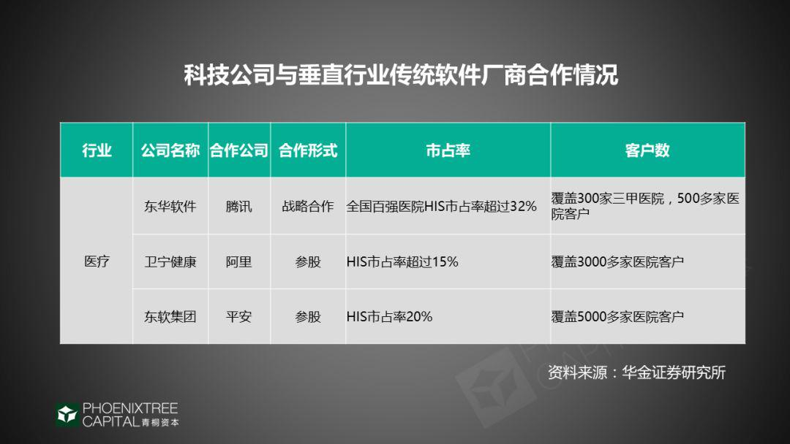

**另一类是新型医疗SaaS服务商，它们将线上线下结合，不仅提供医疗信息化服务，还提供线下的综合医疗服务。** 如太美医疗，不仅提供线上服务，还提供线下的临床研究CRO业务。

还有一些SaaS服务商，尝试往医疗垂直细分领域发展，齿科和医美抗衰是当下相对热门的赛道。这些公司都处于早期发展阶段，跑出一定规模玩家有“领健“，为口腔、医美、全科等医疗机构提供SaaS+交易服务。

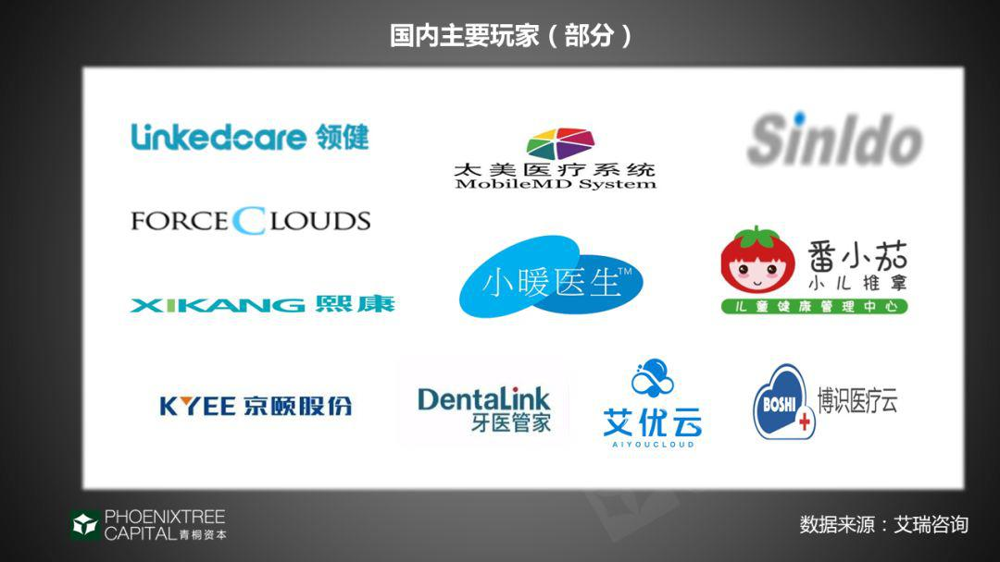

> 餐饮SaaS： 突围红海

餐饮SaaS兴起于2012年，历经7年的市场洗礼，市场渗透率数量激增。据国家统计局公布的最新数据显示，2019上半年，全国餐饮收入21279亿元，同比增长9.4%，餐饮收入增速继续领跑于社会消费品零售总额。《中国餐饮O2O行业发展现状分析与市场前景预测报告》预测， **我国SaaS餐饮软件市场渗透率将在2020年增长至10%以上** 。

**餐饮SaaS行业进入红海** ，服务商们的竞争程度异常激烈。主要玩家有：客如云，已经登陆新三板，覆盖超2万家店铺，百度入股；屏芯科技，覆盖超10万家店铺 ，获美团投资；二维火，获阿里巴巴战略投资，覆盖近30万家店铺；集 BAT 三家融资于一身的美味不用等，覆盖6万多家店铺等。不难发现，餐饮作为巨大的流量入口，其SaaS吸引互联网巨头的布局。

餐饮SaaS软件，提供的功能主要有：微信扫码点餐、自助点餐结账、移动支付、会员管理、外卖功能、独立的数据统计等。 **餐饮集团内部，也会孵化餐饮SaaS系统，从服务子公司外延至外部客户。** **如茂隆科技，** 作为重庆博茂餐饮集团旗下子公司，致力于打造数字化餐饮运营平台。

青桐资本发现，餐饮SaaS行业具有高昂的获客成本以及客户存活率低等现象。数据显示，餐厅累计年倒闭率70%，这对餐饮SaaS企业而言如何控制用户留存，是一大挑战。

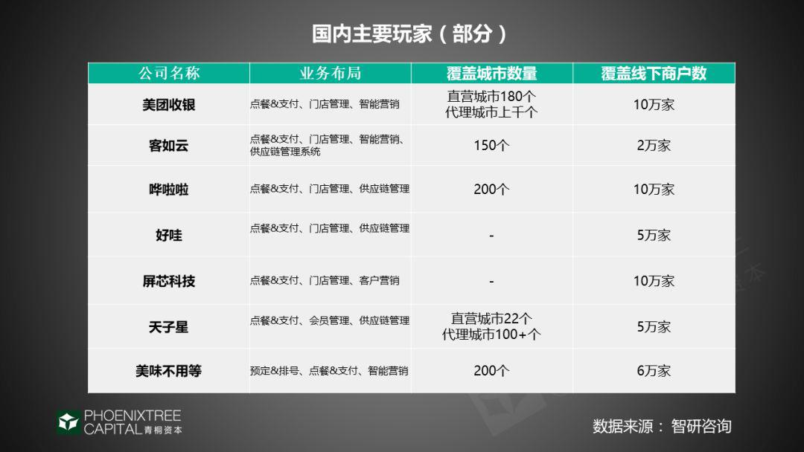

> 总结

行业垂直型SaaS，离交易更近一步。目前零售电商行业SaaS市场规模最大，医疗、物流、餐饮行业紧随其后。 **行业垂直型SaaS，其数据价值凸显。** 一方面， **它更容易打通各业务部门之间数据** ，凭借对行业多年的数据分析逻辑积累，帮企业发现运营中存在的问题，提供智能决策。另一方面， **更容易关注到整个产业链条上数据变化** ，指导有针对性地调动各种资源进行业务创新，更有效率地延伸企业价值链，辅助完成产业链条供给方面更深度的数字化。

###  **2019年企业级SaaS的机会点**

纵观中国SaaS产业发展， **经历了爆发式增长—回落—回暖3个阶段** 。近两年来随着中国企业信息化程度的提升， **企业对SaaS服务的需求和付费意愿也都开始稳步上升。**

通用型SaaS领域，新入局者绕不开传统软件厂商、互联网巨头，两者已占据较大市场份额。但从细分赛道来看， **如HR、财税等领域存在更多机会点，** 由于中小企业的需求越来越多元化，一些新的玩家也获得了资本市场的关注。

**行业垂直型SaaS领域，更受资本关注。** 其中零售电商SaaS率先爆发，医疗、物流、餐饮和酒店行业紧随其后，各行业对SaaS服务的需求已不容忽视。行业垂直型SaaS的关键点在于厂家能否提供满足细分行业痛点需求又可以快速复制的产品。这就对SaaS厂家所专注的客户行业知识积累提出了很高的要求，核心团队在相关行业的从业经历将起到至关重要的作用。

**企业级SaaS是一个需要时间的赛道，但伴随着AI与大数据技术的推动，有望产生新的突破点与模式创新。**
