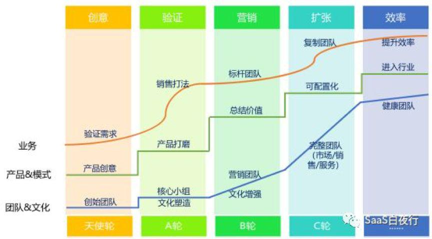
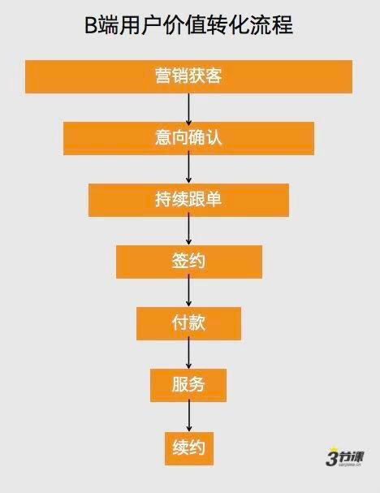
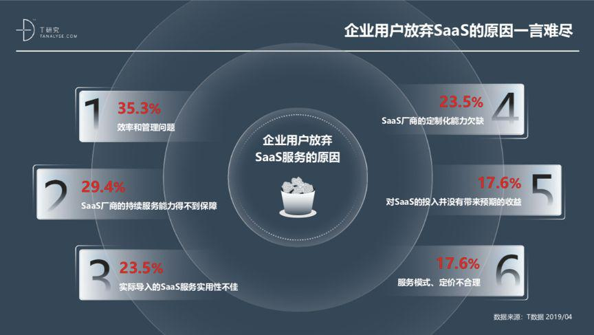

## 困境之下，中国SaaS如何逆势增长？  

> 发布: ToB行业头条  
> 发布日期: 2019-08-14  

编者按：本文来自微信公众号[“ToB行业头条”（ID：wwwqifu）](https://mp.weixin.qq.com/s/0WSRasWBibgfKkfYUkF7vw)，作者李晓松，36氪经授权发布。

**【ToB大师课】** 是ToB行业头条推出的全新栏目，所有内容均由平台资深记者与ToB行业大师共同打造。我们邀请到的第一期大师是 **著名SaaS咨询顾问吴昊，** 作为多年的SaaS从业者，吴昊将分别从组织建设、团队管理、产品优化等维度，与ToB行业头条主笔李晓松共话SaaS，希望真正找到实现中国SaaS增长的秘籍。

\* 吴昊：SaaS创业顾问，[\#SaaS创业路线图\#](https://36kr.com/user/1308477002)系列文章主创作者。在企业信息化领域沉淀20年，拥有8年SaaS营销经验。

\* 李晓松：ToB行业头条主笔，专注ToB领域各赛道报道，并先后与上百位ToB企业CXO进行深度交流，累计报道300余家企业。

**一**

自2015年，中国ToB元年到来以后，中国便兴起了SaaS浪潮，一批批企业接连涌入这个赛道。

一时间，SaaS成为媒体和资本的宠儿，中国的投资者和SaaS从业者开始希望中国望能够复刻欧美SaaS市场的成功，孕育出本土的Salesforce、Workday……

可让人遗憾的是，一笔笔资金砸向SaaS市场后，中国的SaaS企业却未能如愿蓬勃生长。反倒是一些拿了快钱、仓促冒进的厂商，率先殒命。

如今，中国大多数活下来的SaaS企业，都受困于增长难题。一直以来，它们都想找到一种通用法则，破解所有问题。可我们不得不遗憾地告诉大家，这样的方法真的没有。

那中国的SaaS就该自此放弃吗？不！

虽然我们没有万金油法则，但却可以从更普适的角度，告诉中国的SaaS厂商，当下要如何经营，才能让企业在平稳中厚积薄发；当下要如何规划，才能在爆发点来临的那一刻，将机会抓在手中。

###  **01**

###  **明晰目标市场，找准阶段方向**

打过《王者荣耀》的小伙伴都知道，没有菜的英雄，只有菜的玩家。

同样，能够活下来的SaaS厂商也没有菜鸟。而它们能否实现持续增长，并非只取决于产品质量，更在于它们是否有明晰的目标方向。

比如，国外邮件文化盛行，可在中国，就算有一款完美的邮件SaaS横空出世，又有什么意义呢？

同样的道理，国外企业更强调老板、员工平等，以此为导向的SaaS公司Slack顺利上市。可在中国，强调平权的企业微信却陷入了增长困境，反倒是更强调老板思维的钉钉，用户蹭蹭地长。

以往中国的很多行业，都在模仿、照搬欧美等发达国家的产品模式，可如果使用环境不同、国情不同，就算把SaaS产品设计的和Salesforce一模一样也没有用。

你能说像Salesforce的产品不好吗？不能！可很多中国SaaS不是产品菜，而是战略菜。

**注：** 其实很多中国SaaS受传统软件影响较深，技术人员、研发逻辑、产品架构等都还没能与时俱进，与国外的优质厂商还有很大差距。只不过相较于产品，战略则是更重要的问题。而且当前国内SaaS厂商在产品层面的差距不是很大，所以战略更能体现企业价值。

我们且不评论“钉”一下这种老板思维是好是坏，但就当前中国的SaaS生态而言，老板思维确实是SaaS能否卖出去的重要原因。

所以，中国SaaS若想实现增长，对标巨头、夯实产品的同时，还要多考量一下中国的国情和用户的使用习惯。只有真正明晰目标市场，SaaS产品才有可能走得更远。

同样， **明晰目标市场，不仅要求企业要看准市场需求，还要清楚公司在发展的不同阶段，要确立不同的发展目标。**

**图片源于SaaS白夜行**

一个初创公司，觉得钉钉用户增长快，就学钉钉疯狂补贴、疯狂烧钱，能行吗？显然不行！

一家已成规模的SaaS公司，投广告怕打水漂，扩张销售团队又怕成本大，畏头畏尾的被竞品超车，可怕吗？绝对可怕！

中国的SaaS公司，在确定市场方向后，一定要在正确的阶段做正确的事。只有这样，才能将自己的优势放到最大。

吴昊曾在[《如何把握好SaaS创业的节奏？](https://mp.weixin.qq.com/s?__biz=MzU1MzE1MzYyNQ==&mid=2247488087&idx=2&sn=92a6f1616474cfdd3e67f985c624bdaa&scene=21#wechat_redirect)[》点击文章标题即可跳转阅读](https://mp.weixin.qq.com/s?__biz=MzU1MzE1MzYyNQ==&mid=2247488087&idx=2&sn=92a6f1616474cfdd3e67f985c624bdaa&scene=21#wechat_redirect)一文中，着重分析过这个问题。

他认为：“在每个阶段，创始团队应该有明确的阶段主任务。创始人可以拿出20%的时间在未来的布局上，但起码有50%以上的时间‘聚焦’主任务，保障它按时完成，并且完成效果能打到95分。”

上面这张图表刚好标明了不同阶段的SaaS厂商，需要着重解决的不同问题。只有SaaS厂商找到目标市场的准确需求，并且能够根据公司发展阶段，聚焦当前的主任务，才值得去考虑下一步的获客问题。

###  **02**

###  **获客方式各有利弊，线上线下搭对结合**

我们都知道，当前SaaS行业的获客方式，主要分为线上和线下两种。这两种方式被大家广泛采纳，但也各有利弊。

线上获客更聚焦于SEO/SEM、电销、公众号等市场行为；线下获客则主要依靠销售拜访、线下活动等地推活动。

线上模式更便于复制，人力成本较低，传播规模更广，数字营销能力较强。但线上模式触点较薄，更适合销售简单易懂的SaaS产品，如云名片、协作文档、网页设计等。

线下模式则能通过线下拜访或是活动讲解，更直观地帮助客户理解产品，适用于成交周期较长、产品更为复杂的SaaS产品。

不过，搭建销售团队需要耗费较高的人力成本，团队管理难度更大，模式也不利于复制，极为考量企业的管理能力。

清楚了两种模式的利弊，我们就知道，多数SaaS厂商都该采用“两条腿”走路，即线上、线下并行的策略实现获客。

吴昊十分肯定两条腿走路的策略，他认为： **“市场性线索的获取一定是更高效的，所有公司需要重视，但是销售人员如果能带来30%~40%以上的自有线索，才是更稳固的发展模式。”**

他曾在[《SaaS创业——如何制定销售目标？](https://mp.weixin.qq.com/s?__biz=MzU1MzE1MzYyNQ==&mid=2247490037&idx=3&sn=a3234fbd35e259cc188ccbffa7822d37&scene=21#wechat_redirect)[》点击文章标题即可跳转阅读](https://mp.weixin.qq.com/s?__biz=MzU1MzE1MzYyNQ==&mid=2247490037&idx=3&sn=a3234fbd35e259cc188ccbffa7822d37&scene=21#wechat_redirect)一文中，着重分析了以市场线索为主的公司、成交客户99%来源于销售自开拓的公司和市场-销售平衡的公司这三种获客模式。

对于前两种过于重视市场线索，以及过于依赖销售自开拓的模式，吴昊认为它们都是偏极端且不健康的表现。

其实这类极端公司只需要思考两个问题，就可以知道自己要补足的方向：公司的销售体系里真的没有人能够自开拓吗？公司的市场能力真的不能够提升了吗？

吴昊表示： **“作为ToB公司，无论产品轻重，无论目标客户类型如何，都不应该放弃销售自开拓或放弃市场获得线索。** **因为，这会是公司未来发展的组织能力短板！** **两者的比例关系可以是70：** **30，也可以是20：** **80，但不要是1：** **99或5：** **95。** **”**

###  **03**

###  **ToB销售过于复杂，线下团队如何复制**

其实，线上、线下获客方式相结合的原因有很多，但其中有一个重要原因，就是ToB产品的销售周期太长了。这么长的销售周期，单纯依靠线上操作，几乎无法完成。

下图从一定程度放反映了B端用户价值转换流程的繁琐，我们可以看到，从营销获客到意向确认，再到持续跟单、签约、付款、服务、续费……B端获客要经历N多流程。而这些流程，显然是需要人来对接的。

**图片源于3节课**

既然如此，就算极端依赖市场线索的SaaS企业，仍然要考虑线下销售体系的搭建。

吴昊也多次在SaaS白夜行（ID：SaaSKnight）和与ToB行业头条（ID：wwwqifu）的对谈中，探讨过销售体系搭建与销售团队复制等问题。

他认为： **“管理10人以下销售团队与管理上百人的团队有很大不同。** **管理一两个地方的团队，又与管理全国各地的团队有很大区别。** **当团队只有几个人、十几个人的时候，就应该考虑如何进行复制的问题”。**[《SaaS创业——无标准，不复制》](https://mp.weixin.qq.com/s?__biz=MzU1MzE1MzYyNQ==&mid=2247489898&idx=2&sn=ca644eb6b220cfcfb7562ca452b673fd&scene=21#wechat_redirect)点击文章标题即可跳转阅读

同时，他还针对 **SaaS企业搭建销售团队的问题，提到了几个要点：**

1\. 复制人才和复制团队的关键在于重要流程的标准化，如果没有标准化流程，企业的团队能力很容易被冲散。标准化就像一个根基，确保了团队的底限；

2.组织从简单到复杂，需要逐步验证，这要求企业不要贪快，不要妄想一口吃成胖子；

3.干部储备初期要选用“高配低用”且能落地的人，这样才能保证每个团队的leader能力可观，并且会节省企业成本。

更多关于销售体系搭建等问题，还可以参考吴昊在ToB Talk的专题分享。[《从线索到现金，SaaS企业的销售体系如何搭建？](https://mp.weixin.qq.com/s?__biz=MzU1MzE1MzYyNQ==&mid=2247489611&idx=1&sn=380d8061918bb3c4ef1ea850274d5f25&scene=21#wechat_redirect)[》](https://mp.weixin.qq.com/s?__biz=MzU1MzE1MzYyNQ==&mid=2247489611&idx=1&sn=380d8061918bb3c4ef1ea850274d5f25&scene=21#wechat_redirect)点击文章标题即可跳转阅读

当获客方式、销售团队确立之后，一个重要的环节就来了，SaaS企业要怎么攻占市场？

是做全渠道无死角覆盖，还是由点带面主打一两个领域？是发力线下销售主推直推，还是将力量更多倾斜于电销渠道、线下销售打辅助？

这些都是SaaS企业要考虑的问题，但解答这些问题，需要具体问题具体分析。所以，在此我们不一一展开，还请有兴趣读者朋友在文末留言。

###  **04**

###  **维护长期客户，做好口碑服务**

当SaaS企业找准了市场目标，确立了正确的获客方式，并且已经打通线上、线下流程，此时只要产品足够优质，获客增长就是顺理成章的事了。

可我们都很清楚，SaaS不同于传统软件的关键一点，就在于SaaS不是一锤子买卖，而是订阅制。SaaS厂商若想持续发展，就需要让客户不断续费，如此才能保证自己的增长。

那么， **如何才能让客户一直付费呢？**

首先，产品质量肯定是第一位的，如果产品不好，厂商就算管客户叫爸爸，客户也不会留下。其次，在产品质量之外，SaaS厂商更应该重视服务团队的建设。

目前能活下来的多数SaaS厂商，在产品、技术上的较量，已经没有SaaS草莽期时激烈了。现在大家拼的是服务，谁能靠服务把客户留住，谁才能笑到最后。

因此，就客户服务这一环节，吴昊提出“客户前期进来服务好；中间观察活跃情况；续费期提前三个月联络”的方法论。

关于第一点，客户前期进来服务好，这个没必要细讲。道理大家都懂，服务不好，客户压根就不会买账。可客户进来就一定是好事吗？也未必。

“不要认为客户肯买单产品就有价值。多少人都买过假冒伪劣产品，那能说明这些产品有价值吗？”吴昊说道。

**“一个公司最大的灾难不是产品卖不出去，如果真卖不出去还可以设法改进产品。一个公司最大的灾难是销售太强，把别人卖不出去的产品卖掉了，表面看一片数据繁荣，却把祸根埋在6~18个月后。”**[《SaaS创业——“正心诚意”的顶层设计》](https://mp.weixin.qq.com/s?__biz=MzU1MzE1MzYyNQ==&mid=2247489568&idx=2&sn=b4e81f848d582b08cc7d1a8c5ab9e58b&scene=21#wechat_redirect)点击文章标题即可跳转阅读

所以，在完成第一步的服务，让客户买单以后，SaaS厂商在中间阶段，要时刻观察客户的活跃情况，必须搞清楚客户在使用SaaS产品的过程中，什么时候活跃，什么时候不活跃；活跃的原因是什么，不活跃是因为哪些问题。

只有这样，SaaS厂商才能确定产品是否真正给客户带来的价值，也才有资格在续费期的三个月前联络客户，商讨续费的事情。

上文讲述了B端产品成交流程的复杂，因此提前三个月，是给双方都留一个思考的档期。

此时，客户不管续费与否，三个月都能成为又一次的谈判周期。如果把时间压缩成一个月，搞不好客户早被竞品抢走了。

###  **05**

###  **回归产品本质，追踪客户需求**

说一千，道一万，SaaS产品安身立命的根本，还是产品本质。

以上所有环节都要基于SaaS产品的优良，否则上述所有过程都是空中楼阁，毫无根基。

因此，一旦SaaS产品被客户选用，SaaS厂商就要时刻跟进客户需求，思考产品发展的下一个增长方向。

比如，客户如果已经采购了SaaS产品，我们如何能让他们在续费时，在更多人数、更多功能模块、更多产品层面挖掘客户更多的需求，从而吸引客户付费呢？

还有，SaaS厂商能否结合上下游关系，为客户提供更具价值的上下游产品，从而进行交叉售卖，以此加深双方的关系呢？

当然，这些方法只是基于产品价值和客户的普遍性需求而言，既然客户要持续发展，那么SaaS厂商也要跟进发展，尽可能地满足客户需求。

虽然我们一直说ToB行业的客户黏性很高，但T研究《2019年中国SaaS产业研究报告》显示： **35.3%的企业用户弃用SaaS是因为效率和管理问题；** **29.4%是由于SaaS厂商的持续服务能力得不到保证。**

纵观下图企业用户放弃SaaS的原因，几乎都是因为SaaS没能满足客户需求。而用户需求未被满足，有多少是因为选错了SaaS？又有多少是SaaS厂商跟不上企业用户的发展？这些问题都值得我们去思索。

客户要换SaaS我们拦不住，但如果它们换SaaS是因为之前服务厂商没能跟上需求，而被竞品半路截胡，那这家SaaS厂商丢失的客户可能就不止这一家了。

**图片源于T研究《2019年中国SaaS产业研究报告》**

不过，跟进用户需求，并不意味着SaaS要盲目为了业绩增长而增添产品线。SaaS厂商始终要知道，自己产品的核心是什么？客户提出的需求到底是个人需求，还是这个行业普遍存在但尚未解决的需求。

吴昊在最后强调： **“增加产品线虽然会让SaaS厂商可卖的产品更多，但这确是很危险的事情”。**

毕竟，产品做得越广，对企业的管理要求就越高。而一家企业的精力是有限的，有几家企业能在多个层面都做到极致呢？

要知道，把产品线做广，并不是一件难事；可如何把一个需求做深，才更值得思考。客户需要的，永远都是能够解决问题的尖刀，而不是又能垫脚、又能砸核桃、又能拍黄瓜的钝石。

————

一圈绕回，我们从产品质量尚可的SaaS厂商，聊到了SaaS目标市场的确立、不同阶段的主要任务、获客方式的搭配、销售团队的构建与复制、客户的长期维护与服务，最后又回到了SaaS需要跟进客户需求，不断完善产品质量。

我们希望这样的内容，能给予当前处于增长困境中的中国SaaS厂商一些帮助，让它们能在人口红利衰减、资本寒冬的阴影下，实现逆势增长，真正推动中国ToB产业的发展。
