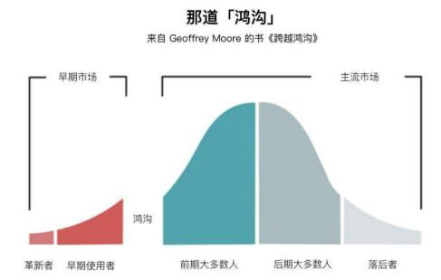
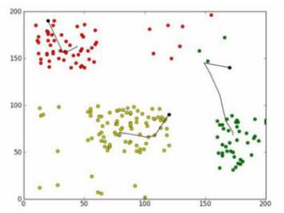
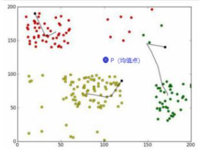
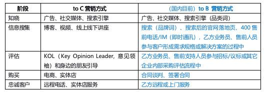

## 企业市场的大数据营销 | SaaS创业路线图（59）  

> 发布: 吴昊@SaaS  
> 发布日期: 2019-08-20  

作者介绍 - 吴昊，SaaS战略及营销顾问，系列文章作者，目前在撰写一本关于SaaS创业的书。

（SaaS创业路线图）

我曾经算过，中欧EMBA两年60多万人民币的学费，学习大约18门课程，如果不算一些校方组织的活动和毕业论文，每门课（2~4天）费用3万多。一堂课一般有60个学生，支付的费用加起来近200万，到底值不值呢？

我听了12门课，觉得挺值。就最近这2次课来说，授课老师都是近年从美国知名大学归来的华人（语言沟通效率高），又在国内做了不少实证研究，带来全球视野和本土落地的思路。

对我来说，虽然20年前在管理学院读了7年书，但营销、管理方面的知识已经陈旧或遗忘，能够用国际前沿的知识再系统地“刷”一遍，经常能得到启发。

上周听过中欧方教授的“创新战略”后，我已经分享了一篇文字。其实方教授讲的内容还能写两篇与SaaS相关的，其中有关于客户成功部NPS调研的、也有关于国内市场竞争的。我正在与各领域头部SaaS公司的高手们进行交流，有了实证结论再分享给大家。

这次上的课程是《大数据营销》，同样有好几点启发。我逐一写来，也算是尽尽“结构洞”身份（两个群体间的连接节点）的本分吧。

### 一、几个大数据营销的基础概念

“大数据营销”的定义是：从搜集、分析数据，到基于数据挖掘并应用于营销，以此提升用户体验、营销效果、支撑营销管理决策的过程。

它会影响经典营销4P理论的每个环节：Product（产品）、Price（价格）、Promotion（促销）、Place（渠道）。

大数据营销更会影响互联网环境的4C应用：Context（场景）、Content（内容）、Connection（连接）、Community（社群）。

大数据营销的基础知识还有：个性化推荐、信息茧房、数据来源（一手、二手、第三方数据）、欧盟GDPR数据安全保护条例、大数据营销如何冷启动......

这些网上都有资料，我就不谈了。我专门讲讲对SaaS等服务企业的toB公司，能有什么启迪。

### 二、对社交传播的一些推论

一个新话题或新产品的传播路径是：

\* 明星（影响力大，但传播是单向的，缺乏与大众的互动）

\* KOL（意见领袖）

\* 跟随者

\* 大众

这次课堂上，我发现KOL的影响力模型应该与科技产品市场拓展的“鸿沟理论”相结合。

先说说鸿沟理论。一个新产品进入市场，影响客户购买的因素非常多，有很多因素之间相对独立，因此占领市场份额的顺序存在“正态分布”。（关于这个知识点，可以学习得到App的万维钢精英日课《模型思考者3：三种分布模型》）

（来自百度图片）

在社交媒体理论中，新产品的早期购买者，更快接受新事物，这个人群中的“创新型”KOL，起到的作用是“快速传播”。

但这类KOL，未必能受到“主流市场”人群的喜爱，因为这部分人群更喜欢稳健、有深度的KOL。所以到了市场发展中期，企业要培养“跟随型”KOL。

### 三、客户聚类分析

我们先从客户谈起，介绍一个工具“聚类分析”。

这个方法通常用于toC产品，我考虑对于SaaS企业来说已经与传统软件有很大差别：客户群体更大（很多SaaS公司客户数量过万、甚至几十万）、客户管理更加数字化，是有机会用“聚类法”分析客户的。

我看到大部分SaaS公司的客户画像比较单一。说起来就是某某行业、某个规模、某某类型的需求。

在市场实战中，有的SaaS产品就会很纠结。今天遇到一个客户，他的关注点是A；明天遇到另一个客户，关注的又是另一个遥远的点B......

是否有一些SaaS公司的客户，其实是应该分为2个或3个聚类呢？

（图片来自百度百科）

如果能分出几个聚类，其价值是：

\* 虽然还是一个SaaS产品版本，但不同聚类的客户关注的价值点不同，因此营销手段、营销内容有所不同；

\* 不同聚类的客户关注的功能集合也不同，因此服务重点不同，促进增购和续费的重点也不同；

\* 从战略角度看，我们需要思考 —— 哪些客户才是我们真正的客户、应该重点支持；哪些客户虽然也会买单，但从需求及企业属性上来说并不是我们的目标、应该彻底放弃。

\* 从产品的角度看，如何聚焦各个聚类的核心需求，而不要做一个貌似符合“平均值”点的功能（我在下图上标注的P点），其实各个聚类上的客户对此都不满意。

（图片来自百度百科，有微调）

我考虑对于SaaS等toB公司可以对客户进行分类的维度有：

\* 行业（及细分行业）按照某个特性（例如：互联网化程度）打分排序

\* 企业规模（按营收金额或员工数量分段）

\* 企业管理水平（制度化、流程化的程度）

\* 企业信息化水平（既有信息系统覆盖业务及行政流程的比例、应用状况）

\* 与产品相关的其它维度（例如，SaaS CRM产品会关注客户企业的销售团队规模、销售方式等）

以上是我的一些思路。下面也简单介绍一下教授讲的“K-均值聚类法”的操作步骤：

\* 随机选n个（开始可以是3个）客户

\* 把其他客户按照相似度（如果是二维图，就是图上接近这3个客户的点）分成3组

\* 找到每个组的中心点，重新分组，再找到新组的新中心点

\* 如此循环，直至分成的3个组达到：组内差异最小、组间差异最大

\* 分1组、2组、3组、4组、5组分别测试，计算不同数量分组的组内距离中心点的平均距离，并找到效用拐点。举个例子，如果分1组、2组、3组、4组、5组、6组后，每组内所有点与中心点的平均距离分别为：40、20、10、5、4.8、4.7，就说明分到4组（平均距离为5，后面再分更多组效用增加不明显）就可以了。

### 四、AIEPL营销阶段理论

在介绍一个理论，对于toB、toC营销都同样适用。其核心观点是：客户的购买行为是分阶段的，应该对不同阶段的潜在客户用不同的方式推动。

AIEPL理论认为营销有5个阶段：

\* Aware知晓阶段（教授讲的是“认知阶段”，我感觉该词歧义较多）

\* Information 信息搜集阶段

\* Evaluation 评估阶段

\* Purchase 购买阶段

\* Loyalty 忠诚客户阶段

— 对A知晓阶段的客户，企业可以通过广告、社交媒体、搜索引擎来进行影响。

— 对I搜集信息阶段的客户，通过博客、视频、线上线下讲座来影响。

— 对E评估阶段的客户，通过KOL（Key Opinion Leader, 意见领袖）和身边的朋友引导。

— P购买阶段：依靠线下实体店、电商、KOL直接销售实现。

— L服务阶段：远程电话或实体店服务。

我总结了一下，toB产品的营销工作与toC营销在各个阶段有所不同，我在下表的第三列展示出来：

明显看得出来，toB营销更多地需要乙方人员的人力介入、与客户面对面沟通。

### 四、西方toB营销的变化趋势

那么未来toB营销的趋势是怎样的呢？正好这次课上教授也解读了一个美国知名企业 IT产品及服务公司营销改革的案例。我给大家分享一下，2013年美国企业市场的变化以及这家著名公司的应对之道。

该公司在2013年发现，toB营销已经发生以下变化：

\* 信息获取方式：由线下转线上，新影响者出现。过去企业采购是“熟人生意”，厂商与大客户的SI（系统集成商）很熟悉，经常请SI去厂商公司参观学习；SI与客户有多年客情关系，有新需求后很快被找来讨论解决方案。而现在客户更多从身边有同样需求的朋友、社交媒体、KOL获得信息，更容易受“网络舆论”的影响，更容易向“陌生人”（新供应商）购买产品。

\* 品牌主导转向客户主导：客户通过社交媒体就已经产生了采购选择，70%的购买决策在销售代表到达之前就已经做出。销售代表不再是唯一的信息来源。

\* 营销内容：从专业走向“泛专业”。也就是说，toB营销的内容也不再那么刻板，也开始变得有趣起来。

真实案例中，该知名企业的应对策略是：

\* 成立了数字分析团队

\* 关注社交媒体，找出关键衡量指标和评分模型

\* 用矩阵图展现该领域中，各个品牌的发声份额及KOL谈论该品牌的影响力份额，实施互动战略

### 五、国内toB市场的发展趋势

分析上面这些内容，我们会发现一个现象：在欧美市场，toB营销方法其实在向toC营销方法靠近：

①企业的信息获得方式更社交化、自主化

②影响企业决策的人群也从销售代表转向该领域的意见领袖KOL、客户KP（关键决策人）身边的朋友。

结合美国使用SaaS产品的企业，几百人的公司会买近百个SaaS产品，可以看到另一点：③采购决策人分散化，各个部门的技术人员可以自行决定采购一些提高效率的SaaS工具。

这三点显然都是有利于SaaS推广的。

但以上3点在国内企业采购中，第①点（信息获取方式）有一些新迹象，第②点（影响人群的变化）还很少见，目前国内企业客户明确需求、形成解决方案的过程还需要乙方销售代表重度参与；第③点（分散采购权）则尚未出现。

我个人的感觉是，中国的企业市场比美国要落后8~10年。2013年美国企业市场出现的趋势，在中国还要等到2021年才有可能出现。

不过，在消费者互联网领先的推动下，产业互联网以及SaaS的进步也许会快一些。至于风险投资，虽然有泡沫的负面影响，但也给toB领域带来了人才和技术沉淀，总体来说也是正向作用。

现在还只能说说趋势，估计没人能真正预测时点。好在toB本就是个慢活儿，大家就放平心态，步步为营吧。
