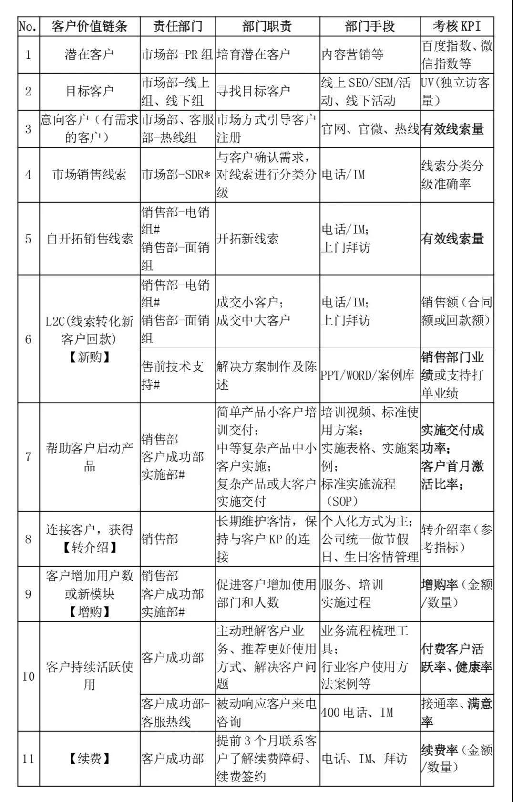

## SaaS公司典型组织架构及职责划分 | SaaS创业路线图（56）  

> 发布: 吴昊@SaaS  
> 发布日期: 2019-08-06  

编者按：本文来自微信公众号[“SaaS白夜行”（ID：SaaSKnight）](https://mp.weixin.qq.com/s/8wZyuvCIQg-CDJQROY-hpw)，作者吴昊SaaS，36氪经授权发布。

**作者介绍** **-** 吴昊，多家SaaS公司常年战略及营销顾问，SaaS系列文章作者，目前在撰写一部SaaS创业书籍。我的每篇文章都来自SaaS公司实战中的困惑，并基于我的经验和思考给出解决问题的思路。解答未必全面，欢迎大家在文末留下自己的疑问或建议，我的新书将因此获益，由此也能帮到更多的SaaS创业团队。

（SaaS创业路线图）

我正在写一本关于SaaS创业的书。这是个非常好的系统梳理SaaS创业理念和经验的机会。上周我写到SaaS公司组织架构这一章时，我做了一个梳理 —— 从“客户价值链条”的视角，观察产品、销售、市场、服务这4大主要业务部门的职责、工作手段和KPI。

### 一、 **业务部门与职能部门**

不同行业对各个部门的名称、分类都很不同。

我简单把所有部门分为两类，公司里对部门“集合”还没有统一叫法的可以参考：

\* **业务部门** ：与公司业务相关的部门，一般包括：产品及研发部门、销售部门、市场部门、服务部门。

\* **职能部门** ：支撑业务运作的部门，一般包括：人力资源HR、财务部、行政部等。

上图中，我也标注了4个业务部门在公司发展过程中的侧重顺序。在创业初期，“产品研发部”当然是最重要的，进入验证和营销阶段后，“销售部”需要得到CEO的充分重视。SaaS产品的门槛不高，营销上必须有突破能力。

随着销售组织成功壮大，就会需要“市场部”对市场的教育、塑造品牌和获得线索。再往后，随着客户数量的增加，CEO和产品负责人必须从客户服务工作中脱身，“服务部门”成为第4个重点。

每家公司部门发展的顺序和节奏各有不同，但对于SaaS公司来说，各个部门的价值输出是类似的。

### 二、 **各业务部门在客户价值链条上的位置**

貌似每个CEO都知道该如何安排各部门的工作职责，但我看到的实际情况却未必如此。

根据我往期几十篇SaaS系列文章中对典型SaaS公司职责的划分，我从“客户价值链条”的角度整理了如下表格。

\# - 非必设部门

\* - 重点说明部门

我把其中重点列一下。

\* 对toB公司来说，市场部的内容输出能力非常关键。纯靠SEM买线索的公司，获客成本太高。市场部的职责是：从“潜在客户”中寻找“目标客户”、从“目标客户”中培养“意向客户”。

\* 对于市场线索量较大或市场线索是公司关键“客户来源”的公司，我通常会建议设置“SDR”（其职责是对市场线索进行分类分级，然后按预定规则分发给合适的销售团队及业务员）。

\* 到了销售环节，销售部的主要职责有2个：获客（与市场部协同或自开拓客户）及L2C（Leads to Cash，线索到现金）的转换。

\* 售前技术支持：SaaS产品相对传统软件较为简单，售前支持的主要工作不应该是打大单，而应该是对销售团队“赋能”。所以他们的主要工作是输出行业解决方案、给销售团队做售前能力培训。对应的KPI也与传统软件公司的售前岗不同（详见上表）。

\* 成交后，低客单价产品可以由业务员直接交付，减少交接成本；如果是比较复杂的产品则需要CSM或专职的实施部门完成交付。

\* CSM对客户的活跃使用负责，进一步说，应该对客户的“健康”使用负责。“健康率”是比“活跃率”要求更高的指标，它往往可以拆解到使用人层次（例如CEO或VP有没有在用？）和使用深度层级（关键业务流程是否在SaaS系统中运作？），但这些数据往往不能直接从SaaS的后台系统得到，需要更多人力投入。

\* 最重要的是，在客户价值链条上，从“新购”到“增购”、“续费”，包括“转介绍”，务必要有清晰的职责划分：

\- **新购** ：由销售部门负责。

\- **增购** ：可以划定一个新购合同后的期限，例如6个月以内的增购由销售部门负责、之后由CSM负责。

\- **续费** ：由CSM负责。因为销售只会对“销售业绩”的金额负责，所以须有一个部门（CSM）对“续费率”（特别是续费客户家数的比率）负责。无论在哪里，我都会强调由CSM而非销售部门负责续费。

\- **转介绍** ：即使客户交接给CSM了，销售仍然有职责要维护好与客户KP的客情，大部分转介绍也由此而来。

以上各部门的权责利要匹配，据此设计工作目标及KPI。

SaaS公司的完整指标，可以参考我的另2篇文章[SaaS创业路线图（50）SaaS公司各部门经营状况自评](http://mp.weixin.qq.com/s?__biz=MzIxNjc2MTc2MQ==&mid=2247484111&idx=1&sn=0211a1ed911ffd624276bae90ab1bc01&chksm=97855601a0f2df175ff14a666df3a4ececcae77fe2c6438193c85bb4b433d2ab2092d01b49bc&scene=21#wechat_redirect)和[SaaS创业路线图（49）如何评估SaaS公司的经营状况？](http://mp.weixin.qq.com/s?__biz=MzIxNjc2MTc2MQ==&mid=2247484102&idx=1&sn=240128fec39b4571cffa8837b27a11ea&chksm=97855608a0f2df1e91d909aba7353f6d23b16bcec2505238e215422a859c5af2c2df8a371566&scene=21#wechat_redirect)

今天我介绍了一个典型SaaS公司的组织架构及职责，每家公司有自己的情况和特色，欢迎大家留言讲讲自己所在公司的职责划分及你心中的疑惑。
