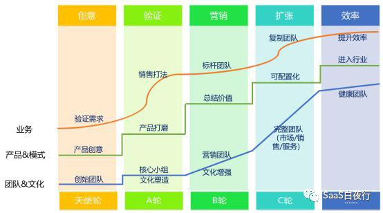
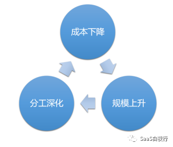
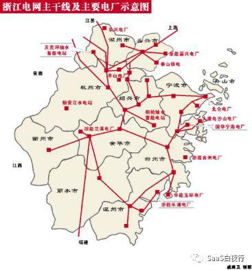
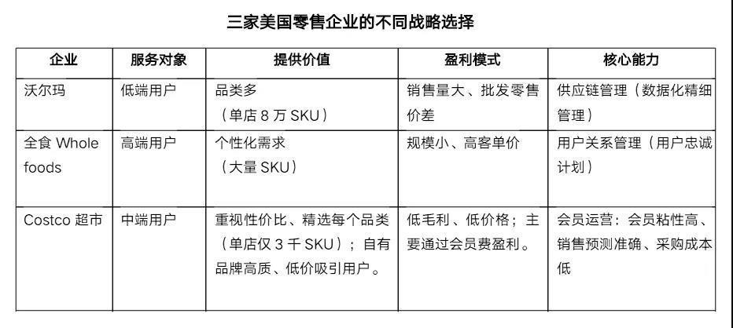
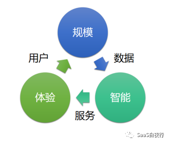

## 数据在企业演进中的价值 | SaaS创业路线图（57）  

> 发布: 吴昊@SaaS  
> 发布日期: 2019-08-13  

编者按：本文来自微信公众号[“SaaS白夜行”（ID：SaaSKnight）](https://mp.weixin.qq.com/s/6j08e1Iol0U8HP9aItBpcg)，作者吴昊SaaS，36氪经授权发布。

**作者介绍** **-** 吴昊，SaaS战略及营销顾问，系列文章作者，目前在撰写一部SaaS创业书籍。

（SaaS创业路线图）

每个to B创业者都对自己客户的现状相当了解，但你知道在这个变幻莫测的VUCA时代，客户的企业究竟会往哪个方向发展吗？

刚过去的这个周末，我在中欧课堂上听了方二教授的创新战略课程，对此有了更全面的的认知。今天给大家分享一下。（课程现场非常精彩，我只陈述了1%的内容，大家自己找机会在各种场合现场听吧！）

方教授的课叫做《 **互联网和智能商业的创新战略** 》，引用了约20个自己或其他中外教授在企业实证研究的数据结果，全程几乎无x点。EMBA的课程是90分钟休息一次，我平常就喝水多，3天里在“忍一下”还是“赶紧去一趟”之间纠结了十几次。

言归正传，我们先快速回顾一下企业组织的发展历史：

###  **一、组织的变迁：交易成本下降的过程**

亚当·斯密的《国富论》用制造一根针的例子告诉我们，提高效率要靠分工协作。1910s的福特汽车是现代企业的1.0版本。当时与上游供应商的远程沟通及协作很困难，为了保障生产，福特除了生产车身，也不得不到东南亚开直营厂自行生产橡胶和轮胎。

如上图所示，分工越细、成本越低，在市场上优势越大，就能得到更多订单，带来更大生产规模，从而形成正反馈循环。这是组织1.0时代的商业逻辑：“垂直一体化”的生产方式，减少了企业间的交易成本。

我们今天看到的企业已经是 **企业组织的2.0时代** 。例如宝洁与沃尔玛的合作：“大品牌”和“大渠道”各自发挥自己的核心竞争力，在价值链上进行跨组织的分工（而不是把所有分工都放在一个企业内部），通过合作降低交易成本，实现市场共赢。

商业发展到今天，大家可以发现有很多市场环境的变化：

\* 用户圈层化、搜索成本下降 —— 形成大量“小众市场”

\* 组织间交易成本（包括沟通、信任、协同成本）下降 —— 出现大量“小组织“

\* 由于网络效应、规模效应、认知聚集（客户快速选择知名品牌）——形成“头部效应”（行业集中度不断上升）。实际上， **头部企业的业务边界会越来越宽，直到管理成本超过边际效益或者协同效应下降。**

方教授称此为“大生态”时代。 **组织3.0版本** 的趋势是：敏捷组织、网络协作和数字赋能。敏捷组织的含义包括：

\* 大后台、小团队

\* **按用户而非产品功能划分团队**

\* 更好应对成功或失败的不确定性

例如海尔孵化的“雷神”（游戏设备生产商）就是一个典型案例。

小结一下，从组织1.0到3.0，企业的三个阶段分别是：

\* 点：价值的提供者（单个企业完成生产制造全过程）

\* 线：价值链的整合者（整合生产制造上下游）

\* 网：价值网的构建者（“大生态”）

我找了一张“浙江电网主干线及主要电厂示意图”给大家脑补一下从点到线、再到网的关系：

### 二、 **企业创新战略的三个选择**

无论企业大小，它只有2个部分有价值：产品和用户。

（SaaS公司也有2种扩张方式：用同一个产品不断扩大用户范围；或者，围绕着一定数量的用户（通常是头部客户或大客户）不断创造新的产品做交叉销售。）

我们用一组零售行业的例子，讲讲 **企业创新战略的三个选择** ：

\* 技术领先

\* 卓越运营

\* 用户亲密

在沃尔玛之前，没有零售公司能够在美国10万人口的小镇上成功运营有大量SKU商品的超市。它的核心竞争力是：条码（首个使用条码的企业）、数据化精细管理、数据密度与实体网络的密度结合。沃尔玛定义自己不是零售公司，而是“技术驱动的供应链连锁企业”。它的创新类型是“ **技术领先** ”。

“全食”于2017年被亚马逊以137亿美元收购，它的团队来自酒店管理和奢侈品行业，采用的是“ **用户亲密** ”服务高端用户的创新模式。

“Costco超市”是美国最大的连锁会员制仓储量贩店，它的第一家中国店将于今年8月在上海开业。在美国，它瞄准的是中端市场，单店的SKU只有3千左右，带来的优势是针对同一个供应商的采购量大、SKU还少（意味着制造成本低），因此能够拿到市场上最低的价格。同时，它的加价只有7~10%，因此价格优势明显。它在全球有8000万会员，其创新战略不是“用户亲密”，而是“运营卓越”。

Costco最大的优势是SKU少，最大的挑战也是SKU少。相当于它在帮客户选商品，一个品类只选很少品牌。一旦采购选择有误，业务受到的影响比沃尔玛大得多。为此Costco提前3年就在天猫开店，意在收集客户购买数据。

从这组案例中，我们能看到数据和智能对“创新战略”的价值。我们再继续探究：

### 三、 **企业创新的5个支柱**

谁都知道要创新，但创新该怎么做呢？方教授通过研究中、美企业的发展历史和先进企业的创新战略，提出了企业创新的5大支柱：

\* 业务数据化

\* 管理智能化

\* 服务个性化

\* 协作网络化

\* 组织敏捷化

在组织3.0下，原有的“规模——分工——效率”模式已经进化成为以下这个新模式：

“规模”带来大量数据，帮助企业建立了智能化管理和提供“个性化服务”的能力，这些个性化服务提升了用户体验，又带来更多用户、形成更大“规模”......

我特别强调以下2点：

#### 1、“ **数据驱动的服务转型** ”

方教授介绍他自己的一篇研究论文中有这样的数字： **从1990s到2009年，美国制造业企业服务收入的比重从9%上升到52%。**

正如很多SaaS圈内的朋友问我，SaaS公司如何从做“工具SaaS”转向做“商业SaaS”（详见：[SaaS创业路线图（55）SaaS产品分类及其发展方向](http://mp.weixin.qq.com/s?__biz=MzIxNjc2MTc2MQ==&mid=2247484145&idx=1&sn=0e1c9b0f812cf929e43b48e7b2e51836&chksm=9785563fa0f2df2969bba593d2d3803dbd0014f456b2712e90c3868ef4a562226d6e69143c69&scene=21#wechat_redirect)），制造企业也会问：“我一制造产品的，如何转型做服务啊？”

举个例子，GE制造航空发动机，先是卖给航空公司，但后来改为租赁“飞行小时”，节约的燃油等费用GE可以与航空公司分成。

当然这个转变也是痛苦的，据研究， **服务占比从0上升到20%期间，企业利润是下降的，之后企业利润会上升。**

为什么服务能让利润上升呢？因为产品模块化后（例如造新能源汽车，核心部件大部分是采购的），门槛降低、竞争加剧，既有市场份额很难守住。 **只有更贴近客户、非标的服务才能获得更高利润。**

产品转型服务有三个阶段：

\* 产品能力不足，通过人工服务弥补

\* 通过服务与产品的协同，为客户提供增值价值

\* 服务的产品化：企业的主营业务收入来自服务，产品只是服务的载体

#### 2、 **数据驱动的个性化转型**

**这个时代的市场上，其实有一组互相矛盾的供需关系 ——**

**消费者的个性化需求 vs 企业通过规模化降低边际成本的愿望**

那么，应该如何降低个性化的成本？

①供应链：通过锁定核心供应商、将采购关系转变为长期合作关系，供应链中的上下游才能积极配合适应新的个性化需求（这也是形成“大生态”价值网的动力）；

②运营端：个性化是“极致的标准化”，通过“产品库”降低个性化成本（很多家装设计公司采用这个方式）。

③需求端：场景化的需求挖掘方式。

关于第3点，教授讲了一个例子。某定制汽车公司，早期搜集客户需求的模板是这样：颜色选项、发动机选项、座椅选项...共200个。你可以想象客户选择时有多困难。

后来改为按客户用车需求来调查：购车预算、家庭成员数量、主要出行场景......这样客户只要填下20个选项就能看到推荐车型。

可见，供给越是丰富的时代，越需要从使用场景的角度，而非产品功能的角度考虑问题及设立企业的组织。

SaaS产品上PaaS架构也是为了适应这个趋势。我见过有的SaaS产品初始化阶段有大几百个配置选项， **是否也应该考虑从客户使用场景的角度重新设计，方便客户的系统管理员配置，也降低SaaS公司自己的实施成本？**

（当然，国内大部分PaaS都是假PaaS，我上周在一个媒体采访中有详细解读，估计大家这周应该能看到了。）

### 四、 **数据在企业组织演进中的价值**

在整个“创新战略”的课上，方教授讲到“数据”这个词不下百遍。企业创新的5大支柱：业务数据化、管理智能化、服务个性化、协作网络化、组织敏捷化，都需要数据系统的支撑。

我和不同VC中做投资的朋友聊天，大部分都很看好每个行业排名前2的SaaS公司未来的数据价值。企业需要利用内部数据提高业务及管理效率、需要客户的行为数据提高客户服务的准确度及满意度、需要上下游的生产及物流数据进行供应链协同......

这些数据以前都分散在各个独立部署的软件系统里，一个大企业有上百个“信息孤岛”，难以利用。而SaaS的云部署特性，将给这一切带来可能。不必担心客户不接受，我在《[SaaS创业路线图（34）SaaS公司的数据价值](http://mp.weixin.qq.com/s?__biz=MzIxNjc2MTc2MQ==&mid=2247483961&idx=1&sn=3abcd8a51fb6006f7a9c0c3fd0c36a6f&chksm=978556f7a0f2dfe10c2ac728143b7fd97a5f43fd50705a7e2443a8f767c4e7257ecf734dd58a&scene=21#wechat_redirect)》里说过：总有一个场景，会让客户愿意贡献自己的数据。

方教授的这次课程讲的是新时代的创新战略，却让我更加坚信SaaS公司的数据价值，你呢？
