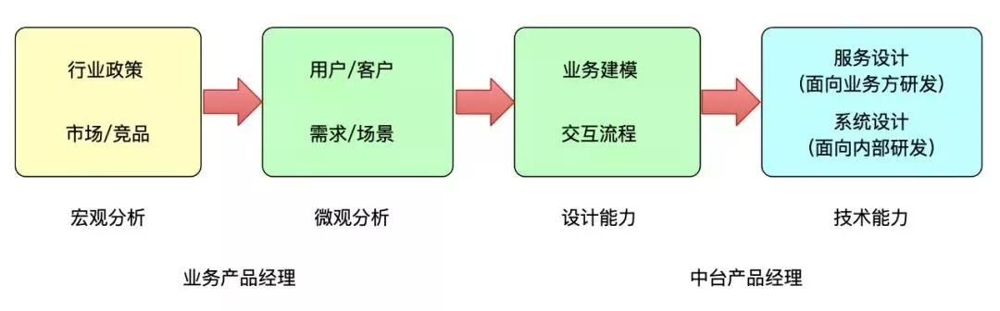
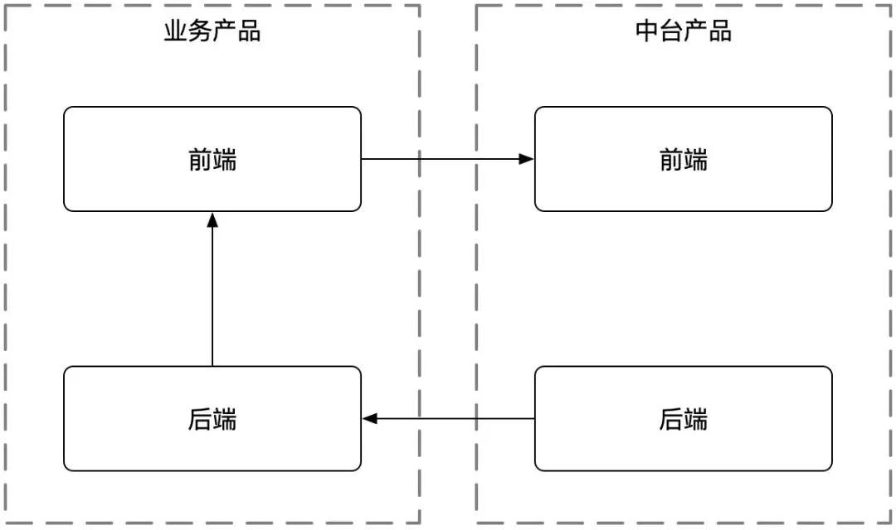
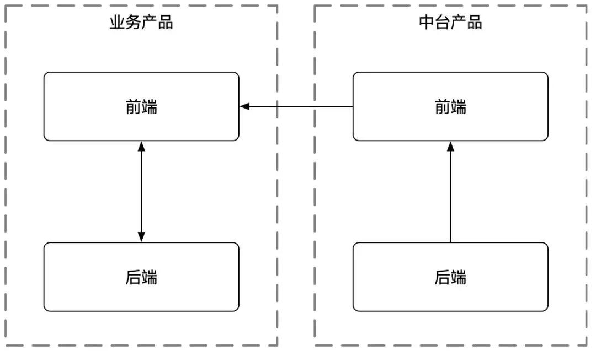

## 我的一年中台实战录  

> 何少甫  
> 发布: AI前线  
> 发布日期: 2019-08-25  

策划 | 张晓楠  作者 | 何少甫  编辑 | Linda  **AI 前线导读：** 市面上有关 中台 的“应景儿”文章越来越多，但是讲概念的多、有干货的少，毕竟中台虽然热，但是还缺少真刀真枪的实践。而恰恰本文作者，就是一位中台的实践者。他所在的团队用一年时间搭建中台，虽然因为公司战略和组织架构调整，中台项目被停止了，但是其间有太多的收获、感悟和反思，借本篇文章分享给对中台感兴趣的朋友们。

**更多优质内容请关注微信公众号“AI 前线”（ID：ai-front）** 令人唏嘘的一年 故事的开端

2018 年 3 月份，我正式成为一名中台产品经理，在这之前的一两个月，我已经和 Sunner 就中台的发展有了多次沟通。我们要做一个在线教育领域的中台产品——爱多思（EduOS），顾名思义，就是一个在线教育的操作系统。线下教育的教学工具有桌椅板凳，黑板、粉笔、投影仪等教学设备，组合成物理世界的课堂，爱多思的目标是构建出线上教育里的桌椅板凳，让其能够自由组合成一整个在线教学管理系统（LMS），并形成标准。

这是一个有挑战的活儿：

首先，当时中台在互联网公司是个新概念，如何在互联网公司里做一个中台，业界并没有太多的成熟经验可以参考；

其次，各条业务线里烟囱式的教学系统已经分开跑了很久了，在这个基础上搭建中台，就好像在给飞行中的飞机换引擎（当然，并不是每条业务跑得同样快，这也是中台能够在各个业务产品间周旋的基础）。

17 年阿里出版的那本书「阿里中台战略」是我们当时唯一找到的理论基础，阿里大中台几年的实践，以及 17 年我们通过一支几个人的别动队在内部对可行性的探索，最终让我们在申请立项时说明这事可以做成。

中台项目正式立项，我成为立项后第一个产品经理，Sunner 是负责人和产品架构师。我们计划用两年时间把中台搭建好，让爱多思能够支撑各条业务线的发展，并且能快速孵化出新的业务。然而一年过后，2019 年 2 月底，因为公司战略和组织架构调整，中台项目被停止了。

我依然清晰的记得那天，大家在会议室里讨论已经在线上跑的中台服务未来何去何从，想想在云端本地无数的代码库中有一套打着那天的 tag，然后就没有再更新过，让人唏嘘不已。

这一年的收获

回顾这一年，我们做成了这几件事儿：

1. 完成了多个教学服务的中台化改造。其中包括一些底层的基础服务，如账号、权限、点播、直播等；也包括一些具备教学逻辑的模块，如直播课、题库、问卷等等。每个服务都可以单独拿出来做成可直接给终端用户使用的产品，类似于 CCtalk、问卷星，并且这些服务和模块都已经支持各业务产品了。

2. 总结出来中台化产品设计、产品研发、项目管理的一些标准规范和套路。依照这些标准和套路，没有中台经验的产品和技术人员也可以快速的开发出中台服务，并被业务产品接入使用。

当然我们也还有一些没做完的事儿，包括：

1. 中台教学系统的闭环。我们做了一些独立的教学模块，但还没能够用中台化的标准把这些教学模块完全组合起来，形成一个可以系统化学习的课程。

2. 中台价值的量化体系。只有做好了价值量化这一点，我们才算完成了中台在商业世界里的实践，并且经验可以被推广到公司内外。

3. 中台商业化的探索。 **我个人一直希望能够把中台做成一个可商业化的企业服务，不仅仅只是一个内部支持型的产品。** 中台项目停止后，我也依然在教育 ToB 行业。时常在想：如果有了成熟的中台能够对现在的问题有什么帮助？现在看起来， **在国内目前的商业环境下，一个好的中台，其对内服务产生的价值还是远远高于对外直接输出的价值，** 庆幸当年 Sunner 压制住了我想快速商业化的诉求。

假如我们能有两年时间，不知道能否达成最初的目标，也不知道未来是否还有机会继续？但我几乎肯定的是：中台会在接下来互联网和传统产业深度结合时，变得越来越重要。名字除了叫中台外，还可能会被称为 平台、中间件、共享服务等等。

此外对于我个人而言，应该说我这一年的收获良多：

1. 进入互联网行业后，小步快跑成了常态。而在中台的这段时间，我难得能够暂时放开业务的压力，按照近乎理想化的标准去进行产品架构设计、做抽象、画 UML、花时间仔细思考。我本不是这样的人，这也算是在刻意练习了。

2. 作为一个在线教育行业的新人，通过中台我能有机会参与整个事业部涉及的所有教育业务，包括 K12、成人、ToC、ToB，让我对在线教育行业有了一个更全面的认识，从中寻找兴趣所在。

3. 结识了一帮优秀而有趣的小伙伴，大家一起做有挑战的事情，也才有了这篇文章里的回忆。

都在谈中台，究竟什么是中台？ 中台的概念

中台是近年来 IT 行业非常火的概念（这里最好加上一个”IT 行业“的限定，因为曾经有商务同事以为我是研究两岸关系的，哈哈），有很多的文章从产品、技术、组织等多个角度来解释什么是中台。对于一个快速变化的新概念而言，很难有标准定义，阿里中台某高管都提到过现在阿里所做到的离他所定义的中台还有一段距离。

给定义是非常谨慎的事情，但很多时候不给定义又没办法继续聊，所以我也曾经在一个内部分享上给中台做了定义「服务于某个垂直领域的工具平台」。在做这个定义时，我是参考了云计算的概念的。云计算是一种通用服务，那么中台和云计算有什么差别呢？按照 IaaS/PaaS/SaaS 来划分，服务的领域越来越垂直。参考这种方式，我会定义中台在 PaaS 和 SaaS 之间，主要原因如下：

1. PaaS 提供了一种服务，客户的程序员通过二次开发使用 PaaS 服务，最终完成某个功能给最终用户。PaaS 的通用性需要非常强，这样才能获得足够大的市场，比如 IM、视频云服务等，也因此 PaaS 往往是没有界面的。

2. SaaS 提供的服务不需要客户进行开发，只需要开通服务，在管理后台上配置一下就可以直接使用。但 SaaS 服务往往针对的是一个细分领域，其定制化能力也相对弱很多。即使是像钉钉，钉钉选择 IM 这种企业中最通用化的服务，同时做成企业服务的开放生态，目标客户也主要是覆盖中小企业。定制化需求强的大客户，也往往会需要希望借助 IM PaaS 服务来自主研发内部 IM 工具。

3. PaaS 和 SaaS 定位在服务外部客户，必须具备很低的使用成本。即使是需要通过技术来接入的 PaaS 服务，接入成本也一定要足够低，接口清晰，文档完善。

4. 中台首先是定位在服务公司内部客户，由于这个范围的限定，导致 **中台的通用性可以在很多约束条件下来实现，可服务的领域比 SaaS 广。** 比如即使同样是电商，淘宝、天猫、聚划算、闲鱼、飞猪的站点都是不一样的，而阿里共享事业部就在中台层服务多个业务。此外，由于中台的用户是公司内部的程序员，大家有相似的背景，也可以频繁沟通，所以服务接入的成本可以做得比面向外部客户的 PaaS 要高。

中台 vs 第一性原理

很多资料在介绍中台概念时都会引用这样两个例子：

1. 美军的特种部队加航空母舰的策略：10 人以内的一支特种部队在战斗的最前沿侦查，独立决策，一旦发现目标，迅速呼叫强大的中台航母群对其进行毁灭性打击。

2. 芬兰著名的游戏公司 SuperCell，开发了部落冲突、皇室战争等现象级的手游。整个公司才 200 多号人，就被腾讯以 86 亿美金收购。在 SuperCell 里，一个游戏开发团队平均是 3-7 个人，但有一个强大的游戏中台在做支撑，可以并行开发 50 款游戏，然后通过“内部赛马”产生出一到两款经典。据说马云在带领阿里众多高官参观了 SuperCell 后，回来就在阿里整个集团层面启动了大中台战略。

同时我想要对比的是另一个概念「第一性原理」。第一性原理也是近几年很火的一个词，基本已经成为完成颠覆式创新的大杀器。最典型的例子之一就是 Elon Musk 了。这个同时掌管 Solar、SpaceX 和 Tesla 的硅谷钢铁侠，从最基础的物理学原理出发，重新设计和制造的猎鹰火箭，正带领着人类飞向火星。

**在上述例子中，第一性原理和中台都带来了创新和成功，但其实这两者在某种程度上是矛盾的。** 第一性原理往往是打破原有的经验，跳出舒适圈，从最底层逻辑去进行思考。而 **中台是将通用的能力进行抽象和共享，将成功的经验固化下来，将有限的人力投入到创新中去。**

第一性原理是物理世界运转的本质，在没有时间条件的约束下，可以推导出整个世界。假如地球要灭亡了，只有一张纸上的信息能够保留下来，写在这张纸上的就是地球文明的第一性原理。基于这些可以重塑地球文明，但可能需要几千万年。

但人类社会的运转往往是有明确时间约束的，如果我只知道 1+1=2 时就要完成微积分，可能要穷尽一生。因此，依靠前人和自己的经验做事才是人类社会能够高效运转的基本要素，放在 IT 行业，这些经验就叫中台。经验往往能带来效率提升、成本提升、质量提高，同时也能带来偏见、惯性思维模式，中台也一样。

我们为什么要做中台？

随着「阿里中台服务」那本书在 17 年的出版，中台开始走进更多人的视野，并且在 18 年逐渐热门起来。但那时网上介绍中台的文章和分享还不多，记得我在准备公司内中台分享时，没有花多大功夫就看完了几乎所有相关内容。

而到了 2019 年，中台的热度迅速攀升，火爆程度有点类似 16 年的 VR、18 年的区块链。同时我也听说有创业公司连核心业务的商业模式还没摸清楚，上来就要搞中台。这其实是没搞清楚为什么要建中台、中台要解决什么问题：

首先，中台是支撑公司多个业务产品的共享服务，如果你的公司只有一个业务产品，能做的最多只能是良好的 架构设计， **没有多个业务产品的实际场景输入，是难以直接做出中台的。**

其次，中台的目标是提高业务产品的研发效率，但为了达到这个目的， **在一段时间内是需要以降低「效率」为代价的，** 时间长短取决于系统复杂度和团队能力的差距。

当公司随着业务发展，需要研发第二个、第三个产品时，在这种情况下可能会有两种方式来构建中台：

1. 新产品和技术架构都是继承自当前产品，不断的通过优化当前产品架构来适应新的产品，让中台服务自然沉淀出来。这种情况下的前提条件是在做第一个产品时就做好了服务架构设计，即便如此，在第二个产品时很有可能还是要走弯路，不能满足新产品快速迭代和试错的渴望。但到了第三个、第四个产品时，就会变得越来越快了。

2. 新的产品和技术架构都是重新设计，这样做每个产品的速度都差不多，灵活度也能做到最高。但每个产品都很难在技术上从前面的产品去借力。当团队人员发生变动、产品越来越多，多分支的维护和开发就凸显了人力不足的问题，这时候就需要搭建一个中台。这也是我们当时所面临的问题。

我所在的事业部发展了多年，有五条业务产品线。这五条产品线就是从一条产品线开始，随着时间的推移逐步发展起来的。和大部分研发团队的情况一样，在应对快速变化的市场环境时，我们没有能够做好系统的底层积累，而是选择了一条在当时看来是更简单的路径：从一套代码 copy 出了另一套代码来支撑新的产品。

多年后我们就有了五个独立的系统来支撑五个业务产品。我无法判断如果当时做好了底层系统架构，整个部门实际会发展成什么样。只知道当五个产品要在五套系统上快速往前跑时，研发的复杂程度和成本都太高了。为了解决这个问题，我们决定做中台。

当然我们也可以有另外的选择——砍掉大部分产品，只专注做到一、两个。但大家都知道，其实 **真正困难的不是决定做什么，而是决定不做什么，** 这种决策其实比做中台更加困难。此外，作为一家成熟的公司，一定是需要有能够形成合力的产品矩阵来支撑整个公司战略推进的，所以多产品并行是公司发展到一定阶段的必然选择，而 **做中台也绝不是站在其中某一个产品的角度来解决问题，而是站在多产品协同的角度来看公司的战略发展。**

从公司战略来看，阿里巴巴的曾鸣在「智能商业」一书中提出了看十年、做一年的观点。在日益复杂而又快速变化的市场环境中，公司已经无法做到一个五年的准确的规划，并执行下去。而需要通过看十年的终局思维来看到行业最终会成为什么样子，从而制定公司愿景和方向。

通过做一年的方法来制定计划，快速落地一些事情，然后根据效果来迅速调整方向、更新计划，朝着终局推进。要想做到这点，基础能力的积累就非常重要，而中台也是其中非常重要的部分。

站在产品团队的角度来看，一个搭建完成的中台基础框架，能够带来的直接价值就是：

*  **成本节省。** 需要开发新功能时，很可能这个功能中台已经提供了，产品经理提供配置参数，研发直接接入服务就可以用起来了。

*  **效率提高。** 在中台上开发新功能，只需要参考标准和文档，一个新人也可以快速上手，并且这个新功能还可以被其他产品直接使用，产生复利效应。

*  **质量提升。** 从两方面来看：

* 设计质量。中台团队通常会以功能模块为划分，专职负责某功能模块的团队往往会更有意愿去突破一些难点，成为最懂此功能模块的团队。比如现在教育领域最热门的授课方式就是直播课，而直播功能就是一个有较高门槛的功能模块。要想做出适合业务发展的直播功能，需要对云计算、计算机网络、直播授课方法、直播运营等多个方面都有较为深入的了解。这需要团队能够有一定程度的积累，不是从某一个业务产品研发团队里找几个人就能很快突击出来的。

* 研发质量。中台的服务往往提供给多个业务产品使用，出现故障就会造成大面积的问题。所以 **质量保障往往是中台服务的生命线。** 每一个下沉到中台的服务不但会经过常规的测试，还会在 Code review、单元测试覆盖率等指标上有更为严格的要求，力保高质量的交付。

我们是怎么做中台的？ 产品设计层面

随着中台的日益火爆，如何做一个中台产品经理也成了一个新的职业发展热点，最近也看到有了线上的中台产品经理课程。中台产品经理是 B 端产品经理的一种类型，有 B 端通用的能力要求，比如擅长做抽象建模、具备一定的研发技术功底、懂 UML 等，我在这里就不一一展开了。但就中台服务多个内部业务产品为主的特点来说，会对中台产品经理有些不一样的要求。在我个人的经历里，我认为有三点非常重要：

1. 中台产品经理如何设计出用户体验好的功能？由于教育中台对其服务的要求是从前端到后端的完整服务（具体原因在技术部分介绍），因此教育中台的产品经理所设计的功能需要直接面对最终用户，也需要保有良好的用户体验。

在上图中，业务产品经理的能力要求偏向市场侧，中台产品经理的能力要求偏向研发侧，绿色部分是两类产品经理都需要掌握的。教育中台对产品经理一直有要求，必须走到需求的源头不能只接二手需求。抛开个人能力而言，这对其提出的难度在于：必须花大量的精力去熟知不同的场景。

中台产品经理是按照功能模块来划分职责的（如题库、直播），但实际的使用场景是用户使用整体产品的全流程，并不会只看某个功能模块，因此每个模块的产品经理需要了解所支持的所有业务的全部场景，才能做好相关模块的设计。同时教育行业是碎片化的，不同业务之前的场景差异性比较大，某模块的中台产品经理如何才能快速的熟知所有业务的全部场景？这是一个难题。

2. 中台产品经理和技术的分界线在哪里？也许这不仅仅是做中台产品经理才需要考虑的问题，但在教育中台的很长一段时间内，我的疑问比以前任何时候都强烈。中台里有太多的产品设计，可以由具备产品思维的研发人员来考虑，但更多时候，还是需要向技术深入一步的产品经理来组织研发人员一起设计。

举个极端的例子：为了降低各个业务产品在各个端（前端、后端、移动端）接入中台服务时的配置管理难度，我曾考虑改进中台服务里零散在各端代码中的配置管理，做到集中管理并且可灵活配置。此外还拓展出支持未来可能的中台服务付费需求。为了描述清楚需求，我写的 PRD 里除了描述各种场景和功能外，还用伪代码描述了如何使用。虽然伪代码的水平可能会被研发同事鄙视，但达到了清晰表述问题的目的。

本文我无意提倡 PRD 里要写伪代码，主要想要说明的是 **中台产品经理不要指望能够和技术有清晰的界限，** 应该坚定的跨过去一步，同时也把产品思维带到技术中去，搭起一座桥。

3. 中台产品经理如何设计一个新功能模块，让它能够满足各方需求，且推动其在各个业务产品上使用起来？除了要求产品经理有极强的专业能力外，还需要具备极强的主动性、沟通能力、甚至是商务能力，在各个业务之间想尽办法把中台的种子种下去。相关的经验在在本文的「中台策略对组织架构的挑战」部分做了介绍。

技术层面

在中台架构的设计之初，我们就定位了教育中台需要提供的不仅仅只是后端服务，一方面纯后端服务和 PaaS 服务就没太多区别；另一方面由于教育中台所希望提供的服务的业务属性非常强，提供的服务复杂程度远高于常见的 IM、视频云等常见 PaaS 服务，如果完全通过后端开放接口来使用，接口的数量会非常多，调用的逻辑关系也会很复杂，使用成本会远高于常见的 PaaS 服务。

因此我们希望教育中台提供的是前后端一体的服务，最终展现给用户的是前端模块 / 组件。理想的情况下，业务产品的前台页面只要嵌入中台某功能服务的前端模块，就可以使用该模块的完整功能。这种方式最大限度地拓展了中台服务的价值，但也给中台服务在设计中带来巨大的难度。经过一年反复的煎熬，我们也整理出了几条设计原则：

1\. 数据结构的统一是底线

理想情况下，教育中台搭建完一个模块，各个业务产品一接入就能完美的用起来。但实际情况下没有产品经理和研发具备这样的能力，反复是一定要的，甚至于有时候教育中台需要去做一个需求还不明确的功能（我通常反对中台新做功能来完成业务产品的需求验证，ROI 太低了）。当面对这样的情况时，一定要坚守的底线是数据结构的统一。研发同学都知道数据迁移是一个大坑，所以 **只要数据结构是统一的，任何逻辑和交互的变化都是可以接受的。**

2\. 前台界面通用的边界

数据结构的统一、后端服务的共享，是容易在思想上达成一致的，难的部分只是在执行。但前端界面统一的观点自始至终都在激烈的辩论中。对于一个 ToC 产品的产品经理和设计师来说，往往对交互、视觉都非常敏感，这也是 ToC 产品能够在第一眼就留住用户的最重要原因。

但中台服务为了做到重用，往往很难在一些细节的交互上和视觉层上，百分之百的满足每个业务的需求。并且在这种用户体验的层面，往往没有谁能够说服谁。 **对于设计型的产品经理而言，不能把控自己产品界面里的设计，简直就是被亵渎，** 因此在前端界面统一这件事情上的争论有多激烈，可想而知，我自己在这件事情的立场上也有摇摆。在多个 case 的纠葛后，我们推动了几件事情，不敢说解决了这个冲突，至少是改善了问题：

1. 推动更新整个事业部产品的交互视觉规范。对于建立规范大家都是没有疑问的，在交互规范不完善且没有被严格执行的情况下，很多时候产品经理都需要为了一些交互细节大伤脑筋：比如编辑框里字数超出了限制应该怎样提示？诸如此类。当交互规范完善，且做成了 Axure 组件后，普通产品经理都有了升级成产品设计师的可能，基于规范和组件就可以做出一个完成度很高的交互稿。而视觉规范是整个事业部各产品统一品牌形象的条件，也是统一前端组件的基础，设计在前端组件级达成一致是可以的。

2. 根据用户前台和管理后台加以区别对待。用户前台是给终端用户使用的，也是大量 C 端用户直接接触产品的入口，不同业务的用户往往在交互和视觉上有不同的需求。而管理后台往往是给一些特殊用户、比如管理员使用的，这类用户首先数量相对少，后台操作也不那么频繁。且这类用户在操作管理后台时具备 B 端用户的属性，很多时候是部门内的运营，对功能是否强大的敏感度高于视觉体验。

因此教育中台尽量能在管理后台的前端界面上保持统一，而用户前台页面会考虑放开让各个业务产品自己做。当然这一点很容易就可以找出反例，因此也只是在设计过程中的一个指导方向，并不是定理。

3. 根据业务的目标用户年龄层次进行区分。事业部有面向成人、K12、年龄更小的儿童等各个不同年龄阶段用户的产品。年龄越小的用户对交互和视觉的要求越高，爱奇艺还专门推出了面向儿童的奇巴布。整个交互和视觉都做了重新设计。因此教育中台尽可能在面向成人的产品里去做到前端界面通用，不考虑和面向低龄人群的产品有任何前端界面的复用。

3\. 前后端直连

教育中台的用户是部门其他业务产品线的程序员，虽然都是内部用户，但降低用户的使用成本是非常重要的，我在组织架构部分会详细介绍。 **要想推动教育中台在内部业务的使用，必须要最大程度的降低用户的使用成本。**

第一年我们教育中台的别动队在搭建服务验证可行性时，服务的架构设计是这样的：

业务产品的后端从教育中台的后端获取数据后，通过业务产品的前端拼装好再传给教育中台的前端模块进行显示。这种方案其实等同于把一个模块的开发按照人头分工到两个团队来开发，理论上来说可以满足任何业务的需求。早期在需求还不那么确定、业务也比较少的时候，这样去进行探索是可行的。但当接入的业务产品多起来，这种架构会带来几个很麻烦的问题：

* 业务产品的前端和后端都分别需要和教育中台的前端和后端直接对接，需要对教育中台的接口有很深入的了解，服务的接入成本非常高。

* 由于教育中台后端暴露的接口太多，很容易在后续更新时发生变动，从而导致所有已经接入的业务产品都需要发生代码改动，并进行回归测试。

为了解决上述问题，我们改成了前后端直连的架构设计：

在这种方式下：

* 教育中台的前后端是直接交互，可独立运行的。

* 只需在前端层进行接入，接入成本大大降低。

* 只要有限的接口保证稳定，教育中台的升级对于业务产品是无感知的。

直连的架构在某些特定情况下会增加功能实现的难度，比如要在教育中台前端模块里去显示其后端服务没有的数据时，会面临拿数据困难的问题。但总体来讲带来的好处远远大于增加的难度，我们也基本确定了前后端直连的架构是教育中台服务首选的方式。

中台策略对组织架构的挑战 高层的支持重要吗？看过一篇文章「重新理解中台—中台的战略和困境」，对中台在组织架构层面的需求做了比较好的介绍，其中最关键的就是：中台是自顶向下的，中台一定需要得到高层的支持。

和绝大多数商业化的事业部一样，我所在事业部的 KPI 一直是可量化的营收数据。而中台项目在启动运转的相当长一段时间内， **我们所做的很难对 KPI 有直接帮助，甚至于在局部较短时间内是阻碍当年 KPI 达成的。**

大部分员工是很难站在一定的高度去做一个”看十年、做一年“的规划，特别是当一件事和眼前的 KPI 难以达成平衡时，中台的工作会受到各个方面的挑战。因此高层的坚定支持是中台战略的第一必要条件。 **中台的价值是有条件的，搭建完成后还得有机会来享受成果，这个判断也需要高层来完成。**

此外高层还需要推动一些规范的建设，如交互规范、视觉规范、视觉配套的前端组件规范等，在这些规范的约束下，中台服务搭建的难度会大大降低。

各业务产品的支持重要吗？

高层的支持是基础，但在中台和业务产品实际工作中，无数次的碰撞都需要靠中台自己的影响力来推进。因此中台如何在各业务中获得影响力，并推动各业务接入服务也是至关重要的。那么如何推动业务产品接入中台服务呢？

1.  **直接利益就是人力成本节省。** 针对单个业务而言，他们最关心的就是接入中台服务能够为其节省的成本，这个计算方式在后面的「中台价值量化」部分会介绍。

2.  **理念的灌输。** 除了高层的直接支持外，中台的各负责人会时不时的在各种场合给业务的负责人和小伙伴「洗脑」，鼓吹共享服务的思想。

首先拉动的一定是研发人员，好的研发人员是有代码洁癖的，即使他不得不在某些情况下写出恶心的代码。如果跟他们去聊抽象、架构和重用，天然就会产生亲切感。

面对业务产品经理就往往需要做交换了——我可以在中台功能设计里支持你的一个偏定制需求，但你得答应要接入我的另一个服务，我甚至于可以出人力帮你接入。

3.  **形成生态系统。** 当 iOS 和 Android 已经成为世界上最大的两个移动端操作系统后，无论开发者多么希望按照 Windows Phone 的标准做开发，也只能选择 iOS 或 Android，这就是生态系统的力量。同理，当中台统一了各个业务的基础服务后，上层的业务功能无论有多么个性化的需求，都不能跳出基础服务的限制。

而对于一个业务而言，放弃中台的底层服务、自己重新搭建一套系统也几乎是不可执行的，这太不划算了。无论该产品经理的主观意愿多么强烈，在 ROI 的压力下也很难获得支持。当然，每个产品最初都需要一批种子用户来实现冷启动，中台服务最初也需要能有种子客户来打磨产品，那么应该找谁来合作呢？大家习惯性会想去找战略型的重点业务产品，做成标杆客户。但实际上重点业务产品往往人力充足，并且跑得飞快，一个还不太完善的中台服务想要直接跟此类产品合作是非常难的。

重点业务不在意成本，也不那么在意质量，他们更在意的是速度，这和中台本身的定位是有矛盾的。因此， **中台服务反而应该去找潜力型的业务产品进行合作。** 此类业务有着表现自己、赢得关注的欲望，但又苦于资源不足了，是非常有意愿去借助中台的力量做事情的。

当然，中台支持此类业务产品需要承担的风险就是：这个业务产品可能活不了多久就被老板砍掉了。因此如何选择具备潜力的产品，这就是需要中台负责人在战略上能有敏锐判断的地方了。

保留力量，去做重要不紧急的事情

由于互联网公司多年来信奉的就是「唯快不破」，团队在做优先级排序时，往往会倾向于去做业务价值最明显的事情。有很多重要不紧急的工作就被压在后面，永远没有再被提起过。但对中台产品团队需要有不同的要求，中台产品一定要保留力量始终去做一些基础的、重要不紧急的事情。

就好像公司如果想要做得长久，除了在商业上的持续投入外，一定要保留足够的人力来做基础性的研究，近期华为的海思芯片和鸿蒙操作系统就是最好的例子。

我们在做中台时，无论外部各个业务需求的压力有多大，都应该始终保持有一个小队在做基础组件和规范建设。比如在各套业务产品里的权限体系都还能跑、但某些功能始终无法完美支撑时，我们按照 RBAC 的方式进行一个新的角色权限系统的设计，并提供了数据迁移方法，也最后为新的业务模块功能开发打下了基础。

中台价值的量化

即使我们都认为一件事情是正确的，价值量化依然是最重要的事情之一。中台是一个 ToB 服务本质上是成本的节省和效率的提升，但由于中台的客户是内部业务产品的程序员，这个价值的量化就变得比一个给销售用的 CRM 系统要复杂了。

中台是提供给多个业务服务的共享服务，任意一个中台服务都可以为业务节省成本，因此被越多的接入，整体节省的成本越大。同时由于每个业务在整个事业部里都有不同的优先级， **被高优先级业务接入的中台服务，能够产生的价值就更越大。** 这是符合直觉的，但如何去量化这样的价值呢？提供以下的计算方法：

假设：

* 各个业务在事业部的优先级系数 = a1、a2、a3....；

* 中台服务被某一个业务接入后给业务节省的成本（人天） = 业务自研此服务的成本 + 业务自己运维 - 业务产品接入中台服务的成本。

可以推导出每个服务开发出来后对整个部门节省的成本是：

* 总体成本节省 = （a1\* 业务 1 节省 + a2\* 业务 2 节省 + ...）- 中台开发成本 - 数据迁移（适配层开发\)）- 中台运维。

由于中台团队要同时面对多个业务的需求，根据以上公式，我们也可以得出一些判断需求优先级的基本规则：

* 部门战略，也就是业务的优先级的系数。显然来自战略级业务的需求优先级是高于其他普通业务的；

* 需求靠谱程度。这里面包括两个层次：

是否是核心的需求？是否是伪需求？

提出需求的业务是否靠谱？是否可能很快就被干掉了？

* 与中台自身目标的契合程度。这也很好理解： **中台不是业务的外包团队，中台需要有自己的思想和规划。**

> 需要说明的是，虽然有了这样的计算公式，但我们在实际工作中并没有直接去量化每一个功能。主要原因在于教育中台正式立项一年的过程中，团队一直在探索中台设计的套路，比如如何才能较好的满足需求，快速的被接入，并且在运维层面对业务做到无感知。只有在搞清楚这些讨论之后，中台服务才有可能会对节省成本有明显的帮助。因此量化只是少数几个团队核心成员做规划时的参考，而没有直接做为产生的价值而公布出来。

青山绿水，江湖再见

从教育中台组的解散到今天，已经过去差不多五个月了。在写此文时回忆起中台这一年，感慨万千。

感谢两位主管 Sunner 和 Genify，Sunner 作为中台业务负责人和产品架构师，亲手搭建了整个教育中台的底层基础和业务抽象，包括「爱多思」在内的很多特有的名字都是他取的。他是我直接的老师，他对爱多思能够成功的信念、是我在多次迷惑中能坚持到最后的最主要原因。Genify 是研发负责人和技术架构师，从抽象的业务模型到实际可执行的技术方案，再到技术规范的形成，中间依然需要有一条靠经验和想象力来架设的桥梁，而他就是这座桥梁。

感谢一起战斗过的和没来得及深入合作的同事，这些思考和追忆属于我们每一个人。

感谢部门老大，没有他的支持，中台根本不可能立项。

青山不改，绿水长流，他日江湖再见，自当把酒言欢，就此别过。

作者介绍

何少甫，网易有道中国大学 MOOC 资深产品经理，所关注领域主要为在线教育和企业服务。

