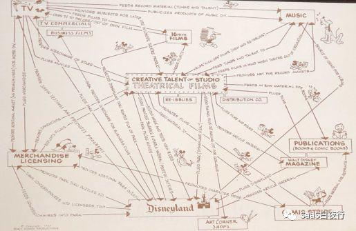

## 做商业SaaS的还算SaaS公司吗？| SaaS创业路线图（60）  

> 发布: 吴昊@SaaS  
> 发布日期: 2019-08-27  

编者按：本文来自微信公众号[“SaaS白夜行”（ID：SaaSKnight）](https://mp.weixin.qq.com/s/-pT95aR8-pcAejvY76ZfVg)，作者吴昊SaaS，36氪经授权发布。

**作者介绍** **-** 吴昊，SaaS战略及营销顾问，系列文章作者，目前在撰写一本关于SaaS创业的书籍。

（SaaS创业路线图）

过去60周以来，我每周二都发布一篇，只在今年春节间断过一次。昨天在一个SaaS圈销售管理者闭门会上，我开玩笑地说，在这个VUCA时代，规律被不断打破、什么都不靠谱，所以我们做事情更得“靠谱”才行。而守时，就是靠谱的表现之一。

60表示“及格”，我仍会继续写，先定个目标到99篇吧。在我的SaaS创业知识体系里，可写的东西很多，在这个关键数字上，我还是想继续谈谈商业模式。 **这里的隐喻是，如果商业模式没设计对，无论多努力，你的创业都没法及格。**

上一篇谈商业模式的是第55篇《SaaS产品分类及其发展方向》，我把SaaS产品分为两大类：

\* **工具SaaS** ：为客户企业提供了一个提高管理效率的工具。

\* **商业SaaS** ：除了提供一部分“工具”价值外，还能为客户企业增加营收、提供新的营收项目。

我提出的“商业SaaS”，在SaaS圈争议不少。有好朋友问：

**一、“慧算账”算不算SaaS公司？**

我先简单介绍一下“云账房”与“慧算账”这2家服务代记账行业的公司。

\* **云账房** ：官网Slogan是：代账行业专用财税软件、一键批量报税。他们是一家典型的SaaS公司，为代账公司和拥有会计岗位的企业提供效率化财务税务核算工具。

\* **慧算账** ：官网Slogan为：专为中小微企业提供财税工商服务。他们通过SaaS+财税服务模式，为中小微企业提供代记账等服务，看起来更像一个巨型代记账公司。

在2017年B1轮融资时，据其官方介绍，“慧算账财税作业一体化平台已经更新了共计 34 个版本，覆盖各种客户体量近百个细分行业的数万业务场景”。他们通过SaaS交付模式及时响应及满足企业财税服务需求。

我这位朋友是头部SaaS公司的创始人，他的结论是：慧算账不是SaaS公司。

我认为，从慧算账的营收构成上看（收代记账服务费），确实与典型的工具SaaS（收软件服务年费）有很大不同。

昨晚我和一个知名行业SaaS的创始人聊天。他们3年前就在C轮拿到上亿（换算为人民币）的投资。他有同样的困惑：我们是不是SaaS公司？公司应该按SaaS公司的10倍P/S（用市值÷销售额）估值？还是用传统企业的方式，按10~20倍P/E（市盈率：市值÷利润）估值？

这让我想起商学院里一个非常经典的战略分析案例，我从具体问题中跳出来给大家分析一下。

**二、小迪斯尼画在餐巾纸上的战略地图**

迈克尔·艾斯纳是迪斯尼公司1984年~2005年的CEO，他通过收购电视网（包括190亿美元收购ABC）、杂志、报纸、出版社、职业体育队伍、迪斯尼游艇、美国互联网公司，将公司营收扩大到121亿美元（1995年）。然而，从1996年开始，随着不断并购，迪斯尼公司的利润却出现下滑。

下面这张图最初是小迪斯尼画在一张餐巾纸上的。（关于教授提到的小迪斯尼：我查了一下，沃尔特·迪斯尼没有儿子，迪斯尼家族成员曾经在公司有影响力的是沃尔特的弟弟和女婿、侄子三人，这里应该是指沃尔特的侄子罗伊·迪士尼。）

这张图四周有很多迪斯尼的业务，包括：电视网、音乐、出版物、连环画、迪斯尼乐园、动画人物周边产品授权销售，中间画的是创意工作室和电影。

我们想想，迪斯尼是个游乐场公司吗？还是个电视公司？

**进一步的问题来了，我们如何界定一个公司是“xxx”领域的公司？我认为关键是看其核心业务是什么。**

对于迪斯尼来说，游乐场挣钱、周边产品授权也很挣钱，但这一切的基础是迪斯尼创造了米老鼠、唐老鸭等一系列动画形象，也就是大IP。没有这些IP，游乐场就没有任何特色和优势、周边产品的授权也没人会买。

这也是从1996年开始，迪斯尼陷入发展危机、老CEO迈克尔·艾斯纳黯然下台的主要原因 —— 收购一大堆边缘业务，表面上快速提升了公司的营收；但不重视核心能力，公司的竞争力实质上在下降（体现在盈利能力上，就是利润连年下降）。

在罗伊·迪斯尼的主导下，2005年罗伯特·艾格成为公司新的CEO。艾格做的第一件大事就是搞定乔布斯并且收购皮克斯。随后2009 年，迪士尼收购漫威（现在看看“漫威超级IP的世界”，想想这笔收购有多划算！）、2012 年迪士尼又收购卢卡斯影业。

为什么要收购这些创意公司？因为迪斯尼的核心能力“创意“在丧失，只有通过收购快速补上。

随着核心能力的提升，迪斯尼公司的股价在2005年之后的10年增长5倍多，目前市值2000多亿美元。

**同样是收购，收购边缘业务和收购核心业务，结果如此不同。**

几年前，大家爱说，“麦当劳不是快餐公司，其实是个地产公司”（购买了很多自用的店面房产）、“腾讯不是社交软件公司，而是游戏公司”（游戏收入占比很高）。

这只是对公司印象上的矫枉过正，麦当劳的主业还是汉堡；腾讯如果没有微信/QQ导流，游戏也卖不好。

换句话说，腾讯有这些流量，还可以卖广告啊。2019年Q2，腾讯网络游戏在主营板块营收的占比已经降到30%。

敲黑板了！总结一下： **定义一个公司是什么领域的公司，不是看它的主营收在哪里，而是看它的“核心能力”是什么。**

三、 **回到“什么是SaaS公司”的话题上**

那么我说的那些“商业SaaS”公司能否算SaaS公司呢？

以我昨晚这位朋友的公司来看，他有大量营销服务收入，如果这些营销服务基于SaaS产品积累的数据，我认为这就是SaaS公司。

再举个例子，7月份我在腾讯SaaS加速器做评委。一家上来路演的公司是做某细分制造业SaaS ERP的。这公司的SaaS软件年费收入没多少，但基于ERP数据，他们就有能力为这些制造企业客户提供物流服务、贷款数据服务（收取金融机构的佣金），一年有几个亿的营收。

进一步讲，你当然不能把这家SaaS ERP公司叫做物流公司或金融数据公司，因为说不定哪一天，他基于SaaS数据，又做出一个现在完全猜不到的新业务，打个比方，成为集中采购商。到了那一天，我们难道又把这家企业界定为“大宗货品批发商”？

不，他一直都是SaaS公司。

说回 **“慧算账”** ，如果它达到这样两点之一：

\* 要么，通过以SaaS产品为主的技术手段显著提升了规模化代记账的效率，效率比几十万中小代记账公司各自使用“云账房”产出的效率高很多；（“规模无效率”在很多行业也是常见的，例如夫妻百货店，大公司收购连锁后也很难通过提高效率多盈利）

\* 或者，虽然代记账效率没有特别大差别，但SaaS由此沉淀下来的数据有巨大价值，将来能够由此做出增值业务。（我认为这一条“慧算账”是有很大机会做到的。详见我的另一篇《SaaS创业路线图（34）SaaS公司的数据价值》）。如果从这一点出发，“慧算账”和“云账房”的终极目标并没有多少差别。

符合以上两条之一，SaaS就是它的核心竞争力，那么我认为这就是SaaS公司。

相反，如果SaaS不是它的核心竞争力，获客方式与传统代记账公司也没有不同，那么它就是一个超大代记账公司。

当然这并不是好坏之分，评价一个公司，不是看它的标签，而是看它创造价值（盈利）的能力。

四、 **再谈谈数据**

再进一步，我们谈谈SaaS的数据。

1、 **SaaS产品里客户的历史数据很值钱！** 我和几位个人很钦佩的投资人聊到SaaS公司，大家会认为每个行业（甚至细分领域）未来头部的2家SaaS公司会非常值钱。因为他们可能分别有60%/30%的市场份额，也就是说他们掌握了行业里30%或60%企业过去几年的历史数据！一旦数据在一家SaaS公司沉淀了5年，另一家SaaS公司是很难替换的。

你可能会觉得，数据属于客户，客户如果要换供应商，把老系统的数据迁移到新系统不就行了吗？

事实并非如此。我作为项目经理亲自带领Data Migration（数据迁移）团队用1年时间做过2个系统间的数据迁移。首先，成本高昂，花费几百万人民币；其次，仍然会因为数据结构不同丢失不少有价值的数据。因此迁移后，数据的价值会丢失很多。

而且，能迁移的其实是raw data（原始数据，例如客户拜访记录），每个系统还有大量有价值的metadata（中介数据，也就是“描述数据”的数据，例如某团队多个维度的年度拜访统计数字）。中介数据完全是开发者定义的，与客户业务的关系更弱，与开发者的业务理解能力相关，更难带走。

2、 **SaaS公司的数据能力，不只是提供静态的历史数据。**

通过不断积累行业know how，行业SaaS公司对行业的理解其实是能够超过行业里绝大部分老板的。

我在多个行业SaaS公司都看到这个状况 —— SaaS创始人给行业里十几个头部公司的大老板们上课。这也不难理解，除了对自己公司的增长焦虑、对互联网新思考方式的渴望（这些都太忽悠了），更重要的是，行业SaaS公司确实看到得多啊！在这个产业大变革的年代，固定在一家企业里工作，有很多新思路、新方法是自己遇不到的。

行业SaaS公司除了输出满足客户需求的方案，也要考虑如何结合企业沉淀下来的内外部数据，提出更好的业务运作方式，并用SaaS产品提供支撑。这就形成“流动起来的 **活的数据** ”。

**五、并非“商业SaaS”的模式**

对于一个工具SaaS公司来说，如果只是通过销售代表与客户的“客情关系”卖更多产品或服务，而不是通过数据来提供增值服务，那么我认为这不是商业SaaS。

举个例子，我与一家非常优秀的门店类SaaS产品交流（为了保护对方的商业信息，我不能提及具体行业及具体商品）。他们除了提供标准SaaS服务，也为这些门店客户提供消耗品。客户通过SaaS平台买这些消耗品，不是因为与SaaS公司的销售代表熟识，而是因为从SaaS公司采购确实有很大便利：该行业对各类消耗品的有效期非常重视、对顾客与消耗品之间的关联关系也非常看重，决不能出错。

我认为 **这类有数据增值价值的才是商业SaaS，只靠工具SaaS的客情多卖实物产品的，应该不是。**
