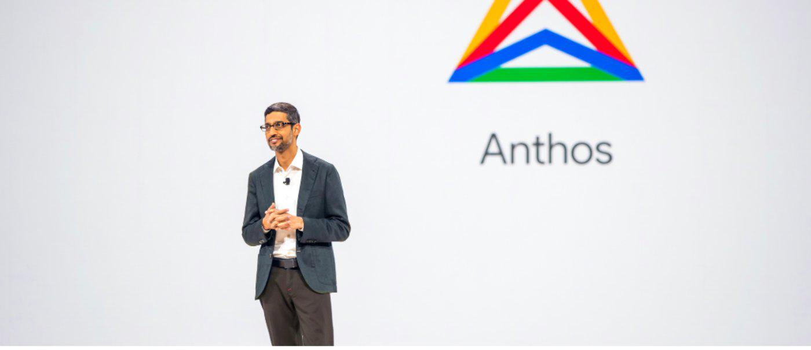

## Anthos深度分析，看懂谷歌云的三级火箭-InfoQ  

> 作者: 郭华  
> 发布日期: 2019 年 9 月 19 日 14:03  

今年 4 月 9 日，谷歌在旧金山召开了 Google Cloud Next 19。

大会持续了两天，共有 75 个专题，100 多个公告，30000 多人参加。

但我认为真正值得注意的只有下面 5 点：

* 一个产品，Anthos；
* 两个人，谷歌 CEO 桑达尔·皮查伊（Sundar Pichai），谷歌云 CEO 托马斯·库里安（Thomas Kurian）；
* 两件事，扩充销售队伍，拓展合作伙伴。
透过这 5 点我们便能看清谷歌云三级火箭的全貌。

那便是 **以开放的方式抢占云计算入口，进而推广谷歌云。**

唔？

你可能会问我“你确定这不是两级么”。

还有一级藏的太深，其实真的有三级。

不信，请往下看：）

### 01 Anthos

“Bringing the cloud to you”。

把云带给你，这是 Anthos 产品页的第一句话。

短短五个字，既表明了 Anthos 云计算入口的定位，也表明了谷歌云你不过来我就过去的态度。

简单又值得品味。

不过 Anthos 本身却是一个比较复杂的东西，它由原来的谷歌云服务平台升级而来，下面包括多种产品和解决方案，如 GKE （Google Kubernetes Engine）、GKE On-Prem、Istio on GKE 等……

完全展开讲既不现实也无必要，为了让大家更容易理解，我做一个简单的定义：

Anthos 是以 **Kubernetes** 为核心的 **混合云 / 多云** 管理平台。

概念不多，我们一个一个解释。

### 02 混合云

混合云（hybrid cloud）不是什么新概念，18 年 AWS 发布了混合云平台 Outposts，随后 Azure 也发布了 Azure Stack。我前面的文章[《AWS 杀死了云计算……》](https://www.tmtpost.com/3864686.html)提到过云计算伴随互联网创业潮兴起，那么同样会伴随其衰落，以 AWS 为例，近年来增长率只有 40% 多，下滑明显。

图 1 AWS 营收与增长率 form bernardgolden.com
只看这份数据，我们可能会得出一个结论是云计算逐渐见顶。

但其实并不是。

图 2 IDC IT market

对照 IDC 的调查数据便可知道，传统数据中心仍然占了市场大头，并且私有云也会逐渐扩大，所以很明显云计算还有很大空间。

那为什么 AWS 增速放缓了呢？

因为现在互联网红利吃的差不多了，该上云的也都上了，剩下的都是传统企业客户，他们对数据安全性，资源可控性要求更高，所以对公共云并不是那么认可。

市场很大，但都是难啃的骨头。

比起公共云，他们更容易接受私有云和混合云。

私有云指的是给客户在自己的网络环境中部署一套云系统，与外界隔离。

混合云指的是公共云、私有云甚至自建机房混合使用，核心 & 稳定的业务放私有部分，外围 & 弹性的业务放公共云，数据和应用统一管理并且能够在两种云中间自由移动。

对客户来说，混合云的方式既留了核心数据，降低了迁移风险，又能在原来资源的基础上增加公共云的弹性，一举多得。

而对云厂商来说，占住混合云的口子，其实相当于搭建了一条资源迁移的通道——业务增长，云上扩容最方便，时间流逝，自建机器终要报废，此消彼长，最终达到上云的目的。

所以虽然 AWS 过去一直号称只有公共云才是真正的云，但面对现实也不得不妥协推出了以 VMware 为核心的 Outposts 混合云产品。

从这个角度看，谷歌的 Anthos 并不算高明，甚至比起竞争对手来说还略显反应迟缓。

### 03 多云

如果说混合云是纵向扩展市场，那多云则有点横向抢市场的感觉了。

狭义上多云（multi-cloud）指的是混合使用多个云厂商的资源，比如 AWS、Azure 和谷歌云。

对客户来说，多云策略的好处一是防止被某个云厂商锁定，二是云厂商出故障时尽量不影响自己。这并不是杞人忧天，17 年 AWS S3 宕机影响了很多公司，比如 Adobe、Docker、GitHub、Slack、GE、Quora 等，根据统计 A-Z 26 个字母全部占满，可见影响之大，大家戏称 AWS 瘫痪了全球一半互联网。

近几年来几乎每年都有云厂商发生故障，越来越多的企业开始慎重考虑这个问题。

但 Anthos 仅仅是从客户角度出发的吗？

谷歌就没点私心吗？

我认为不是。

图 3 云厂商市场比例

Anthos 目前支持谷歌云、AWS 和 Azure 三种云的混合使用。

不难想象，Anthos 相当于在谷歌云和 AWS、Azure 之间搭了一个桥梁， 从图 3 的数据看，谷歌云所占市场份额还相对较小，显然从直觉上客户会源源不断的“扩散”到谷歌云上来。

Anthos 并没有支持份额更小的 IBM 云与阿里云，这与 2018 年 IBM 推出的多云工具只支持 AWS、Azure 和 IBM cloud 如出一辙。

再问问龙头老大 AWS 的对多云的态度，AWS“对多云的实际价值表示观望”。

只支持自己和比自己市场份额大的平台，或许这就是多云产品的热力学第二定律。

### 04 Kurbenetes

一纵一横，Anthos 野心很大，但从前面描述也能看到，Anthos 既不是第一个混合云方案，也不是第一个多云方案。

它能成功吗？

我觉得有希望，至少从需求看这部分市场很大。

图 4 RightScale 2018 State of the Cloud Report

RightScale 调查了企业客户（雇员大于 1000 人）对云计算的态度，数据显示所有受访者中 51% 考虑混合云，21% 考虑多云（公共云），另有 10% 考虑多云（私有云），总体加起来占 81%。注：这里多云的概念被泛化了，包括混合云和狭义的多云。

这比例相当惊人。

所以市场绝对有，关键还是看产品能不能做好。

这时候就不得不提 Anthos 所依赖的 **Kubernetes** 了， **这才是谷歌云的第一级火箭** 。

Kubernetes 是谷歌开源的容器编排系统，2014 年对外宣布，2015 年发布 1.0 版本，同年谷歌与 Linux 基金会一起成立云原生计算基金会（CNCF-Cloud Native Computing Foundation），并把 Kubernetes 作为种子产品捐赠给了 CNCF。

这里又涉及了一些新概念，比如容器化，比如云原生。

* 简单说，AWS EC2 等产品是基于虚拟机来做的资源虚拟化，而容器化是比虚拟机来说更简便的一种部署方式；
* 云原生（Cloud Native）与其说是一种技术，不如说是多种技术组合而成的规范，最开始包括下面三个特点：
* 应用容器化
* 面向微服务架构
* 应用支持容器的编排调度

云原生的目标是 **帮助公司和机构在公有云、私有云和混合云等新型动态环境中，构建和运行可弹性扩展的应用** 。

在谷歌的推动下，Kubernetes 和 CNCF 都发展迅猛，早在 2017 年 AWS、Azure、谷歌云、阿里云和 IBM 云等前五大云厂商都已经成为了 CNCF 会员， **并纷纷在自己的云平台中提供了 Kubernetes 服务** ——用外国人的话说这叫做“他们确认了云原生和容器是企业计算的未来”。

图 5 Google Trends ：EC2 VS Kubernetes
这点从 Goole Trends 也能得到印证，自 2017 年末开始 Kubernetes 的热度已经超过了 EC2，且差距在逐渐加大。

Kubernetes 这一级已经飞的足够高了。

所以按照这个趋势，大家将来会以云原生（基于 Kubernetes）的方式使用云计算，而这一切都是开源技术，理论上不管是自建机房还是私有云，也不管是 AWS 还是谷歌云，技术栈都一样。

所以 **Anthos 能够以 Kubernetes 为核心统一混合云与多云的解决方案，这便是与竞争对手最大的不同。**

既然 Kubernetes 这么重要，那为什么谷歌还要把它捐给 CNCF？

这不得不提一下谷歌的开放云（Open cloud）策略。

谷歌云官网有一篇文章[《Why we believe in an open cloud》](https://cloud.google.com/blog/products/gcp/why-google-believes-in-open-cloud)详细描述了谷歌对云计算的看法，重点如下：

1. 开放赋予客户灵活选择并随时迁移的能力，不管是自建机房、私有云还是任意公有云。
2. 开源软件可以带来更多想法，也能构建持续的客户反馈循环。
3. 开放 API 可以帮助大家在别人的基础上构建自己的工作。

从本质上来说，开源软件能够让云服务商提供同质化产品，尤其是 IAAS 和 PAAS，产品在设计与交互层面不再有区别，只剩背后的性能、可靠性。

从水和电的角度来看，云计算本该如此，想做公共服务必须提供同质化产品。

谷歌并不是说说而已，截止目前已经开源如 Kubernetes、TensorFlow、Chromium 等一大批重磅软件。

图 6 谷歌开源软件

关于 Cloud Native 和 Open Cloud，我从一个局外人的身份来看是完全支持的，理论上确实可以做到混合部署随时迁移，因为所有软件都是开源软件，开发规范也是开放标准，你可以在任意地方部署。

那么这对谷歌多有利？或者对其他厂商多不利？

**在我看来这几乎是点了他们的穴** ——你无法拒绝，因为这是客户的需求，拒绝它就是拒绝客户，但你也无法配合，配合就意味着会被谷歌云拉到 Open Cloud 与 Native Cloud 的战场上搞决斗，以谷歌的实力，客观的说，其他厂商的胜算并不高——你说客户到底更相信 Kubernetes 创始人还是热心友商？

于是只能一动不动，跟被点了穴一样。

### 05 桑达尔·皮查伊（Sundar Pichai）与谷歌的三级火箭

谷歌云的新任 CEO 托马斯·库里安（Thomas Kurian）本来是这次大会的主角，但谷歌的 CEO 桑达尔却率先上台宣布了 Anthos。

图 7 桑达尔与 Anthos 图片来自谷歌云官方博客

他说 **Anthos 是云时代的安卓** 。

在解读这句话之前，我们先看看桑达尔是何许人也。

04 年加入谷歌，13 年任职安卓总裁，15 年成为谷歌 CEO，纵观他的职业生涯，有这么几个产品不得不提，谷歌工具栏，Chrome 浏览器，安卓系统。

谷歌收入构成里最大的仍然是广告，那为什么是前安卓负责人桑达尔来做谷歌 CEO？

因为广告仅仅完成了数钱的动作。

而桑达尔做的每个产品都是占据入口然后把钱送过来。

在其他浏览器上装谷歌工具栏是为给搜索、邮箱等产品引流，通过 Chrome 控制 PC 上网入口是为了给搜索、邮箱等产品引流，安卓系统内置谷歌搜索、邮箱、地图等应用，也是在通过入口给这些产品引流。

更加巧合的是，Chrome、安卓也是都是开源软件。

这可能是 **桑达尔版的三级火箭理论：暴力研发搞开源，免费推广占入口，最终少数产品集中变现** 。

安卓的美梦，桑达尔在谷歌云上想再做一遍。

就像 Chrome 让谷歌抓住了互联网，安卓让谷歌抓住了移动一样，桑达尔想通过 Anthos 让谷歌抓住云计算。

**Kubernetes 是第一级，Anthos 是第二级，谷歌云是第三级。**

如果不是巧合，那意味着谷歌在 2014 年之前就想到了这个局。

这多少让人有点不寒而栗。

### 06 托马斯·库里安（Thomas Kurian）与谷歌云的 2B 策略

假如说桑达尔负责上天，那么谷歌云新任 CEO 托马斯·库里安就负责入地了。

他来谷歌之前在传统企业服务大厂 Orcale 呆了 20 多年，曾任产品开发总裁，公认的二号人物。

引进他在外界看来正好弥补了谷歌云之前最大的短板，大家批评谷歌不懂 2B 的生意，比如长期以来谷歌云的销售人员大概只占 AWS 十分之一，和 Azure 比起来更是只有十五分之一。

大家希望库里安能够把 Oracle 的 2B 基因带给谷歌云。

这次大会基本是他就职后的首次公开露面，从其表现来看，可以说不辱使命。

图 8 托马斯·库里安 图片来自谷歌云官方博客

一系列举措相当精准，比如：

* 大量扩充销售人员，两年后至少要到竞争对手 50% 的水平；
* 联合大量合作伙伴入驻 Anthos

图 9 Anthos 合作伙伴 图片来自谷歌云官方博客

* 强调传统企业市场，在医疗、金融、媒体、制造业和零售中均有新增重磅客户

尤其是他加入谷歌云还不足半年，可能在某些公司连试用期都没过。

我画了一张图来描述谷歌现在的 2B 策略与位置。

图 10 谷歌云的 2B 策略

库里安加码业务团队以 Anthos 为支点去撬动市场，也加码合作伙伴站在客户一侧往上推。

产品离市场越近，业务团队和合作伙伴越省力。

于是问题只剩 Anthos 到底离市场有多远了，但这谷歌说了不算，市场说了才算。不过根据[ CNCF 的年度调查报告](https://www.cncf.io/blog/2018/08/29/cncf-survey-use-of-cloud-native-technologies-in-production-has-grown-over-200-percent/)显示，受访者的企业客户（雇员大于 5000 人）中有 40% 已经在生产环境中使用 Kubernetes 了。

从这个数据看，谷歌云的未来可期。

### 07 总结

文章挺长，但其实关键部分已经在第一节说了，那就是谷歌的三级火箭：

**开源 Kubernets 培养开发者，推广 Anthos 占领入口，最终谷歌云变现。**

至于谷歌云到底用什么变现，可能是卖 IT 资源，可能是推大数据应用，也有可能是推机器学习解决方案，只要口子占住了，一切皆有可能。

最后用图片总结一下对 Anthos 的印象，其实我最开始看到它的时候就想到了下面这张不太严肃的老图：

图 11 超市入口 曾经广为流传但不知原作者是谁
人家开的是超市，你谷歌云开的却是超市入口……

机智。

**作者介绍：**
郭华，阿里云产品经理，此文仅代表个人观点。
