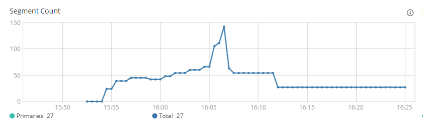
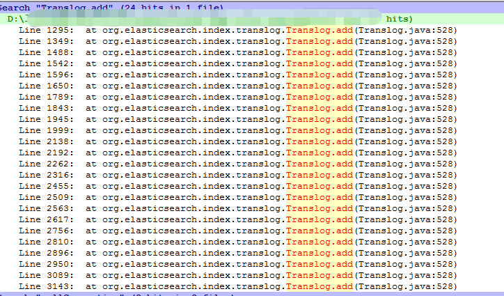

## Elasticsearch高并发写入优化的开源协同经历-InfoQ  

> 作者: 腾讯开源团队  
> 发布日期: 2019 年 9 月 12 日 15:43  

### 背景

为了更便捷地分析数据，[腾讯金融科技](https://s.geekbang.org/search/c=0/k=%E8%85%BE%E8%AE%AF%E9%87%91%E8%9E%8D%E7%A7%91%E6%8A%80/t=)数据应用部去年推出了全民BI 的系统。这个系统通过[ Elasticsearch ](https://s.geekbang.org/search/c=0/k=Elasticsearch/t=)进行基础的统计，超过 10 亿级的数据量需要尽可能快速地导入到 es 系统中。即使经过多次的参数优化，我们依然需要几个小时才能完成导入，这是系统此前存在的一大瓶颈。

在这样的背景下，我们开始决定进一步深入 es，寻找优化点。

### 优化前的准备

我们准备了 1000 万的数据，并在原程序（spark 程序写入）上进行了几轮单机压测，得到了一些基本的性能数据。

* 机器配置：CPU 24 核，内存 64G

* ES 基本配置：

* 堆内存 31G

* 其他参数调整包括 lock memory，translog.durability 调整成 async 等 \(更详细的策略可以参见[相关 issue ](https://github.com/elastic/elasticsearch/issues/45371)\)

* 文档数：1000 万，字段 400 个（没有 text 字段）

写入耗时：26 分钟

CPU：80%+

### 寻找理论值

在往下进入深水区之前，我们需要先回顾一下 es 本身，es 本身是基于 lucene 基础上设计的分布式搜索系统，在写入方面主要提供了：

* 事务日志和成组提交的机制提高写入性能并保证可靠性

* 提供 schema 的字段定义（映射到 lucene 的字段类型）

要进行优化，首先得验证一个问题：lucene 的极限速率能到达多少，所以我在我的本机上构建了这样的一个测试。

Macbook pro 15，6 核 12 线程

数据量 1000 万，每个 document 400 个字段，10 个线程并发（考虑 mac cpu Turbo 4.5G ，服务器 2.4G（24 核），所以只采用 10 线程并发）

验证写入耗时 549s（约 10 分钟）。

26 分钟 —> 10 分钟，意味着理论上是可行的。那剩下的就看如何接近这个极限。因为那说明一定是 es 本身的一些默认特性导致了写入速率无法提升。

> 下面的介绍忽略了一些相对简单的参数调优，比如关闭 docvalues，这个对于非 text 字段，es 默认开启，对于不需要 groupby 的场景，是不必要的，这个可以减少不少性能。
>
> 经过初步的参数优化写入耗时降低到了 18 分钟，这是后面继续往下优化的基础。

### 理解 es 写入的机制

es 的写入流程（主分片节点）主要有下面的几步

* 根据文档 id 获取文档版本信息，判断进行 add 或 update 操作

* 写 lucene：这里只写内存，会定期进行成组提交到磁盘生成新分段

* 写 translog：写入文件

translog 作用

除了上面的直接流程，还有三个相关的异步流程

* 定期进行 flush，对 lucene 进行 commit

* 定期对 translog 进行滚动（生成新文件），更新 check point 文件

* 定期执行 merge 操作，合并 lucene 分段，这是一个比较消耗资源的操作，但默认情况下都是配置了一个线程。

### 优化第一步 - 参数调优

写 lucene 前面已经优化过，那么第一步的文档查找其实是在所有分段中进行查找，因为只提供了一个线程进行 merge，如果 merge 不及时，导致分段过的，必然影响文档版本这一块的耗时。

所以我们观察了写入过程中分段数的变化：

写入过程中分段的变化

观察发现，分段的增长速度比预期的快很多。按照默认配置，index\_buffer=10%, 堆内存 31G 的情况，按 lucene 的写分段机制，平均到每个线程，也有 125M，分段产生的速度不应该那么快。

而这个问题的根源就是 flush\_threshold\_size 默认值只有 512M ，这个参数表示在当未提交的 translog 日志达到该阈值的时候进行一次刷盘操作。

小分段的产生

调整后比较缓和的分段增长

测试结果一看：18 分钟！基本没有效果！

理论上可行的方案，为什么却没有效果，带着这个疑问继续潜入深水区。

### 优化继续 - 线程分析

这时候就需要进行堆栈分析了，多次取样后，发现了下面的一个频繁出现的现象：

被堵塞的线程

发现很多线程都停在了获取锁的等待上，而 writeLock 被 rollGeneration 占用了。

> 写线程需要获取 readLock
>
> rollGeneration 拿走了 writeLock，会阻塞 readLock

而在高 flush\_threshold\_size 的配置下，rollGeneration 发生了 300+ 次，每次平均耗时 560ms，浪费了超过 168s，而这个时间里写入线程都只能等待，小分段的优化被这个抵消了。

这里有很多的关联关系，lush 操作和 rollGeneration 操作是互斥的，因为 flush 耗时较长（5~10 秒左右），在默认 flush\_threshold\_size 配置下，rollGeneration 并没有这么频繁在 100 次左右，提高 flush\_threshold 放大了这个问题。

### 初步优化方案提交

因为我们在写入过程中使用的 translog 持久化策略是 async, 所以我很自然的想到了把写日志和刷盘异步化。

初版提交社区的方案

> 一开始的方案则想引入 disruptor，消除写线程之间的竞争问题，后面因为 es 的第三方组件检查禁止使用 sun.misc.Unsafe （disruptor 无锁机制基于 Unsafe 实现）而放弃。
>
> 基于这个方案，测试结果终于出现了跨越：13 分钟。

初版的方案问题比较多，但是它有两个特点：

* 足够激进：在配置为 async 策略时，将底层都异步化了

* 凸显了原方案的问题：让大家看到了 Translog 写入的影响

### Elastic 创始人加入讨论

没想到的是，在社区提交几次优化后，竟然吸引了大佬 Simon Willnauer（elastic 公司创始人之一和技术 Leader、Lucene Core Commiter and PMC Member）的加入。

Simon 的加入让我们重新复盘的整个问题。

通过对关键的地方增加统计信息，我最终明确了关键的问题点在于 FileChannel.force 方法，这个操作是最耗时的一步。

> sync 操作会调用 FileChannel.force，但没有在 writer 的对象锁范围中，所以影响较小。但是因为 rollGeneration 在 writeLock 中执行，所以阻塞的影响范围就变大了

跟社区讨论后，Simon 最后建议了一个折中的小技巧，就是在关闭原 translog 文件之前（writeLock 之外），先执行一次刷盘操作。

代码修改

这个调整的效果可以让每次 rollGeneration 操作的耗时从平均 570ms 降低到 280ms, 在我的基准测试中（配置 flush\_threhold\_size=30G, 该参数仅用于单索引压测设计，不能在生产环境使用），耗时会从 18 分钟下降到 15 分钟。

> 事实上，这并不是一个非常令人满意的解决方案，这里选择这个方案主要出于两点考虑：
>
> 1\. 未来新的版本将考虑不使用 Translog 进行副分片的 recovery，translog 的滚动策略会进行调整（具体方案 elasitc 未透露）
>
> 2\. 这个修改非常的风险非常小

### 提交社区

最后根据讨论的最终结论，我们重新提交了 PR，提交了这个改动，并合并到了主干中。

### 总结和待续

下面是 es 写入中的影响关系和调用关系图，从图中可以看到各个因素直接的相互影响。

InternalEngine 中的影响关系

最近提交的优化实时上只优化了 rollGeneration，而实际上这里还有一些优化空间 trimUnreferenceReader，这个也在跟社区沟通中，并需要足够的测试数据证明调整的效果，这个调整还在测试中。

而在我们目前实际应用场景中，我们通过调整下面两个参数提高性能：

* index.translog.flush\_threshold\_size 默认 512M，可以适当调大，但不能超过 indexBufferSize\*1.5 倍 /\(可能并发写的大索引数量\)，否则会触发限流，并导致 JVM 内存不释放！

* index.translog.generation\_threshold\_size（默认 64M，系统支持，但官方文档没有的参数，超过该阈值会产生新的 translog 文件），要小于 index.translog.flush\_threshold\_size，否则会影响 flush, 进而触发限流机制

#### 参考文档

张超[《Elasticsearch 源码解析与优化实战》](https://book.douban.com/subject/30386800/)
