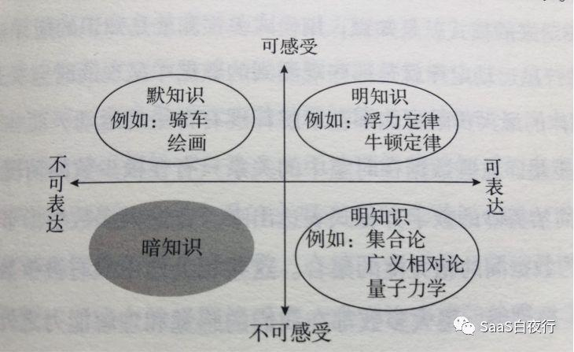
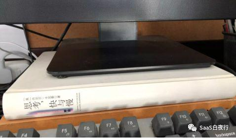
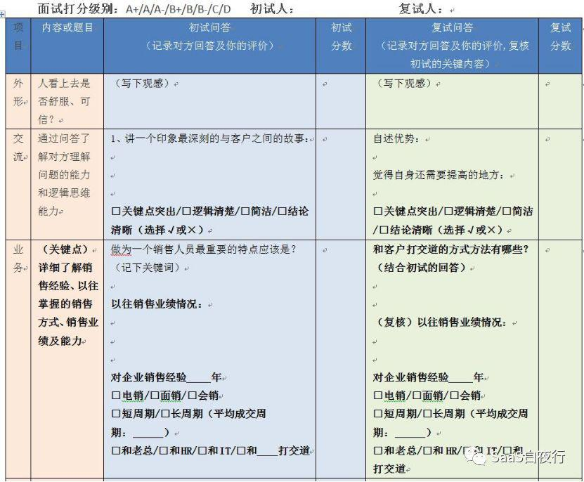
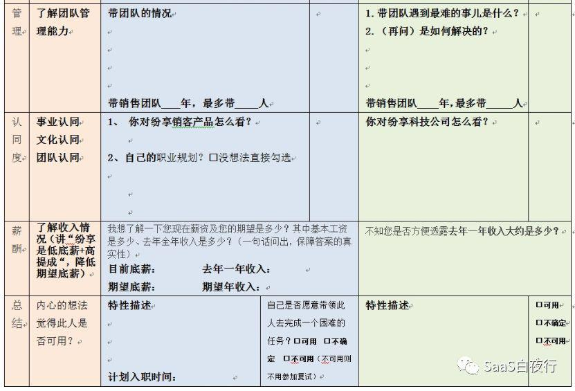

## 复杂问题该用理性决策还是感性决策？| 思考方式的革命（1）  

> 发布: 吴昊@SaaS  
> 发布日期: 2019-09-24  

编者按：本文来自微信公众号“[SaaS白夜行](https://mp.weixin.qq.com/s/SDksfS0w3o2qONc9MKWVyw)”（ID：SaaSKnight），作者吴 昊SaaS，36氪经授权发布。

**作者介绍** **-** 吴昊，纷享销客天使投资人、前执行总裁，\#SaaS创业路线图\#系列文章及书籍作者。目前主要工作是研究SaaS领域的创业、产品市场匹配、营销理论及实操方法。同时，也在为几家不同阶段的SaaS公司担任战略顾问。

最近连续发了几篇关于“商业SaaS”、CSM（客户成功）、市场SDR的硬核文章，搞得粉丝数暴增。

开心之余也发现写书的进度被严重拖慢——我要保障新书的内容有50%以上是新写的，公众号里每多发一篇硬核，写书的压力就又大了几分......

所以我决定在SaaS领域的实操之外，再写一点儿自己对于思考方式的心得，供大家参考。相信这部分内容有更广泛的读者会喜欢。

今天就写一篇横贯3本书/文章的文字，如果时间不够大家可以收藏后晚上慢慢读。

### 一、 **明知识、默知识与暗知识的四象限图**

AI被热捧那么久，王维嘉博士的《暗知识》是第一本把它讲明白的中文科普书。

这本书第一个知识框架，就是下面这张4象限图：

\(该图来自：王维嘉的《暗知识》）

该图将知识按“是否可表达”、“是否可感受”的两个维度分为四类：

\* 可表达的“明知识”（包括可感受的牛顿定律和不可感受的量子力学）

\* 不可表达但能感受到的“默知识”

\* 而“暗知识”则是：不可表达、又没法感受到。

具体来说，暗知识是机器发现的，人类无法感受也无法表达的知识。

就像围棋，人类2000年来保留的棋谱大概有3000万个（8位数），但围棋上棋子的摆放方法的可能性有2的361次方个（108位数），中间何止相差万亿倍。人类对围棋的认知，就是基于3000万这个8位数范围的认知；与机器相比，相差10的100次方。这部分机器能掌握而人不能的，就是暗知识。

这是本书让人惊叹的第一个点。通过设立一个新的二维坐标模型，就能够找到人类以往概念上的盲区！其次，王博士选的词汇也是超一流的，“暗”和“默”两个字都很有神采。

虽然是“科普书”，但书里还是不得不讲到人类的“神经网络”、计算机的“机器学习”、“卷积”等复杂概念。

我用自己的语言，以“识别一只猫”为例，为大家简单讲述一下AI吧：

\* 识别猫与计算“1+2=？”不同，前者是“默知识”—— 无法用准确的语言描述出来。在计算机历史上，通过“尖尖的耳朵”、“长尾巴”、“圆眼睛”等信息来识别猫的程序都失败了。

\* 我们闭上眼睛想想，如何把一只猫与一只豹子的照片区别开，需要补充很多语言描述；把一只猫与一只狗区别开，又需要补充一些描述，其实人是不能把“识别一只猫”这件事情用语言明确说清楚的 —— 既然人说不清，传统计算机程序就做不到。但人，哪怕是三岁的孩子都能区别猫和狗，背后是什么原理呢？

\* 后来科学家通过研究人类大脑的神经网络，发现大脑是通过分层判断，最终在神经元中留下“历史痕迹”的逻辑链条的。这是很有趣的生物学现象，一个神经元受到的刺激（生物电击）越多，得到的营养就越多、就会成长得越强大。而每次判断在每层神经元中留下的痕迹，就会强化今后整个人脑神经网络的判断能力。

\* 计算机科学家根据对人类大脑神经网络的认识，开发了计算机“神经网络”。这个网络不但可以识别“猫”，而且识别猫的过程也同样无法输出成为人能认识的“文字描述”。

\* 这些识别算法就沉淀在“神经网络”中（表现为数据及数据关系），无法被人类直接掌握。人只能通过安装了神经网络的计算机获得这个能力。

\* 不知大家注意到没有，为了让计算机解决这个“默知识”的问题，我们最终是用了“暗知识”来解决。

\* 这类“暗知识”，能够在计算机之间快速复制，但无法在人和人之间复制。人和人之间能传递的只能是控制AI计算机的方法。

暗知识大体说完，我再回到与我们的思考方式相关度更高的“默知识”。

### 二、 **《思考，快与慢》的“系统1”**

《思考，快与慢》这本书大约是我2013年读到的。我认为这是那一年我读到最好的书。好就好在研究老对象（人类行为与注意力）的过程中，用了新思考框架，并建立了有说服力的体系。

几年来，这本书被我放在电脑显示器下面，意喻为“抬高了我的视野”。当然，最初是为抬高了显示器，起到保护颈椎的作用——

书里是这样定义人的两种思维模式的：

\* **系统1 —— 其运行是无意识且快速的，不怎么费脑力，没有感觉，完全处于自主控制的状态。** 例如会骑自行车的人，他在骑车时是不需要主动意识指挥手如何转动车把的，系统1会接管这些动作。

**\* 系统2 —— 将注意力转移到需要费脑力的大脑活动上来。** 例如，大家可以回忆一下自己第一次骑自行车的场景，当时是需要非常专注地控制双手和双脚的，所以往往手忙脚乱。我记得我如果稍不能控制，双手是会放掉车把，抱住旁边的足球门柱的。

不知各位刚学自行车时，是否也是如此？

**当系统2学习掌握了重复使用的套路后，大脑会将重复工作转给系统1。**

我高中时，经常因为简单的数学加减乘除四则混合运算错误，导致考试得不到高分。我训练自己做了大量专项练习，后来不仅计算过程不出错，而且感觉当时是把简单的四则运算从“系统2”挪到“系统1”了。考试时，手上做着乘法竖式，脑子里考虑是否有更好的解题思路。

从另一个角度看，大脑的重复套路工作从“系统2”转给“系统1”，还有一个更大的好处 —— 降低能力消耗。

系统1反应很快，对能量的消耗远低于系统2。我查了《人类简史》、《文明是副产品》等书籍，看到这样的资料：晚期智人的大脑占体重的1/20，但耗能、耗氧量却达到全身的1/5。在工业革命前的5万年里，智人供养这样一个大脑是极其不容易的，所以我推断：

\* 第一，大脑不会有大比例未开发区域，因为咱们的大脑结构在5万年前成熟时（今天人的脑容量与5万年前差别不大），人体根本没有多余的营养可以供它浪费。

\* 第二，从机制上，大脑会尽量把一些套路工作从系统2转给系统1，以期降低脑力消耗。

系统1毕竟简化了判断过程，是否会造成很多误判呢？我相信是的，但因为能量的限制，人类当时应该是找到了中间最优解。

我认为：《思考，快与慢》的“系统1”，学习的其实就是前一节说的“默知识”。

还是以骑自行车为例，咱们可以教新手一些保持自行车平衡的要领，但一个新手学会骑车的过程，是实践重于理论的。最后形成的知识，就是无法说清的“默知识”，这个默知识保存在我们每个人的“系统1”当中。

当然，系统1与系统2的关系还有很多层次，并对人类社会产生了深远影响。

例如，遇到紧急情况时（“快撞到行人了”），系统2会从系统1接管人体控制权，多费一点脑力精确控制好自行车的方向，避免造成交通事故。

毕竟我的读者都是toB企业同事，我还是讲一个书中与咱们业务有关的故事。作者丹尼尔·卡尼曼是诺贝尔经济学奖获得者，21岁时（1955年）曾经在以色列军队里负责设计士兵面试流程。这之前，面试官完全根据感觉打分，结果筛选出来的新兵合格率很低。卡尼曼做了一套设计，听起来和我在《[SaaS创业路线图（六）如何高效扩张团队？](http://mp.weixin.qq.com/s?__biz=MzIxNjc2MTc2MQ==&mid=2247483772&idx=1&sn=f365dd29bbe93c1158cfb48f258aaa6d&chksm=978555b2a0f2dca4d3958a9ce78166a16f89d0661fc1bf5db023045a98e629da350844e59599&scene=21#wechat_redirect)》中的做法类似，就是要求面试官严格按框架打分。

（上图为我系列文章（六）中提供的打分表）

卡尼曼不是他的面试官们的上级，面试官们不喜欢做“打分机器人”。卡尼曼的让步是，同意面试官根据标准格式打分后，最后“闭上眼睛给士兵打个总分”。

最后的结果是，新的测评方法大幅提高了有效率。45年后卡尼曼回到该部队，发现他的面试方法还在延用。

而我的面试表最后也有这样一行：“自己是否愿意带领此人去完成一个困难的任务？”其实这是一个非常感性的问题，与表格其它部分（记录工作年限、记录回答情况等）非常不同。

我观察， **这就是在很多领域中，决策复杂问题的一个优选方法：**

\* 把抽象问题具象化：先用理性框架（“明知识”）、从多个角度用数字化的方法分项打分；

\* 再把具象问题抽象化：从内心出发，我是否要用这个人？（使用了“默知识”：更感性，但往往更准确）

这个过程的好处是：

\* 过程可操作性好，让决策者全面思考，不会漏项；

\* 利用决策者的抽象判断能力（“默知识”），更高纬度地做出判断，不会因为打分表的设计缺陷造成决策错误。

**我们企业决策中，如果死板地使用调查前设计的“打分表”，往往会错过发展机会。因为环境在剧烈变化，调查前很难做出完美的打分表。而“默知识”会让我们熟悉业务的决策者更准确地做出判断。**

### 三、 **内隐学习和外显学习**

上面说了很多“默知识”的例子，具体怎么学习和使用“默知识”呢？最近“得到APP”的精英日课正好也推出了一篇文章“内隐学习和外显学习”。

简而言之，外显学习就是学习“明知识”的过程，掌握历史知识、化学公式......

内隐学习，则是学习“默知识”的过程，学到的是个“感”。例如，英语的语感。

1993年高考时，记得我的英语成绩大约是140分（满分150）。因为不考口语，这全都是英语语法和单词，大多是“明知识”。

但我工作后能在外企说流利的英文，全有赖于大学时在华中理工（现在的华中科技大学）有一个教“外贸英语”的廖老师。他逼着我们每人整篇整篇地背诵外贸英语，上课经常现场考对话，当时那个厌恶哪......没想到坚持了一个学期，死记硬背了几百句常用对话后，英语“语感”就形成了。大脑中可以用英文思考问题，我是一生受用。教师节刚过，在此也要感谢廖老师。

“精英日课”引用的一个调查研究还有个有趣的结论：外显学习明知识，注意力越集中越好；但 **集中注意力反而会妨碍内隐学习。**

为什么？因为“默知识”是没有明确规则的，越努力找规律越学不会，不如放松一些，让头脑直接沉浸在直观信息中，这样更容易领悟那个“感”。

在企业经营中，我们经常需要新的创意：如何设计一个摆脱俗套的新激励方式？如何做营销上的创新？如何设计一个全新的内容？这时候， **让注意力分散些，看看不相关的书籍、讨论一些别的话题，可能灵感会来的更快。**

就像我写这篇文章，目的与路线图系列是一样的，还是想帮助大家提升经营管理能力。但如果不引入更多关于思考方式、关于人类发展史的文章，就会跳不出日常操作的层面，不能给大家带来新的空气。

### 四、 **小结**

这篇文字是“思考方式革命”的第一篇。我讲的不是明知识、也不是默知识，我讲的是 **一些新的思考方法** 。

\* 如何通过增添新的维度，让你对研究对象（无论是客户群、团队或产品服务）增加新的评估方式？操作工具就是最前面的四象限图。

\* 设计新体系时，用词要精准。王维嘉博士用一个“暗”字，一个“默”字，把体系讲的很清楚。“名不正言不顺”，这是我经常说的道理。一个事儿的“名字”选错了，要费很多口舌解释，到头来没听到解释的人看了还是会误解。

\* 计算机AI算法是基于人类的“神经网络”模型的。企业管理中，一个体系的设计、一个测算模型的建立，都要基于“自然”的业务规则，基于人性的需求进行考量。我不是讲抽象的“道”，我说的是可以操作的规则。

\* 例如，人的大脑将重复套路工作交给系统1，就是符合降低消耗的规则的。而“能量的限制”就是工业革命前的20万年里控制人类发展的主要因素。

\* 我们做企业，也是同样有很多限制，财务上有利润要求、有任何时点现金流不得低于安全线的要求。这属于“明知识”。

\* **在不能用“明知识”直接通过计算做出决策的复杂情况下，基于“感觉”的判断实际上更准确。** 所以专业知识重要，但业务背景更重要。

\* 但如果只靠“感觉”决策，也很危险。文中举了一个新兵打分的例子。最佳方法是： **让决策者先结构化地全面多维度打分，然后再“感性”地做出最终判断。**

**\* 注意力分散些，有利于创新。** 所以需要新点子时，要给团队成员新环境、新场景和一些新时间。

\* 默知识这么重要，如何得到？要反复练习，不专注（忘掉规则）地学习。

哈哈，相对前面的硬核文章，这篇讲得更high level一些。思考能力、创新能力都是经营管理的基础，期待大家勤于思考，勤于构建自己的思考模型。

欢迎各位朋友留言。
