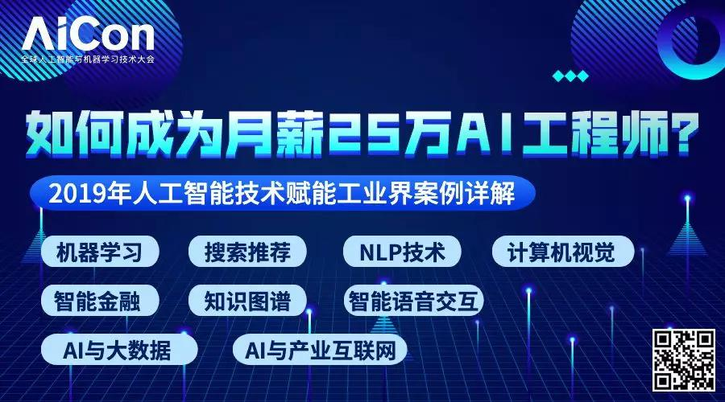

## Hadoop之殇：没有任何单一技术能重塑整个企业IT世界  

> 原创：  
> AI前线小组 译  
> 发布: AI前线  
> 发布日期: 2019-09-17  

策划 | 蔡芳芳  作者 | Derrick Harris  翻译 | 核子可乐  编辑 | Linda  **AI 前线导读：** Hadoop 当初选择了全面普及的道路，并与其它一系列技术产生了交叉与重合；从长远来看，这条道路有助于其提高自身影响力，但负面因素则是导致其逐渐偏离当初做出的最具价值的承诺。

Hadoop 的故事可以帮助我们理解为什么现今的数据世界会呈现出这样的面貌，同时也能够给任何打算深入探索企业 IT 发展趋势的朋友们带来宝贵教训。下一个大事件会是什么？答案也许就在其中。

**更多优质内容请关注微信公众号“AI 前线”（ID：ai-front）**

我曾在 Gigaom 网站上花了很多时间讨论 Hadoop，并长期关注 Hadoop 项目及其背后公司的发展情况。因此，在过去一年亲眼见证项目逐步从人们视野中消失之后，我开始思考到底出了怎么状况。在去年 10 月 Cloudera-Hortonworks 宣布合并时，我就做出过思考，但内容还不太完善。希望今天的文章能够真正系统地论述这个议题。

近十年来，Hadoop 一直是“大数据”领域的典型代表。它新鲜，它开源，它催生出整个产品与供应商市场，而它的灵感则来自技术培训领域各大最强网站的实际运营状况。然而，现在回顾起来，Hadoop 似乎永远无法达成其崇高的发展愿景。虽然 Hadoop 项目仍然又大又新，但如今的世界已经快速转至更重视速度、灵活性、微观要素甚至是已知数量的阶段。

Hadoop 当初选择了全面普及的道路，并与其它一系列技术产生了交叉与重合；从长远来看，这条道路有助于其提高自身影响力，但负面因素则是导致其逐渐偏离当初做出的最具价值的承诺。Hadoop 的故事可以帮助我们理解为什么现今的数据世界会呈现出这样的面貌，同时也能够给任何打算深入探索企业 IT 发展趋势的朋友们带来宝贵教训。下一个大事件会是什么？答案也许就在其中。

如今，热钱满天飞，企业探索技术并掌握技术的压力如此之大（又称数字化转型），人们自然倾向于将每一件新事物都视为有可能产生重大影响的潜在重点。这是一种极高的要求，但组织中的决策者必须得透过炒作看清这些事物所做出的承诺与其实际能够达成的目标之间的界线。以此为基础，我们才能正确选择最适合自身发展需求的技术方案。

总有更多空间可供挖掘……

诚然，每个人都希望获取（目前也仍然希望）Hadoop 最初承诺的能力。他们希望从网络日志、天气记录以及其它相对新颖的资源当中收集大量非结构化数据，对其加以分析并发现新的趋势或者独特的业务洞察能力。很多高管都希望实现数据驱动目标，帮助自己摆脱那些讨厌的直觉以及定性证据的影响。在大数据发展之初，这样的目标甚至可以说是整个新生行业为自己定下的奋斗原则。

当时有句口号，叫作发掘“数据不合理性中的价值”。企业 IT 终于有望从数据中汲取养分，这一切终于不再是谷歌公司的专利。

然而，大数据世界中发生的诸多事件一步步侵蚀了 Hadoop 分布式文件系统（HDFS）的基础，以及用于运行 MapReduce（最初的 Hadoop 编程模型）任务的计算引擎。好吧，整个过程其实相当复杂，下面我就尽可能精简一下：

* 功能机发展为智能机，并开始产生大量实时数据流。社交网络全面起飞并开始生成实时数据流。成本低廉的传感器与物联网迅速发展，这也成为新的实时数据来源。遗憾的是，“MapReduce”与“实时”往往扯不上什么关系。
* 企业已经在关系数据库与数据仓库技术身上投入了数十亿美元，而且这些技术目前的运作效果仍然不错。更重要的是，技术人员已经对 SQL 相当熟悉。
* 以 Apache Spark 为代表的竞争性、或者说是替代性项目开始持续涌现， 这些来自企业、大学以及网络公司的新兴方案也成功超越了大数据整体理念中的种种早期限制。
* 风险资本流入大数据初创企业。其中包括围绕 Hadoop 建立自己的初创企业，也包括各类新兴项目与相关技术。虽然理论上，参与各方都在朝着同一个方向迈进，但在发展业务的过程中，具体激励因素有时并不一致。

我完全理解 Hadoop 社区做出的选择：他们与尽可能多的技术进行集成，并构建起一个业务流程层，以便在大型共享基础设施当中调度各类不同部分中的作业。正因为如此，我们得到 Pig、Hive、SQL-on-Hadoop 以及 YARN，同时也迎来了 Storm、Kafka 以及 Spark 等的加入。尽管 Hadoop 仍然非常复杂且难以操作，但它还是成功发展成了一套真正的数据平台。

技术无法在真空中存在

与此同时，其它一些重要的事件正在发生；虽然有一些看似与大数据领域无关人，但却给 Hadoop 乃至整个大数据社区带来重要影响。从本质上讲，我们在如何获取技术以及如何设计应用程序这个问题上，经历了几次重大的集体理解转变：

* 作为新的企业 IT 主流解决方案，开源趋势正在全面普及。因此，用户对于易用性以及开箱即用功能的期望也开始增加。各类热门项目开始在 Apache 软件基金会以及其它传统开源社区之外茁壮成长。云计算统治整个世界，现在我们不仅能够轻松构建虚拟配置服务器，还能够以更低的成本存储大量数据，并使用管理服务处理特定用例——例如，通过 MapReduce 进行数据处理。
* Docker 与 Kubernetes 的诞生。二者的到来，共同开启了人们对于应用程序及基础设施打包与管理的新思路。更重要的是，二者的模块化设计吸引到各大社区的高度关注，意味着用户们能够随意交换不同的部分或者特定功能，同时保证新功能快速上线。
* 深度学习将人工智能与机器学习牵引至聚光灯下。在基础设施之外，围绕深度学习的讨论主要集中在如何使模型与算法进行复杂的模式识别，且确保我们无需对其中的参数或内容进行手动调整。没错，在生产环境中引入 AI 绝不像“添加数据”那么简单，但人们更热衷于谈论其中的商业机会——毕竟这件事的门槛至少要比讨论集群规模要低一些，也更有吸引力一些。
*  **微服务成为现代应用程序中的客观架构标准，** 随后则出现了“无服务器”计算与函数。 二者的诞生主要是为了支持事件驱动型架构这一思路——简单来说，就是当事情 A 发生时，服务 B 自动做出响应。

现状：事件、AI 以及“即服务“

这些因素汇集起来，共同成就了我们当前面对的客观现状。没错，Hadoop 仍然存在且不断发展，但却已经越来越不可能成为很多人当初预测的那种不可或缺的基础性技术。相反，大多数社区开始采用更快、模块化程度更高且更为简单的工具与平台集合，并将数据作为应用程序架构中的一种组成部分——而非单纯有待分析的素材。

具体来讲，我们现在观察到了以下趋势：

* 流数据与事件驱动型架构越来越受欢迎。虽然其背后的基本思路已经拥有一定历史，但如今的技术与架构进步真正将其转化为现实，包括流处理甚至是基于函数（又称「无服务器」）计算。在大多数情况下，快速处理数据的能力要比批量处理数据或者对历史数据进行分析等方法更具价值。
* Apache Kafka 正成为越来越多数据架构中的神经系统。Kafka 不仅能够提供上述多种功能，同时爆棚的人气也使其成为各类项目与技术供应商的优先选择。Kafka 开始成为一切其它数据功能不可忽视的核心平台（只要启动并运行 Kafka，它就能够完成将数据导入 Hadoop 及其它批处理系统的工作）。
* 云计算已经在基础设施、存储、数据分析以及 AI 服务等领域占据主导地位。Amazon S3 等数据存储服务在使用感受上，要比管理复杂的文件系统更轻松也更便宜。云服务供应商带来大量能够对全部数据进行分析与建模的现成方法，包括人工智能以及机器学习等功能。对于相当一部分（虽然不是全部）企业而言，管理自有数据基础设施与应用程序的弊端，已经大大超过收益。
*  **关系数据库——包括数据仓库——仍然拥有旺盛的生命力，** 其它一些数据库选项（例如 Postgres）也在蓬勃发展。由云服务带来的操作便捷性（甚至可以说是无需操作）无疑是这些方案得以复兴的重大因素；此外，众多受到 Hadoop、NoSQL 以及过去十年来各类数据技术影响的新功能也在持续涌现。
* Kubernetes 正成为面向所有内容的默认业务流程层，其中自然包括数据系统与 AI。这缓解了市场对于 Hadoop 类数据编排平台（例如 YARN）的需求，同时鼓励用户采用更符合云原生价值主张的技术（简而言之，就是以微服务架构取代整体式架构，以大量小集群取代单一大型共享集群）。

虽然跨越众多服务与技术开发数据架构仍然相当困难，但如今的工具确实带来了诸多优势——这些优势，已经远远超越单一、整体式平台的供应范畴。工程师们可以随意使用自己熟悉以及喜爱的工具；随着更多新生事物的出现，他们也能够更轻松地进行实验，并非常自信地将它们整合起来发挥更大的作用。更重要的是，他们也可以借此让业务需求成为新技术采用的原动力，最终打破技术决策限制业务可行性的陈旧怪圈。

Hadoop 让人们了解到大数据中蕴藏的无限可能，但同时也提醒人们，没有任何单一技术有能力重塑整个企业 IT 世界——至少以后不会再有。

**原文链接：** ****

https://architecht.io/what-happened-to-hadoop-211aa52a297

> #####  今日荐文

点击下方图片即可阅读

[

为什么已有Spark和Dask，阿里还要开源自研分布式科学计算引擎Mars？

* * *

活动推荐 AICon 全球人工智能与机器学习技术大会将于 11 月在北京举行，这里不仅有硅谷、BAT、独角兽们的 AI 技术案例解析，还有颜水成、贾扬清、崔宝秋等大咖现场经验分享。部分议题抢先看：

* 微软小冰：人格化对话机器人的构建及在语音场景当中的实践
* 阿里巴巴：智能家装设计中的 3D 算法应用实践
* 蚂蚁金服：AI 赋能普惠金融的探索与实践
* 腾讯：腾讯云知识图谱技术与应用实践之路
* 美团：刻画物理世界的 AI 技术和应用
* 滴滴：滴滴搜索系统的深度学习演进之路
* 360：360 金融的 AI 实践之旅

* * *

**你也「在看」吗？** ****👇
