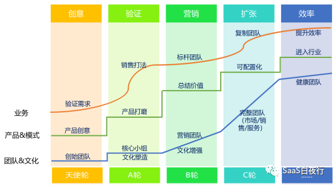
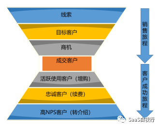

## 客户成功管理框架 | SaaS创业路线图（61）  

> 发布: 吴昊@SaaS  
> 发布日期: 2019-09-03  

**作者介绍** **-** 吴昊，SaaS战略及营销顾问，系列文章作者，目前在撰写一本关于SaaS创业的书籍。

（SaaS创业路线图）

关于“什么是客户成功”的文章已经很多，而如何管理“客户成功部”的文章则很少见到。

我最近与几个知名的通用SaaS及行业SaaS公司负责客户成功的同学交流了不少与客户成功部门管理相关的内容，包括CSM的职责、KPI、CSM人才画像、招聘途径、工作方法等，下面就逐一谈谈。

（CSM本身的英文词有两个组合：

\* Customer Success Management: 客户成功管理

\* Customer Success Manager：客户成功经理（指负责客户成功的基层同事）

为了便于理解， **本文的CSM均指客户成功经理（人）** ）

### 一、 **客户成功部的职责**

我常说“SaaS的本质是续费”。续费率过低、一次收3年、5年费用或直接买断使用权的SaaS公司都是假SaaS公司。

（有兴趣可延展阅读相关文章：[SaaS的本质和SaaS公司的大坑](http://mp.weixin.qq.com/s?__biz=MzIxNjc2MTc2MQ==&mid=2247483673&idx=1&sn=09305a41e6751bf0e1bdc4352b796b64&chksm=978555d7a0f2dcc191788c0535579384b2dd82c30717dc265681b6279b9980aa100083358ee7&scene=21#wechat_redirect)、[SaaS创业路线图（45）“正心诚意”的顶层设计](http://mp.weixin.qq.com/s?__biz=MzIxNjc2MTc2MQ==&mid=2247484039&idx=1&sn=8a43a4701404d1b1c29c95c4bedb015a&chksm=97855649a0f2df5f417ef16bfc32cd89aac751bcd42f5b38520f5e35ececad65512916c15ada&scene=21#wechat_redirect)）

总体来说，SaaS公司的客户漏斗与传统公司不同，除了上半部分的销售漏斗，还有下半部分的续费及增购漏斗。目标客户成为“成交客户”后，在CSM的服务下，还会继续演进，成为“活跃使用客户”—— “忠诚客户”—— 高NPS（净推荐值）客户。

硅谷有一家专业做客户成功管理软件的SaaS公司，名字叫Gainsight，Workday、Box、Marketo、VMware都是它的客户。2016年我和同事一起到硅谷参观十几家SaaS企业，其中也拜访了Gainsight。当我第一次看到这类图，还是挺震撼的，扩展了我对“客户旅程”的理解。

（顺便说一下，希望学习客户成功的同学可以到他们的官网上学习：www.gainsight.com/guides/）

客户成功部在整个“客户旅程”中承担的角色，请参考《[SaaS创业路线图（56）SaaS公司典型组织架构及职责划分](http://mp.weixin.qq.com/s?__biz=MzIxNjc2MTc2MQ==&mid=2247484156&idx=1&sn=697f2a53cf510a3f2f04cf73d51bf36e&chksm=97855632a0f2df24de66014fca8e463e0b52a723f292b558647564a563f5196a3579c694333a&scene=21#wechat_redirect)》，我也不再赘述。

这里把客户成功部的具体职责罗列一下：

1、 **续费**

因为SaaS客户是每年续费的，所以“客户成功部”的第一重要的职责就是保障客户续费。如何保障客户续费呢？有以下任务需要执行：

2、 **客户预期管理**

实际上仅靠活跃度监控是不能预测决策人（或权力影响者）的价值认知变化的，由此带来的续约风险需要借助前期对行业、客户、干系人管理方法来提前干预的。

很多时候，客户用不好产品，并不一定是产品不好、服务不好，而是客户对“成功”的期望与最终产品能满足的程度存在着差异。

**CSM的服务，很多时候是在弥补这种差异。** 所以了解客户对“成功”的预期就会变成CSM在第一次接触客户时非常重要的职责。

CSM基于客户的预期判断是否是目标客户；如果是目标客户，那么与客户共建合作路线图、行动计划；通过差异化干系人管理策略确保目标达成；最后是关注数据衡量客户目标达成情况，持续优化行动计划。

对于非目标客户，下文客户分类中再做阐述。

3、 **初期促活**

经过大量SaaS公司多年实践证明， **客户购买后的头30天是客户能否将产品用起来的关键。** 所以客户成功部要特别重视刚接手的新客户，要做好需求了解、关键岗位交流、使用方案沟通、使用培训及初期引导活跃使用的工作。

**不同客单价的产品初期促活的责任人不同：**

\* 如果产品轻、客单价也不高（ARR在2~10万），通过配置就能完成简单实施，这项工作通常可以交给CSM负责。这也是SaaS产品客单价的主要分布区间，所以在大部分SaaS公司中，CSM负责初期促活。

\* 如果该SaaS产品有实施环节（通常客单价高于10万/年），公司实施部门会负责其中大部分工作。实施完成后交接给CSM，后者同样要对客户在实施后的活跃使用负责。

\* 如果客单价较低（低于2万元），我建议考虑让销售代表把初期简单的产品配置及培训工作完成，并对初期活跃负责。因为交接客户的需求需要占用销售代表和CSM不少时间，而初期实施的工作量又很少。与其这样，不如由销售代表完成初期启动后再转交CSM。

促活的标准通常是“ **使用活跃率** ”。至于如何制定活跃度标准，就与产品特性有较大关系了。举例来说，OA类产品可能更重视已开通的账号登录率，CRM产品更重视深度功能（例如“商机”）是否得到使用。

还有一个相对更复杂的“ **健康度** ”标准，要考量高层岗位（例如老板）是否使用、业务流程是否嵌入。由于SaaS产品的运营系统无法直接提供这类数据，所以操作难度更大一些。

在分析用户使用情况时，可以借助一些数据分析工具（GrowingIO、诸葛io等产品）通过埋点/非埋点形式观察用户使用情况。这里的使用情况既包括活跃度情况，也包括健康度数据。

SaaS企业可根据用户行为分析，设定若干“北极星指标”，区分活跃用户与非活跃用户。 通过“北极星指标”达成情况更好衡量用户活跃度。

4、 **异常处理**

我刚看了一下Gainsight的CSM，每人承担200万美元的续费ARR，这应该是美国SaaS的标准。

我问过几家国内成熟的SaaS公司，一个CSM承担的客户待续费ARR为200~500万人民币。

由于每个CSM负责的客户数量较大，一旦客户使用上手后，CSM并不需要每天关注所有中小客户。SaaS运营系统会将活跃度突然下降的客户预警给CSM，提醒他们尽快介入。

（SaaS运营系统：相当于Gainsight的客户成功产品，但国内SaaS公司一般都自研自己的运营系统，除了客户成功管理的功能，也管理客户的订单、开通关停等操作）。

5、 **定期沟通：**

CSM需要按一定频率（根据客户级别、状态决定）与客户进行定期沟通交流。

6、 **增购**

一般情况下，我会认为新签约一段时间内的增购与销售代表关系更大，但过了3~12个月，客户的增购就与CSM的关系更大了。该期限与客单价关系较大，客单价越高、销售代表需要进一步努力的时间就越长。

公司的职能设计中，权责利要一致。负责增购的，有对应绩效，也一定要有日常动作，不能不劳而获。

7、 **输出客户使用案例**

与市场部输出客户案例不同，客户成功部输出的案例更贴近使用方案和客户的具体业务。这些案例更多用于指导其他服务同事，也用于1对多的客户运营，包括线上培训、线下沙龙等。

### 二、 **考核指标（KPI）**

明确职责后，客户成功部门及客户成功经理的考核指标就比较容易确定了。

我调查了几家国内客户成功能力不错的公司，他们的考核指标有：

1、 **续费率** 。有的公司为了覆盖增购的职能，续费率的分子允许把增购部分算进来，这也是合理的。但我认为也应该另外计算一个纯粹的续费率作满足内部管理需求。

续费率包括 **客户（数量）续费率** 和 **收入（金额）续费率** 。大部分公司会看重收入续费率，但也要根据情况判断：如果咱们是聚焦中小企业市场的，客户数量续费率也非常重要，不能用几单大客户的续费冲淡了大量中小客户流失的影响。

2、 **初期成功激活率** 。

3、 **所属客户活跃率** 。

4、 **增购金额。** 这个我也曾经怀疑 ——是否应该由CSM承担增购的职责？但后来看到业内有公司这样实践效果不错的。我的思考是， **看活跃率、激活率与公司收入没挂钩、都有注水的可能性；而续费率、增购金额是真金白银，作为考核员工及公司决策的关键指标更真实可靠。**

不同客户成功管理成熟度的企业可以选择不同的KPI组合。

除此了KPI之外，客户成功管理很成熟的SaaS企业，还会 **对中高级CSM顾问进行评级** 。其中解决方案能力和价值传递能力是重要的考评项，而不只是看客户续约和活跃度数据。

### 三、 **人才画像和招人途径**

讨论了职责和KPI，我们可以用这些维度给 **CSM（客户成功经理）画像** 了：

\* 对本 **领域专业知识的理解深度** ；

\* **耐心和服务意识** —— 对很多人来说这两项是天赋，后天学不来；

\* **多任务并行的能力** ：要能在一天内同时并行很多项工作，这与研发工程师的工作方式很不同；

\* **对本公司的产品精通** ：这个是可以入职后学习的，面试时可以考察对其它IT产品（例如Excel、OA）的掌握能力；

\* **产品配置实施能力** ：如果CSM承担实施职责，则需要具备该项能力；但一般不用承担代码级开发工作。

如果是较高客单价（ARR在10万以上）产品或实施时需要做少量定制开发内容的CSM，还需要增加以下能力要求：

\* 更多 **主人翁意识：** 作为项目主负责人，在项目推进过程中需要较强目标意识推进项目目标达成、协调资源、管理干系人。缺乏主人翁心态、仅做被动响应，这未给客户带来价值会引发客户不满。

**\*** **项目管理能力：** 由于客户成功经理需要为客户提供全生命周期服务，所以需要具备包括项目规划、资源协调、风险管理、干系人管理等项目管理能力。

\* **行业轻咨询能力** ：如果是复杂产品，需要对客户业务进行分析，并提供解决方法。

可以看到，对CSM的人才画像，与热线客服专员非常不同，与销售代表的特性更加不同。

在国内，CSM还是一个新岗位（相信未来几年需求会非常旺盛），所以招募CSM新人非常困难。各个SaaS公司主要依赖将其他岗位的同事 **转岗** 做CSM。

我的建议是：

\* 首先，无论多早期的SaaS公司， **招聘客户成功部的负责人** ，要找有在成熟SaaS公司“成熟的客户成功部门”工作至少1年以上的。 **客户成功是一个体系性很强的工作，转岗的“生手”负责人在前2年都很难摸到客户成功的门道。而SaaS公司的关键在续费，如果有2年在客户成功上没有建树，SaaS公司后面的路会很难走。**

\* 在 **CSM基层员工** 的层面上，优选的方式是从实施岗转客户成功（当然客户成功经理也有顺利转做实施的）。如果从售前支持转，也很好，不过售前也是很难培养人才的岗位。

从销售岗位和原客服岗位转CSM的挑战大一些，需要更长的培养周期。

当然，这都与人的特性有很大关系。有的人也许天生就适合做CSM，而不是他原来的岗位。

\* 如果 **从公司外部招聘CSM，行业背景比服务背景更重要** 。CSM有轻咨询的特点，培养一个既不懂目标行业、又不懂类似产品的新人需要1~3年时间。

我见过有的SaaS公司招募客户行业里有经验的人士来做CSM的，这是个好办法。但级别不用太高，毕竟CSM的工作内容里80%还是服务，需要很好的耐心。

### 四、 **客户成功的工作方式**

纷享销客联合创始人刘晨曾在本专栏里写过一篇《SaaS创业路线图（十五）为什么说SaaS公司一定要做客户成功》，他的文章里讲了一些客户成功部的工作方式。

我也讲讲从CSM专家那里学到的方法：

**1、客户按行业分组**

作为销售代表是很难选择固守行业客户的，因为今天查到一个客户资料、明天一个客户转介绍都可能跳出某个行业。但客户成功经理、售前技术支持，这些岗位应该分行业或者至少做一些行业侧重。从流程上这是可操作的。

分了行业（或大行业里细分的子行业），CSM掌握客户业务的速度会大幅度增加，客户也会更满意。反过来CSM还能经常输出一些行业应用方案，帮助市场和销售部门。

2、 **客户及干系人分级**

每个SaaS公司的客户都可以按照是否付费、ARR金额多少、客户潜在价值、客户使用功能模块集合、客户开通时间等众多维度进行分级。

对于大客户的管理， CSM还需要 **对客户企业的** **“干系人”进行分级管理** 。以CRM产品的大企业客户为例：CEO和销售VP在S级；销售总监和部门主管在A级；销售部门骨干员工在B级（每家SaaS公司根据各自的产品、客户特点制定自有的“大客户干系人分级、服务标准”）。这个标准主要是指导性的，比较难以按标准流程要求。但可以通过丢单案例分析会等方式，让CSM看到不按分级标准服务的惨痛后果。

客户分级后，可能有的CSM会负责十几个超大客户，而另一部分CSM会负责几百个小客户。具体分法，各家客户成功部都有差别。

**该如何确定一个CSM应该负责多少客户呢？** 我建议可以算算 **CSM服务客户待续费金额** ，也就是每个人负责的ARR有多大。我根据调查过的SaaS公司推算，无论服务对象是大企业还是中小企业，SaaS公司一个CSM负责的ARR在200~500万之间比较合适。

3、 **根据客户所处服务旅程阶段匹配对应任务**

客户成功部的管理中，还有一个方法是区分客户所处服务旅程阶段，对导入期、平稳期、续费前期等不同阶段定义CSM的不同工作任务。

4、 **符合画像的客户与不符合的客户**

最后讲一个所有CSM最头痛的点。

任何一款SaaS产品都有适合的客户和不适合的客户。从SaaS公司整体的角度看，做好客户成功第一重要的事是客户画像，找到正确的客户去服务。

很多公司为了生存签了非画像客户。这虽然能带来收入，但后期即便支付了更高的服务成本也没法改变对产品口碑的损坏。

**很多时候，客户流失率很高，并不是因为客户成功部门失职，而是最开始进来的客户就是错的。**

当然，作为客户成功部门，付费的就是客户，并没有太多可挑选的余地。所以我的建议是：

\* 首先，整个公司要升级对“客户成功”的理解，不适合的客户尽量不做； **客户成功是全公司各个部门的共同目标，需要产品、市场、销售、财务等各个部门的共同参与。**

\* 其次，客户成功部可以把客户根据标准分为“精准客户”（符合客户画像）和“探索客户”（不符合客户画像），对两类客户分别统计活跃率、续费率等指标，加强对产品及客户的理解。

本来我还有一部分是关于NPS（净推荐值）的，我和几个客户成功部负责人就此也做了很深入的探讨，篇幅所限，我们下篇再谈。

**相关文章：**

[SaaS的本质和SaaS公司的大坑](http://mp.weixin.qq.com/s?__biz=MzIxNjc2MTc2MQ==&mid=2247483673&idx=1&sn=09305a41e6751bf0e1bdc4352b796b64&chksm=978555d7a0f2dcc191788c0535579384b2dd82c30717dc265681b6279b9980aa100083358ee7&scene=21#wechat_redirect)

[SaaS创业路线图（45）“正心诚意”的顶层设计](https://36kr.com/p/5203883)

[SaaS创业路线图（56）SaaS公司典型组织架构及职责划分](https://36kr.com/p/5230528)

【林先锋、黄帆、汪楚航等几位CSM专家对本文有重要贡献，特此感谢！】
