## 两年Flink迁移之路：从standalone到on yarn，处理能力提升五倍  

> 肖强  
> 发布: AI前线  
> 发布日期: 2019-09-05  


 作者 | 肖强  编辑 | 陈思  **AI 前线导读：** 经过两年的实践，Flink 已经证明了它能够承接 TalkingData 的 App Analytics 和 Game Analytics 两个产品的流处理需求。

**更多优质内容请关注微信公众号“AI 前线”（ID：ai-front）** 一、背景与痛点

在 2017 年上半年以前，TalkingData 的 App Analytics 和 Game Analytics 两个产品，流式框架使用的是自研的 td-etl-framework。该框架降低了开发流式任务的复杂度，对于不同的任务只需要实现一个 changer 链即可，并且支持水平扩展，性能尚可，曾经可以满足业务需求。

但是到了 2016 年底和 2017 年上半年，发现这个框架存在以下重要局限：

1. 性能隐患：App Analytics-etl-adaptor 和 Game Analytics-etl-adaptor 这两个模块相继在节假日出现了严重的性能问题（Full-GC\)，导致指标计算延迟；

2. 框架的容错机制不足：依赖于保存在 Kafka 或 ZK 上的 offset，最多只能达到 at-least-once，而需要依赖其他服务与存储才能实现 exactly-once，并且会产生异常导致重启丢数；

3. 框架的表达能力不足: 不能完整的表达 DAG 图，对于复杂的流式处理问题需要若干依赖该框架的若干个服务组合在一起才能解决问题；

TalkingData 这两款产品主要为各类移动端 App 和游戏提供数据分析服务，随着近几年业务量不断扩大，需要选择一个性能更强、功能更完善的流式引擎来逐步升级我们的流式服务。调研从 2016 年底开始，主要是从 Flink、Heron、Spark streaming 中作选择。最终，我们选择了 Flink，主要基于以下几点考虑:

1. Flink 的容错机制完善，支持 Exactly-once；

2. Flink 已经集成了较丰富的 streaming operator，自定义 operator 也较为方便，并且可以直接调用 API 完成 stream 的 split 和 join，可以完整的表达 DAG 图；

3. Flink 自主实现内存管理而不完全依赖于 JVM，可以在一定程度上避免当前的 etl-framework 的部分服务的 Full-GC 问题；

4. Flink 的 window 机制可以解决 GA 中类似于单日游戏时长\游戏次数分布等时间段内某个指标的分布类问题；

5. Flink 的理念在当时的流式框架中最为超前: 将批当作流的特例，最终实现批流统一；

二、演进路线

**2.1 standalone-cluster （1.1.3- >1.1.5->1.3.2）**

我们最开始是以 standalone cluster 的模式部署。从 2017 年上半年开始，我们逐步把 Game Analytics 中一些小流量的 etl-job 迁移到 Flink，到 4 月份时，已经将产品接收各版本 SDK 数据的 etl-job 完全迁移至 Flink，并整合成了一个 job。形成了如下的数据流和 stream graph：

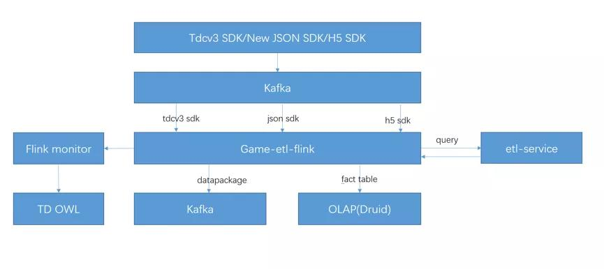

图 1. Game Analytics-etl-adaptor 迁移至 Flink 后的数据流图

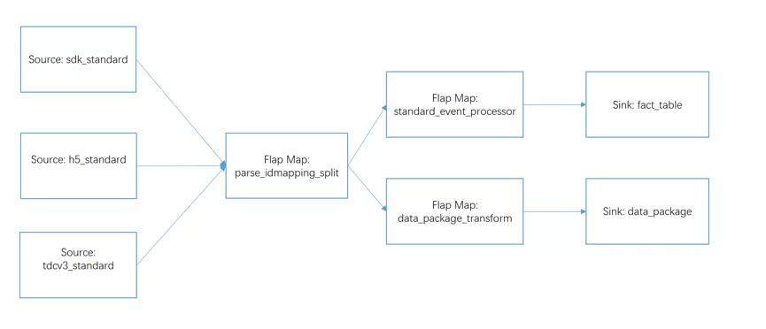

图 2. Game Analytics-etl 的 stream graph

在上面的数据流图中，flink-job 通过 Dubbo 来调用 etl-service，从而将访问外部存储的逻辑都抽象到了 etl-service 中，flink-job 则不需考虑复杂的访存逻辑以及在 job 中自建 Cache，这样既完成了服务的共用，又减轻了 job 自身的 GC 压力。

此外我们自构建了一个 monitor 服务，因为当时的 1.1.3 版本的 Flink 可提供的监控 metric 少，而且由于其 Kafka-connector 使用的是 Kafka08 的低阶 API，Kafka 的消费 offset 并没有提交的 ZK 上，因此我们需要构建一个 monitor 来监控 Flink 的 job 的活性、瞬时速度、消费淤积等 metric，并接入公司 owl 完成监控告警。

这时候，Flink 的 standalone cluster 已经承接了来自 Game Analytics 的所有流量，日均处理消息约 10 亿条，总吞吐量达到 12TB 每日。到了暑假的时候，日均日志量上升到了 18 亿条每天，吞吐量达到了约 20TB 每日，TPS 峰值为 3 万。

在这个过程中，我们又遇到了 Flink 的 job 消费不均衡、在 standalone cluster 上 job 的 deploy 不均衡等问题，而造成线上消费淤积，以及集群无故自动重启而自动重启后 job 无法成功重启。（我们将在第三章中详细介绍这些问题中的典型表现及当时的解决方案。）

经过一个暑假后，我们认为 Flink 经受了考验，因此开始将 App Analytics 的 etl-job 也迁移到 Flink 上。形成了如下的数据流图：

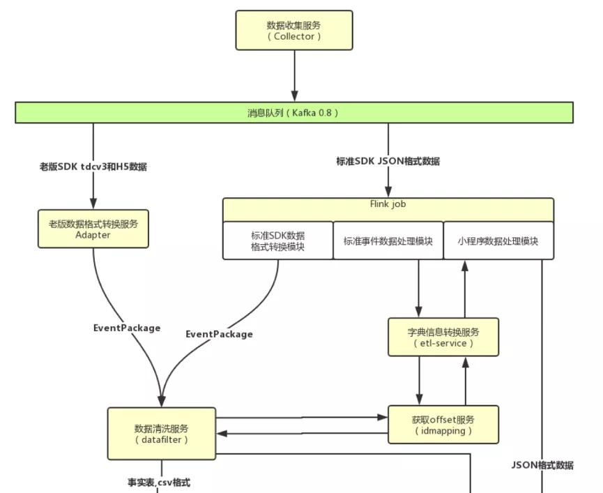

图 3. App Analytics-etl-adaptor 的标准 SDK 处理工作迁移到 Flink 后的数据流图

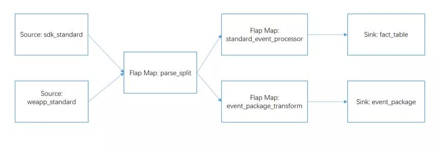

图 4. App Analytics-etl-flink job 的 stream graph

2017 年 3 月开始有大量用户开始迁移至统一的 JSON SDK，新版 SDK 的 Kafka topic 的峰值流量从年中的 8K/s 上涨至了年底的 3W/s。此时，整个 Flink standalone cluster 上一共部署了两款产品的 4 个 job，日均吞吐量达到了 35TB。

这时遇到了两个非常严重的问题：

1\) 同一个 standalone cluster 中的 job 相互抢占资源，而 standalone cluster 的模式仅仅只能通过 task slot 在 task manager 的堆内内存上做到资源隔离。同时由于前文提到过的 Flink 在 standalone cluster 中 deploy job 的方式本来就会造成资源分配不均衡，从而会导致 App Analytics 线流量大时而引起 Game Analytics 线淤积的问题；

2\) 我们的 source operator 的并行度等同于所消费 Kafka topic 的 partition 数量，而中间做 etl 的 operator 的并行度往往会远大于 Kafka 的 partition 数量。因此最后的 job graph 不可能完全被链成一条 operator chain，operator 之间的数据传输必须通过 Flink 的 network buffer 的申请和释放，而 1.1.x 版本的 network buffer 在数据量大的时候很容易在其申请和释放时造成死锁，而导致 Flink 明明有许多消息要处理，但是大部分线程处于 waiting 的状态导致业务的大量延迟。

这些问题逼迫着我们不得不将两款产品的 job 拆分到两个 standalone cluster 中，并对 Flink 做一次较大的版本升级，从 1.1.3（中间过度到 1.1.5）升级成 1.3.2。最终升级至 1.3.2 在 18 年的 Q1 完成，1.3.2 版本引入了增量式的 checkpoint 提交并且在性能和稳定性上比 1.1.x 版本做了巨大的改进。升级之后，Flink 集群基本稳定，尽管还有消费不均匀等问题，但是基本可以在业务量增加时通过扩容机器来解决。

**2.2 Flink on yarn \(1.7.1\)**

因为 standalone cluster 的资源隔离做的并不优秀，而且还有 deploy job 不均衡等问题，加上社区上使用 Flink on yarn 已经非常成熟，因此我们在 18 年的 Q4 就开始计划将 Flink 的 standalone cluster 迁移至 Flink on yarn 上，并且 Flink 在最近的版本中对于 batch 的提升较多，我们还规划逐步使用 Flink 来逐步替换现在的批处理引擎。

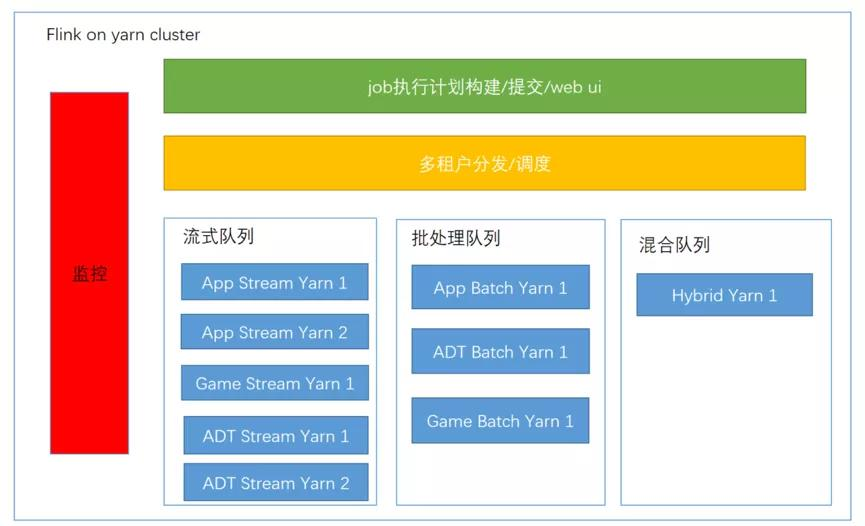

图 5. Flink on yarn cluster 规划

如图 5，未来的 Flink on yarn cluster 将可以完成流式计算和批处理计算，集群的使用者可以通过一个构建 service 来完成 stream/batch job 的构建、优化和提交，job 提交后，根据使用者所在的业务团队及服务客户的业务量分发到不同的 yarn 队列中，此外，集群需要一个完善的监控系统，采集用户的提交记录、各个队列的流量及负载、各个 job 的运行时指标等等，并接入公司的 OWL。

从 19 年的 Q1 开始，我们将 App Analytics 的部分 stream job 迁移到了 Flink on yarn 1.7 中，又在 19 年 Q2 前完成了 App Analytics 所有处理统一 JSON SDK 的流任务迁移。当前的 Flink on yarn 集群的峰值处理的消息量达到 30W/s，日均日志吞吐量达约到 50 亿条，约 60TB。在 Flink 迁移到 on yarn 之后，因为版本的升级性能有所提升，且 job 之间的资源隔离确实优于 standalone cluster。迁移后我们使用 Prometheus+Grafana 的监控方案，监控更方便和直观。我们将在后续将 Game Analytics 的 Flink job 和日志导出的 job 也迁移至该 on yarn 集群，预计可以节约 1/4 的机器资源。

三、重点问题的描述与解决

在 Flink 实践的过程中，我们一路上遇到了不少坑，我们挑出其中几个重点坑做简要讲解。

**1\. 少用静态变量及 job cancel 时合理释放资源**

在我们实现 Flink 的 operator 的 function 时，一般都可以继承 AbstractRichFunction，其已提供生命周期方法 open\(\)/close\(\)，所以 operator 依赖的资源的初始化和释放应该通过重写这些方法执行。当我们初始化一些资源，如 spring context、dubbo config 时，应该尽可能使用单例对象持有这些资源且（在一个 TaskManager 中）只初始化 1 次，同样的，我们在 close 方法中应当（在一个 TaskManager 中）只释放一次。

static 的变量应该慎重使用，否则很容易引起 job cancel 而相应的资源没有释放进而导致 job 重启遇到问题。规避 static 变量来初始化可以使用 org.apache.flink.configuration.Configuration（1.3）或者 org.apache.flink.api.java.utils.ParameterTool（1.7）来保存我们的资源配置，然后通过 ExecutionEnvironment 来存放（Job 提交时）和获取这些配置（Job 运行时）。

示例代码：

Flink 1.3设置及注册配置

```
*StreamExecutionEnvironment env = StreamExecutionEnvironment.getExecutionEnvironment();*
*Configuration parameters = new Configuration();*
*parameters.setString("zkConnects", zkConnects);*
*parameters.setBoolean("debug", debug);*
*env.getConfig().setGlobalJobParameters(parameters);*

```

获取配置（在 operator 的 open 方法中）

```
*@Override*
*public void open(Configuration parameters) throws Exception {*

- super.open(parameters);*
- ExecutionConfig.GlobalJobParameters globalParams = getRuntimeContext().getExecutionConfig().getGlobalJobParameters();*
- Configuration globConf = (Configuration) globalParams;*
- debug = globConf.getBoolean("debug", false);*
- String zks = globConf.getString("zkConnects", "");*
- //.. do more ..*

*}*

```

Flink 1.7设置及注册配置

```
*ParameterTool parameters = ParameterTool.fromArgs(args);*

*// set up the execution environment*
*final ExecutionEnvironment env = ExecutionEnvironment.getExecutionEnvironment();*
*env.getConfig().setGlobalJobParameters(parameters);*

```

获取配置

```
public static final class Tokenizer extends RichFlatMapFunction<String, Tuple2<String, Integer>> {

@Override
public void flatMap(String value, Collector<Tuple2<String, Integer>> out) {

ParameterTool parameters = (ParameterTool)

getRuntimeContext().getExecutionConfig().getGlobalJobParameters();

parameters.getRequired("input");
// .. do more ..

```

**2\. NetworkBuffer 及 operator chain**

如前文所述，当 Flink 的 job 的上下游 Task（的 subTask）分布在不同的 TaskManager 节点上时（也就是上下游 operator 没有 chained 在一起，且相对应的 subTask 分布在了不同的 TaskManager 节点上），就需要在 operator 的数据传递时申请和释放 network buffer 并通过网络 I/O 传递数据。

其过程简述如下：上游的 operator 产生的结果会通过 RecordWriter 序列化，然后申请 BufferPool 中的 Buffer 并将序列化后的结果写入 Buffer，此后 Buffer 会被加入 ResultPartition 的 ResultSubPartition 中。ResultSubPartition 中的 Buffer 会通过 Netty 传输至下一级的 operator 的 InputGate 的 InputChannel 中，同样的，Buffer 进入 InputChannel 前同样需要到下一级 operator 所在的 TaskManager 的 BufferPool 申请，RecordReader 读取 Buffer 并将其中的数据反序列化。BufferPool 是有限的，在 BufferPool 为空时 RecordWriter/RecordReader 所在的线程会在申请 Buffer 的过程中 wait 一段时间，具体原理可以参考:\[1\], \[2\]。

简要截图如下：

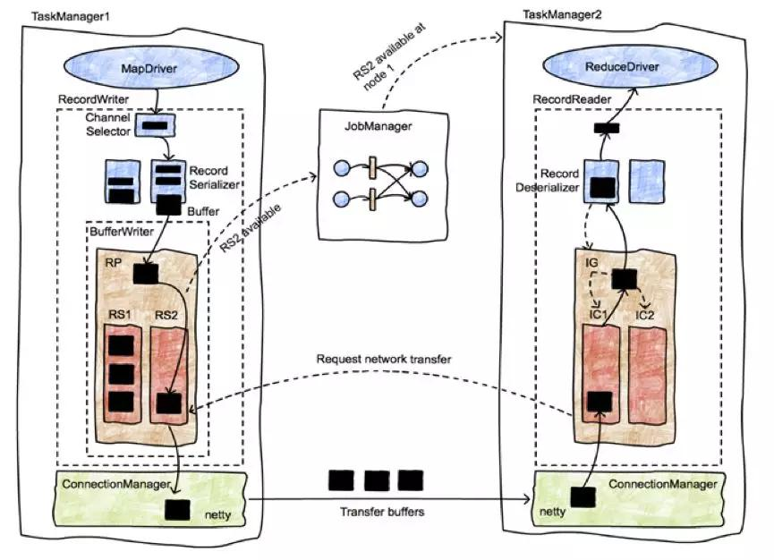

图 6. Flink 的网络栈, 其中 RP 为 ResultPartition、RS 为 ResultSubPartition、IG 为 InputGate、IC 为 inputChannel。

在使用 Flink 1.1.x 和 1.3.x 版本时，如果我们的 network buffer 的数量配置的不充足且数据的吞吐量变大的时候，就会遇到如下现象：

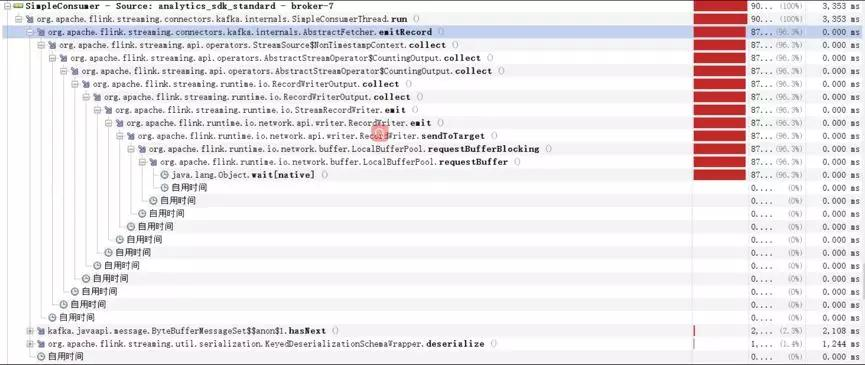

图 7. 上游 operator 阻塞在获取 network buffer 的 requestBuffer\(\) 方法中

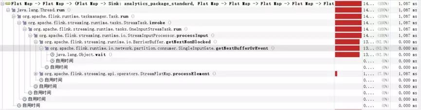

图 8. 下游的 operator 阻塞在等待新数据输入

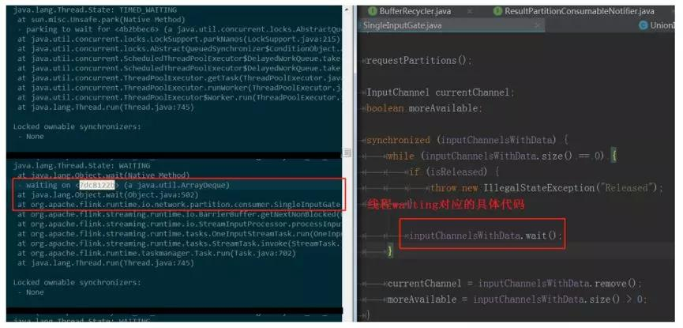

图 9. 下游的 operator 阻塞在等待新数据输入

我们的工作线程（RecordWriter 和 RecordReader 所在的线程）的大部分时间都花在了向 BufferPool 申请 Buffer 上，这时候 CPU 的使用率会剧烈的抖动，使得 Job 的消费速度下降，在 1.1.x 版本中甚至会阻塞很长的一段时间，触发整个 job 的背压，从而造成较严重的业务延迟。这时候，我们就需要通过上下游 operator 的并行度来计算 ResultPartition 和 InputGate 中所需要的 buffer 的个数，以配置充足的 taskmanager.network.numberOfBuffers。

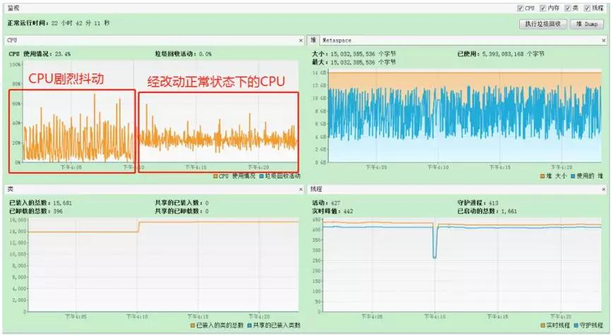

图 10. 不同的 network buffer 对 CPU 使用率的影响

当配置了充足的 network buffer 数时，CPU 抖动可以减少，Job 消费速度有所提高。

在 Flink 1.5 之后，在其 network stack 中引入了基于信用度的流量传输控制（credit-based flow control）机制 \[2\]，该机制大限度的避免了在向 BufferPool 申请 Buffer 的阻塞现象，我们初步测试 1.7 的 network stack 的性能确实比 1.3 要高。

但这毕竟还不是最优的情况，因为如果借助 network buffer 来完成上下游的 operator 的数据传递不可以避免的要经过序列化 / 反序列化的过程，而且信用度的信息传递有一定的延迟性和开销，而这个过程可以通过将上下游的 operator 链成一条 operator chain 而避免。因此我们在构建我们流任务的执行图时，应该尽可能多的让 operator 都 chain 在一起，在 Kafka 资源允许的情况下可以扩大 Kafka 的 partition 而使得 source operator 和后继的 operator 链在一起，但也不能一味扩大 Kafka topic 的 partition，应根据业务量和机器资源做好取舍。更详细的关于 operator 的 training 和 task slot 的调优可以参考: \[4\]。

**3\. Flink 中所选用序列化器的建议**

在上一节中我们知道，Flink 的分布在不同节点上的 Task 的数据传输必须经过序列化 / 反序列化，因此序列化 / 反序列化也是影响 Flink 性能的一个重要因素。Flink 自有一套类型体系，即 Flink 有自己的类型描述类（TypeInformation）。Flink 希望能够掌握尽可能多的进出 operator 的数据类型信息，并使用 TypeInformation 来描述，这样做主要有以下 2 个原因：

1. 类型信息知道的越多，Flink 可以选取更好的序列化方式，并使得 Flink 对内存的使用更加高效；

2. TypeInformation 内部封装了自己的序列化器，可通过 createSerializer\(\) 获取，这样可以让用户不再操心序列化框架的使用（例如如何将他们自定义的类型注册到序列化框架中，尽管用户的定制化和注册可以提高性能）。

总体上来说，Flink 推荐我们在 operator 间传递的数据是 POJOs 类型，对于 POJOs 类型，Flink 默认会使用 Flink 自身的 PojoSerializer 进行序列化，而对于 Flink 无法自己描述或推断的数据类型，Flink 会将其识别为 GenericType，并使用 Kryo 进行序列化。Flink 在处理 POJOs 时更高效，此外 POJOs 类型会使得 stream 的 grouping/joining/aggregating 等操作变得简单，因为可以使用如:dataSet.keyBy\("username"\) 这样的方式直接操作数据流中的数据字段。

除此之外，我们还可以做进一步的优化:

1\) 显示调用 returns 方法，从而触发 Flink 的 Type Hint：

dataStream.flatMap\(new MyOperator\(\)\).returns\(MyClass.class\)returns 方法最终会调用 TypeExtractor.createTypeInfo\(typeClass\) ，用以构建我们自定义的类型的 TypeInformation。createTypeInfo 方法在构建 TypeInformation 时，如果我们的类型满足 POJOs 的规则或 Flink 中其他的基本类型的规则，会尽可能的将我们的类型“翻译”成 Flink 熟知的类型如 POJOs 类型或其他基本类型，便于 Flink 自行使用更高效的序列化方式。

```
*//org.apache.flink.api.java.typeutils.PojoTypeInfo*

*@Override*
*@PublicEvolving*
*@SuppressWarnings("unchecked")*
*public TypeSerializer<T> createSerializer(ExecutionConfig config) {*

- if (config.isForceKryoEnabled()) {*
- return new KryoSerializer<>(getTypeClass(), config);*
- }*
- if (config.isForceAvroEnabled()) {*
- return AvroUtils.getAvroUtils().createAvroSerializer(getTypeClass());*
- }*
- return createPojoSerializer(config);*

*}*

```

对于 Flink 无法“翻译”的类型，则返回 GenericTypeInfo，并使用 Kryo 序列化：

```
*//org.apache.flink.api.java.typeutils.TypeExtractor*

*@SuppressWarnings({ "unchecked", "rawtypes" })*
*private <OUT,IN1,IN2> TypeInformation<OUT> privateGetForClass(Class<OUT> clazz, ArrayList<Type> typeHierarchy,*

- ParameterizedType parameterizedType, TypeInformation<IN1> in1Type, TypeInformation<IN2> in2Type) {*
- checkNotNull(clazz);*
- // 尝试将 clazz 转换为 PrimitiveArrayTypeInfo, BasicArrayTypeInfo, ObjectArrayTypeInfo*
- // BasicTypeInfo, PojoTypeInfo 等，具体源码已省略 *
- //...*
- *
- // 如果上述尝试不成功 , 则 return a generic type*
- return new GenericTypeInfo<OUT>(clazz);*

*}*

```

2\) 注册 subtypes: 通过 StreamExecutionEnvironment 或 ExecutionEnvironment 的实例的 registerType\(clazz\) 方法注册我们的数据类及其子类、其字段的类型。如果 Flink 对类型知道的越多，性能会更好；

3\) 如果还想做进一步的优化，Flink 还允许用户注册自己定制的序列化器，手动创建自己类型的 TypeInformation，具体可以参考 Flink 官网：\[3\]；

在我们的实践中，最初为了扩展性，在 operator 之间传递的数据为 JsonNode，但是我们发现性能达不到预期，因此将 JsonNode 改成了符合 POJOs 规范的类型，在 1.1.x 的 Flink 版本上直接获得了超过 30% 的性能提升。在我们调用了 Flink 的 Type Hint 和 env.getConfig\(\).enableForceAvro\(\) 后，性能得到进一步提升。这些方法一直沿用到了 1.3.x 版本。

在升级至 1.7.x 时，如果使用 env.getConfig\(\).enableForceAvro\(\) 这个配置，我们的代码会引起校验空字段的异常。因此我们取消了这个配置，并尝试使用 Kyro 进行序列化，并且注册我们的类型的所有子类到 Flink 的 ExecutionEnvironment 中，目前看性能尚可，并优于旧版本使用 Avro 的性能。但是最佳实践还需要经过比较和压测 KryoSerializer\AvroUtils.getAvroUtils\(\).createAvroSerializer\PojoSerializer 才能总结出来，大家还是应该根据自己的业务场景和数据类型来合理挑选适合自己的 serializer。

1. Standalone 模式下 job 的 deploy 与资源隔离共享

结合我们之前的使用经验，Flink 的 standalone cluster 在发布具体的 job 时，会有一定的随机性。举个例子，如果当前集群总共有 2 台 8 核的机器用以部署 TaskManager，每台机器上一个 TaskManager 实例，每个 TaskManager 的 TaskSlot 为 8，而我们的 job 的并行度为 12，那么就有可能会出现下图的现象：

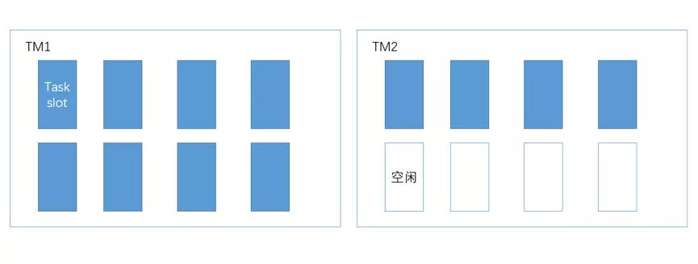

第一个 TaskManager 的 slot 全被占满，而第二个 TaskManager 只使用了一半的资源！资源严重不平衡，随着 job 处理的流量加大，一定会造成 TM1 上的 task 消费速度慢，而 TM2 上的 task 消费速度远高于 TM1 的 task 的情况。假设业务量的增长迫使我们不得不扩大 job 的并行度为 24，并且扩容 2 台性能更高的机器（12 核），在新的机器上，我们分别部署 slot 数为 12 的 TaskManager。经过扩容后，集群的 TaskSlot 的占用可能会形成下图：

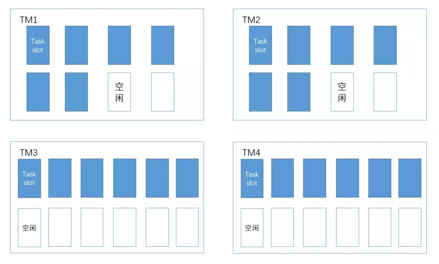

新扩容的配置高的机器并没有去承担更多的 Task，老机器的负担仍然比较严重，资源本质上还是不均匀！

除了 standalone cluster 模式下 job 的发布策略造成不均衡的情况外，还有资源隔离差的问题。因为我们在一个 cluster 中往往会部署不止一个 job，而这些 job 在每台机器上都共用 JVM，自然会造成资源的竞争。起初，我们为了解决这些问题，采用了如下的解决方法:

1. 将 TaskManager 的粒度变小，即一台机器部署多个实例，每个实例持有的 slot 数较少；

2. 将大的业务 job 隔离到不同的集群上。

这些解决方法增加了实例数和集群数，进而增加了维护成本。因此我们决定要迁移到 on yarn 上，目前看 Flink on yarn 的资源分配和资源隔离确实比 standalone 模式要优秀一些。

四、总结与展望

Flink 在 2016 年时仅为星星之火，而只用短短两年的时间就成长为了当前最为炙手可热的流处理平台，而且大有统一批与流之势。经过两年的实践，Flink 已经证明了它能够承接 TalkingData 的 App Analytics 和 Game Analytics 两个产品的流处理需求。接下来我们会将更复杂的业务和批处理迁移到 Flink 上，完成集群部署和技术栈的统一，最终实现图 5 中 Flink on yarn cluster 的规划，以更少的成本来支撑更大的业务量。

参考资料：

\[1\] https://cwiki.apache.org/confluence/display/FLINK/Data+exchange+between+tasks

\[2\] https://flink.apache.org/2019/06/05/flink-network-stack.html

\[3\] https://ci.apache.org/projects/flink/flink-docs-release-1.7/dev/types\_serialization.html\#type-hints-in-the-java-api

\[4\] [https://mp.weixin.qq.com/s/XROoLEu38e46PlBAcepaTg](https://mp.weixin.qq.com/s?__biz=MjM5MDAxMTE0MA==&mid=2652051399&idx=2&sn=9e530d43d775ea769c7c45f086894894&scene=21#wechat_redirect)

作者简介

**肖强** ：TalkingData 资深工程师，TalkingData 统计分析产品 App Analytics 和 Game Analytics 技术负责人。硕士毕业于北京航空航天大学，主要从事大数据平台开发，对流式计算和分布式存储有一定研究。
