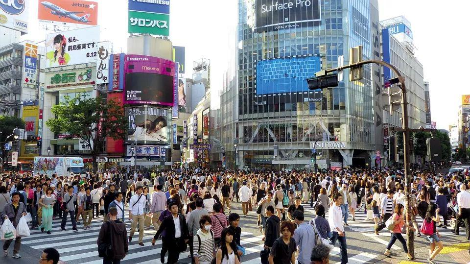

## 让客户忍不住买买买的假期营销活动，都满足这3点_36氪  

> 发布: 蛋解创业  
> 发布日期: 2019-09-20  

编者按：本文来自微信公众号“[蛋解创业”](https://mp.weixin.qq.com/s/hVY4_l08YVOEVP0WYluCAg)（ID：manjiechuangye），作者一念，36氪经授权发布。

根据文旅部公布的消息，2019年中秋节期间，全国接待国内旅游总人数1.05亿人次，同比增长7.6%；国内旅游收入472.8亿元，同比增长8.7%。

其实除了旅游，在节假日，餐饮、娱乐之类的服务行业，也是一次消费高峰，同时各商家也会进行打折促销。

这种在节假日，集中旅游、消费的现象，就是我们说的“假日经济”。

图片来源网络

**如何在节假日，提升销售额，成为了每个商家都会头疼的事情。**

对于商家来说，有几个必须思考的问题：

* 消费者在节假日的需求有什么变化？

* 为什么会在节假日集中购物？

* 消费者会被什么样的假期活动吸引？

* 哪3个因素影响假期营销活动的效果？

通过阅读，你将得到答案。

###  **节日对中国人有着不同的含义**

“假日经济”与“节日经济”不完全相同，但是中国每年的主要假期，大部分和传统节日有关。这些节日的含义，很大程度上，影响着人们在节假日的消费习惯。

比如中秋节这个代表团圆的节日，让更多的人愿意在这个假期陪伴家人。所以尽管中秋假期的旅游人数和国内旅游收入在逐年增长，但是和“五一”假期比起来，还有着很大的差距。

那么对于商家来说，如何刺激消费者在节日时的消费欲望，就是一个必须考虑的问题。

可口可乐在这方面，给人留下了比较深刻的印象。

视频来源网络

每年春节，在央视春晚之前，都能看到可口可乐的广告。

而且不管广告内容怎么变，一定有一些元素，始终不会变。带着孩子回家过年的年轻父母、祖孙三代一起吃团圆饭、烟花、窗花、福娃。

**用各种春节的元素与阖家团圆的氛围，给品牌赋予了春节的含义，** 给消费者留下了吃团圆饭要喝可乐的印象。

其实除了春节，可口可乐每年都会有很多非常优秀的营销广告。但其每年春节的节日广告，依然是经典。

每个节假日，都会有很多品牌绞尽脑汁的策划与节日有关的营销活动。

今年中秋节之前，支付宝新出了一支短片。

截图来源于网络视频

搭配过去9个新闻事件，不同的时间，不同的地点，但每个都与回家有关。用这样的方式，唤起用户思乡的情绪，尤其是在中秋节这个时间点，很巧妙的建立了和节日的联系。

在中国，除了“五一”和“十一”，一年中的其他假期，都与传统节日有关。

如何将假期营销活动与节日的含义联系起来，成为了影响活动效果的关键因素。

###  **假期的消费需求，更重视社交价值**

除了节日的关系，假期中可以影响消费者的另一个因素，是人的社交需求。

假期结束，回到公司继续上班，很多人都会讨论假期如何度过之类的话题。

想象一下，如果跟人聊去哪旅游。下面这些地方，给人的感觉有什么不同？

挪威、奥地利、冰岛、南非、刚果、马来西亚、泰国、西藏、云南、内蒙古、河北保定、北京大兴、北京门头沟。

不要否认，这些地方给人的感觉，一定有很大区别。

**所有生物之间，都存在一种本能的竞争机制。** 人与人之间的层次，就是在这种无形的竞争中拉开差距，各种社会资源也会向看起来层次更高的人倾斜。而消费者在本能上，更愿意为了在这种竞争中获得优势而付费。

图片来源网络

特别是在节假日的时候，这种隐性竞争的社交需求会更突出。因为工作时，同一个圈子里的人，生活轨迹都差不多，只有在节假日才会显出区别。所以这也造成了消费者，在节假日集中消费的现象。

**那么对于商家来说，你要办什么活动，才能帮助消费者在社交过程中，获得这种隐性竞争的优势呢？**

答案是 **提供** **社交货币** 。

社交货币是建立在社交关系的基础上，能够换来别人关注、评论、点赞的内容。人们在社交圈中，依靠各种形式的社交货币，构建自己的身份形象。

所以你的活动，必须给消费者提供这种社交货币。帮助消费者，在各种无形的隐性竞争中获得优势，而不是单纯的卖产品。这样，你才能在商业竞争中赢得用户。

当然活动不需要多么高端，有趣、新奇比高端更重要。

图片来源网络

举个例子，很多做烘焙的商家，都会举办烘焙DIY的活动，还会设计竞争机制，并且用奖品吸引人来参与。对于参与者来说，这本身就是一个新奇的体验，而且又有竞争，又有奖品，对一些人来说，会有很强的参与动力。

而且不管自己做的怎么样，不管能不能在竞争中获胜，参与者会有更强烈的分享欲望。 **因为分享这种活动，能够在社交圈中塑造自己的形象。**

不同类型的活动，能够塑造不同的形象，这就是为消费者，提供了社交货币。

###  **每到假期，消费者更愿意为生活买单**

每次节假日，都是一次商家的狂欢。

假期中，另外一个影响人消费决策的因素，是要考虑假期对人们生活的意义。

相对于普通的工作日来说，节假日起到了调节生活的作用。有条件的人，通常会选择在节假日提升一下生活品质，缓解一下工作带来的压力。这种需求，同样会促进消费。

最直观的体现，每到假期，人们在饮食上都会比平时要改善一些。一个比较固化的观念认为， **过节至少要吃点好的。**

除了饮食，在生活中很多其他方面，都可以体现出与平时的不同。

图片来源网络

如果没有选择出游，在假期的时候，大概也会选择在附近逛一逛，看看电影、听听音乐会、参加一些有趣的活动，有些人会去做个足疗、泡泡温泉等等。

总之就是要和平时有些区别，毕竟工作压力都很大，好不容易放假，至少要放松一下。

调节生活，缓解工作的压力，成为了节假日的主要需求，所以 **假期的消费冲动，会比平时更强烈。** 因为消费本身，就能起到缓解压力的作用。

春节期间，支付宝举办了扫福字的活动，只要用支付宝扫描“福”，就能参与集福活动。这种活动参与门槛低，而且可以和家人朋友产生互动。这样一个简单的活动，就能起到让人暂时忘记烦恼的作用。

**那么对于商家来说，你做了什么让消费者缓解压力的活动？**

通常情况下，很多商家都会在节假日设置打折促销。但是在消费需求越来越复杂的当下，单纯的打折，已经不足以刺激消费者的欲望。

图片来源网络

**有些商家会设置一些挑战** ，比如在抖音上刷到过的跳远挑战，根据跳远的距离，设置不同的折扣力度。因为有了折扣的吸引，可以刺激消费者的参与欲望。原理虽然很简单，但效果很不错。

那么在节假日时，你是不是可以设置一些有娱乐性的挑战游戏？一方面用折扣或者其它奖励吸引人参与，另一方面在参与过程中，还能起到缓解压力的作用。

因为人们在节假日调节生活、缓解压力的需求，消费欲望本身就会比平时要高。所以对于商家来说，活动的主要目的是满足消费者的心理需求，促进消费欲望。

*  **给营销活动赋予节日的含义；**

*  **为消费者提供有价值的社交货币；**

*  **能够帮助消费者缓解压力。**

如果能同时满足这3点，将会极大地刺激消费者的购买欲望，才是一个成功的假期营销活动。
