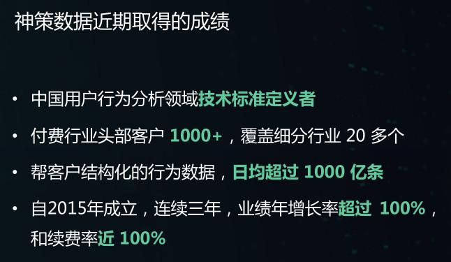
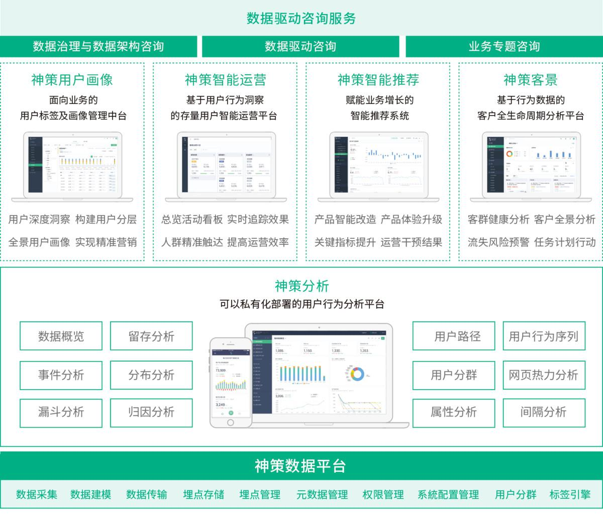
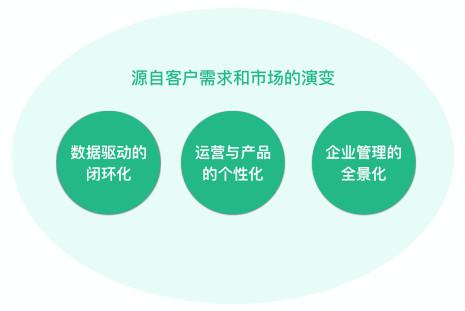

## 神策数据CEO桑文锋：从单品到矩阵，神策的“数据便利店”开张了_36氪  

> 发布: 林鲁比@36氪Pro  
> 发布日期: 2019-09-11  

神策数据刚刚举办了一场信息量非常丰富的沟通会。

不仅披露了最新的业务发展数据，公布了从极致单品到产品矩阵的战略调整，发布了4款新产品，神策数据还分享了产品演进方法论、对数据智能业务边界的思考以及组织建设的经验。在这场堪比研讨沙龙的沟通会前后，甚至还有5个PDF和3个Word文档作为与会者的阅读材料。

内容不少，本文希望浓缩精华，同时高保真地传递神策数据的思维成果，篇幅略长，希望对各位有用。

### 最新的成绩单：1000+付费客户，续费率近100%，过亿营收

从2015年神策数据成立开始，36氪就曾对神策做过长期的追踪报道：

l  [2015年，神策数据发布了用户行为数据分析产品Sensors Analytics；](https://36kr.com/p/5037763)

l  [2016年，完成400万美元A轮融资，红杉中国领投，线性资本、明势资本和薛蛮子等天使股东跟投；](https://36kr.com/p/5046085)

l  [2017年，完成1100万美元B轮融资，DCM领投，红杉中国跟投；](https://36kr.com/p/5068460)

l  [2018年，完成4400万美元C轮融资，华平资本领投，老股东跟投。](https://36kr.com/p/5128528)

每一次报道背后都是神策数据的一次升级。这一次神策交出的成绩单也非常好看。

对SaaS企业来说，高留存是有效增长的前提，近三年， **神策数据的续费率接近100%** 。事实上，影响续费率的因素不仅是产品与售后服务，还有目标客群。2017年之前，神策数据并没有想清楚做小微企业客户还是大客户，这也是许多SaaS公司在成立之初面临的问题。随后，一批批前赴后继、烧钱放量的创业公司通过实操得出答案—— **小微企业客户生命周期短，LTV（用户生命周期总价值）难以突破，使得SaaS低客单、高留存、“复利式”增长的模型无法跑通。** 定位小微企业市场，SaaS公司的续约率往往成为“死穴”。

2017年开始，神策数据将客户定位为两大类： **头部互联网企业以及拥抱“互联网+”的传统企业** 。神策数据创始人桑文锋表示，神策数据在获客时，会注重选择付费能力强、业务成长性好的企业，不仅能为续约率提供保障，大客户还可以验证一些需求的重要性，一旦验证成功，就会被产品化。“现在神策数据以 **高价值、复杂客户需求** 为灯塔，虽然重，但是长期来说这让神策在服务其他客户时更加游刃有余，对市场拓展和市场覆盖更有帮助。”桑文锋表示。

以订阅模式按年付费，是一种两边不讨好的模式，在实际SaaS企业经营中，客户的压力、业绩的压力袭来，销售动作也很容易变形。对大客户而言，项目制一次性付费+少量维护费更符合过往的采购流程；对销售而言，不论是一锤子买卖还是一签多年，都比年订阅费的形式省心省力。但这也是传统软件供应商被诟病的地方，收钱之后懈怠运维，一次性买断也难以挖掘客户新需求点实现复购。

“在神策数据，一签多年还有卖‘期货’都是不允许的，销售人员对客户的需求要say no。1000多家客户当中，只有50多家传统企业采用项目制收费，其余都是按年收取订阅费。”桑文锋强调，“ **把刀架在自己脖子上，让客户掌握主动权，越逼自己，发展劲头才会越狠。** ”

截至目前，神策数据的付费客户超过1000家，覆盖细分行业超过20多个，2018年实现过亿营收，代表性客户有中国银联、广发证券、小米、四川航空等。

神策数据曾发了宏愿，希望重构中国互联网数据根基，帮助中国企业搭建数据基础，这是个大工程。

“国内大数据行业基本要面临两个问题， **一是数据底子薄，二是数据意识差** 。”桑文锋说。这种情况在“互联网+”企业中体现更加明显。帮助“互联网+”企业搭建根基，从扶上马到送一程，中间需要无数环环相扣的推动，这种推动力可能是咨询，可能是服务，可能是产品。 **在客户体会产品价值的关键环节，SaaS企业都会面临做轻（产品）还是做重（服务or咨询）的抉择。**

“神策数据一开始确实是想做轻的方式，所以采用单品极致策略，但后来发现，中国企业不仅数据化程度不高，与数据相关的意识、组织（数据研发工程师、数据分析师）和流程都是欠缺的。所以，我们又引入了服务、咨询。但是我们始终坚持，能用‘产品’解决的，就不用‘服务’解决，能用‘服务’解决的，就不用‘咨询’解决。”桑文锋解释。

神策数据目前为“互联网+”的传统行业落地产品的周期从3到6个月不等，实施的标准流程大致可以划分为：梳理指标体系——定制数据采集方案——结合场景埋点+前后台工具接入数据——数据校准——交付培训。

桑文锋认为，做好客户成功，不应该只是像客服一样被动地响应客户问题， **更需要定义自己的工作流程和工作方法。** “经过梳理，我们把客户成功分为交付环节和维护环节，其中交付环节经过反复打磨形成八个标准步骤，并且在实际服务过程中不断迭代。”桑文锋举例。此外，桑文锋给出的Tips还包括：基于场景为客户培训；保证客户成功团队角色多样性；严进严出的员工培训以及机器替代人力的效率提升。

这种“开荒式创业”还给了神策数据参与定义行业标准的机会：2018年4月，神策数据与中国信息通信研究院合作，发布用户行为分析标准。神策数据的SDK也在GitHub上开源，让没有购买神策数据产品的互联网公司也能自行实现数据基础。

### 从“单品极致”到“产品矩阵”，是什么？为什么？

在沟通会上，神策数据发布了4款新产品：「神策用户画像」、「神策智能运营」、「神策智能推荐」以及「神策客景」。原来唯一的产品“神策分析”被抽象出来，作为面向矩阵中其他产品的公共平台，变为「神策数据基础平台」。

神策数据产品矩阵

神策基础数据平台（原神策分析）主要为客户解决两件事情：第一，用户行为数据标准化采集，客户打好数据根基；第二，做有效数据管理，提供可视化分析能力，向其他四个产品同统一输出。

神策数据5个产品的客户使用场景分为四大类：营销分析、产品迭代、用户运营、产品智能。除了神策分析，其他四个产品分别是：

**Ø   神策智能运营**，主要面向用户运营、活动运营和内容运营等人员，提升运营效率和效益。通常运营人员要策划和执行运营策略，从前期圈定客群、设计策略、收到反馈、评估结果的周期需要跨多部门协同（产品、开发、运维等），走完一个闭环至少需要大半周，神策智能运营则通过打通行为数据与自动化触达工具，配合运营看板，提升运营效率；

**Ø   神策智能推荐**，同样是基于打通的用户数据，不仅为客户节约推荐系统的开发建设成本，还为客户提供推荐内容的人工干预和管理工具，使得推荐算法对运营人员来说不再是黑盒，而是可配置、可干预的控制台；

**Ø   神策用户画像**，可以为企业统一多终端、多设备和多渠道的用户数据，实现颗粒度更细致且更全面的用户画像，以可视化方式进行实时动态计算与自助式的标签生产与管理；

**Ø   神策客景**，主要为To B企业提供客户全生命周期管理，这其实也是神策数据自身业务流程被产品化之后开放出来的能力，为市场部追踪渠道、管理线索，驱动销售推动线索转化，并且帮客户成功监测客户健康度、状态变化趋势等，主要从服务管理者的角度，站在全局查看自身的经营状况。

**为什么要从单产品到多产品？**

神策数据产品总监杜明翰解释，过去一年多，神策数据感知到3个市场需求的变化，驱使公司走向产品矩阵。

首先，客户的需求不仅局限于数据驱动的分析，更看重从分析到落地，从执行到反馈的闭环。

其次，客户对运营和产品个性化需求越来越高，这主要是因为客户的注意力正从“新客户挖掘”转移到“存量客户运营”，因此精细化、个性化的运营工具需求也更加强烈。

第三，对To B企业而言，从销售到落地到维护，管理者需要全景式的数据支持。

除了以上略显官方的解释，桑文锋个人公众号的文章（《阶段性认识Product/Market Fit》），透露了神策数据多产品策略背后的考虑： **更高的业务天花板、更大的市场规模** 。企业客户精细化运营用户的需求客观存在，且是强烈刚需，为企业搭建了“数据根基”的神策数据没有理由放过运营工具的市场。

### 产品演进与组织演进方法论

在沟通会上，神策数据产品总监杜明翰分享了这一系列产品的孵化过程。他总结神策的产品方法论：在精益创业的基础上，从客户中来，到客户中去，以最小可用产品取得用户反馈，进行快速迭代。

杜明翰解释，这个过程可拆分为三个步骤：① 提出方案假设，通过传统访谈或原型邀请使用的方式，邀请十几位种子客户产品；② 开发MVP，让天使客户参与使用；③ 对产品精心通用性改进，复制推广到其他细分行业。

“以神策智能运营为例，我们连续2个月走访3地，调研超过60家企业，整理记录超过80个痛点，完成了从0到1的3次MVP迭代。”杜明翰说道。

不过多产品孵化与矩阵的面世仅仅是万里长征第一步，适配多产品矩阵的组织架构才是更大的挑战。多产品的持续迭代、运营支持以及市场营销，背后所需的组织架构与此前单一产品完全不同。 **没有相应的组织升级，产品矩阵升级可能会将企业拽向** **失控。**

对此，桑文锋表示：“团队规模肯定会扩大，原本服务一个产品的团队肯定无法支撑5个产品，如果保持和之前做一个产品一样的团队规模，意味着每个产品只有之前20%的力量，产品的市场竞争力也会变弱。神策数据去年的人数基本翻倍，今年也基本翻倍，还在持续扩大中，做好产品矩阵，首先要保证资源，组织建设是一切的前提。”

目前神策数据的团队已经超过300人。

### 边界与原则

在神策数据发布的一系列新产品中，可以看到各种功能模块的影子：CRM、CDP、MA。也不由得让人想发问：神策数据的业务边界在哪里？

“神策数据最早只做数据流，不做流程控制，但我们发现，只做数据本身难以形成闭环，如果客户运营成熟度不够，闭环效果便会大打折扣。为了让客户更好地实现数据驱动，神策数据才开始考虑做流程控制，才有了神策智能运营等产品。” 桑文锋表示，“我比较认可王兴的那句话，‘太多人关注边界，而不关注核心’，神策的核心是帮客户建设更好的数据流，而做什么、不做什么取决于我们的组织能力。”

桑文锋强调，随需而变是神策做事的原则之一。企业客户对数据驱动的理解正变得越来越深刻，需求也从简单的日活月活记录，变为关注转化漏斗、最终交易、留存与复购。

铃木敏文关于7-11便利店的经营理念，也给桑文锋启发。

“神策数据在产品定价方便一直追求该价格上的物有所值，而非低价，这是神策数据的定价逻辑。7-11便利店空间不大，但能满足人们大部分日常生活所需，神策数据推出产品矩阵，也是为客户提供解决数据需求的‘便利店’。”桑文锋说道。

**4个新产品线只是开始，神策数据的“数据服务便利店”才刚刚开张。**

