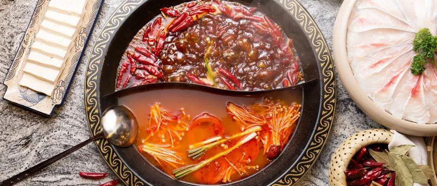
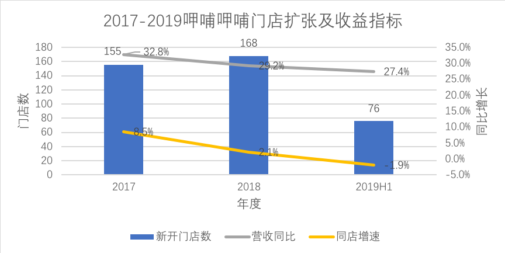
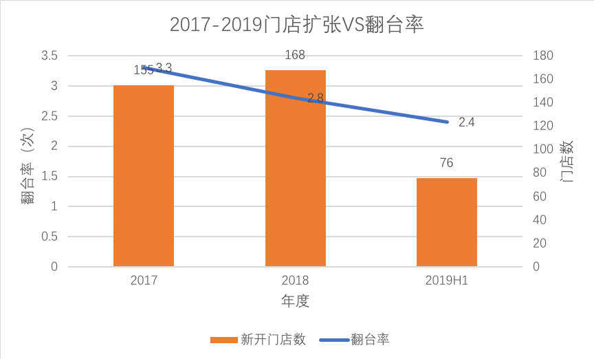
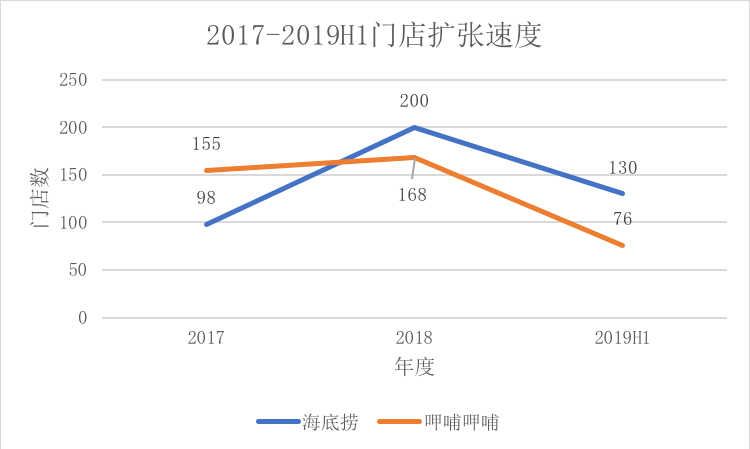
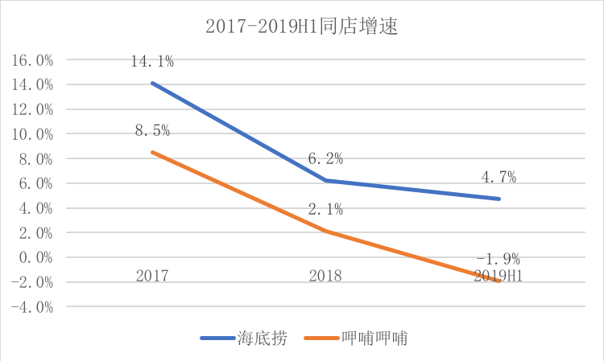
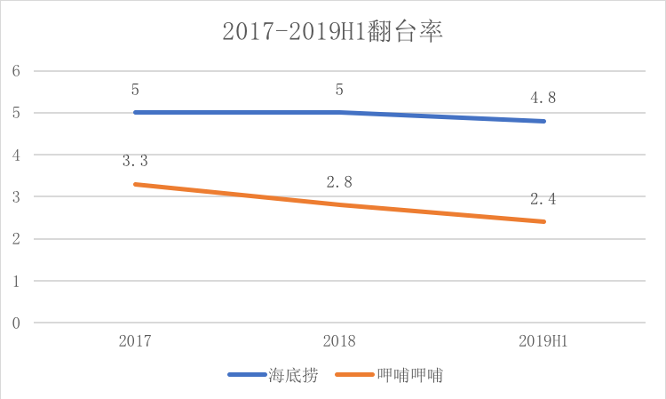
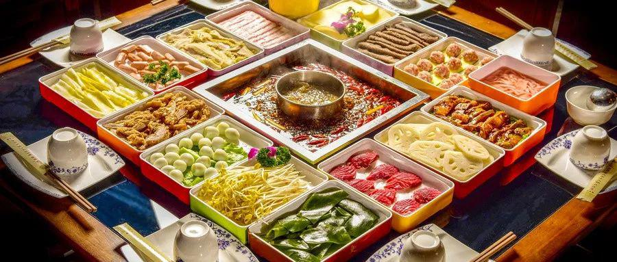
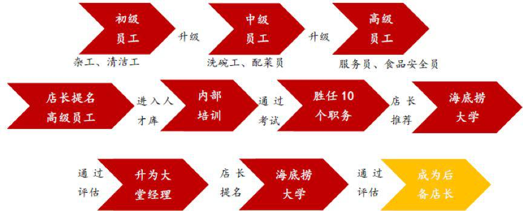

## 为什么说中餐是个被诅咒的行业？_36氪  

> 发布: 混沌大学  
> 发布日期: 2019-09-16  

编者按：本文来自微信公众号“[混沌大学](https://mp.weixin.qq.com/s/Sc6UagOWjxlN1o0JjElKlQ)”（ID：hundun-university），作者 Michael Liu，版式 JY.Yang，36氪经授权发布。

中餐行业属于典型的“大行业，小公司”。规模最大的海底捞市场占有率仅为0.3%，而CR5（行业前5大公司的市占率总和）还不到1%。

但在美国，仅麦当劳一家的销售收入，就占到了整个行业的3%以上。

那么，中餐规模化的瓶颈到底在哪里？

###  **中餐规模化之殇**

中餐号称是“被诅咒的行业”，因为它的标准化非常困难，而标准化又是规模化的前提。

众所周知，经营一家餐厅实现盈利相对容易，但是如果要扩大规模，就必须实现至少3方面的标准化：

**标准化的原材料、标准化的产品制作流程、标准化的管理。**

遗憾的是，这三点中餐都很难做到。

首先，中餐的原材料极为丰富，对于麦当劳而言，可能只是牛排、生菜、番茄酱等几十种，而中餐，拿一个川菜馆来说，需要的食材可能就在几百上千种。

更困难的是，有的食材要求必须是某个时节在某个地域生产的，如此苛刻的条件，原材料何以标准化呢？

其次，中餐的制作过程复杂，非常依靠大厨的手艺，这也可以解释为什么有的餐厅一时火爆，大厨一走，就走向寂寥。烹饪用语中的“少许”、“中火”、“切丁”，怎么量化？无法量化也就无法标准化。

最后，最让人头疼的是管理。中国企业的管理水平普遍弱于国外的老牌公司，尤其是餐饮行业，规模扩大之后，非常容易形成各个餐厅的自我管理、管家式管理，标准丧失殆尽，规模化的效益完全体现不出来，而且管理成本急剧增加，以致走向衰败。

那是不是中餐在规模化的道路上就全军覆没了呢？当然不是。矮子里挑将军还是能找出 **相对而言容易标准化的细分门类的，这就是火锅。**

按照之前的分析，火锅作为中餐的一个细分领域，至少在标准化上，有其独到的优势。

**第一** ，是不依赖厨师，不论开多少家分店不必担心大厨的限制；

**第二** ，火锅的特性是顾客就是自己的厨师，怎么做，怎么吃，顾客自己说了算，门店提供的仅仅是标准化的原材料而已；

**第三** ，是接受度高，不论是想吃什么口味，调节蘸料即可。

这些特性决定了，在中餐行业，最容易做到规模化的就是火锅。数据也支持了这一点：火锅以13.7%的餐饮消费比例，成为中餐中的第一大门类。

既然火锅行业可以作为中餐行业规模化的先锋，那么对这个特殊门类规模化的研究就具有前瞻性。今天火锅行业遇到的问题，产生的经验，都可以为中餐未来的崛起做借鉴。

 **标准化是必要但非充要条件**

一说到火锅连锁企业扩大规模的问题，很多人自然把症结与标准化联系起来。标准化的确是任何一家餐饮企业想要实现规模化的前提，但并不是瓶颈。 **因为标准化是整个产业进步带来的产业变革，每一家企业都能享受到，但它不意味着享受到了这种红利，规模化就能成功** 。

为什么说这是一种产业红利呢？这可以从非常成熟的美国餐饮业发展史说起。美国的餐饮行业经历了3个阶段：传统餐饮业阶段（1700s-1920s）;现代餐饮阶段（1920s-2000s）;新潮流的诞生（21世纪初至今）。

其中，餐饮行业的规模化出现在第二阶段，也正是在这一阶段，诞生了麦当劳、星巴克等餐饮龙头，这一时期整个餐饮行业呈现如下特点：

1.二战后婴儿潮带来大量的新增人口

2\. 城市化率持续提高。更多人进入城市，并且越来越多的人接受在外用餐。1976年，根据美国餐饮协会的统计，当时美国人每吃三顿饭就有一顿是在外用餐。

3\. 整个餐饮行业的产业链跃迁。交通业的发展，物流行业的发展，冷冻食品的普及，提供了餐饮企业规模化的可能。

审视以上三点，前两条是餐饮行业实现规模化的市场基础，最后一条是餐饮行业实现标准化的客观基础。

也就是说，在产业链不够成熟的时候，任何餐饮企业都无法实现标准化，一旦产业链足够发达，标准化将成为所有企业的标配。

举个例子。

在上个世纪90年代的中国，有一家非常著名的扬言挑战麦当劳的连锁餐饮公司，叫红高粱烩面，创始人乔赢后因触犯法律入狱。在狱中，他写了一本书，记录了自己创业的全过程。书中，他提到了一个很有意思的细节，红高粱烩面刚刚崛起的时候，麦当劳的一个门店经理出于对民族快餐的热爱要求加入，他积极地在公司内部推广麦当劳的先进管理经验——标准化。

标准化的首要步骤就是淡化厨师的存在，把产品制作的每一步都分解成非常简单的动作，每个服务员都可以完成，但最后这位经理失败了，根据创始人乔赢的说法，失败的原因在于标准化的时机不对。在那个年代，整个餐饮行业产业链还处在萌芽期，仅是一台食品机器，就没有人会制造、也没有地方能买到。在这种情况下做标准化，根本不可能成功。

那现在呢？标准化是否是某个企业独一无二的法宝呢？答案也是否定的。

目前，国内餐饮行业已经非常发达，整个产业链的配套产品和服务变得非常易得。就拿火锅行业标准化最重要的中央厨房来说，中央厨房为餐厅提供成品或者半成品，降低了餐厅的运营成本。

根据中国连锁经营协会的统计，截止2016年，中国限额以上连锁餐饮企业一共912家，中央厨房普及率70%。需要说明的是，大量的中央厨房都是由第三方提供的---对于火锅企业而言，如果没有足够的能力和必要自建中央厨房，向第三方进行采购也是实现标准化的途径。

当然，标准化远不止中央厨房这么简单，但是这说明，标准化不是稀缺的技能。

如果依然认为餐饮企业规模化的瓶颈在于标准化，那么从以上的分析就可能得出 **错误的结论：** **任何一家企业，只要坚持在标准化上走下去，最后一定能做大做强。**

事实并非如此。

####  **小肥羊和小龙坎的规模化陷阱**

曾经号称“中华火锅第一股”的小肥羊与网红餐厅小龙坎有一些相似之处：迅速崛起，快速扩张，然后，都慢慢走出大众的视线。

成立于1999年的小肥羊，在2004年就有721家店， 上市后又被百胜集团私有化，但截止2018年底，小肥羊全国门店233家，彻底失去了火锅市场的领导地位。

小龙坎作为川味火锅，2014年诞生于成都，4年时间门店数超过700家。从最开始的网红餐厅，到现在被食品安全问题以及山寨店困扰，小龙坎正在慢慢失去自己的“网红气质”，疯狂扩张的过程中，对加盟店的松散管理为其规模化蒙上了一层厚厚的阴影。

小肥羊和小龙坎都曾在短短几年内扩张到几百家分店，但高速扩张的道路却难以为继。正如前文所分析的，规模化所必须的标准化是产业发展带来的红利，任何一家火锅连锁企业都有能力实现，但它们中的绝大部分要么陷入增长停滞，要么在市场上昙花一现。

这说明，在规模化的背后，真正左右其成败的，是另外一个没有被挖掘出来的因素。

###  **规模化瓶颈：授权**

核心的问题是： **标准化，可以让企业快速扩张，但无法保证扩张的质量。**

餐饮行业有其特殊性，那就是一家门店，只能辐射周边3公里以内的地区。

这意味着每一家门店所处的环境都是独一无二的。标准化的本质是统一管理，但每一家门店的独特性又要求它们有一定的自治权。这像是天平的两端， **如何在统一管理和充分授权之间进行平衡，才决定了企业规模化的成败** 。

为了更好的说明这一点，我们可以根据天平在“统一管理”和“充分授权”之间的位置，对正在积极规模化的火锅企业进行分类，进一步探究它们失败或者成功的原因。

####  **1.** **“统一管理”是初级技能，“充分授权”是高级技能。** **绝大多数企业，初级技能都没有做好。**

根据资料显示，小肥羊与小龙坎存在的一个重大问题就是拥有众多的加盟店，加盟店不仅仅是统一管理的障碍，就连财务信息的规范和透明都很难做到，这也就是为什么小肥羊上市前大量剥离加盟店，以解决管理问题。

小龙坎2016年开启加盟，当年门店数100家，到了2017年底门店数就突破了400家。此时加盟店的品质管控问题凸显出来，长春欧亚店被曝“回收口水油”，南昌店被曝“餐具和拖布共用一个盆”，众多的山寨加盟店也成为一大困扰。

####  **2.** **做好“统一管理”，但缺乏“积极授权”，则企业大而不强，没有活力**

衡量一家连锁餐饮企业发展的好坏，有两个维度：

**一是扩张的速度，即每年新开门店数；**

**二是单店运营质量，即翻台率和同店增速。**

这两个维度的指标，也分别反应了“统一管理”水平，“积极授权”的程度。

**“统一管理”决定规模大小，“积极授权”决定门店的潜** **力。**

我们从港股呷哺呷哺的扩张中可以看出这一点。

呷哺呷哺作为中餐火锅领域的领导者之一，是拥有火锅门店最多的公司。其在火锅领域深耕多年，从“一人食”的吧台小火锅做起，到现在同时拥有呷哺呷哺1.0、2.0和中高端餐厅“凑凑”三个系列产品，公司的扩张步伐非常清晰：

向中高端火锅进军，逐渐摆脱大众对其“火锅快餐”的认知，提高客单价，提高用户用餐体验，争取在2020年火锅门店达到1000家。

但在看似稳健的扩张节奏下，呷哺呷哺的门店盈利能力正在逐渐降低，甚至负增长。

从图中可以看出，呷哺呷哺的扩张不是盲目的，每次扩张必然带来营收同比的大幅度增长，这说明新店的开设，在选址、运营和对市场的把控上的确有其独到之处。但同店增速下降，意味着规模扩大后没有带来相应的规模效应，从某种程度上讲，公司强有力的“统一管理”为其稳健扩张打下了基础，但是随着扩张的持续，门店正在逐渐丧失活力。

从翻台率数据来看，呷哺呷哺的翻台次数从2017年的3.3次到2019上半年的2.4次，呈现逐渐下降的趋势。

诚然，公司正在从“快餐火锅”向“轻正餐”（2.0餐厅）、“中高端火锅”（凑凑），必然带来翻台率的下降，因为快餐的翻台率比正餐要高。

但是根据行业数据显示，火锅餐饮行业的平均翻台率在2左右，如果呷哺呷哺未来的翻台率降低到和行业持平，这从侧面说明了其已经不具备相对优势。

更重要的是，呷哺呷哺的竞争对手之一，火锅行业龙头，同样是中高端火锅的海底捞，保持了令人恐怖的5次翻台率的记录。

**走中高端路线不意味着翻台率绝对下降，规模化过程中出现翻台率下降，只能说明当前的管理模式已经不匹配当前的规模，即制度成为了释放潜力的阻碍。**

要得出这样的结论，需要和火锅餐饮行业的龙头——海底捞做一下详细对比。

####  **3.** **海底捞：** **统一管理所以大，积极授权所以强**

同样是在扩张的过程中，海底捞门店表现出了极强的盈利能力。虽然受到宏观环境的影响，门店的盈利能力略微有下降，但是和呷哺呷哺相比，依然存在巨大优势。

将呷哺呷哺和海底捞对比，会发现很多有意思的现象。

前者从“一人食”的快餐式火锅起家，虽然正在向中高端火锅转型，但是理论上其翻台率不应该比海底捞低，但数据表明海底捞的翻台率却高出一大截。

在标准化方面，二者作为火锅行业的两大龙头，都有很强的标准化能力，即便存货周转天数（可以作为表征供应链效率的参考依据）呷哺呷哺要高于海底捞，但是这不足以成为其规模化的瓶颈。

那么，两家企业在规模化过程中表现出来的差异是怎样导致的？

**在《海底捞你学不会》一书中，万科创始人王石在序言中，揭示了海底捞成功的奥秘:授权** 。

餐饮行业和其他行业非常不一样的是，它的规模扩张，需要地理上的迁移，它无法像制造业或者互联网公司一样扩大生产线、新建办公楼就可以实现规模扩大。

1000家门店，就意味着分布在1000个不同的地方，我们都知道，在企业管理上，管理的成本往往和管理的规模不成线性增长关系，管理10家餐厅和100家餐厅之间的难度系数不只是数量扩大的十倍那么简单。这也是餐厅要实现标准化的本质原因，只有标准化了，管理起来才会相对容易，规模效应才会显现。

但是，标准化是一把双刃剑，过于标准化，往往会扼杀门店和底层员工的能动性、创造力。一旦陷入这个怪圈，整个企业就会慢慢趋于死水一潭，看似规模很大，但是大而不强。

如何才能化解这一点？这需要企业内部建立层层授权的机制和信任的文化，只有如此才不会让底层员工成为僵化的执行者。

做一个比喻，高度的标准化像是计划经济，整齐划一固然好，但是每一个层级只能成为上一个层级的附庸，整个体系的决策自上而下流动，管理层并不完全清楚每一家门店的特殊情况和在服务过程中的具体情况。

海底捞创始人张勇是从服务员做起，进过数十年打拼建立了海底捞帝国，他深知底层服务人员对消费者体验的影响。 **无论公司的决策多么英明，营销多么到位，消费者的全部感知都来自于和他直接接触的服务人员、而不是公司管理层。**

正式基于这一点，海底捞对服务人员进行了充分授权，彻底调动起他们的积极性和创造力。

在海底捞，不论什么原因，只要员工认为有必要，都可以给客人免一个菜或加一个菜，甚至免单。

**这等同于海底捞的所有服务员都是经理，因为这种权力在其他餐厅只有经理才有。** 德鲁克认为，企业的员工是否是管理者，并不取决于他是否管理别人，所有那些坚持自己的目标和标准，进行决策，并对组织有贡献的员工都是管理者。

显然，在海底捞，每一个基层员工都是管理者，这对保证服务品质起到了至关重要的作用。

“授权”仅仅是一个简单的动作，但是背后制度和文化的支持才是最难做到的。

**“授权”是一项系统工程，它至少包括3方面的内容：一是培训，赋予能力；二是监督；防止滥权；三是激励，回报企业。**

###  **不要学习海底捞的服务，** **要学习它的“授权机制”**

当海底捞成为大众媒体的关注对象之后，不少企业开始学习和研究海底捞的模式。最常见的一种说法就是海底捞胜在“服务”上，依靠“变态的服务”让客人产生粘性，并且实现了差异化竞争。

这种认知既对，也不对。

首先它对现象的描述非常准确，但却是只见现象不见本质。

**海底捞的服务，是“授权机制”下催生出来的产物，并不是公司的刻意为之。**

不要学习海底捞的服务，要学的是它的“授权机制”。

####  **培训——赋予员工足够的能力**

麦当劳认为，自己并不是世界一流的汉堡公司，而是世界一流的培训公司。

麦当劳有汉堡大学，海底捞有海底捞大学，培训是规模化餐饮的必备流程。在人力资源投入上，海底捞的员工成本占比29.3%，在行业内属于较高水平，而呷哺呷哺的人工成本占比行业最低，为22.7%。

数据显示，海底捞员工到店长，需要4年的培养时间。而进入海底捞大学，是培养中最为重要的一环。

根据36氪《 **海底捞的培训，你可能也学不会** 》一文中的介绍，海底捞的培训呈现出以下特点：

**1.培养的** **储备干部人数多于新增门店数量**

由于海底捞的扩张速度是由储备店长的数量决定的，所以店长的质量对未来新开门店的运行情况有极大影响。

大堂经理或者店长是需要在海底捞脱产进行学习的，一般来说大堂经理的需要学习 5 到 7 天，店长需要在海底捞大学进行为期两周的培训。

培养的干部会比开店的数量多一些。尽管有的人在学习期间或者后期观察过程中，发现他可能无法引领一家门店。但是不管如何，储备干部的数量永远都会比门店要多出一些。

**2.重视实战** **和制度，摒弃填鸭式教育**

首先，企业大学负责人会收集学员的需求，先统一制度层面的东西。比如如何开会、如何沟通、如何排班等等。

然后是案例的讲解。来自全国的优秀区域经理、店长，对成为内部讲师，它们带给学员的是实战一线的工作经验。

这样的培训带给学员的不是规则，而是思路的充分打开，毕竟在运营一家门店的时候，情况瞬息万变，教条是行不通的。

####  **监督——防止“授权”下的滥权**

之前说过，海底捞对底层服务人员有充分的授权，表现之一就是免单权，但是这样的权力如果不加以监督，往往会成为员工牟利的漏洞。

比如客人点菜后由于菜品太多，忘记了其中几样菜，最后结账时，有的服务员会全款结账，然后告诉后厨没上的菜退了，自己“吃了”其中的差额，类似的作弊手段不胜枚举。

对此，海底捞是如何监督的呢？

**1\. 人性** **乐观假设**

心理学的研究发现，好的管理一定是激励为主，监控为辅，要防止员工作弊，首先要做的是相信员工。信任，是对一个人最大的褒奖，通过营造一种积极向上的、透明的、互信的企业文化，可以大大降低员工滥权作弊的概率。海底捞创始人张勇就是这样一套理论的信奉者，他认为，大多数人是有道德自律的，滥用权力的人是少数。

**2.** **权力监督，关键是“程序正义”**

海底捞有一套非常成熟的检查流程制度，同时鼓励互相监督和举报。单单就这些措施来说，很多餐饮企业都有，但是不一样的地方在于， **海底捞非常重视“举证”。**

因为谁也无法知道举报人是真举报，还是诬陷。

**3.** **滥权是不能逾越的红线**

**不论多么优秀的员工，一旦被证明滥权、作弊，就必须离开海底捞。** 在《海底捞你学不会》一书中，有这样一个例子，有一位非常优秀的员工把客人退的肥牛钱40元给“吃”了，公司不得不把他解雇。时隔半年时候，这位员工打电话回来，想再回到海底捞上班，仍被拒绝。公司对他的回答是：你触犯的是公司的高压线，没有任何挽回的余地。但你以后在别的地方一定要改掉整个毛病，我会替你保密的。

####  **运用激励手段，最大程度发挥员工的潜力**

海底捞员工拥有非常明晰的晋升路线，普通员工一般在4年后可以成为店长。

同时，海底捞对店长的激励也是同行中做得最好的。由于海底捞采用“师徒制”培养店长，为了更好的激励店长去培养新人，海底给出两套激励方案。

方案A是店长可以获得管理餐厅利润的2.8%；方案B是店长获得其管理餐厅利润的0.4%+其徒弟管理餐厅利润的3.1%+其徒孙管理餐厅利润的1.5%。

在这两种模式之下，店长会不遗余力的去培养自己的徒弟，优秀的徒弟更多，店长本人的收入更高，公司也可以实现更加有质量的扩张。

根据中泰证券一份研报的说法，“2018年上半年公司收到了227份现有店长的开店申请，其中116份已经完成选址”。

**从这段陈述中，可以看出海底捞和其他餐饮企业在规模化上一个巨大的区别：** **海底捞的扩张是自下而上驱动的，其他企业是自上而下驱动的。**

自下而上的驱动，更有质量保证。因为当店长完成培训，徒弟做好准备，各项技能通过了考核，才有可能向总部提交开店申请。

这样的流程，从一开始就保证了新店的运营能力是可预测的。而其他餐饮公司，扩张往往是管理层下达的指令，由管理层招聘、选拔店长，做出最终决策。

**这两种模式的本质区别依然在于“统一管理”和“积极授权”上的差别。**

**海底捞由于“授权”更加得当，底层组织已经呈现自驱动化，** 而管理层此时的功能仅仅是提供服务和监督，大大降低了管理成本。

有效的“授权”所带来的好处远不止于此。

其所体现出来的信任和在企业内部形成的信任的文化，成为企业创新的催化剂。

用创始人张勇的话说：“创新在海底捞不是刻意推行的，我们只是努力创造让员工愿意工作的环境，结果创新就不断涌现出来了”。

以下都是海底捞员工创新的真实案例。

● 服务员包丹发现吃火锅时容易弄脏手机，就想到用一个专门的小塑料袋把手机套上，现在这项发明已经成为火锅店的标配。

● 一个名叫冯伯英的员工发明了豆花架；李力安发明了给小孩用的隔热碗；蒋恩伯发明了方便上菜的万能架。

● 擦鞋员张春风提出在擦鞋处要准备502胶水，随时帮按顾客粘鞋。

● 吴用刚提出在洗漱处准备一次性牙刷…

这些看似鸡毛蒜皮的创新，为什么偏偏在海底捞可以被提出来而且形成习惯？原因就是上文提到的，被充分授权的底层员工本质上就是管理者。当一名管理者被赋予信任和责任之后，他就能心甘情愿的为工作思考、贡献，而不是斤斤计较个人得失。

### **中餐规模化的启示**

红高粱烩面创始人乔赢在狱中痛定思痛，写下了《永不言败：我挑战了麦当劳》。书中，作者给出了两条重要的反思。

**1.** **企业追求的是利润，不是规模化**

**2.** **扩张太快的企业更容易死亡**

深刻理解作者的深意，对于餐饮企业，我们要更关注它扩张的质量而不是扩张的速度。

在工业化大生产的时代，整个产业链已经足够先进，任何一家企业只要想扩张，都可以在5年内把门店做到上千家，标准化已经不是问题，但是这种企业往往昙花一现，并不具备成为全球餐饮龙头的潜质。

扩张的质量，体现在企业更加有效的运营管理，而餐饮行业管理的核心：在授权。

人人都谈标准化的今天， **管理水平和餐饮企业规模的不匹配将会成为中餐无法做大做强、或者大而不强的根本原因。**

请读者思考一个问题，为什么高度发达的韩国、日本同样没有出现一个餐饮行业的巨头？

日韩的餐饮产业链早已经高度发达，市场需求不可谓不大。原因究竟是什么？

**答案就是：** **东亚的管理文化中，普遍缺乏“授权”的基因。**

每每谈到日企、韩企乃至台企，公众的第一印象就是层级制度、管理严苛。当谈到欧美企业，我们的认知是充分授权。

“授权”是西方企业管理哲学中相当重要的一环，而这正是我们所缺乏的。

当前，中餐规模化的客观条件都已经具备：足够大的市场，先进的产业链配套，已经觉醒的标准化意识。而真正缺乏的，是改革企业管理模式，充分适应自身企业的规模，恰当的对底层员工“充分授权”。

做好这些，全球性的中餐龙头值得期待。（完）

参考资料：

\[1\]. 被规模诅咒的中式餐饮业，公众号：格隆汇

\[2\]. 火锅3个月回本？｜全案解析海底捞、呷哺、小肥羊、小龙坎、特色火锅…为你揭秘暴利与亏损的真相，公众号：蛋解创业

\[3\]. 《永不言败：我挑战了麦当劳》，乔赢，2005年

\[4\].《海底捞你学不会》，黄铁鹰，2011年

\[5\]. 餐饮行业深度报告：从美国餐饮业发展看中国餐饮业未来，广发证券

\[6\]. 呷哺呷哺-海外公司深度报告：深耕密植出的稳步增长，中泰证券

\[7\]. 餐饮旅游行业深度研究报告：中央厨房深度报告：规模化餐饮必然出路，华创证券

\[8\]. 餐饮行业：以海底捞为标杆企业，探究中国连锁餐饮企业的来路与归途，中泰证券

\[9\]. 餐饮行业：以海底捞为标杆企业，探究中国连锁餐饮企业的来路与归途，中泰证券

\[10\]. 海底捞：截至2019年6月30日止六个月的中期业绩公告

\[11\]. 海底捞：2018年年度报告

\[12\]. 海底捞：2017年年度报告

部分图片源自pexels.com、unsplash.com。
