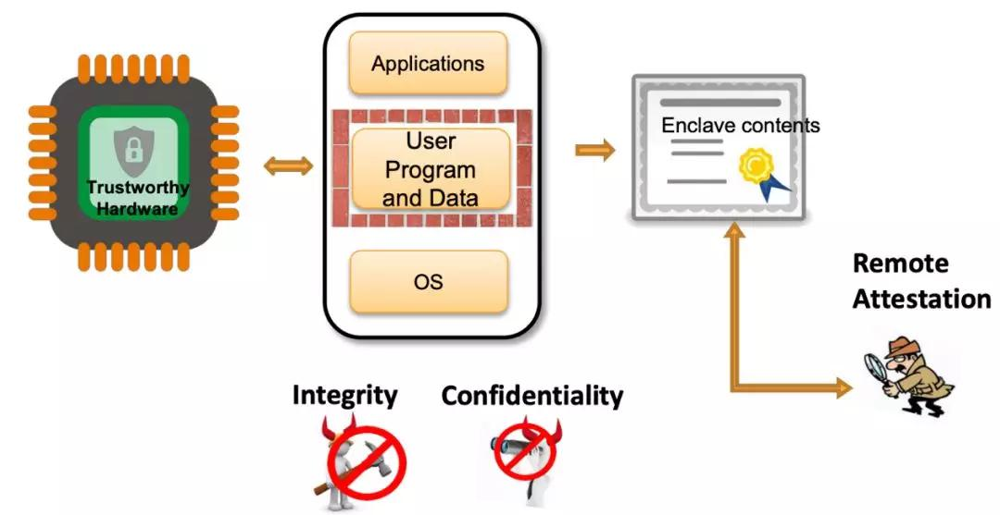
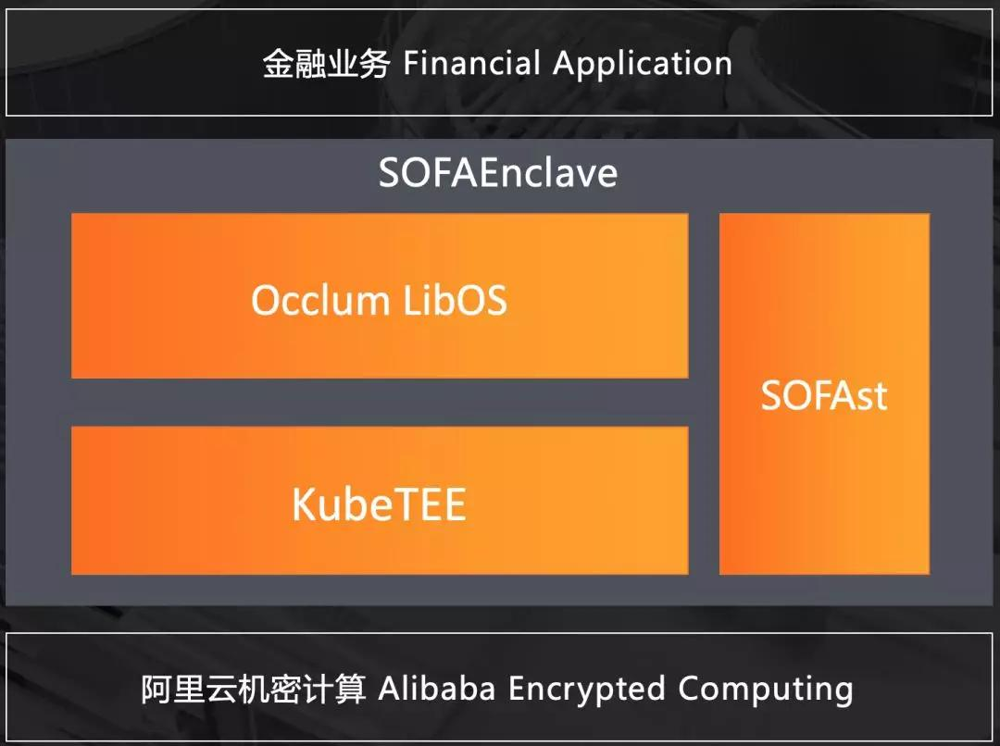
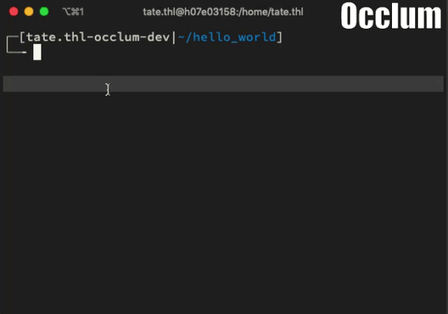
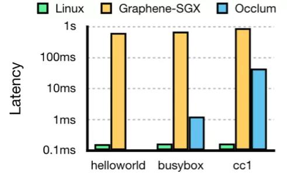
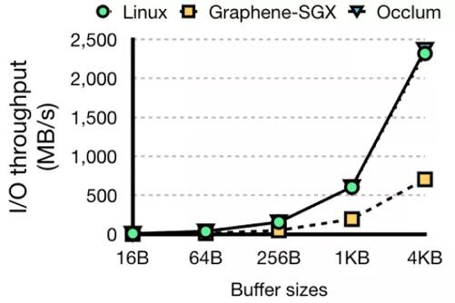
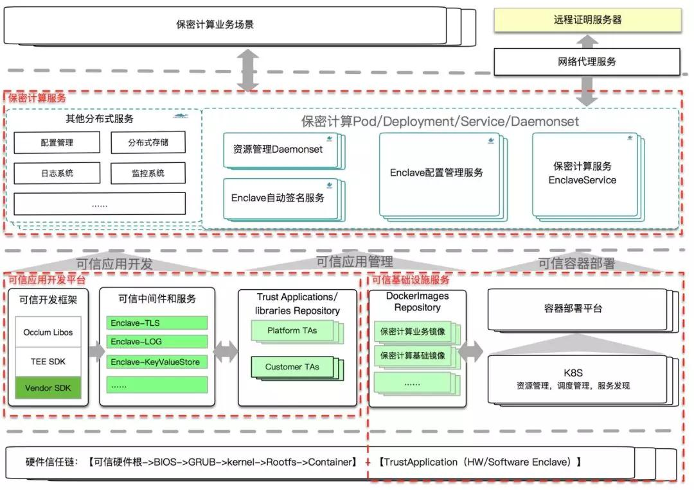
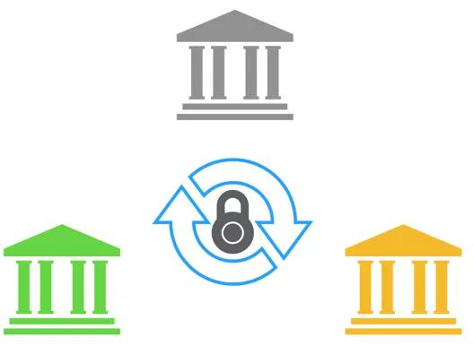
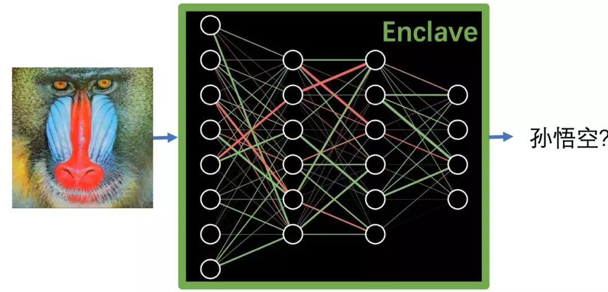

## 下一代HTTPS：蚂蚁金服推出新型可信中间件SOFAEnclave  

> 原创：  
> 闫守孟 等  
> 发布: AI前线  
> 发布日期: 2019-09-27  

 作者 | 闫守孟，肖俊贤，田洪亮  编辑 | 陈思  **AI 前线导读：** 近日，Linux 基金会宣布全球多家巨头企业成立机密计算联盟（Confidential Computing Consortium），在对于数据安全和隐私担忧的不断增长下，基于可信执行环境技术的机密计算作为一种可行的解决方案，成为互联网巨头关注的焦点。蚂蚁金服很早就关注此类技术，并基于机密计算打造了蚂蚁金服新一代可信编程中间件 SOFAEnclave，为金融业务保驾护航。

机密计算是蚂蚁安全计算的一环，也是金融级云原生的一块重要版图，蚂蚁金服表示：相信未来机密计算将和 HTTPS 一样，成为云计算的标配。

**更多优质内容请关注微信公众号“AI 前线”（ID：ai-front）** 1\. 引言

互联网金融本质上是对大量敏感数据的处理以及由此沉淀的关键业务智能。近年来涌现出来的新业态更是将数据处理的范畴从单方数据扩展到了涉及合作方的多方数据。

另一方面，从 GDPR 到 HIPAA，数据隐私监管保护的范围愈加扩大，力度日益增强。可见，对金融数据和关键业务智能的安全保护，不仅是互联网金融业务的基础，也是其创新发展的依托，更是攸关合规的关键因素。

近年来迅速发展的机密计算技术是一种创新的数据隔离和加密处理技术，其重要特点是，TCB\(trusted computing base 可信计算基\) 中仅包含应用自身和基础硬件，即使 OS kernel、Hypervisor、甚至 BIOS 等特权软件都已经遭到破坏甚至本来就是恶意的，敏感数据和代码依然能安全无虞。

蚂蚁金服在自身的实践过程中，基于机密计算底层技术发展出金融级的机密计算中间件，确保金融应用数据和代码的机密性和完整性，为关键业务提供易用、安全、集群化的计算环境。

本文从机密计算的技术背景、关键问题、蚂蚁的技术突破、以及典型应用场景等方面展开。

2\. 机密计算的技术背景

随着云计算的快速发展，越来越多的关键性服务和高价值数据被迁移到了云端。云安全也因此成为学术界和工业界关注的一个焦点。

近年来，云安全领域最重要的一项技术进展名为机密计算（Confidential Computing）。机密计算填补了当前云安全的一项空白——使用中数据（Data-in-use）的加密。过去通行的做法是对数据在存储中（比如硬盘）和传输中（比如网络）加密，而在使用中（比如内存）解密，以便处理。而机密计算可以保护使用中数据的机密性和完整性。

目前，多家云计算巨头都在不约而同地推广这项技术：微软已于 2017 年 7 月宣布开始接受 Azure 机密计算的早期试用申请；IBM 于 2017 年 12 月宣布 IBM 云数据保护（Cloud Data Guard）的预览版；谷歌也于 2018 年 5 月开源了名为 Asylo 的机密计算框架。

那么，机密计算究竟是如何实现的呢？

实际上，上述所有云计算巨头在实现机密计算时都离不开一种称为“可信执行环境（TEE）”的技术。

顾名思义，TEE 提供一种与不可信环境隔离的安全计算环境，正是这种隔离和可信验证机制使得机密计算成为可能。

TEE 一般是直接基于硬件实现的，比如 Intel SGX，AMD SEV，ARM TrustZone，以及 RISC-V Keystone 等；基于虚拟化技术也可以构造 TEE，比如微软的 VSM，Intel 的 Trusty for iKGT & ACRN，但尚不能匹敌硬件 TEE 的安全性。

其中，Intel 软件防护拓展（Software Guard Extensions，简称 SGX）是目前商用 CPU 中最为先进的 TEE 实现，它提供了一套新的指令集使得用户可以定义称为 Enclave 的安全内存区域。CPU 保证 Enclave 与外界隔离，从而保护其中的代码和数据的机密性、完整性和可验证性。不同于之前的 TEE 实现，比如 ARM TrustZone，SGX 每个 APP 都可以有自己独立的 TEE，甚至可以创建多个 TEE，而 TrustZone 是整个系统有一个 TEE；这里也省去了向设备厂商申请将 TA 装入 TEE 的过程。由于 SGX 的先进性，目前云端机密计算领域甚至已公认用 Enclave 这个词来指代 TEE。

图 1  典型 TEE 安全特性和使用流程 \[1\]

典型的 Enclave 达到的安全目标可以用 CIA 概括，即机密性（Confidentiality）、完整性（Integrity）和真实性（Authenticity）。在实现上具有以下基本要求：

1\) Enclave 内存保护

Enclave 内存只有 Enclave 本身的代码可以访问。CPU 通过内存隔离和加密来防止对安全内存的软件攻击和硬件嗅探。SGX 更通过内存控制器的 integrity tree 防止了对 Enclave 内存的物理篡改。

2\) Enclave 的可信验证

CPU 支持对 Enclave 中数据和代码的测量，以及对 Enclave 合法性的本地或远程验证。有了测量和验证，本地的 Enclave 之间、客户端与远程 Enclave 之间，就可以认证身份，进而建立安全的通信信道。

如何开发受 Enclave 保护的应用程序呢？

以 SGX 为例，其中一种方法是利用 Intel SGX SDK。如下图所示，基于 SGX SDK 的应用程序分为两部分：Enclave 外的不可信组件（左边黄色部分）和 Enclave 内的可信组件（右边绿色部分）。两边可以通过跨 Enclave 的函数调用通信：不可信组件可以通过 ECall 调用可信组件中定义的函数；反之，可信组件也可以通过 OCall 调用不可信组件中定义的函数。

图 2  Enclave 编程模型 \[2\]

3\. 机密计算面临的关键问题

Enclave 给我们带来了前文所谓 CIA 的安全保障，但是目前面临较大的易用性问题。主要体现在几个方面。

第一，需要将原有应用分割成两部分，一部分是 enclave 外的 untrusted 部分，一部分在 enclave 里面作为 trusted 部分；

第二，需要精心设计两部分之间的接口，规划好什么时候进入 Enclave，什么时候退出 Enclave——这存在一定技术门槛，而且比较繁琐容易出错；

第三，即使我们做了完美的分割， Enclave 里面的环境相对于我们熟悉的通常的 Linux 运行环境来说是非常受限的。例如，enclave 里面不能进行系统调用，libc、pthread 不完整，没有 openmp，多进程支持欠缺等等。

可见，把应用移植到 Enclave 里面是极具挑战的，在某些时候甚至是不可能做到的。而且，由于开发过程中必须考虑业务无关的繁杂琐细的方面，即使最终能完成应用开发移植目标，也会导致低下的开发效率，极高的开发成本，这对于快节奏的互联网业务来说是难以接受的。

机密计算走向工程实用面临的另一较大问题是，如何将机密计算从单节点向集群扩展。由于缺乏标准的做法，或者没有一个 best practice 作为参考，很多时候各个业务不得不各自从头造轮子，搭建跟业务逻辑过度耦合的 Enclave 集群基础设施。从而导致低下的开发效率和重复的资源投入。

另一方面，互联网业务日趋云原生化，越来越多地采用云原生的 container->k8s->serverless 技术栈，机密计算集群如何跟云原生技术栈相结合，目前仍然是较为棘手的问题。

4\. SOFAEnclave：蚂蚁金服的机密计算创新

蚂蚁金服作为中国互联网金融领导企业，对于数据保护有大量的需求，因此围绕机密计算进行了丰富的业务创新和技术探索。本节针对上面提到的机密计算面临的关键问题，主要介绍蚂蚁金服在这方面的创新性成果，即 SOFAEnclave 机密计算中间件。

SOFAEnclave 属于蚂蚁金服金融级分布式架构 SOFAStack 的一环，从 2007 年开始，SOFAStack 产生于蚂蚁金服内部需求，起初是为了解决高速发展下的业务问题。到 2019 年，已经历 12 年的业务锤炼，是一套成熟的金融级最佳实践。从 2018 年起，蚂蚁金服宣布将 SOFAStack 贡献给开源社区，目前已贡献出超过 10 个核心项目，受到社区广泛关注。

SOFAEnclave 主要关注底层基础设施的安全防护，为数据和代码打造一层可信中间件。我们的总体目标是通过易用性的提升，向业务屏蔽 Enclave 开发挑战和机密计算集群复杂性，使业务保持原有开发部署习惯。用一句话总结就是，使业务只需关注业务。

图 3  SOFAEnclave

SOFAEnclave 的核心包括三部分，Enclave 内核 Occlum，云原生机密计算集群 KubeTEE，以及安全测试和分析框架。这里主要介绍 Occlum 和 KubeTEE。

4.1 Occlum LibOS：安全高效的机密计算内核

针对 Enclave 易用性问题，我们设计了一个名为 Occlum 的 Enclave 内核，并将其作为一个开源项目采用社区模式开发。类比操作系统内核，Occlum LibOS 向 Enclave 内的可信应用提供完整的系统服务，应用不需要分割和修改即可得到 Enclave 保护。

Occlum 兼容 POSIX 编程接口，并支持多线程、OpenMP、和多进程；同时，Occlum 实现了多进程隔离机制，使得多个可信应用之间可以相互隔离。Occlum 使得开发者方便利用 Enclave 的 CIA 能力，达到可用不可见、可用不可攻的效果，使数据保护能真正得到落实。

目前，Occlum 可轻松支持大型人工智能框架，例如 XGBoost、TensorFlow 等，也可支持大型服务器应用例如 Shell, GCC，Web Server 等。Occlum 具有如下技术特点：

1\)    内存安全

内存安全问题是系统软件中最常见的安全隐患。竞态条件、缓冲区溢出、空指针、栈溢出、堆耗尽、释放后访问、或重复释放，这些术语都用于描述内存安全漏洞。微软 2019 年 2 月表示，在过去 12 年里，微软所有补丁中大约 70% 是针对内存安全漏洞的。因此，防范内存安全问题对系统软件的安全性和健壮性非常重要。

Occlum 是业界首个内存安全的 SGX LibOS。Occlum LibOS 是基于保证内存安全的 Rust 语言开发，只包含极少量的 Unsafe Rust、C 和汇编代码（小于 1000 行）。这使得 Occlum 难以出现最底层的内存安全相关的 bug 和漏洞。因此，相比使用 C/C++ 开发的传统 SGX LibOS（如 Graphene-SGX 和 SCONE），Occlum 更值得开发者信赖，作为开发高安全应用的基础。

2\)    简单易用

Occlum LibOS 使得 Linux 应用程序在只修改少量代码或者完全不修改代码的情况下运行于 Enclave 安全环境中。用户只需使用 Occlum 工具链（occlum-clang）编译应用程序，并使用名为 occlum 的命令行工具在 SGX enclave 中运行该应用程序。该命令行工具提供了诸多子命令，其中最重要的三个是：occlum init：初始化 Occlum 的上下文occlum build：制作 Occlum 的可信镜像和 enclaveocclum run <program\_name> <program\_args>：在 enclave 中运行 Occlum 可信镜像中的一个程序

Occlum 大大降低了为 Enclave 开发应用的开发成本。我们以一个最简单的 Hello World 为例说明。使用 Intel SGX SDK 开发的 SGX Hello World 工程包含 10 个左右的文件，300 行左右的代码；使用百度的 Rust SGX SDK 需要 200 行左右的代码；Google 的 Asylo 也需要 100 行左右的代码。相比之下，Occlum 不要求用户给 Linux 版本 Hello World（5 行代码）增加任何额外的代码，并且只需三行命令即可将 Linux 版的 Hello World 程序运行于 SGX enclave 中，效果如下：

图 4 3 行命令在 Enclave 里跑 5 行代码的 Hello World

3\)    高效多进程

任何应用程序在 LibOS 上都是作为进程运行的，而应用程序往往又由多个进程组成。因此，LibOS 对多进程的高效支持就显得至关重要了。然而，现有 SGX LibOS 对多进程的支持并不能令人满意。闭源的 SCONE 只支持多线程，尚不支持多进程。开源的 Graphene-SGX 是目前最成熟的 SGX LibOS，且能够支持多进程，但它的每个 LibOS 进程必须在一个单独的 SGX enclave 中运行，且每个 enclave 中必须运行一个独立的 LibOS 实例。这种 N 进程 -N enclave 的架构虽然保证了 LibOS 进程之间的强隔离，但也导致了性能和功能方面的问题：

进程启动慢：Graphene-SGX 要为每个 LibOS 进程创建一个单独的 enclave，而创建 enclave 的开销非常高，因此 Graphene-SGX 的 LibOS 进程启动极慢（比 Linux 启动进程慢接近 10,000 倍）。IPC 开销高：Graphene-SGX 的每个 LibOS 进程都被一个 enclave 同外界完全隔离，因此 LibOS 进程间通信必须借助于 enclave 外的不可信缓存，并传输加密数据。加密解密大大增加了进程间通信的开销。难保证一致性：Graphene-SGX 有 N 个进程就有 N 个 LibOS 实例，而原则上来讲，这 N 个 LibOS 实例应该向上层的应用程序提供一致的 OS 状态，比如加密文件系统。但显然在多个 LibOS 实例之间同步文件系统的状态（比如每个文件块的密钥）是困难的。这也是为什么 Graphene-SGX 至今都未提供加密文件系统。

与 Graphene-SGX 不同，Occlum 是一个单地址空间 LibOS，即在同一个 enclave 中运行多个 LibOS 进程。该架构特别适用于多进程协作的使用场景，即多个互信的进程组成同一个应用或服务。这个“多进程共享 enclave”的架构为 Occlum 的多进程支持带来了三个优势：

进程启动快：Occlum 的进程启动比 Graphene-SGX 快 13-6600 倍（图 4）；IPC 开销低：Occlum 的进程间通信带宽是 Graphene-SGX 的 3 倍（图 5）；加密文件系统：Occlum 支持对应用透明的、可写加密文件系统，保证文件系统的元数据与数据的机密性和完整性。

图 5  进程启动时延比较 程序大小分别为 14KB、400KB 和 14MB

图 6  进程间通信 \(pipe\) 带宽比较

4.2 KubeTEE：金融级云原生的机密计算集群

针对 Enclave 集群化方面的问题，我们思考如何能更高效和简洁的使用 TEE 资源提供机密计算服务，我们的解决方法是 KubeTEE——结合云原生，提供机密计算集群服务。

一方面避免了业务用户重复进行基础设施建设，另一方面用户注册账号即可使用机密计算集群服务，大大降低了机密计算门槛，提高了易用性和利用率。KubeTEE 为了更高效的使用物理资源，基于 k8s + container 更优雅地部署和管理机密计算镜像和 EPC 资源。基于 k8s 的容器调度能力，KubeTEE 可以快速实现机密计算服务资源的横向扩缩容。概括来说，我们希望以一种更加云原生的方式来使用 Enclave 和机密计算集群资源。

1）提供基于 Enclave Container 的业务部署能力，基础设施运维和业务无感知升级等能力

2）提供 Serverless 机密计算服务，基于通用的机密计算资源池支持业务服务

3）基于通用的机密计算组件、中间件服务和研发流程结合提供平台化的业务开发能力

图 7 KubeTEE 系统架构

上图中描述了我们实现 Serverless 机密计算集群的过程，我们一方面提供最终态的机密计算服务，同时将过程中积累的组件抽象化为可复用模块，应对不同业务的定制化需求，提升机密计算业务的 Enclave 开发效率。

5\. 典型应用场景

机密计算应用场景非常广泛，常见的应用有基于 Enclave 的版权保护、生物识别保护、基因数据处理、密钥保护、密钥管理系统、隐私保护的机器学习、加密数据分析、以及保密数据库等。其他如区块链隐私计算、区块链 +AI、隐私边缘计算等都可以构建在机密计算技术基础上，以更好的服务应用场景。这一节结合互联网业务探讨两个略微复杂的应用场景。

基于 Enclave 的多方竞合学习

众所周知，人工智能能发展到今天，有两个原因：一个是算力的提高，另一个就是数据规模的增长。但是，单一机构的业务领域和业务受众是有限的，因此其数据积累一方面是不全面的，另一方面也是难以形成规模的。

为了发挥数据的更大价值，一个自然的想法就是汇聚多方数据进行集中挖掘。但是，机构之间出于业务保密以及行业竞争的顾虑，又不可能把自己的数据无保留分享给别人。

这导致了一种看似不可思议的矛盾局面：多个机构既竞争又合作，既数据共享又数据保密（图 6）——我们将其称为多方竞合学习。

怎么解决这种矛盾呢？一种方案是，把各自加密的数据导入 Enclave，在 Enclave 内解密、汇聚、并挖掘。具体实现细节可以参考蚂蚁金服共享智能团队的文章。

图 8 多方竞合学习

AI 模型安全保护

对外部署的 AI 模型携带大量知识产权，一旦被逆向或泄露，既会对技术护城河造成破坏，也会降低对抗性样本攻击的难度，导致安全问题。

应对这种威胁的一种方案是，使用方把 AI 模型和训练 / 预测数据加密存储，只有在使用时才将其输入 Enclave，在 Enclave 里面解密，由 Enclave 中运行的 AI 框架处理，结果根据具体场景需求以明文返回或加密返回并在使用方本地解密。这要求 Enclave 能支持常见的 AI 框架，而要做到这一点极为挑战——一方面是因为这些 AI 框架一般使用了复杂的多线程、OpenMP 等性能优化的运行环境，另一方面是因为 Enclave 又偏偏难以提供这些支撑环境。这就是为什么市面上很多 Enclave 支撑系统难以支持（或难以高效支持）AI 框架的原因。

如前所述，Occlum LibOS 在这方面取得了一定的进展，可以较为轻松的高效运行常见 AI 框架。

图 9 AI 模型安全保护

6\. 总结与展望

机密计算方兴未艾，学术界的研究如火如荼，工业界的应用也日益丰富和实际。蚂蚁金服在机密计算领域是技术的探索者和业务的先行者，我们仍有诸多问题需要整个生态的合作。

我们正在逐步将 SOFAEnclave 里的模块贡献给开源社区，欢迎行业和学术同仁联系合作。希望合作伙伴向 Occlum 项目提出反馈并贡献代码，一起利用 Occlum LibOS 来支持更多实际应用，实现 Enclave 保护的安全容器 Enclave Container。在 KubeTEE 方面，希望能与合作伙伴共建生态，维护可信应用和镜像仓库，推进机密计算集群方案的实用化标准化。

注：

\[1\] 图片来源：

https://keystone-enclave.org/files/keystone-risc-v-summit.pdf

\[2\] 图片来源：

[https://mp.weixin.qq.com/s/ZUscn47mxD3WqIJbN9mNAA](https://mp.weixin.qq.com/s?__biz=MjM5MTE0Mjg2Mw==&mid=2651860109&idx=1&sn=3dbd2a0198c404ecfc9a5c7c3c808e28&scene=21#wechat_redirect)

活动推荐

AICon 全球人工智能与机器学习技术大会将于 11 月在北京举行，这里不仅有硅谷、BAT、独角兽们的 AI 技术案例解析，还有颜水成、贾扬清、崔宝秋等大咖现场经验分享。部分议题抢先看：

微软小冰：人格化对话机器人的构建及在语音场景当中的实践

阿里巴巴：智能家装设计中的 3D 算法应用实践

蚂蚁金服：AI 赋能普惠金融的探索与实践

腾讯：腾讯云知识图谱技术与应用实践之路

美团：刻画物理世界的 AI 技术和应用

滴滴：滴滴搜索系统的深度学习演进之路

360：360 金融的 AI 实践之旅

##### 今日荐文

点击下方图片即可阅读

[

飞天AI平台重磅发布！阿里拥抱AI这五年

* * *

**你也「在看」吗？** ****👇
