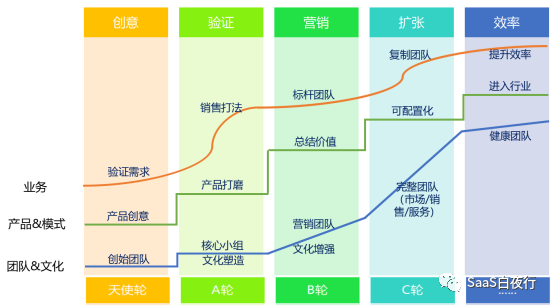
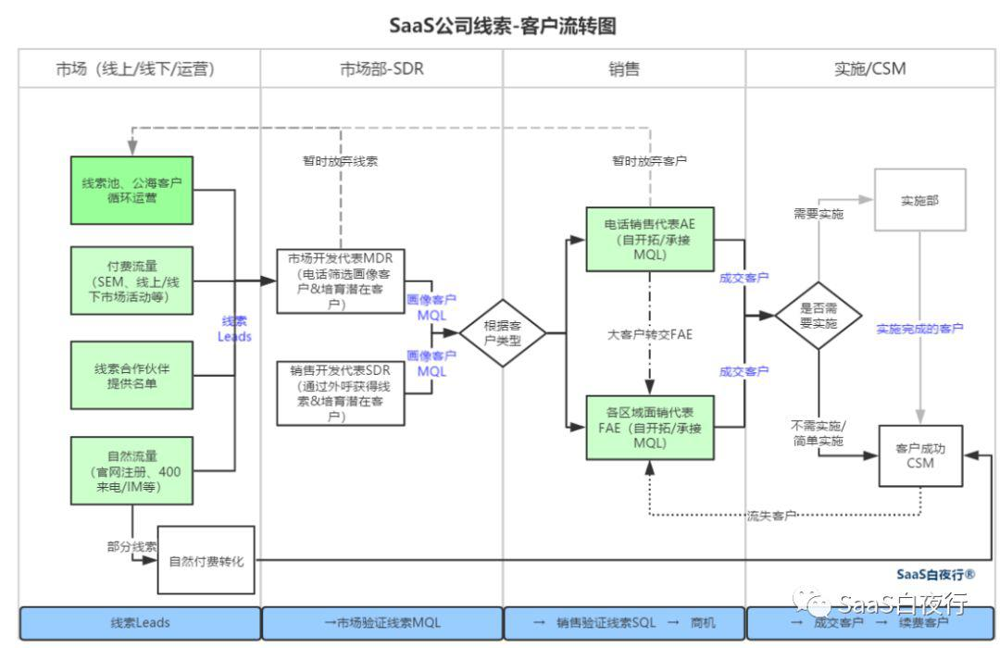
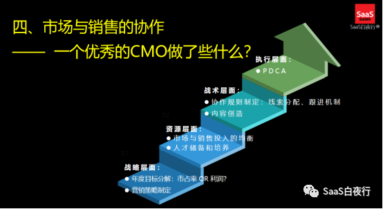
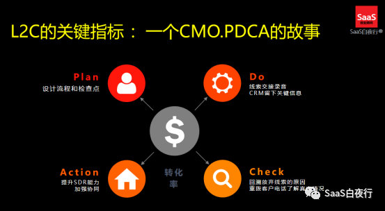

## 线索客户流转及SDR管理 | SaaS创业路线图（62）  

> 发布: 吴昊@SaaS  
> 发布日期: 2019-09-16  

**作者介绍** **-** 吴昊，SaaS战略及营销顾问，系列文章作者，纷享销客天使投资人、前执行总裁。目前在撰写一本关于SaaS创业的书籍。

（SaaS创业路线图）

SDR（Sales Development Rep.，销售开发代表）在国内SaaS圈还是近2年出现的概念。

上个月我和SaaS圈10个公司的CMO、市场总监及SDR负责人聚在一起，花5个小时探讨了关于SDR的方方面面。

我今天这篇就来总结一下：SDR的职责、该放在哪个部门、SDR管理的关键指标及KPI、SDR员工的能力模型及SDR个人职业发展通道。此外，我们也可以一起探讨一下SaaS企业线索/客户的流转过程。

### 一、 **SDR的职责**

国内的SaaS公司里，SDR一般有两类职责：

A. 通过电话清洗市场线索，并分类分级；

B. 主动外呼打陌生客户，产生有效线索。

输出的这些MQL（Marketing-Qualified Leads，市场验证线索），会分配给销售代表（AE电销/FAE区域面销）转化成交。

其实，按美国SaaS的用语，承担A类职责的是MDR（Marketing Development Rep.，市场开发代表），承担B类职责的才是SDR。但我调查了一圈市场部的CMO，他们的SDR确实是把两项工作混合在一起的，所以我们就统一称“SDR”吧。

SDR小组输出的“有效线索”（MQL）是有一些要求的，例如：需要有公司名称、有需求等。业内CMO爱用BANT的标准：

\* Budget 预算

\* Authority 权限

\* Need需求

\* Time预计上线时间

以上内容能够满足2项，就可以达到成为MQL的要求。

### 二、 **线索-客户流程**

周末我在家慢慢地画了一个SaaS企业从线索到客户（Leads to Cash）的流转图出来。L2C的话题大家讲过很多，但我还没有看到谁画这个跨部门的流转图，这里分享给大家。

一图胜千言。这张图包含内容很多，每个公司具体使用也根据自身情况做调整。

**1、一个线索到客户的过程：** 见图中蓝色部分，

**线索Leads——市场验证的线索MQL——销售验证的线索SQL——商机（一般toB公司商机要分5~7个阶段）——成交客户——续费客户（进入稳定期）。**

每家企业都需要定义自己这些概念：什么样的线索才可以叫做MQL？哪个阶段的线索叫SQL（Sales-Qualified Leads）？成为商机的标准是什么？成为商机是否需要审批？

只有统一了定义，日常管理中才会减少误会。

**2、客户来源途径** ：见图中绿色部分是：

\* 市场的自然流量、市场部的付费流量；

\* 市场BD合作线索；

\* 电销或区域面销（外出拜访的销售团队）也有自开拓获客的方式：客户转介绍、陌生电话、陌拜、混圈子等。

3、 **暂时放弃的线索或客户：** 虚线部分是一个“回流”分支，

**SDR或销售代表暂时放弃的线索或客户，应该由市场部继续用自动化的方式培育。** 营销自动化的方式包括：邮件、短信、DM（直邮印刷品）、公众号、服务号推送，线上线下课程及活动等。

4、 **流失客户：**

顺便说一下，CSM（客户成功经理）不能成功续费的“流失客户”，同样应该“回流”处理，可以交由销售代表作为新单重新跟进。我建议这个交接点是续费逾期后30天。

### 三、 **SDR应该放在哪个部门？**

这里有一个很有争议的话题，我单独拎出来讲，就是SDR应该放在销售部还是市场部？

**首先，我们要明确一下：SDR ≠ 电销 。**

这是完全不同的两个部门。SDR的职责是输出有效线索。电销的任务是电话成交。

很多公司让电销做SDR的事情 —— 电销先清洗一遍市场线索，客单价低的（一般少于2~4万）自己电话成交，客单价高的交给面销团队跟进。 **这是极其错误的！**

大家设计制度不要想着和人性做斗争。当电销面临一个5万的单子时，是转给面销，还是自己设法做成一笔4万的单子？ **不要认为自己公司风气正就能克服这些问题，正是这些错误的机制最终造成团队文化出问题。**

**其次，是否需要成立SDR也与客单价有关。** 如果线索量不大、客单价只有几千元~2万元的范围，那就直接让电销团队打裸线索（Leads）即可，不一定要成立SDR团队了。

如果客单价不高、但线索量很大，电销超过20~30人，为了加强管理，可以考虑成立SDR。SDR的价值是线索分级后，销售团队负担MQL到成交转化率的责任就更清晰。否则，由于线索质量波动大，转化率也无法管理。

**第三，我建议SDR放在市场部。**

看起来，SDR是市场部与销售部中间的一个环节，好像放在哪边都可以。但我们有三个原因需要把SDR组放在市场部：

1、如果公司要管理MQL到成交的转化率，那么输出MQL的部门最好与做转化的部门分开。在这件事情上，销售部门不能既当运动员又当裁判员。

2、市场部的工作需要闭环。搞了个线下活动，转出了多少有效线索？加大了搜狗SEM投入，对应有效线索量如何？这些都需要尽快闭环，没有效果反馈的市场部就好像在盲人摸象，就无法通过快速迭代提高效率。

实际运作中，销售部门的KPI是业绩，反馈线索转化情况只是“附加工作”，如果SDR放到销售部门，这些数据的反馈就隔了一堵部门墙，反馈速度、质量大大降低。

3、市场部通常的KPI是有效线索，如果SDR放在市场部，两者将具有共同的目标，这就从根本制度上确保了SDR不会漏掉所有潜在的有效线索。

我在有的公司看到，SEO/SEM的负责人直接管理SDR团队，这样很特别，但效果很好。因为反馈足够快，SEM花那么多钱，自己也会盯紧后面每个流程，希望做到更好的ROI（投入产出比）。

在这次闭门会上，我调查了一下，10个SaaS公司，能拿到Leads to Cash（线索到回款）全程过程转化数据的，只有不到一半。据我和致趣百川的CEO何润交流，我们认为整个SaaS圈里这个比例不到20%。这也说明国内SaaS公司的线索管理水平还在初级阶段。

所以，在市场部内部形成闭环就更重要了。

### 四、 **SDR的工作方法和KPI**

SDR的工作方法是通过打电话从市场线索中筛出符合条件的有效线索。

1、筛出的线索需要打上一些标签以及做备注。这是个分类分级的过程。只有对线索进行分类（有效/无效、线索来源、客户行业、客户需求类型等）、分级\(客户规模、需求紧急程度等\)，后续销售转化的效率才能考量和提升。

2、他们的通话过程需要录音。录音有2个作用：

\* SDR主管抽查，检查SDR对线索分类分级的准确度。

\* 销售代表拿到分来的线索后，需要通过听录音了解之前沟通情况，避免重复问题引起客户不满。

3、销售代表给线索客户打电话，也同样应该录音。这里有三个原因：

①调查MQL到SQL的转化率；

②SDR也需要偶尔听销售的录音，以了解自己判定的MQL的后续跟进情况。SDR和销售间的关系，应该不仅仅是SDR单向地输送MQL给销售，销售也应该及时准确的提交线索反馈，双方达成正向、良性的互动关系。

③SDR可以通过听销售优秀录音学习话术，达到快速培训上岗的目的。

4、 **SDR的KPI设置**

调查的几家较大的SaaS中，市场部SDR的薪酬结构是：底薪+绩效奖金+线索成交后的提成。

①其中，绩效奖金取决于三个指标：电话量和时长+有效线索数量（MQL）+SQL数量（也有公司对SQL的要求进一步增加到转化出的拜访量）。

②设计线索成交后的提成机制：为了引导SDR在转出有效线索后，仍然有动力持续跟进自己的线索转化情况。

从行动上看，这样设计带来的好处有两个：

a.SDR对于有效线索的判断更精准，有利于提高MQL-SQL阶段的转化率；

b.因为SDR是客户最先接触的人，所以后续跟进过程中，如果客户和销售代表发生了任何的不愉快，SDR能够从中调停。

### 五、 **SDR的人才画像及职业发展通道**

以电话筛选市场线索为主的SDR，需要有以下能力：

\* **电话沟通能力** ：吐字清晰

\* **理解能力** ：能听懂客户的初步需求

\* **产品价值陈述能力** ：能理解和讲清楚产品价值

\* **稳定** ：能按流程操作，逐步引导客户

\* **耐心** ：对客户的问题耐心回答

所以看起来，这类SDR并不要求有销售能力，由销售转岗也并不合适。销售代表的能力模型中相对更有进攻型一些，但也缺乏耐心。相反，这是一个更偏客服性质的岗位。

如果是需要自己打陌生电话开拓线索的SDR，则更偏销售性质。这类SDR岗位的能力模型与“电话销售岗”的能力模型更类似。

那么SDR的职业发展通道有哪些呢？这里列了一下：

\* 晋升为SDR团队负责人；

\* 转岗为客户成功经理（CSM）（一般针对比较轻的产品）

\* 转岗电话销售代表（AE）。

### 六、 **SDR工作的关键 —— 部门协作**

SDR的上游是市场线索输出小组：SEO/SEM组、PR及内容小组、品牌组、线下活动组等等，双方的协作在一个部门内，而且上游这些部门大多也要考核“有效线索”，所以大家的配合一般都比较顺畅。

SDR的下游是销售部门。对SDR及市场部来说，销售部门能否准确、及时反馈线索转化情况，这对提高市场工作的效率极其关键。

其中，“线索分配规则”虽然是销售部门的工作，但市场部负责人应该与销售部一起协作制定一个既有利于提高线索转化率、又有利于销售团队成长的规则。关于如何利用线索分配规则培养销售代表自开拓能力，我另外再写文章讲解。

正好上周我到致趣百川录了个直播视频，主题就是这里要说的“市场部与销售部的协作”。直播是11日开始，我先剧透一下。

①优秀的CMO要做好4个层面的工作：

②在执行层面，尤其要与销售部门协同做好“有效线索”的闭环。

从更高层面讲，SDR的工作有以下几个重大意义：

1、 **建立起L2C的数字化跟进能力后，我们才能真正衡量每个线索通道的ROI。**

我知道有不少SaaS公司有这样的情况：客户来源主要来源是SEM，但对SEM投放的限制又很严格。我问为什么，回答是年初有预算限制。这就明显是ROI算不清楚，影响正确决策了。

**2、从提升组织能力的角度说，SDR对线索分类分级后，能够更好地衡量销售部门后续转化效率还有多大可提升空间。**

这篇SDR就聊到这里， **欢迎大家留言交流。如果觉得有价值，欢迎转发！**

参加这次SDR闭门讨论会的有：卡爷、rainful@DataPipeline、日事清白超然、耀东老师、鹏辉、陈雷ray@雪枭医美saas、张国惠@worktile、TonyGu@一知智能、Nono、董小姐@玉符科技、LY鲁扬@销售易、李堃、叶超、郑诗浩，大家对本文有重要贡献，特此感谢！

最后，SDR是个新物种，欢迎大家投票了解其他SaaS公司的情况：

**参考文章：**

[ **SaaS创业路线图（二）**](https://36kr.com/p/5137220) **
**

[ **SaaS创业路线图（十二）市场、销售、售后（CSM）各部门的配合关系如何设计？**](https://36kr.com/p/5148187) **
**

[ **SaaS创业路线图（38）拜访杭州SaaS圈的一些共识**](https://36kr.com/p/5184217) **
**
