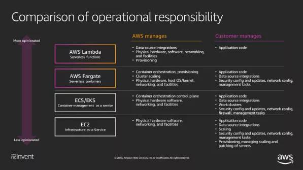

## 亚马逊 CTO 的“中台论”  

> 高效开发运维  
> 发布: InfoQ  
> 发布日期: 2019-09-16  

作者丨Werner Vogels

译者丨核子可乐

策划丨Tina

作者 Werner Vogels 是 Amazon.com 的 CTO，他撰写了一篇文章，总结 AWS 这二十多年来，如何通过变革应用程序架构、调整企业组织架构等方式，让构建现代应用程序的客户“将更多时间花在定义业务逻辑上，扩展系统以轻松满足高峰期客户需求，提高敏捷性，同时更快、更频繁地向市场发布新功能”。在文中他提到亚马逊“庞大的整体式‘书店’应用程序以及臃肿的数据库极大限制了我们的速度与敏捷性。每当我们打算为客户提供新的功能或者产品，我们就必须在专为书店设计的应用程序当中编辑甚至重写大量代码”，将组织架构调整为小团队并“赋予他们对应用程序内特定部分的更多操作权限”，通过改变对技术的运用方式，业务交付速度提升非常明显，比如某汽车领域客户将将新功能的推出时间由六个月缩短至一周。这篇文章体现的，对比我们现在倡导的“中台论”，很多地方都不谋而合了。也可谓是亚马逊的“中台论”，虽然他们并没有使用这个词。

创新一直是亚马逊公司 DNA 中的重要组成部分，但大约 20 年之前，我们迎来了一场彻底的转型。当时的目标，是让我们的迭代过程——发明、启动、重新发明、重新启动、淘汰陈旧事物、再次重复——在速度上进一步提升。而我们做出的变革，则深深影响到我们构建应用程序甚至组织企业结构的具体方式。

那个时候，亚马逊所服务的客户数量远不及当下。尽管如此，我们很清楚如果想要对自身提供的产品与服务加以扩展，首先必须改变我们的应用程序架构。

庞大的整体式“书店”应用程序以及臃肿的数据库虽然为 Amazon.com 提供了充沛的动力，但同时也极大限制了我们的速度与敏捷性。每当我们打算为客户提供新的功能或者产品——例如视频流——时，我们就必须在专为书店设计的应用程序当中编辑甚至重写大量代码。这是一个漫长而且繁琐的过程，需要复杂的协调努力，而且极大限制着我们快速推进大规模创新的能力。

为了从根本上解决这一难题，我们通过《分布式计算宣言》建立起新的变革蓝图。这是一份描述新架构的内部文档。通过这份宣言，我们开始将自身应用程序通过众多被称为“服务”的小型基本单元加以重组，从而大幅提升对亚马逊整体业务的扩展能力。

但是，变革应用程序架构只是故事的前一半。至于后一半……当时是 1998 年，亚马逊内部的各个开发团队都在使用相同的应用程序，因此每位员工都必须针对其当前版本进行跨团队协调。

为了支持这种新型架构，我们分解了功能层级结构，并将企业组织重新编排为小型自治团队——小到每次点餐只需要两份披萨。我们将这些“双披萨团队”委派到不同的特定产品、服务或者功能集上，赋予他们对应用程序内特定部分的更多操作权限。这使得我们的开发人员成为产品所有者，并能够根据自己的决策迅速对个别产品产生影响。

拆分我们的组织与应用程序结构无疑是个大胆的想法，但同时也是个行之有效的好主意。我们得以更快地为客户提供创新成果，而且随着亚马逊的快速发展，我们已经从每年部署数十项功能发展为如今部署数百万项。更令人始料未及的是，我们在构建这种高度可扩展基础设施方面获得的成功，最终促成了另一大核心竞争力的发展与壮大——这就是 2006 年诞生的 AWS。

而我们，如今仍在坚持双披萨团队这一基本建制。

当然，我们绝不是唯一一家强调创新的公司。为了保持竞争力，亚马逊必须不断提高敏捷性，从而持续发现新的机遇并创造出更好的产品。也正因为如此，才会有越来越多的客户踏上与亚马逊当年相同的旅程，并转向现代应用程序开发。这种新方法需要从整体式架构迁移至更小的基本单元——或者说“微服务”，而且除此之外，现代应用程序的最佳实践还要求在改变设计与构建技术之余，重新考虑其管理方式。

为了成功提升应用程序开发当中的敏捷性与创新速度，组织必须根据适合自身的顺序采用以下五大元素：微服务、专用数据库、自动软件发布流水线、无服务器运营模式以及持续自动化安全保障。

1 架构模式：微服务

像亚马逊这样的大多数企业最初都是以整体式应用程序作为业务基础，因为这是一类开发速度最快、难度最低的系统。但是，这种将各个进程紧密组合并作为单一整体服务的作法，往往会带来一系列严重问题。如果应用程序中的某个进程遭遇需求高峰，我们只能扩展整体架构才能实现单个进程的扩容。

另外，随着代码库规模的增长，功能的添加与改进也开始变得非常复杂，这让企业很难试验以及实现新的想法。整体式架构还增加了应用程序的可用性风险，因为大量相互依赖且紧密耦合的进程会增加单一进程因故障受到的影响。

这就是微服务架构随企业发展而出现的原因所在。利用微服务架构，应用程序将由众多独立组件构成，这些组件将各个应用程序的进程以单一服务形式运行。服务将专为业务功能而构建，例如在线购物车，而且每项服务只负责自己的一项功能。这些进程独立运行并由对应的一支开发团队负责管理，因此我们可以对各服务进行独立更新、部署与扩展，最终满足对应用程序特定功能的需求。举例来说，当出现用户购买峰值时，我们可以单纯扩容购物车服务以强化承载能力。

随着组织由整体式架构逐步转向微服务架构，很多开发人员也希望通过流水线管理各项服务中的依赖关系——这就要求我们创造出新的方法以实现应用程序打包与代码运行。好消息是，凭借着强大的创新成果储备，如今实例已经不再是我们的唯一计算选项。

大家也可以使用容器或者 AWS Lambda 函数。容器是目前最受欢迎的代码打包选项，同时也是实现遗留应用程序现代化的最佳工具之一。容器技术，为我们带来出色的应用程序可移植性与设置灵活性。而利用 Lambda，大家则能够更轻松地获取所需功能——利用代码编写出业务逻辑即可。

微服务架构的另一大需求，在于我们必须为之建立一种服务间的相互通信方式。目前大部分应用程序都继续沿用 API 连接，但也有一些选择在不同服务之间发送数据。具体包括用于实时数据处理的流、用于根据数据变化触发响应的事件，以及用于应用级通信及可见性的服务网格等等。大家可以根据自身需求选择最适合自己应用程序的集成方法。

2 数据管理：专用数据库

现代应用程序采用解耦式数据存储机制，其中微服务与数据库一一映射，意味着我们不再需要维持一套庞大的整体数据库。这也是对传统应用程序的一大重要革新，旨在解决整体式应用程序随规模增长而遭遇的扩展性与容错性难题。此外，单一数据库同时也代表着单点故障源，而且很难满足一组不同微服务提出的特定需求。通过将数据与微服务剥离，我们可以自由选择最适合自身需求的不同数据库类型。

对于大部分应用程序，最佳选项仍然是关系数据库；但也有其它一些应用程序有着不同的数据需求。例如，如果我们运行的是使用高度连接型数据集的应用程序（例如推荐引擎），则可以选择具备存储与导航关系的图数据库，例如 Amazon Neptune。

或者，如果您的应用程序需要实时访问数据，也可以选择 Amazon ElastiCache 等内存内数据库，其常用于游戏以及物联网应用场景。一般来说，能够充分满足您微服务需求的数据库，就是最理想的数据库选项。

3 软件交付：自动发布流水线

我们当初告别整体式架构并重组为双披萨团队时，自动发布流水线也就应运而生。这是为了摆脱原本的单一版本发布通道，允许各个团队独立交付自己的开发成果。

虽然这种新方式消除了更新的开发与交付等协调性挑战，但同时也给我们带来了不少新的难题。首先，维持全部团队的发布流程与质量一致性变得非常困难。特别是考虑到发布流程中的每个步骤都在以手动方式完成，这无疑会大大增加产生人为错误的可能性。

我们的解决方案采取双管齐下的方式：标准化加上自动化。首先，我们将软件交付流程定义成最佳实践模板，旨在为云环境下的一切基础设施资源的建模与配置提供标准。这些“基础设施即代码”模板能够帮助我们的团队从正确之处起步，由模板通过代码为应用程序提供整体技术堆栈，而不再依赖于手动过程。在亚马逊，这种作法确保了各个团队都能够根据我们的要求实现对流程与部署的配置。

第二点，我们开始利用自动化技术将手动流程从软件交付流水线中剔除出去。在自动化发布流水线的帮助下（包括持续集成与持续部署，简称 CI/CD），我们得以快速测试并发布大量代码，同时最大限度减少错误机率。通过 CI，我们的团队会定期将代码变更整合至同一套中央库内。而后，我们会对其运行自动构建与测试，以确保能够尽早发现问题。而利用 CD，我们的团队每天可以多次提交变更，且无需任何人为干预即可将成果投入生产。

起初，我们发现去掉人为干预只会带来相当糟糕的部署后果。但是，我们投入了大量时间编写正确的测试与故障解决方案，并最终发现新体系大大提高了我们的速度与敏捷性，同时也显著增强了代码质量。

4 运营模式：尽可能采用无服务器模式

现代应用程序当中包含大量活动部件。如今的现代应用程序往往由数千项服务组成，这远远超出了以往单一应用程序与数据库的范畴，而且每一项服务背后都对应着一套专用数据库外加一支负责不断发布新功能的团队。

这些活动部件可以分为以下两类：

* 作为企业“独门绝技”的活动组件，负责保障业务成功，例如能够创造独特用户体验与开发创新产品的部分。

* 通常被我们称为“无差别承载性”活动组件，这些活动必须完成，但本身无法提供任何竞争优势。对于大多数企业来讲，此类任务包括服务器管理、负载均衡以及安全补丁应用等等。

我们在 2014 年提出了“无服务器”概念，并同时发布了 AWS Lambda。AWS Lambda 是一种计算服务，能够帮助大家在无需配置或者管理服务器的前提下运行代码。这种能力支撑起我们的总体目标，即通过将无差别任务交给 AWS 负责以帮助客户专注于优化自己的“独门绝技”。事实上，这一切已经成为现代应用程序开发中的关键性元素。无服务器模式使大家解放精力，将更多时间投入到真正让您的业务与众不同的方面——例如产品创新。

当我们说起“无服务器”时，我们指的是在无需分神于基础设施配置或者扩展的情况下运行的服务，其具有内置的可用性与安全性保障，且采用按使用量计费的方式。无服务器不只有 Lambda，它是一套完整的应用程序堆栈。

应用程序堆栈通常由以下三大要素组成：

* 像 AWS Fargate 这样的计算服务，用于运行应用程序逻辑

* 像 MySQL 以及 PostgreSQL 关系数据库这样的数据存储方案，也可以使用 Amazon Aurora 等实现数据的持久驻留

* 类似于事件总线 Amazon EventBridge 这样的集成层，用于实现数据移动

这些无服务器构建单元使企业能够打造出充分发挥无服务器模式优势的应用程序。

在亚马逊，我们自己也还没有完全实现无服务器化，但我们正在朝着这个方向努力。实际上，我们认为很快就会出现一整代只负责编写业务逻辑、而从未接触过服务器的开发人员。这里的原因很简单，无论您是在构建全新应用程序还是迁移旧有应用程序版本，使用无服务器原语进行计算、数据处理以及集成，都能确保大家从云环境提供的敏捷性优势中获取最佳收益。

5 安全性：每个人都有责任

过去，很多企业都把安全视为一种神奇的“调味料”——在应用程序准备好发布之后，再匆匆撒上一把。但这种方式在持续发布周期中显然会水土不服，因此组织必须采取新的安全方法，围绕整个应用程序构建起防火墙。但这同样带来新的挑战：以往我们只需要为整体式应用程序建立一种安全设置；但面对微服务架构中成千上万的独立进程，以往的安全思路根本解决不了问题。

有鉴于此，在现代应用程序当中，我们将安全功能内置于应用程序的各个组件之内，并随着每个版本进行自动测试与部署。这意味着安全性不再是安全团队自己的责任——相反，安全深深融入到开发生命周期的每个阶段，而工程、运营以及合规团队都将在其中发挥自己的作用。

安全性将被整合至代码库、build 管理程序乃至部署工具当中。这既适用于发布流水线本身，也同样适用于通过该流水线发布的软件。而且在使用无服务器服务的情况下，安全状态的维护难度更低，这是因为底层基础设施的安全运营工作——包括系统版本更新、软件修复与监控等——都以内置形式存在于各项服务当中。

6 现代化之旅

那么，众多客户是如何实施这些变更，从而推动应用程序现代化的？必须承认，其中不存在统一的路径，但却有着不少常见的模式，也包括我们在亚马逊采取的方法。

当我们决定专注于创新并大幅扩展 Amazon.com 时，我们重构了整体式应用程序，对组织结构进行重新编排，而后利用自动化与抽象化两大手段推动云资源优化。Yelp 等客户也采取了类似的现代化转型方式。

对于以内部托管应用程序作为起点的客户，最常见的方法自然是重新托管，即“将应用程序直接迁移至云端”。在此之后，很多客户开始进一步探索云环境中的托管服务，尝试将数据库与 API 管理等任务迁移至 AWS，从而保证将自己的工作重心放在业务逻辑身上。

如今，越来越多的客户踏上了重新发明的道路，将新的应用程序构建为无服务器微服务形式，旨在充分发挥云服务优势。现代化没有统一的正确方法，因为在 AWS 平台上，各种各样的应用程序都能够以不同的状态共存，并通过任意路径实现成功交互。

**但我们也在其中看到了重要的共通点，即构建现代应用程序的客户能够审视自身整体业务优势，特别是对时间与资源的优化分配。** **他们将更多时间花在定义业务逻辑上，扩展系统以轻松满足高峰期客户需求，提高敏捷性，同时更快、更频繁地向市场发布新功能。**

以向汽车买家提供最新车辆信息的 Edmunds.com 网站为例，他们将新功能的推出时间由六个月缩短至一周。初创企业 Bynder 公司也将产品上市周期由原本的一年减少至一个月。通过改变对技术的运用方式，企业能够显著改善自己的业务交付途径以及相关体验。

而这，正是现代应用程序的力量所在。

原文链接：

https://www.allthingsdistributed.com/2019/08/modern-applications-at-aws.html

* * *

**点个在看少个 bug** 👇
