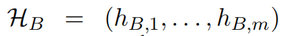
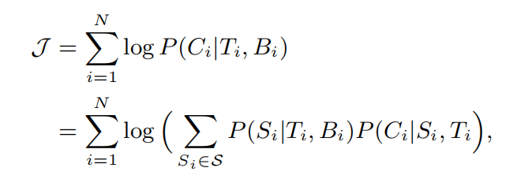
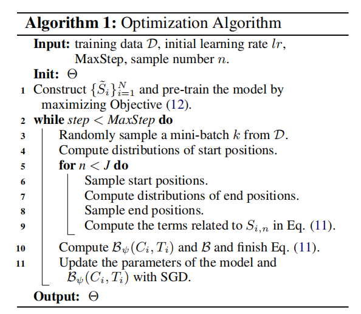

## AI自动生成新闻评论：微软联合北航提出全新深层模型DeepCom-InfoQ  

> 作者: Maglish  

> 本文将为大家解读由微软北京研究院和北航大学最新提出的工作，研究人员基于人类对新闻进行评论时的“阅读 - 关注 - 评论”行为，提出了自动生成新闻评论的深层架构 DeepCom。自动生成新闻评论在实际中已有应用，但是尚未在研究领域引起足够的重视。DeepCom 结构包含一个阅读网络和一个生成网络。首先由阅读网络对新闻文章进行理解，并提炼出一些重要的观点，然后生成网络通过关注提取的信息点和新闻标题来生成评论。在两个公共数据集上的实验结果表明，该模型在自动评价标准和主观评分两方面都明显优于现有方法。本文是 AI 前线第 95 篇论文导读。

### 1 介绍

网络新闻评论可以让用户在新闻文章下表达自己的观点，展示自己的态度，并相互交流。新闻网站设置评论功能，是希望通过鼓励用户浏览评论、共享信息，并相互讨论，以扩展新闻的内容并且提高新闻网站的用户参与度。随着网络新闻评论越来越流行，构建自动的新闻评论生成系统成为了研究热点。这种系统可以从冷启动开始为新闻网站提供评论服务，增强评论较少的新闻的阅读体验，并丰富其他人工智能应用（如聊天机器人）的技能列表

本文研究的是新闻评论自动生成问题，目前该领域研究较少。现有的工作做了一些初步的研究，或是从一篇新闻文章的标题中生成评论，或是通过将整篇新闻（标题加正文）输入一个带有注意力机制的 Seq2Seq 模型来生成评论。但是新闻标题短小精悍，仅使用新闻标题可能会在评论生成中丢失大量有用信息。而且，新闻文章和新闻评论不是一对平行的文本。新闻文章往往比评论长得多，而且包含了许多与评论无关的信息。因此，直接将 Seq2Seq 模型应用于新闻评论生成任务是不合适的。

这两种方法都过分简化了新闻评论生成的问题，与人们在新闻网站上的行为方式相去甚远。在实际情况中，人们首先阅读一篇新闻文章，关注到新闻中的一些要点，然后将他们的评论和他们感兴趣的要点一起表达出来。

表 1：雅虎新闻评论示例

作者用雅虎新闻的一个例子说明了新闻评论的产生机制。这篇新闻报道的是国际足联的新排名，作者从众多评论中挑选了两条评论来解释人们是如何进行评论的。首先，这两位评论者都浏览了整篇文章，因为他们的评论是建立在正文中的细节之上的。其次，文章给出了关于新排名的许多细节，但两位评论者都只评论了几点。第三，两位评论者的关注点不同：第一位评论者注意到排名是基于新世界杯的结果，对巴西的位置感到好奇；第二位评论者只是对英格兰的新位置有兴趣。这个例子说明新闻评论是通过 “阅读 - 关注 - 评论”这一过程而产生的，作者受此启发，构建了自动生成新闻评论的模型 DeepCom。

为了模仿“阅读 - 关注 - 评论”的过程，作者提出了一个阅读网络和一个生成网络。阅读网络模拟人们理解新闻文章，作为新闻的编码器。生成网络模拟人们在阅读新闻后如何评论新闻，作为评论的解码器。阅读网络从下到上由表示层、融合层和预测层组成。第一层使用 RNN-GRU 提取新闻标题的表示，并通过自关注机制提取新闻主体的表示，可以模拟词语之间的长距离依赖关系。第二层通过注意力机制和门机制将标题的信息融合到新闻主体的表示中，形成整个新闻文章的表示。注意力机制在标题中选择有用的信息，而门机制进一步控制标题信息流入到新闻主体表示中的程度。最后，在前两层之上构建第三层，使用多标签分类器和指针网络来预测文章中的一组显著分段（例如单词、短语和句子等）。通过阅读网络，模型可以理解新闻文章，并从中提炼出一些关键点（即显著分段）。生成网络的结构为 RNN 模型，它通过注意力机制关注阅读网络选择的分段和新闻标题，然后逐字生成评论。在训练中，由于显著分段不是直接可用的，所以作者将其视为隐变量，然后通过蒙特卡罗采样方法优化真实目标的下界，从新闻 - 评论数据对中联合学习两个网络。这样，评论预测中的误差可以反向传播到分段选择中，并用于指导阅读网络理解新闻。

作者在两个大数据集上进行了实验。一个是腾讯最近发布的中文新闻数据集，另一个是从雅虎网站上搜集的新闻。在这两个数据集上的结果均表明，该模型在自动评价指标和人工评分上都明显优于现有方法。雅虎新闻语料库和源代码均已公开。

本文的贡献主要体现在四个方面：（1）提出了一种基于“阅读 - 关注 - 评论”过程的新闻评论生成结构，包括阅读网络和生成网络；（2）采用端到端的学习方法对两个网络进行联合优化；（3）在两个公开数据集上，从自动评价指标和人工评分两个方面验证了所提出模型的有效性；（4）发布了一个英文新闻评论数据集。

### 2 方法

#### 2.1 问题描述

假设有一个数据集 D=\{\(Ti, Bi, Ci\)\}，每个三元组（Ti，Bi，Ci）由新闻标题 Ti，新闻主体 Bi，和评论 Ci 组成。生成新闻评论的目标是从 D 中估计概率分布 P\(C|T,B\)，这样，对于新的新闻数据 \(T, B\)，可以根据 P\(C|T,B\) 生成评论 C。

#### 2.2 模型概览

图 1：模型结构。

图 1 给出了模型结构。该模型由一个阅读网络和一个生成网络组成。阅读网络首先在表示层中分别表示新闻标题和新闻正文，然后通过融合层将标题信息融合到正文表示中，形成对整篇新闻的表示，最后通过预测层从新闻中提炼出一些显著性分段（salient span）。然后将显著性分段和新闻标题反馈到生成网络以生成评论。利用这两个网络，可以将生成概率 P\(C|T,B\) 分解为 P\(S|T,B\)\* P\(C|S,T\)，其中 S=\(s1,…,sw\) 表示 B 的一组分段，P\(S|T,B\) 表示阅读网络，P\(C|S,T\) 表示生成网络。

#### 2.3 阅读网络

在表示层中，假设 T=\(t1,…,tn\)，表示新闻标题，其中 tj 表示第 j 个词，B=\(b1,…,bm\) 表示新闻正文，bk 表示第 k 个词。首先通过内嵌表示，将 tj 和 bk 分别表示为 eTj 和 eBk。为了强调新闻正文中单词的位置信息，作者增加了 oBk 和 sBk 表示。oBk 指示新闻正文单词 bk 在句子中的位置，而 sBk 表示这个句子在新闻正文中的位置。于是 bk 的最终表示由下式得到：

其中 MLP 指多层感知机。

T 和 B 的初始表示分别为：\(eT1, eT2,…,eTn\) 和 \(eB1, eB2,…,eBm\)。阅读网络随后利用 RNN-GRU 将 T 和 B 转换成隐矢量序列：

其中 hBk 由自关注机制得到，以捕捉长距离单词的依赖性。

融合层的输入为 HT 和 HB，通过融合 HT 和 HB，生成 V=\(v1,…,vm\) 作为整个新闻的表示。对于 HB 中的一个元素 hBk，首先让 hBk 关注 HT，以识别标题中的有用信息，并且通过门单元，平衡标题和新闻主体的影响。

阅读网络的顶层（预测层）基于整体表示 V 提取新闻的显著性分段（span）。假设 S=\(\(a1,e1\),…,\(aw,ew\)\) 表示显著性分段，其中 ai 和 ei 指代第 i 个分段的开始点和终止点。作者利用多标签分类问题来识别起始点，将整体表示 V 作为输入，L=\(l1,…,lm\) 作为输出。如果第 k 个词是分段的起始点，那么 lk=1，否则 lk=0。由于各个分段的起始点是互相独立的，可以通过设计多个二值分类器进行识别。该方法能够有效灵活地从长度变化的新闻中检测出不同数量的分段，并且由于多个分类器之间没有依赖性，可以平行计算。给定 ak，终止位置 ek 可以通过指针网络得到：

其中 h0=att\(V,r\) 为注意力池化矢量：

用 start 表示显著性分段的起始位置，用 pi 表示 P\(li=1\)，于是 P\(S|T,B\) 可以表示为：

#### 2.4 生成网络

通过阅读网络，得到了显著性分段 S=\(\(a1,e1\),…,\(aw,ew\)\)，新闻正文表示 V=\(v1,…,vm\)，以及新闻标题表示 HT，可以得到显著性分段 S 的隐表示 HS：

生成网络输入 HT 和 HS，然后按词解码输出评论。在第 t 步，隐状态为：

eC,t-1 为单词在第 t-1 步的内嵌表示，CT,t-1=att\(HT, ht-1\) 和 CS,t-1=att\(HS, ht-1\) 为上下文矢量，分别表示对标题和分段的注意力。

有了 ht，可以通过 att\(HT,ht\) 和 att\(HS,ht\) 计算得到 CT,t 和 CS,t，然后得到单词表的概率分布：

假设 C=\(c1,…,co\) 为评论，ck 为 C 中第 k 个词在单词表中的索引，于是 P\(C|S,T\) 可以定义为：

其中 Pt\(ct\) 指 Pt 的第 ct 项。在解码时，作者定义初始状态 h0 为 HT 和 HS 的连接矢量上的注意力池化矢量：att\(\[HT;HS\],q\)。q 为从训练数据中学习得到的参数。

#### 2.5 学习方法

模型的目标是从 D=\{\(Ti,Bi,Ci\)\}中学习 P\(S|T,B\) 和 P\(C|S,T\)，但是在实际情况中，S 很难得到。为了解决这个问题，作者将 S 视为一个隐变量，然后考虑如下的目标函数：

S 指分段集的空间，Si 为 \(Ti,Bi\) 的隐分段集。作者尝试最大化 J 的下界：

θ表示模型的所有参数，dLi/dθ表示 L 对样本 \(Ti,Bi,Ci\) 的梯度：

为了计算梯度，需要找到 \(Ti, Bi\) 对应的所有分段 Si，但这是很难实现的。因此作者采用蒙特卡洛采样方法来近似 dLi/dθ。假设有 J 个样本，那么 dLi/dθ的近似为：

Si,n 表示对分段采样的结果。尽管蒙特卡洛方法是无偏估计，但是会受到高方差的影响。为了减少方差，作者从 logP\(Ci|Si,n,Ti\) 中减去基线。作者引入基线 Bψ\(Ti,Ci\) 捕捉训练中新闻 - 评论数据对的系统差异。此外，作者也探索了全局基线 B，进一步控制估算子的方差。因此 dLi/dθ可以近似写为：

B 为 P\(Ci|Si,n,Ti\)- Bψ\(Ti,Ci\) 在当前批的均值。

优化算法：

为了加快收敛，作者通过预训练阅读网络和生成网络初始化模型。对于 \(Ti,Bi,Ci\)，作者建立了人工分段 Si，然后通过最大化如下目标函数学习这两个网络的参数：

Si 通过两步建立：首先，收集与新闻（Ti,Bi）相关的所有评论，从评论中提取 n-gram 模型，如果 Bi 中的某一个 n-gram 完全与评论中的一个 n-gram 匹配，则将其作为隐分段。然后，将 Bi 拆分成句子，计算句子和相关评论的匹配分数。每个句子都对应一组匹配分数，如果其中哪一个超过了 0.4，则将该句子作为显著性分段。

### 3 实验

#### 3.1 实验设置

作者在两个大型新闻评论数据库上测试了新模型。

表 2：数据集信息

第一个数据集为腾讯新闻中搜集的中文新闻数据集。每个数据点包含一篇新闻，由新闻标题、新闻正文和一组评论组成，以及一些边缘信息，例如点赞和分类。每个测试评论都由两个标注人员根据表 3 所示的评价标准进行打分。除了中文数据，作者建立了另外一个数据库，是从雅虎新闻上搜集的新闻和评论。新闻标题、正文和评论包含的词语数量平均为 12、578 和 32 个。

作者采用自动评价标准和人工打分来评价模型的表现。自动评价标准包括 BLEU、METEOR、ROUGE、CIDEr。人工打分加权标准包括 W-BLEU、W-METEOR、W-ROUGE 和 W-CIDEr。在主观评价中，作者招募了三名人员按照表 3 的标准对生成评论进行打分。

表 3：人工打分标准

#### 3.2 基线模型

1. IR-T 和 IR-TC：这两个模型通过 TF-IDF 矢量的余弦角检索候选文章以及相关评论，然后使用卷积神经网络对评论进行排序，返回排在最前的评论。IR-T 只利用新闻标题信息，IR-TC 利用新闻标题和正文。

2. Seq2Seq：基础的序列转换模型，从标题中生成评论。

3. Att 和 Att-TC：注意力机制的序列转换模型。Att 只利用新闻标题信息，Att-TC 利用新闻标题和正文。输入为标题（Att）或标题和新闻主体（Att-TC）。

4. GANN：门控注意力神经网络。

#### 3.3 实验结果

表 4：自动评价指标和人工打分的实验结果。

表 4 给出了自动评价指标和人工打分的结果。在大多数自动评价指标上，DeepCom 超过了基线方法，并且提升程度很高。在 BLEU-1 和 W-BLEU-1 指标上的提升程度超过了其他指标。在人工打分中，总体的打分趋势是一致的。Fleiss Kappa 系数均超过了 0.6，表明打分人员的基本意见是一致。

#### 3.4 讨论

##### 3.4.1 Ablation study

作者对比了模型的以下变体：（1）没有阅读网络：用基于 TF-IDF 的关键词提取器替代了阅读网络，将前 40 个关键词直接输入生成网络；（2）没有预测层：移除阅读网络中的预测层，将得到的新闻表示 V 直接用于生成网络；（3）没有采样：直接使用最大化目标函数预训练的模型。表 5 给出了对比实验结果。

表 5：模型剥离实验结果

从表中可以看出，所有的模型变体表现都有所下降，并且没有阅读网络的情况表现最差。由此可以总结出：（1）预测分段层不能简单地通过 TF-IDF 关键词提取步骤来替代，因为分段预测是对新闻文章的深度理解，并且能够在端到端的学习过程中进行校准；（2）即使有复杂的文章表示，也不能直接将整篇文章输入生成网络，因为文章中的无用信息对生成评论的效果有很大影响；（3）预训练是有用的，但是优化真实目标函数的下界也是有益的。

通过从新闻中提取显著分段，DeepCom 可以滤除掉冗余信息，同时保持人们喜欢评价的新闻点。通过采样，DeepCom 可以利用更长的显著性分段，因此 DeepCom 在生成评论时可以利用语篇层面的信息，而不是简单的词语，这也是 DeepCom 的优势之一。

##### 3.4.2 主观评分分析

通过对主观评分进行分析，可以看出 DeepCom、Att-TC 和 IR-TC 分别存在的问题。

表 6：主观评分分布

从表 6 中可以看出，IR-TC 的大部分评论得分都为 2 分，说明尽管 IR-TC 生成的评论信息丰富，但是容易偏离新闻主题，所以被评价为“不相关的”。在 Att-TC 生成的评论中，1 分评论所占的比例远高于其他两个模型，说明 Att-TC 容易生成有语法错误的句子。这是由于新闻文章和评论是高度不对称的，因此不能简单地用编码器 - 解码器的结构建模生成过程。而 DeepCom 生成的评论中，负面分数大部分为 3 分，说明需要进一步丰富评论内容，并且提升评论的相关性。

##### 3.4.3 实例研究

表 7：腾讯新闻数据库中的实例展示。红色框指的是阅读网络预测的显著性分段。蓝色框为包含在显著性分段中的词语。

在表 7 中，作者可视化了预测的显著分段和生成评论。可以看出 DeepCom 模型发现了一些有意思的点，并且根据显著性分段生成了评论。更有趣的是，生成的评论中提到了“罗晋”，是唐嫣的丈夫，扩展了原新闻的内容，而罗晋在原新闻中并没有被提到。对比之下，基线方法给出的评论则太概括（Att-TC，最好的生成基线），或完全与新闻不相关（IR-TC，最好的检索基线）。该示例说明，DeepCom 通过分析理解新闻内容，能够生成与新闻主体相关的，且信息丰富的评论。

### 4 结论

这篇论文提出了一个自动新闻评论生成模型，由一个阅读网络和一个生成网络组成：阅读网络理解新闻文章，并且将其分解成显著点。生成网络利用显著点以及新闻标题来合成评论。作者在两个公开数据集上进行了实验，实验结果表明该模型在自动评价指标和主观评分上均显著超越了基线方法。

**论文原文链接：**[ https://arxiv.org/pdf/1909.11974.pdf ](https://arxiv.org/pdf/1909.11974.pdf)
