## 比Horovod/NCCL快8倍！伯克利与微软联合发布最优GPU通信库Blink  

> 原创：  
> Guanhua Wang等  
> 发布: AI前线  
> 发布日期: 2019-10-29  

作者 | Guanhua Wang, Shivaram Venkataraman, Amar Phanishayee 等

编辑 | Natalie  **AI 前线导读：** 当下大规模分布式机器学习模型训练中，数据并行是最广为使用的方法。随着 GPU 的算力不断提升，GPU 间的数据聚合（即模型同步）成为了大规模分布式模型训练的瓶颈。当下流行的数据聚合库函数（Nvidia 的 NCCL，百度的 Ring-AllReduce）或分布式模型训练平台（例如 Uber 的 Horovod）并没有很好的解决 GPU 间数据通信的问题。例如文献【1】指出，利用现有的 Horovord 或 NCCL，GPU 间数据聚合可能会占到模型训练总耗时的 50% 到 90%。这些现有 GPU 间数据聚合解决方案的最大问题在于：无法充分利用所有的，同构 / 异构的数据通信通道。因此，UC Berkeley，Microsoft Research 和 University of Wisconsin-Madison 联合发布，利用 GPU 间所有异构数据传输通道，实现数据聚合的最优解决方案 Blink。相比 NCCL/Horovod，Blink 提高 GPU 间数据聚合的通信效率高达 8 倍，最多可以缩短分布式机器学习模型总训练时间的 40%。

**更多优质内容请关注微信公众号“AI 前线”（ID：ai-front）**

数据并行是当下最为流行的大规模分布式机器学习方法。现如今 GPU 算力极速增长，使得分布式机器学习中模型训练的瓶颈，由 GPU 运算过程，转移到了 GPU 间数据通信过程。

为了解决 GPU 间数据通信的瓶颈，在硬件上，GPU 生产厂商 Nvidia，针对顶级单机多卡的机器（例如 DGX-1, DGX-2）发布了点对点的高速 GPU 间数据传输通道 NVLink（文献【6】）和 NVSwitch（文献【7】），单条 NVLink 的通信带宽是传统 PCIe 总线的 2-3 倍。多机间通信通过增设多个 InfiniBand/Ethernet 端口从而可以实现多端口并行传输提高网络吞吐率。在软件上，例如 Uber 的 Horovod（文献【3】），Nvidia 的 NCCL（文献【2】），百度的 Ring-AllReduce（文献【4】），都是专门针对单机内 GPU，以及多机器间 GPU 通信所进行的系统层面优化的库函数和机器学习平台。

但这种软硬件方面的提升，并没有很好的解决 GPU 数据聚合（模型同步）问题。例如文献【1】指出，利用现有的 Horovod/NCCL，GPU 间数据聚合通信时间依然会占到模型训练总耗时的 50% 到 90% 不等。

本文作者认为，最大问题在于当下的软件层面 GPU 间通信协议（NCCL/Horovod）并没有很好的利用所有同构和异构的网络传输线路。本文作者称其为 **网络异构性** ，具体表现在如下三方面：

1. 不同型号的同类机器（如由 P100 GPU 组成的 DGX-1，和用 V100 GPU 组成的 DGX-1），其内部传输通道的拓扑结构不同。如下图所示，DGX-1-V100 相比 DGX-1-P100，第一，单条 NVLink 的带宽有区别：DGX-1-P100 使用第一代 NVLink，单条链接带宽在 18-20GB/s。DGX-1-V100 使用第二代 NVLink，单条链接带宽在 22-25GB/s。第二，拓扑结构也不同，相比 DGX-1-P100，DGX-1-V100 的网络链路拓扑结构，在图 1 黑色实线（DGX-1-P100）拓扑结构基础上，新增了一圈 NVLink 线路（图 1 红色虚线所示）。

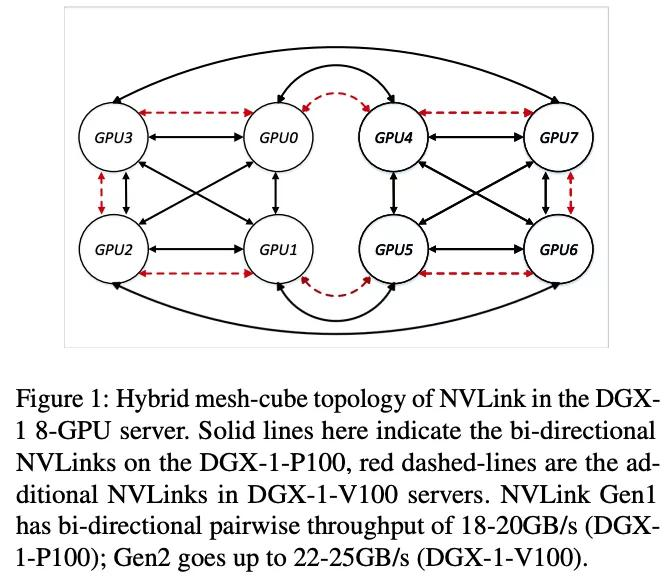

2. 当前的软件通信协议，并没有充分利用异构的 GPU 间通信通道（例如，NVLink 和 PCIe）。其根本原因是，现有通信协议使用的是在软件层面，建立多个环状通信通道。在一个环状通信通道里，整个环的带宽会被带宽最小的链接所限制。试想如果在一个由 NVLink 组建的多 GPU 的环状通信通道中，有一段链接是 PCIe，则整个这个环状通信通道的带宽会被限制在了 PCIe 的带宽上（因为 PCIe 带宽远小于 NVLink）。所以当下数据聚合的软件通信协议（NCCL/Horovod）就只用同构的高速传输线路（NVLink），而忽略其他低速，异构的传输线路（PCIe）（如下图 2（a）所示）

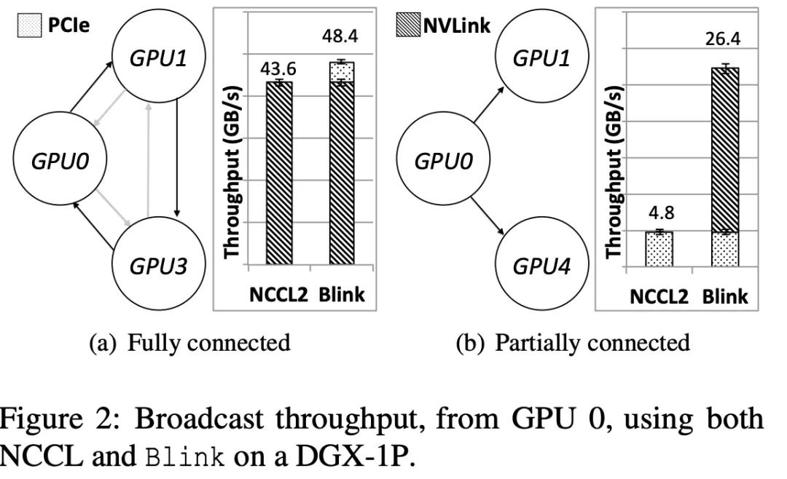

3. 在多租户的云端机群上，任务调度器是不知道 GPU 间通信线路的拓扑结构的。在云环境下，多个任务可能会被分派在同一台多卡的机器上。即使任务调度器知道 GPU 间通信拓扑结构，为了缩短任务的排队等待时间，调度器还是会把一个任务分配在多个机器上。（例如，一个 8GPU 的任务，调度器会把其分配为 3 个 GPU 在一台机器上，另外 5 个 GPU 在另一台机器上）。通过对一个云环境机群的调度历史记录分析，我们发现虽然任务大都需要 2 的幂的 GPU 数量（2，4，8），但是调度器还是经常会给任务分配 3，5，6，7GPU 在同一台机器上（如图 3 所示）。

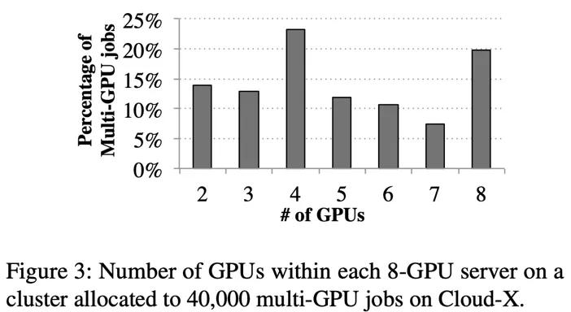

如上三点 **网络异构性** ，导致了 NCCL/Horovod 在优化 GPU 间数据聚合的过程中，无法充分利用所有的同构 / 异构通信线路。如图 2（b）所示，当 GPU1 和 GPU4 之前没有 NVLink 直接相连的情况下，NCCL/Horovod 因为无法在 GPU0，GPU1，GPU4 之间构建环状通道，所以无法利用高速通信线路 NVLink，于是只能用低速的 PCIe 做为数据聚合的通道。然而，即使在 NCCL/Horovod 能够构建环状通信通道的情况下，NVLink 还是有可能没有被充分利用（例如图 4 所示，4（b）中，GPU1 和 3，5 和 7，0 和 4 之间的 NVLink 未被利用）。

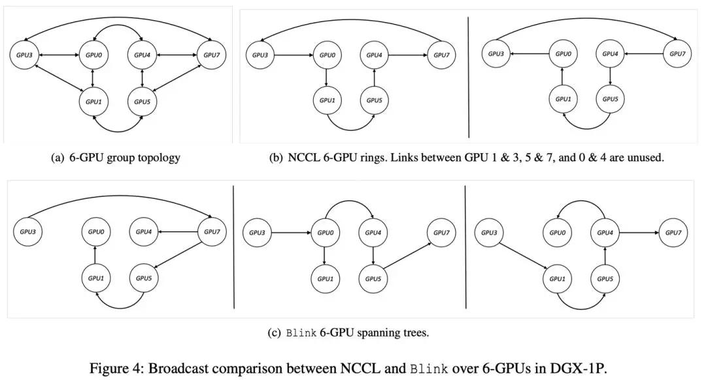

基于如上问题，本文提出 Blink，一个最优的 GPU 间数据聚合的通信库。首先，对于由于机器版本不同，或被分配在单个机器内的 GPU 间任意拓扑结构的情况，Blink 打破了传统的 GPU 间环状（ring）通信通道的构建协议，提出了使用生成树（spanning tree）的通信通道构建协议。相比于环状通信通道，生成树通信通道可以更好的利用所有的网络链接线路（例如：图 2（b），4（c）所示）。其次，针对异构通信线路（如 NVLink 和 PCIe），Blink 可以根据线路的带宽不同，调整在其上传输数据的比例划分，从而充分利用异构通信线路（例如图 2（a））。最后，Blink 提供了与 NCCL 一致的 API，所以可以直接无缝应用于流行的机器学习平台上，如 TensorFlow、Pytorch 等。

Blink 实现方案

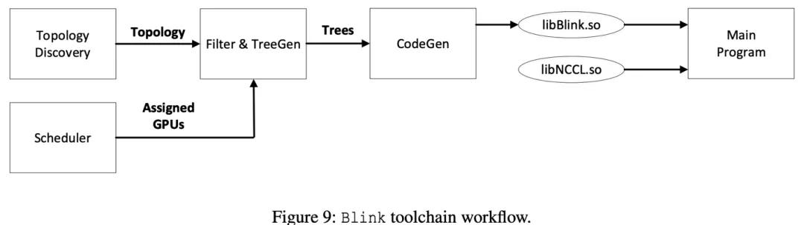

Blink 系统流程图如 上图（ 图 9）所示：

1. 当一个机器学习的任务被分配到多个 GPU 上时，Blink 自动探索这些 GPU 之间所有的可用网络通信线路和其拓扑结构。
2. 当得到了所有的通信线路和拓扑结构，Blink 通过生成树协议，在 TreeGen 模块里自动生成（1）最优的，多个，数据通信树状通道。（2）异构通信链路里，根据不同链路带宽分配不同传输数据的比例。
3. 当 TreeGen 产生了最优数据通信协议，CodeGen 模块会把通信协议转换成拥有和 NCCL 的 API 一致的 CUDA 代码，然后编译生成库函数 libBlink`.`so
4. Blink 使用 LD\_Preload 去动态的将 NCCL 的库函数（libNCCL`.`so）替换为 Blink 的库函数 \(libBlink`.`so\)，从而让主程序直接调用 Blink 的库函数。 实验结果

**1 单机多 GPU 的数据聚合实验结果（DGX-1-V100，DGX-1-P100，DGX-2）**

图示横轴每个柱状图下面的数组代表参与数据聚合的 GPU 序列（数字对应图 1 的 GPU 的序列号）。

在 DGX-1-V100 上进行的 Broadcast 和 AllReduce 实验中，相比于 NCCL，Blink 的 broadcast 吞吐率（图 15）提升高达 6 倍（平均提升 2 倍），Blink 的 AllReduce 吞吐率（图 17）提升高达 8 倍（平均提升 2 倍）

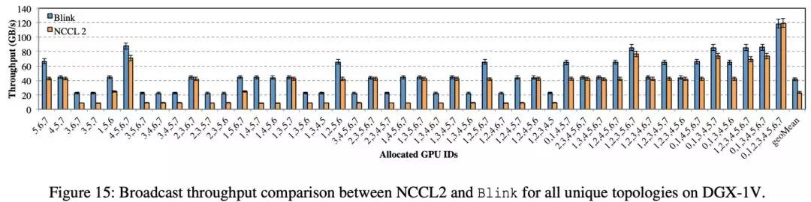

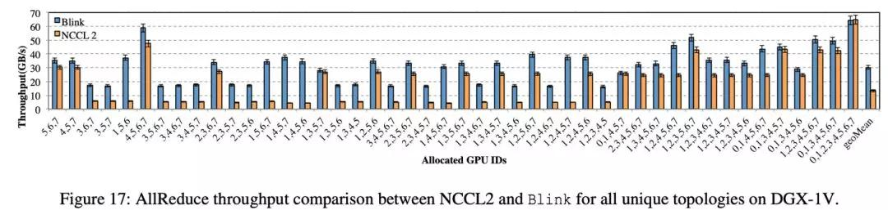

在 DGX-1-P100 的机器上，相比于 NCCL，Blink 的 broadcast 提高吞吐率（图 16）高达 3 倍（平均提升 1.6 倍）

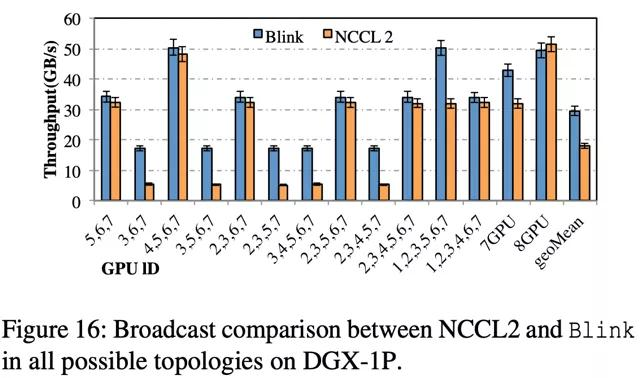

在 DGX-2 的 16-GPU 机器上，相比于 NCCL，Blink 的 AllReduce 提高吞吐率高达 3.5 倍（图 19），减小通信延时 3.32 倍（图 20）。

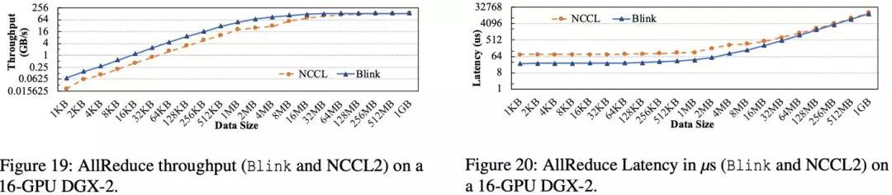

**2  机器学习模型训练效率提升结果**

本文使用数据集 ImageNet1K，对四个常见机器学习模型（ResNet18，ResNet50，AlexNet，VGG16）进行了分布式模型训练。

如图 18 所示，在单机 DGX-1 上，相比于 NCCL/Horovod，Blink 可以缩短 GPU 间数据聚合时间高达 87%，从而缩短模型训练总时间高达 40%。

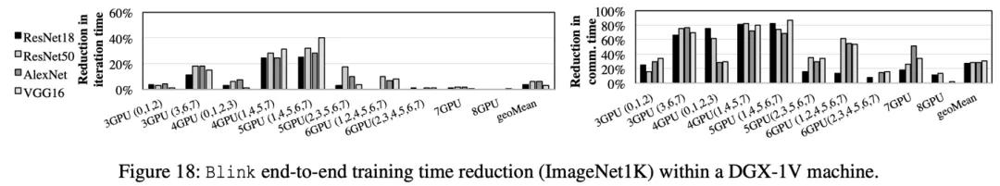

如图 22 所示，在多机，即 2 个 DGX-1 之间，相比于 NCCL/Horovod，Blink 可以提高 11% 的模型训练效率（图 22（a））。Blink 效率提升小的原因在于，当下云环境的多机间通信仍用 40Gbps 的低速 Ethernet。目前 AWS 和其他运营商（文献【5】）都在逐步改进多机间的网络通信带宽。针对可能达到的多机通信带宽，我们做了模拟器仿真，仿真结果如 22（b）所示，相比 NCCL/Horovod, Blink 可以提升多机器的 GPU 间数据聚合效率高达 7 倍。

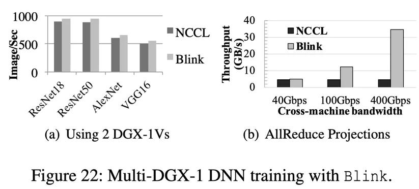

**论文原文链接：**

https://arxiv.org/abs/1910.04940

参考文献

1. Deepak Narayanan, Aaron Harlap, Amar Phanishayee, Vivek Seshadri, Nikhil Devanur, Greg Granger, Phil Gibbons, and Matei Zaharia. Pipedream: Generalized pipeline parallelism for dnn training. In ACM Symposium on Operating Systems Principles \(SOSP\), 2019

2. Sylvain Jeaugey. Optimized inter-GPU collective operations with NCCL 2. https://developer.nvidia. com/nccl, 2017.

3. Alex Sergeev and Mike Del Balso. Horovod: fast and easy distributed deep learning in TensorFlow. arXiv preprint arXiv:1802.05799, 2018.

4. Andrew Ng. Bringing HPC Techniques to Deep Learning. http://research.baidu.com/ bringing-hpc-techniques-deep-learning/, 2017.

5. Verizon marks milestone with successful 400G technology trial. https://bit.ly/2lKgAs7, 2018.

6. NVIDIA NVLINK. http://www.nvidia.com/ object/nvlink.html, 2017.

7. NVIDIA NVSWITCH. http:// images.nvidia.com/content/pdf/ nvswitch-technical-overview.pdf, 2018.

* * *

**你也「在看」吗？** ****👇
