## 蔡徐坤出道的男团黯然退场、经纪公司开始重估，限定团还能走多久？_36氪  

> 发布: 读娱  
> 发布日期: 2019-10-09  

编者按：本文来自微信公众号“[读娱](https://mp.weixin.qq.com/s/eEhZtGhlExAE6nO0EpjPLQ)”（ID：yiqiduyu），作者 林不二子，36氪经授权发布。原题目《NPC黯然退场、经纪公司开始重估，限定团还能走多久？》

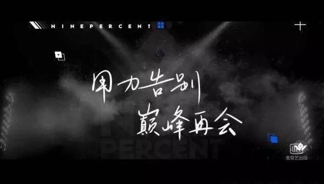

> 这个市场终会在合适的时机再次热起来，整个偶像行业也仍然会有新的生机。

10月6日，出道18个月的NINE PERCENT正式解散了，一年半的时间里，9位偶像都有属于自己的成长与发展，其中不乏蔡徐坤这样成为娱乐圈顶级流量的偶像。不过有意思的是，作为一个团体，NINE PERCENT的知名度远不如多个单一成员的“名号”，解散消息也没有形成多大的影响，而这也让我们不禁想问，限定团的形式还能走多久？

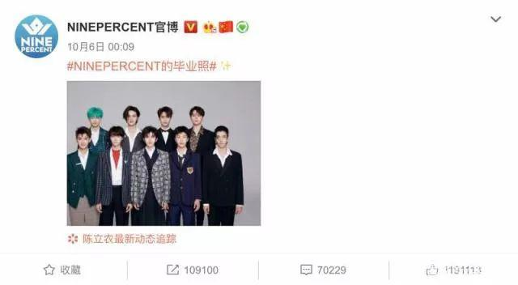

### 被消费的“小白鼠”

2018年1月，爱奇艺重点打造的综艺《偶像练习生》上线，之后的3个月里，多位年轻男孩掀起了全网的“打投狂欢”，在节目决赛前后，据不完全统计，共有约近百个选手相关词轮番登上微博热搜，决赛期间粉丝们投出了近1.8亿应援票，最终选出的9位练习生组成NINE PERCENT，在4月正式出道限定活动18个月。

彼时的NINE PERCENT，拥有超高人气及关注度，不过可惜的是，这手好牌被背后的经纪公司打得稀烂。

首先就是负责运营9个男孩的经纪公司爱豆世纪，选择了“消费”大于“养成”。在节目结束后时隔不到1个月，公司就启动了全国巡演，虽然为了这次巡演将他们9人送到了美国进行为期20天的训练，但实际上这9个男孩相识不过3个月，远称不上有多少的默契度，彼此的能力也参差不齐，这样的巡演舞台质量势必大打折扣，不少粉丝都对最终的舞台表演不买账。同时，因为NINE PERCENT没有属于自己的歌曲，多站巡演也不过是靠在节目中表演过的作品撑场，公司消费偶像糊弄粉丝的行为太过直白。

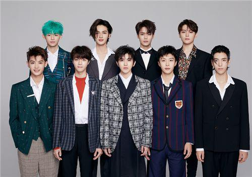

不过，尽管这次巡演不足以满足粉丝的期待，但也算是“比下有余”，因为之后9个人就再难全体同框了。

在今年8月13日，NINE PERCENT粉丝申请了团体存续时间最短的吉尼斯纪录，据粉丝统计在出道的18个月中9人只合体了55天，这还包括了非公开行程。而据公开信息，在这一年半的时间里，NINE PERCENT只举办了一次全国巡演，发布了两张专辑（其中一张为解散十天前发布），参与了两档综艺（其中《奔跑吧兄弟》蔡徐坤缺席，公司许诺团综始终未能上线），拍摄了一部纪录片，可以说整个团体没有多少动且作作品寥寥。

相比之下，NINE PERCENT成员的个人发展都走上正轨，顶级流量蔡徐坤尚且不论，陈立农成为了两部综艺常驻嘉宾（其一为单人参演综艺），发布两首个人单曲，并参演一部古装奇幻电影，黄明昊因背靠乐华七子NEXT，发布了多首个人单曲，并参演众多综艺，大部分成员都有了各自的发展，这也是如今团体宣布解散没有多少人有惋惜之情的原因。

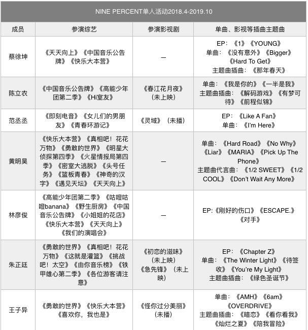

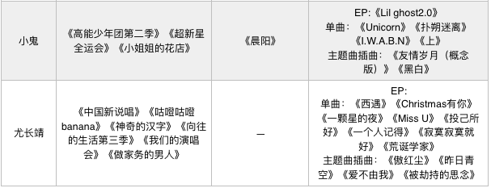

注：本表数据整理自网络，未收录NINE PERCENT三人及以上同时共同参与的综艺及音乐作品

NINE PERCENT糊了，背后的经纪公司爱豆世纪脱离不了干系，相比隔壁出道后就发行单曲，几日后就借节目完成首秀，团综和电影插曲也随之而来的火箭少女101，就更凸显了爱豆世纪的不作为。

当然，不可否认的是，作为中国首档偶像选秀综艺选出的男团，其背后的公司和团队需要一定的时间来适应市场，找到运营限定团的方法，所以NINE PERCENT只能沦落成行业初期发展中注定失败的“小白鼠”，这是让我们遗憾的。好在团体中诸如蔡徐坤、尤长靖、陈立农、小鬼等人都有了不错的单人发展机会，这也是市场先行者所能收获的唯一甜头。

到了今年，《青春有你》《创造营2019》都相继推出了新的男团UNINE和R1SE，经过了前一年的尝试后，UNINE和R1SE的运营都更加符合偶像的发展规律，UNINE出道一个月后发布首张EP，团综也顺势上线，R1SE则在出道后的2个月内连续发布了三首影视动漫插曲及首张EP，2个月后上线团综，这一系列把重心落在作品上的动作，也显示出限定团背后的公司在试图找到运营他们的方式，这也是行业在向前发展的证明。

只不过，不管背后公司做了哪些工作，限定团这个形式到目前为止，除了火箭少女101几乎都没能保持活力，限定团是否注定要成为弃子？

### 经纪公司开始重估：限定团或是个伪命题？

众所周知，限定团是综艺节目的产物，是偶像选秀综艺新玩法下的创新思路，因而从其诞生的动机来看就知，限定团相比成为一个正常生长的偶像团体，更可能只是一个商业投入后必须的资本回收方式，而这也正是限定团的矛盾之所在。

偶像团体作为一个以人为核心的产品，是需要时间和资金来耐心培养的，因而才有了练习生这个身份，素人经过长时间的训练，包括唱跳及综艺感等相关专业技能的培训，才能登上舞台与市场见面，然而，在经过了2018年两档偶像综艺将行业催熟后，这个偶像团体的成长逻辑被打乱。

在这个链条的前端，不少小公司将旗下未经久训的艺人送上综艺，只等着好事砸中自家艺人一夜爆火，公司好坐收渔利，而综艺方则在制作节目大肆投入后，迫切需要更多商业回报的机会，因而经节目成团后的综艺方经纪公司，几乎不会在限定团上花费多少心血，导致链条后端演变为对限定团的无止境消耗。

一个例子就是，尽管今年的限定团都有了自己的团综，但细观这些团综几乎出圈之能，无非是出于对粉丝的交代，反观海外偶像团综，比如日本杰尼斯旗下偶像组合TOKIO的《铁腕DASH》，就是具有一定综艺观看价值的。

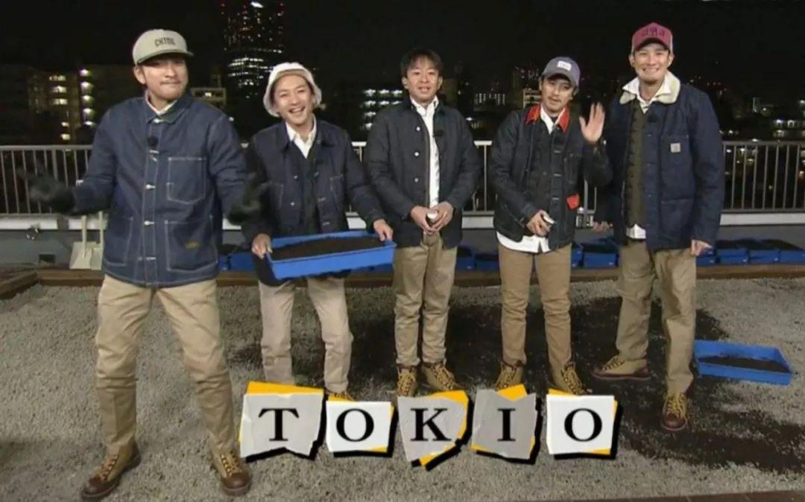

并且，值得注意的是，如今产出的综艺限定团，除了火箭少女101外，其他限定男团皆无市场活力，这也会逐渐影响到经纪公司对于是否希望自家艺人挤进限定团的决定，据某位拥有多年偶像团体打造经验的业内人士对读娱君透露，如今圈内的经纪公司大约有一半思考送艺人成限定团的必要性。

今年参与了《创造营2019》的王晨艺，在节目播出中期退赛引来粉丝关注，而据百度指数数据，自6月R1SE成团后，王晨艺的搜索指数与R1SE团体成员相差无几，更超过了团体单个成员搜索指数日均值，这个例子也似乎证明了并非走进限定团才是偶像打造的唯一之路。

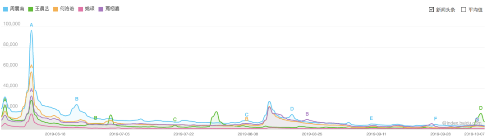

王晨艺与R1SE部分成员百度搜索指数

同时，更重要的是，送艺人组成限定团给经纪公司带来的收益并不足够丰盈。此前网络曾流出火箭少女101的筹劳分配比例，每位成员原本所属经纪公司和腾讯的占比为3:7，如若火箭少女101代言收入1100万元，则每位艺人原本经纪公司只能分到30万元，随后经纪公司还要与艺人继续分成，公司从单个限定团艺人处只能收益十几万。因而只有限定团成员中有足够多的自家艺人，才能有不错的投入回报，这也是在今年R1SE中有5人来自哇唧唧哇的结果出现后，网络上质疑节目有人为操纵可能的另一原因。

随着限定团发展越发没有市场声响，经纪公司与综艺方就越难形成“劲往一处使”，而这对于综艺方及限定团来说，绝不是一个好消息。据前文提到的业内人士对读娱君透露，虽然限定团的运营原属经纪公司与团体公司割裂，但原属经纪公司会将自己的资源项目报给团体运营方，也就是说，限定团的发展也离不开原属经纪公司的努力，此业内人士话语郑重地对我们表示“限定团的火热是多家经纪公司与综艺方共同努力的结果”。

可如今经纪公司尤其是有一定实力的大公司，开始思考是否要拼尽全力送艺人进限定团，无疑会影响到限定团这个形式继续发展的动力，再加上目前限定团的市场影响力几乎是由单个艺人带领，并非团体给单个艺人加分，也许会最终让限定团这个综艺产物走向衰落。

从始至终，限定团的出现就直指商业利益上的回报，无关艺人成长也无关团体发展，这也说明了偶像综艺产出的限定团，或许就是个伪命题。

### 没有了限定团，但偶像市场已经被打开

尽管如今大多数限定团都糊了，但经过了两年偶像综艺的轮番上阵，确实为我们的偶像市场撕开了口子，据2018年艺恩发布的《偶像产业迭代报告》显示，2020年中国偶像市场总规模将超1000亿，而这个数字也正在吸引更多的公司和资本走进偶像行业，完善产业链条上的各个环节。

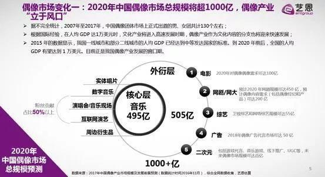

在今年8月，旗下拥有赖冠霖、宋雨琦、马雪阳的好好榜样完成了由三七互娱投资的首轮融资，估值近5亿，公司除了继续储备练习生艺人，也计划在韩国设立分公司打造自己的偶像培训机构，从而学习韩方的经验招揽人才，弥补国内偶像培训环节的短板。

9月，创始人曾打造出至上励合，发掘了段奥娟、王晨艺的缔壹娱乐，也完成了由聚元资本投资的数百万元Pre-A轮融资，聚元资本合伙人高笛则对36氪表示，偶像行业至今没有一家公司占到10%以上的份额，千亿市场规模下仍有很多机会，虽然文娱行业今年整体较冷，但聚元资本会一直留意偶像行业。

在更早的2018年，送旗下艺人走上两大偶像综艺的麦锐、坤音、AIF等经纪公司，也早已完成了数千万元的Pre-A轮融资。尤其是在今年文娱行业整体渐冷，不少资本都处观望之姿的情况下，偶像经纪公司仍能获得资本青睐，可见这个行业也有了过冬的能力。

而除了公司和资本都对偶像行业保有信心，目前品牌商也非常看好偶像艺人。一个有意思的例子是，除了从节目中走出的头部偶像都得到了品牌商的青睐外，如今二次元偶像也都拿到了各种代言，《魔道祖师》中的蓝忘机魏无羡都出现在可爱多的包装上，《恋与制作人》四位人气男主也接到多家品牌代言，《全职高手》主角叶修也曾被聘为某旅游网站“旅行体验师”。

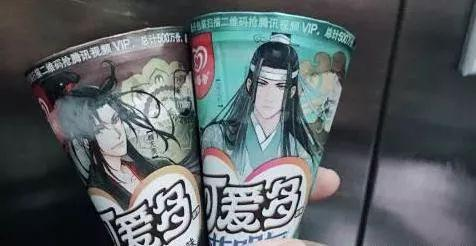

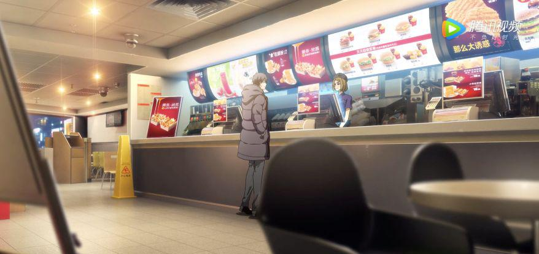

也就是说，关乎偶像市场与偶像行业，资本都已准备好了，接下来的就是看内容产品也就是偶像的孵化打造与运营能力。

在读娱君看来，如今偶像团体打造和运营的最大困境就是没有一个可持续曝光的平台，让更多大众了解偶像团体的特点和魅力，去年出现的打榜节目虽有意将偶像内容常态化，但结果并不理想，尽管今年的三档偶像综艺都没能真正出圈，但对于偶像市场来说仍然是有所益处的，像是缔壹娱乐和好好榜样也都准备好了艺人，计划送上明年将会播出的偶像综艺。

同时，有多位从事偶像孵化的从业者曾对读娱君表示，中国的偶像市场远没有饱和，偶像团体仍然具有足够的市场。在日韩每年都有大量新偶像团体出现，激烈的竞争反而刺激行业走向打造优质偶像团体的良性循环，对于正在发展中的中国偶像市场来说，也终将会有优质偶像团体的出现与持久存活，只不过刺激行业前行的偶像内容不一定只是如今这样的选秀形式。

从海外来看确实如此，两个月前，韩国Mnet推出了名为《Queendom》的综艺，六组已出道女团展开对决争夺唯一回归秀的特权，在b站上节目视频仅播放量前二者就拥有了近400万次观看，各女团表演Cut视频也都播放过万，节目第五期韩国收视率也破1，节目热度正在快速上涨，说明新形式的偶像团体综艺仍然是有市场空间的。

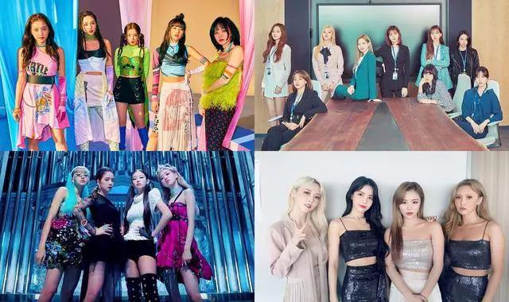

再说回国内的偶像市场，随着资本的进入及信心，以及各经纪公司开始耐心打造偶像艺人，这个市场终会在合适的时机再次热起来，哪怕打造限定团式的偶像选秀综艺热度下降，整个偶像行业也仍然会有新的生机。
