## 惨烈的国运对决  

> 发布: 财经小报告  
> 发布日期: 2019-10-08  

_作者：金立扬
_

_来源：_ _深交所综合研究所_ ****

在苏联，它叫做卫国战争。在德国，它叫做东线战争。

**1941年6月22日到1945年5月9日，整整1418个日日夜夜，** 两个世界级工业强国以死相拼，从北极圈打到高加索山脉，从伏尔加河打到欧洲心脏地带的易北河，战线绵延几千公里。

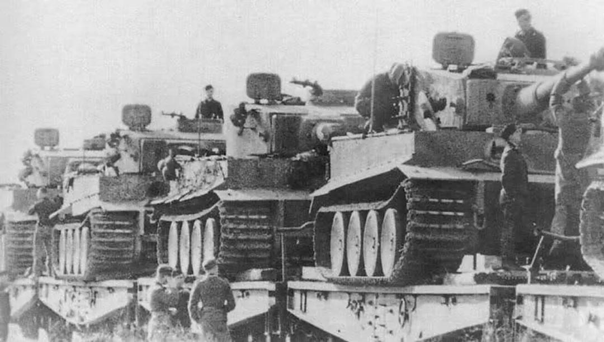

每场重大战役，双方都投入百万大军，坦克数千辆，火炮数万门。参战的士兵来自整个欧亚大陆数十个国家，平均每天都有数万官兵伤亡，一直打到一方的国土全部被占领，武装力量几乎全军覆灭。战争彻底改变了欧洲乃至世界的政治格局，并且把胜利者打成了超级大国，曾经主宰半个地球的命运五十年。

战争的双方对这场战争有着不同的称谓。 **在苏联，它叫做卫国战争。** **在德国，它叫做东线战争。**

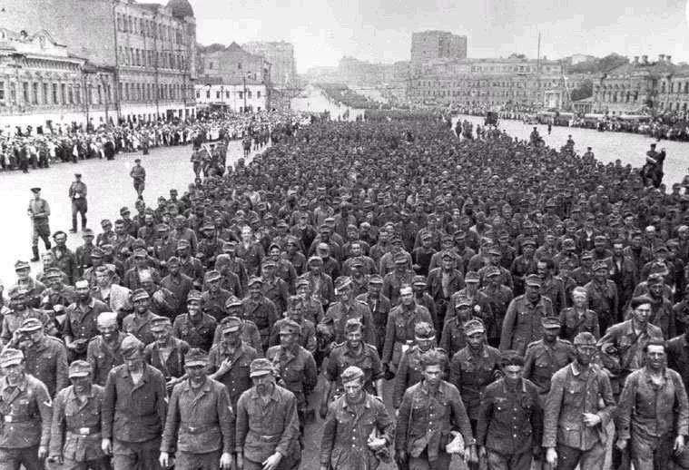

根据俄罗斯国防部公布的损失统计数字，二战期间，苏军阵亡、伤重死亡、病亡和被俘后死亡相加，共计866.48万人，再加上动员入伍途中死亡的50万人，总计军人死亡916.48万。苏军受伤人员为1520万人， **总伤亡数达到2400多万。**

除了军人的伤亡，还有数量惊人的平民伤亡。俄罗斯统计，二战苏联和平居民死亡1740万人， **总计军民死亡约2660万人，** 相当于全国人口的七分之一。

1941年，包括大战前新吞并的西乌克兰、摩尔多瓦、波罗的海三国等地区，苏联人口约一亿九千万。减去一半多点的女性，再减去男性中的未成年人和老年人，苏联的中青年男子大约在五、六千万左右，其中红军伤亡了2400多万，再加上男性平民的伤亡，可以说苏联全国成年男子的一半非死即伤。

受创最深的是1923年出生的苏联男性。1941年，他们满18周岁，正赶上参军的年龄，四年打下来，他们80％没有活到胜利的那一天。1945年，苏联总人口从1941年的1.9亿下降到1.67亿，男性人口只剩43.2%，女性则为56.8%。

为了对苏军的伤亡有个更清晰的概念，我们不妨做些比较。1812年俄罗斯与法国战争，基本歼灭了拿破仑的主力部队，俄军死亡不过20万出头，1941年俄罗斯与德国的战争是这个数字的45倍以上。

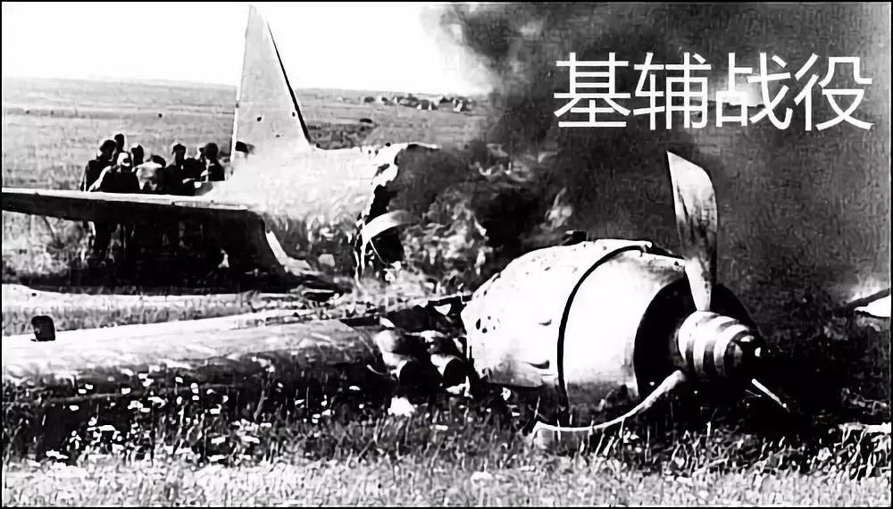

在1941年7－9月的基辅防御作战中，红军阵亡失踪超过60万。9月30日，德军发起台风行动，直扑莫斯科，在维亚兹马和布良斯克完成了双重包围圈，合围了红军三个方面军。

在不到一个月的时间里，苏军阵亡20万，被俘67万，再加上受伤入院的，莫斯科门前的百万苏军被一扫而空，以致于斯大林问朱可夫：“朱可夫同志，你坚信我们能够守住莫斯科吗？我是在怀着内心的巨大痛苦问你这个问题，希望你诚实地回答。”苏德战争中苏军的每一个转折性战役，都是以巨大的牺牲换来的。

1942-43年初的斯大林格勒战役，苏军阵亡失踪47.7万，负伤64万。1943年夏的库尔斯克战役，苏军彻底赢得了战争的主动权，但是其间的7月至9月，苏军阵亡68万，失踪11.5万人，负伤183万，作战部队在3个月内减员三分之一，是整个战争中伤亡最重的时期。到了战争后期，苏军的伤亡依然很大。

在反攻德国的道路上，苏军平均每天留下2500具士兵的尸体。打到波兰，苏军阵亡60万人。打到匈牙利，阵亡14万。柏林战役，尽管苏军已经具有绝对优势，尽管谁都不愿意在胜利的前夕倒下，苏军仍然付出了阵亡8.1万人、负伤28万人的代价。

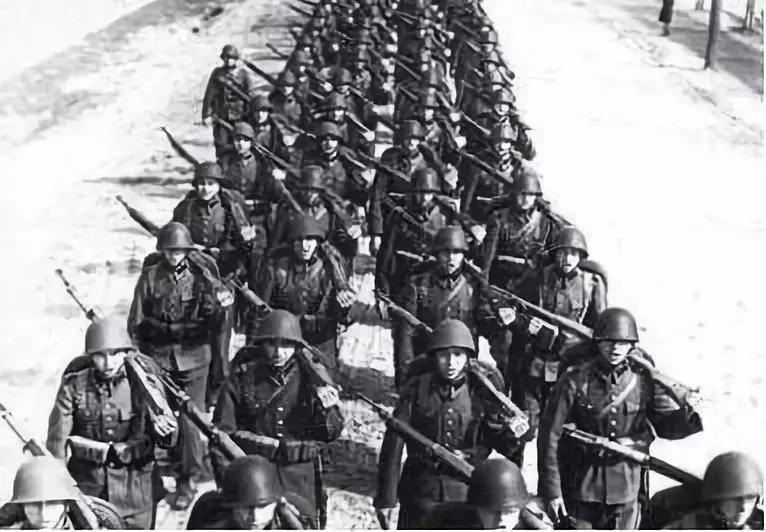

**除了空前的伤亡，还有空前数量的人被俘。** 特别是在战争的第一年，苏军基本上抵抗不住德军装甲部队的钳击，一个又一个集团军被合围。1941年夏的白俄罗斯防御战，苏军被俘28万。

1941年7月中旬到9月上旬的斯摩棱斯克会战，苏军被俘30万人。7月至9月的基辅会战，希特勒称为“战史上最大的合围战”，德军俘虏苏军66万人。据俄罗斯统计，苏军在整个战争期间，被俘362万，近半数即178万人死亡。德国和西方史学家一般认为苏军被俘人数在500万以上。

惨重的损失，即使象苏联这样的人口大国，动员能力也到了极限。在这个不到两亿人口的国家，先后动员了3440万人参军。战争爆发的第二天，苏联首先对23岁到37岁的男性公民实行动员，七天之内就有530万人应征入伍。八月，由于在斯摩棱斯克、乌曼和第聂伯等战役中遭受巨大损失，苏联进一步征发18岁和40-50岁的人参战。

到战争的最后一年，苏军征兵年限进一步放宽，下限17岁、上限55岁的男子都扛起了枪。连妇女也纷纷从军。一般国家的女性从军，主要担负医疗、通信等后勤工作，苏联女兵则当上了狙击手、机枪手、侦察兵、坦克兵和飞行员。

**在战争期间，苏联共有80多万妇女从军，死亡过半。**

到战争中后期，苏联把罪犯也放出来了。1943年库尔斯克战役前夕，为解决兵力不足的问题。贝利亚向斯大林建议从劳改营和教养院提前释放犯人：“别让这些苏维埃的灰尘再去浪费苏维埃的粮食了，应该让他们承担战争的责任。”于是，斯大林在1943年8月29日颁布命令，先后把130多万名劳改犯和问题军人送上前线，其中40多万人编进惩戒营，从事最危险的战斗任务。

1944年一年下来，损失超过50％，损失率是普通部队的3-6倍。苏联后方的青壮年男子基本上已经搜罗一空，丘吉尔在参加雅尔塔会议的时候，曾经注意到街上已经见不到男性平民，连交通警察都是女的。

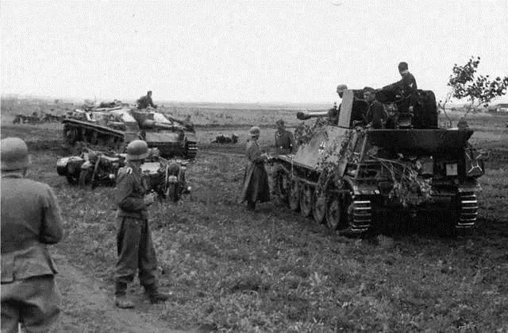

在苏德战争中，德国也彻底打得筋疲力尽，其人力枯竭的问题甚至比苏联还要严重。与苏联不同，德军同时在多条战线上作战，北欧的森林，意大利和巴尔干的山地，法国的平原，北非的沙漠，乃至大西洋的海底，到处有德军士兵的身影和坟墓。但是总的来看，苏德战场是毫无疑问的主战场。二战时期，德军死亡、失踪将近500万，其中死于苏德战场的约430万。

苏德战争开战前4周，德军伤亡人数已经超过西欧战役的总和。开战两个月，最早突入苏联的德军部队就只剩下了60％。而苏德战争前期的伤亡还不是最严重的，随着苏军规模的扩大、装备的改善和战斗技能的提高，德军的伤亡直线上升。

德国在东线阵亡人数，1941年约30万，1942年约50万，1943年约70万，1944年达到123万。一个德国老兵回忆，当时征兵以18岁划线，一满18岁立即入伍，中学毕业生一届一届地送到前线。在他毕业的中学里，1922年出生的男生没有一个从战争中活下来。

1943年库尔斯克战役失利以后，德国取消了家庭最后一个儿子或者大家庭父亲的免服兵役的规定。征兵年限逐步放宽，上限扩大到45岁，后来又扩大到60岁。 **1944年，希特勒下令16岁到60岁的男子，一律编入国民冲锋队，承担乡土防御的任务。**

1945年3月，德军征召1929年出生的男性入伍，正式打破了十八周岁的最低服役年限。因体检被淘汰的人员也不能免除兵役，例如在西线的第70步兵师主要是由患胃病的人组成的，只能吃白面包，号称“白面包师”。甚至还有一个营，完全由患耳疾的人组成，命令靠手语传达。

为了弥补本国人力的不足，德国还大量征召外籍人员参军。先是德国侨民，继而北欧、西欧的志愿者和苏联战俘都可以加入德军，曾在德军中服役的外籍人员超过200万，来自30多个国家。

至于犹太人，到战争后期，如果只有50％的犹太血统，也可以加入军队。

但是，出于文化传统和意识形态的考虑，德国始终没有征用妇女加入作战部队。

到战败之时，德军总损失（伤、亡、被俘和失踪）总计1348.8万，占1939年男性人口的46％，其中在东线的损失达1075.8万人，占了总损失的80％。

**就人力资源的动员和损耗而言，苏德战争称得上是一场不折不扣的总体战。**

从法国大革命开始，欧洲的战争形态发生了很大变化。中世纪的欧洲小国寡民，战争属于贵族、骑士和雇佣军的职业，目的是王朝的利益，平民并不参战，一场战争往往只有几千人参加，上百人伤亡，只要能够达到目的，尽量避免会战和流血。但是法国大革命把征兵制和意识形态引入了战争。

1793年8月，法国革命政府颁布了全民动员令：“年轻男子应该去战斗，已婚男子应该制造武器和运送补给；妇女们要缝制帐篷和军装，去医院里服务；孩子们应该把亚麻布做成绷带；老人们应该到公共广场上，鼓舞战士们的士气，宣传对国王的仇恨以及共和国的团结。”当时，法国17到25岁的健康单身男子全部参军。

正如法国元帅福煦后来所言：“法国革命凭着它的原则的力量和能力，凭着它所鼓舞起来的人民的热情，已经把整个民族的全部重量和一切力量，都投放到天平上了。而在过去，天平上的重量只是有限的军队和国家的有限（正常）税收。”

**“国王和国王的战争结束了，民众和民众的战争开始了”。**

战争性质的变化，在第一次世界大战中已经表现得非常明显。世界上所有最强大的民族国家都投身其中，参战国家的人民不分阶级，不分党派，全都兴高采烈、斗志昂扬地走上前线，工业革命以来发展起来的强大的科技和工业围绕战争全速运转。一战参战的军人6500万，死亡857万，青年贵族军官身先士卒，伤亡尤为惨重，致使欧洲许多历史悠久的贵族家族绝嗣。

称雄数百年的俄罗斯帝国、奥匈帝国和奥斯曼帝国彻底崩溃，不可一世的德意志德国骤然瓦解，日不落的大英帝国则日薄西山。大战过后，这片富饶的大陆遍地废墟，民穷财尽，欧洲人从此丧失了自信，也丧失了几个世纪建立起来的世界霸权。

对现代战争的长期性和残酷性，德军高层的有识之士认识是非常清楚的。老毛奇在1890年就预言，下一次战争可能要打7年，甚至30年，因为现代国家的资源太巨大，一次会战不足以放弃战争。小毛奇在1906年说得更明白：“那是一种民族战争，不是一次决定性会战所能完成的，必须经过长期苦战把全部国力都耗尽，否则一个国家不会屈服。”

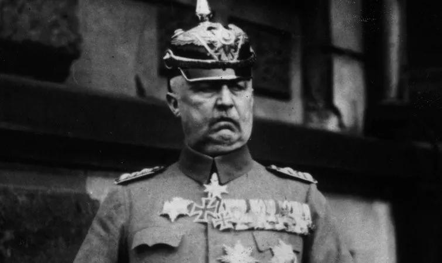

一战结束以后，德国名将鲁登道夫写下了《总体战》。他认为，现代战争已经是总体战，从战场的范围看，“已经扩展到了作战国的全部领域”，“总体战不单单是军队的事，它直接涉及到参战国每个人的生活和精神”。全体国民必须不遗余力，奉献全部身心，政治、经济和精神生活都必须服从战争需要，唯有如此，战争的胜利和民族的生存才有根本的保证。

一战的经验表明，德国要进行总体战并不困难，难的是进行长期的总体战。德国自然资源极为贫乏，石油、天然橡胶、钨砂、铬矿等重要的战略资源全部需要进口，甚至粮食都不能自给。德国一战宣布投降的时候，寸土未失，军队仍然战斗在敌国的土地上。但是在英国皇家海军的严密封锁下，国内人民生活困难，在战争的最后两年，德国有80万非战斗人员死于饥饿和营养不良。德国一战的失败，主要不是败于战场，后方不稳、士气低落是主要的原因。

对德国来说，总体战还有一个特殊的困难，就是纳粹在德国社会的根基不深，就是从它的前身、1919年成立的德国工人党算起，到1933年取得政权，也只有14年的历史。

纳粹党员大多从社会底层和边缘起家，希特勒自己只是来自奥地利的一个下士。只是靠着蛊惑人心的宣传、特别是在解决经济危机中的成就，纳粹才得到了多数德国人的拥护，至于德国的工业家、国防军和知识阶层，对纳粹并不那么买账。如果把德国拖入一场旷日持久的总体战，让全国上下自觉自愿地忍受牺牲，那么纳粹的统治还能不能稳固地维持下去，就很难说了。

**对此，希特勒心知肚明。**

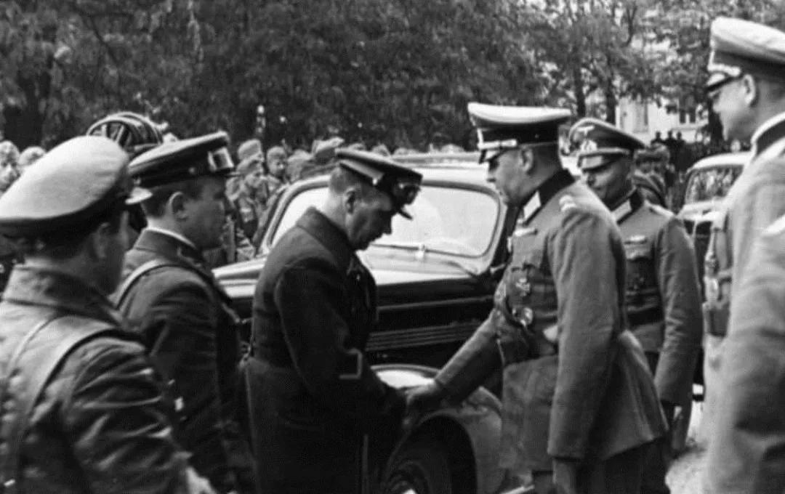

因此，尽量避免陷入持久战和总体战，就成了希特勒领导下的德国的战略目标。所幸的是，在古德里安为代表的德军将领的努力下，德国的闪电战逐渐炉火纯青，避开总体战似乎有了可能。

闪电战的基本打法是在决定性的地段，大量集中使用坦克集群，在空军的配合下突然发起进攻，突破对方战术防御地域后，高速向战役纵深进攻，进而围歼敌主力集团。从战略层次讲，闪电战不仅要在敌人重兵集团展开之前，瘫痪其防御体系，更重要的是摧毁其抵抗意志，使得敌国很快投降。

闪电战在波兰战役中初试锋芒，在西欧战役中达到顶峰。德军1天时间就拿下丹麦，5天占领荷兰，12天打下南斯拉夫，18天荡平比利时，23天夺取挪威，27天内征服波兰，39天就让号称“欧洲第一强国”的法国俯首称臣。

**到苏德战争爆发前，德国已经占领了大半个欧洲，兵锋所向，无不披靡。** 在这个过程中，德国并没有投入全部国力，只是利用其现有的工业基础实行了宽度军备计划，军备生产的战线很长，但是规模不大。在二战爆发前的六年，整个德国工业产值仅有6%～7%直接用于军事。

二战爆发以后，德国也没有实行总动员，就顺利地横扫西欧、北欧和巴尔干半岛。对苏开战以后，因为前几个月打得比较顺手，德国甚至把一部分军工生产能力转入了民用。

苏德战争前，德国国防军蒸蒸日上，苏联却出现了伤筋动骨的大清洗。1937－1938年间，红军高级将领大部分被枪决，军官总共被枪决1.5万人，元气大伤。在1939年冬天的苏芬战争中，苏军丢尽了脸面。为了拿下只有400万人口的芬兰，苏联投入了百万大军，费了九牛二虎之力。原定三四天的战争，打了三四个月，丧师数十万。

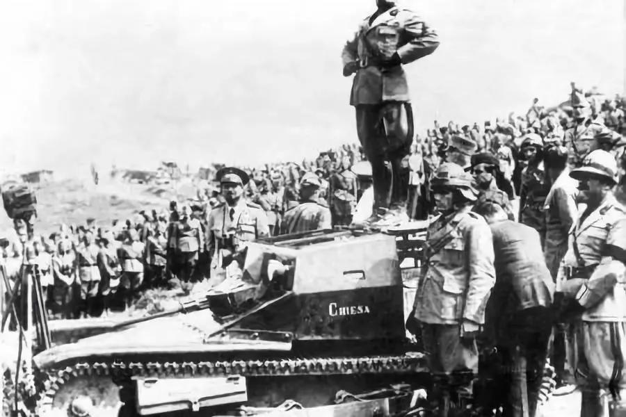

相比之下，德军开战以来还没有败过，难怪希特勒对进攻苏联充满了自信：“我们只要在大门口踹一脚，整座破房子就会倒塌下来。”根据巴巴罗萨计划，德军将用3－4个月的时间，即在冬季到来以前，基本歼灭苏军主力，攻占莫斯科和列宁格勒，推进到伏尔加－阿尔汉格尔斯克一线，基本结束对苏战争。至于苏联剩下的乌拉尔工业区，用德国空军就可以解决了。

斯大林明确指出， **苏联将面临“一场长期的、残酷的竞赛，交战双方的全部经济和政治基础都将在这场竞赛中受到考验”。**

当时苏联的军事学说，对于未来战争的长期性有清醒的认识。苏军认为，未来战争将是数百万人进行的武装斗争，参战双方的最终目标都是彻底消灭敌人。战争将具有极大的规模，而且不可能是闪电性的，不可能毕其功于一役，必须实施一系列战略性战役才能最终粉碎敌人。

二十年代后期，苏军总参谋长图哈切夫斯基元帅就说过：“现在我们不能期望那样的交战，它们能够导致以一次突击就消灭敌人全部作战军队的结果。正面的宽度、铁路网的高效率和战区的大纵深都不允许达到那样的结局。”“我们应当准备进行长期的战争，如果各帝国主义者在他们之间发生冲突的情况下爆发的战争是长时间的，那么毫无疑问，在我们苏联和周围的资本主义国家之间的斗争，也将是长期的、旷日持久的和十分残酷的。”

在这样的环境、认识和心态之下，苏联以举国之力，全速发展重工业，为未来的战争做好准备，就不难理解了。

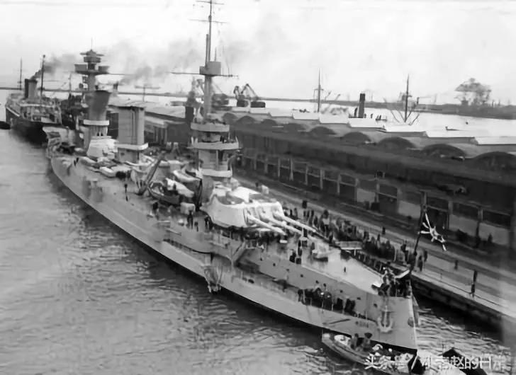

从1926年第一个五年计划开始，苏联最大限度强化劳动纪律，经济、外交和社会生活全部服从军事目的。1939年二战开始以后，随着德国横扫北欧、西欧，战争的阴云已经笼罩整个苏维埃俄国， **苏联的备战工作加快了步伐，其规模是惊人的。**

1938－1940年间，苏联工业生产增加了44％，国防工业的增长比全部工业要快2倍。1939年军事拨款占国家预算的25.6％，1941年增加到43.4％。一个又一个重工业基地，在乌拉尔和中亚的荒野中拔地而起。

从1939年到1941年战争前夕，苏联军队规模从200万增加到550万，其中大规模机械化部队的建设成为重中之重。根据苏军总参谋部拟定的计划，将组建20个机械化军，配备坦克29899辆，其中包括15834辆T-34、KV坦克，这是同期德军坦克和强击火炮总数的5-6倍。

苏军把德军当成了一个可怕的对手，进行了严肃认真的准备。他们相信德军也会这么干，为此甚至导致了苏军总参谋部军事情报局（即格鲁乌，其情报渗透能力比克格勃还强）误判了苏德战争爆发的时间。

格鲁乌情报专家认为，德国要进攻苏联，不是几个月能够完成的，必须应对苏联冬季的严寒。为此，德军要大量采购羊皮袄，这意味着有数百万头公绵羊被宰杀，大量超出日常需要的羊肉涌入欧洲市场，引起羊肉价格的大跳水。同时，德军必须换用适合寒冷地区的特殊擦枪布以及在严寒地区使用的燃油。基于这样的判断，格鲁乌密切注意欧洲各绵羊产区动向，收集整理各地公绵羊的数量、主要集散地和屠宰中心的情况，格鲁乌局长葛利柯夫每天两次听取欧洲各地公绵羊的价格情况。

苏联情报员还费尽千辛万苦搜集德军使用过的擦枪布，偷运大量煤油灯、煤油炉和打火机等物品。直到战争前夕，格鲁乌没有发现任何异常，绵羊价格没有异常波动，擦枪油和燃油的配方也没有变化。

基于上述情况，葛利柯夫虽然知道了德军的大规模集结，甚至知道了德军行动的代号，却向政治局担保德军没有做好开战的准备。结果，10小时以后，德军的全面进攻就开始了。 **因为，希特勒根本没有打算将对苏战争拖到冬天。**

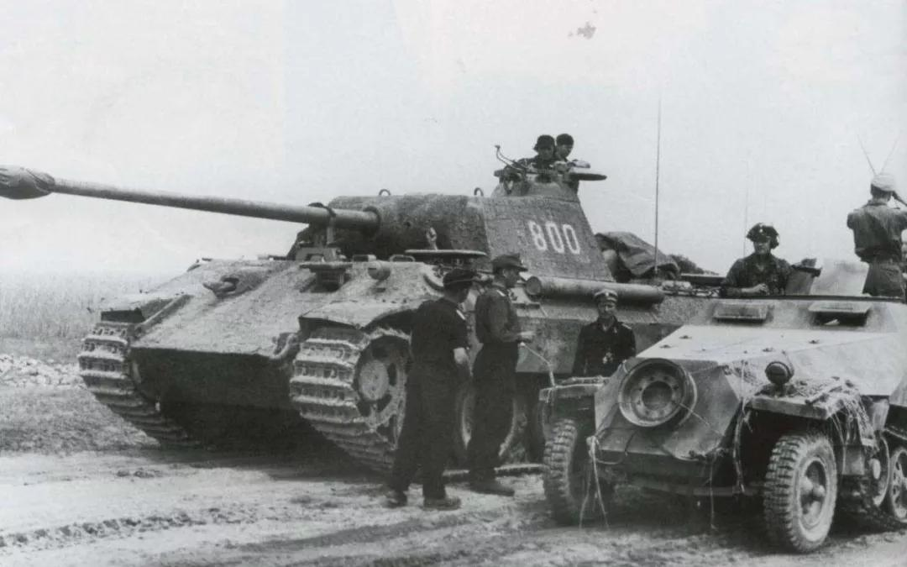

在苏德战争开始的时候，德国具有一切有利条件在武器装备上压倒对手。德国本来就是一个工业高度发达的强国，二战爆发以后还占领和控制了几乎整个欧洲大陆。1941年，德国直接统治区就产煤4亿吨，钢3180万吨，而苏联的产量仅为1亿5千万吨煤、1790万吨钢。德国拥有126万台金属切割机床，苏联仅有58.4万台，至于机器制造工人，德国超过苏联１倍。德国还有高度发达的科学技术，造出了当时世界上最精良的武器。德国的MP43突击步枪，MG42通用机枪，虎式坦克，88毫米高炮，都是同类武器中最优秀的。

**在很多人的心目中，德国军队是一支武装到牙齿的军队。** 但事实上，德军在二战中虽然拥有一些世界上最好的武器，数量却严重不足，在大多数时候，德国国防军都是普遍缺乏技术装备的情况下苦苦支撑的。

德军与苏联开战的时候，德国及其盟国在边境的主要装备数量就低于苏军，坦克和突击炮是4171辆对15687辆，飞机是4389架对11537架，火炮和迫击炮是42601门对59787门。当时苏联的武器大多陈旧，但是T-34坦克和122毫米A-19加农炮都是当时世界上最好的主战装备。德军进攻部队只有19个装甲师和14个摩托化步兵师，其余112个师都是步兵师，靠着士兵的双脚或者马车进行机动。

1941年冬天，德军从莫斯科城下败退，损失了大量重装备，从此就再也没有恢复过来。第二年春天，德国南方集团军群因为要进行主力方向的作战，装备达到了编制标准的85％，算是情况最好的，这还是从其他两个集团军群中抽西墙补东墙才拼凑起来的。

**总体来看，德军在战争中经历了一个 “去现代化”的过程。**

在苏德战场上，开战时期德军拥有3600辆坦克，到战争中期的1943年夏天只有上述数量的三分之二。德军一个装甲师在二战初期装备328辆坦克，到1943年库尔斯克战役的时候，平均拥有坦克73辆，到1945年，更缩减到54辆。非战之罪也，在战争中，德军主要装备的交换比都优于苏军，坦克经常是一辆换苏联的三四辆甚至更高。但是，德国的坦克经常是损失一辆少一辆，苏联却总是能够造出更多的坦克，直到把德军彻底淹没。这就不能不从军备生产上找原因了。

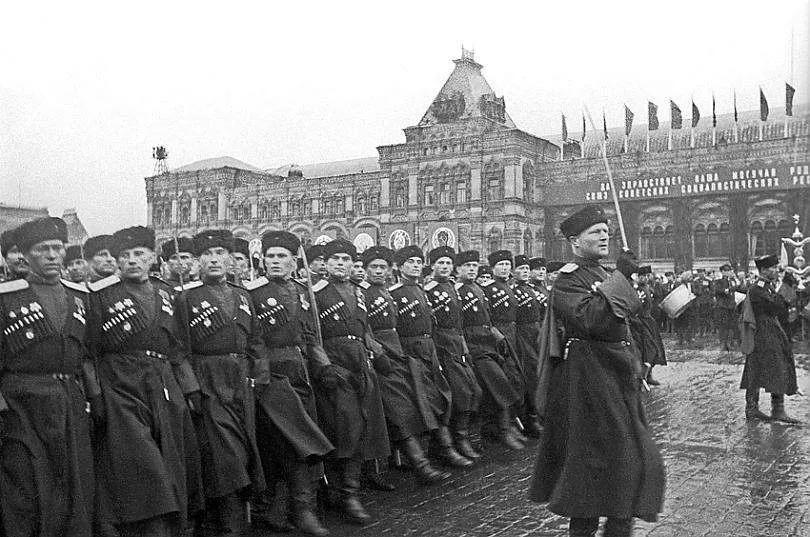

**苏联在军备上的胜利，首先是武器哲学的胜利。** **苏联武器在国际上一直简单、可靠、耐用著称，而这正是大规模、长期性战争所要求的。**

在这样的战争中，兵员伤亡比率很高，武器的耗损也很快。因此，武器没有必要造得太精密、太复杂，因为根本没有时间让士兵接受长时间的训练。

一个叛逃到西方的苏联军官问得好：“假如明天必须动员中年的后备役人员或戏剧学校的学生去保卫国家时，又会发生什么情况呢？”同样，武器的使用寿命也没有必要太长，因为在达到寿命前很早就已经被摧毁了。

所以，苏联武器非常简单，型号简单，使用简单，维修也简单。

例如，卫国战争期间，苏联生产了34.8万门迫击炮，占二战所有参战国生产量的一半，德国只生产了6.8万门。苏军特别喜欢迫击炮，主要原因是结构极为简单，只花几分钟就会教会士兵使用它。可靠性高，几乎不需要维护。在任何情况下都能立即准备好，随即向敌人发射炮弹。虽然射击精度较差，但是它好歹是门炮，有还是没有是大不一样的。

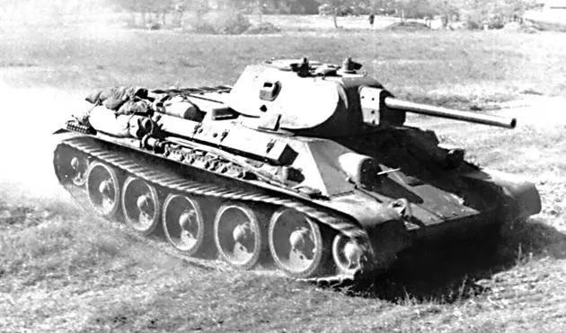

在整个战争期间，苏联只有两种主要的坦克，即中型的T34和重型的KV，总共只有五种主要战斗机。

相比之下，德军的武器则是五花八门，军队经常随心所欲地提出生产新式武器或者改进现有武器的要求，为了弥补生产能力的不足，德国还搜罗了占领的欧洲各国各式各样的装备。德国一度同时生产着425种飞机或改进型。中央集团军群在战争中期装备了151型不同的卡车，150型不同的摩托车，要储备一百万种配件。一个装甲师投入作战的时候，有96种人员输送车，111种卡车，37种摩托车。这是生产企业的噩梦，也是后勤部门的噩梦。

德国的武器发展计划同样杂乱无章，仅以飞机为例，就研制过喷气式战斗机、喷气式轰炸机、四引擎远程轰炸机、载重22吨的巨型运输机、无尾翼的隐形轰炸机等，有的远远超越了时代。德国军备部长施佩尔曾经感叹：“我们确实吃了发展计划过多的苦头。假如我们集中发展少数几项，肯定早就完成了。”

为了对付苏联的T-34坦克，德国研究开发了虎式和豹式坦克。但是，生产一辆T-34仅仅需要8千个工时，而同级别的豹式坦克则需要15万个工时，重型的虎式坦克则需要25万个工时。战争期间，德国共生产了1350辆虎式坦克，4814辆豹式坦克。苏联却生产了10.2万辆坦克，其中Ｔ－34超过5万辆。苏联红军坦克维修部门还抢修了43万辆次坦克、装甲车辆，相当于苏联战时年产量的15倍。

与简单的武器设计相结合的，是军备生产的全力以赴。苏联本来实行的就是计划经济，完成这个转变并不困难。苏德战争爆发后两小时，最高苏联就发布了“关于战争状态”的命令，规定了公民劳动义务、征用运输工具、生活必需品定量供应等措施。战争爆发的第四天，苏联就通过了《战时职工工作时间规定》。12月又规定了《追究军工企业职工旷工责任》，工作消极或者迟到的，可以被判刑。建筑、弹药、铁路等行业，先后实行军管。

1942年，苏联军工行业的工人工作时间被定为14个小时，有的长达16个小时。大量妇女和少年加入了劳动大军。1939年，工业部门职工中18岁以下的占6％，而1942年这个数字增加到15％。1943年，苏联工业劳动力的一半以上是妇女，在集体农庄，女工的比例几乎为四分之三。

整个1943年，苏联用800万吨钢和9000万吨煤生产出了48000门重型火炮和24000辆坦克。

**美国和苏联是二战时期运用大规模流水线生产最成功的国家，战后，两国均成为超级大国。**

在很长时间里，德国在军备生产上一直没有全力以赴。一次大战后期，德国因为遭受封锁、物资匮乏，国内厌战情绪严重，导致了革命，希特勒对此深以为戒。

二战爆发后，德国没有进行经济总动员，反而花了很大力气搜刮被占领的欧洲各国的农产品。1944年以前，德国一直不敢削减民用消费品的生产。当时在参战国中，德国人的生活水平仅次于美国。即使在战争的最后时期，德国还在生产大量的壁纸，众所周知，这是完全没有军事用途的。而在苏联，战时除了军装就不生产任何服装了，民用服装只能到旧货市场上去买。

因此，苏德战争爆发前，德国军备生产长期停滞不前，以飞机生产为例，1939年飞机产量8000架，1940年10000架，1941年11000架。1942年，德国百分之九十的军工生产部门仍然执行一班制。1943年，德国人一周工作周才从1942年的47小时增加到49.2小时。事实上，德国的军备生产还比不上第一次世界大战时期。一次大战时期，德国46.5％的粗钢用于军工，1942年初只有37.5％。苏德战争的第一年，火炮和弹药产量仅为1918年的四分之一，到1944年，德国军备生产到达顶峰的时候，弹药产量仍然低于一次大战时期。

1943年1月13日，当斯大林格勒战役的失败已成定局，希特勒才下达一项指令，要求德国转入总体战。2月18日，戈培尔才在一次公开演讲中宣传德国要开展总体战。德国总算把工业生产转入了战时轨道，战争机器全速运转起来。但是，德国的军工生产体系叠床架屋，远远不如苏联。

1942年5月，精明强干的斯佩尔出任军备部长，但是只能管得了陆军的军备。海军军备生产组织权利直到1943年春才取得，空军军备则由于戈林的阻挠，要等到1944年8月。而且皮革和纺织品之类基本物资仍由经济部长掌控，至于劳动力的招募和管理，则由帝国劳工部长沙克尔负责。施佩尔曾经提出从德国妇女中招募工人，但是沙克尔认为这是伤风败俗之举，不只是她们的精神和感情生活，而且连生育能力都会受到不利的影响，希特勒也认为德国妇女没有东欧的强壮，最后没有同意。希特勒甚至迟迟不允许把德国的帮佣征入军队或者工业部门。以至于在1943年，英国的女佣人数已经减少了三分之二，德国直到战争结束，女佣还有140万。在这种情况下，为了弥补工业劳动力的不足，德国只有征用数百万外籍劳工和战俘。这些人生活条件非常恶劣，再加上语言的障碍和缺乏相应技术，生产效率不高。

即便如此，在施佩尔的天才领导下，德国的军备生产出现了飞跃。1943年10月，德国开始按照合理化原则组织军备生产，统一多用途部件的规格，合理使用机器和调拨劳动力，交流经验改进工艺。按武器类型设立了指导委员会，并为调拨部件设立了企业联合组织。确保一个工厂尽可能只生产一个项目，但是要做到大规模生产，各种武器的产量迅速攀上高峰。弹药生产的最高峰是在1944年8月，飞机产量的最高峰是1944年9月；火炮和新潜艇的生产是在1944年12月。1944年全年飞机产量39870架，其中战斗机30511架，是1941年的6.6倍，坦克产量增长33.9％，达到2.7万辆，火炮增加50.3％，达到8.7万门。

但是，这已经迟了。

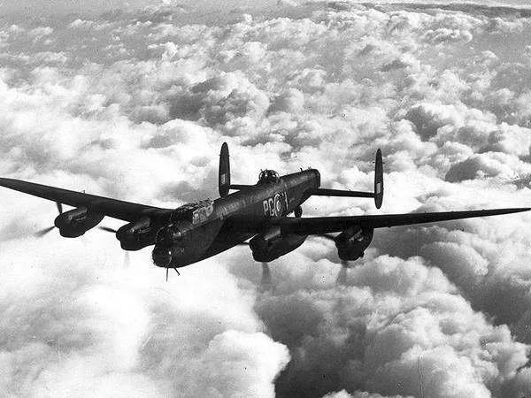

这时候美英的轰炸机已经在德国上空铺天盖地了。为了摧毁德国的战争潜力，美英航空兵是下了大力气的。一次轰炸行动，美英往往出动一千架重型轰炸机和同等数量的远程护航战斗机。

整个对德战略轰炸行动，美英损失飞机4万架，空勤人员死亡超过9万人，死亡率仅次于德国的潜艇部队。德国人被炸死炸伤100余万人，无家可归者750万人，不得不把200万人和一半以上的空军用于防空作战。

1944年5月12日以后，英美空军调整了战略轰炸重点，集中轰炸德国的燃料工厂。施佩尔说：“这是决定这场技术战争胜负的一天。”到7月，德国所有的主要炼油厂都被盟军的轰炸破坏，失掉了90%的燃料供应。巴顿曾说：“我的士兵可以吃皮带，但我的坦克必须加油。”德国生产出来的大量武器，因为缺乏燃料和运输工具，根本无法投入前线作战。生产再多，又能奈何？何况本来就生产得不多。

1944年6月，英美开辟了第二战场。德军不仅要与全欧洲几乎所有国家作战，而且要和未来两个超级大国同时作战。仅仅一次诺曼底登陆，盟军就投入总兵力约278万人，飞机13700架，舰艇9000余艘。

到1945年1月，德军在西线靠着1000辆坦克对付盟军的6000辆坦克，在东线靠着4800辆坦克和自行火炮对付红军的14000辆坦克。至于飞机数量差距更大，在东线，德军以1500架战斗机对付红军的15500架，西线则更为悬殊，美国陆军航空队在1945年1月1日保有飞机为72726架（其中作战飞机41961架），主力都集中在欧洲战场。德国的陆军和空军被盟军航空兵打得基本上没有还手之力。

例如，1944年7月25日，在西线德军精锐的130李尔装甲教导师阵地上空，先是来了一波波雷电式攻击机，两分钟一个批次，每次50架，投下了无数高爆炸弹和凝固汽油弹。400架中程轰炸机随之而来，投下一串串500磅重的炸弹。尘埃尚未落定，又来了铺天盖地的重型轰炸机群，这是1500架B－17空中堡垒和B－24解放者，投弹3300吨。收尾的是300架P－38闪电式战斗轰炸机，再次用杀伤炸弹和凝固汽油弹把阵地炸成一片火海。一天之内，这个装甲师防守地域变得象月球一样荒凉，官兵被炸得只剩一半。当美军第3装甲师扑上来的时候，李尔装甲教导师只有7辆坦克还有战斗力。

**二次大战是钢铁的较量，各国军事上的表现基本上与各国的工业能力成正比。**

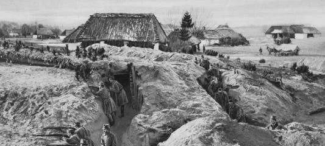

一战是堑壕战的高峰。对于由铁丝网、机枪和堑壕组成的防御阵地，各国军队几乎都没有找到好的办法，基本上谁进攻，谁倒霉。在索姆河战役的第一天，仅英军就伤亡6万多人。在这种情况下，没有多少战术可言，战争成了胶着战、消耗战。从1914年开始到1918年战争结束，西线交战各方丧师数百万，战线却没有多少变化。

但是，正如英国军事学家富勒指出的，到了一战后期，由于飞机、坦克和毒气等用于军事，机动性得以再生，进攻再次成为一种优势的战斗形式。

1918年英军发起的康布雷战役已现端倪，1918年8月，英法联军实施亚眠战役，投入坦克670辆，在飞机的配合下，当日突破德军纵深11千米，歼敌2.7万人。大规模坦克部队和飞机出现以后，堑壕战僵局的改变，已经确定无疑了。

在一战以后，欧洲各主要军事大国的有识之士均意识到机械化战争的来临。英国有里德尔·哈特、富勒，法国有戴高乐，德国有古德里安，苏联则有图哈切夫斯基元帅和红军副参谋长特里安达菲洛夫。

苏联在20年代后期到30年代初，军事思想非常活跃。他们开始发展了大纵深作战理论，即在主要作战方向上集中优势兵力，大量使用坦克兵、航空兵和空降兵等新兴兵种，实现连续不间断地向纵深突破。

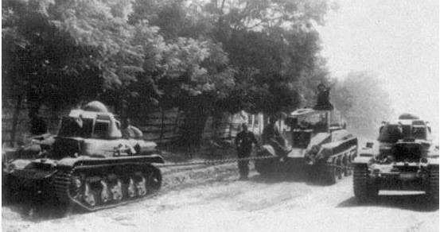

1930年代中期，苏军在机械化战争的理论探索和实践上已经走在世界前列。斯大林在第一个五年计划中，就利用计划经济的威力，大量生产机械化部队所需要的装备。1932年，苏军就组建了首批两个机械化军，比德军组建第一个装甲师要早三年。1935年9 月，苏军举行了震惊世界的基辅军区大演习，参演部队6.5 万人、1000多辆坦克、600 架飞机，演练了机械化部队与步、骑兵协同突破敌防御纵深等课题，并首次实施空降行动。这时的苏军装备坦克已经达到15000辆以上，悄然成为世界第一坦克大国。

后来由于大清洗，特别是图哈切夫斯基元帅的被清洗后，大纵深作战理论没有持续深入地贯彻下去，但是也没有彻底废止。

1943年，苏联军事工业已经从战争初期的灾难中恢复过来，经过艰苦的大迁徙和建设，从乌拉尔到中亚的军工基地体系完整，炉火正红。当年苏联生产坦克24000辆，1944年生产29000辆。而且，英美的战略物资源源不断地运到。到1944年4月为止，苏联从盟国接收了220,817辆卡车，整个战争期间共接收了427,000辆卡车，数量上超过了二战期间德国卡车的总产量，而且质量更好。苏军的通信联络装备水平也有了大幅度的提高，加强了部队作战的协调性。仅美国就提供了95.6万英里电话线，3.5万个无线电台，38万部野战电话。大规模坦克部队的组建和几十万部队的协调一致的战场快速机动从此成为现实。

在战争中后期，德军已经打不出一次像样的闪电战。闪电战对付缺乏战略纵深的小国最为有效，对付苏联这样的大国就不行了。

1940年德军进攻法国，战场面积19.38万平方公里，德军平均每51平方公里有一架飞机，每75平方公里一辆坦克，而在1941年进攻苏联的时候，战区面积为107.625万平方公里，平均每245平方公里只有一架飞机，每291平方公里一辆坦克。德军1940年在西欧日均推进速度为30公里，以这样的速度，要打到巴巴罗萨计划设定的伏尔加－阿尔汉格尔斯克一线，要连续不断地走一百天，这还不算苏联恶劣的气候、落后的道路给装备带来的严重损耗。

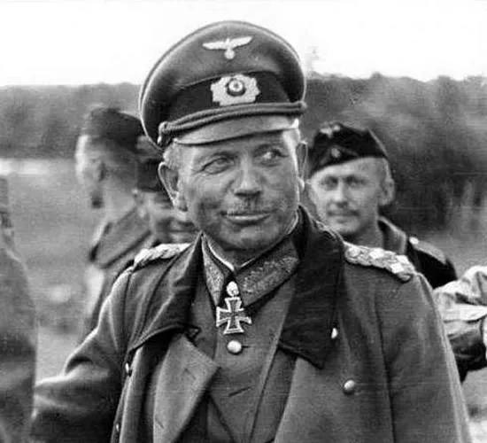

古德里安在谈到对苏作战的原则时说：“一切在于快！要快的让敌人得不到喘息的机会，快的让敌人没有爬起来的机会，没有从容集结兵力和布防的时间。一旦它爬起来，做好了搏击的准备，你就很难再打倒它了。因而迅速攻克敌方首都，对着敌人的神经中枢戳一刀，敌人的抵抗便会陷入瘫痪。”

**因此，一旦苏联依靠广阔的战略纵深，把战争打成了持久战，闪电战威力顿失。**

在1943年的库尔斯克战役中，靠着层层的雷场、反坦克壕以及纵深兵力配置和火力配系，挡住了德军最强大的装甲部队的突击。

而且，德军逐渐失去了闪电战的物质条件。战争后期发展起来的虎式坦克，其装甲防护力和火力惊人，但是机动能力不行，跑100公里就得加油，跑1000公里就得送回工厂大修，经常出现机械故障，又容易陷入沼泽之中。豹式各方面都不错，可惜数量太少。闪电战所依赖的进攻型空军情况则更加糟糕。随着英美对德战略轰炸的全面展开，德军不得不把飞机生产的重点放在防空的歼击机上，而不是用于支援地面部队的强击机和轰炸机上。就连有限的歼击机，也主要用于西线和本土防空作战。

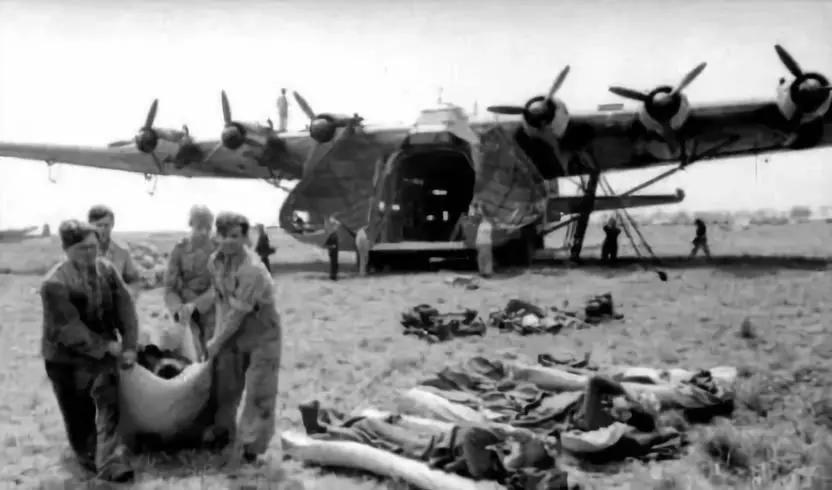

从1943年3月起，德国作战飞机在西线的损失就开始持续大于在东线的损失。

1943年7月初，德国空军共有飞机7080架，仅仅7、8月两个月里就在东线损失了1030架、在地中海损失了1032架、在本土防空中损失了1151架，合计损失3213架，几乎丧失了一半的作战力量。1944年初，东线德军与苏军飞机的对比是3073架飞机对8813架，1944年6月则是2796架对14787架，根本谈不上在东线掌握制空权或者有效支援地面部队。

不仅如此，德军连组织防御也非常困难。德军在防御上基本遵循的是1918年鲁登道夫时期的模式，即由步兵分队实施纵深防御，兵力主要用于预备队而不是配置在一线。当敌人进攻的时候，一线兵力可以适当后撤，然后发动迅猛的反突击击退入侵者。西方研究苏德战争的权威学者Glantz指出，这样的防御要行之有效，需要三个条件：一是有足够的步兵建立防御纵深；二是敌方步兵没有实现摩托化，无法迅速发展进攻；三是德军指挥官要有因地制宜选择防御地点和灵活处理的权力。但是，在战争的中后期，三个条件一个也不具备。

由于兵力枯竭，德军一个师的防御正面很宽，无法形成兵力纵深配置，很多地域不得不通过大量布雷来代替。苏军的快速机动能力已经在德军之上，一旦突破，德军根本来不及构筑下一道防御体系。更重要的是，希特勒完全剥夺了德军指挥官灵活防御的权力，而是坚持寸土必争，不得放弃任何重要的交通枢纽和筑垒地域。

在战争末期，希特勒甚至下令，士兵可以就地处决命令他们撤离的军官。日耳曼民族打仗一直有委托式指挥的传统，上级只是告诉下级战斗应当达成的目标，至于具体怎么打，由下级根据实际情况灵活掌握。正如十八世纪普鲁士名将塞德里兹所说：“在会战之后，国王可以随他的意思来处分我的头脑，可是在会战之中，他却应准许我用自己的头脑。” 但是，苏德战争后期，德军的优良传统荡然无存，只能听任苏军包抄、包围和最终歼灭。

1941年9月18日，苏军在叶利尼亚战役中击溃了德军，取得了卫国战争以来的第一次重大胜利，苏联国防人民委员会发布第308号命令，把战功卓着的4个步兵师改称近卫师，1690年彼得大帝创立的近卫军重新回到俄罗斯大地上。近卫军官兵均佩戴“近卫军”胸章，拥有最好的武器，最高的薪金，从事最艰巨的战斗任务。苏军规定，近卫军的军官领取一倍半的薪金，士兵则是两倍。为了维护近卫军的威信，苏军明确规定，近卫军不能用来打杂，在进攻时必须用于完成最重要的任务，防御时则用于反突击。

1943年1月，苏军决定换发新军服，指挥员原来的大红领章被象征俄国军官传统的大肩章所取代，原来代表工农的朴素军服焕然一新。在这紧张的战争时期，为了让军官穿上真正象样的军服，苏联专门向英国定购了礼服肩章用的金穗。

1943年8月5日，为庆祝奥廖尔和别尔哥罗德的解放，斯大林决定按照俄罗斯古时候的传统，在莫斯科以124门火炮齐鸣12响，同时燃放礼花。从此以后，红军每当取得一次重要胜利，隆隆的礼炮声就在莫斯科响起。18天之后，红军攻克哈尔科夫。哈尔科夫战略地位十分重要，曾经在苏军和德军之间数度易手，为此，礼炮改为224门火炮齐鸣20响。在鸣放礼炮前，苏联所有的广播电台转播最高统帅部的嘉奖令，嘉奖立功的部队番号和指挥员。有一次，嘉奖令播出时提到了乌克兰第1方面军，却漏掉了方面军司令员科涅夫的名字，斯大林立即下令重新广播。随着红军从胜利走向胜利，莫斯科的礼炮越来越频密，规模也越来越大。1945年5月9日庆祝战胜德国时，莫斯科1000门火炮齐鸣30响。

**重奖的反面是重罚，苏联对投敌、动摇的人毫不留情。** 开战仅仅一个月，苏军基辅会战失利，最大的一个重兵集团被围歼，西方面军司令员巴甫洛夫大将、参谋长克里莫夫斯基赫少将，西方面军通信主任格里高利耶夫少将，第四集团军司令员科罗布科夫少将被判处枪决，立即执行。1941年8月16日，斯大林签发大本营第270号命令：“凡在战斗中撕下肩章和投降者即为最可恶的逃兵，其家庭成员因其违背军人誓词、背叛祖国应予逮捕。此类逃兵应就地枪决。凡陷入包围者应战斗到底，冲出重围回到我方。凡宁愿屈膝投降者，应以一切手段予以消灭。对投降的红军战士的家属，应剥夺其享受的国家补贴和救济。”

严格的战场纪律在残酷的斯大林格勒战役中得到了最坚决的贯彻。1942年夏，德军猛扑高加索油田，苏联巨大的战争机器有因为缺乏燃料而停止转动的危险。渡过伏尔加河参加斯大林格勒巷战的苏军官兵，平均存活时间不超过24个小时。

此时，斯大林签署了国防委员会第227号命令，要求在各集团军建立3-5个阻截队，放在不坚定的部队后面，把惊慌失措者和胆小鬼就地枪毙。

1942年9月，在斯大林格勒外围战中，德军霍斯的装甲集团军所向披靡，苏军节节后退。一个步兵师因为逃亡人员过多，师长下令全师列队，在训话之后，他举起手枪，走向前排，挨个数数，每数到十，就把士兵当场枪决，直到把弹匣中的子弹全部打光。

对古罗马历史有所了解的人都知道，这就是有名的十一抽杀律，一种专门针对临阵脱逃的部队的刑罚。俄罗斯对此并不陌生，沙皇军队中就盛行此法。1918年，为了提高刚组建的苏军的战斗力，托洛茨基也动用过十一抽杀律。

根据Antony Beevor的记载，在整个斯大林格勒战役中，苏联内务部队总共处决了13500名军官和士兵。二战期间，仅从档案记载的数据统计，被苏联军事法庭判处死刑的官兵有15.7万人。

**国运相赌的残酷战争中，在一切为了胜利的前提下，生命只是低值易耗品。**

对此，苏联的选择是简单而毫不犹豫的。1941年9月，德军在进攻列宁格勒时，把苏联的老弱妇孺赶在前面，防守部队一时不知所措。斯大林得知后，立即下令不要心慈手软，要狠狠打击敌人及其帮凶。

当年11月17日，斯大林发布0428号训令， **指示苏军组建特遣部队，穿上德军军服，在敌后焚烧和毁灭居民点，以激起苏联平民对于德军的仇恨。**

在斯大林格勒战役中，为了躲避苏军的狙击手，德军常常诱使苏联的小男孩与小女孩帮他们去伏尔加河边取水。红军发现以后，对这些孩子毫不留情地予以射杀。

艾森豪威尔在回忆录中还记述了这么一件事。

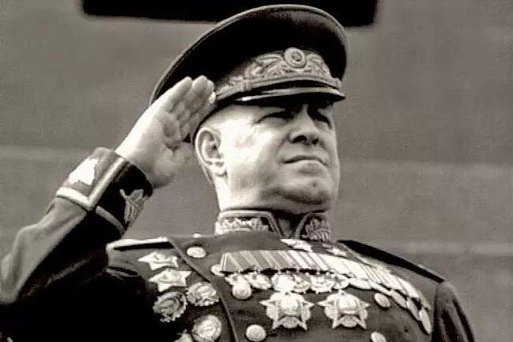

战后他见到朱可夫元帅，谈到盟军对如何通过德军的雷场深感头疼。朱可夫告诉他，地雷有两种，一种是防步兵的，一种是防坦克的。当苏军面临雷场的时候，步兵直接发起攻击，就像通过无雷区一样。步兵在这个过程中因为触雷造成的损失，不会比通过德军重兵防守的无雷区大。只要步兵在雷场那边建立了桥头堡，工兵就可以从容地扫除其他地雷，为装甲部队的跟进扫清障碍。艾森豪威尔感叹，这种做法确实有效，但是盟军是万万学不来的。

为了防止内部的叛乱，苏联甚至把整个整个的民族流放。从1941年至1944年，伏尔加流域日耳曼族、车臣族、印古什族、克里米亚鞑靼族等10个民族被迫从它们的传统居地全部迁移到遥远的中亚和西伯利亚地区，原来的自治共和国和自治州的建制被撤销。连同被部分强行迁移的少数民族在内，总共达500余万。

与苏军相比，二战时期的德军不仅在战斗技能上高出一筹，而且其战斗意志也绝对不在苏军之下。 **两个民族均表现出了高度的战斗意志，也只有这样的民族之间，才能打出一场总体战。**

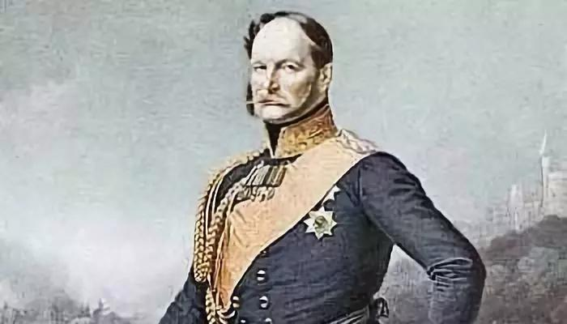

现代的德国是由普鲁士主导下完成民族统一大业的，在各个方面都打上了普鲁士的印记。而普鲁士是一个在贫瘠荒凉的土地上、在强敌的环伺中崛起的国家，以军事立国，按照法国米拉波伯爵的说法，这不是一个有军队的国家，而是一支有国家的军队。

纪律、秩序、忠诚、服从，是普鲁士引以为豪的美德，并逐渐成为德国人的民族特性。希特勒还强化了德军的纪律，实行残酷无情的军法。一战中德军只处决了48人，二战时期处决的官兵则在15000人以上。

苏德战争期间，双方军队都出现了大量针对平民的暴行。但是德国国防军的暴行主要是执行命令，而苏军的暴行则多是自发的。

在莫斯科战役中，古德里安的第2装甲集团军前有强敌，后无援军，所有的坦克和装甲车辆都被冻住，官兵们依然冒着零下52度的严寒，徒步发起进攻。当苏联在莫斯科城下开始大反攻的时候，德军部队就地转入防御，在风雪中苦苦支撑。

在斯大林格勒战役后期，被包围的德军第六集团军10万残军每人每天只能分配到一片面包，15个人分食1公斤土豆，每人每天只能领取30发子弹。即使这样，饥寒交迫的德军还是忠实地执行了希特勒抵抗的命令，给进攻的苏军造成了巨大损失。

曼斯坦因元帅曾经谈到，“有许多指挥官和参谋人员在假期届满之后，纷纷飞回包围圈中，这已经是一件令人痛心的事情。这些军官——有许多都是系出名门的，例如俾斯麦和比罗的后人——他们自己都坚决要求返回部队，这证明德国军人的自我牺牲和袍泽友爱传统经得起最严格的考验”。

在战争的最后阶段，德军几乎与全世界作战，四面楚歌，稍有理智的人都认识到战败已成定局，即使在这样的情况下，德军的士气还是没有出现整体性崩溃。在整个战争过程中，德军可以被歼灭，可以投降，但是很少出现溃不成军的情况。

二战时期，德军中的官兵关系非常好，极为注重集体主义精神。希特勒上台以后，国防军传统的贵族和平民的界限不那么严格了，军官和士兵更趋平等。而且，德军向来把来自同一个地方的士兵编在一个部队，强化了士兵的归属感。

德军的入伍训练“都是以班为单位完成的，让士兵从一开始就有集体概念，培养自己是集体一员的习惯，换句话讲就是训练士兵如何协同作战。

比方说，当军队接近战线时，在敌人火力下，一个班只准一个兵前进，其他都是火力掩护，后面的先跃进，在状况许可之下，可以有两人一起行动，但是人数不能再多。火力掩护者不需要一直使用武器，只要有准备，前进的人就能得到安全的保障。德军如此的用意是训练军队团体行动，不塑造个人英雄”。

美国记者威廉·夏伊勒则在《柏林日记》中谈道，二战时期的德国国防军与一战时期相比，军官和普通士兵之间那种巨大的鸿沟消失了，“他们好像就是置身在一个大家庭之中。甚至连敬礼都有了新的含义：普通士兵之间也经常相互敬礼，这对他们来说更多的只是一种问候，而不是对于更高级别的军衔的一种认同。在咖啡厅、餐厅、餐车以及在卸下了责任的业余时间里，军官和普通士兵们可以围坐在桌子旁自由地交谈，而这种交谈是一种男人与男人之间的对话。这样的情景在上次世界大战中几乎是不可想象的。”

作为一个后起的单一民族国家，德国的民族凝聚力超过苏联。在苏德战争中，苏军曾经出现大量叛军。曾任集团军司令、在莫斯科保卫战中立下大功的弗拉索夫是最有名的一个，他投降后曾经组织了10万俄罗斯解放军。此外，德军中有一些师级、团级的俄罗斯志愿军，甚至还有80多名驾机叛逃的苏联飞行员组成了一个由原苏联空军上校维克托·马尔采夫指挥的战斗群。

如果再加上为德军提供后勤服务的人员，苏联人在德军中的人数将近百万，死亡超过20万。但是德军则没有出现为苏军作战的情况，只有不到一万的德军战俘为苏军提供战场宣传服务。

斯大林格勒的德军败将塞德里茨曾经想过组织一支为苏军打战的德军部队，没有成功。

如果追溯到德国人的深层心理，就会发现， **在这个民族严谨、刻板和高度服从的表面下面，是一颗永远躁动不安的心灵。** 这可以从北欧神话、日耳曼人祖先的神话找到端倪。在所有人类先祖的神话中，北欧神话是最为庄严、沉重、壮烈和狂暴的。那里没有爱琴海蔚蓝的天空和明亮的阳光，而是茫茫暗夜中冰与火的世界。那里没有神与人欢乐的聚会和幸福的爱情，而始终是战斗与毁灭。

那里的众神不是永生的、幸福的，而是最终要在与魔界的搏斗中玉石俱焚。但是，即使清醒地意识到最终的结局，也要与优势的敌人做绝望的战斗，在杀戮和毁灭中、在意志的张扬中感受到极度的快乐。在这样的神话中成长起来的日耳曼民族，一直有着刚健、阴暗、狂暴的气质。

在上古时期，日耳曼人一直在迁徙、战斗，一个又一个部落在罗马军团的刀剑下全体覆灭。在中世纪，北欧的海盗让整个欧洲不得安宁。到了现代，理性主义大行其道，但是那种来自民族集体无意识的深层次的气质始终没有消失。

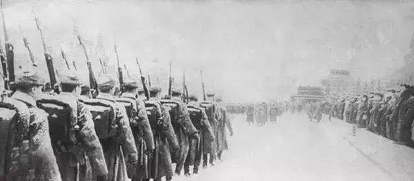

**苏德战争对战后的苏联影响深远。**

一方面，战争空前地振奋了苏联的民族精神，提升了民族自豪感和自信心。在随后的几十年中，苏联发展成为一个超级大国。它把第一个人造卫星送上了太空，它的核武库能够把世界毁灭数次，它在东欧建立军事势力。

另一方面，战争又进一步强化了苏联的国家体制、经济结构和军事战略。二战后，苏联又开始认认真真地准备第三次世界大战，一直准备到民穷财尽，成为历史。
