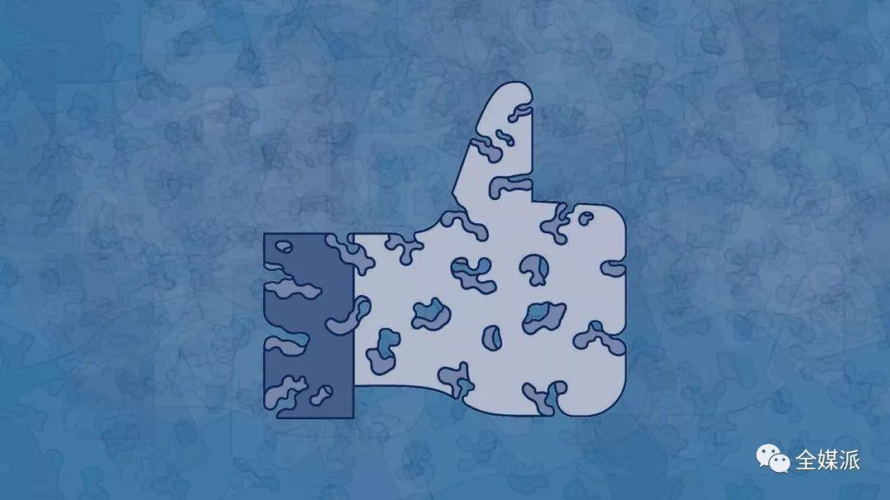
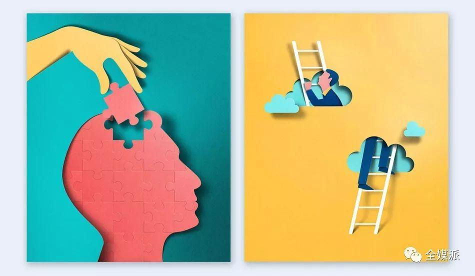
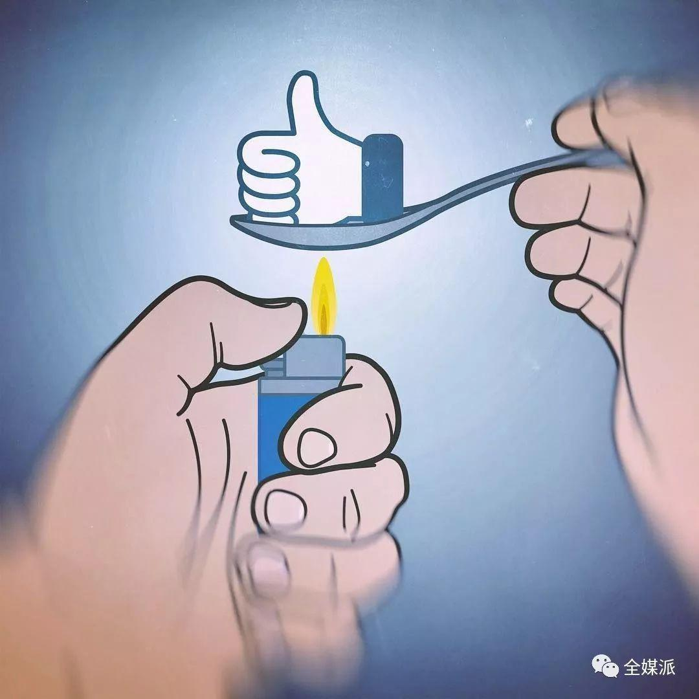

## Facebook为什么要在澳洲市场隐藏点赞数？  

> 发布: 全媒派  
> 发布日期: 2019-10-24  

编者按：本文来自微信公众号[“全媒派](https://mp.weixin.qq.com/s/iEPwNfoIwUt79lfmUqcwhg)”（ID：quanmeipai），作者腾讯传媒，36氪经授权发布。

近日，Facebook的部分用户注意到，页面中的点赞计数消失了。

与旗下的Instagram一样，Facebook正在部分地区进行隐藏点赞数的测试（Facebook的测试在澳大利亚进行，Instagram的测试则在加拿大进行）。在新的页面中，用户收到的点赞数将不再被显示，但他们仍然可以看到哪些人给自己点了赞，然后一个个数出总数——如果他们愿意的话。

如此大费周章地去隐藏一个看起来无关痛痒的功能，似乎显得没有必要，尤其是隐藏的点赞数还可以被间接找回。但Facebook表示他们的目标是让用户能更舒服地表达自己，并提高所发布内容的质量。他们还希望通过这项举措减缓用户发帖时的不安全感，规避从众心理的影响。但是，这些变化真的有科学依据吗？

本期全媒派\(ID：quanmeipai\)编译澳大利亚计算机科学学者Marian-Andrei Rizoiu的文章，带你看看Facebook隐藏点赞数的举动背后，有哪些小心机和大学问。

### MusicLab模型：“危险”的人气

要研究Facebook隐藏点赞数的动机，还得从一项十几年前的实验说起。

2006年，美国研究者Matthew Salganik、Peter Dodds和Duncan Watts着手调查他们在文化市场中观察到的作品质量与人气脱节的现象。他们设计了一项名为MusicLab的实验，用户可以在线收听来自未知乐队的歌曲，然后选择下载他们喜欢的歌曲。

实验中，用户被分为两组。对于第一组用户，歌曲是随机播放的，没有提供任何信息；而第二组用户则被告知每首歌曲的下载次数。下载量是衡量一首歌曲受欢迎程度的重要指标，与Facebook帖子的点赞数一样。

实验结果非常有趣。当显示歌曲的下载量时，这个小型的“音乐市场”就变得高度不平均（某一首歌的人气会远远高于其他歌曲）和不可预测（重复实验时，最高人气的歌曲往往不是同一首）。

基于这些结果，澳大利亚研究者Andrés Abeliuk等人于2015年提出了MusicLab模型，这是第一个用以解释文化市场上内容如何变得流行的模型——为什么有些作品会受到所有人的欢迎，而大部分内容却毫无人气？最重要的是，为什么公开人气数据（例如下载量）会带来危害？

他们认为，人们对在线产品，例如一首歌曲的消费，是一个“两步走”的过程。第一步，用户根据它的“吸引力”（appeal）选择是否要点击；第二步，用户根据质量决定是否要下载。而实验证明，一首歌的吸引力很大程度上由它目前的人气决定。如果其他人也喜欢某样东西，我们往往会认为这个东西值得点进去看一看。

因此，一首歌的下载量取决于它目前的吸引力，而其吸引力又取决于它目前被下载的次数。这就是著名的“富者愈富”效应（rich get richer）。一个产品或想法未来的人气也取决于它过去的人气。

### “富者愈富”，思想市场同理

MusicLab实验和社交媒体的对应关系是十分明显的：歌曲对应用户发布的帖子，而下载量则对应点赞数。对于音乐市场而言，MusicLab实验证明，公开人气数据（下载量）意味着我们所消费的文化产品的多样性减少，并且一些高质量的产品可能会被忽略。

而在Facebook这样的思想市场（Marketplace of Ideas）中，这种影响更加严重。“富者愈富”效应不断累积，就像滚雪球一样。某个想法的人气可能会呈指数级增长，然后迅速占领整个市场。

因此，用户总是会想法设法去尽快积累帖子的人气，从而增加在市场上曝光的机率，无论其质量如何，它都拥有强大的先发优势。这种先发优势也在一定程度上解释了为什么假新闻总是能在很长一段时间内压制后来澄清的新闻，以及为什么总是很难用正确或更健康的观点来取代先前错误或有害的观点。

另外，“思想市场”并不能保证高质量的内容流行起来，尽管它时常如此宣称。有研究表明，有些时候高质量的想法的确会脱颖而出，但想要预测究竟哪个会流行起来，几乎是不可能的。换句话说，质量似乎与人气无关。

### 前路黯淡？亦有良方

以上实验和理论似乎给网络社会描绘了一幅前路黯淡的图景——假消息能在网络媒体中横行霸道，占据公众的注意力。但是别忘了，MusicLab实验中还有另一组用户，他们没有被告知关于歌曲的任何信息。而这一组实验结果，给了我们一个解决方案，或者至少是一些启发。

研究人员称，隐藏歌曲下载量带来了一个更公平、可预测的市场，歌曲的人气更平均地分布在诸多竞争者中，与质量的相关性也更强。

同理，Facebook隐藏点赞数的决定也许对每个人都有好处。它不仅减缓了发帖者的压力、焦虑和嫉妒心，也能够建立起一个更公平的信息交换环境。另外，如果用户不再花大量的时间和心思去琢磨纯粹为了吸引点赞的技巧，我们或许还能看到发帖内容质量的提高。
