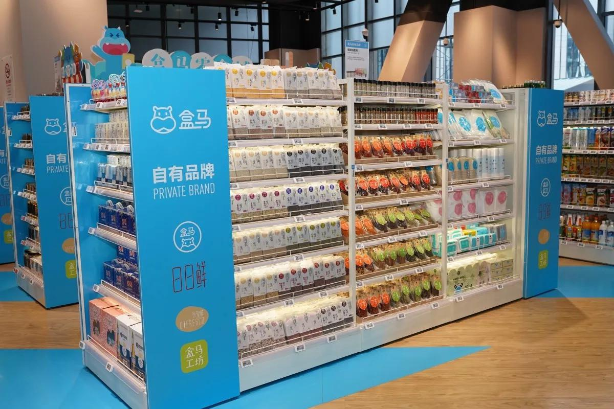

## 焦点分析丨不甘心给别人当搬运工，“盒马牌”自立门户  

> 发布: 彭倩  
> 发布日期: 2019-10-24  

为了在激烈的市场竞争中挣得更大赢面，国内零售商们纷纷做起了自有品牌的生意。

盒马或许是其中步伐很快的一个。10月20日，盒马全国标品采购总经理赵家钰宣布，盒马自有品牌的销售占比已经超过10%，去年同期，这个数字还只有2至3%左右。其中日日鲜表现最为亮眼，已积累近千个SKU，跨越十多个品类。

上海国展中心目前已经成为盒马第一个自有品牌主题店，不仅拥有最多的自有商品，还首次设置单独的自有品牌货架。

国展中心店摆放大量盒马自有品牌货架

销售占比突飞猛进并非一日之功。成立的第一天起，盒马就设立自有品牌研发团队。2017年，盒马正式推出第一个自有品牌“日日鲜”，从最开始卖蔬菜，到后来增加鲜奶、鲜肉、鸡蛋、面点等，不断增加品类宽度，目前，日日鲜已经跨越十几个品类线。随后，盒马自主研发了主打熟食的“盒马工坊”，盐水毛豆、手工水饺和馄饨都已成为热销商品。

除了日日鲜和盒马工坊等在价格和包装上相对接地气的自有品牌，盒马还推出了更高端的“帝皇鲜”、“盒马牌”等自有品牌，其中帝皇鲜主打高端水产和肉类的冻品，而盒马牌则涵盖多个品类，包括米面粮油、零食、酒水，甚至杯碟碗盘和抹布等厨房用具。

10%的销售占比离盒马的期望还很远。2018年8月的盒马鲜生供应商大会上，盒马总裁侯毅曾立下军令状，希望盒马能在3年内，将自有品牌占比做到50%以上。

### 零售商扎堆做自有品牌

从零售行业的整体趋势来看，无论是线下商超便利店、还是线上的综合电商、生鲜玩家们都不约而同的做起了自有品牌生意。

在生鲜行业，盒马是首个披露自有品牌成绩的玩家，但并非唯一的入局者。

大部分生鲜玩家都动了心思，生鲜领域也掀起一股自有品牌热。2018年年底，为了帮旗下的自有品牌造势，永辉单独召开了一场发布会。在宣布主品牌“永辉优选”之外，永辉还表示将打造自有品牌矩阵，永辉优选将涵盖田趣、优颂、馋大狮、超级U选、Ofresh等多个子品牌，对应多个核心品类。随后每日优鲜、生鲜传奇等玩家也都开发出自有品牌。

生鲜玩家们入局并不算早。更久之前，商超便利店已经开始试水自有品牌。2007年，大润发在内地市场推出平价自有品牌“大拇指”，随后还针对不同人群，增加RT-Mart大润发、优纺、钻典等多个不同价位的自有品牌。2018年，物美集团也发布了自有生鲜品牌“每日鲜”。沃尔玛、家乐福、麦德龙等外资大卖场，在进入中国时，也曾将旗下自有品牌引入。全家、711等便利店还直接参与生产环节，纷纷创立了鲜食品类的自有品牌，利用自建的中央厨房和工厂制造一日三餐。

近两年来，综合电商平台也争相布局自有品牌，并主攻家居品类。一时之间，京东京造、苏宁极物、小米有品、网易严选、淘宝心选等品牌成为一股新的生活方式潮流。

零售商们为何在此扎堆？

一个重要的原因在于，自有品牌不仅利于零售商做好品控、拥有自主的定价权，还能更好的控制成本。在传统的品牌模式下，供应商获得非常大的红利。建立品牌生产产品，往往需要通过代理商、区域经销商、零售商等多个环节才能触达消费者，消耗大量的流通成本，大部分利润被削掉。而如今拥有大流量和强大销售能力的零售商可以利用自己的渠道优势开发自有品牌，打破供应商的垄断地位，盒马、沃尔玛都在做这样的事情。

此外，无论是生鲜领域、综合电商还是商超行业，竞争都很激烈，各大零售商和电商平台都需要差异化的商品，率先占领消费者心智。做自有品牌是一个很好的解决办法。由于自有品牌商品只能在本品牌的门店进行销售，在其他场所无法购买到该种产品，也就塑造了差异化定位，区别于普通的零售门店和平台。

大多数零售商还会针对不同的人群和不同的商品问题开发多个自有品牌，盒马、大润发等都是如此。一般而言，低价自有品牌属于会员福利或是一种消费折扣，主要目的是增加消费者的粘性，例如大润发的大拇指品牌。而平价自有品牌则主要起到解决商品的结构化问题、补齐商品功能的作用。盒马日日鲜虽然定价不低，但利润微薄，主要起到带销量的作用。高价自有品牌则是解决商品的核心竞争力问题，在提升品牌溢价能力的同时还能实现差异化。盒马就曾针对高消费人群提供帝皇鲜等自有品牌。美国的Byerly’s超市也曾开发一种名为“Wild Rice Soup”的高价位汤料自有品牌，消费者慕名前来，该汤料也成为其差异化利器。

### 自有品牌没那么好做

各路零售商扎堆自有品牌，为这个市场添砖加瓦。但现状是，中国零售业自有品牌的处境仍十分尴尬。

尼尔森最新发布的《全球自有品牌报告》显示，当前北美地区零售业的自有品牌销售份额为18%，欧洲地区达到30至40%，而中国只有1%左右。从积极的一面来看，这是一个蓝海市场，大有可为；但反之，国内自有品牌市场发展缓慢是由于其面临不小的困境。

国内自有品牌为何会落入这样的窘境？侯毅曾谈到根本原因：“中国的自有品牌讲了无数年，由于我们的制度不健全，中国的自有品牌到今天为止跟全世界比几乎可以忽略不计。”

这种制度不健全指的是长期以供应商为主导的零供关系，这令供应商占据绝对话语权，商家和消费者只能被迫配合。例如，在做自有品牌之前，大润发等商超在向某品牌供应商进货时，不仅需要引入该品牌供应商旗下所有的商品，还要承担库存压力。这都挤压了零售商做自有品牌的空间。

盒马凭借流量和品牌优势，正在试图重新建立规则。不同于直接对接工厂的模式，盒马做自有品牌的方式是买手制——在这种模式下，自有品牌并不仅由盒马团队开发，而是由供应商专供，盒马来买断单品的供应权。

但这其中，规划好产品结构、挑选合适的供应商和制造商都十分关键，而每一步都不容易。

以产品结构规划为例，一般而言，消费者会根据门店呈现商品的货架数量决定购买行为，如果自有品牌的货架数量高于品牌商供应商，会导致消费者会更倾向于自有品牌，此时品牌供应商的利益将受损，在这种情况下，双方往往会发起价格战，此举无疑是增加零售商门店的营业负担。而占比过低则达不到开发自有品牌的目的，无法更好的控制成本、打差异化策略。盒马提出要在三年内将自有品牌销售占比做到50%以上，但照沃尔玛（占比30%以内）、Costco（占比25%左右）等耕耘自有品牌多年的玩家来看，50%这个目标短期内很难达成。

国外无论是亚马逊等电商还是沃尔玛、Costco等大卖场，都基于全球供应链来开发自有品牌，商品往往更加国际化和标准化。而国内自有品牌行业大部分是区域供应链的产物，缺乏统一标准，往往是企业自行制定标准，且大部分低于国标。在行业标准之外，零售商还需要对内进行组织架构的调整，树立内部标准，建立独立的自有品牌部门和独立的自有品牌考核体系，但目前除了盒马等个别零售商，大部分玩家并没有做出相关调整。

自有品牌的一大初衷是为了帮零售商实现差异化策略，在品牌和价格上做出变化。但现状却是，大量零售商推出的自有品牌存在同质化严重，单纯靠低价吸引消费者的问题。

不少零售商对于做自有品牌这件事依然态度谨慎。苏宁曾向36氪表示，自有品牌苏宁极物仍处在试水阶段，目前不会扩大范围。这种谨慎在于，零售商开发自有品牌，虽然商品毛利高，但若要对上游进行强管控，不仅需要投入大笔资金买断代工厂产品的资金，还需要扛库存压力，风险很高。虽然以新兴生活方式品牌和渠道的面貌出现，但网易严选采用的也是这种模式，目前它也面临数十亿的高库存压力。

零售商们正试图通过开发自有品牌打破传统的零供关系，也为自己在激烈的市场竞争中多添一道筹码。
