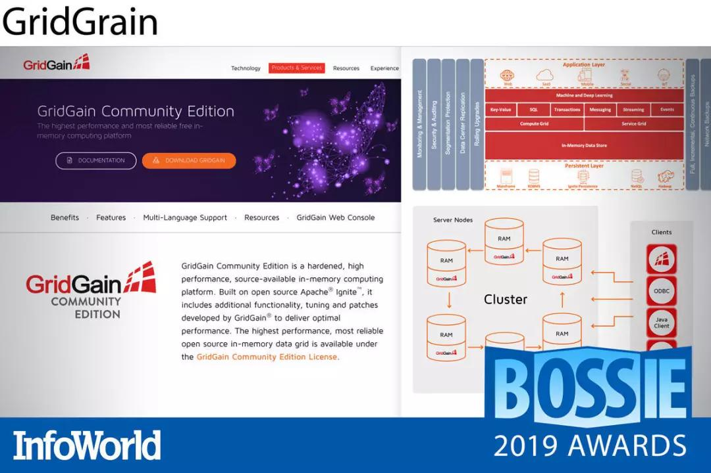
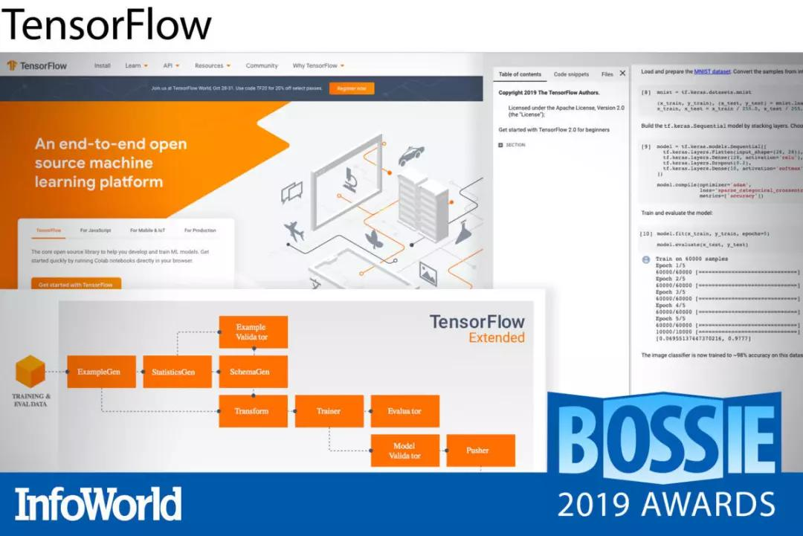

## Julia、Delta Lake榜上有名！2019年最佳开源软件奖公布  

> 原创：  
> InfoWorld  
> 发布: AI前线  
> 发布日期: 2019-10-08  

 策划 | 蔡芳芳  作者 | InfoWorld  译者 | 核子可乐  编辑 | 陈思  **AI 前线导读：** 如今，软件开发、云计算、分析、机器学习以及几乎所有新兴领域中最重要的软件几乎都拥有开源身份。有时候，甚至存在多家彼此激烈竞争，且各自皆拥有雄厚实力的技术企业在支持这些开源软件项目的发展，希望利用它们解决企业计算中存在的重大难题，并进一步重塑企业级基础设施与应用程序的新面貌。

十多年以来，InfoWorld 一直致力于评选 InfoWorld Bossies 年度最佳开源大奖，旨在发现那些最有趣、最具创新性的开源项目。在刚刚开始评选时，获奖开源项目往往体量很小，而且一般只为企业开发人员以及 IT 部门所熟知（除了 Linux 或者 BIND 等少数例外情况）。然而，其仍然具有极高的实用度，而且完全免费。

近日，2019 年 InfoWorld Bossie 榜单正式公布，在今年的获奖名单中，大家不仅能够找到全球最出色的开源软件，它们同时也代表着目前软件行业的最高水准。

**更多优质内容请关注微信公众号“AI 前线”（ID：ai-front）**

**BPF Compiler Collection**

扩展 Berkeley 数据包过滤器（简称 eBPF）在 Linux 世界上可谓声名显赫，它正在逐步取代 iptables 等网络支持工具，并以更实用且更安全的方式降低观察工具在内核空间中的运行剧本。

BPF Compiler Collection 以高效观察作为设计的核心目标，这套集合包含由 Python 或 Lua 语言创建并运行的一组 eBPF 代码编译器工具。该项目中还提供大量示例程序，可面向代码内存分配以及 HTTP 数据包等任务运行跟踪及全域筛选。

Netflix 公司主内核性能工程师 Brendan Gregg 的新书《BPF 性能工具（BPF Performance Tools）》即将出版，相信届时又将掀起新一波 eBPF 人气飙升。因此，推荐大家在这波浪潮来临之前抢先一步学习了解。

**Wasmer**

WebAssembly——简称 Wasm——承诺带来闪电般的启动速度以及极低的占用空间，这也使其成为无服务器架构与物联网边缘设备的理想选择。Wasmer 在 WebAssembly 服务器运行时领域居于领先地位，其主要优势体现在接近原生水平的执行速度。事实上，单凭速度这一点，Wasmer 就足以技压群雄。

Wasmer 将各种独立的运行时与工具包结合起来，用于编译并定位 WebAssembly 二进制代码——包括嵌入至现有代码中的 WWebAssembly 模块、CLI 可执行应用以及二进制库等等。类似于 Node.js 之于 JavaScript，Wasmer 允许 WebAssembly 实现在广泛平台上的随处运行。

Wasmer 以 Cranelift 代码生成器为基础，提供涵盖 Go、C/C++、C\#、Python、R、Rust、Ruby 以及 PHP 的语言集成选项，同时支持 Linux、Mac 与 Windows 运行时（在 Windows 平台上采用 Emscripten 实现，因此尚处于实验阶段）。Wasmer 的类 NPM 工具包管理器 WAPM 同样表现出色，负责利用经过认证且可立即运行的各类库为产品带来进一步完善。

2019 年当中，Wasmer 进一步向 Cranelift 添加了两套补充性后端（包括通过优化提供执行速度更快的 LLVM 运行时），同时为 WASI（WebAssembly 系统接口）与 SIMD 并行性提供支持。WASI 正是应用程序跨操作系统可移植性的实现关键，而 SIMD 支持将为加密及视频处理等数学密集型应用带来巨大的性能提升。

**Language Server Protocol**

近年来，软件领域中又出现了不少卓越的工具链创新成果，其中的 LLVM 编译器框架就是一套用于实现各类编译器的出色库选项。而来自微软的 Language Server Protocol 就为软件开发人员提供了另一个强大的工具市场，能够在编译器或者语言工具链与用于创建代码的 IDE 或编辑器之间建立起顺畅的双向通道。

开发人员要求自己的编码工具能够提供实时反馈——除了对标准库函数进行静态查找之外，还应当包含与所编写代码相关的交互式详细信息。Language Server Protocol 通过用于开发工具与语言服务器间通信的 JSON-RPC 标准很好地完成了这一目标，该标准提供语言记录以及会话编辑自动补全等多种实用功能。

从 Ada 到 YANG，目前 Language Server Protocol 已经为数十种语言提供实现方案。

**Serverless Framework**

在降低运营开销方面，没有什么能够在效果上与无服务器架构相匹敌。但遗憾的是，降低开销通常也伴随着架构复杂性的提升以及云供应商锁定等问题。Serverless Framework 在无服务器应用程序与各类高人气云实现方案（包括 Amazon Web Services、微软 Azure、Google Cloud Platform 以及 Kubernetes）之间带来了具有供应商中立性的抽象解决方案。

Serverless Framework 不仅允许用户自由选择不同的部署目标，同时也能帮助大家更快更轻松地对事件驱动型函数即服务应用程序进行测试、部署以及管理。在创建函数、定义端点并指定目标云环境之后，Serverless Framework 即可对你的代码、安全性要求、资源要素以及云部署 YAML 进行打包，从而顺利完成项目部署。另外，该框架内置的自动检测功能也会立即开始监控并捕捉各项指标，从而提供开箱即用的通知功能。

该项目背后的开发人员们今年主要致力于通过实时监控、安全性与集成测试对 Serverless Framework 进行增强，从而确保其有能力深入整合至应用程序生命周期管理当中。新的规则允许用户管理凭证及访问策略，从而增强安全性并以可编程方式对这些资源加以利用。新的即插即用组件集合（目前仍处于 beta 测试阶段）则为从静态网站到全栈 Web 应用程序的多种常见用例带来显著的功能补充。

总而言之，Serverless Framework 为开发人员带来无缝化使用体验，从而消除了构建无服务器应用程序中的多种常见难题与陷阱。

**Istio**

微服务架构能够简化开发流程，但随着服务数量的爆炸式增长，对各服务间通信的管理也变得愈发复杂。植根于 Kubernetes 生态的 Istio 通过将发现、负载均衡、访问控制、加密、流量管理以及监控等功能集成至基础设施层级的解决方案当中，显著减轻了开发人员的服务间通信负担。换言之，开发人员将无需手动在服务当中应用这些管理逻辑。

Istio 立足一整套 Kubernetes 集群（常被称为「服务网格」）对各容器与编排服务加以管理。其利用 Envoy 代理“边车”充当服务网格当中各服务间所有通信的代理机制。用户可以通过高级抽象对集群中的网络进行随意变更，而后逐步推出，并在发现问题之后立即回滚。Istio 还能够生成与流量活动相关的统计信息，帮助大家快速获得符合需要的服务性能。

**Envoy**

作为 Kubernetes 的标准服务代理，Envoy 一直在不断发展壮大。在成为首个云原生计算基金会项目（甚至早于 Prometheus 与 Kubernetes）之后，Envoy 快速进入 Istio 与 AWS App Mesh 等服务网格的核心，并成为大部分 Kubernets 设置中不可或缺的组成部分。足以与 Reddit 比肩的大规模生产部署，也在客观层面证明了 Envoy 出色的规模化运作能力。

过去一年，我们迎来了 Envoy Mobile，该版本将 Envoy 的诸多优势（包括断路、重试处理、可观察性与一致性等）引入 iOS 与 Android 统一跨平台库当中。尽管尚处于早期发布阶段，我们对于 Envoy Mobile 在 2020 年的表现已经充满期待。

**Kong**

如果大家的主要工作是构建 API，那么速率限制、负载均衡、身份验证、日志记录等功能完全不需要重新实现。Kong 由 Mashape（即现在的 Kong 有限公司）于 2015 年推向开源，其能够提供这里提到以及没有提到的丰富功能。此外，该公司还提供 Kong Enterprise，一套基于开源内核构建的企业级 API 平台。

Kong 以开箱即用方式为我们提供应用程序堆栈内 API 集所需要的大部分功能。除了之前提到的主要功能之外，其还包含断路器、运行状态检查、OAuth、转换、缓存、地理位置复制等功能。即使未能默认提供，大家也完全可以通过 Kong Hub 从数十款插件中找到自己需要的其它小众功能。

Kong 还能够与各类云原生工具协同合作。希望将 Kong 与自己集群紧密集成的 Kubernetes 用户，可以使用 Kubernetes Ingress Controller for Kong，从而快速享受大量现成且成熟的功能。Kong Enterprise 版本不仅拥有更强大的支持能力，同时也提供专业级的自动化与可见性工具。

**Pulumi**

一般来讲，IT 基础设施要么需要以手动方式拼凑起来（非常费力），要么是通过需要调用数十个 API 的脚本组装在一起（极为复杂），或者是通过 Terraform 等工具执行配置文件（高度专用化）。Pulumi 提供了一种与众不同、通用度高且基本思路非常简单的方案，能够帮助我们轻松解决各类集成过程中的常见问题。大家不必勉力使用令人困惑的新工具或笨拙旧工具的组合，而可以选择你最熟悉且喜爱的常规编程语言以编程方式进行基础设施声明。是的，完全无需 YAML！

最重要的是，Pulumi 允许大家以相同的方式在全部主流云服务（Amazon、Azure、Google）以及一切 Kubernetes 系统当中实现基础设施的配置与管理。将云对象模型、运行时评估以及所需状态相结合，Pulumi 允许大家跨云配置并管理各类资源，包括无服务器代码片段、静态网站以及各类常见的应用程序或应用模式。

Pulumi 代码可以使用 JavaScript、TypeScript、Python 以及 Go 语言进行编写，其中涵盖绝大多数企业用例。另外，项目的示例库中也包含多种能够直接使用或者扩展的常用模式。

**Sysdig**

Kubernetes 与 Cloud Foundry 等云原生技术已经非常复杂，而一旦将微服务架构引入这套组合，那么监控工作的难度将提升到新的水平。Sysdig 为我们提供一组工具，不仅可以用于了解基于容器的应用程序的实际性能，同时也可帮助大家及时发现各类异常状况与安全威胁。

Sysdig Inspect 能够立足内核层级进行容器状态捕捉，帮助大家及时发现性能问题、跟踪趋势，并在发生严重性能瓶颈之前进行故障排查。而利用 Sysdig Falco，你可以为容器定义“常规”活动，Falco 基于规则的过滤引擎将在检测到异常行为时触发警报，甚至可以根据预设执行规定操作。Sysdig Prometheus 则结合了几乎涵盖所有指标的检测功能，可提供极为轻松的查询与实时可视化能力，用以汇总来自分布式容器、应用程序以及服务的运行时数据。

过去一年来，该项目对警报自定义与触发器做出改进，同时提升了仪表板的深度与细粒度水平（增加了诸如 CPU/ 内存使用率以及容量阈值等信息），同时增强了安全策略编辑器中显示的抬头规则。

容器化应用程序带来了独特的性能挑战与漏洞。Sysdig 工具无疑能够帮助我们更为严密地观察容器性能与安全性表现。

**Kraken**

大规模容器部署总是与大量 Docker 镜像传输密不可分，这意味着我们必须面对由此带来的延迟峰值与扩展挑战，特别是在需要跨多个区域的数据中心进行镜像提取的场景之下。我们该如何应对这一难题？对 Uber 的工程团队来说，答案就是 Kraken。

Kraken  是一套面向 Docker 注册表的高可扩展性对等缓存与分发层，能够在几秒钟之内完成 TB 级镜像数据的提取。Kraken 的核心为包含三大主要组件的自我修复型 torrent 种子架构。源种子节点缓存首先从可插拔的后端 Blob 存储（例如 Amazon S3 或者 HDFS）当中提取镜像数据。跟踪器节点随后创建所有可用对等方与发种方的内存全局视图。对等方负责实现 Docker 注册表接口并自主执行镜像 pull 请求。

各对等节点并行工作，可在几秒钟之内组装出成千上万个 GB 级别大小的 Blob，这样的速度表现比传统集中式注册表高出数个量级。Kraken 还提供良好的优化与调整参数，以避免造成网络过载。如果你已经用尽一切传统方法尝试缓解 Docker 启动延迟，那么 Kraken 可能会为你带来新的希望。

**Anaconda**

Anaconda Distribution 是一套经过精心设计且完全开源的 Python（与 R）软件包集合，专门面向各类机器学习与数据科学需求。Anaconda 与其他发行版之间最大的区别，在于 Anaconda Navigator（用于启动应用程序与管理软件包的图形化桌面环境）以及 Anaconda 的本地软件包管理器 Conda。

由于大多数软件包都包含针对特定版本的依赖性，因此如果没有 Conda 的帮助，我们将很难避免其安装冲突并保证所有软件包的及时更新。Conda 负责管理 Anaconda 公开库以及第三方渠道当中所有的依赖关系与更新。Pip 为 Pythonr 原生软件包管理器，拥有强大的 Python 软件包安装与管理能力；但 Conda 不仅能够处理 Python 软件包，同时也能够承担起 Python 生态系统之外的各类依赖关系管理工作。

Anaconda 今年为 Conda 带来了用户们期待已久的性能提升。由于其中安装大量库，因此其更新的下载与安装变得异常缓慢。幸运的是，自 Conda 4.7 于今年夏季发布以来，我们发现软件包的管理体验变得更轻、更快。

作为适用于 Linux、Windows 以及 MacOS 的全平台项目，Anaconda Distribution 无疑是一套一流的机器学习与数据科学生态系统，支持 GPU 训练并提供强大的作业调度程序。另外，遵循 BSD 许可也让该项目对于开发人员拥有着极大的吸引力。

**Kotlin**

号称为“完美版 Java”的 Kotlin 语言由 JetBrans 公司所创建。该公司还开发出针对 Java 的 IntelliJ ID。Kotlin 语言的 beta 版本最初发布于 2011 年，它能够像 Java 一样在 JVM 上运行，并能够与 Java 库无缝实现互操作。但是，它也消除了 Java 当中的大量冗余细节，增加了强大的函数编程能力，同时以更优雅的方式解决了空指针异常等安全问题。此外，谷歌目前也已经将 Kotlin 指定为创建 Android 应用程序的首选语言，这意味着即使转投 Kotlin 怀抱，各位 Java 开发者也不用担心失去 Android 这一巨大的应用开发市场。

Kotlin 的一大基本发展方针，在于只采用部分 Java 实现思路并将其作为语言与工具链中的主要部分。Kotlin 1.3 版本于 2018 年末发布，增加了直接将 Kotlin 编译为平台本机代码的功能——这也解决了长期以来 Java 一直未能实现的重大难题（只能通过商业插件实现）。另一项与之相关的功能为 contracts，这是一种利用函数对编译器工作方式进行描述的方法。现在，Kotlin 标准库中的所有函数都已经使用到 contracts。Kotlin 项目的长期计划不再是克隆 Java，而是全面实现超越。

**Julia**

随着数据科学的突飞猛进，市场对快速便捷数值计算工具的需求也在不断增长。[Julia](https://mp.weixin.qq.com/s?__biz=MzU1NDA4NjU2MA==&mid=2247497697&idx=2&sn=505ec760ecd779a31850079aba25b17b&chksm=fbea4e2ecc9dc7389d2819d8eb0c2c168f9a1e2bf175727dd26c2809208a1191df78f8a8c966&scene=21#wechat_redirect) 语言正是为此设计而成，旨在带来与 Python 相当的便捷性、与 C 相当的速度表现以及与 Fortran、R 乃至 Matlab 相当的友好上手感受。结果就是，这款编程语言迅速吸引到各类数学以及统计学用户的关注——包括数据科学家、研究科学家、工程师以及金融分析师与量化专家。

经过九年的开发与七年的 beta 测试阶段，Julia 1.0 于 2018 年正式亮相。这一里程碑版本整合了核心功能与机器码原生速度表现、数学友好型语法、多次分派、异步 I/O、并行性、软件包管理以及良好的语言整体稳定性等优势。自那时以来，Julia 的三大主要发行版带来了数十项新功能，旨在不断改善其数学、统计以及常规编程方面的实际表现。

**Hazelcast Jet**

今年，以开源内存数据网格闻名的 Hazelcast 发布了 Hazelcast Jet 的首个通用版本。Hazelcast Jet 是一套 Java 可嵌入分布式流处理引擎。尽管刚刚发布通用版本，但 Hazelcast Jet 3 已经拥有多年的实践应用经验，并用实际表现证明了其强大的可靠性水平。（从 3.x 版本开始，Jet 与 Hazelcast 的旗舰 IMDG 产品版本保持一致。）

在后台，Hazelcast Jet 采用 java.util.stream API 创建出一套多线程数据摄取网络，该网络能够在调频情况下高效运行。此外，连接器选项使用户能够轻松利用 Hazelcast IMDG、HDFS 以及 Kafka 等数据源进一步丰富数据流。对于实时边缘应用程序（例如对物联网传感器网络的监控以及面向支付处理网络的欺诈检测），Jet 已经成为一套理想的解决方案。

Hazelcast Jet 的通用版本提供对 Java 11 的全面支持，从而增强对数据流诊断的分析能力、新的管理转换与聚合功能以及无损作业恢复（仅适用于企业版）。Java 开发人员可以在这里使用到自己熟悉的 map、filter 以及 reduce 等概念。如果大家希望将分布式实时情报嵌入至流处理 Java 应用程序当中，那么 Hazelcast Jet 绝对值得一试。

**Apache Airflow**

Apache Airflow 是一套基于 Python 的平台，负责以可编程方式实现工作流的编写、规划与监控。这些工作流属于任务的有向无环图（DAG），大家可以利用 Python 代码编写流水线以实现 DAG 配置。

Airflow 能够生成 Web 服务器充当其用户界面。我们可以通过该网站查看多种视图以观察 DAG，并借此对 DAG 进行操作。此外，Airflow 还提供命令行界面，该界面同样允许用户对 DAG 进行多种类型的操作，同时实现服务启动、开发与测试。

大家可以自主定义操作程序与执行程序，同时扩展 Airflow 库以确保其与你的环境抽象级别相匹配。你可以使用 Jinja 模板引擎对脚本进行参数化。Airflow 还具有可扩展的模块化架构，并使用消息队列以安排任意数量的工作程序。Airflow 以数据库为基础，你可以选择使用 SQLite（仅用于开发及测试）或者任何其他常见的关系数据库选项。

**GridGain**

大约五年之前，GridGain 将 Ignite 代码库交由 Apache 软件基金会进行开源。自那时以来，该公司一直在为这套内存数据网格平台提供企业级功能、更新与功能增强。GridGain 社区版 于今年 3 月首次亮相，其相较 Apache Ignite 采用了相同的签名 GridGain 调整与补丁以实现性能与可靠性优化，同时增强了安全性并简化关键任务部署的维护流程。

GridGain 社区版提供可伸缩集群、本机复制以及良好的备份与恢复选项，因此非常适合立足分布式数据中心为数据密集型应用程序提供服务。此外，GridGain 还支持本地、云以及混合部署方式。虽然 GridGain 中的高级功能集仍然要求按需付费，但凭借着此次推出的 GridGain 社区版，大家完全可以免费下载这套可靠的高容量、内存内流式传输与实时事件处理平台。

**Apache Druid**

[Apache Druid](https://mp.weixin.qq.com/s?__biz=MzU1NDA4NjU2MA==&mid=2247496909&idx=2&sn=edc0b39ad371213471c22dd5b823c900&chksm=fbea4d02cc9dc41497b254e53b6804b29033887124a252141a93c5bb3945a7bb12d8f0fb69ef&scene=21#wechat_redirect) 是一套面向列的时间序列数据库加分析引擎，可为事件驱动型高速数据带来实时可视化与低延迟查询功能。Druid 将流式摄取、OLAP 风格的批量摄取以及搜索技术结合在一起，能够轻松对实时及历史数据进行切片、切块以及转换。出色的可伸缩性以及闪电般的即时查询响应速度，使得 Druid 成为超越传统数据仓库的更强交互式应用程序与高并发工作负载处理选项。

Druid 是个规模相可观的开源项目。集群当中包含多个服务器与进程，负责各自独立地处理摄取、查询或者工作负载协调任务。但是，这种复杂性并没有影响到出色的灵活性与可靠性。尽管目前 Druid 尚处于 Apache 孵化阶段，但其已经拥有良好的稳定性、容错能力并能够在本地或者云环境中支持生产流程。

如果你需要更高级的 Druid 工具，我建议大家试 Imply 发行版，这套发行版添加了拖拽式 GUI、高级分析以及向导驱动型 Kafka 集成机制，外加其他多种监控与管理功能。为了使大量事件源与下游分析更可靠地耦合起来，这里也建议你考虑将 Apache Kafka 添加到组合当中。在这里，我们推荐 Confluent 发行版。Kafka 与 Druid 这对组合将成为一对强大的事件驱动型实时分析搭档。

**TensorFlow**

在目前市面上所有可用的出色机器学习与深度学习框架当中，[TensorFlow](https://mp.weixin.qq.com/s?__biz=MzU1NDA4NjU2MA==&mid=2247497563&idx=2&sn=ad9f6293f3edfeabb7b8df5101cd609e&chksm=fbea4e94cc9dc78212072ba0dff4c4fa99101f6d4075ddc034dcb369aead64d9aee98d62eba0&scene=21#wechat_redirect) 无疑是最成熟、在研究论文中引用次数最多（即使排除掉谷歌员工的引用也是如此）、而且在实际生产中表现最亮眼的选项。虽然它的学习曲线比较陡峭，但入门难度已经远低于 2016 年的版本。另外，TensorFlow 也已经成为众多谷歌服务的实现基础。

TensorFlow 2.0 专注于简单化与易用性，并迎来了急切执行、直观高级 API（Keras）以及立足任意平台实现灵活建模等重要更新。急切执行意味着 TensorFlow 代码能够在定义时立即运行，而不必等待将所有节点及边界添加到运行会话当中（后一种正是 TensorFlow 的原始运行模式）。TensorFlow 2.0 也继续支持 TensorBoard 图形化与诊断功能。

**TensorWatch**

尽管 TensorBoard 成功降低了 TensorFlow 以及新型 PyTorch 程序的理解、调试与优化门槛，但其仍有一大致命缺点——需要在训练完成后立足日志文件运行并使用自己的独立用户界面。事实上，TensorBoard 的日志记录分析会带来巨大的资源开销。

TensorWatch  是一套用于深度学习模型调试与可视化的 Python 库，由微软研究院开发完成。其能够在模型训练的同时，实时显示可视化图形。此外，它还提供强大的训练前与训练后功能，包括模型图可视化、降维数据探索、模型统计以及用于卷积网络的多种预测解释器。

TensorWatch 可利用 Jupyter Notebooks 或者 Jupyter Lab 提供交互式实时训练流程调试功能。除了 TensorBoard 使用的直接日志记录模式之外，TensorWatch 还支持懒惰日志记录模式，负责以极低的资源开销观察变量。在此之后，大家可以立足变量上下文执行交互式查询，并返回相关数据流供进一步可视化处理。

**PyTorch**

在 2018 年入驻深度学习领域并立即成为研究人员的热门选项之后，PyTorch 在 2019 年进一步针对生产需求做出了改进。随着 PyTorch 1.0 版本的到来以及 TorchScript 的出现（TorchScript 为 JIT 编译的 Python 子集，同时配合一套高速 C++ 运行时），该框架无疑已经为生产应用做好准备。既然 Facebook 公司能够利用 PyTorch 搞定每天一万亿次操作，那么它也绝对能够满足我们的所有日常需求。

除了生产就绪之外，过去一年当中，PyTorch 的相关生态系统也快速发展成熟。如今，它有了自己的中枢平台 PyTorch Hub，用于存储各类经过预先训练的 PyTorch 模型，外加相关文本、视觉与音频库。这些库包含最先进的技术成果，而且全部打包就绪供用户直接使用。毫无疑问，PyTorch 已经成为众多数据科学家的最爱，并有望在 2020 年乃至之后以更低的上手门槛在深度学习领域发挥重大作用。

**PyTorch-Transformers**

Hugging Face 的开发人员们通过 PyTorch-Transformers 为 PyTorch 以及 NLP（自然语言处理）社区做出了巨大的贡献。这套库中包含着大量最新、最前沿的 NLP 研究模型实现成果，例如 BERT、GPT-2 以及 XLNet 等等。这些实现通常会在一周之内进行更新，用以及时跟进新的模型或版本。

凭借着面向全部模型的统一 API 以及针对已训练模型（同时支持对 TensorFlow 训练模型进行转换）及新模型构建的完善文档，PyTorch-Transformers 无疑成为急切希望探索建模新世界的朋友们的最佳选择。在学术研究之外，这套库也具备充分的实用性，可用于 Hugging Face 自家的 Talk To Transformer 等产品当中。

**Ludwig**

Ludwig 是一套由 Uber 公司开发的 Python 工具箱，基于 TensorFlow，旨在降低神经网络编程的复杂性水平。Ludwig 能够帮助数据科学新手在无需编写任何代码的前提下，完成对复杂深度学习模型的训练与测试。没错，只需要对 YAML 配置声明文件进行参数调整，即可轻松完成目标。当然，经验更为丰富的数据工程师也可以在后台调整更多其他参数。

Ludwig 允许大家定义数据源（目前支持 CSV 文件或者 Pandas DataFrame），同时选择你需要的功能与编码器。接下来，Ludwig 会预处理器开始工作，通过拆分数据集进训练与测试、构建神经网络，并通过不同的模型优化方法进行迭代。内置的可视化工具允许用户检查模型的测试性能与预测值结果。此外，Ludwig 提供的编程 API 还能够直接导入 Python 当中，这也使得该工具包的实用性远远超越了纯命令行范畴。

Ludwig 支持大量数据类型（从文本到图像，再到时间序列）以及多种神经网络编码器（包括多种 CNN/RNN 组合，以及用于较大图像处理网络的 ResNet）。Ludwig 与其他 Uber 工具（包括用于分布式 GPU 训练的 Horovod）配合良好，并将很快增加对 Amazon S3 以及 HDFS 存储的支持能力。

如果大家希望在深度学习领域获得更快的迭代实验能力，那么 Ludwig 的实际表现应该能够满足你的需求。

**RAPIDS**

一般来说，提升速度也就意味着放弃旧有方法——只有摆脱你所熟悉的固有解决方案，才能以一种完全不同的途径实现速度提升。但 RAPIDS 致力于打破这种局面，这是一套数据科学框架，能够在无需放弃已有知识与技能的前提下成功实现机器学习加速。

RAPIDS 能够利用内存内处理方式在 GPU 上直接训练机器学习模型，而且即使与其他 GPU 训练方法相比，其训练速度水平仍然要高出几个量级。它所使用的数据分析工具与 Python 相关实现方案完全等效（主要是 Pandas DataFrames）但又有所不同，在某些情况下你只需要变更脚本中的 import 语句即可完成兼容。

RAPIDS 目前的一大致命缺陷在于平台支持能力有限。该框架目前仅能够运行在 Ubuntu 与 CentOS 系统之上，而且需要与 Python 的 Anaconda 发行版配合才能实现最佳效果。另外，它也不具备通过 pip 在通用 Python 环境下进行安装的功能。但是，凭借着将数据准备与模型训练任务迁移至 GPU，它确实能够帮助大家显著节约时间，这可以在相当程度上抵消以上种种不便。

**MLflow**

机器学习项目拥有自己的一套生命周期。具体来讲，实验过程难以跟踪、模型难以推广、结果也难以重现。MLflow 项目的建立目标在于让机器学习项目拥有与其他软件开发项目类似的低管理门槛，同时提供一致且可重复的方式以实现数据准备、代码与配置跟踪及输出、模型与工作流共享以及生产环境下的模型部署。

MLflow 为机器学习项目中的各个主要组成部分及阶段都准备了对应的工具。在机器学习实验方面，MLflow 提供 API 以实现结果的跟踪与比较。为了重现用于生成结果的环境，MLflow 提供基于 Conda 与 Docker 的代码打包格式。为了将模型交付至不同的部署平台，MLflow 还提供专门的模型打包格式，允许立足模型提供预测结果，同时保留其中关于模型创建的数据与代码关系。

MLflow 具有编程语言与平台中立性，能够在 Linux、Windows 以及 MacOS 上运行，且可以与任何机器学习库（包括 TensorFlow、PyTorch 等）协同使用。MLflow 使用 Python 语言编写，因此在 Python 生态系统中能够发挥最佳效果。但其同时也与 R 及 Java 紧密关联，同时提供面向大部分其他语言选项的 REST API。

**Kubeflow**

[Kubeflow](https://mp.weixin.qq.com/s?__biz=MzU1NDA4NjU2MA==&mid=2247494929&idx=1&sn=55d87e973d4bc1289464b8561efa845d&chksm=fbea54decc9dddc81ee456dbfe66672ee0691ff4751fe13282b6bb30b8831f4c02c6a7793dce&scene=21#wechat_redirect) 这个名字听起来不太严肃，毕竟它直接就把 IT 领域当下最热门的两个词汇结合了起来——Kubernetes 加上机器学习。然而，它用实际表现证明了自己的能力，解决了长期以来一直困扰着各类组织的两个现实问题：如何将机器学习研究从开发环境转移到生产环境，以及如何将遥测技术从生产环境转移回开发环境（以实现深度研究）。

基于谷歌 TensorFlow 扩展平台的 Kubeflow 项目已经在发展过程中建立起自己的中立定位，能够支持 PyTorch、MXNet 以及 Chainer 等竞争性机器学习库，并获得了 Chase、微软以及阿里巴巴等科技巨头的支持与贡献。 **作为一个致力于简化机器学习模型部署、管理与扩展工作的项目，Kubeflow 绝对是今年乃至未来几年内值得高度关注的重量级成果之一** 。

**Delta Lake**

Databricks 公司于今年早些时候对 [Delta Lake](https://mp.weixin.qq.com/s?__biz=MzU1NDA4NjU2MA==&mid=2247497966&idx=2&sn=efa0f7240d11b50ebbbd2b77e11b58d1&chksm=fbea4121cc9dc837959230b090dc8306ec011685d855f93a2bfcb64c5d675274229d58e666f3&scene=21#wechat_redirect) 进行了开源。这样的选择令人惊讶，毕竟这家公司过去一直将其作为商用产品中不可或缺的重要组成部分。Delta Lake 拥有处理 PB 甚至 EB 级数据的强大性能，负责充当数据湖中的存储层，可提供 ACID 转换与简单的数据版本控制功能，，且只需通过 Apache Spark read 函数调用传递时间戳即可实现“时间旅行（time travel）”。

虽然 Delta Lake 尚处于早期开源开发阶段（今年 6 月刚刚发布 0.2.0 版本，增加了对 AWS 与 Azure 云资源的支持能力），但其已经在 Viacom 与 McGraw Hill 的生产环境中运行，因此大家对其稳定性应该不必担心。在接下来的几个月中，相信会有更多企业将 Delta Lake 纳入自己的生产技术栈。

原文链接：

https://www.infoworld.com/article/3444198/the-best-open-source-software-of-2019.html

福利推荐

Delta Lake 到底怎么样？我们把 Databricks 公司的一线开发人员请来亲自给你讲！

今年 10 月，Apache Spark 项目管理委员会成员、Databricks Engineering Manager 李潇将在 QCon 全球软件开发大会（上海站）2019“大数据分析的支撑技术”专题分享 Delta Lake 在生产环境的实战情况、在 Spark 3.0 的使用以及未来项目规划。

更多最新实战案例，请点击「阅读原文」或识别二维码来 QCon 上海 2019 查看。大会 报名倒计时，团购享优惠，有任何问题欢迎联系票务小姐姐 Ring：17310043226（微信同号）

##### 今日荐文

点击下方图片即可阅读

[

从ACM班到AWS，硅谷华人AI大神李沐的开挂人生

* * *

**你也「在看」吗？** ****👇
