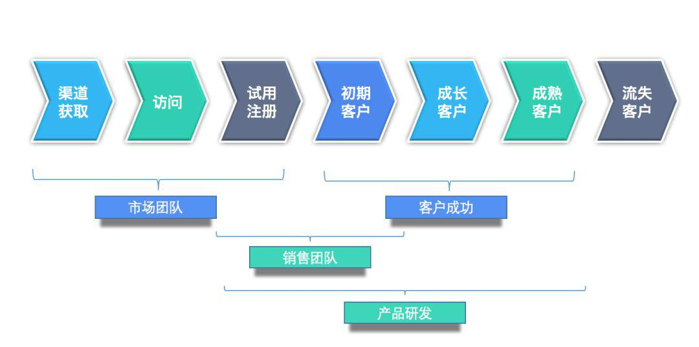
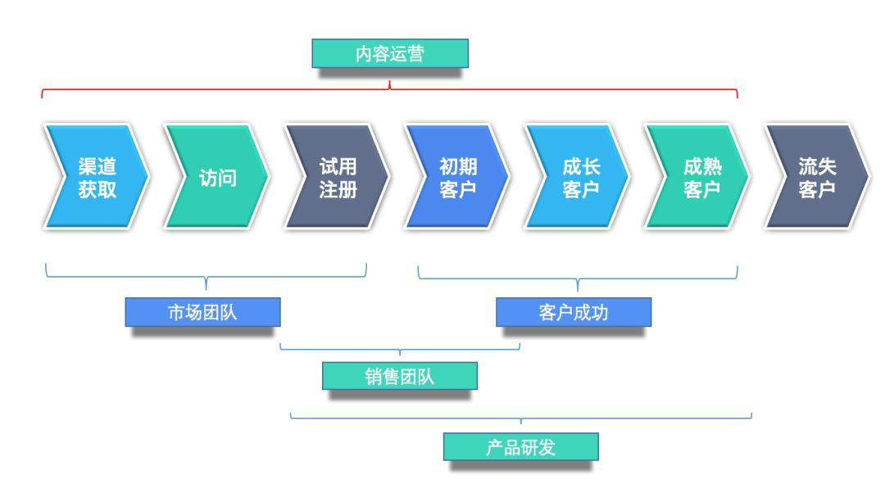
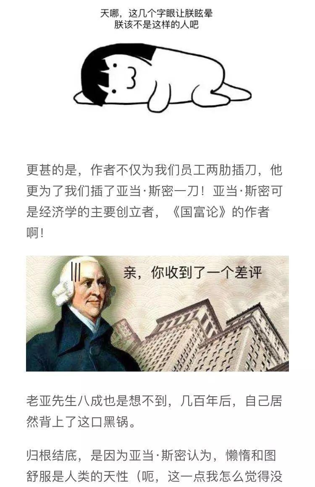
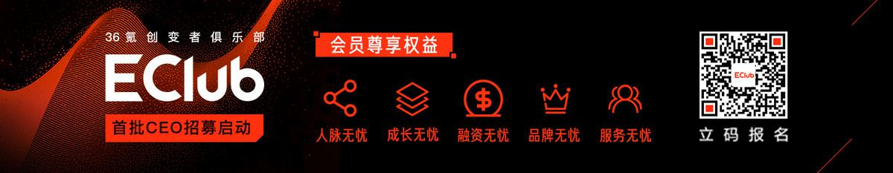

## 如何定义 SaaS 内容运营  

> 发布: 36Kr企服管家  
> 发布日期: 2019-10-23  

编者按：本文来自微信公众号[“图图的运营事”（ID：saasope）](https://mp.weixin.qq.com/s/mvfOKch9g1QKV8ZOie7yOA)，作者袁林 图图，36氪经授权发布。

内容，一个在 ToB 行业被反复提及的名词。最常跟“营销”两个字狼狈为奸的出现。毕竟，流量越来越贵，各行各业都在试图通过内容营销这种看起来“一本万利”的方式获客。8000块钱招个小编，每周 3 篇堪比学生代表发言的客户案例，就开始幻想客从天上来了。

当然，在用户场景更简单，营销工作也更成熟的 ToC市场有大量成功的内容营销案例。但是 ToB 行业则充斥着东施效颦，以及对 ToC 运营手段的拙劣模仿。

### 一、内容运营不等于内容营销

首先，我要声明一个观点： **内容运营不等于内容营销。** 或者说，内容运营的范围要大于内容营销。其实这不难理解，ToB企业内很多内容是对内的，比如你们听烂了也讲烂了的“赋能”；或者不以获客为导向的品牌内容；官网页面的内容输出等。

内容运营是一个比内容营销更高的概念。运营内容，就是运营着 SaaS 产品的灵魂，运营着组织经营过程中沉淀的知识。内容运营的岗位并非每个企业都单独设立。但是内容运营的工作都有人在做，可能是新媒体在写的公众号、也可能是产品运营输出的文档。

### 二、如何定义内容运营

那么究竟如何去定义内容运营呢？我个人倾向于从这样几个角度去理解和解释。

####  **（一）全生命周期的内容范围**

SaaS 的内容运营，涵盖了整个用户生命周期，下图是常见的SaaS飞轮图。：

这个图里面没有标注内容运营，那么内容运营在哪呢？

* 针对市场团队，内容运营需要为其提供从广告文案到公众号文章等外部内容；

* 针对销售团队，内容运营需要为其销售工具包。包括产品价值点的介绍、行业解决方案、场景解决方案等等帮助用户理解产品以及价值；

* 针对客户成功团队，标准的FAQ、最佳实践则必不可少；

* .......

之前说内容运营工作不等同于内容营销，也是基于此原因。因为内容营销仅仅限于通过内容进行获客，而内容运营的工作涵盖了整个用户的生命周期。

####  **（二）高质量的内容创作**

专业性是内容运营的第一要务。

ToB 和 ToC 最大的差别在于ToB 的严肃和专业。以此标准来看很多输出根本担不起“内容”两个字，很多人也根本称不上“生产者”。很多人只是做的只是“热点的搬运工”、“表情包的堆砌”。

诚然，在内容爆炸的时代，向新的阅读习惯妥协无可厚非；可是本就不长的篇幅，就插上N多表情包，剩下那几个字还能写一些什么呢？高质量的内容创作，才是ToB行业的内容运营之道。

“高质量”要求兼具专业性和趣味性，并能够采取图、表以及合理的配图增强阅读性，适配移动阅读场景。创作并非不能转载，有思考、合理的转载能够将外部内容融入自己的知识体系，而非紧追热点，不管有用没用、有关没关。很多热点一出，跟风者如云，其中虽不乏佼佼者，但是大多数无非运营小编的自嗨行为。

####  **（三）保障内容的精细化**

即是运营内容，就要考虑内容的受众。什么内容匹配什么使用场景，就是内容的精细化。小的方面要匹配用户群体／用户场景／企业需求；大的方面，要和公司的业务方向／阶段性战略目标／发展阶段相匹配。这就像是写一本书，每个年度/季度会有一个主题，无论是产品发布还是市场营销，都围绕这个主题形成。而大纲下面又有细分的各个章节，为不同受众和阶段服务。

####  **（四）适当的内容传递方式**

内容运营，不是一蹴而就的过程，完成了内容创作，仅仅是第一步。之后我们要在不同的平台进行分发，也免不了针对不同平台进行修改和二次创作。在内容积累到一定程度之后，整理出版等等。

同时，很多内容其实不是对外的，例如给销售同学的培训等。做好内部赋能，为营收做贡献也是内容运营重要的传递方式。

总之，除了内容的创作，把握好内容的分发、加工和反复利用，让转化达到最佳。

####  **（五）在用户反馈中不断迭代**

我知道大家听烂了“闭环”这个词，但是内容这种东西不像业绩，有实打实的数字说话。内容是一个不断迭代精进的过程。唯有引入反馈，才能不断修正内容的运营策略。

### 三、内容是 ToB 企业的重中之重

综上所述，希望你不再把内容狭义的理解成一篇文章或者一个PPT。而是组织知识体系的一种呈现方式。

我一直相信，ToB的产品是有灵魂的，而这灵魂就是产品背后的知识体系。产品设计阶段参考的理论知识/用户调研过程中积累的解决方案/部署实施过程中的方式方法/售后客户使用的奇思妙想......这些东西构成了企业服务产品和竞争者的知识壁垒。竞争者也许能够完全照搬你的产品形态，但是下一步怎么做？如何让客户成功？这答案里是企业踩过的坑，是管理者深夜无眠的思考，这才是企业最宝贵的东西。内容运营就是要把这一套东西整理起来，发扬光大。

当然，内容最典型的应用场景还是内容营销。回顾这些年 SaaS 厂商的市场活动，我们会发现除了钉钉，花大手笔做广告的真的不多。原因无外乎贵，从最早的媒体广告到后来的百度到今天的头条系，成本都非常高。

这就给内容运营在转化率上提了出了更高的要求。与此同时，借助自媒体平台的发展——知乎、微信公众号、朋友圈都成了厂商们争取的阵地。在这些战场上，硬广乃至软广都会被用户发现并排斥。所以真正有价值的、有诚意的为用户提供帮助的内容，成了获客的主要手段。

2015年开始ToB市场一片火热，实际上钱还是少的可怜。生存不易，做好企业的内容运营，绝对是一本万利。

### 看过来

36氪「E-Club创变者俱乐部」首批CEO招募，依托36氪媒体洞察力、影响力和产业资源优势，连接价值创投圈资源与人脉，为创业加速赋能。洞察核心需求精心打磨五大权益，助创业路上的你一臂之力！

