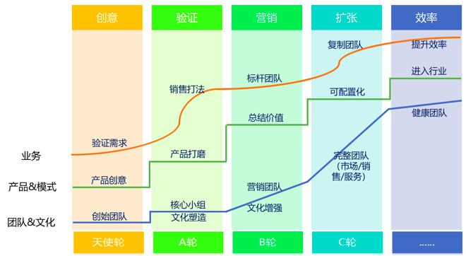

## SaaS创业路线图（二）：一文读懂SaaS创业路线全貌_36氪  

> 发布: 吴昊@SaaS  

编者按：本文作者 吴昊，纷享销客合伙人。企业服务（2B）公司的创业有8个阶段，在上一篇文章，作者介绍了企业服务（2B）公司创业的前4个阶段（点击查看[《SaaS创业路线图（一）》](https://36kr.com/p/5136068.html)），本文将介绍剩余四个阶段。

> 一个SaaS创业公司，在产品Ready、销售打法Ready、团队规模也扩大后，第5个阶段的任务是升级销售组织运营能力。

为什么呢？因为你作为创始人或销售VP，再也无法事事亲力亲为了。销售打法升级需要各地自主探索、各地团队的培训需要有擅长组织的人手（在纷享称作“培训校长”）、各个团队自己的文化及团队建设得有人进行组织运作。

就拿最常见的培训来说，总部安排的“通用”型培训效果普遍很差。为什么？因为每个团队的能力成熟度、组织活跃度、氛围状态都不一样，靠硬性要求“今晚7点都来参加视频培训”，人到场心不到场也没意义。不能“管理”，就只能“运营”了。

关键任务首先要有组织保障，有专人负责才有延续性、能够越做越好。58同城、纷享销客这样的公司都有很强的销售运营团队。

运营工作包括：经营体系全年和各阶段激励方案设计和宣传（例如每年的“冠军之旅”）；各项政策的调研、设计、征求意见、培训和执行中的答疑；员工关怀（例如入职周年纪念、生日会等）；系统性地设计和组织各部门业务、产品、文化培训；辅助业务负责人与员工谈心、推行新管理措施。

运营就是“人心”的管理，在纷享我们常说“人在一起、心在一起、智慧在一起”就是这个意思。

> 第6阶段，市场部应该要起很大作用了。

一个新市场的开拓，初期靠销售精英硬啃，把冰捂出水来，但这个效率在团队规模扩大后很难延续。《跨越鸿沟》里说的很清楚，“尝鲜”客户是极少数，大量客户在后面观望。况且SaaS产品面对的是企业客户，即便是小微企业也需要市场教育；面对中大企业的SaaS产品则更是很难“说服”客户产生需求，更多情况下是市场激发了客户的需求，销售去捕捉、推动和成交。

市场工作中线下部分还比较容易冷启动，参加行业展会或在老板圈子里搞活动，有几个做市场活动的高手很快能做起来。线上营销，则是一个长期的过程，务必在早期就开始投入，因为百度指数、网站排名是需要时间堆积的。

市场与销售的配合是一个关键点。市场品牌、PR的工作很难量化评价，为销售部门提供线索则是很直观的目标。市场线索也存在一个“转化漏斗”，从网站UV、注册转化率、有效线索转化率、客户转化率、商机转化率、订单转化率，每个因子都是乘法关系，一个转化率掉下来，整个漏斗的输出就大打折扣。

越是复杂的产品，销售团队越偏“专业型“，那么销售团队的“开源获客”就越依赖市场部。该阶段的任务就是形成市场能力，为销售团队提供质量与数量均衡的线索。

> 第7阶段是服务CSM（客户成功）体系的打造。

SaaS发展初期应该是由创始核心团队及销售团队亲自做深度客户服务，初期服务部门更多是被动服务（400热线、官网在线客服等）。客户逐渐上量后，服务就需要专属部门运作了。2015年4月，我随罗旭到硅谷拜访了十几家SaaS公司，我看到客户成功管理（CSM）是SaaS公司标配。与被动热线服务不同，CSM会主动了解客户使用情况、上门交流给出进一步用深产品的建议，是公司续费管理的核心部门。而续费才是SaaS公司的核心利益，关于这一点请见我的另一篇文字《SaaS的本质和SaaS公司的大坑》。

在国内，CSM还是个陌生而专业的领域。但相关知识并不难获取，人才可以从善于学习、热爱服务岗位的客服中培养，当然招一个掌握CSM组织发展规律的Leader也是有必要的。

该阶段的任务就是打造客户成功部门的能力和梳理跨部门的服务流程。

> 第8阶段其实不是最后一个阶段，而是持续的效率提升时期。

从产品的角度看，企业级应用如何实现高可配置化（以替代定制化，实现业务可持续发展）？是否进入行业增加行业通用模块？商业模式如何升级？这些都是提高效率的战略思考。

从营销的角度看，建立一个“指标体系”则非常重要。创业初期靠感觉，感觉来自你能看到的范围，公司大了之后看不到的“阴影面积”只能越来越多。公司运营靠的是数据，通过严格定制指标、对比指标环比同比异常并寻找背后的原因，是公司的“马步”。马步不扎实去玩“云手”，决策出错的风险很高。

SaaS公司的指标，大家见到的有很多，LTV（客户生命周期价值）、CAC（客户获取成本）常见，也有说是毛利回收期（GMPP）、获客成本回报（rCAC）的，但请注意这些都是“财务指标”，也就是说，反映到财务数据上的“最终结果”。多说一句，国内的大部分SaaS公司还没那水平每月把这些数据算地明白。人靠理性决策，但决策本身就是感性的判断，绕来绕去、不够直观的指标起不到多大作用。

作为CEO和公司经营一把手，我认为SaaS公司应该每月关注日常业务指标，包括：

* 新单-单年客单价（如果有多年单，要折算为单年）

* 新单成交周期

* 线索到回款各个环节的转化率

* 销售团队人均月单产和毛利

* 公司人均单产和利润

* 付费客户活跃率和续费率

各部门应该每月开数据会，把自己的指标异常分析透，然后上公司月度数据分析会，让大家来挑战你的分析和对策是否靠谱。管理本身是盖高楼，要的是持续改进，尽量少推倒重来。如果一定要推倒重来，请先做好从0开始折腾团队的准备和动员。

说明一下，创业过程难以规划，本文强调的是每个阶段的关键任务和每个阶段之间的依赖关系。违背这些逻辑关系很危险。

举例来说，[“路线图”第一篇](https://36kr.com/p/5136068.html)（点击查看）发出后，有朋友提到产品、营销、管理三个团队阶段不一致的问题。我认为这很严重，说几个创业公司的死法吧：

1. 产品研发闭门造车，营销侧没有配合启动，v1.0发布后，营销人员发现完全没有找到客户的痛点，再花6个月大刀阔斧地改产品，销售团队——等待死；

2. 产品没ready，销售打法没验证，销售团队就急于扩张，销售团队没业绩、个人没收入团队，散摊死；

3. 人均单产合格了，扩招销售团队，但市场线索跟不上，自开拓能力又不足，饿死......

\#SaaS创业路线图\# 第一篇和第二篇把路线图上的8个阶段过了一遍，但这还不够完整。我会再以“产品和商业模式”、“团队与文化”、“业务”、“融资”4个线条串起来讲讲。

此外，每个阶段我会补充细节文章，例如已经提到的《直销与渠道的联合作战策略及组织形式》、《如何快速复制销售团队？》。市场和客户成功部分，我则另外请大神来补充，一起完成这个“SaaS创业路线图”，希望对SaaS创业团队有所帮助。

推荐阅读：[SaaS创业路线图（一）](https://36kr.com/p/5136068.html)

封面图 Photo by [Helloquence](https://unsplash.com/photos/5fNmWej4tAA?utm_source=unsplash&utm_medium=referral&utm_content=creditCopyText) on [Unsplash](https://unsplash.com/search/photos/team?utm_source=unsplash&utm_medium=referral&utm_content=creditCopyText)

推荐阅读：

[SaaS创业路线图（一）：SaaS创业路线全貌](http://36kr.com/p/5136068.html)

[SaaS创业路线图（三）：创业公司核心营销团队招募](http://36kr.com/p/5138329.html)

[SaaS创业路线图（四）：产品打磨阶段各个角色怎么配合？](http://36kr.com/p/5139286.html)

[SaaS创业路线图（五）：SaaS的销售模式和营销组织演进](https://36kr.com/p/5140391.html)
