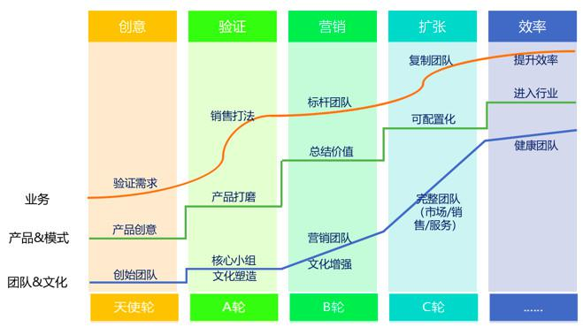

## SaaS创业路线图（三）：创业公司核心营销团队招募_36氪  

> 发布: 吴昊@SaaS  

编者按：本文作者 吴昊，纷享销客合伙人。在前两篇文章中，作者系统介绍了企业服务（2B）公司创业的8个阶段，（点击查看[《SaaS创业路线图（一）》](https://36kr.com/p/5136068.html)、[《SaaS创业路线图（二）》](https://36kr.com/p/5137220.html)），本文将介绍“创业公司核心营销团队招募”的技巧。

\#SaaS创业路线图\#系列，从创业的8个阶段说起，再分解每个阶段的“关键任务”如何达成，共约12篇。

今天是本系列的第3篇。创始人和联合创始人的组建，对公司的方向和未来是决定性的。而核心营销团队的组建，则是第2个阶段（产品打磨和商业模式验证阶段）的关键。产品经理强于逻辑思维，而营销精英则更擅长交流和捕捉需求，他们配合起来做产品打磨更加有效。更何况，在第3个阶段（创造销售打法和销售团队毛利模型的验证），真正输出结果的人正是那些在第2阶段参与过程、了解产品和市场的人，因此第2阶段要招到一小批销售精英。

### 一、人才画像

这个阶段作为创始人或销售VP，你首先要有个“人才画像”。这几个当前要招的营销骨干应该有什么样的特性？应该具备怎样的经历背景？这些需求一定要写下来，“无文字，不管理”，脑子里的东西无法审核、无法讨论、难以改进。

给出“人才画像”的例子前，我做做名词定义，先简单按目标客户来区隔各类销售人才。

toB和toC的业务流程完全不同，跑小B（门店）和to企业的也完全不同。这3类对人员能力模型的要求是很不一样的。再细一点儿，to企业中，做快单的（平均客单价2万以下，成交周期2周）与做解决方案销售的（平均客单价7万以上，成交周期2个月）就完全不是一类人。前者更有冲击力，善于在市场中形成突破；后者产品专业能力更强，适合稳扎稳打慢慢做中大客户。

所以你先要分清楚，自己的产品是哪一类，然后从这4类销售人才中间选：

* to企业，解决方案销售（例如2017年之后的纷享销客、销售易）

* to企业，快单销售（例如2017年之前的纷享销客、红圈营销、爱客）

* to小B，门店地推（例如美团）

* toC，客户是个人（例如友邦保险，顺便帮夫人打个广告）

跨类不是不可以，但需要转换过程。这个阶段的创业公司，我不建议找跨类的销售。

举个例子，营销人才画像可以是这样：

* 3年以上toB（对企业）销售经验——这是对上面分类的选择

* 能吃苦，有梦想，有思想，对自己有清楚的职业规划

* 语言交流能力出众，有亲和力

* 文字能力和逻辑能力较好，善于总结归纳

### 二、人才画像+

在这个阶段，你还需要考虑，这个人未来的成长路径。换个角度说，你的公司目前是做销售探索，一旦成功地找到可复制打法，就要建设团队。现在招的人，就是几个月后要带团队的人，要招“士官”而非“士兵”。所以他的“人才画像”里，还应该有：

* 领导力，能体察别人的需求并乐于帮助

* 组织管理能力，至少有12个月以上销售团队管理经验

管理能力不是天赋，而是经验。特别是不要认为这孩子在前一家公司是销冠，来我们这儿就直接可以带团队了。恰恰相反，很多销冠狼性太过，个人魅力偏“我是牛人都来跟我学”这种特性，即便能吸引几个忠粉，团队一旦超过10人就hold不住了，没有领导力的人带大团队问题多多。

特别说一句，销售团队崇尚“凭业绩说话”，是最讨厌“空降”老大的。初期找的人，随着团队扩张，未来最好能留在你的管理金字塔尖上。所以要找能力强、素质高的人。这样的组织发展设计，稳定性更好（当然如果实战中某个个人确实不行，还是该淘汰，否则浪费双方的时间）。而且这些人是要摸新市场、建立标准打法的，人才模型要求高一点，探索市场的成功率更高。

### 三、找人的方法

招聘网站肯定是最后的选择。如果信任度低，管理成本就高，这是创业初期你不能承担的。因此直接找你熟悉的人是最好的，通过熟人或投资方介绍也行，也有到MBA、EMBA去找人的（因此小公司不能送非联创去上学啊，被别的BOSS看上后流失风险很高）。如果资金还宽裕的话，实在不行就用猎头，时间和人才质量毕竟是关键。

这里有个快捷有效的方——定向找人。我最近就在帮一位华为老领导的SaaS项目找销售合伙人，我推荐可以定向在某些同类公司的离职员工中找，这样经验比较匹配。

我见过牛x的CEO把找人当做自己1/3权重的工作任务，因此他们在维护一个人才列表。那些优秀的人才，即便这次不来，还会长期联系。我们天使轮，你觉得不靠谱，那我就A轮再找你。还不来？过了一年多，我B轮了够牛吧，再撩，“总有一天会来的”（此处不是陈述句，是CEO的内心独白）。我亲眼见过隔了3、4年还在持续联系的，这才是本事。

### 四、聊人的方法

见到优秀人才，创始人要重视，但不要谄媚。什么叫谄媚？拍胸脯过猛、承诺做不到的事儿就是谄媚。我善意地相信创始人并不想欺骗，但这之后许诺达不到，离心离德的，不如不来。

我面试过的人起码超过500个吧，我会先秀公司的肌肉后（至少30分钟），再提要求：第一，个人年度收入设计会高于业内平均水平，但无责底薪不会太高，高收入靠完成业绩去挣；第二，希望你从一线做起，哪怕过程只有2、3个月，但可以掌握产品、融入团队，比空降存活率高（这是团队上规模后的事儿了）；第三，打预防针，告诉对方你团队目前的玩命工作状态。

其实这也是筛子，【筛子理论】我后面还会讲，如果一个牛人能接受低于原有底薪过来，那最能说明的一件事儿就是——他对事业的认同程度很高。这个点在入职前是很难判断的。

当然这是比较理想的情况，具体谈到什么程度，要参考你自己公司的状况，以及你的时间紧迫度。

面谈关键还是用真心打动人，所以招人是个花时间的活儿。我还记得2012年初，我在深圳找渠道总监时，第一个电话就要打半个多小时，第2个电话1个小时，人家才肯来面谈。那时候纷享办公室都还没开张，和别人说“在咖啡厅环境更自在”，然后一聊就是2、3个小时......真的是用时间“泡”来的。

关于到了第4个阶段（团队复制），如何大规模招聘，我在纷享把这块真的做出“花”来了，下篇我系统讲解。

> 如果你是SaaS领域的创业者，欢迎在评论区留下你的思考或者向作者提问。

推荐阅读：

[SaaS创业路线图（一）：SaaS创业路线全貌](http://36kr.com/p/5136068.html)

[SaaS创业路线图（二）：一文读懂SaaS创业路线全貌](http://36kr.com/p/5137220.html)

[SaaS创业路线图（四）：产品打磨阶段各个角色怎么配合？](http://36kr.com/p/5139286.html)

[SaaS创业路线图（五）：SaaS的销售模式和营销组织演进](https://36kr.com/p/5140391.html)
