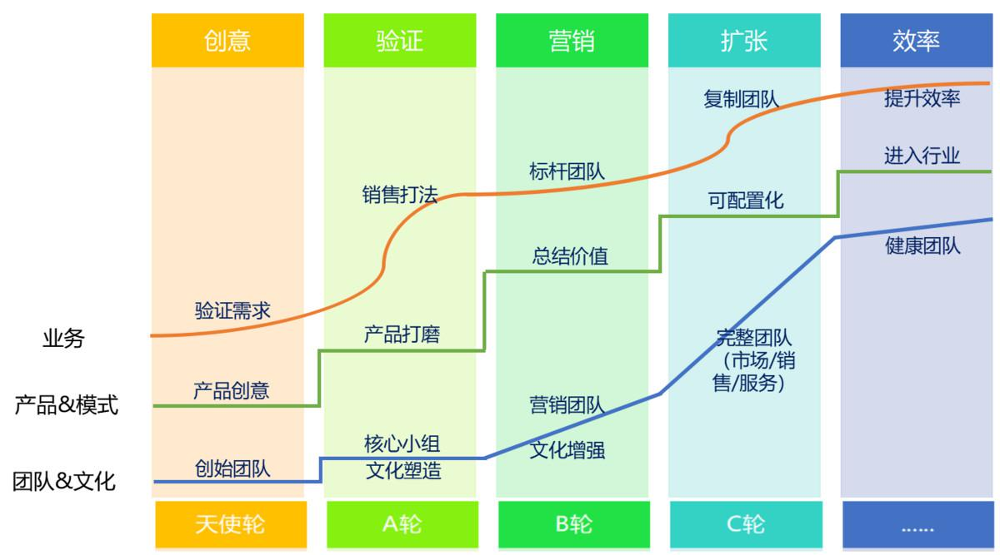

## SaaS创业路线图（五）：SaaS的销售模式和营销组织演进_36氪  

> 发布: 吴昊@SaaS  

编者按：作者介绍 - 吴昊，纷享销客天使投资人、前执行总裁，20年企业信息化和6年SaaS营销团队创新经验，每天一篇2000字创业文章的坚持者。欢迎关注公众号：SaaS白夜行。

在\#SaaS创业路线图\#中，第3个阶段是创造销售打法和销售团队毛利模型的验证。

在扩张团队前，有2件工作要先做到80分以上：①已验证成功的销售模式；②销售打法+完整的销售工具。没这个就去扩张团队，指望“瞎猫抓到死耗子”是不现实的。这样精力反而分散到无效培训新团队、忽悠代理商上面，最后一年过去一无所成。

关于销售模式，有几个大的决策点是需要CEO和销售VP心里非常清楚的。这些点，未必需要在这个阶段就100%决定下来，但起码要有清晰的认识，才可以做下一步的销售组织规划。

### 一，明确目标客户行业和规模

客户画像是逐渐清晰起来的，产品适合什么行业、什么规模的企业？这应该在初期就比较清楚了。根据国家统计局2011年的标准，各个行业的中小微企业规模要求不同。如果咱们的产品是跨行业的，可以考虑套用工业企业规则：

\*1~20人，微型
\*20~300人，小型
\*300~1000人，中型
\*1000人~，大型
\*还可以另外加一个：5000人以上，超大型（或集团型）

为什么规模这么重要？因为不同规模的企业，采购决策链不同。小微企业，老板拍板即可；中大企业，采购SaaS这类企业信息化产品，决策链跨越业务部门（也许是销售部门、也许是运营部门、也许是HR部门）、IT部、采购部，金额大的还要CEO或经营管理委员会决策，差异非常大。

### 二，线上线索为主？还是销售自开拓为主？

这个与上一步目标客户规模、客户决策流程有很大关系。小微客户，是可以通过听取销售人员上门介绍、教育，从而快速决策买单的。中等规模的企业，则有可能会听到一个好产品就决定购买，也可能只会按规划和预算买信息化产品；有时候大企业的某些业务部门手上有经费（未必是IT预算），也可能快速决策。

大企业通过IT部门的采购则完全是另外一种情况。即便业务部门确实有需求，也有可能要等明年的新预算下来。即便有预算，也有较长的决策链需要我们的销售人员逐个环节推进。

显然，激发大企业需求的更有效的方式是市场方式，而不是销售人员推动的方式。

这样分析下来，就很清楚了，你的产品到底应该以线上获取线索（SEO/SEM）为主，还是强力的地推或陌生电话团队为主？

这决定了销售组织方式。

### 三，面对客户的需求，我们提供的是简单的统一场景价值？还是个性化的解决方案？

这与客户企业规模未必有关，而是与我们的SaaS产品有关。如果我们提供的是费用报销、HR招聘这样较通用的价值，每个企业的应用场景类似，销售套路中的产品讲解部分就比较一致。一致意味着什么？一旦销售套路高质量地制作出来，容易复制给成百上千的销售人员。这样的销售可能只要有2年以上toB销售经验即可。在一个一线或二线城市里，这样的销售团队招到50~100人也不难。

如果是要做个性化解决方案，这个难度立即大幅提升！你的销售人员要能够通过交流理解客户企业业务逻辑和业务流程，并结合自己的产品提供解决问题的思路和方案，这样的人才本身在市场上就比较难找。你如果能一个一线城市里能招到20~30个合适的就算不错了。

具体如何做“销售人员画像”，请见我的第32篇《创业公司核心营销团队招募》，其中详细描述了toC、to小B、to企业（快单销售）、to企业（解决方案）销售的差别。

### 四，营销组织设计

组织设计这块每个公司不同，我通过问题的方式引导大家做思考：

市场部的KPI如何设置？市场资源如何投入？市场部门是否需要设置SDR（销售发展专员，主要负责客户资料开发和数据清洗，以提升销售效率）？

销售流程是否要拆解？是否需要分Inside销售（电话销售）和Outside销售（外勤销售）？

是否需要单独设立售前部门和实施部门？

售后部门的服务方式是被动服务（传统服务热线），还是客户成功（CSM，主动帮助客户更深度使用产品）？

具体如何设计，营销组织CEO和营销负责人见仁见智。也欢迎和我交流。

### 五、营销组织如何发展和演化的原则

SaaS公司发展到这个阶段，因为销售模式不同，其营销组织必然不同。侧重线上线索的，销售团队偏重做方案；需要大量自开拓的，销售团队侧重开源，甚至要像地推团队一样去扫楼陌拜。

我这里给大家一些原则。你可以拿着这些原则再具体分析自己公司的营销组织如何设计和发展：

#### 原则1、初期销售团队应该有“完整能力”

说白了，初期销售团队必须能完成营销甚至服务的全流程。这个阶段如果需要做跨部门配合，效率太差。而且由于流程在确认中、没有历史数据，各个部门之间如果要协调，扯皮的事情也会比较多。

我和阿里中供的同学聊过，也向阿甘当面请教过，一个销售找客户（开源）、联系客户、拜访客户、讲解产品、推进成交、初期服务，这是他的完整能力。

一个有追求的销售，在自己的职业生涯里，至少应该把各个环节都做过一遍；就像一个优秀的销售VP，必须懂产品、市场和服务一样，否则缺少全局观。（有兴趣的同学可以扩展阅读我的公众号文章《纷享毕业生事业规划的三级火箭》）

一个优秀的销售组织，初期也应该具备完整销售流程和各个环节的业务能力。这不仅是效率问题，也是试错成本问题。还记得《精益创业》里说的MVP（最小可验证产品）吗？销售组织就是CEO或销售VP的产品，也要考虑MVP方法论。

在实现了人均效率目标（例如人均4万/月，或12万/季度）后，再考虑通过营销环节切割提高专业度和效率。

#### 原则2、要复制团队可以考虑做营销环节切割

要复制团队了，你会发现——“咦，咋销售全才这么难招呢？”是啊，初期你能拿共同事业忽悠优秀的人，能做销售主管的给你做一线；到这个阶段，要做规模招聘了，你就会发现“全才”难招。

这背后的逻辑不是人才稀缺，而是人的特性相悖。

人如果专业度很高，能做解决方案的，就不愿意去干冲击力很强的活儿；而冲击力强的就不愿意一整天坐在办公室做解决方案，在能力上和性格上，这就是两类人。能把两种特性集于一身的，少。

从培训的角度讲，销售培训包括这三个环节：①海量搜资料、大量打邀约电话（每天50~120个有效电话）；②拜访客户、交流后做解决方案；③成交后实施培训。如果能把这3个团队分开，每个新人的培训成本要低2/3。

所以，也许最终你会有这样几个团队：

* 市场营销（线上/线下）

* 市场SDR（数据清洗、第一轮电话）

* 电销（绝大部分时间在公司打电话邀约客户，少量小客户在线成交，也叫Inside团队）

* 面销（Outside团队，负责拜访和成交中大客户，做新购和增购）

* 实施团队（签约后的实施）

* 服务团队（实施后长期服务，包括续费收取、促进增购）

* 如果需要做复杂解决方案，还需要一个售前支持团队。

多说一句，售前支持与售后实施的矛盾在每个软件公司都有，售前为了签单拍胸脯，什么都敢答应；售后实施就变成了填坑的，抱怨自己人还是小事，关键是交付困难、客户满意度下降。

通过和软件行业的同学们交流，我的方法是把售前、实施放在一个大部门，大家活儿混着做，你做的售前项目，项目实施阶段你也做负责人，指挥实施工程师做具体配置工作。我知道这样“售前专家”的能力没有都放在“最有效益”的签单上，但这对客户更好，能见到“咱们的产品在交付时到底是什么样？”对他个人成长也是有益的。

#### 原则3、发展中建设营销组织

把营销组织切割到位后，CEO就可以只看看报表了吗？不是，因为营销切割虽然带来招聘难度下降、培训成本降低、销售效率上升，但它隐含了一个糟糕的特性，就是对市场反应速度的下降。

我亲眼见过一个SaaS公司做了完美的营销切割，但在市场剧变时，一个个部门怎样像列车一样脱轨的。

大致情况是这样，该公司由于主要竞争对手裁员降速，市场线索数量突然下降（这和百度有很大关系，原因大家自己想），电销团队首先无法完成提供线索给面销部门的工作，个人收入和信心都大受冲击，最终崩盘。同时，面销团队在缺乏线索的情况下，无法迅速培养出“自开拓”客户的能力，加上主动性不够，眼睁睁看着自己饿死。最后整个公司都遇到了巨大困难，好在SaaS公司的产品和老客户值钱，最后他们还是顺利融资过关。

所以从我的观点看，营销组织的发展要稳健，在市场和主要竞争对手稳定前，不要急于把各个环节切割地太碎。同时，各级Leader对市场变化应该很敏锐，发现问题及时调整营销组织方式和流程。

### 六、小结

关于营销的部分，我只是把大致完整的组织形态及原则描述出来。不同SaaS公司，根据产品复杂度、是否需要实施、是否需要定制开发（SaaS公司最好不要做，但为了生存，谁知道呢......），组织设计会有所不同。

下篇我会写写《团队高效扩张的方法》，通过不断打磨一个流程让它每次提升10%，这是我的强项。

> 如果你是SaaS领域的创业者，欢迎在评论区留下你的思考或者向作者提问。

推荐阅读：

[SaaS创业路线图（一）：SaaS创业路线全貌](http://36kr.com/p/5136068.html)

[SaaS创业路线图（二）：一文读懂SaaS创业路线全貌](http://36kr.com/p/5137220.html)

[SaaS创业路线图（三）：创业公司核心营销团队招募](http://36kr.com/p/5138329.html)

[SaaS创业路线图（四）：产品打磨阶段各个角色怎么配合？](http://36kr.com/p/5139286.html)
