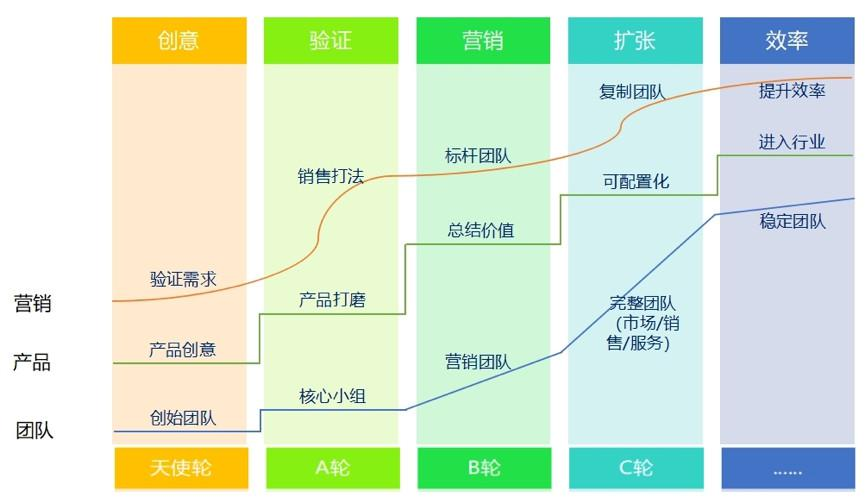

## SaaS创业路线图（一）：SaaS创业路线全貌_36氪  

> 发布: 吴昊@SaaS  

**本文作者 吴昊，纷享销客合伙人**

我自己作为核心决策层在纷享销客参与SaaS公司创业、融资、扩张、转型的整个过程，并且和创始人罗旭一起创建大规模SaaS营销团队，对SaaS创业的过程深有体会。最近2个月我与二十几个SaaS创业者深入交流，也写了20多篇文章，我的“珍珠”终于可以串成“项链”了。

\#SaaS创业路线图\#开篇我先把路线图的全貌描述一下，随后逐一介绍每个阶段的关键任务及要跳过的“坑”，突出核心原则和设置关键控制指标，最后描绘其间团队、产品、营销&服务、融资等横向线条，形成完整的路线图。

企业服务（2B）公司的创业有8个阶段，所有SaaS公司或2B公司不可能跳过这些阶段，每个阶段都有明确的任务。总体来说，SaaS项目的创业过程归纳如下：

### 首先是产品创意阶段。

一个想法诞生了，创始人根据自己熟悉领域的知识在熟悉的客户群体里做出口头交流验证。这个阶段的任务就是完成这个口头交流验证，如果能做出产品原型当然更好。

在2011年纷享的创始人罗旭（原新京报总经理）一年拜访几百个CEO和高层管理者。联合创始人是研发出身的李全良和刘晨，他们每天晚上根据罗旭的反馈修改程序，次日发布；在一年内通过上百次的快速迭代，找到企业客户的痛点并进行了演示型验证。

**这里的关键词是“敏捷”。** 《精益创业》里说MVP\(最小可验证价值产品，简化点叫做“最小可见产品”）很有指导性，这个“原型”可以是只有UI界面的H5，也可以是手绘的演示图，不用拘泥于形式，关键是能把价值讲清楚，能从客户那里得到反馈。

### 第二是产品打磨和商业模式验证阶段。

第1个阶段需要有良好的客户资源，否则不易深聊或拜访量不足，但真正产品打磨的阶段，反而不能找“熟人客户”，他们太nice，大多提不出真正意见，对细节要求也不高。

要找新客户，真正有痛点的，如果能掏钱就更好，我在公众号文章《为何SaaS产品不应该免费？》里说过，“有资源的团队反而容易失败，前期那些靠关系来的“假”客户只能让产品和服务走上更远的弯路”。做产品的，就得死磕自己，掏钱的客户才是真爱，才能提出各种真实要求。

产品打磨和商业模式验证，就需要有营销人员参与了。一个产品，如果只有创始人能卖得出去，就有很大风险 —— 客户到底买的是你的产品还是你的面子？销售人员的素质门槛得有多高？直到多年之后，我还看得到公司VP，包括我自己，出去见客户的套路Sales是学不会的，包括寒暄中提到创业经历、亲历的融资故事，产品价值陈述中说到“我带这个团队的心得”......这些Sales没有这个身份，即使背下来也没有用啊。 **因此，一定要踏实，可以招素质很高的销售，但他们得形成普遍意义上的“产品价值及商业模式验证”。这是第2阶段的关键任务。**

产品需求调研的环节，我认为不是产品经理的事儿，产品经理当然应该去客户现场了解需求，但主导产品调研的，反而应该是营销能力强的人。如果创始人又有产品背景，又有营销能力，当然最好。如果创始人是技术范儿的，务必找到一个营销能力强的合伙人。随便说一个例子，技术型的人在“察言观色”、“提问式引导”等方面是很少没有短板的，而这其实是营销人才的擅长区。

产品调研阶段很关键，将来我专题写帖子讨论。

### 第3个阶段是创造销售打法和销售团队毛利模型的验证。

上文说了，前期你需要几个销售精英，与产品团队一起打磨产品。产品初步可卖后，销售团队就要总结打法，财务人员（可能只有1~2人）要协助进行销售团队毛利模型的测算。测算可以乐观，但不要忽悠自己。如果客单价很低、销售人均月单产很低，就要找原因设法解决。千万不要数据还很差就扩张团队，一个亏损的销售团队人员收入差、士气低、不愿意学习，结果你的精力都花在激励团队“成员”上了，“客户”的问题反而没有精力顾及。

销售打法要形成文字，同步完成主要的销售工具，包括演示产品的方法（纷享有一个著名的“产品演示15分钟”，3700字）、演示用的PPT、公司宣传视频和少量客户鉴证视频等。

第3阶段的目标是“人均单产”达标，也就是说单兵的产出能够覆盖他的成本。

### 第4个阶段是团队复制阶段。

这时候销售型创始人或销售VP的任务是快速复制销售团队。新人的招聘、培训、培养、筛选要有一个完整的体系。

这个阶段第一个要决策的就是做直销还是渠道。在“销售打法”阶段，是一定要做“直销”的，我认为“无直销，不渠道”。不少创业者是技术出身，认为自己把产品做好，找到专业的代理商自然能够卖好，这太理想化了。说服代理商需要耗费很多时间，代理商遇到问题反馈给产品的路径又太长，更重要的是他没见到完整的销售打法也没信心，很容易放弃。

回过头说，“销售打法”成熟后，团队复制阶段无论选择直销还是渠道都有各自的道理，关键因素是产品的复杂度和交付/实施的复杂度。代理商更适合销售较为简单且迭代变动小的产品，否则跟不上变化。

直销与渠道混合发展、按区域区隔，是一个常见策略。直销更可控、渠道利润更高、直销在一二线城市形成影响力，渠道能够广泛覆盖更大区域，在一个公司里，直销、渠道业绩的相对均衡有利于公司健康发展。直销与渠道的联合作战策略及组织形式，我另外再单独写文章分析。

2014年纷享在直销上投入很大力量，北京分公司人数从1月份的几人扩展到年底的一百多人。到了2015年1月份，成建制地派出3个精锐小组建立广州、深圳、上海分公司就很轻松了。复制团队的具体细节很多，将来我也另外写一篇《如何快速复制销售团队？》作为本节的补充。

今天先写到这里，下一篇 \#SaaS创业路线图\#，我再讲讲后面几个步骤：

第5阶段，升级销售组织运营能力；

第6阶段，市场与销售的配合；

第7阶段，服务CSM（客户成功）体系的打造；

第8阶段，效率提升。

推荐阅读：

[SaaS创业路线图（二）：一文读懂SaaS创业路线全貌](http://36kr.com/p/5137220.html)

[SaaS创业路线图（三）：创业公司核心营销团队招募](http://36kr.com/p/5138329.html)

[SaaS创业路线图（四）：产品打磨阶段各个角色怎么配合？](http://36kr.com/p/5139286.html)

[SaaS创业路线图（五）：SaaS的销售模式和营销组织演进](https://36kr.com/p/5140391.html)
