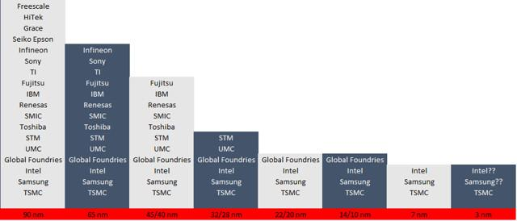

## 台积电市值超过英特尔，昔日霸主英特尔走到三岔口_36氪  

> 发布: 半导体行业观察  
> 发布日期: 2019-10-23  

编者按：本文来自微信公众号[“半导体行业观察”](https://mp.weixin.qq.com/s/sCLj2Dxmz7LrX8Z1J0NAoQ)（ID：icbank），由公众号半导体行业观察翻译自「Seeking Alpha」，作者 EnerTuition，36氪经授权发布。原标题《英特尔走到了三岔口》。

自从我们发表了一篇关于英特尔和台积电命运分歧的文章以来，已经过去五年多了。在那篇文章中，我们预测台积电将在5年内取代英特尔成为第一大半导体公司。这比我们预期多花了几个月的时间，但自9月底以来，台积电的市值超过了英特尔。截至上周五收盘，台积电市值为2470亿美元，轻松超过英特尔2280亿美元的市值。我们还预测，英特尔不太可能在其晶圆厂业务上取得成功，而且也如预期的那样实现了。在合理地确定了过去五年的预测之后，本文讨论了这两家公司未来五年可能面临的情况。

要理解这篇论文，读者需要了解摩尔定律和摩尔第二定律。众所周知的摩尔定律\(Moore’s law\)指出，在前沿集成电路中，晶体管的数量大约每两年就会增加一倍。不太为人所知的摩尔第二定律\(Moore’s Second Law\)指出，一家领先的半导体工厂的资本成本会随着时间呈指数级增长。

从历史上看，从Robert Noyce到Brian Krzanich，英特尔的首席执行官们都对集成设备制造商IDM模式深信不疑。这种集成了半导体设计和制造组件的模式，在上世纪90年代一直服务于许多行业参与者，直到代工厂模式在21世纪头十年开始获得并吞噬IDM。因此，每个新流程节点的竞争环境都变薄了\(如下图所示，注意，英特尔最近的10nm制程大致相当于业界的7nm制程\)。

图：大约2000年以来主要流程节点上的参与者（来源：作者数据）

半导体行业的历史告诉我们，一旦一家公司脱离了前沿工艺竞赛，转向代工模式，它就不会再回到晶圆厂业务。代工模型通过聚集这些无晶圆厂玩家的晶圆厂需求来符合摩尔第二定律。

尽管芯片代工企业取得了巨大的进步，但英特尔管理层似乎并没有意识到摩尔第二定律的冷酷现实，即便是在“真人拥有晶圆厂”的Jerry Sanders离开AMD、AMD为了生存不得不剥离其晶圆厂多年之后也是如此。一系列英特尔的ceo们都很自满，主要是因为拥有丰富的x86资源，这可能会使他们产生一种错误的安全感。

可以肯定的是，英特尔在同时打造代工业务方面做了一些三心二意的努力，但未能取得明显的进展。关键的时间以半途而废的方式过去了，英特尔现在已经到了一个阶段，在当前的内部代工模型上进行构建变得越来越不可行，x86的巨富可能不再支持前沿的位置。

考虑一下台积电在最近的第三季度收益电话会议上公布的修订后的资本支出预算——2019年为140亿至150亿美元，2020年可能达到类似的数额。台积电的资本支出似乎已达到与英特尔相当的水平，尽管其营收只有英特尔的一半左右。

2019年，台积电预计收入约350亿美元，而英特尔预计收入690亿美元。这种收入比较有点误导人，因为英特尔的收入来自终端客户，而台积电的销售对象是半导体公司，后者将这些产品转售给终端客户，加价大约为100%\(或销售收入的50%\)。经这种差异调整后，可比收入要均衡得多。在收入大致相当的情况下，台积电现在发现自己是工艺技术领域无可争议的领导者。此外，市场动态表明，台积电将继续增长，英特尔可能停滞或收缩。

为了在这种环境下赶上台积电，尤其是要从10nm制程的灾难中恢复过来，英特尔现在必须提高资本支出占收入的比例。问题是，英特尔的收入机会正在萎缩，因为AMD市场份额的增长。另一方面，台积电的收入正在增长，这使得台积电有能力在必要时增加资本支出。英特尔的利润率将由于AMD的冲击以及资本支出在小批量销售中的增长而下降。与此同时，由于在高端市场缺乏竞争，台积电将保持甚至扩大利润率。这些动态意味着英特尔的现金流和盈利能力将变得更糟，反过来，这将降低英特尔在前沿节点的误差率。

从投资者的角度来看，英特尔应该逐渐成为两个截然不同的企业:

1.一家前沿的半导体设计公司，主要专注于CPU和GPU。公司的这一部分，尽管最近在与AMD的比赛中表现不佳，却是一个强有力的组织。在这两个领域，英特尔重新获得绩效领先地位的几率很高。

2.一家最近表现不佳的晶圆厂，正面临摩尔第二定律控制的规模经济不佳的局面，而且可能会越来越落后。

将这两家公司的未来捆绑在一起，几乎肯定会导致英特尔长期失去产品领先地位。考虑到这些动态，英特尔现在能否凭借自己的力量打好这场领先优势之战是值得怀疑的。

有趣的是，在7nm制程上落后于台积电的三星，也面临着类似的情况。如果有战略需求，而且我们相信有足够的需求，那么这些公司就有机会整合它们的力量，创造出一种可行的代工产品来替代台积电。我们估计，英特尔有大约两年的时间剥离其晶圆厂业务，并与三星的晶圆厂业务合并，从而有很大机会保持领先地位。在两年的窗口期过后，英特尔或三星将采取什么行动可能并不重要，因为届时台积电可能会获得不可逆转的多年期领导地位。最有可能的是，竞争成为半导体晶圆厂业务的领头羊将结束。

### 预后

在我们看来，过去十年里，英特尔的管理层一直在追求摩尔定律，却没有考虑摩尔第二定律。不幸的是，这是一个终端类型的关键失败，其结果是，英特尔失去了对台积电的过程领导地位，该公司不太可能回到其在该行业的领头羊地位。

首席执行官Bob Swan将面临拆分公司的决定。他作为CEO的成功以及英特尔产品领导地位的存续取决于他将做出的选择。现在需要的是，像Andy Grove在1985年结束英特尔在内存业务上的竞争时所展示的那样，发挥领导作用——这是一项重大举措，使公司专注于最有前途的未来增长领域。如果Swan先生不能接受这一挑战，我们就会发现英特尔将永远失去它在半导体行业的卓越地位。Swan的任务之所以困难，是因为英特尔巨大的组织惯性。

尽管存在剥离晶圆厂业务并将其与三星晶圆厂业务整合的可能性，而且可能会实现，但英特尔的组织惯性让这些举措的时机值得怀疑。考虑到这一现实，我们发现英特尔现在很可能已经永远失去了它在流程方面的领导地位，并将因此遭受巨大的损失。
