## 腾讯成本优化黑科技：整机CPU利用率最高提升至90%  

> 作者: 沧海一粟  
> 发布日期: 2019-10-08  

作者：腾讯TLinux团队

导语：腾讯TLinux团队提出了一套全新的混部方案， **在不影响在线业务的前提下，对整机CPU利用率提升效果非常明显，在有的业务场景下，整机CPU利用率甚至能提升至90%。**

### 一、前言

腾讯运营着海量的服务器，且近年的增长有加速的趋势，成本问题日益严峻。其中，CPU利用率不高一直是影响整机效率的短板。试想一下，如果能让整机的CPU利用率翻一翻，是什么概念？这相当于把一台机器当两台使用，能为公司节省巨额的成本开销。因此，各BG各业务都在想办法提升整机CPU利用率。大家尝试让各种业务混部，试图达到提高整机CPU利用率的目的。然而，方案的实际效果却不尽如人意。现有的混部方案始终无法做到离线业务不影响在线，这种影响直接导致多数业务没有办法混部。

基于现状以及业务的需求，TLinux团队提出了一套全新的混部方案， **该方案已在公司很多业务中得到了广泛的验证，在不影响在线业务的前提下，对整机CPU利用率提升效果非常明显，在有的业务场景下，整机CPU利用率甚至能提升至90%。**

本文将围绕如何提升整机CPU利用率这个问题来展开，重点关注以下三个问题：

*  **现有混部方案如何做？问题是什么？为什么现在CPU利用率还是不高？**
*  **TLinux团队的方案是如何做的？为什么要这么做？**
*  **TLinux团队的混部方案，真实业务使用效果如何？**

### 二、现有方案

公司内部已有的混部方案总结来讲主要有两种：

* Cpuset方案
* Cgroup方案

####  **1.cpuset方案**

既然担心离线在线在相同的CPU上互相影响，那么把在线&离线业务直接隔离开是最容易想到的方案，这就是cpuset方案，具体做法如下图所示：

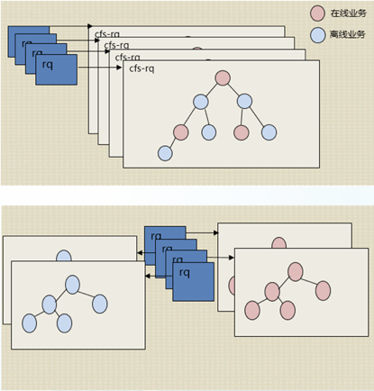
cpuset方案

在线业务限定在某些核上，离线业务限定在某些核上面。这种做法，在某些场景下，是有效果的，因为从物理上将离在线隔离开了，他们之间互不影响（超线程，cache互相影响这里不展开细说）。但是这种方案实用性不强，比如在多线程的业务场景，需要利用多核优势，如果将在线限定到少数几个核就会影响性能。并且，这种方案并没有真正的达到混部的效果，在在线的那些核上，还是没有办法混部离线业务。

####  **2.cgroup方案**

Cgroup方案，就是利用cgroup提供的share以及period/quota功能来实现。Share是通过给不同的cgruop配置权重来达到控制不同cgroup CPU占用时间的目的。period/quota是可以控制单位时间内某个cgroup占用CPU的时间。大家想通过这两种功能，来控制离线调度组的占用CPU时间。这种方案在那种对时延不敏感的业务上，有一定效果。但是，不论是share还是period/quota，都没有办法解决一个问题，就是在线无法及时抢占离线的问题。从而在延迟敏感的业务场景，使用group方案会导致在线受影响，业务无法混部。

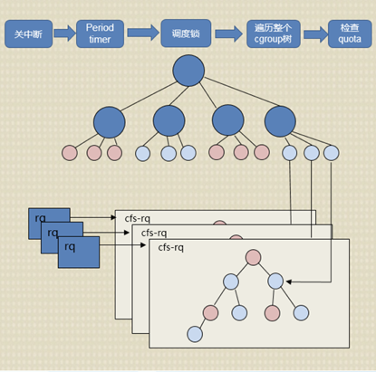
cgroup方案

同时，cgroup方案还有一些他自身方案带来的问题，比如说period/quota控制需要遍历整个cgroup树影响性能问题，quota太小导致整机死锁问题。

#### 3.现有方案概括

除了上述两种方案，在业务层面的调度层，有的业务也做了一些工作，比如说根据机器以往的CPU使用情况，在该机器CPU利用率的时候，从集群中其他机器上调度离线过来运行。这同样也会有问题，比如业务突发流量如何即使处理不影响在线？在线虽然占CPU低，但是延迟敏感，还是无法运行离线的问题。

总结起来，现有的混部方案在改善CPU利用率低下问题上，在某些场景有一定效果。但是现有方案对问题的改善有限，并且在很多对延迟敏感性的业务场景，使用现有方案是无法混部的。因为，现有混部方案都无法解决一个核心问题，就是如何做到让离线不影响在线的问题。而导致离线业务影响在线业务的原因就是，在线需要CPU的时候并不能及时抢占离线。TLinux团队的方案解决了这个问题，并且做了很多优化，目的是在离线不影响在线之后，让离线能够见缝插针的利用空闲CPU，提升整机CPU利用率。

### 三、TLinux团队的混部方案

#### 1.方案框架

TLinux团队混部方案在内核层面对离在线混部提供支持，从功能将主要包括，离线调度类支持，负载均衡优化，带宽限制，用户接口提供。我们提供了离线专用调度类，专为离线进程设计。并且对负载均衡做了深入的优化，从而达到提升整机CPU利用率的目的。另外，为了业务更加方便的使用该方案，我们还为业务提供了完善的离线进程设置控制接口。

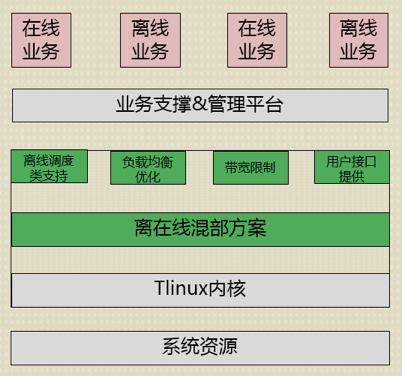
TLinux团队混部方案框架

方案中最重要的两个问题是：

* 如何让在线及时抢占离线？
* 如何让离线高效的利用空闲CPU？

如下图所示，为了解决在线抢占离线不及时的问题，我们专门为离线设计了离线专用调度类，为了让离线更好的利用空闲CPU，我们对负载均衡做了大量的优化，下面就一个一个来细说。

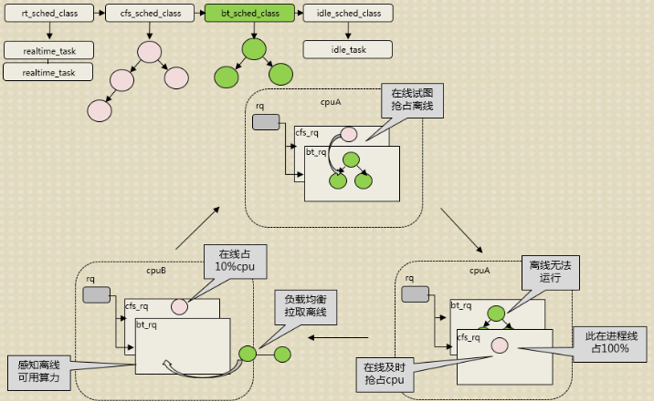
方案概览图

#### 2.如何让在线及时抢占离线？

在说明这个问题解决之前，我们先来分析一下，为什么现有的混部方案没办法做到及时抢占。

抢占逻辑，如下图所致，在同调度类优先级的进程，互相抢占的时候，需要满足两个条件。第一个是抢占进程的虚拟时间要小于被抢占进程，第二是被抢占进程已经运行的实际要大于最小运行时间。如果两个条件不能同时满足，就会导致无法抢占。现在混部方案，在线离线都是cfs，这样当在线需要CPU试图抢占离线的时候，两个条件并不一定会满足，从而就导致在线抢占不及时，这也是现有方案问题的关键。

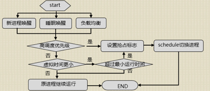
抢占逻辑

在当时制定方案，分析清楚了现有方案的问题之后，我们首先试图从优化抢占判断入手，当时想过很多办法，比如：对最小运行时间进行优化，当在线抢占离线的时候，忽略最小运行时间判断？

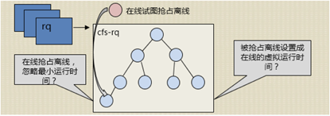
在线抢占离线

另外就是当在线抢占离线，但是在线虚拟时间更大的时候，与离线互换虚拟时间？我们想过很多办法，有一些效果，但是还是不能达到预期。

回过去看抢占逻辑，如果抢占的进程的调度类优先级更高的时候，是会立马抢占的。比如现在有个进程要运行，原来的CPU是空闲的，那么这个进程是会立即执行的。而实际上这里也是发生了抢占，cfs调度类抢占idle调度类。因为cfs调度类的优先级高于idle调度类的优先级。

因此，我们试图通过给离线进程专门设置一个专用调度类，来解决抢占的问题。经过调研，我们最终决定为离线进程新加一个调度类：offline调度类，offline调度类的优先级低于cfs调度类，高于idle调度类，因此，cfs调度类可以随时抢占offline调度类。下图是我们为了支持离线调度类，支持的相关子系统，包括调度类基本功能支持，task\_grouop支持，cpuacct, cpuset子系统支持，控制接口支持，等等。

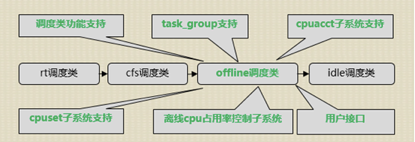
支持离线调度类及相关子系统

在为离线单独设计了调度类解决了抢占不及时的问题之后，我们会发现一个问题，在我们的方案中，在线是很强势的，需要CPU的时候立即抢占，那么对离线来说就不利。我们的方案目标，不仅要让离线不影响在线，还需要达到的目的是，要让离线能够见缝插针的把空闲的CPU给利用上，达到提升整机CPU利用率的目的。那么我们是怎么来做的呢？

####  **3.如何让离线高效的利用空闲CPU？**

那么就来看第二个问题，离线如何高效的利用空闲CPU？ 因为当有在线的时候，离线无法获得CPU，因此要让离线高效的获得CPU，第一个需要解决的是，离线如何去感知在线剩余的算力？在线占用100%的核上，是不应该调度离线过去运行的，因为离线一直获得不了CPU。在线占用60%与在线占用10%的CPU上，应该调度不同负载的离线去运行。

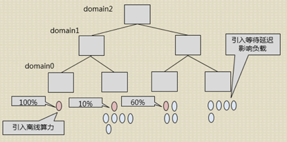
离线如何高效的利用空闲CPU？

因此，在线感知剩余算力很关键，那么怎么做的呢？我们最开始是如果负载均衡的时候，这个核有在线在运行就不调度离线过来，此种做法比较粗糙，波动很大效果不明显。因此我们对此进行了优化，离线算力算法如下：

\(1\)1-avg/T=离线负载算力

\(2\)avg随之T不断衰减，过一个T衰减成原来的1/2

\(3\)在线的运行时间不断加入avg中

直接看文字很难懂，举个例子；比如在线占用CPU100%，T=1ms

那么离线算力=1-\(1/2+1/4+1/8+1/16+…\)=0 ，也就是说算出来离线的算力是0，因此这个核上在线占着100%的CPU。

如果在线占用20%的CPU，T=1ms，那么离线算力=1-\(0.2/2+0.2/4+0.2/8+…\)=0.8，因此，可以迁移一些离线进程到这个核上。

另外，第二个是我们引入了等待延迟，用于优化进程负载的计算。为什么要引入等待时间呢？因为我们发现，如果用原来的算法，在业务限制某个CPU不让离线运行时候，这个离线进程可能无法被调走（比如说，四个CPU，四个离线，限制一个核，按照原来算法负载是均衡的）。另外我们在测试中发现，离线在在线混部上来之后，离线的队列等待时间会增大，缩短离线进程在队列中的等待时间，是提高离线CPU占有效率的关键。因此，我们引入了队列等待时间，通过等待时间算出一个翻倍因子，从而在负载均衡的时候，将最应该被调度的离线进程及时调度到空CPU上运行。

### 四、新方案效果

**目前TLinux团队混部方案的效果多个业务上都得到了验证，功能满足业务需求，在不影响在线业务的前提下，整机CPU利用率提升非常显著，超过业务预期。** 下面是几个典型场景的测试数据。

如下图所示，在A测试场景中，模块a一个用于统计频率的模块，对时延非常敏感。此业务不能混部，整机CPU利用率只有15%左右，业务尝试过使用cgroup方案来混部，但是cgroup方案混部之后，对在线模块a影响太大，导致错误次数陡增，因此此模块一直不能混部。使用我们提供的方案之后，可以发现，CPU提升至60%，并且错误次数基本没有变化。

业务场景A\(a模块\)
混部前后性能对比

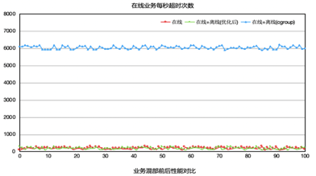业务场景A\(a模块\)
混部前后性能对比

在B测试场景中（模块b是一个翻译模块，对时延很敏感），原本b模块是不能混部的，业务尝试过混部，但是因为离线混部上去之后对模块b的影响很大，时延变长，所以一直不能混部。使用我们的方案的效果如下图所示，整机CPU利用率从20%提升至50%，并且对模块没有影响，时延基本上没有变化。

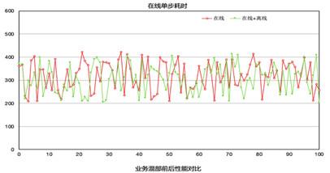
业务场景B（b模块）混部前后性能对比

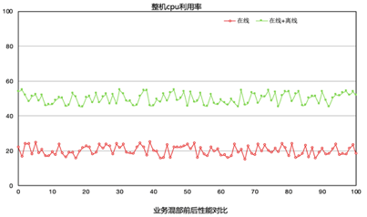
业务场景B（b模块）混部前后性能对比

模块C对时延不像场景A，B那么敏感，所以在使用我们提供的方案之前，利用cgroup方案进行混部，CPU最高可以达到40%。但是平台不再敢往上压，因为再往上压就会影响到在线c业务。如下图所示，使用我们的方案之后，平台不断往机器上添加离线业务，将机器CPU压至90%的情况下，c业务的各项指标还是正常，并没有受到影响。

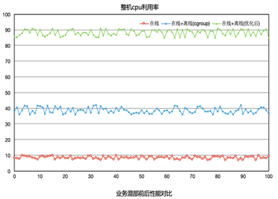
业务场景C（c模块）混部前后性能对比

TLinux团队从今年三月份就开始在各业务场景中进行测试灰度，期间遇到了各种各样的问题，不断的优化完善。 **验证的结果是：TLinux团队混部方案在不影响在线业务的前提下，能够大幅度提升整机CPU的利用率，能为公司节省大量的运营成本。目前TLinux团队提供的公司内部内核，已经完全支持TLinux团队混部方案，公司很多业务已经开始使用TLinux团队提供的混部方案。**

PS： **TLinux 团队承载了腾讯公司级的服务器操作系统、内核、发行版及虚拟化研发任务，专注解决TLinux系统、内核、网络、虚拟化平台及文件系统的问题。在历次的考验中，承受住了服务器数量飙升的压力，为腾讯提供了稳定、持久的服务。**
