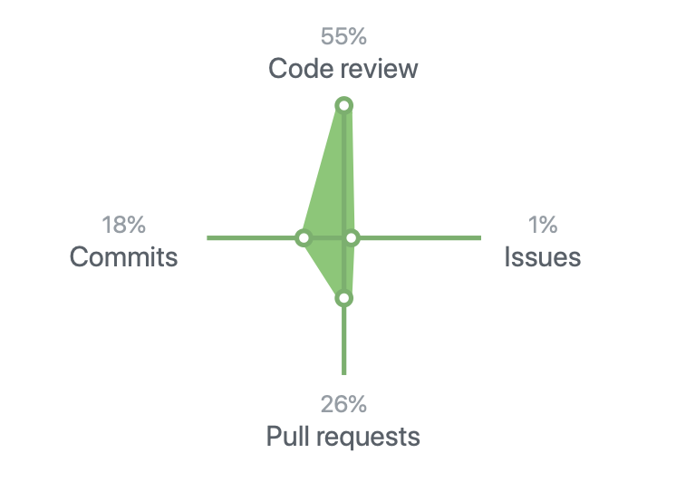

## 我从高级软件工程师身上学到的那些经验与教训-InfoQ  

> 作者: Neil Kakkar  
> 译者: 核子可乐  
> 发布日期: 2019 年 10 月 3 日 15:00  

> 一年之前，我开始在彭博担任全职工作。从那时起，我就在构思这篇文章。我想象自己能够在时机成熟时，把自己的想法都倾诉于纸端。但刚刚过去一个月，我就意识到这并非易事：随着工作的推进，我忘掉了很多自己刚刚学到的东西。这些东西快速内化，使我的大脑开始欺骗自己，令我误以为自己早就掌握了这些清晰记得的知识，或者是认定自己从未听说过那些实际上是被忘记了的内容。
>
> 正因为如此，我才开始保留自己的日志。每当遇到有趣的情况，我都会把它记录下来。感谢坐在我身边的高级软件工程师们，我可以认真观察他们在做什么、与我的做法又有何区别。我们会经常结对编程，这能够大大降低工作的难度。另外，在我们的团队文化当中，“窥探”其他人的编码过程并不是什么不光彩的事情。每当我感觉有趣的事情要发生时，总坐很快转过身去查看。这种敏锐，让我总能快速弄清事情的来龙去脉。
>
> 下面来看看坐在一位高级软件工程师身旁一年，我都学到了哪些重要经验。

### 编写代码

#### 如何命名

我在工作中接触的第一项任务是开发一款 React UI。当时我们拥有一个主组件，用于容纳其它所有组件。我喜欢在代码当中加点幽默元素，所以我把它命名为 GodComponent。但在代码审查时，我才意识到为什么命名工作如此重要、也如此困难。

> 计算机科学领域有两大难题：缓存失效、命名以及缓冲溢出错误。 -—— [ Leon Bambrick ](https://twitter.com/secretGeek/status/7269997868)

我命名的每一段代码都包含隐藏的含义。GodComponent？这个组件的含义，就是我会把所有不知道该放在哪的组件都放在这里。它囊括一切。如果我把它命名为 LayoutComponent，后续我才会意识到它的作用就是布局分配，其中不包含任何状态。

我发现的另一项心得在于：如果其体积过于庞大，就像是这里提到的包含大量业务逻辑的 LayoutComponent，那么我就会意识到是时候进行重构了，因为通过名称就能看出业务逻辑并不属于这里。但使用 GodComponent 这个名称，我们无法判断业务逻辑出现在这里是否正常。
如何命名集群？最好是在运行了服务之后再对集群进行命名，而后根据运行内容的变化重新调整名称。最终，我们用自己的团队名称完成了集群命名。

函数命名的情况也是一样。doEverything\(\) 这个名字就不怎么样，其会带来严重的后果。如果这项函数能够完成所有操作，那么我们将很难测试函数当中的某些特定部分。而且无论这个函数有多大，我们都会觉得很正常，毕竟它的名字可是叫“everything”。所以，最好的办法当然是更换名称，进行重构。

但是，我们在命名中也要考虑到另一类问题。如果名称的含义太过具体并忽略了某些细微差别，该怎么办？例如，在 SQLAlchemy 当中调用 session.close\(\) 时，关闭会话不会关闭基础数据库连接。（我本应该跳出手册限制，对这项 bug 进行处理，具体情况将在调试部分进一步说明。）
在这种情况下，我们可以考虑 x, y, z 这样的名称，而非 count\(\), close\(\), insertIntoDB\(\)，从而避免为其分配隐含的意义。太过具体，会迫使我们不得不在后续维护时费力检查这些函数到底是用来干嘛的。

最后，当时的我从来没想到命名会成为值得单独一提的重要工作。

#### 遗留代码与下一位开发者

大家有没有面对一段代码时，感觉摸不着头脑？他们为什么要这么写？这完全说不通啊。

我就“有幸”接手过遗留代码库。其中就存在类似于“跟穆罕默德确认过情况之后，取消注释”这类说明。这话是谁说的？穆罕默德又是哪位？

在这方面，我们不妨做个角色转换——考虑下一位接手我所编写代码的开发者。他们同样会发现我的代码非常奇怪。同行评审能够很好地解决这个问题。这不禁让我想到上下文原则，即：了解团队开展工作时的实际处境。

如果我跑去忙别的事，稍后又回来，我可能也无法重新建立这种上下文。我坐说，“当时我是怎么想的？这根本没道理……哦等等，我原来是这么干的。”

正是为了实现这种提示作用，文档与代码注释才会如此重要。

#### 文档与代码注释

文档与代码注释的意义，在于保持上下文并分享知识。

正如 Li 在如何构建良好软件中所言，“软件的主要价值并不在于生成的代码，而在于生成代码的过程中开发者所积累下来的知识。”

> “软件的主要价值并不在于生成的代码，而在于生成代码的过程中开发者所积累下来的知识。” - Li

我们当时有一套面向 API 端点的随机客户端，好像从来就没人用过。那么要不要把它删除掉？毕竟这也属于技术债务。

但如果我告诉大家，每年在特定的国家 / 地区，都会有 10 名记者将新闻发送到该端点，又该怎么办？我们是如何测试的？如果没有文档（也确实没有），我们找不到答案。因此，我们删除了该端点，并在对应时间点上发现了问题——这 10 名记者无法发送 10 份重要的报道，因为该端点已经不复存在。

了解产品的成员已经离开了团队，现在只能靠代码当中的注释来解释该端点的作用。

从这件事上，我意识到文档是每个团队都在努力解决、但却难以奏效的问题。除了代码文档之外，与代码相关的流程也有类似的情况。

时至今日，我们也没有找到完美的解决方案。

#### 原子提交

如果必须要回滚（而且回滚需求早晚会出现，我们将在测试部分具体讨论），此次提交还是否有意义？

#### 在删除垃圾代码时要充满信心

删除垃圾或者过时的代码总是让我感觉很不舒服。我总觉得以往的工作成果有种神圣不可侵犯的意义。我那时候认为，“在他们写与这些代码时，肯定是有所考量的。”这是一种传统的理解方式，而且与第一性原则有所冲突。出于类似的理由，我在每年进行代码审查与清理时也是困难重重。这样的糟糕习惯，让我吃了不少苦头。

我曾经尝试调整代码问题，也有些老成员习惯于绕过这些代码。但删除，删除听起来更严重正经。一个永远用不上的 if 语句、一个永远用不上的函数，会在我的一声令下彻底消失，这样不好。因此，我更多是把自己的函数覆盖在上面。但这并没有减少技术债务，只是增加了代码的复杂性与误导性。如此一来，后继者将更难把这些片段以有意义的方式拼凑起来。

我现在采取的方式是：总会存在我们无法理解的代码，也总会存在我们永远不会使用的代码。删除这些永远不会使用的代码，但对无法理解的代码保持谨慎的态度。

#### 代码审查

代码审查是学习中的重要组成部分。审查的过程，就是从编写代码、到了解如何更好地编写代码的反馈循环。我们自己的编码思路，跟其他人的编码思路有何不同？我在每一次代码审查时都会问自己：“他们为什么要这样做？”如果实在找不到合理的答案，我就会跟他们当面聊聊。
在第一个月的过渡期结束之后，我开始疯狂地从同事的代码当中查找错误（当然，他们也不会放过我）。真的很疯狂，这也让评审工作变成一项有趣的调剂——或者说像是一种游戏，能够改善我们编码水平的小游戏。

我的心得：在理解代码作用之前，不要轻下断言。

### 测试

我特别喜欢测试这项工作，事实上如果不加测试，我根本就不愿意直接在代码库中编写代码。

如果您的整个应用程序只需要执行一项任务（我在学校里的实验性项目就是这样），那么手动测试即可解决问题，我以前也一直习惯于这种方式。但是，当应用程序当中包含上百种功能，情况又会如何？我不想拿出大量时间挨个测试，而且我也知道自己肯定会忘掉某些需要测试的部分。这绝对会是一场噩梦。

这时候，我们就该请出测试自动化方案了。

在我看来，测试跟记录文档差不多。测试的过程，就是记录我对于代码的假设是否正确的过程。测试会告诉我，我自己（或者是当初写下代码的开发）当时希望代码如何运行，以及认为哪里有可能出问题。

因此，现在再编写测试时，我会牢记以下两点：

1. 演示如何使用我正在测试的类 / 函数 / 系统。
2. 展示我认为可能出问题的部分。

第一条相信很多朋友都能理解，毕竟在大多数情况下，我们需要测试的其实是行为，而非实现。
但我个人总会忽略第 2 条，即 bug 可能出现在哪里。

因此，每当我发现 bug 时，我都会确保代码修复程序在相应的测试（也就是回归测试）当中记录下其它有可能引发错误的方式。

当然，编写这类测试本身并不能提供代码质量，只有真正编写代码才会真正影响质量。不过我从阅读测试结果当中获得的见解，确实能够帮助自己编写出更好的代码。

这就是测试的宏观意义。

除此之外，测试还肩负着另一项重要使命：确定部署环境。

大家可能拥有完美的单元测试，但如果没有进行系统测试，就有可能发生以下情况：

锁到底是好的，还是坏的？

对于经过良好测试的代码也是如此：如果您的机器上没有其需要的库，代码就会崩溃。

* 您开发所在的机器环境。（「一切都能在我的机器上正常运行！」）
* 您测试所在的机器环境。（可能就是您开发所使用的那台机器。）
* 最后，您部署所在的机器环境。（请一定换一台别的机器。）

如果测试与部署机器间的环境不匹配，那一般都会出点问题。而这，正是部署环境的意义所在。
我们在自己的机器上使用 docker 构建本地开发环境。

在这套开发环境当中安装有一组库（及开发工具），我们则以此为基础安装已经编写完成的代码。所有与其它依赖系统相关的测试，都在这里完成。

然后是 beta 测试 / 分段环境，其与生产环境完全一致。

最后是生产环境，也就是负责运行代码并为实际客户提供服务的机器。

我们的基本思路是努力捕捉那些不会在单元与系统测试中出现的错误。例如，请求与响应系统之间的 API 不匹配问题。

我猜个人项目或者小型企业的情况可能有所不同，毕竟并不是每个人都有资源来设置自己的一套基础设施。但是，如果大家愿意使用 AWS 以及 Azure 等云服务，这里提到的方法仍然适合各位。
大家可以为开发以及生产环境设置单独的集群。AWS ECS 利用 docker 镜像进行部署，因此各环境之间相对一致。比较棘手的部分，就是如果与其它 AWS 服务顺利整合。例如，我们是否从正确的环境中调用了正确的端点？

大家甚至可以更进一步：为其它 AWS 服务下载备用容器镜像，并利用 docker-compose 命令设置完整的本地环境。这样能够加速反馈循环。

如此一来，当我的附带项目启动并开始运行之后，我就能积累到更多经验心得。

### 消除风险

所谓消除风险，就是在部署代码的过程中尽可能降低风险水平的一种艺术。

那么，我们可以采取哪些措施来消除灾难性后果？

如果我们希望推出的一项突破性的变更，那么一旦出现问题，如果确保业务尽可能不受严重影响？

* “我们不需要对所有的新变化进行全系统部署！”哦，是吗……抱歉，我没想到。\*

### 设计

很多朋友可能会问，我为什么要把设计放在编写代码与完成测试之后？好吧，设计在实际流程中可能比较靠前，但如果没有在当前环境中进行编码与测试，我个人很难设计出一套能够与特定环境完美适配的系统。在设计系统时，我们需要考虑很多问题，包括：

* 资源使用量是多少？
* 存在多少用户？预计用户会以怎样的速度增长？（这将直接决定未来存在多少数据库行）
* 未来可能出现的陷阱是什么？

我需要把这些转化成一份名为“要求汇总”的清单。目前我还没有积累到充分的相关经验，根据计划，明年我的工作内容就是着力解决这方面问题。

这个过程有点违背敏捷原则——在开始实施之前，我们能够做出多少设计判断？这是个权衡问题，我们需要选择在怎样的时间点上做什么。我们什么时候该深入剖析，又该在什么时候退后一步进行规划？

当然，这里收集到的要求不需要也不可能真正全面。我认为把开发的过程纳入设计考量也是完全可行的，例如：

* 本地开发将如何运作？
* 我们如何打包及部署？
* 我们如何进行端到端测试？
* 我们如何对这项新服务进行压力测试？
* 我们如何管理保密信息？
* 我们如何实现 CI/CD 集成？

我们最近为 BNEF 开发出一套新的搜索系统，这方面工作也给了我们很大的启发。我们必须设计出本地开发流程、思考 DPKG 方法（打包与部署），同时确保敏感信息不致外泄。

那么，为什么把保密信息引入生产环境可能引发问题？

1. 我们不能将其直接添加到代码当中，否则任何人都能够直接查看。
2. 是否应该将其作为环境变量，如同 12 因素应用所要求的那样？这确实是个好办法，但我们该如何实现？（在每次机器启动时都访问生产设备以填充环境变量，绝对是个痛苦的过程。）
3. 将其部署为保密文件？那么该文件来自哪里？又该如何填充？

最后，整个过程当然不可能手动实现。

总而言之，我们使用了具有角色访问控制机制的数据库（只有我们的机器以及我们自己能够与该数据库通信）。我们的代码会在启动时从该数据库处获取保密信息。这部分信息能够在开发、beta 测试以及生产环境之间顺畅复制，且各自保留在对应的数据库当中。

这里要再提一句，AWS 等各家云服务供应商提供的具体方案可能有所区别。大家不用为保密信息费多少心。获取角色账户、在 UI 当中输入保密信息，而后即可确保代码在需要时获取其内容。这些服务能够显著简化整个流程，但之前的探索也并没有白费——我很高兴自己能够真正理解并欣赏这种简洁的解决方案。

#### 在设计当中考虑维护要求

设计系统令人兴奋，但维护呢？恐怕就没什么成就感可言了。

在维护系统的过程中，我想到了这样一个问题：我们为什么要进行系统降级，又该如何实现系统降级？

第一部分的答案是，因为总有人不爱丢弃陈旧的部分，而是添加新的部分。厚古而薄今，至少我自己就有这样的毛病。

至于第二部分，答案是我们在进行系统设计时提出的终极目标，后续可能不再适用。在系统的发展当中，其很可能会以与设计假设相冲突的方式进行使用，这意味着我们当初做出的一切预期需求都不再有效。这时候我们就需要后退一步，层层剥离那些不再适用的部分。

目前，我至少知道三种能够降低降级率的办法。

1. 保证业务逻辑与基础设施彼此分离：一般来说，需要降级的往往基础设施部分——例如使用量增加、框架过时、出现零日漏洞等等。
2. 围绕维护需求设计流程。对新代码与旧代码采用同样的更新手段，从而防止新旧之间出现差异，确保代码整体保持“现代”特性。
3. 始终坚持去掉一切不需要的 / 陈旧的代码。

### 部署

我更倾向于把功能捆绑在一起，还是逐一进行部署？

这要取决于现有流程，但如果答案是捆绑部署，那么很可能会引发后续问题。

这里我们需要回答的问题是，我们为什么要把功能捆绑起来加以部署？

* 是因为部署需要耗费太多时间吗？
* 是因为代码审查比较困难吗？

无论是因为什么原因，我们都需要解决瓶颈本身，而不是在部署方法上做出迁就。
捆绑方式至少会带来以下两大弊端。

1. 如果其中一项功能出了错误，就会阻止另一功能的执行。
2. 这会提高风险水平，或者说导致发生问题的机率上升。

接下来，无论大家选择哪一种部署流程，各位肯定是希望自己的机器能像耕牛一样勤勤恳恳，而不是像宠物那样动不动耍脾气。机器必须吃苦耐劳，我们知道每台机器上运行的是什么，在宕机时又该如何恢复。一旦发生宕机，我们不会感到沮丧——启动一台新的就行。这些设备应该像放养的牛羊，而不是需要精心呵护的小猫小狗。

### 出现问题时

一旦出了问题——而且早晚肯定会出问题——我们的黄金法则就是尽可能降低对客户造成的影响。

在出现问题时，我的第一反应就是解决问题。但事实证明，这并不是最高效的应对思路。
相反，即使只是小小的问题，最高效的办法其实是选择回滚。返回之前能够正常工作的状态，这样才能缩短客户无法正常使用服务的时间窗口。

也只有这样，我们才能安心查找错误并动手加以修复。

正如集群中的“故障”机器一样，在尝试判断机器出了什么问题之前，我们首先应该将其下线并标记为不可用。

我发现这确实是种反直觉的办法，而且我的本能总会把自己带离最佳解决途径。

我觉得正是这样的本能，逼迫我走上解决 bug 的漫长道路。有时候，引发问题的根源就是我编写的代码出了问题，而我会深入研究自己写下的第一行代码。这有点像深度优先搜索的过程。

如果最后证明是配置发生了变化，而我没能及时调整功能本身，我就会非常生气。因为这个错误太低级了，本不该发生。

从那时起，我的心得就是在深度优先搜索之前先来一轮广度优先搜索，暂时不触及顶级节点。我能利用自己手头的资源确认哪些问题？

* 机器还在运行吗？
* 安装的代码是否正确？
* 配置是否到位？
* 代码是否使用到特定配置，例如代码中的路由是否正确？
* 架构版本是否正确？
* 最后，再看代码内容。

_我们原本以为是 nginx 在机器上没有正确安装。但事实证明，只是配置文件被设置为 false。_

当然，大多数情况下并不需要这么麻烦。有时候，单靠错误消息就足以帮我快速找到存在问题的代码。

当我找不出问题时，我会尝试分步对代码进行变更以查找可能的根源。变更的数量越少，找到真正问题的速度就越快。总之，请尽可能让推理过程变得有迹可循，太过跳跃只会错失线索。
我现在还记得自己曾花了一个多小时解决几个 bug：问题在哪？一般都是我忘了检查的一些低级问题，例如设置路由、确保架构版本与服务版本匹配等等。这只能说明我对自己使用的技术堆栈还不够熟悉，因此需要通过犯错误的方式积累经验。最终，我可以单靠直觉就判断出为什么代码没能正常运行。

#### 战争故事

一边是调整参数与查看统计数据，另一边是修复底层问题根源。

如果没有战争故事（war story，指一段令人难忘的经历，往往涉及危险、困难或者冒险因素），这篇文章又怎么会完整？我很喜欢回顾这类经历，分享环节马上开始。

这是个关于搜索与 SQLAlchemy 的故事。在 BNEF，我们需要处理大量由分析师们撰写的研究报告。每当报告发布时，我们都会收到一条消息；在收到消息之后，我们会通过 SQLAlchemy 进入数据库，获取我们需要的全部信息，进行转换，并将结果发送至 solr 实例进行索引。但这时候，我们发现了奇怪的 AF bug。

每天早上，连接数据库的操作都会失败，消息提示“MYSQL 服务器不存在”。有时候连下午都会出现这种状况。由于下午时段的使用量最大，所以我首先进行了一番检查。没问题，机器的运行状态一切正常。我们全天会向数据库发出数千次请求，都没有失败。那么，为什么负载强度这么低的情况反而会出问题呢?

哦，可能是我们在事务结束后没有关闭会话？所以失败其实来自同一段会话，只不过下一个请求出现在很长一段时间之后，这就引发了超时——因为此次服务器已经关闭了。快速查看代码，我们通过上下文管理器检查了每一次在 \_\_exit\_\_\(\) 上调用 session.close\(\) 的读取操作。

经过一整天的排查，没发现任何问题。在第二天早上，我又遇到了同样的情况。错误发生的一秒之后，其他三项索引请求都成功了。这明显就是会话未能正确关闭的典型表现。好了，相信大家能够脑补出接下来的完整故事。

SQLAlchemy mysql 语言中的 Session.close\(\) 无法关闭底层数据库连接，除非使用 NullPool。是的，这就是修复方案。

引发这个 bug 的原因很简单，这是因为我们不会在夜间以及午餐时段发布研究报告。此外，我们也吸取到另一个教训——大多数堆栈溢出问题的答案（我是从谷歌上查来的），正是 bug 本身会调整会话的超时时间，或者控制每条 SQL 语句所能发送数据量的参数。这些对我来说都没有意义，因为它们与问题的根源无关。我检查了查询大小是否在限制范围之内，而且由于会话本身正在关闭，所以也不会发生超时状况。

我们当然可以把超时时间从 1 个小时增加到 8 个小时来快速“修复”这个 bug。但这显然解决不了问题，到第二天早上，又会有研究报告引发的错误出现在我们面前。

一边是调整参数与查看统计数据，另一边是修复底层问题根源。这就是我们的日常生活。

### 监控

我之前从来没想过监控也会归自己管。坦白讲，在接受全职编码职位之前，我从来不管系统维护这些事。我只是构建系统，用上一个礼拜，然后再换一套系统。

现在，我日常使用的是两套系统，其中一套拥有良好的监控机制，另一套的监管机制则比较差。通过实际体验，我感受到了监控的重要意义。毕竟如果意识到问题，我又怎么能解决问题呢？最差的情况，就是连客户都发现 bug 了，我自己还蒙在鼓里。“我在做什么？！我连自己的系统出了问题都不知道？”

我认为监控机制主要包含三大组件——日志记录、指标与警报。

日志记录以代码的形式存在，类似于人类记录，这是一种渐进的过程。

我们可以找到需要监控的内容，记录这些内容，同时运行系统。随着时间的推移，我们可能会发现自己缺少某些解决 bug 所需要的信息。这正是调整日志记录的好机会——我们忘了记录哪些重要的内容？

我认为，最重要就是直观地理解哪些内容值得进行记录。作为我的观察对象，他（标题中的高级软件工程师）和我在记录服务方面的想法有着很大的不同。我认为记录请求 - 响应就足够了，但他却列出了很多指标，比如查询执行时间、代码中的一些特定内部调用以及何时轮换日志等等。
很明显，如果没有日志记录作为参考，我们几乎不可能进行任何调试工作——如果我们不清楚系统的当前状态，重建系统自然也就成了痴人说梦。

指标可以从日志当中提取，也可以在代码当中单独建立。（例如将事件发送至 AWS CloudWatch 以及 Grafana）。大家可以自行设定指标，并在代码运行时发出对应的数字。

警报则是将所有内容整合在优秀监控系统中的重要粘合剂。如果某项指标代表着当前正处于生产状态的机器数量，那么这个数字下降到 50% 则代表着一种严重警报——肯定是出了什么大问题。
失败计数超过栽个阈值？又会有新警报给我们发出提醒。

这样我就能安心睡觉了，因为我很清楚即使出了什么问题，系统也会马上提醒我～对吧……

而这中间又隐藏着另一种重要的习惯。在修复 bug 时，我们不应单纯关注如何解决问题，而是为什么我们没能早点发现？警报有没有及时提醒？如何更好地设置监控以防止出现类似的问题？
我到现在也没弄明白如何监控 UI。目前的组件选项还无法了解问题究竟来自哪里。而且，仍有相当一部分问题是由客户上报过来的——这里头肯定还有提升空间。

### 总结

过去一年以来，我学到了很多。在开始撰写这篇文章时，我很高兴自己接受了这份新的工作。动笔的过程中，我也深切体会到自己的成长。希望大家也能从这篇文章里获得一点启发！

我非常幸运地加入了一支优秀的团队——我们完成了大量编码工作、我们每天都过得很开心、我们从零开始设计系统，我们也与很多其他团队携手协作。

今年，我身边又多了一位高级开发人员。我很期待能学到更多重要的心得。多谢啦，我的团队！

优秀的工程师能够设计出更健壮且更易被他人理解的系统。这将带来乘积效应，帮助同事们更快更可靠地构建他们的工作成果。 - [如何构建良好软件（How to Build Good Software）](https://www.csc.gov.sg/articles/how-to-build-good-software)

### 我也不确定的那些事儿

我还没有尝试过对软件工程代码进行破解。这也提醒我，还有很多重要的知识需要学习！如果成长顺利，明年的新版本应该会更长。好了，总之先进入目前的待了解问题清单：

1. 应该立足抽象角度思考，还是立足形象角度思考？
2. 我对于做事的方式拥有明确的见解吗？有哪些是犯错之后才总结出的方式？我是否完成过必须拥有这种见解才能处理的任务？
3. 为工作流制定开发流程。如果大家因为紧急状况或者事件而必须改变自己的工作方式，那么这一流程是否会受到破坏？有没有解决办法？
4. 什么样的代码应该被放进 utils 文件夹（专门用于放置不知道该如何处理的东西）？
5. 如何处理编码与工作流文档？
6. 如何监控 UI 以发现异常状况？
7. 花时间设计出完美的 API/ 代码契约，还是反复测试加反复迭代，从而找出哪种方法更好？
8. 选简单的方式，还是选正确的方式？我不相信简单的永远正确，这有点太乐观了。
9. 自己动手做事，还是教会其他不懂的同事如何处理？前者速度更快，后者则能一劳永逸地降低工作量。
10. 重构以及防止进行大规模更新：“如果我改变了整个测试流程，那么可能需要一下替换 52 个文件，这显然会引起重大影响。但是，受到影响的只是代码，测试更新一切顺利。”这样的代价，值得吗？
11. 进一步降低风险。有哪些策略能够降低项目的风险？
12. 有哪些有效的需求收集方式？
13. 如何降低系统降级率？

原文链接：
[ https://neilkakkar.com/things-I-learnt-from-a-senior-dev.html ](https://neilkakkar.com/things-I-learnt-from-a-senior-dev.html)
