## 用财务模型说明：没有优异续费率的SaaS只是个传统生意_36氪  

> 发布: 吴昊@SaaS  
> 发布日期: 2019-10-16  

编者按：本文来自微信公众号“SaaS白夜行”（ID：SaaSKnight），作者 吴昊SaaS，36氪经授权发布。

**作者介绍** **-** 吴昊，SaaS战略及营销顾问，系列文章作者，纷享销客天使投资人、前执行总裁。目前在撰写一本关于SaaS创业的书籍。

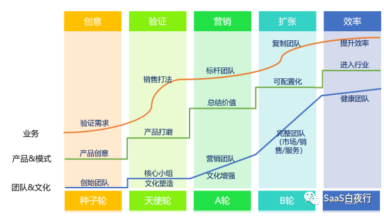

（SaaS创业路线图）

原本打算在10月底书稿完成前只写一些轻松的公号文章。但这周书写到“融资”这个章节，看了很多资料，也没有找到一篇文章能把SaaS公司的估值原理说清楚的。

再往硅谷看，美国SaaS上市公司的P/S（市销率）近5年来也是在3.3倍~9.6倍之间大幅波动。敢情大家要10倍P/S都是拍脑袋定的啊！

所以我决定自己动手做一个模型，就叫 **“SaaS公司经营及估值财务模型”** 。

我本科专业是会计，还考过注册会计师，算这个还有点儿基础。毕竟是全新的部分，直接放书里如有错误不好再改。

这篇是偏探索性的文章，我已经先请几个投资圈的朋友们提过意见，再发公号文请SaaS圈的朋友们提提建议。

### 一、 **建立经营模型的前提假设**

“建模型”听起来是咨询公司高大上的活儿，其实并没那么复杂。我尽量讲得浅进浅出，在SaaS公司工作的读者应该都能看得懂。

我做了一个20年SaaS公司经营模型。模型是对现实的简化，因此要做很多基于事实的假设。我把它像剥洋葱一样一层层剥开， **大家看完也就对如何经营SaaS公司有了一个全面的理解。**

**1.1 营收预测**

假设一家SaaS公司2011年初开张，当年完成（新客户）新单300万元。今后每年新单收入以30%的速度增长。也就是说，第2年新单收入为300万元 x 130% = 390万元。

30%的增速是一个估计的平均数，可能初期快一些，后来慢一些，但为了建立一个简单模型，我们简化为：每年都按照30%增长。

同时，从第2年开始，该公司的金额续费率（含老客户增购金额）为80%。也就是说，第1年带来300万新单收入的客户（假如有100个），为公司在第2年带来的续费+增购收入为240万。第3年，这100个客户的续费+增购为第2年的80%，即240万 x 80% = 192万。以此类推。

具体可见下表：

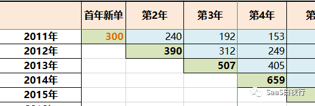

（以上绿底色格子中的数字即为每年新购的金额，蓝色格子中为前一年新签客户在此年续费及增购金额，单位为：万元）

**1.2 毛利计算**

我们假设该公司新客户的获客成本（CAC）为新客户合同金额的80%，其中包括：销售提成、销售代表底薪、销售团队费用、市场推广费用及市场团队费用等。国内外SaaS公司的获客成本大致在首单金额的40~100%之间，80%算是中位数。也就是说，新单毛利为20%。

相对而言，SaaS公司的续费成本不高，对应成本只有客户成功团队的薪酬、奖金及管理费用。所以我们假定该公司的续费毛利为70%。

以上数据可以推算该公司每年的毛利情况。

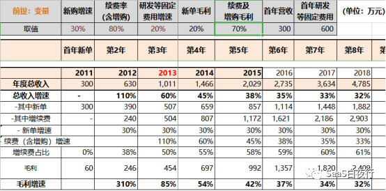

**1.3 研发等费用增速**

在SaaS公司里，除了市场、销售、服务三大业务部门的成本，产品研发费用往往占很大比重。

这里我们介绍一下变动成本与固定成本的概念。

从营销视角看，SaaS公司的变动成本是与“销售额”相关的成本，也就是上面说的获客成本（CAC）80% 及续费成本30%。对应的是新单毛利率=1 - 80% = 20%，续费毛利率=1 - 30% = 70%

与“变动成本”相对应的，公司还有很多“固定成本”。这些固定成本在短时间内（例如2、3个月）与营收没有直接关系，也就是说无论销售收入有多少，研发、行政、高管工资等费用都是会发生的，所以称为“固定”成本。对于SaaS公司来说，研发支出会在其中占大部分。

假设第1年的研发及行政等其它所有费用为600万（是营收的2倍），并且这些费用按每年20%的速度增加，就可以计算出公司每年的利润数字（准确地说，是息税前利润（EBIT））。

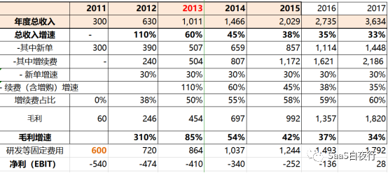

可以看到，该公司第一年亏损540万，第二年亏损474万，直至第7年才达到盈亏持平。

**1.4 投资回报率（ROI）**

我们假设公司在第3年，也就是2013年获得一笔风险投资。那么这笔 **投资的回报率** 就是我们建立这个模型最终输出的指标。

我们假设该公司能够开办共20年时间 —— 实际上很多公司开不到20年，做得成功的SaaS公司也不止开20年。取20年也是为了简化我们这个测算模型。

在这背后，我曾经用了5种经营时长及增速指标的组合来模拟，其中有前20年增长、后10年衰退的30年模型；也有增速每年变化的20年模型，结论其实都是接近的。所以我在这里用20年都按同一个增速来模拟，已经可以在很大程度上接近真实情况。

开篇说到关于SaaS公司估值的问题，最大的话题就是为什么能拿10倍PS估值？

其实我们回归到投资回报的本质 —— 拿回利润和分红。所以我们只要把该公司历年的利润合计后，就能得到投资回报率。也就是说：

**累计投资回报率 = 历年利润的总和 ÷ 投资金额 x 100%**

**年均投资回报率（ROI）= 年均利润 ÷ 投资总额 x 100%**

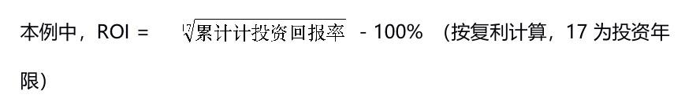

如果在2013年，VC是以当年销售额的10倍估值投资这家SaaS功能公司。当时估值为当年营收1011万元 的10倍，即10,110万元\(1.011亿元）。

从2014年至2030年的经营状况，可以根据我们的模型进行演算。

最终17年净利合计为：137,110万元（即13.7亿），我们简单计算公司累计价值就是13.7亿。则累计投资回报率为：13.711亿元 ÷ 1.011亿元 = 1356%，按复利计算ROI为16.6%（即，平均每年投资收益为16.6%）。

如果只看最后的ROI，这可以算是一笔不错的投资。也就是说，2013年投资时，按10倍PS估值还是合理的。当然，前提是这家企业正常延续20年，在实际商业环境中，这还是有很多风险的。

我们从经营的角度做几个趋势图分析一下。

首先，我们观察盈亏平衡点在哪一年出现。

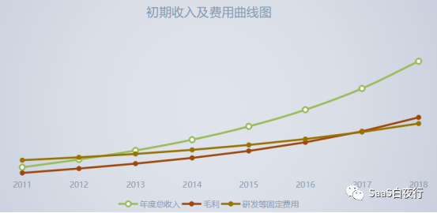

从上图可以看到，虽然年度总收入增速（30%）已经比较可观，但公司要到成立第7年（也就是获得投资后第4年）才开始盈利，前期投入大、见效慢，公司由于现金流血过多猝死的概率是较高的。

再看另一张图：

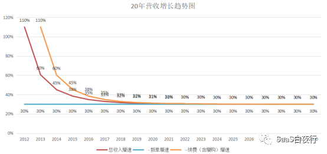

从这张20年营收增速图可以看到，SaaS公司在初期的总收入增速很高。这来自“续费”的红利。新单增速保持30%不变的情况下，续费（含老客户增购）在总收入的占比从第2年的38%，很快提高到第3年的50%，第4年开始则达到62%。

但图上也能看到，最终续费（含老客户增购）的增速、总收入的增速，也包括图上没有画出来的“毛利”的增速，都不断趋近30%. 也就是说， **虽然SaaS公司有“续费”这个在商业模式上的独特之处，但如果金额续费率（含增购）不特别高（例如超过100%），从更长时间（例如10年）角度看，整个公司的营收及利润增速，仍然只与“新单增速”相关。这与传统生意，并没有多大区别。**

下面，我们再看更细一点。观察每个关键指标的具体影响。

### 二、 **几个关键经营指标对投资回报率的影响**

我们观察某一个指标变化（同时固定其它指标）对回报率的影响，就能够发现更多有趣的结果。

**2.1 新购增速的影响**

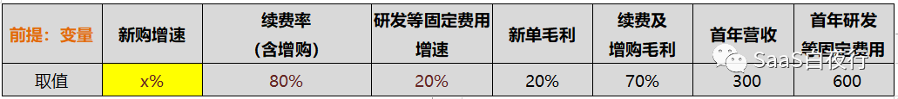

在以上参数固定的情况下，我们观察平均“新购增速”与17年累计投资回报率之间的关系。

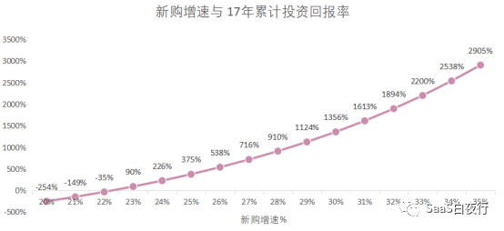

平均新购增速不到23%的情况下，投资回报率为负数。随后在28%之后，新购增速对投资回报率的影响加大。

**这说明在续费率（含增购）低于100%的情况下， **SaaS公司的长期增长，** 主要依靠增加新客户拉动。**

**2.2 研发费用增加对投资回报率的影响**

我们固定其它参数，只观察研发费用（包含其它行政等固定费用）的增加，对ROI的影响。

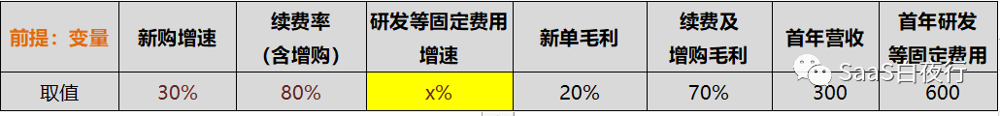

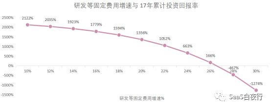

肉眼就可以看到，研发费用增速超过18%之后，累计投资回报率加速下滑；研发费用增速达到27%时，累计投资回报率接近于0。

结合对比“新购增速”指标后，可以发现， **“研发费用”增速不可超过“新购增速”，否则年度利润也持续为负数。**

**2.3 续费率（含增购）的影响**

我们再看看“续费率（含增购）”对累计投资回报率的影响。

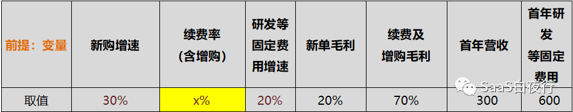

上表中，其它指标都固定的，只有“续费率（含增购）”从45%上升到150%。由此得到一条累计投资回报率与续费率间的关系曲线：

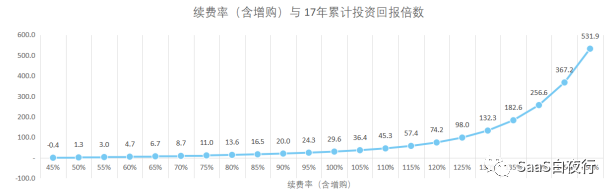

（注意：此处点上的数值为“倍数”而不是百分比）

当续费率（含增购）超过85%之后，回报率则会呈现加速增长。如果能将包含增购的续费率提升到100%以上，回报率的增速更明显。

再看一下续费率（含增购）与年均投资回报率的关系。

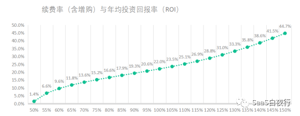

续费率超过120%后，ROI曲线出现上翘的趋势，说明续费率对投资回报率的影响会逐渐加强。说明一下，140%以上的续费率（含增购）并非不可能。美国很多SaaS公司和国内服务大客户的头部SaaS公司是能够做到的。

**因此对SaaS公司来说，良好的续费率是基础；“交叉销售”更多新产品、扩大客户企业使用人员范围等增购动作则会使公司腾飞。**

### 三、 **小结**

直接算17年累计利润的方法虽然笨了一点儿，但更直观，也更回到投资回报的本质。这个经营财务模型背后还有很多能总结出来、并能指导经营实践的规律；这篇信息量已经很大，我写书时再补充进来。

**通过这个数字模型，我们有两个最主要的发现：**

A、研发费用的增速超过新购增速的情况下，公司很难实现盈利。

我们在国内商业环境中，发现很多拿了大钱的SaaS公司反而迟迟不能盈利，究其根本原因，就是上面第二条：研发费用增速超过了新购增速。它带来的启示是： **将“研发费用增速”控制在合适的范围，应该向研发管理要效率，不应该做研发上的粗放式投入。**

B、在续费率（含增购）<100%的情况下，毛利增速、总收入增速，最终与新购增速趋同。

新购增速从哪里来？一般方法是：依靠提升销售团队的工作效率、依靠提升品牌影响力和客户口碑传播。这当然都应该做，但都还只是战术层面的工作。

我们再反思一下：在国内，一个“工具型SaaS”产品，从提供价值（提高客户企业效率）、到营销方式，其实都与传统软件没有多少区别。

爱因斯坦说：疯狂就是重复做同一件事情，却期望获得不同的结果。

**通过演算这个SaaS公司的经营财务模型，我的结论是：如果没有优异的续费率（含老客户增购），SaaS与传统生意相比并没有什么特殊优势。**

SaaS公司要么坚持做工具但金额续费率（含老客户增购）要能够超过100%；要么就需要考虑为客户提供更多增值价值。这方面的可以参考我关于SaaS公司商业模式的几篇文章，文末有链接。

当然，即便要做商业SaaS，先完成一个优秀的工具SaaS，得到稳定、爱用的客户群体是前提条件。 **所以我不断地讲，“SaaS的本质是续费”。通过这个财务模型再次得到证明。**

今天这篇建模的方法来自我自己多次参与编制SaaS公司年度预算的痛苦经验。初次发表研究商业的数字模型，难免有疏漏，欢迎大家一起探讨。

如果觉得内容不错，欢迎转发朋友圈。谢谢。

【往期高阅读量文章】[SaaS创业路线图（一）](http://mp.weixin.qq.com/s?__biz=MzIxNjc2MTc2MQ==&mid=2247483723&idx=1&sn=6423dcaba7538316072689de8d960786&chksm=97855585a0f2dc9372eff4180a9372de22c6f29966a593d63ce10ef2a17ee5a43fa55093867a&scene=21#wechat_redirect)
[SaaS的本质和SaaS公司的大坑](http://mp.weixin.qq.com/s?__biz=MzIxNjc2MTc2MQ==&mid=2247483673&idx=1&sn=09305a41e6751bf0e1bdc4352b796b64&chksm=978555d7a0f2dcc191788c0535579384b2dd82c30717dc265681b6279b9980aa100083358ee7&scene=21#wechat_redirect)
[SaaS创业路线图（34）SaaS公司的数据价值](http://mp.weixin.qq.com/s?__biz=MzIxNjc2MTc2MQ==&mid=2247483961&idx=1&sn=3abcd8a51fb6006f7a9c0c3fd0c36a6f&chksm=978556f7a0f2dfe10c2ac728143b7fd97a5f43fd50705a7e2443a8f767c4e7257ecf734dd58a&scene=21#wechat_redirect)
[SaaS创业路线图（39）可复制的市场成功](http://mp.weixin.qq.com/s?__biz=MzIxNjc2MTc2MQ==&mid=2247483997&idx=1&sn=6a664dfe9564edf0284fcf5eb3bd4146&chksm=97855693a0f2df85865f225467cad08b4f88684333f111957fecb9f7225c151536b640d63135&scene=21#wechat_redirect)
[SaaS创业路线图（49）如何评估SaaS公司的经营状况？](http://mp.weixin.qq.com/s?__biz=MzIxNjc2MTc2MQ==&mid=2247484102&idx=1&sn=240128fec39b4571cffa8837b27a11ea&chksm=97855608a0f2df1e91d909aba7353f6d23b16bcec2505238e215422a859c5af2c2df8a371566&scene=21#wechat_redirect)
[SaaS创业路线图（57）数据在企业演进中的价值](http://mp.weixin.qq.com/s?__biz=MzIxNjc2MTc2MQ==&mid=2247484163&idx=1&sn=7e5c75a43c5943a01b15c5b49a37af2b&chksm=978557cda0f2dedb111e98c0617d2f91ba652966b606d7f1fcdca1a616f95e5604ab2c814ba3&scene=21#wechat_redirect)
[SaaS创业路线图（55）SaaS产品分类及其发展方向](http://mp.weixin.qq.com/s?__biz=MzIxNjc2MTc2MQ==&mid=2247484145&idx=1&sn=0e1c9b0f812cf929e43b48e7b2e51836&chksm=9785563fa0f2df2969bba593d2d3803dbd0014f456b2712e90c3868ef4a562226d6e69143c69&scene=21#wechat_redirect)
[SaaS创业路线图（60）做商业SaaS的还算SaaS公司吗？](http://mp.weixin.qq.com/s?__biz=MzIxNjc2MTc2MQ==&mid=2247484176&idx=1&sn=396a09d54f1546d1fcd51b29bc44fe25&chksm=978557dea0f2dec8a6261fa8af38c74fa2a2905984f2c4d64822fba0847bcd5dcfbcac46fab0&scene=21#wechat_redirect) [SaaS创业路线图（61）客户成功管理框架](http://mp.weixin.qq.com/s?__biz=MzIxNjc2MTc2MQ==&mid=2247484190&idx=1&sn=636f440f30cbb7d8b0ed781621f510cd&chksm=978557d0a0f2dec600e7a2d13f30e951fdacc37007172c8f968f135bdb8afd55ee20856aba21&scene=21#wechat_redirect)
[SaaS创业路线图（62）线索客户流转及SDR管理](http://mp.weixin.qq.com/s?__biz=MzIxNjc2MTc2MQ==&mid=2247484202&idx=1&sn=5a9268bf6b12f49149c3f2dbec7cb46a&chksm=978557e4a0f2def231bf6ffd8e855ff71afe39d8e7f0a6b7756c558f17aab12cc077cea40521&scene=21#wechat_redirect)
