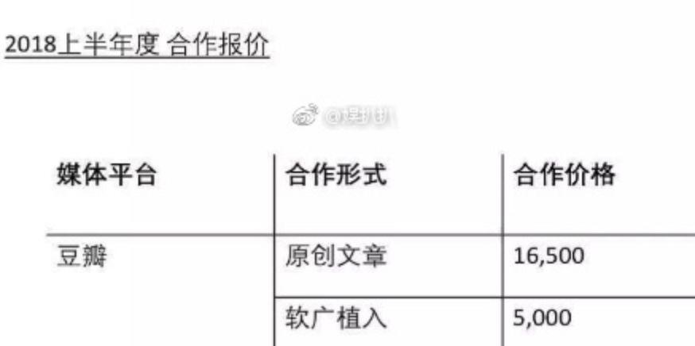

## 作为豆瓣头部网红，为什么我在微博上接不到广告？  

> 发布: 36氪的朋友们  
> 发布日期: 2019-10-25  

编者按：本文来自微信公众号[“刀姐doris”](https://mp.weixin.qq.com/s/vg2SMO3TLfLLqYzSgLzPrg)（ID：doriskerundong），作者  王逅逅，36氪经授权发布。

最近的瓜实在有点多，闹得沸沸扬扬的「KOL投放刷量」事件，本周也基本有了实锤：微博官方确认涉事方蜂群文化违规操作，并暂停了该机构所有账号微博的广告投放与接单，但针对博主账号真真假假的各种争议，仍没有停止。

我们她经济研究所的会员——王逅逅也有话要说，作为头部博主的她，在豆瓣与微博都拥有10W+粉丝，不仅是时尚博主，还是出过三本书的青年作家。这次她结合曾经的电商创业经历，为我们带来了新的观点视角——

大家好啊，我是王逅逅，我又来啦。

我与刀姐是大概在15年的时候认识的。那时她在豆瓣上找到我做美国电商的黑五广告，也算是非常前沿。

当时我在豆瓣的粉丝数大概是5w，是豆瓣生态中能排进前400名之内的小博主。

据我当时的观察，5w以上并且不断产出的博主并不多，我能看见和认识的似乎只有十几个。现在我的粉丝量是10w，能够算是豆瓣头部网红。

说回与刀姐的那次合作经历，我在2015年“黑五”期间，以豆瓣号「王逅逅」先后发布了2篇博文，最终两篇的数据基本都维持在“近6万人浏览，3~4千赞，4~6千收藏，近200次转发”。

我与刀姐的合作内容的数据情况

对于我而言，最终达到了120%的曝光率，这是没有买粉，认真写内容的真实数据。

然而在微博上，我发现了另一种博主的营业生态——一个有400w粉丝的时尚博主，与某品牌合作了一支Vlog，在买了热门位、头条推荐之后，最终的数据是这样的：

“172转发，280评论，1600+赞”（还不算可能买的粉丝与转发），一个400w粉丝的微博博主，曝光数据还没有我这个豆瓣5w小网红的多？！这个结果，让一个从豆瓣来的人大开眼界。

即便这样，还有品牌乐此不疲地投放微博博主？这样的流量数据，还能让人挣到钱？

### 01 “神奇”的转化率

我的微博如今也有10w+粉丝，和豆瓣相当。由于豆瓣的名气，我在微博上做过两三个广告，比如上海的一家脱毛机构，和一些时尚品牌。

有意思的是，在发布了脱毛机构推广微博的2小时内，就被联络我的公关公司告知——已经买了热门和假评……这类「常规操作」，使得在微博生态中，博主方（我）其实并不能了解真实的转化情况……

然而在豆瓣生态中却是另一幅光景，2015年我在豆瓣上写了一篇淘宝店铺的推荐文，虽然只有不到6w人浏览，收藏量则是1w5，数据极度真实，不掺水分：

至于转化情况，那时我还没有用淘宝客，具体数据已无法衡量。不过几年后，在与一家曾被我写在推荐文里的淘宝店沟通时得知——我的一篇文章的种草，为他们的淘宝店带来了1W+粉丝的增长。

一万的量级，也让我完全不敢想象。因为当年我与合伙人都是在美国读书的学生，仅仅因为喜欢淘宝而开始做推荐。

后来在微博上制作内容，很快被微博不以兴趣为分类，而以砸钱为前提的推广方式烦到了。直到如今，我也在寻找一个平衡--好内容是有的，但是一定要交钱吗让大家看到吗？

就像是你明明可以考到一个重点高中，因为别人都塞钱进，所以你也要塞钱。

如果不塞钱，就会被淘汰。

这种机制难道没有问题吗？

### 02 我在豆瓣做头部网红的发现

在豆瓣做一个有10万粉丝的头部网红，我的感觉是：实在。

豆瓣不是一个一炮而红的平台，豆瓣上的红人也很少会一炮而红，然而在不能快速变现的平台上，红人也不会快速死亡。

因为红人红起来的基础，是内容。

很多人会认为，豆瓣太「文艺」，文艺无法变现。然而这些人忽略的一点是：能够用语言文字表达自己的人才值得被转发。

看看反映豆瓣平均水平的话题广场，就能知道这个群体的文字表达能力。

在豆瓣有10万粉丝，大概花了我10年的时间。也正因为花了10年建立起这样的关系，我不会随便接广告，如果接广告，我会跟广告商说：这个文章一定要用我自己的方式来写，因为只有这样，我才不会被骂得太狠。

豆瓣这样的生态规则，造就了可以做内容的博主。之后这些博主流失到微博和其他平台，几乎都成为了大号。

我们熟知的咪蒙、晚晚、西门大嫂、Papi酱，都是从早期的瓣友，后走向其他平台的influencer。

微博的机制则是——砸钱。

如果你不买粉丝，不买数据，不是大号的朋友，铺天盖地的信息流，凭什么给你推荐？整天被娱乐头条刺激的用户们，如何注意到优质的内容？

所以微博“筛选”掉了一批不愿意给微博交保护费的原创博主。

转战微博之后我做的妥协是：宁可抽奖转发，也不肯购买热门。交给微博的钱，不如送给粉丝。

比如，一个原来只有100多转发的视频，经过转发抽奖视频中的耳环，

变成了300多实际转发：

然而这样的策略也不知道能坚持多久。

### 03 因为做过博主，所以不会投放微博博主

当我在做时尚电商品牌gogoand的时候，我与合伙人在研究了一圈时尚博主以后，发现投放博主的回报率太小了。很多时尚类博主在刚开始并不是以推荐为主开始火的，而是以营造一种“你看，别人都在喜欢我“的从众心理开始火的。

所以当她们开始推荐产品，尤其是以一种粉丝不熟悉的大篇幅，整支视频方式产出时，大家是抱着怀疑的态度的。

比如这次蜂群事件微博博主的这支Vlog就是个典型：记录所谓的fancy（有趣）生活，不输出看法，流水账一样的拍摄风格。一看就是公司大批量运作的。

微博的不可持续性在于不能很好地扶持小众博主，无法给真心分享生活，做内容，而不是借着资本捞钱的分享者流量。这样的话，好看的内容只会越来越少。

然而豆瓣却是另外一码事。豆瓣用户的粘性很高，对于博主个人的买粉和控评几乎不存在，一有存疑的产品出现就会被高度敏感的豆瓣用户扒皮，所以这导致豆瓣博主对于推广的产品品控会更高，粉丝的接受度也会更高。

分享一个故事，我曾经做过一家香港医美机构的嫩肤/脱毛微博广告。这家机构我自己花钱做过一年半的脱毛，作为一个资深用户，我跟他们提出，为什么不在豆瓣上做广告呢？他们的回答是，因为每次在豆瓣做广告都会被骂。

这家医美机构已经是我去过最高标准的机构了，然而还会被豆瓣用户怀疑，这也说明了豆瓣用户的谨慎（xiaoqi）。

豆瓣用户「膈应和难以讨好」的名声不是一两天了。曾经有一位拥有10w粉丝的女孩，在豆瓣上做广告，最后竟然被爆料了。

爆料的原因是，一条一万六，太贵了？？

严格的豆瓣用户，对博主有着极强的信任感。我也曾在豆瓣也做过淘宝客链接，记忆最清晰的是我发了一条“真心推荐，这件太好穿了”的广播，五分钟内，就有20多件的下单量，这让我非常惊讶。

那是我当时很喜欢的一个淘宝小众品牌，自己经常买之后联系了店主给我淘宝客链接。而现在，我成为了这个牌子的合伙人。

同样的事，如果发生在微博的话，效果会是是很不同的——大家会留言、评论，购买却少很多。因为大家对于微博的推荐总是抱有疑心的——“怎么可能没收钱，在微博上推东西？”

### 04 TO品牌方，关于投放，我的几点建议

因此，我想说，如果没有大把钱可以烧的品牌，一定要注意平台，还有KOL与粉丝的沟通方式——KOL接到品牌方给出的brief后，是随便把品牌文案改一改，还是重新用自己的话讲一遍？这些小的细节，能够帮助你了解这些KOL是否对自己发布的内容有要求。

只有对自己内容负责的KOL才会吸引忠实的粉丝，愿意自掏腰包来表示支持。（并且倾向持续花钱

对此，我有几条建议：

1、投放自己开店的博主，不会投放那种经常做广告的账号，圈一波钱就跑路

以前我曾经认为，那些自己开店的博主并不适合投放。因为广告信息会和博主自身的店铺推广相冲突。而我现在认为，正是因为博主自己开店，才能够确定TA有真正的流量。

有一位我认识的淘宝店主，在微博拥有14万粉丝（应该算是很少的），淘宝店铺月销能够达到70万。

通过这一数据，也能证明粉丝对她的信任度，以及博主的带货能力。同时，粉丝能够持续成为回头客，也证明她推荐内容时会比较谨慎，质量也相对较高，因为没有人会想自打脸，从而失去那些为自己花钱的忠实铁粉。

2、投放自己喜欢的博主，调性一致很重要

做品牌的主理人应该投放自己喜欢的博主。我知道有人会推荐可以“带货”但是与品牌调性不符的博主，先不论数据的真实性，有没有想过，这会让品牌显示出一种混乱的形象？就像一个女装店开始卖男袜，让人匪夷所思。

微博上还有一些宠物，漫画博主的粉丝，看到fo的人终于开始接广告后，也会带着支持和相信的心态去下单购买，有种“崽你终于接到广告，阿爸替你开心”的感觉。

3、搞清楚是做branding（品牌）还是marketing（推广），是曝光还是带货

我的理解是，branding是一个长期的过程，让大家认识你，从不同频道看到你。比如肯德基，麦当劳做的就是长期的branding，他们不指望大家看到一个campaign（战役）之后立刻去消费多少个汉堡。

然而marketing是一次一次的，目的就是带货，提升销售业绩。我有一个朋友曾经为某电子用品品牌做marketingcampaign（推广战役），为的是在一个时段内推某一个特定产品。而由于产品本身性价比不高，外国品牌又不那么懂中国的微博KOL生态，砸了一百多万在微博KOL上，耳机卖了的总价还不到marketing的一半。

所以，branding和marketing，这两者同时需要的都是：优质的，大家看到可以记住的内容。

### 05 结论

最后再分享一个故事，我有一个居住东京的朋友，曾经代表一本比较权威和大众的国内杂志去采访一些东京的“网红”咖啡馆，结果人家都拒绝了他的采访。

他们的原因很简单，不想被暴露在与自己调性不合的聚光灯下。

其实作为博主，自己的内容就像是品牌的产品，博主的产品就是自身的内容和信誉。而建立用户和博主的信任是个长期耕耘的过程。

-如果不想被大浪淘沙，博主应当要良性运营，拒绝快钱；

-而对于品牌来说，投放也要擦亮眼睛，筛选有内涵、受粉丝信任的博主。

上次刀姐在微博上说了一句话，我觉得说得特别好：

买的，假的，堆砌的，时间最终会告诉你——这些都不是你的。
