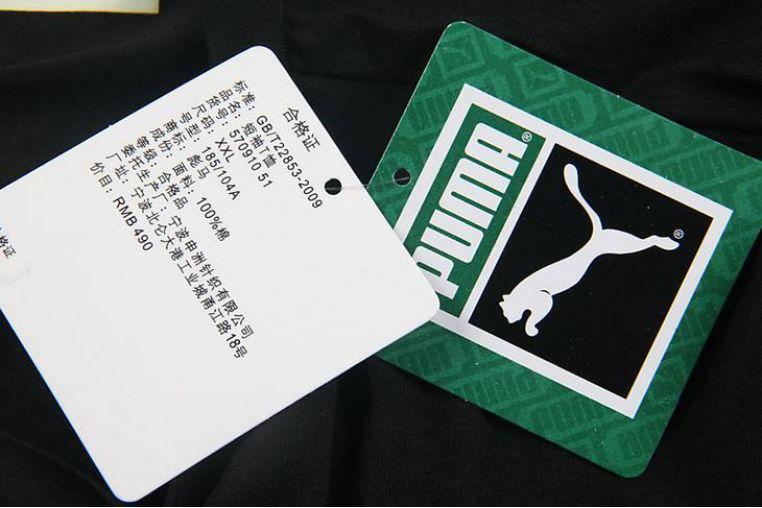
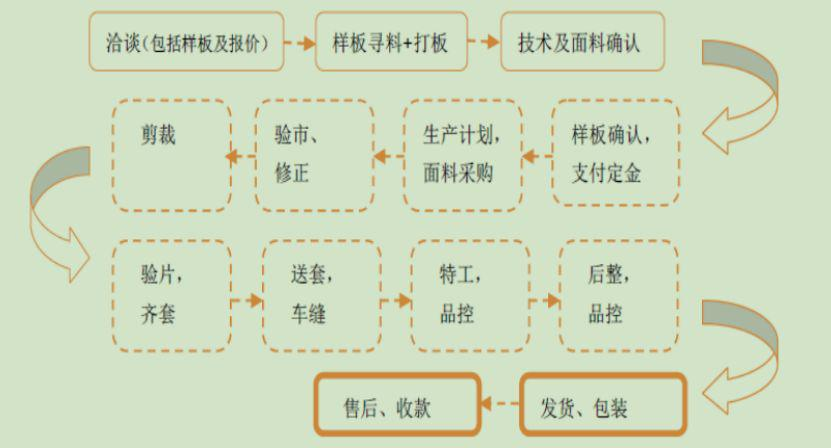
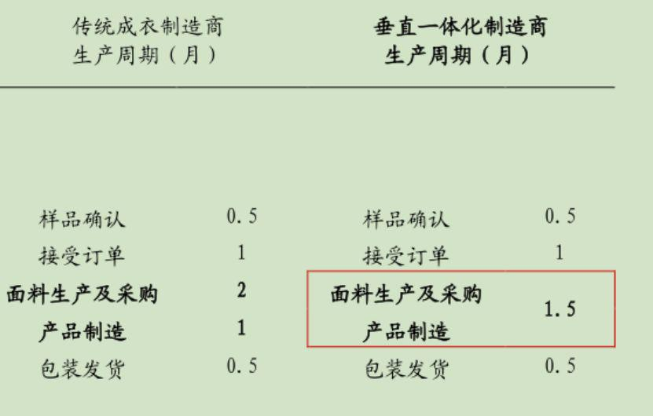
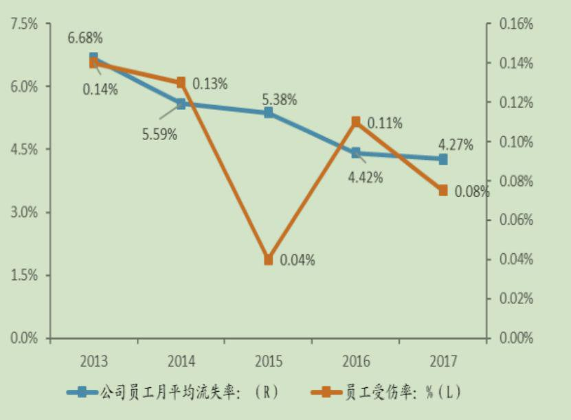
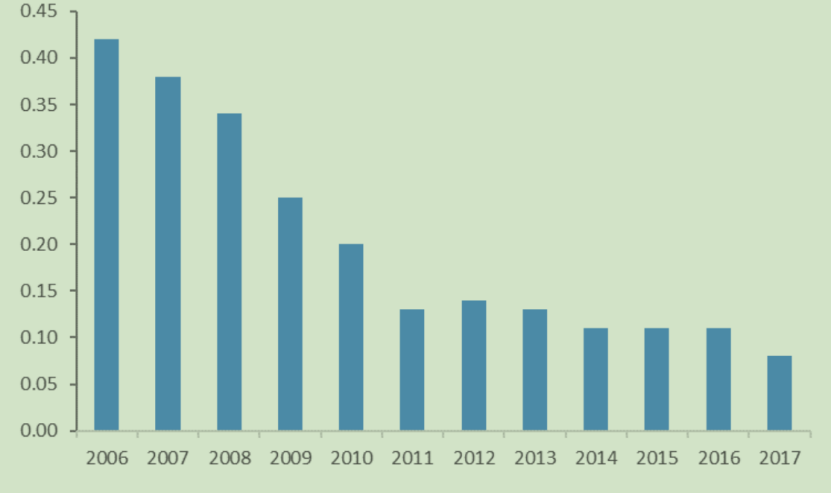

## 穿过阿迪耐克，你却不知道背后的代工之王  

> 发布: 混沌大学  
> 发布日期: 2019-11-22  

编者按：本文来自微信公众号[“混沌大学”（ID：hundun-university）](https://mp.weixin.qq.com/s/6OUUdR47FP_7faZNSnpViQ)，作者 Michael Liu，36氪经授权发布。

制造业一向被认为是高投入、低盈利、重资产的行业，而其中的代工业务又处在制造业鄙视链的最低端。

然而，有这么一家服饰代工企业，毛利润率为31.6%，净利润率21.4%，相比中国最赚钱的公司之一腾讯，2018年毛利润率30%，净利润率26%。

盈利能力直逼腾讯，它是如何做到的？

### 01.巨头背后的隐形冠军

相信许多人都穿过耐克、阿迪达斯、彪马或者优衣库品牌的服饰，要是稍微注意一下吊牌，你就会发现有家企业的名字经常出现：宁波申洲针织有限公司。

图：彪马服饰吊牌，来源：互联网

这可不是一家地方性的小代工厂，申洲国际是不折不扣的服饰行业隐形代工之王。

它是中国最大的针织出口企业，和许多国际知名服饰品牌建立有长期的、稳固的合作关系，订单量分别占有运动品牌耐克、阿迪达斯、彪马以及休闲品牌优衣库总量的12%/14%/30%/14%。每年平均生产超3亿件服饰，包括亚太和欧美的绝大部分市场。

看到这里，你可能会觉得，听起来像是服饰界的富士康。

不！尽管服饰行业总是给人劳动密集、利润稀薄、“8亿件衬衫换不回一架飞机”的印象，但从利润率而言，申洲却更像是服饰界的腾讯。

2018年，申洲国际的毛利润率为31.6%，净利润率21.4%。中国最赚钱的公司之一腾讯，2018年毛利润率30%，净利润率26%。

这个数据远远跑赢了行业平均水平。2018年中国服饰纺织行业规模以上企业毛利润率15.1%，净利润率5.89%。名声在外的工业富联，也就是富士康旗下A股上市公司，净利润率只有4%。

做代工，也可以把利润率做到比肩腾讯的程度。那么，申洲国际是如何做到的？

### 02.成本控制造就代工企业的利润奇迹

我们知道，利润=售价-总成本。想要提高利润率，要么提高售价，要么降低成本。一般公司往往把功夫下在“提高售价”上，毕竟提价容易降成本难，于是企业干脆就把成本的压力转嫁给下游消费者了。

而申洲国际做的是难事。申洲在每一环节的销售单价基本保持与市场同步，当原材料成本发生波动时，即便是申洲，也需要和客户谈判产品提价的问题。也就是说，申洲相较于同行（服饰代工）更高的盈利水平不在于它更高的售价，而在于其优秀的成本控制能力。

说到成本控制，在制造业，人们首先想到的就是原材料的成本控制。但是对于申洲而言，最重要的原材料是棉花和纱线，恰恰这两种原材料价格波动非常小，想要依靠谈判在原材料成本上建立绝对优势是很困难的。

那么，申洲把成本降在什么地方？

#### 全产业链垂直整合——最大化降本空间

既然是降低成本，首先要有足够的空间来进行“腾挪”。这是一个显而易见的道理，比如纱线的成本是3元，做成面料可以卖5元，这一环节上，降本做的再好也不超过2元。如果公司除了做面料，还把后续的裁减、成衣都做了，最后衣服出厂价到10元，这样企业就有了7元的成本空间可以操作，这个例子解释的就是所谓“全产业链垂直整合”。

“7元”的腾挪空间有了，申洲下一步就是从这里抠利润。首先我们来看一下传统服饰的制造流程。

图：传统服饰生产制造流程，来源：天风证券

可以看到，整个制造流程极为繁琐。尤其是当企业只负责其中某个或者某几个环节时，就不得不和其他环节的供应商进行采购、谈判，这会大大延长整个制造周期。

这是服饰代工行业中大部分中小企业的做法，这一模式完成核心流程至少3个月。而申洲全产业链垂直整合下的一体化模式，各个环节“无缝衔接”的特点，可以把工期缩短到1.5个月。

缩短工期意味着什么？成本降低。

同样的人力投入，竞争对手完成一批订单要3个月，而我的企业只需要1.5个月，理论上讲，我的劳动生产率就是竞争对手的2倍。

图：传统制造模式和一体化制造模式工期对比

那么，现在又出现一个新的疑问，为什么一体化模式就能把工期缩短一半呢？

根本原因在面料研发上。

人们想当然认为服饰代工是劳动密集型产业，但这种认知不完全对。准确的讲，成衣制造是劳动密集型产业，而面料的织造却是技术密集型产业。

也就是说，成衣这一环节没什么技术壁垒，而面料这一环节技术壁垒很高。

如果一个追求全产业链垂直整合模式的代工企业，无法自主研发面料，那就很难发挥一体化制造的优势。

向第三方采购面料会大大提高成本，同时采购、谈判、等待的时间会进一步延长工期。

回到上一张图可以清楚地看到，申洲的工期缩短来自“面料生产及采购和生产制造”环节，它已经做到了面料自主研发。事实上，申洲不仅面料自主研发，而且面料全部供给内部使用，不外售。这进一步压缩了不具备面料研发能力企业的生存空间。

申洲在面料研发上的优势不是一朝一夕完成的。从2013年到2016年，申洲仅面料相关的专利就有69项。此外，它投资5亿元建立了两个世界级研发中心，每年开发新面料1000种以上。

申洲在面料研发上的优势大大促进了企业的成本控制，此外，一体化的制造模式还有一些容易被忽视的优点。

1. 一体化制造模式往往采用一体化的制造园区进行生产，这也意味着各个环节之间的物流成本、运输时间被打掉，进一步降低成本。

2. 品牌商（比如耐克）对于传统的OEM企业，往往要进行各个环节监督，这也提高了代工企业的供应链管理成本，同时拖累工期。但是对于申洲这样的企业，一体化制造模式+面料ODM（面料自主研发，非代工）模式，不再需要品牌商的监督，从而降低了全链条成本。

#### 技术改造，提高劳动生产率

如果把申洲的一体化制造模式做一个简单分割，可以分成两大部分。一就是面料研发，二是成衣制造。

前者包括研发原材料配方设计、面料结构和染整，这一部分的特点是技术密集型，不需要太多人力，主要由机器完成。而后者，也就是成衣制造，主要包括织布、裁减、成衣等环节，这一部分的特点是劳动密集型。

说简单一些，成衣制造，大家都能做，拼的是谁的效率高。

效率高的含义是又好又快。产品合格率高，用时少，劳动生产率持续提升，这是降低成本的另一个维度。想要做到这一点，仅仅依靠工人的双手是无法完成的，必须依靠机器设备的助力。

因此，申洲在生产线的技术改造上，也进行了持续不断的投入。

申洲在2000年之前，公司90%的利润都投入到技术改造里。2005年，公司上市之后，依然没有停下技术投入的脚步。上市融资的9亿多港币，全部用来升级设备。

从2007到2017这10年，公司每年的资本支出比例占到当年净利润的40%以上，十年间，资本支出接近95亿，这些钱大部分都投入到设备和技术改造中。

截至到2017年，申洲共计拥有专利188项，其中91项是产品面料研发，97项属于技术改进和设备研发。

这一系列的投入为公司带来了什么呢？劳动生产率的大幅度提升。

从2013到2017年，年人均净利润从3.2万元提高到4.9万元。如果把时间进一步拉长，从2006年到2018年，公司的年人均产出已经翻倍，从10.4万元/人到现在的不低于23万元/人。

申洲在产线技术投入方面做的相当务实。根据董事长马建荣的说法，申洲用技术创新主要达到三个目的：高效化、舒适化、去技能化。

什么叫去技能化呢？就是尽量减少产线员工的繁琐操作，复杂的动作都交给机器去做，不仅能够降低出错率，同时还缩短培训时间。通过模块化的技术应用，新员工的培训时间从数个月缩短到了几个小时。培训时长，也是成本。

而仅仅提高劳动生产率还不够，还有一些隐形的成本浪费是不易发觉的，比如管理成本。

申洲国际有8万余人，工厂遍布大陆和东南亚的越南、柬埔寨等地。如何管理才能最大化的降低管理成本呢？

我们提出一个思考路径：哪些成本是和这8万名员工直接相关的？

首先是流失率，这关系到招聘成本。招聘一个工人的成本在几百到几千不等。此外，频繁招聘也会影响产线效率。

其次，作为制造企业，员工的受伤率也会进一步提高管理成本，因为受伤就要缺勤，降低劳动生产率。

在这两个指标上，申洲国际是这么做的。

1\. 尽可能的采用自动化设备，降低工人工作的繁琐程度，减轻对人力的过度依赖。这降低了人员流失对生产效率的影响。

2\. 在申洲国内的工厂，公司承诺工作10年可以把员工宿舍的产权授予员工。这促进员工能长时间的留在公司。

3\. 在柬埔寨，给员工提供工作餐。虽然在国内提供工作餐不是新鲜事，但申洲是第一家在柬埔寨提供工作餐的中国企业。此外，申洲也是唯一一家在越南提供厂房空调设备的中国企业。这些措施大大降低了员工的流失率。

降低员工流失率的同时，精细化管理培训以及新设备的使用，让员工的受伤率也维持在极低的水平，做一下对比，2016年，申洲主要客户之一阿迪达斯自有工厂的受伤率为1.5%，同期申洲只有0.11%。

图：申洲国际员工流失率与受伤率，来源：兴业证券

#### 低成本是“省”出来的

申洲的精细化生产和管理，渗透到非常多的细节之处。

在制造业中，水、电、气等能源消耗是巨大的。这些成本，根据发生地的不同，会被计入到不同的成本项目中去。比如车间的能源消耗，归入了制造成本，办公室的能源消耗，归入了管理成本。

很多企业把节能减排当作企业的负担，事实上，如果节能做的好，也能够给企业省下一笔不小的费用。

2006-2017年，我们还可以看到，申洲的万元产值能耗也在持续下降。

图：公司年万元产值能耗（吨标煤/万元产值），来源：兴业证券

而每一次的耗煤量降低，都会反映在公司的净利润率上。

2018年，申洲锅炉热能回收系统产生蒸汽3.3万吨供给生产使用，这一项就节约成本75.57万美元。

2018年，生物质和煤的总消耗量降低了17%，原因是使用了效率更高更清洁的天然气锅炉。不仅是热能回收，印染中水回收以及其他一切可以循环利用的资源，申洲都不浪费。

申洲甚至聘请了两位院士，设立院士工作站，努力达成“2025零排放”的计划。

### 03.总结与启示

作为一家典型的制造业公司，而且处在制造业中的不利位置——代工，申洲国际却走出了一条不一样的路---通过精细的成本管理，让企业拥有了比肩腾讯的盈利能力。

回顾一下，它主要采用了如下方法：

1. 全产业链垂直整合，扩大成本腾挪的空间

2. 牢牢把握住核心环节——面料研发

3. 精益化的生产管理，持续提高员工的劳动生产率

4. 追求“零”浪费，能回收则回收，能复用则复用

把这几点放在一起看，同属于一个概念：精益生产。

说到精益生产，总会让人联想起“丰田模式”，事实上，精益生产是对“丰田模式”的简化与总结。

不论哪种形式，目的是相似的。它们都是通过系统结构、人员组织、运行方式等方面的变革，最大程度精简生产过程中一切无用的、多余的东西，追求最佳的生产效率。

如果对精益生产从字面理解，是听起来并不性感的内容。比如追求七个“零”：“零”转产工时浪费、“零”库存、“零”浪费、“零”不良、“零”故障、“零”停滞、“零”灾害。

这些要求，不是新鲜的东西，那为什么国内企业学了几十年，有的企业学会了，比如申洲国际、福耀玻璃，大多数企业还是学不会呢？这背后的深层次原因是什么？

马建荣在接受央视记者采访时，这样说道：“我是一个笨人，所以我只做从一根棉线到一件衣服这样一件事情，但我相信凭借我们申洲8万多人的团队，我们就能做好服饰纺织这个事情”。

福耀玻璃的曹德旺也曾说，以前有人劝他去做金融、房地产，统统拒绝了，他就是要专心做好一块玻璃。

这是一种怎样的哲学思考？

据说曾国藩打仗，奉行六个字：结硬寨，打呆仗。“结硬寨”就是挖战壕、筑高墙、稳扎营、固守，敌人打过来，我就把它击退，然后窝到寨子里不出来，积极防守。“打呆仗”是说不进攻，只守着，把敌军围困到弹尽粮绝。清末的太平军虽然骁勇善战，遇到这种打法也没辙，最后往往是弹尽粮绝、人心涣散、乖乖投降。

其实，通过对精益生产和申洲国际、福耀玻璃的观察研究，你会发现，它们背后有曾国藩式的哲学，说简单一点，就是想要获得大成功，就得下点笨功夫。

近年来金融行业产能过剩，挣扎在去杠杆的阵痛中，而房地产也已经走过了黄金时期。对于企业而言，最可怕的不是不作为，而是耍小聪明刻意给自己一种很有作为的错觉。
