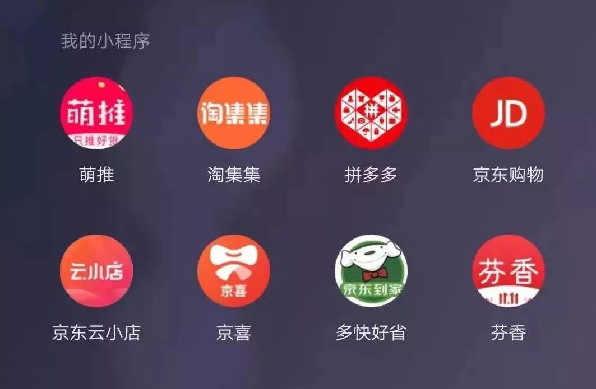

## 互联网大厂激战下沉市场：看不见的厮杀与肉搏  

> 发布: Tech星球  
> 发布日期: 2019-11-22  

编者按：本文来自微信公众号[“Tech星球”（ID：tech618）](https://mp.weixin.qq.com/s/oB0vUHssmf1LM1NfLXucug)，作者 杨业擘，36氪经授权发布。

2018年7月，拼多多从“五环外”走上了纳斯达克，在天猫/京东固守的电商城池中，“农村包围城市”在商业上再次取得了成功。

2018年10月，《藏在县城的万亿生意》一文刷屏，互联网行业的目光开始从北上广，聚焦到全国的285个地级市、2856个县城、41658个乡镇。

一时间，“下沉、下沉”成为互联网大公司的主旋律。阿里、百度、京东、字节跳动等互联网大厂纷纷提出下沉战略，互联网开启了一场浩大的“上山下乡”运动。

互联网向“下”发展的源动力，来自于下沉市场广袤的发展空间。

2019年5月，Questmoblie数据显示，下沉市场用户规模超过6亿。其中大多数不经常网上购物，网上获取内容信息的手段也比较单一。谁能抢先占据这些人的用户心智，谁将在未来互联网的竞争格局中立于不败之地。

当然，不可忽略的是，下沉市场存在互联网基础薄弱、用户消费挑剔等各种难题。然而，面临流量红利消失的互联网大厂，还是认准了这片待开发的新兴市场。在过去一年中，密集调动资源攻克下沉市场。

### 下沉市场彻底变了

进军下沉市场，并不是将原有产品服务，直接复制到下沉市场。这是过去一年中，互联网大厂的重大思维转变。

刷墙下沉已经过时

京东的下沉策略最早可以追溯到2014年，当时京东试图将其供应链辐射到二、三线以下城市，让更多人享受到高品质的电商购物。不过，过去几年中，京东商城、京东小店的下沉战绩，都没达到预期。2018年，京东的线下专卖店开设近2000家门店。推进速度不理想，刘强东提出的“未来五年内开设100万家便利店”能否实现亦未知。

苦攻线下成果不显著，而拼多多借助社交流量红利，迅速圈拢大量用户的手段，让京东幡然醒悟。

2018年6月，京东为下沉市场打造的超新星计划上线。2019年2月，小程序电商平台“芬香”成为京东社群电商战略合伙伙伴。9月份，京东拼购品牌升级为“京喜”。

京东围绕京东商城APP，组建了芬香、京小哥、京喜、云店等超过5款小程序的“航母战斗群”，与拼多多、淘集集、萌推等下沉市场玩家激战。

社交电商大合照，京东独占5款

家住江西吉安的李伟，今年被北京的朋友拉进了京东的优惠购物群。每天都会有机器人推送优惠购物消息。双11是下沉市场最激战的时节，李伟仔细对比了几家的优惠措施。他向Tech星球（微信ID：tech618）表示，京东99%的商品都在芬香设有专属优惠或返利，适合日常购买。

“天猫则适合新品抢购”，双11期间，李伟在天猫参加活动盖了50多层楼，赚了20块钱现金。另外，聚划算双11优惠力度更大，一件马克华菲羽绒服，满减了300元，几乎节省了一半。一位天猫店小二则告诉Tech星球：“今年聚划算上导售的商品，70%是近一年上市或者聚划算定制品牌。”

与往年不同，今年李伟基本没有抢购山寨品牌，他更在意社交推荐的好货和新品折价的大牌。但他也直言，“今年双11玩得心累”，为参加各电商平台拼够玩法，不到200多好友全被他打扰了个遍。

李伟和电商平台对品牌优惠的关注，表明下沉的电商市场，正在进行一场悄然的消费升级，不再唯“9.9包邮”通吃。同时，Tech星球注意到，下沉市场对信息获取的方式，也在发生转变。

过去一年中，百度着重推动了手机百度APP和好看视频的突围。10亿投放春晚背后，是百度视下沉市场为增长的关键。

过去，门户的下沉方式是开设地方网站。比如，腾讯网在陕西地区开办了大秦网、在西南重庆地区开办了大渝网等。在四线城市河北邯郸，百度设置了内容中心。“我们无意回到去中心化的地方站时代，建站的更多原因是反补本地信息”，收集而来的地方信息，最终以智能推荐的方式，呈现给当地消费者。

这场全方位的下沉中，不仅内容获取发生变化，内容推送的逻辑也不一样。

一位百度人士说道：“下沉用户会问姚明和科比谁高，类似关键字搜索无法解决的问题。”下沉市场特殊的需求，也让互联网行业看到现有的产品远不能满足用户需求，百度内部也正在开发知识提取引擎第二代搜索产品，解决那些看起来很简单，但却较难回答的问题。

一位头条内部人士告诉Tech星球（微信ID：tech618），这也是头条做搜索的主要原因。用推荐无法获得下沉市场的用户黏性，搜索+推荐才能形成打动用户的闭环。

下沉市场不仅促使互联网产品多省好玩，掀起了“返璞归真”的潮流，多款产品推出了极速版。

各大APP上线极速版

面对趣头条在下沉市场的快速崛起，今日头条的应对策略，就是在2018年推出极速版。下沉用户往往对针对一线城市设计的复杂产品不感冒，因此更加简洁的功能，与趣头条类似的金币激励阅读等“网赚”玩法，今日头条也打响了下沉之战。

### 互联网大厂的下沉套路

与此前砸广告、请代言人的推广手段不同，下沉市场中，各家都在卸下偶像包袱，以社交裂变、乡镇地推、绕回开发版本等更接地气手段，不断向下沉市场渗透。

“一天轻松赚300-400吧，关键是没什么成本投入”，山西太原郊区的王华向Tech星球（微信ID：tech618）介绍，目前其代理的“芬香”每日收入还可以。王华所从事的京东X芬香会员导购电商体系，正是下场市场最主流的社交裂变玩法。

一直以来，王华在当地做本地电竞赛事，过去几年手中积攒了几十个本地群。近来琢磨如何将这些社群变现，直到京东的朋友推荐了他这个项目。

10月份去了趟北京，了解到芬香在京东内部比较受重视，而且可以借助京东的电商体系发展，自己只需要投入精力和时间，拉会员组建京东优惠群即可。

如今已是导师级别的王华，向Tech星球发来了一张海报二维码。扫描海报上的二维码，即可成为王华的超级会员。以后每天群发商品链接，成交一份获得一份佣金收入。“芬香还可以发展下线会员，形成裂变的电商体系”，王华现在每天的工作就是在找当地有社群资源的人谈合作。

“我的上线赵欣，以前是巧太太厨卫的操盘手，每天收入３－４万元吧”， 刚入行一个月的王华，已经成立工作室，目标是成为“赵欣”。

芬香的社群团购裂变模式，以不收取任何费用、售卖商品分佣模式发展。这与主打拼购的京喜有很大区别，前者主要任务是拉客，后者主要是找人一起团购。

越来越多的用户，被拉进京东的优惠群。品牌调性与拼多多有明显区别的京东，如今在下沉市场的形象，不仅越来越“拼多多”，甚至越来越像会员模式的云集。李伟就告诉Tech星球，京东优惠群和拼多多团购群他都在，“哪家便宜去哪购买”。

与京东打造芬香、京喜等多个分身去下沉的方式不同，58同城则是演化出另一个自己，一个从名字上就能看出更下沉的产品——58同镇。

58同城的孪生兄弟58同镇，正成为58集团董事长姚劲波最常提到的产品。在9月的乌镇世界互联网大会上，姚劲波如此强调58同镇的重要性：“我们把58同镇看成是二次创业。”

广东惠州的58同镇代理商马坤，是龙门、博罗、惠东三个县城的总代理。现在马坤有3个微信号，每个号都加满了5000个好友。每天收集当地招聘、房产、二手买卖等信息。

58同镇的地推

当地餐馆是重点争抢的地方，马坤会与餐饮老板谈合作，在餐馆的桌角贴上58同镇本地版或者微信公众号二维码，也会争抢当地三轮车的广告位，“这些位置一般100-200块就可以搞定”，马坤经常遇到的竞争对手，是O2O时代遗留下来的本地生活服务网站。比如，诞生于深圳，主打四五线城市的网站“微井同城”。

尽管微井同城运营负责人杨先生，始终认为和58同镇模式不同，并不构成竞争。但每个地区的信息广告资源是固定的，58同镇有品牌优势，会邀请杨幂等大众熟知的明显代言，对其还有很强的竞争压力。“马坤手下有位大镇代理，每月收入在3000-4000元左右，而我们调研的微井同城一位乡镇站长，收入在千元左右。”

一位58内部人也告诉Tech星球（微信ID：tech618），下沉市场就是大力出奇迹：“本地生活服务没什么创新，就是赚辛苦钱，我们比美团还辛苦。”

除了京东的分身、58的演化模式，还有一种下沉方式正在流行起来，那就是推出主APP的极速版。

过去走热点明星内容路线的微博，如今也在用极速版回归生活，以此打动下沉市场用户。

Tech星球了解到，微博内部十分重视新产品绿洲，要求每个人都要到绿洲上发朋友圈。微博CEO王高飞也将绿洲形容为新浪未来10年的倚重。

但出师不利的绿洲，无法为微博贡献更多的用户增长。财报中微博用户数增长，主要来自下沉市场。微博为下沉市场，推出了只保留核心功能的极速版，同时与小米、魅族、OPPO、vivo展开合作预装。

今年双11，内蒙的张发就给在老家的父母买了部红米Note8手机，里面预装的微博极速版无需下载，刷刷明星新闻、看看广场舞视频，“微博极速版就像土味生活广场”。

如微博一样，很多互联网公司都推出了极速版产品。其中，抖音极速版推广的方式更野路子，在东北地区出现了下载抖音极速版，送鸡蛋的地推手段。

极速版就像卸掉偶像包袱的罗志祥，舞台上他是能唱能跳的明星，短视频中的罗志祥是逗比的“小猪”。而这种接地气的极速版，也获得了下沉市场认可。

易观发布的数据显示，2019年10月，MAU超千万APP增速Top20榜单中，抖音极速版以月环比69.84%的增速位列第二，10月活跃用户数已达到1985.3万人。这个榜单中，快手极速版以49.67%增速位列第三，但是快手极速版的活跃用户已经达到了5478.3万。

极速版占据3-4位

人称下沉市场“四大天王”的趣头条孵化的免费网络小说产品米读，也想要进一步下沉。米读极速版10月份的活跃用户数，已经达到了1692.4万，月环比增速22.1%。

### 下沉战绩哪家强？

####

过去一年轰轰烈烈的下沉之战中，几乎每家都公布了战绩，但也遮遮掩掩的。

京东是第一个宣布下沉成绩的选手，最近发布的京东Q3财报显示。截至9月30日，京东过去12个月的活跃购买用户数为3.344亿，环比二季度同期新增1300万，超过70%的新用户来自低线城市。

其中，京东双11超新星计划成交额近7亿，当前成交额还比较少，但京东还是制定了庞大的下沉计划。

两年拓展出50万个京东电商社群，京东为自己定了个小目标。目前，官方宣布已经建成9万个微信社群。从Tech星球（微信ID：tech618）接触到的京东优惠购社群编号显示，目前已经排到21万多。京东想占据每个人的社群，拼多多想占据每个人的私信，二者的下沉决战可以说才刚刚开始。

电商下沉学拼多多，内容下沉学趣头条。趣头条的极速版和金币激励模式，对其他内容产品下沉增益的效果，从微博的成绩便可窥一二。

2019年9月，微博的月活跃用户数为4.97亿，较上年同期净增约5100万，同比增长11.4%。增长速度已经陷入低谷的微博，2018年Q2还公布50%用户来自下沉，2019年Q3季度则不再公布。

应当说，微博对极速版前景，以及下沉市场的政策出现了摇摆。微博极速版上，签到发微博即可积累现金。但是用户普遍反应没能提现，例如网友李飞就反馈：自己其实就积攒了9块钱，但微博经常以审核未通过为由，没能成功提现。这类情况并不是少数，微博极速版的贴吧中存在很多类似的情形。

当然，互联网巨头的下沉战绩究竟几何，并不能以用户增长为唯一衡量标准，对下沉市场商业环境的塑造，也值得关注。

58同镇公布的数据显示，目前其已经做了1万多个镇，年覆盖用户超1亿用户。“下沉市场好的镇，站长月入过万元，个别月入10万”，姚劲波曾向媒体说道。

但Tech星球（微信ID：tech618）访问不同区域的多位站长发现，实际情况远没有那么理想。把站长当副业的居多，很多收入在2000-3000元左右。

2019年三季度，58同城营收达到42.58亿元，同比增长17.4%；其中增长主要来自58同城、安居客等平台的付费商户和会员数增长。58同镇还未成为营收增长的主力。

同时，拼多多刚宣布的Q3财报显示亏损23亿元，下沉市场“鼻祖”都仍未盈利，下沉市场的商业生态也刚刚建立。

下沉市场并不是流着奶牛与蜜的“应许之地”，而是需要辛苦挖掘才能采到石油的荒漠。

由此可见，下沉之战将会是一场持续战。
