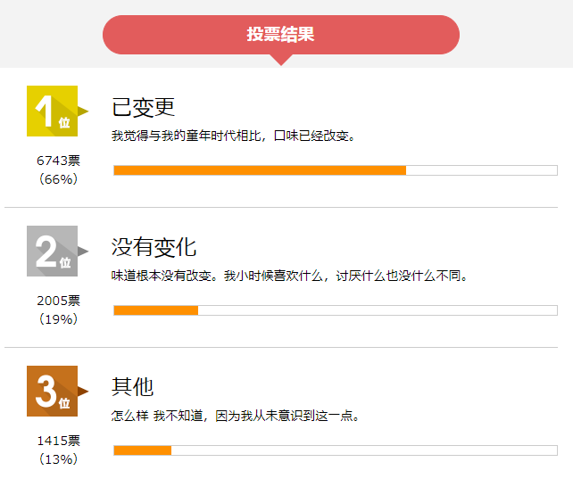

## 揭秘日本食品界的“大人味”，我们找到了消费分级的新灵感  

> 发布: FBIF食品饮料创新  
> 发布日期: 2019-11-22  

编者按：本文来自微信公众号[“FBIF食品饮料创新”（](https://mp.weixin.qq.com/s/I6tGSwZ66PJOkNFov2_pBw)ID：FoodInnovation），作者 Momo\(Wenky\)，36氪经授权发布。

曾几何时，年少的你是否憧憬过大人的世界？大人可以不用听父母的说教，可以不用写作业，可以喝酒......似乎成年后就能成为自己的主人，想干什么就干什么。

但现在的你，长大成年后却发现，如网上流行的那一句“成年人的世界，没有容易二字”一般，成年人的生活中处处是辛酸。

当你被生活、工作的压力压到奔溃，可能吃下一碗面条、一条巧克力就能得到治愈——这就是美食的魔力。那么问题来了，食品行业该如何关爱成年人？

在日本，不少食品企业“独宠”成年人，它们为了这群成年人也是操碎了心。如果你经常购买日本的食品饮料，可能会注意到不少产品上都有“大人のXX”“大人の味”字样。“大人”在日语中意为“成年人”。“大人味”究竟是什么味道？为什么要强调“大人味”？今天FBIF就带大家走进“成年人的味觉世界”。

### 01 “大人的”巧克力，“大人的”冰棒......

大人味到底是什么味？

日本Potora网站发起“成年后味觉是否变化”投票结果，图片来源：Potora官网

一直以来日本都有“大人味”的表达，日本知名排行网站Potora曾发起过两项关于“大人味”的投票，一个是“成年后味觉变了吗？”，结果66%的人表示“有变化”，19%的人选择“没有变化”。另一个是“你觉得有大人味的食物是什么？”，结果显示20%的人选择了啤酒，14%的人选择了黑咖啡，8%提到了日本特有的盐辛（一种将生海鲜直接腌制的食物，味道咸腥）。

转向包装食品饮料界，“大人味”指的就是酒的味道？或者黑咖啡的苦味？但转念一想，难道成年人就告别小孩子爱的甜味了吗？那也太苦了。事实上，日本食品饮料中，最常见有“大人的”标签的恰好就是甜味零食。

明治“大人的蘑菇山、竹笋村”，图片来源：明治官网

2013年明治推出“大人的蘑菇山、竹笋村”。明治蘑菇山和竹笋山是两款经典的巧克力饼干零食，深受孩子们的喜欢。“大人版”蘑菇山和竹笋村吃起来和普通版味道上有什么区别呢？

据了解，大人版蘑菇山、竹笋村和普通版最大的不同是添加了可可粉。薄薄一层可可粉洒满小小的“蘑菇”和“竹笋”，一口咬下饼干碎和可可粉一同落入嘴中。正如包装上所说，可可粉的微微苦涩刚好平衡了巧克力的甜，同时丰富了一层绵密的口感。沉浸在浓郁的可可香气中，整个人都放松了。

赤城乳业X日本可口可乐“大人的GariGarikun菠萝碳酸冰棒”，图片来源：赤城乳业官网

GariGarikun冰棒自1980年诞生以来，逐渐成为日本国民级冰棒产品。“GariGari”在日语中是拟声词，指的是刨冰制作时嘎吱嘎吱的声音，由于冰块颗粒较大GariGarikun冰棒吃起来也能发出嘎吱嘎吱的声音。2015年赤城乳业针对成年人开发出“大人的GariGarikun”系列，成年人的冰棒吃起来是不是也是嘎吱嘎吱的呢？

答案是No。大人的GariGarikun在口感上做了调整，吃起来更接近质地紧实、口感细腻的意式冰淇淋。此外，大人系列的果汁含量也高于普通版，整体更加“高级”。如今年4月赤城乳业和日本可口可乐联名推出“大人的GariGarikun菠萝碳酸冰棒”，不仅入口即化，由于添加了强碳酸汽水，吃起来还格外刺激。吃一口冰棒打一个嗝，这种舒爽大概是成年人才懂的吧！

格力高ZEPPIN咖喱，图片来源：格力高官网

说完甜味零食，咸味食品表现如何？格力高的ZEPPIN就是针对成年人消费群体推出的咖喱系列。“ZEPPIN”意为“绝品”，这个系列在咖喱的原材料选择上较为讲究，如辛辣的洋葱、微苦的可可粉和酸涩有香气的红酒。而使用这些原料的目的只有一个——让口味更浓郁、更有层次感。包装上“浓厚的大人味”已经很表达地很明确了，成年人爱吃味道更浓的咖喱。

举了三个例子，相信大家对“大人味”有了一定的理解。对于小孩子喜欢的甜食，比如巧克力、饼干等，日本企业会控制产品的甜度，增加一点“小时候不接受，但现在喜欢”的苦味。而在挑选咸味食品时，大人比小时候更爱“重口味”——浓郁、咸香，或再来点辣。

还有一点值得注意的是，人们小时候吃东西时可能更在乎口味，但长大后开始对食品的口感“挑剔”，大人追求高级、富有层次和刺激的口感。

### 02 此味非彼味，食品企业比你更懂“成长的滋味”

“大人味”的“味”其实不仅仅指的是味觉上的味道，还有那些成年人才懂的，那些心照不宣的痛点。

1、 拒绝幼稚，大人也能光明正大地挑选零食

都说懂人情世故是成年人要学会的智慧，但有时候过于在乎他人目光会导致无法遵从内心。就像一些成年人会碍于面子而不吃巧克力这种看上去是小孩子喜欢吃的东西。

其实有时候不是长大了口味变了，只是因为色彩鲜艳、有着卡通图案的包装阻止了伸向它们的手。

KitKat普通版（左）和大人版（右），图片来源：KitKat官网

或许巧克力可以换个符合大人审美的包装，比如日本大人版KitKat就将原先的红色包装换成了黑色包装。就像大人喜欢给孩子买大红色的衣服，自己却常穿黑色西装。黑色包装让这款KitKat看上去多了一丝“沉稳”的气息。大人版KitKat除了外表黑，里面的巧克力涂层也比普通版颜色更深，吃起来也没有普通版甜。

可以发现，前面提到的明治蘑菇山、竹笋村和GariGarikun冰棒、格力高ZEPPIN咖喱也都在包装上选择黑色为主色调，大人味食品在包装上追求视觉上的“低调”，深色也呈现出一种质感。

还有一种方法是减少或去除包装上的卡通元素。包装上的小动物对孩子来说吸引力十足，但可能对大人来说是一种幼稚的标签。

LOTTE雪见大福，图片来源：LOTTE官网

LOTTE大人的雪见大福，图片来源：LOTTE官网

日本LOTTE雪见大福的包装上有一个标志性小兔子形象。但是“大人的雪见大福”完全不见小兔子的身影，取而代之的是表示口味的抹茶和生巧的图案，这让大人的雪见大福从包装上看仿佛一道高级甜品。

2、 长大后，吃东西都得看成分表了

有一种长大是，开始关心自己的身体健康。不少成年人在选购食品饮料时会查看产品的配料和营养成分表。

麒麟午后红茶“大人的苹果茶”，图片来源：麒麟官网

2016年麒麟的午后红茶推出“大人的苹果茶”，主打0卡路里的卖点。小时候爱喝的含糖饮料或碳酸饮料都有较高的热量，长大后为了避免“发福”，低热量、0热量成为成年人选购饮料的标准之一。

サンポー“叉烧拉面 大人的碳水off”，图片来源：サンポー食品株式会社官网

又如2019年サンポー食品株式会社推出“叉烧拉面 大人的碳水off”，特点是比同品牌产品降低了35%的碳水化合物。泡面原本就是高碳水食品，这让许多减肥人士对它敬而远之。所以一款减少碳水化合物的泡面，给那些想吃却不敢吃泡面的大人们提供了一个吃泡面的理由。

FANCL X DyDo“大人的卡路里限制系列茶饮料”，图片来源：DyDo饮料官网

2019年FANCL与DyDo饮料推出“大人的卡路里限制茶饮料”，声称饭后饮用可以抑制糖和脂肪的吸收。这是一款针对年轻女性的茶饮料，配料中加入了难消化糊精，满足她们塑形减重的需求。

3、 饮酒合法了，那什么和酒最对味？

在全世界很多国家地区，法律规定未成年人不得饮酒，在日本未满20岁的未成年人禁止饮酒。在中国也有不能向未成年人出售烟酒的规定。所以很多人成年后，第一时间都会想尝试大人才能喝的酒。

百奇“大人的琥珀”，图片来源：北本日記

开心时喝酒助兴，伤心时借酒消愁，酒似乎是成年人世界中表达情绪的最佳伙伴。喝点小酒，怎么能不来点下酒好菜？但现在很多年轻人对下厨并不感冒，有时候一包薯片、一袋花生米就足以下酒了。

日本食品行业看中了成年人的“下酒菜”市场。如2015年起百奇推出“大人的琥珀”，名字中的“琥珀”代表着威士忌的颜色，这是一款完全为了搭配威士忌而打造的百奇饼干。

百奇“大人的琥珀”上有三得利威士忌顾问的推荐，图片来源：北本日記

饼干棒融入了和威士忌原料一样的麦芽提取物，饼干棒外面则包裹一层有着威士忌香气的苦巧克力。而在包装上，不仅采用了和传统方盒不同的圆柱形盒子，字体设计、颜色搭配上都具有成年人的韵味。值得一提的是，包装上还有一处来自三得利威士忌顾问佐佐木太一的“安利”——大人的琥珀和威士忌一起奏出完美的和弦。

日本酒类贩卖株式会社X菊屋株式会社 奢华奶酪的大人零食，图片来源：日本酒类贩卖株式会社官网

2017年日本酒类贩卖株式会社和菊屋株式会社联手推出“奢华奶酪的大人零食”，酥脆的面衣中，注入浓郁咸香的奶酪。厚重的奶酪在口中溶化，再喝一口干爽的啤酒，每一口都满足。

### 03 俘获味蕾是第一步，走进成年人的内心世界才是终点

为什么日本会出现“大人味”的食品饮料产品？

我们可以从成年人和企业两个角度来看。

一方面，跨过18岁的门槛（日本是20岁成年），人们就成为一个独立的个体，比小孩子更加自由。不再是小时候父母为自己做选择，父母给什么吃什么，成年人开始自己选择食品饮料。

另一方面，正如文章前面所提及的，人们长大后的口味确实会发生变化。在日本，大人喜欢不那么甜，带点微苦，或者味道浓郁的食品饮料。这种口味上的变化其实在中国也有体现。CBNData联合天猫发布的《2019中国咖啡消费进阶趋势》显示，越来越多年轻的90后和95后开始喜欢黑咖啡，尤其是女性。黑咖啡虽苦，但是正合许多大人的口味。

从企业角度来说，在包装或者广告宣传中突出“大人的”卖点，其实是企业费尽心思走近成年人的内心世界。或者说是一种与成年人的沟通方式。

不只在食品饮料行业，如果你去过日本，会发现还有“大人的书店”“大人的游乐园”等。如JR东日本铁道公司就曾推出过“大人的假期俱乐部”特惠活动，鼓励大人在假期四处游玩。

成年人的味觉在变，内心也变了。不像小时候可以肆无忌惮地大笑大哭，成年人的世界似乎多了份小心翼翼。要不要买一包童年最爱的果冻？这个蛋糕会不会太甜了？饮料喝完会不会长胖？但如果货架上出现“大人的果冻”“大人的蛋糕”“大人的饮料”，那就完全免去了成年人的这些顾虑。

企业通过“大人的”声称，表达出一种对大人“成年人”身份的认同，从而拉近与消费者的关系——我懂你，所以你可以放心地选择我。有时候同样是一瓶减糖低脂的饮料，可能有“大人的”标签的产品会更受消费者的青睐。

除此之外，日本能出现“大人的”这种有特色的标签，还和日本整个人文社会有关。日本人常给人一种很有礼貌的感觉，实际上表达礼数是一种与人保持距离的行为。所以日本人在交流时会比较暧昧。在日本，比如当别人问你某款饼干吃起来怎么样，不用详细描述，你回答“吃起来是大人的味道”，别人就立马明白是什么感觉了。

众所周知，日本是一个动漫之国，无关年龄，小学生可以和中年大叔一起看动漫。“热血”“卡哇伊”这种相对来说低龄风格在整个日本很是流行。所以食品企业打造标榜“大人味”产品，可以表达出一种与众不同的品味。

### 04 在消费分级的中国，“大人味”会摩擦出什么火花？

那么日本的这种“大人味”也会在中国发生奇妙的化学反应吗？

近几年，“消费分级”在大家口中的“出镜率”变高了。如今消费者越来越有个性，他们很在意自己不同身份的不同需求。就像近年来备受中国食品行业关注的“小镇青年”“银发一族”等，企业会把握这些特定人群的画像推出相应产品。

相比之下，成年人群体的范围大太多了，虽然这可能意味着难以把握人们的精准需求，但是群体更大，同时意味着更多的机会与更大的消费体量。中国食品企业或许可以大胆一些，试一把“大人味”的产品。

首先，中国消费者对“大人味”这个宣称不熟悉，所以可以激发他们的好奇心，一个产品成功的前提必定是能够吸引消费者的。其次，主打“大人味”卖点可以提升品牌形象，并且形成自己的差异化竞争优势。对于一个老品牌来说，声称“大人味”可以为品牌带来创新活力，让消费者感觉到新鲜，而初创企业或许还可以将“大人味”打造成一个独特的IP。

但需要注意的是，“大人味”不是在包装上多了三个字这个简单，企业需要真正去挖掘成年人在口味、口感、原料等产品层面的需求。

前不久热映的电影《少年的你》中，传递出一种未成年人与成年人的矛盾感，成年人的世界比想象中残酷。少年的你会担心考试、朋友关系，但长大成人后要面对的问题比这些“重”多了、复杂多了。而食品行业，有能力也有责任给大人们带去轻松又简单的幸福。

愿每一个成年的你，都可以在吃东西时卸下一切，享受当下的快乐。
