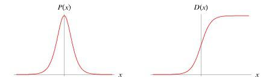
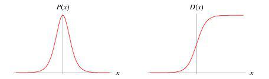
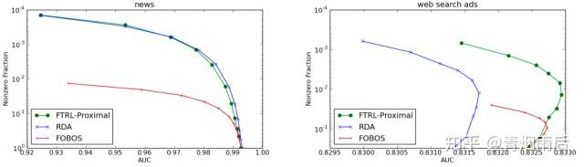
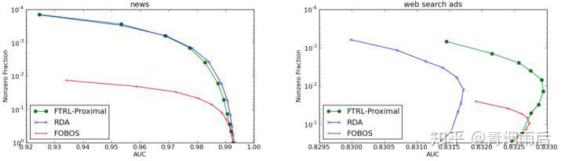

## LR+FTRL算法原理以及工程化实现  

> 作者: 青烟雨后  
> 发布日期: 2019-11-23  

### **前言**

在实际项目或者刷竞赛的时候，经常会遇到训练数据非常大导致一些算法实际上不能操作的问题。比如在广告行业中，因为DSP的请求数据量特别大，一个星期的数据往往有上百G，这种级别的数据在训练的时候，直接套用一些算法框架是没办法训练的，基本上在特征工程的阶段就一筹莫展。通常采用采样、截断的方式获取更小的数据集，或者使用大数据集群的方式进行训练，但是这两种方式在作者看来目前存在两个问题：

* 采样数据或者截断数据的方式，非常的依赖前期的数据分析以及经验。
* 大数据集群的方式，目前spark原生支持的机器学习模型比较少；使用第三方的算法模型的话，需要spark集群的2.3以上；而且spark训练出来的模型往往比较复杂，实际线上运行的时候，对内存以及QPS的压力比较大。

我自己以前在刷竞赛的时候，看到别人使用过FM+FTRL的模型实现了一个CTR算法，印象很深。自己使用的是DNN+Embedding的方式做的一个算法模型，从理论上看embedding肯定比one-hot encoder的方式更加先进且能真实反馈特征数据的相关性，但是实际效果看对方的FM\_FRTL得到的AUC比我高近一个百分点，而且可以在10G的数据上一个多小时跑完，而我的DNN+Embedding算法，因为没有GPU主机，跑一次需要十二个小时，严重影响了调参的积极性，这也是我非常想掌握FTRL的出发点。

更重要的是，考虑到刷竞赛与实际算法是否可工程化的的角度，FTRL结合LR或者FM是一个非常好的方向，比Top1开源的代码使用了PCA、NLP处理特征以及多个模型stacking的技巧，更具有学习或者借鉴的价值。

本文主要根据谷歌给出的FTRL理论论文，以及FTRL+LR的工程化实现论文，从理论到工程化实现LR+FTRL的开发，任一后端开发人员都能根据文末给出的python代码，简单的开发就能实现一个简单、高性能、高可靠的CTR预测模型。

###  **LR**

```
关键概念点：

1.logistic distribution
2.几率
3.对数几率
4.损失函数
5.参数估计
6.误差计算
7.随机梯度下降
```

###  **LR数学原理**

LR\(logistic regression model\)是一种分类模型，我们通常都知道：


但是对其实际的数学原理却不是很了解。logistics regression中的logistic指的是统计学中的logistic distribution:



标准logistic分布密度函数与分布函数

可以说LR是线性回归模型通过logistic的分布函数，将预测结果映射到概率空间，进而预测不同分类的概率，其概率由条件概率P\(Y|X\)表示。

LR模型既可以做二分类也可以做多分类，因为从事的是广告、营销行业的模型预估，本文只针对 **二分类的LR模型** \(binary logistic regression model\)做原理讲解以及模型工程化实现。

二分类的LR模型是如下条件概率的分布：


_几率：如果一个事件发生的概率是p，那么该事件发生的几率是发生的概率/不发生的概率:_


_对数几率：对几率取对数。_


代入公式\(2\)和公式\(3\)得到:


可以看出LR也可以认为是用线性回归模型的预测结果来预测事件发生的对数几率。

LR有很多优点，比如：

* 作为统计模型与机器学习的结合点，具有较好的预测结果以及可解释性。
* 直接对分类的可能性建模，无需事先假设数据的分布，这就避免了假设分布不准确带来的影响。
* 不仅预测得到分类，还有分类对应的概率，这对很多需要使用概率辅助决策的任务很有用。
* sigmod函数是高阶可导的凸函数，具有很好的数学性质，很多数值优化的算法都可以直接用于求解最优解。

###  **参数估计**

###  **损失函数**

逻辑回归模型学习时，对于给定的训练集，可以使用极大似然估计法估计模型参数（将权重向量w和输入向量x扩充一位），设：


似然函数是：


_对数似然函数：_


_这样逻辑回归的参数优化问题就变成了以对数似然函数为目标的最优化问题，也就是对公式10求最大值时的参数w；_

_实际应用中，通常是使用最小化损失函数的概念来寻找最佳参数空间，_ 所以对公式10取负号以及平均后得到逻辑回归模型的损失函数：


也就是我们常说的交叉熵损失函数，是一个高阶可导连续凸函数。根据凸函数优化理论，可以使用梯度下降法、牛顿法、trust-region等方法进行优化。

以梯度下降法为例，计算l\(w\)的梯度为：


所以样本第j个参数的优化方式为：


所有样本的第j个参数更新方式为：


当样本数据里N很大的时候，通常采用的是随机梯度下降法，算法如下所示：

```
while {
for i in range(0,m):
w_j = w_j + a * g_j
}
```

随机梯度下降的好处是可以实现分布式并行化，具体计算流程是：

1. 在每次迭代的时候，随机抽样一定比例的样本作为当前迭代的计算样本。
2. 对计算样本中的每一个样本，分别计算不同特征的计算梯度。
3. 通过聚合函数，对所有计算样本的特征的梯度进行累加，得到每一个特征的累积梯度以及损失。
4. 最后根据最新的梯度以及之前的参数，对参数进行更新。
5. 根据更新的参数计算损失函数误差值，如果损失函数误差值达到允许的范围，那么停止迭代，否则重复步骤1。

###  **工程化实现思路**

主要是需要实现参数更新计算以及损失函数计算。

###  **FTRL**

###  **相关背景**

广告、营销、推荐行业传统的机器学习开发流程基本是以下步骤：

1. 数据融合，获取训练以及评估数据集。
2. 特征工程。
3. 构建模型，比如LR，FM等。
4. 训练模型，获得最优解。
5. 评估模型效果。
6. 保存模型，并在线上使用训练的有效模型进行训练。

这种方式主要存在两个瓶颈：

1. 模型更新周期慢，不能有效反映线上的变化，最快小时级别，一般是天级别甚至周级别。
2. 模型参数少，预测的效果差；模型参数多线上predict的时候需要内存大，QPS无法保证。

针对这两个问题，一般而言有两种解决方式：

1. 对1采用On-line-learning的算法。
2. 对2采用一些优化的方法，在保证精度的前提下，尽量获取稀疏解，从而降低模型参数的数量。

传统的LR或者FM离线训练方法中，通常使用L1正则化的方法获取稀疏解；但是在线学习的时候，针对每一个样本的梯度下降方向并不是全局的，而是一个随机梯度下降的方式，简单的使用L1正则化并不能获得正确的稀疏解。

比较出名的在线最优化的方法有：

* TG\(Truncated Gradient\)
* FOBOS\(Forward-Backward Splitting\)
* RDA\(Regularized Dual Averaging\)
* FTRL\(Follow the Regularized Leader\)

其中TG截断比较武断；FOBOS能获得较好的精度，但是稀疏性较差；RDA算法会在牺牲一定的精度条件下，获得较好的稀疏性；而FTRL算法技能提高OGD（online-gradient-descent）的精确度，又能获得更好的稀疏性。



FTRL与RDA、FOBOS对比

###  **算法原理**

**参数权重更新**

FTRL算法权重更新公式为： 


由于 

 _相对于W来说是一个常数，并且令_ :


公式15等价于：


针对特征权重的各个维度将其拆解成N个单独的标量最小化问题：


公式17是一个无约束的非平滑参数优化问题，其中第二项 ![\[公式\]](https://www.zhihu.com/equation?tex=%7C%7Cw_%7Bi%7D%7C%7C) 在 ![\[公式\]](https://www.zhihu.com/equation?tex=w_%7Bi%7D) 处不可导。假设 ![\[公式\]](https://www.zhihu.com/equation?tex=w_%7Bi%7D%5E%7B%2A%7D) _是其最优解，并且定义_ ![\[公式\]](https://www.zhihu.com/equation?tex=%5Cxi%5Cin%7B%5Cpartial%7Cw_%7Bi%7D%5E%7B%2A%7D%7C%7D) 是 ![\[公式\]](https://www.zhihu.com/equation?tex=%7Cw_%7Bi%7D%7C) 在​ 

 的次导数 _，那么有：_


对公式17进行求导，并等于0，有：


由于 

 大于0，针对公式19分三种情况：

1. 当 

 的时候：
1. 如果 ![\[公式\]](https://www.zhihu.com/equation?tex=w_%7Bi%7D%5E%7B%2A%7D%3D0%E2%80%8B) ，由公式19可以得到 

 , **符合公式18的条件1**.
2. 如果 ![\[公式\]](https://www.zhihu.com/equation?tex=w_%7Bi%7D%5E%7B%2A%7D%3E0%E2%80%8B) ，有公式18得到 ![\[公式\]](https://www.zhihu.com/equation?tex=%5Cxi%3D1%E2%80%8B) ，那么 

 ， **不满足公式19.**
3. 如果 ![\[公式\]](https://www.zhihu.com/equation?tex=w_%7Bi%7D%5E%7B%2A%7D%3C0) ，有公式18得到 ![\[公式\]](https://www.zhihu.com/equation?tex=%5Cxi%3D-1) ，那么 

 ， **不满足公式19**.
4. 所以当 ![\[公式\]](https://www.zhihu.com/equation?tex=%7CZ_%7Bi%7D%5E%7B%28t%29%7D%7C%3C%5Clambda_%7B1%7D%E2%80%8B) 的时候， 

 。
2. 当 

 的时候：
1. 如果 ![\[公式\]](https://www.zhihu.com/equation?tex=w_%7Bi%7D%5E%7B%2A%7D%3D0%E2%80%8B) ，由公式19可以得到 

 , **不符合符合公式18** 。
2. 如果 ![\[公式\]](https://www.zhihu.com/equation?tex=w_%7Bi%7D%5E%7B%2A%7D%3E0%E2%80%8B) ，有公式18得到$\xi=1​ ![\[公式\]](https://www.zhihu.com/equation?tex=%5Cxi%3D1%E2%80%8B) ，那么 

 ， **不满足公式19**.
3. 如果 ![\[公式\]](https://www.zhihu.com/equation?tex=w_%7Bi%7D%5E%7B%2A%7D%3C0%E2%80%8B) _，有公式18得到_ ![\[公式\]](https://www.zhihu.com/equation?tex=%5Cxi%3D-1%E2%80%8B) _，那么_ ![\[公式\]](https://www.zhihu.com/equation?tex=Z_%7Bi%7D%5E%7B%28t%29%7D+-%5Clambda_%7B1%7D%2B%28%5Clambda_%7B2%7D%2B%5Csum_%7Bs%3D1%7D%5E%7Bt%7D%5Csigma%5E%7B%28s%29%7D%29w_%7Bi%7D%3D0%E2%80%8B) _，所以有：_

3. 当

 的时候：
1. 如果 ![\[公式\]](https://www.zhihu.com/equation?tex=w_%7Bi%7D%5E%7B%2A%7D%3D0%E2%80%8B) ，由公式19可以得到 

 , **不符合符合公式18** 。
2. 如果 ![\[公式\]](https://www.zhihu.com/equation?tex=w_%7Bi%7D%5E%7B%2A%7D%3E0%E2%80%8B) _，有公式18得到_ ![\[公式\]](https://www.zhihu.com/equation?tex=%5Cxi%3D1%E2%80%8B) _，那么_ ![\[公式\]](https://www.zhihu.com/equation?tex=Z_%7Bi%7D%5E%7B%28t%29%7D+%2B+%5Clambda_%7B1%7D%2B%28%5Clambda_%7B2%7D%2B%5Csum_%7Bs%3D1%7D%5E%7Bt%7D%5Csigma%5E%7B%28s%29%7D%29w_%7Bi%7D%E2%80%8B) _，所以有：_ 

3. 如果 ![\[公式\]](https://www.zhihu.com/equation?tex=w_%7Bi%7D%5E%7B%2A%7D%3C0%E2%80%8B) ，有公式18得到$\xi=-1​$ ![\[公式\]](https://www.zhihu.com/equation?tex=%5Cxi%3D-1%E2%80%8B) ，那么 

 ， **不满足公式19**.

综合上面的分析，可以得到FTRL特征权重各个维度更新的公式为：


**per-coordinate learning rates**

在FTRL中，每个维度的学习率都是单独考虑的。标准的OGD理论对每一个样本都是使用的相同的学习率: 

 。

一个简单的思维推理就能证明这种情况并不一定是最理想的：假如我们每一轮扔十个硬币，然后使用LR去预估i个硬币正面朝上的概率： ![\[公式\]](https://www.zhihu.com/equation?tex=P%28heads%7Ccoin_%7Bi%7D%29) 。假设使用相同的学习率 ![\[公式\]](https://www.zhihu.com/equation?tex=%5Ceta_%7Bt%7D%3D%5Cfrac%7B1%7D%7B%5Csqrt%7Bn_%7Bt%2Ci%7D%7D%7D) ，其中 ![\[公式\]](https://www.zhihu.com/equation?tex=n_%7Bt%2Ci%7D) 是 ![\[公式\]](https://www.zhihu.com/equation?tex=coin_%7Bi%7D) 正面朝上的次数。如果![\[公式\]](https://www.zhihu.com/equation?tex=coin_%7Bi%7D) 比 ![\[公式\]](https://www.zhihu.com/equation?tex=coin_%7Bj%7D) 正面的次数更多，那么 ![\[公式\]](https://www.zhihu.com/equation?tex=coin_%7Bi%7D) 的学习率应该比 ![\[公式\]](https://www.zhihu.com/equation?tex=coin_%7Bj%7D) 下降的更快，表现为![\[公式\]](https://www.zhihu.com/equation?tex=coin_%7Bi%7D) 具有更多的数据。![\[公式\]](https://www.zhihu.com/equation?tex=coin_%7Bj%7D) 的学习率保持的比较高，意味着对 

 的新数据更敏感。

从另一个方面说，如果 ![\[公式\]](https://www.zhihu.com/equation?tex=coin_%7Bi%7D%E2%80%8B) 从没有投出正面，但是我们依旧在调低 

 的学习率，这明显是不合理的。

因此，至少对于某些问题而言， **使用per-coordinate learning rates是有好处的** 。谷歌使用以下的公式计算per-coordinate learning rates：


其中 ![\[公式\]](https://www.zhihu.com/equation?tex=g_%7Bi%7D%5E%7B%28s%29%7D) 是第s个样本计算的梯度向量 ![\[公式\]](https://www.zhihu.com/equation?tex=g%5E%7Bs%7D) 中 

 coordinate gradient。

谷歌经验表面， ![\[公式\]](https://www.zhihu.com/equation?tex=%5Calpha) 通常是要调节的， 

 取1就好，且在使用了per-coordinate learning rates之后，AUCLoss下降了11.2%，对于谷歌的广告系统而言，1%的AUCLoss降低就被认为是很好的优化了。

###  **工程实现思路**

**工程化实现伪代码**

谷歌给出了FTRL的工程化算法伪码，其中 


![image](https://www.zhihu.com/equation?tex=%5Cbegin%7Balign%2A%7D+%5Chline+%26%5CLarge%7B%5Ctext%7BAlgorithm1+Per-Cordinate+FTRL-Proximal+with+%24L_%7B1%7D%24+and%7D%7D%5C%5C+%26%5CLarge%7B%5Ctext%7B%24L_2%24+Regularization+for+Logistic+Regression%7D%7D%5C%5C+%5Chline+%26%5Clarge%7B%5Ctext%7B%23+With+per-cordinate+learning+rates+of+Eq.%282%29%7D%7D%5C%5C+%26%5Clarge%5Cbold%7BInput%3A%7D%5Ctext%7Bparameters+%24%5Calpha%24%2C%24%5Cbeta%24%2C%24%5Clambda_%7B1%7D%24%2C%24%5Clambda_%7B2%7D%24%7D%5C%5C+%26%5Ctext%7B%24%5Cforall%7Bi%7D%5Cin%5C%7B1%2C.....%2Cd%5C%7D%24%2Cinitialize+%24z_%7Bi%7D%3D0%24+and+%24n_%7Bi%7D%3D0%24%7D%5C%5C+%26%5Cbold%7Bfor%7D%5Ctext%7B+t%3D1+%24%5Cbold%7Bto%7D%24+T+%7D+%5Cbold%7Bdo%7D%5C%5C+%26%5Cspace%5Cspace%5Cspace%5Cspace%5Ctext%7BRecieve+feature+vector+%24x_%7Bt%7D%24+and+let+%24I%3D%5C%7Bi%7Cx_%7Bi%7D%5Cneq%7B0%7D%5C%7D%24%7D%5C%5C+%26%5Cspace%5Cspace%5Cspace%5Cspace%5Ctext%7BFor+%24i%5Cin%7BI%7D%24+compute%7D%5C%5C+%26%5Cspace%5Cspace%5Cspace%5Cspace%5Cspace%5Cspace%5Cspace%5Cspace%7Bw_%7Bt%2Ci%7D%3D%5Cleft%5C%7B++++++++++++++%5Cbegin%7Barray%7D%7Bfm%7D++++++++++++++%260+%26%5Ctext%7Bif+%24%7Cz_%7Bi%7D%7C%24+%3C+%24%5Clambda_%7B1%7D%24%7D%5C%5C++++++++++++++%26-%28%5Cfrac%7B%5Cbeta%2B%5Csqrt%7Bn_%7Bi%7D%7D%7D%7B%5Calpha%7D%2B%5Clambda_%7B2%7D%29%5E%7B-1%7D%28z_%7Bi%7D-sgn%28z_%7Bi%7D%29%5Clambda_%7B1%7D%29+%26%5Ctext%7Botherwise.%7D%5C%5C++++++++++++++%5Cend%7Barray%7D+%5Cright.%7D%5C%5C+%26%5Cspace%5Cspace%5Cspace%5Cspace%5Ctext%7BPredict+%24P_t+%3D+%5Csigma%28x_%7Bt%7D%2Aw%29%24+using+the+%24w_%7Bt%2Ci%7D%24+compute+above%7D+%5C%5C+%26%5Cspace%5Cspace%5Cspace%5Cspace%5Ctext%7BObserve+label+%24y_%7Bt%7D%5Cin%5C%7B0%2C1%5C%7D%24%7D%5C%5C+%26%5Cspace%5Cspace%5Cspace%5Cspace%5Ctext%7B%24%5Cbold%7Bfor%7D%24+all+%24i%5Cin%7BI%7D%24+do%7D%5C%5C+%26%5Cspace%5Cspace%5Cspace%5Cspace%5Cspace%5Cspace%5Cspace%5Cspace%5Ctext%7B%24g_%7Bi%7D%3D%28p_%7Bt%7D-y_%7Bt%7D%29x_%7Bi%7D%24+%23gradient+of+loss+w.r.t.+%24w_%7Bi%7D%24%7D%5C%5C+%26%5Cspace%5Cspace%5Cspace%5Cspace%5Cspace%5Cspace%5Cspace%5Cspace%5Ctext%7B%24%5Csigma_%7Bi%7D%3D%5Cfrac%7B1%7D%7B%5Calpha%7D%28%5Csqrt%7Bn_%7Bi%7D%2Bg_%7Bi%7D%5E2%7D-%5Csqrt%7Bn_%7Bi%7D%7D%29%24+%23+equal+%24%5Cfrac%7B1%7D%7B%5Ceta_%7Bt%2Ci%7D%7D-%5Cfrac%7B1%7D%7B%5Ceta_%7Bt-1%2Ci%7D%7D%24%7D%5C%5C+%26%5Cspace%5Cspace%5Cspace%5Cspace%5Cspace%5Cspace%5Cspace%5Cspace%5Ctext%7B%24z_%7Bi%7D%5Cleftarrow%7Bz_%7Bi%7D%7D%2Bg_%7Bi%7D-%5Csigma_%7Bi%7D%5Comega_%7Bt%2Ci%7D%24%7D%5C%5C+%26%5Cspace%5Cspace%5Cspace%5Cspace%5Cspace%5Cspace%5Cspace%5Cspace%5Ctext%7B%24n_%7Bi%7D%5Cleftarrow%7Bn_%7Bi%7D%7D%2Bg_%7Bi%7D%5E2%24%7D%5C%5C+%26%5Cspace%5Cspace%5Cspace%5Cspace%5Ctext%7B%24%5Cbold%7Bend%5Cspace%7Bfor%7D%7D%24%7D%5C%5C+%26%5Ctext%7B%24%5Cbold%7Bend%5Cspace%7Bfor%7D%7D%24%7D%5C%5C+%5Chline++%5Cend%7Balign%2A%7D)

**其它谷歌实现的FTRL工程化技巧**

* Per-coordinate learning rate
* 原理如前面所述，从统计学上讲就是有效数据越多，数据可信度越高，学习率就越低，优化效果明显。
* probabilistic feature inclusion
* 每一个特征根据泊松分布，以一定的概率p被保存，。
* 使用布隆过滤器，当特征数出现次数大于一个阈值的时候保存。
* Encoding Values with Fewer Bits：减少存储weight参数占用的内存。
* 训练数据子采样
* 正样本正常采样。
* 负样本按照r比例采样，在训练的时候对每一个样本乘以$\frac\{1\}\{r\}​$的权重弥补负样本的损失。

###  **LR+FTRL工程化实现**

根据前面的学习，可以使用LR作为基本学习器，使用FTRL作为在线最优化的方法来获取LR的权重系数，从而达到在不损失精度的前提下获得稀疏解的目标。

工程化实现的几个核心点是：

* 梯度计算代码
* 损失函数计算代码
* 权重更新计算代码

算法代码实现如下所示，这里只给出了核心部分代码，主要做了以下优化:

* 修复原代码更新梯度时候的逻辑错误。
* 支持pypy3加速，5.6G的训练数据，使用Mac单机可以9分钟跑完一个模型，一个epoch之后的logloss结果为0.3916；这对于刷竞赛或者实际工程中模型训练已经是比较理想的性能了。
* 使用16位浮点数保存权重数据，降低模型文件大小。
* 使用json保存模型非0参数w,z,n，进一步压缩线上使用的时候占据的内存空间，可以进一步考虑压缩模型文件大小，比如使用bson编码+gzip压缩后保存等。


```
from datetime import datetime
from csv import DictReader
from math import exp, log, sqrt
import gzip
import random
import json
import argparse

class FTRLProximal(object):
"""
FTRL Proximal engineer project with logistic regression
Reference:
https://static.googleusercontent.com/media/research.google.com/zh-CN//pubs/archive/41159.pdf

"""

def __init__(self, alpha, beta, L1, L2, D,
interaction=False, dropout=1.0,
dayfeature=True,
device_counters=False):

### parameters
self.alpha = alpha
self.beta = beta
self.L1 = L1
self.L2 = L2
self.dayfeature = dayfeature
self.device_counters = device_counters

### feature related parameters
self.D = D
self.interaction = interaction
self.dropout = dropout

### model
self.n = [0.] * D
self.z = [0.] * D
self.w = [0.] * D

def _indices(self, x):
'''
A helper generator that yields the indices in x
The purpose of this generator is to make the following
code a bit cleaner when doing feature interaction.
'''

for i in x:
yield i

if self.interaction:
D = self.D
L = len(x)
for i in range(1, L):  # skip bias term, so we start at 1
for j in range(i + 1, L):
### one-hot encode interactions with hash trick
yield abs(hash(str(x[i]) + '_' + str(x[j]))) % D

def predict(self, x, dropped=None):
"""
use x and computed weight to get predict
:param x:
:param dropped:
:return:
"""
### wTx is the inner product of w and x
wTx = 0.
for j, i in enumerate(self._indices(x)):

if dropped is not None and dropped[j]:
continue

wTx += self.w[i]

if dropped is not None:
wTx /= self.dropout

### bounded sigmoid function, this is the probability estimation
return 1. / (1. + exp(-max(min(wTx, 35.), -35.)))

def update(self, x, y):
"""
update weight and coordinate learning rate based on x and y
:param x:
:param y:
:return:
"""

ind = [i for i in self._indices(x)]

if self.dropout == 1:
dropped = None
else:
dropped = [random.random() > self.dropout for i in range(0, len(ind))]

p = self.predict(x, dropped)

### gradient under logloss
g = p - y

### update z and n
for j, i in enumerate(ind):

### implement dropout as overfitting prevention
if dropped is not None and dropped[j]:
continue

g_i = g * i
sigma = (sqrt(self.n[i] + g_i * g_i) - sqrt(self.n[i])) / self.alpha
self.z[i] += g_i - sigma * self.w[i]
self.n[i] += g_i * g_i

sign = -1. if self.z[i] < 0 else 1.  # get sign of z[i]

### build w on the fly using z and n, hence the name - lazy weights -
if sign * self.z[i] <= self.L1:
### w[i] vanishes due to L1 regularization
self.w[i] = 0.
else:
### apply prediction time L1, L2 regularization to z and get
self.w[i] = (sign * self.L1 - self.z[i]) \
/ ((self.beta + sqrt(self.n[i])) / self.alpha + self.L2)

def save_model(self, save_file):
"""
保存weight数据到本地
:param save_file:
:return:
"""
with open(save_file, "w") as f:
w = {k: v for k, v in enumerate(self.w) if v != 0}
z = {k: v for k, v in enumerate(self.z) if v != 0}
n = {k: v for k, v in enumerate(self.n) if v != 0}
data = {
'w': w,
'z': z,
'n': n
}
json.dump(data, f)

def load_weight(self, model_file, D):
"""
loada weight data
:param model_file:
:return:
"""
with open(model_file, "r") as f:
data = json.load(f)
self.w = data.get('w', [0.] * D)
self.z = data.get('z', [0.] * D)
self.n = data.get('n', [0.] * D)

@staticmethod
def loss(y, y_pred):
"""
log loss for LR model
:param y:
:param y_pred:
:return:
"""
p = max(min(y_pred, 1. - 10e-15), 10e-15)
return -log(p) if y == 1. else -log(1. - p)

def data(f_train, D, dayfilter=None, dayfeature=True, counters=False):
''' GENERATOR: Apply hash-trick to the original csv row
and for simplicity, we one-hot-encode everything

INPUT:
path: path to training or testing file
D: the max index that we can hash to

YIELDS:
ID: id of the instance, mainly useless
x: a list of hashed and one-hot-encoded 'indices'
we only need the index since all values are either 0 or 1
y: y = 1 if we have a click, else we have y = 0
'''

device_ip_counter = {}
device_id_counter = {}

for t, row in enumerate(DictReader(f_train)):
### process id
ID = row['id']
del row['id']

### process clicks
y = 0.
if 'click' in row:
if row['click'] == '1':
y = 1.
del row['click']

### turn hour really into hour, it was originally YYMMDDHH

date = row['hour'][0:6]
row['hour'] = row['hour'][6:]

if dayfilter != None and not date in dayfilter:
continue

if dayfeature:
### extract date
row['wd'] = str(int(date) % 7)
row['wd_hour'] = "%s_%s" % (row['wd'], row['hour'])

if counters:
d_ip = row['device_ip']
d_id = row["device_id"]
try:
device_ip_counter[d_ip] += 1
device_id_counter[d_id] += 1
except KeyError:
device_ip_counter[d_ip] = 1
device_id_counter[d_id] = 1
row["ipc"] = str(min(device_ip_counter[d_ip], 8))
row["idc"] = str(min(device_id_counter[d_id], 8))

### build x
x = [0]  # 0 is the index of the bias term
for key in row:
value = row[key]
### one-hot encode everything with hash trick
index = abs(hash(key + '_' + value)) % D
x.append(index)
yield t, ID, x, y
```

####  **参考文献**

* Follow-the-Regularized-Leader and Mirror Descent:Equivalence Theorems and L1 Regularization\(Google, FTRL原理论文\)
* Ad Click Prediction: a View from the Trenches\(Google，FTRL工程化文档\)
* 在线最优化求解\(冯杨，讲在线最优化算法非常好的一篇文档\)
* 统计学习方法\(李航\)
* spark MLlib机器学习\(黄美玲\)
* 机器学习\(周航\)
