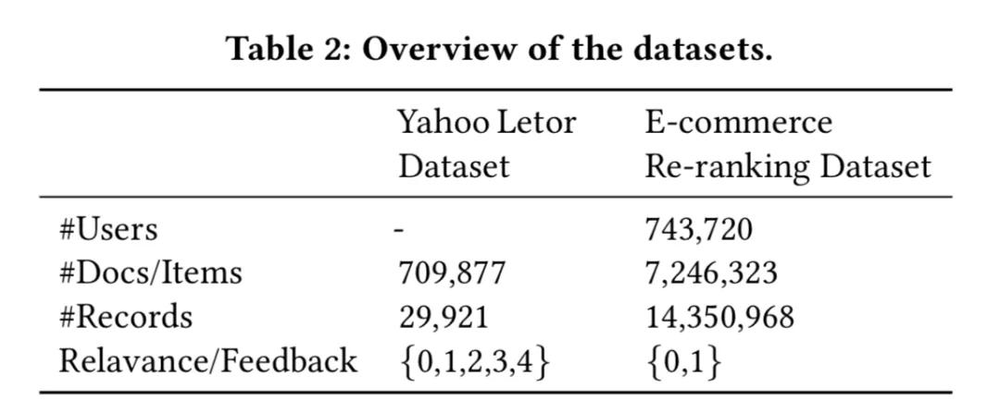

## 阿里提出基于Transformer的个性化重排序模型PRM，首次用于大规模在线系统  

> 原创：  
> AI前沿论文  
> 发布: AI前线  
> 发布日期: 2019-12-01  

论文作者| Changhua Pei，Yi Zhang，Yongfeng Zhang

编译 | 吴少杰  编辑 | 蔡芳芳  **AI 前线导读：** 在推荐系统中，个性化排序是推荐系统的核心部分之一。阿里巴巴的研究人员在近期的一篇 论文 中提出了基于 Transformer 的重排序结构 PRM，解决当前 point-wise 方式排序模型只考虑单个物品与用户之间相关性而忽略物品间相关性的问题，效果好于 LambdaMART 以及 List-wise 方式的 DLCM，同时还开源了论文所使用的电商场景数据集。该论文已经被 RecSys 2019 会议录用。本文是 AI 前线第 102 篇论文导读，我们将对这项研究工作进行详细解读。

**更多优质内容请关注微信公众号“AI 前线”（ID：ai-front）** 概    览

在推荐系统中，排序至关重要。排序算法给出的排序表的质量对推荐系统的收益和用户满意度有很大的影响。为了优化排序性能，业界提出了大量的排序算法。通常，推荐系统中的排序只考虑用 user-item 对的特性，而不考虑来自列表中其他 item 的影响，特别是那些邻近的 item。尽管 pairwise 和 listwise 的 LTR（learning to rank）试图以 item 对或 item 列表为输入来解决问题，但它们只专注于优化损失函数，以更好地利用 label。它们没有明确地模拟特征空间中 item 之间的相互影响。

一些文献倾向于对 item 之间的相互影响进行显式建模，来重新定义由先前排序算法生产的列表，称为重新排序。主要思想是将 intra-item 模式编码到特征空间中，来建立评分函数。编码特征向量的 state-of-the-art 的方法是基于 RNN 的，例如 GlobalRerank 和 DLCM。它们将初始列表按顺序输入到基于 RNN 的结构中，并在每个时间步输出编码向量。然而，基于 RNN 的方法对列表中 item 之间的交互进行建模的能力有限。前一编码项的特征信息随着编码距离的增加而降低。受机器翻译中使用的 Transformer 架构的启发，我们提议使用 Transformer 来建模 item 之间的相互影响。结构采用注意力机制，其中任何两个 item 都可以直接相互作用，而不会在编码距离上退化。同时，由于 Transformer 的并行化，encoding 部分比基于 RNN 的方法更高效。

在推荐系统中，除了考虑 item 之间的交互作用外，还应考虑交互的个性化编码函数，以便重新排序。推荐系统的重新排序是用户特定的，取决于用户的偏好和意图。对于一个对价格敏感的用户来说，“价格”特征之间的交互在重排序模型中应该更为重要。典型的全局编码函数可能不是最优的，因为它忽略了每个用户的特征分布之间的差异。例如，当用户关注价格比较时，具有不同价格的类似 item 往往在列表中更集中。当用户没有明显的购买意向时，推荐列表中的 item 往往更加多样化。因此，我们在 Transformer 结构中引入了一个个性化模块来表示用户的偏好和对 item 交互的意图。在我们的个性化重排序模型中，列表中的 item 和用户之间的交互可以同时被捕获。

本文主要贡献如下：

**问题**  我们提出了一个个性化的推荐系统重排序问题，据我们所知，这是第一次在大规模的在线系统重排序任务中显式地引入个性化的重排序信息。实验结果证明了在列表表征中引入用户表征进行重排序的有效性。

**模型**  我们使用具有个性化嵌入的 Transformer 来计算初始输入排序表的表征，并输出重新排序的分数。与基于 RNN 的方法相比，self-attention 机制使我们能够更有效、更高效地建模任意两个 item 之间用户特定的相互影响。

**数据** 我们发布了一个在本文中使用的大规模数据集（电子商务重排序数据集）。这个数据集是从一个真实的电子商务推荐系统中构建的。数据集中的记录包含一个推荐列表，记录用户 - 点击标签和特征以便进行排名使用。

**评估** 我们进行了离线和在线实验，结果表明我们的方法明显优于最先进的方法。在线 A/B 测试表明，我们的方法实现了更高的点击率和更高的实际系统收益。

重排序模型公式

在这一部分中，我们首先给出一些关于如何学习推荐系统的排序和重新排序方法的初步知识。然后阐述了本文要解决的问题。本文使用的符号见表 1。

学习排序（通常称为 LTR）方法广泛应用于实际系统中的排序，以生成用于信息检索的有序列表和推荐。LTR 方法根据 item 的特征向量学习全局评分函数。有了这个全局函数，LTR 方法通过对候选集合中的每个 item 进行评分来输出一个有序列表。此全局评分函数通常通过最小化以下损失函数 L 来学习：

其中 R 是所有用户的推荐请求集。Ir 是请求 r 的候选项集。xi 表示项 i 的特征空间。yi 是项 i 的 label，即单击或不单击。P（yi | x i；θ）是预测的点击概率。L 是用损失函数。

然而，xi 不能足够学习一个好的打分函数。我们发现推荐系统的排名应该考虑以下额外信息：（a）item 对之间的相互影响；（b）用户与 item 之间的交互。item 对之间的相互影响可以直接从初始列表 Sr 中得到，Sr 是 LTR 为请求 r 生成的排序列表。一些文献提出了如何更好地利用 item 对的互信息的方法。

然而，很少有工作考虑用户和 item 之间的交互。item 对的相互影响程度因用户而异。本文引入一个个性化矩阵 PV 来学习 user-specific 的编码函数，该函数能够建模 item 对之间的个性化相互影响。模型的损失函数可以表示为方程 2。

其中 Sr 是前一个排序模型给出的初始列表。θˆ是我们重新排序模型的参数。X 是列表中所有 item 的特征矩阵。

个性化重排序模型

在这一部分中，我们首先概述了我们提出的个性化重新排序模型（PRM）。然后详细介绍了模型的各个组成部分。

4.1 模型架构

PRM 模型的体系结构如图 1 所示。该模型由输入层、编码层和输出层三部分组成。它将先前排序方法生成的 item 的初始列表作为输入，并输出重新排序的列表。详细结构将在以下章节中单独介绍。

4.2 输入层

输入层的目标是准备初始列表中所有项的综合表征，并将其 feed 到编码层。首先，我们有一个固定长度的初始序列表 S=\[i1，i2，…，in\]，由前面的排序方法给出。与前面的排序方法一样，我们得到了原始特征矩阵 X∈Rn×d（feature）。X 中的每一行表示每个项目 i 的原始特征向量 Xi。

**Personalized Vector （PV）** 对两个项目的特征向量进行编码可以模拟它们之间的相互影响，但是这些影响对用户的影响程度是未知的。需要学习用户特定的编码函数。虽然整个初始列表的表示部分反映了用户的偏好，但对于一个强大的个性化编码函数来说是不够的。如图 1（b）所示，我们将原始特征矩阵 X∈Rn×d（feature）与个性化矩阵 PV∈Rn×d（pv）连接，得到中间嵌入矩阵 E′∈Rn×（d（feature）+d（pv）），如方程 3 所示。PV 由一个预先训练的模型生成，该模型将在下一节介绍。PV 的性能增益将在评估部分介绍。

**Position Embedding （PE）** 为了利用初始列表中的序列信息，我们在输入嵌入中注入一个位置嵌入 PE∈Rn×（d（feature）+d（pv））。然后利用方程 4 计算编码层的嵌入矩阵。在本文中，我们使用了一个可学习的 PE，我们发现它略优于其他文献中使用固定位置的嵌入。

最后用一个简单的前馈网络将特征矩阵 E′′n∈Rn×（d（feature）+d（pv））转化为 E∈Rn×d，其中 d 是编码层每个输入向量的嵌入维数。E 可表示为方程式 5。

式中，W E∈R（d（feature）+d（pv））×d 是投影矩阵，b（E）是 d 维向量。

4.3 编码层

图 1（a）中编码层的目标是集成项对和其他额外信息的相互影响，包括用户偏好和初始列表的排序顺序。为了实现这一目标，我们采用了类似于 Transformer 的编码器，因为 Transformer 已经在许多 NLP 任务中被证明是有效的，特别是在机器翻译中，与基于 RNN 的方法相比，它具有强大的编码和解码能力。Transformer 中的 self-attention 机制特别适合于我们的重排序任务，因为它直接建模任意两个 item 之间的相互影响，而不考虑它们之间的距离。如果没有距离衰减，Transformer 可以捕获初始列表中彼此相距较远的项之间的更多交互。如图 1（b）所示，我们的编码模块由 Transformer 编码器的 Nx 块组成。每个块（图 1（a））包含一个注意层和一个前馈网络（FFN）层。

**Attention Layer** 我们在本文中使用的注意函数定义为方程式 6：

其中矩阵 Q、K、V 分别表示查询、键和值。d 是矩阵 K 的维数，以避免内积的大值。softmax 用于将内积的值转换为值向量 V 的加权。在我们的论文中，我们使用 self-attention，其中 Q，K 和 V 是从同一个矩阵投影的。

为了模拟更复杂的相互影响，我们使用如等式 7 所示的多头 attention：

其中 WQ，WK，WV∈Rd×d.WO∈Rhd×d（model）是投影矩阵。h 是头的数目。在下一节的烧蚀研究中将研究不同 h 值的影响。

**Feed-Forward Network** 这种位置前馈网络（FFN）的主要功能是增强具有非线性和输入向量不同维数之间相互作用的模型。

**Stacking the Encoding Layer** 在这里，我们使用 attention 模块后面接 position-wise 的 FFN 作为一个 Transformer 的编码器块。通过叠加多个块，可以得到更复杂、更高阶的互信息。

4.4 输出层

输出层的功能主要是为每个项目 i=i1，…，in（在图 1（b）中标记为 score（i））生成一个分数。我们使用一个线性层，后跟一个 softmax 层。softmax 层的输出是每个项目的点击概率，标记为 P（yi | X，PV；θˆ）。我们用 P（yi | X，PV；θˆ）作为得分（i）对项目进行一步重排序。分数（i）的公式为：

其中 F（Nx）是 Transformer 编码器 Nx 块的输出。WF 是可学习投影矩阵，bF 是偏差项。n 是初始列表中的 item 数。

在训练过程中，我们使用点击数据作为标签，并最小化方程 9 所示的损失函数。

4.5 个性化模型

在这一节中，我们将介绍一种计算每个个性化矩阵 PV 的方法，它表示用户和项之间的交互。直接的方法是通过重新排序损失，用 PRM 模型以端到端的方式学习 PV。然而，如第 3 节所述，重新排序的任务是优化先前排序方法的输出。在重新排序任务时学习到的特定于任务的表征缺少用户的通用偏好。在此基础上，利用预先训练好的神经网络生成用户的个性化嵌入 PV，作为 PRM 模型的额外特征。训练前的神经网络是从整个平台的点击日志中学习的。

图 1（c）显示了本文中使用的预训练模型的结构。这个 sigmoid 层输出用户 u 在给定用户的所有行为历史（Hu）和用户的侧信息的情况下，对项目 i 的点击概率（P（yi | Hu，u；θ′）。用户侧信息包括性别、年龄、购买水平等。该模型的损失由点交叉熵函数计算，如方程 10 所示。

其中 D 是在平台上显示给用户 u 的一组项。θ是预训练模型的参数矩阵。yi 是项目 i 上的标签（点击或不点击）。我们使用 sigmoid 层之前的隐向量作为个性化向量 pvi（在图 1（c）中），来输入到我们的 PRM 模型中。

图 1（c）显示了预训练模型的一种可能架构，其他通用模型，如 FM、FFM、DeepFM、DCN、FNN 和 PNN 也可以用作生成 PV 的替代方案。

实验结果

在本节中，我们首先介绍用于评估的数据集和基线。然后将我们的方法与这些数据集上的基线进行比较，以评估我们的 PRM 模型的有效性。同时，进行了消融研究，以帮助了解我们模型的哪一部分对整体性能的贡献最大。

5.1 数据集

我们基于两个数据集评估我们的方法：Yahoo 和 E-commerce 重新排名数据集，没有可供推荐的具有上下文信息的公开重新排名数据集。因此，我们从一个流行的电子商务平台构建电子商务重排序数据集。两个数据集的概述如表 2 所示。

**Yahoo Letor 数据集** 我们使用同 Seq2Slate 中相同的方法对 Yahoo Letor 数据集进行处理，以适合推荐的排名模型。首先，我们使用阈值 Tb 将评分（0 到 4）转换为二进制标签。其次，我们使用衰减因子η来模拟 item 的展现概率。Yahoo Letor 数据集中的所有文档都由专家打分，前提是用户完整地查看了每个查询的所有文档。然而，在实际的推荐场景中，用户以自顶向下的方式查看 item。由于移动应用程序的屏幕只能显示有限数量的 item，因此一个 item 的排名位置越高，用户查看该 item 的概率就越小。本文用 1/pos（i）η作为衰减概率，其中 pos（i）是项目 i 在初始列表中的排名位置。

**电子商务重排数据集** 该数据集包含一个来自真实世界推荐系统的点击式数据形式的大规模记录。数据集中的每条记录都包含每个用户的推荐列表，其中包含用户的基本信息、单击标签和原始功能以进行排名。

5.2 基准线

学习排名（LTR）和重新排名方法都可以作为我们的基线。

**LTR** LTR 方法用于两个任务。首先，LTR 方法可以根据每个用户请求 r 的候选集 Ir 生成重新排序模型的初始列表 Sr。其次，使用 pairwise 或 listwise 损失函数的 LTR 方法可以作为重新排序的方法，以初始列表 Sr 为输入，再进行一次排序。本文中使用的典型 LTR 方法包括：

**1）SVMRank** 这是一种具有代表性的学习排序方法，它利用 pairwise 损失来建立评分函数模型。

**2） LambdaMart** 这是一种具有代表性的学习排序方法，它使用 list-wise 损失来建模评分函数。LambdaMart 是根据 \[31\] 的评估，在那些配备列表损失函数的 LTR 方法中最先进的 LTR。

**3）DNN-basedLTR** 这是在我们的在线推荐系统中部署的 LearningTo rank 的方法。它使用标准的 Wide &Deep 网络结构 \[9\] 通过 pointwise 损失函数对评分函数进行建模。

**Re-ranking**  正如在相关工作部分中提到的，现有的重新排序方法包括 DLCM、Seq2Slate 和 GualalRerank。DLCM 和 GlobalRerank 专注于信息检索中的重新排序。Seq2Slate 重点关注推荐和信息检索的重新排名。本文只选择 DLCM 作为基线方法。Seq2Slate 和 GlobalRerank 没有被选为基线，因为它们都使用解码器结构来生成重新排序的列表。Seq2Slate 使用 pointer network 按顺序生成重新排序的列表。GlobalRerank 使用带有注意机制的 RNN 作为解码器。解码器结构逐个输出 item。item 是否被选中取决于之前选择的 item。

因此，Seq2Slate 和 GlobalRerank 不能并行地进行在线推理。在推理阶段 Seq2Slate 和 GlobalRerank 的时间复杂度为 O（n）×RT，其中 N 是初始列表的长度，RT 是单个排名或重新排序请求的时间。Seq2Slate 和 GlobalRerank 重新排序的延迟是不可接受的，因为在线推荐服务有严格的延迟标准。

**4）DLCM** 它是一种基于 LTR 方法生成的初始列表的信息检索重排序模型。GRU 用于将本地上下文信息编码为全局向量。将全局向量与每个特征向量相结合，得到了比 LTR 的全局排序函数更强大的评分函数。

5.3 评价指标

对于离线评估，我们使用精度和映射来比较不同的方法。更具体地说，我们使用 Precision@5，Precision@10 表示 Precision，MAP@5，MAP@10 和 MAP@30 表示 MAP。在我们的实验中，初始列表的最大长度为 30，MAP@ 30 表示总 MAP。度量的定义如下。

**Precision@k** 定义为所有测试样本的 top-k 推荐项中点击项的分数，如等式 11 所示。

其中 R 是测试数据集中所有用户请求的集合。Sr 是由重排序模型为每个请求 r∈r 给出的项的有序列表，Sr（i）是第 i 项。1 是指示是否单击项 i 的函数。

**MAP@k** 是测试数据集中被 k 截断的所有排名列表的平均精度的缩写。定义如下。

对于在线 A/B 测试，我们使用 PV、IPV、CTR 和 GMV 作为度量标准。PV 和 IPV 定义为用户查看和单击的项目总数。CTR 是点击率，可通过 IPV/PV 计算。GMV 是用户在推荐 item 上花费的总金额（收入）。

5.4 实验设置

对于基线和 PRM 模型，我们对那些临界超参数使用相同的值。Yahoo Letor 数据集的隐藏维度 d（model）设置为 1024，电子商务重新排序数据集的隐藏维度 d（model）设置为 64。我们的 PRM 模型中 Adam 优化器的学习率与 \[28\] 相同。使用负对数似然损失函数，如等式 9 所示。

p（dropout）设置为 0.1。Yahoo Letor 数据集的批大小设置为 256，电子商务重新排序数据集的批大小设置为 512。这些设置是通过微调基线来获得的，以获得更好的性能。我们还尝试了不同的实验设置，实验结果与当前设置一致，并进行了修正。属于模型自定义部分的其余设置将在评估部分的相应部分中列出。

5.5 离线实验

在本节中，我们首先对 Yahoo Letor 数据集和电子商务重新排名数据集进行离线评估。然后给出了在线 A/B 测试的结果。我们还进行了消融研究，以帮助发现 PRM 模型的哪一部分对性能贡献最大。

5.5.1 雅虎 Letor 数据集离线评估

在本节中，我们将对 Yahoo Letor 数据集进行评估，以讨论以下问题：

1）RQ0：我们的 PRM 模型是否优于最先进的方法？为什么？

2）RQ1：性能是否随不同 LTR 方法生成的初始列表而变化？

评价结果见表 3。我们比较了基于 LambdaMART 和 SVMRank 分别生成的两个不同初始列表的基线和 PRM-BASE 模型。PRM-BASE 是 PRM 模型的变体，没有个性化模块。注意，Yahoo Letor 数据集不包含用户相关信息，因此我们只进行 PRM-BASE 比较。SVMRank 和 LambdaMart 也用于重新排序。对于 SVMRank，我们使用 \[19\] 中的实现。对于 LambdaMart，我们使用来自 RankLib 的实现。

表 3 显示，与所有基线相比，我们的 PRM-BASE 实现了稳定且显著的性能改进。

当基于 SVMRank 生成的初始列表时，PRM-BASE 在 MAP 上超越 DLCM 1.7%，在 Precision@5 上超出 1.4%。与 SVMRank 相比，在 MAP 和精度分别提高了 5.6% 和 5.7%。基于 LambdaMART 生成的初始列表，PRM-BASE 在 MAP 和 Precision@5 上的性能分别比 DLCM 高 0.7% 和 2.1%。与 LambdaMART 相比，PRM-BASE 在 MAP 上提高了 2.6%，在 Precision@5 上提高了 3.1%。

PRM-BASE 使用与 DLCM 相同的训练数据，不包含个性化模块。相对于 DLCM 的性能增益主要来自于 Transformer 强大的编码能力。多头注意机制在模拟两个 item 之间的实际影响方面表现得更好，特别是当编码列表的长度变长时。在我们的模型中，注意机制可以模拟 O（1）编码距离内任何 item 对之间的相互作用。

由于 PRM-BASE 采用 Transformer 结构，因此有许多子模块可能对性能有影响。我们进行消融研究，以帮助我们了解哪一个子设计最有助于突破底线。消融研究是在 SVMRank 生成的初始列表上进行的。当使用 LambdaMART 生成的初始列表时，发现了类似的结果，由于空间有限，本文省略了这些结果。表 4 显示了三部分的消融结果：第一部分（第一行）显示了基线 DLCM 的性能。第二部分（第二排）“Default”是 PRM-BASE 模型的最佳性能。第三部分（剩余行）展示了 PRM 模型的不同烧蚀变体，包括：移除位置嵌入（PE）、移除残余连接（RC）、移除 dropout 层、使用不同数量的块和在多个头部注意力中使用不同数量的头部。注意，我们在“Default”PRM 模型中设置了 b=4 和 h=3。

如表 4 所示，去除位置嵌入后，我们的模型的性能大大降低。这证实了初始列表给出的顺序信息的重要性。在去除位置嵌入后，我们的模型从候选集而不是有序列表中学习评分函数。注意，即使没有位置嵌入，我们的 PRM-BASE 仍然可以达到与 DLCM 相当的性能，这进一步证实了我们的 PRM-BASE 模型可以比 DLCM 更有效地编码初始列表。

当去除残余连接和脱落层时，模型的映射分别略微下降了 0.1% 和 0.7%，这表明我们的模型对梯度消失和过拟合等问题不太严重。我们的模型的性能首先随着块的数量（1-？2-？4）而增加，然后随着块的数量（4-？6-？8）而减少，因为当我们将 8 个编码块堆叠在一起时会发生过度拟合。

我们还尝试了多头注意层的不同设置（h=1，2，3，4）。表 4 中没有观察到明显的改善，这与 NLP 任务得出的结论不同 \[26\]。在自然语言处理中的实验表明，在多脑注意机制中使用更多的脑时，由于以下原因可以捕获更多的信息，因此通常是有帮助的。

（1）从方程 7 中我们发现，每个头部的函数起着将原始特征向量映射到不同子空间的作用。因此，使用更多的头，我们可以在不同的子空间中建模更多的项目交互。

（2）\[26\] 表明使用更多的头有助于编码长序列的信息。这是合理的，因为某个项的输出向量是列表中所有项向量的加权和。当序列变长时，列表中的每个项对输出向量的贡献都变小。但是，在我们的重新排序设置中，初始列表中的所有项都是高度同质的。当将原始特征向量映射到更多不同的子空间时，有一些小的改进。因此，我们建议只使用一个磁头来节省计算成本，因为性能改善并不明显。

5.5.2  电子商务重排名数据集离线评估

我们对电子商务排名数据集进行离线评估，以回答以下问题。

RQ2：个性化模块的用户体验的性能如何？

评价结果见表 5。对于我们的 PRM 模型，我们不仅评估了 PRM-BASE 的性能，还评估了带有预先训练的个性化向量 PV（称为 PRM- 个性化预训练）的模型变体的性能。由于我们之前对 Yahoo Letor 数据集的评估已经证实，我们的模型和 DLCM 在所有指标上都取得了更好的性能，而且 DLCM\[1\] 也有一致的结果，因此我们忽略了与 SVMRank 和 LambdaMART 在我们的电子商务重新排名数据集上的比较。初始列表是由一个基于 DNN 的 LTR 方法生成的，该方法部署在我们的实际推荐系统中。

当比较 PRM-BASE 和 DLCM 时，表 5 显示了与表 3 一致的结果。我们的 PRM-BASE 在 MAP 和精度 @5 上分别比 DLCM 高出 2.3% 和 4.1%。回想一下，在 Yahoo Letor 数据集上，PRM-BASE 在 MAP 上实现了 1.7% 的改进，在 Precision@5 上实现了 1.4% 的改进。我们的电子商务重排序数据集的性能增益比 Yahoo Letor 数据集的性能增益大得多。这与 Yahoo-Letor 数据集的属性密切相关。

我们对 Yahoo-Letor 数据集的统计显示，平均点击率为 30%，这意味着对于每一个包含 30 个推荐文档的查询，大约有 9 个文档被用户点击。然而，在我们真实世界的电子商务重新排名数据集中，平均点击率不超过 5%。这意味着在 Yahoo Letor 数据集上的排名要比在电子商务重新排名数据集上的排名容易得多。两个数据集上相同排序方法的 MAP 值也证实了这一点：DLCM 在 Yahoo-Letor 数据集上可以达到 0.64 MAP，而在电子商务重排序数据集上只能达到 0.28 MAP。结合表 5 和表 3，我们发现排名任务越难，PRM 模型的改进就越大。

表 5 显示，与 PRM-BASE 相比，我们的 PRM 个性化预训练实现了显著的性能改进。PRM 个性化 Pretrain 在 MAP 上的性能比 PRM-BASE 高 4.5%，在精度 @5 时的性能比 PRM-BASE 高 6.8%。这主要由个性化向量 PV 导入，该向量 PV 由一个预先训练的模型学习，其体系结构如图 1（c）所示。PRM 个性化预训练模型有两个优点：（1）预训练模型可以充分利用较长的用户日志周期，提供更通用、更具代表性的用户偏好嵌入。（2）通过长期的通用用户嵌入，我们的 PRM 模型能够更好地学习用户特定的编码功能，能够更准确地捕捉每个用户的项目对之间的相互影响。请注意，预训练模型的架构与我们的 PRM 模型的耦合度不高，其他通用模型 \[16、23、24、30、36\] 也可以用作生成 PV 的替代方案。

5.6 在线实验

我们还在一个真实世界的电子商务推荐系统中进行在线 A/B 测试，测试内容包括 PV、IPV、CTR 和 GMV 这些指标的含义在前面的“评估指标”一节中进行了解释。这些指标评估用户在推荐系统中浏览（PV）、点击（IPV、CTR）和购买（GMV）的意愿。对于每种算法，都有成千上万的用户和数百万的在线测试请求。

表 6 显示了三种方法相对于线上基础排序（DNN-based 的 LTR）的相对改进。

首先，在线 A/B 测试表明，无论采用何种重新排序方法，重新排序都有助于提高在线度量。再次，我们可以得出结论，重新排序通过考虑初始列表中 item 的相互影响有助于提高性能。值得注意的是，在我们的在线系统中，PV 有 0.77% 的增长（DLCM v.s Without re-ranking）是非常显著的，因为这意味着用户在使用重新排名方法后会看到大约数十亿个额外的 item。

第二，我们可以得出结论，与 DLCM 相比，PRM-BASE 模型带来了额外的 0.50% 的浏览 item 绝对增长和额外的 0.69% 的点击 item 绝对增长。最后，通过使用个性化模块，我们的 PRM 个性化预训练模型比 PRM-BASE 模型能进一步提高 GMV 6.29% 的绝对值。回想一下，在电子商务重排序数据集的离线实验中，与 PRM-BASE 相比，PRM 个性化 Pretrain 在 MAP 上增加了 4.5%。结果表明，利用预先训练好的用户描述，个性化编码函数可以更精确地捕捉 item 对之间的交互，为重排序方法带来显著的性能提升。

5.7  可视化注意力权重

我们将模型学习到的注意力权重可视化，以回答以下问题。

RQ3：self-attention 机制能从不同的方面学习有意义的信息吗，例如，item 的位置和特点？

**特征上的注意力** 我们首先将 item 之间的平均注意力权重可视化为两个特征：类别和价格。在测试数据集上计算的结果如图 2 所示。热图中的每个块表示属于七个主要类别的 item 之间的平均注意力权重。块颜色越深，权重就越大。从图 2（a）我们可以得出结论，注意机制可以成功地捕获不同类别的相互影响。类别相似的 item 往往具有较大的注意力权重，说明它们之间的相互影响较大。例如，“男鞋”对“女鞋”的影响要大于对“电脑”的影响。“电脑”、“手机”和“家用电器”由于都是电子产品，所以彼此之间的注意力权重很大，这一点也很容易理解。类似的情况可以在图 2（b）中观察到。在图 2（b）中，我们根据价格将项目分为 7 个级别。项目之间的价格越接近，相互影响就越大。

**位置上的注意力** 图 3 显示了初始列表中不同位置的平均注意权重。首先，图 3（a）显示了我们的模型中的自我注意机制可以捕捉到不考虑编码距离和推荐列表中位置偏差的相互影响。排在列表前面的 item 通常更容易被点击，因此对列表末尾的 item 有更多的影响。例如，我们观察到第一个位置的 item 对第 30 个位置的 item 的影响比第 26 个位置的 item 的影响更大，尽管后者更接近它。与图 3（b）相比，位置嵌入的效果也很明显，图 3（b）中每个位置之间的注意权重分布更加均匀。

结论 & 未来工作

本文提出了一种个性化的重排序模型（PRM），用于改进由最新的学习排序方法给出的初始列表。在重排序模型中，我们使用 Transformer 网络对 item 之间的依赖关系和用户与 item 之间的交互进行编码。个性化向量可以进一步改善重排序模型的性能。在线和离线实验都表明，我们的 PRM 模型可以极大地提高公开基准数据集和我们发布的真实数据集的排名性能。我们发布的真实数据集可以使研究人员研究推荐系统的排序 / 重排序算法。

我们的工作在特征空间中显式地建模复杂的 item-item 之间的关系。我们相信对标签空间的优化也会有帮助。另一个未来的方向是通过重新排名来学习多样化。尽管我们的模型在实际中并没有损害排名的多样性。在我们的重新排名模型中引入多元化目标是值得尝试的，我们将在今后的工作中进一步探索这一方向。

**论文原文链接：** ****

https://arxiv.org/abs/1904.06813

**数据集地址：** ****

https://github.com/rank2rec/rerank

* * *

**你也「在看」吗？** ****👇
