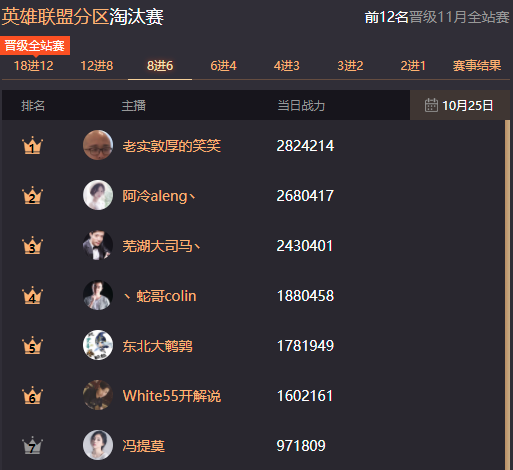

## 冯提莫的直播时代  

> 发布: 36氪的朋友们  
> 发布日期: 2019-12-27  

编者按：本文来自微信公众号[“网上冲浪记事”](https://mp.weixin.qq.com/s/dC5WMirqbYX3Nh0FWneQvw)（ID：djyjs0219），作者 冲浪鸽，36氪经授权发布。

### 01

2015年6月，当时在微博还只有25万粉丝的冯提莫，被认证成“斗鱼TV游戏主播”。她专门为此发了条微博，开玩笑地说：“可能斗鱼看到了我LOL的潜力和实力”。

在这条微博，冯提莫@周二珂、大表姐和陈一发，算上她自己的话，刚好凑成当时的斗鱼F4。

F4中只有后来唱《童话镇》走红的陈一发，转发了这条微博自我调侃：“所以给我认证平台主播是几个意思，很平的台湾主播吗？”

那时候斗鱼不过一岁半，暴露、猎奇的直播内容吸引着观众的眼球，穿得最多的F4女主播们，成了晚间档的清流，她们被紧紧地捆绑在一起，积累着各自的基础粉丝。

主播在直播的蛮荒时期享受着流量红利，疯狂涌入的资本让直播平台在烧钱方面也是有恃无恐。2016年，光斗鱼一家直播平台，就在半年内里融资两轮，加起来有20多亿人民币。主播们的日子因此过得很轻松，彼此之间也比较和谐。

只是没有想到寒冬来的如此突然，融资困难、资金链断裂，使得全民和熊猫直播接连倒闭，只剩下斗鱼和虎牙两家能打的。腾讯的企鹅电竞这才上位，被安在了老三的位置。

烧钱挖角终于不再是直播平台的头等大事。去年3月份，斗鱼和虎牙分别拿了腾讯6.3亿美元和4.6亿美元。腾讯给这两个平台投资的时间只相差一天，但虎牙拿到这轮融资两个月后就上市了，斗鱼那边有关上市的消息还只停留于传言阶段。

从那时起，斗鱼的弹幕中频频出现“上市”的字眼，每个资深水友都成了精神股东。斗鱼CEO陈少杰也看到了，穿着他的“舒克贝塔233”马甲，一条显眼的“皇帝”特权弹幕随即从屏幕划过：“都只看不送礼物，白看，拿头上市呀。”

### 02

上市前融资到E轮的斗鱼，并不是一味的在烧钱，他们在付费礼物上想了很多点子，无形中促成了各个主播的粉丝阵营。

鱼丸曾是斗鱼最为常见的、可免费获取的打赏道具，但2017年斗鱼对它做了大改版，主播收到鱼丸后无法再兑换成现金，只能转化为直播间热度。当时斗鱼官方口径是“鱼丸已不再是斗鱼平台的唯一基础道具，在平台所扮演的角色也逐渐削弱。”

将免费鱼丸取代的，是付费打赏道具鱼翅。花上6块钱买上6个鱼翅，就可以在喜欢的主播那“办卡”，从而加入主播的粉丝团，ID前还会有相应的粉丝徽章。

“办卡”只是消费的开始。粉丝等级提升需要刷礼物，获得更多特权需要开通“贵族”，而“贵族”同样也是层层分级，最贵的“皇帝”开通一个月需要18万个鱼翅，也就是18万元。到了年底，平台还会举办年度盛典，说白了就是个刷礼物冲榜的活动，粉丝们响应主播号召，有钱出钱，没钱出力。

潜移默化中，有些原本只是图个乐呵的观众开始粉丝化，不同阵营的粉丝争吵不断发生。主播也大多有了些领地意识，一旦觉得自己被侵犯了，站出来正面刚是常事。

3

2017年，卢本伟和孙亚龙这两位老队友彻底撕破了脸皮。

当时斗鱼推出了一个冲榜活动，孙亚龙成了英雄联盟分区第一后，看到榜上有两个不常玩《英雄联盟》的女主播，于是亲自给在国外旅游没开播的卢本伟刷礼物，把他送上第六，晋级了下一轮。

这看似是好事，但在活动期间送礼刷榜很敏感，卢本伟赶紧发了微博与孙亚龙撇清关系。

> “我忍了很多年，每次我都在让步。这是我最后一次回应你，首先谢谢你的'礼物'。你刷的这几万块我已经直播间全送回去了，希望大家彼此彻底两不相欠。这钱这礼物太复杂，放在我的斗鱼账户我真的一秒钟都不踏实。这几万块你用来带了我的节奏，带了两个女主播的节奏。这是一把枪。我收不下。”

卢本伟之所以这么紧张，是因为第六名的他，刚好把冯提莫挤了下来。

平台推出这样的冲榜活动，是希望粉丝粘性强的主播引来大量充值；女主播们则有相应的礼物流水指标；女主播粉丝们更是很难接受早早出局。

卢本伟质问孙亚龙，“你我都知道这是个女主播的博弈，他们都有礼物指标要求，为什么要为难她们？为何要拉上我？你这是在帮我？”

总结起来就是，卢本伟觉得自己被暗中使坏，不想沾上与女主播有关的节奏。

### 04

去年女主播之间有一场很大的节奏。有人放出消息称，一位头部女主播离婚了。

这场节奏波及到的女主播主要是冯提莫和陈一发。在各自回应的过程中，两人的矛盾也逐渐显现和放大。

两个月后，陈一发因两年前的直播出现了伤害民族感情的言论和举动而被举报，不久就被封禁。

有人将这两件事联系到了一起，开始罗列起冯提莫的黑历史，聊她的“会计门”往事。

今年主播伍声结婚时请了很多人。周二珂当了伴娘，和王思聪坐在一桌，已经有些过气的大表姐来了，甚至半年没露过面的陈一发也被邀请到了婚礼现场。以前的F4，唯独冯提莫没有出现，于是她又多了个“人缘差”。

### 05

被称作“人缘差”的冯提莫却在娱乐圈开了花。

从2017年6月发了首支个人单曲《识食物者为俊杰》后，冯提莫开始不断与外界接触，先是给电影《前任3》唱宣传曲，接着又上了湖南卫视的《快乐大本营》和《天天向上》节目。

真正的破圈是她搭上了抖音的东风。去年她发新歌《佛系少女》时，抖音正流行“手势舞”，就是连PG One和李小璐都在抖音里玩的那种用手部和肢体表达的舞蹈类型。

冯提莫也给《佛系少女》配上了手势舞发在了抖音，很快就被点赞了400多万次。《佛系少女》顺势成为抖音短视频的热门BGM，其手势舞被关晓彤等明星模仿，冯提莫的名字也被越来越多的人熟知。到了现在，已经有3000多万人在抖音关注了她。

冯提莫意外的成了受众更广的网红。去年一整年，她几乎没有在直播间外提起过直播。她上了浙江卫视的节目，与杨宗纬合唱《凉凉》，跟张韶涵合唱《淋雨一直走》，在《即刻电音》节目上连张艺兴都听说过她是个红人。去年的最后一天，她又出现在北京卫视的跨年晚会上，唱起了自己的《佛系少女》。

直播圈几乎没有冯提莫这样的存在，如果非要找出一位，那可能就是天佑了。天佑上过浙江卫视跨年晚会，参加过各种综艺，讨厌他的人不在少数，狂热的粉丝也为数众多。但与天佑因喊麦以及主播身份而遭到质疑不同，唱着更容易让人接受的流行歌曲的冯提莫，受到了娱乐圈前辈的关爱。

江苏卫视的《蒙面唱将》上，大张伟对冯提莫说：

> “以前都说选秀歌手怎么能跟唱片歌手比，现在其实选秀歌手已经都被认可了，因为大家就是靠实力，确实唱得很好。直播是新出来的，你是一个弄潮儿，所以你应该为自个儿感到骄傲。每一个人最终爱的是音乐，只要你能坚持就一定能被证明。”

冯提莫应该是信了。她把当年令她感到惊喜、专门为此发个微博的主播身份认证，换成了“歌手”。

今年8月份，她在家乡重庆开了一场个人演唱会。演唱会开始前，有一段6分钟的好友祝福视频，清一色的娱乐圈明星，不少都是她参加综艺时积累的人脉，包括何炅、杜海涛、齐秦、萧敬腾、杨宗纬等人，其中常年在《火星情报局》等综艺节目露面的刘维说：

> “冯提莫有着非常好的嗓音，可能是因为从直播出来的，大家会觉得真的唱的有这么好吗？但事实我跟他同台过，冯提莫的声音只能用两个字来形容，那就是天籁。而且我觉得冯提莫是一个非常坚强的女孩，我相信她未来的音乐一定会越来越好。”

### 06

在直播圈与娱乐圈收获到的两种截然相反的评价，使得冯提莫的重心似乎逐渐偏离了直播，而斗鱼也有些不想带冯提莫玩的意思了。

今年7月份，斗鱼终于上市了，CEO陈少杰带上了旭旭宝宝、PDD、YYF以及女流四位游戏主播去了美国纳斯达克交易所。冯提莫当时在国内，转发上市消息的文案颇为微妙：“演唱会筹备进入倒计时，只能向远方送出祝福。”

对于已经上市的斗鱼来说，流量固然重要，但更迫切的是将现有的流量变现。从今年开始全面公会化的斗鱼，很明显更重视营收了。以往只在年底才会有一次比较大的刷礼物冲榜活动，到了今年，斗鱼恨不得每个季度都搞一次。主播和公会也有意无意的制造矛盾，带动着粉丝们的情绪。

平台活动期间，有着礼物流水压力的主播需要保持直播的稳定。而对于如今的冯提莫来说，她的生活已经不可能还局限于直播间。

今年10月份宣布与斗鱼合约到期不再续约后，冯提莫在接下来两个月的直播空档期几乎没闲着。她一个月内去了国内五个城市举办实体专辑的签售会，也继续参加综艺节目，还在澳门回归20周年的活动晚会上，唱了主题曲《回家》。

对于从斗鱼开荒时期成长起来的主播，冯提莫如今想要直播、娱乐两开花的话，脱离让她陷入尴尬局面的直播环境，重回一个正在开荒阶段、竞争压力小的直播平台，可能才是最好的。

所以之前一度被称作“无家可归”的冯提莫最终去了B站直播，这既有些意料之外，但也算是情理之中。

B站在2018年赴美上市时，就被诟病于营收结构单一，80%以上收入来自手游。当时董事长陈睿解释：“游戏是我们非常重要的组成部分，但是我们的直播，包括我们的广告、周边销售，这些模式起来速度会非常快，未来有可能其他的模式加起来占的收入比重超过游戏。”

上个月，B站发了2019 Q3财报，游戏收入虽然没有被超越，但已经与非游戏业务收入持平，其中直播和增值服务收入占了总收入的24%。

B站直播这些年一直都在，但存在感很低。当初全民、熊猫直播败退时，人们自然而然的会将企鹅电竞提起，很少有人聊到B站直播。

B站直播缺失的存在感，都在最近这两个月补上了。先是8亿人民币拍下《英雄联盟》全球总决赛中国地区三年独播权，接着签下直播圈的顶级流量女主播冯提莫。媒体和舆论的反应足够真实，已经被用烂的“后直播时代”，这次又套在了B站直播身上。

### 07

就像虎牙、斗鱼这些年经历过的一样，直播付费打赏总是要一步步培养。冯提莫给B站带来关注度、引来新观众的同时，带动直播消费习惯或许是她存在的另一个意义。

还未开播时，“1219”数字开头的ID就已经不断刷屏，互相询问着新平台礼物打赏的玩法，这些都来自于冯提莫的忠实粉丝，数字代表的是冯提莫的生日。冯提莫开播后，打赏礼物几乎停不下来，直播间的热度也高居B站第一。

与冯提莫曾经所在的斗鱼类似，B站也有与“贵族”相仿的“舰队”付费特权用户。从首播到现在短短几天时间，已经有700多人上了冯提莫的舰队。作为对比，另一位在B站沉淀多年、拥有300多万粉丝的头部游戏主播逍遥散人，也不过只有300多人上了他的舰队。

目前B站直播的舰队只分为三档，最低198元一月，最高19998元一月。相较于斗鱼的“超级皇帝”首月18万元，以及虎牙的“超神·帝皇”首月150万元，B站显然还有更大的付费空间。

### 08

冯提莫说过，她之所起这个名，是因为她很喜欢《英雄联盟》里的提莫。

从她过往的网络痕迹中，可以发现她是真的很喜欢提莫。早在2013年，还没有成为主播的时候，她就戴起过提莫的帽子，在大学宿舍里玩起了自拍。后来唱吧APP很流行，她唱的一首歌登上了唱吧首页，从截图也能看到当时的头像是那个戴提莫帽子的她。

冯提莫喜欢的提莫，在《英雄联盟》里是一个毁誉参半的英雄。

他很受欢迎。尤其对于刚接触《英雄联盟》的玩家来说，可爱的形象，易上手的技能，以及丰富的周边商品，都让提莫成为游戏内外的话题。

他也令人讨厌。作为队友，提莫几乎没有团战能力；作为对手，提莫的隐形蘑菇被踩到后又很让人崩溃。虽然游戏版本在这些年不断变更，但“团战可以输，提莫必须死”却流传至今。

在《英雄联盟》宇宙里，提莫的背景故事中还有这么一句：

> 提莫是许多人都甚为忌惮的小个子对手，并且他的小个子下掩藏着他可怕的决心。
