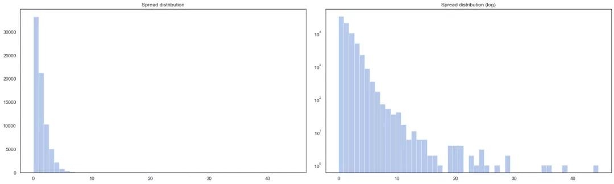
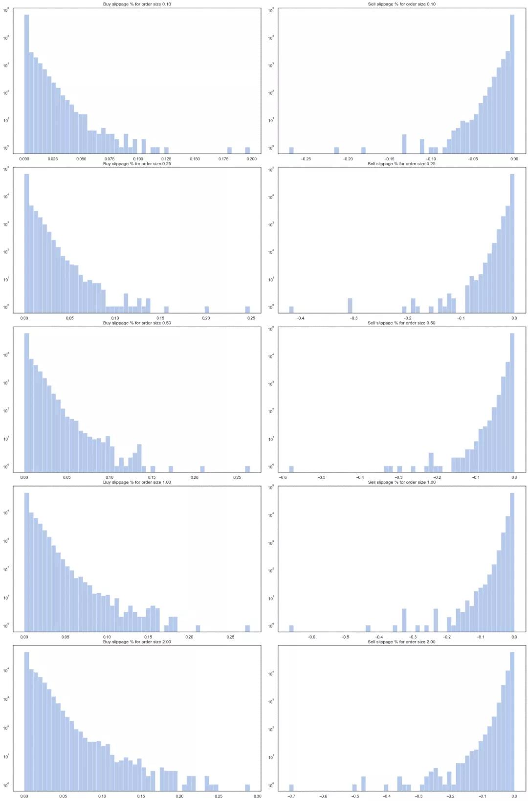
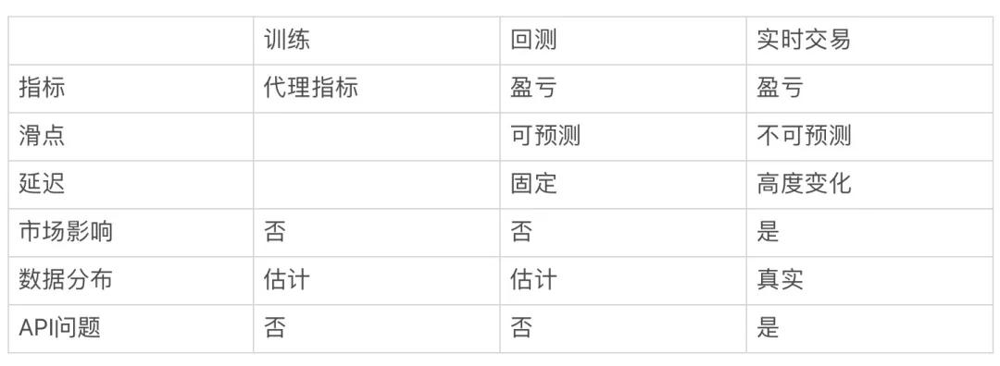

## 搞了个机器学习交易系统，5000美元投资变成了20万  

> 原创：  
> tradientblog  
> 发布: AI前线  
> 发布日期: 2019-12-06  


 作者 | tradientblog  译者 | 薛命灯  策划 | 赵钰莹  **AI 前线导读：** 最近，我开发了一个加密货币自动交易系统。因为有科研和软件工程方面的背景，我忽略了那些不是很科学的东西，比如市场营销。经过多次迭代，我开发的 ML 交易系统，在 12 个月内把 5 千美元的投资变成了 20 万，最好的战绩是连续 4 个月不亏损。虽然在一天的某个时段亏损，但整体交易日几乎都是盈利的。本文，我将分享在开发该交易系统时遇到的问题以及从中总结的经验。

**更多优质内容请关注微信公众号“AI 前线”（ID：ai-front）** 这种交易可以用算法来描述吗？

开篇之前还是要提醒广大开发人员：投资有风险，交易需谨慎。通常，大部分人认为市场是无法预测的，也有很多学术研究为此提供了数据支撑，但这种观点太武断了，毕竟还有很多专业交易员可以根据自己的一套规则给投资人一些专业意见。

在建立算法之前，我们需要先知道市场交易的参与者：

* 散户投资者：可能在朋友的推荐下购买比特币，或者把挖到的比特币卖掉变现。
* 机构投资者：具有大额交易能力的机构或个体，对市场的走势影响很大。

* 专业交易员：试图跑赢市场，根据消息、技术分析指标或者直觉进行交易。

* 算法：基于市场数据做出决策，自动执行交易。

在依赖数据分析的人看来，散户和机构投资者的行为随机性比较强，这类市场活动是不可预测的，这类随机活动会把市场价格推高，要是足够幸运的话，可以跟着分一杯羹。但有时候也会站错队。所以，长期来看，最后的盈利可能为零。

我们更感兴趣的应该是专业交易员和算法。这两者本质上一样，都基于一系列规则做出决策。如果能够知道具体规则，就可以设计一个系统自动执行。例如，如果某个算法可以算出在市场出现 MACD（一种被广泛使用的技术分析指标）信号时买入，就可以稍微修改一下参数，抢在该指标出现之前买入，并在将价格推高之后卖掉。当然，这只是一个非常简单的例子。大部分算法都很复杂，比如基于机器学习的模型，况且还忽略了市场流通性、交易延迟和交易手续费等问题。关键在于，我们必须知道规则和算法，才可以设计系统。

时间尺度是一个很重要的因素。相比实时（秒级别）数据，日交易数据更随机一些。因为时间尺度越大，市场活动受政治新闻、法律裁决、公众情绪、社会炒作、商业决策等因素的影响就越大。交易机构的大笔交易也会带来重大影响，但这种情况不会经常发生。这些都不是可被算法利用的，我们也无法对此进行建模。如果把市场活动定位到分钟或者秒级别，就可以找到一些模式。这些模式可以被算法利用，我们的目标就是利用这些模式来盈利。

系统关键特性

买卖发生在两个或多个市场参与者之间，有人赚钱，就有人亏钱。大家都想赚钱，那么你的技术优势是什么呢？在交易领域，我们把这种竞争优势叫作 edge，可能来自这些方面：

* 交易延迟：我们与交易平台之间的连接比别人更快。这意味着我们可以更快地获取到市场数据，并抢在别人之前提交订单。金融机构通常不吝花费数百万美元来最小化与交易平台之间的延迟。
* 基础设施：基础设施具有更高容错性和更好的性能，或者比其他竞争者能够更好地处理边缘情况。

* 数据：我们可能比其他人掌握了更好的数据。这里的“好”可以指很多方面，比如，数据是从更可靠的来源收集来的，还经过仔细的清理和预处理。

* 模型：我们基于数据构建出更好的预测模型。我们可能使用了最新的深度学习技术，掌握了更优化的函数、更好的特征和不一样的训练算法。

* 准入市场：我们可以进入那些不是所有人都可以进入的市场。例如，南韩的一些交易平台只有本国公民可以参与。为避免与美国国税局发生瓜葛，很多国际交易平台不接受美国公民。

人们常犯的一个错误是 **重度依赖模型** ，因为它看起来太“性感”了。很多开发者试图通过深度学习或增强深度学习算法来构建交易系统，但大部分都失败了。他们自认为他们的优势在于模型，却忽略了其他因素。他们没有优化服务器布局，使用开源软件下单和收集数据，还使用非常容易获取到的公开数据集来训练模型。或许，这可以给他们带来一点优势，但不足以弥补在其他方面犯下的错误。

我也使用了一些机器学习模型，但最大的优势还是来自于花了很大成本在构建基础设施。几乎所有的开源交易软件都不够好，将它们用于学习目的或许可以，但并不适合用在现实当中。在一开始我也使用了开源组件，但经过多次迭代之后，我都是自己开发组件，包括实时数据收集、清理、回测和模拟，订单的管理和规范化，监控以及实时交易。

选择市场

市场就是指在某个交易平台进行交易的资产。例如，BTC/USDT 在 Binance 上交易，BTC/USD 在 Coinbase 上交易。现在有数百个不同的数字货币交易平台，每一个交易平台都可以交易数十种资产。我们该怎么选择？最理想的市场应该具有高流通性，交易手续费低，快速且安全可靠。

总的来说，流通性是指在不显著影响市场价格的情况下能够交易的数量。流通性好的市场价差低，滑点小，交易成本低，可以进行大额交易。交易量是衡量流通性的一个指标。具有高交易量的市场通常（但不一定）具有高流通性。可惜的是，现在还没有公开评价体系可以告诉我们哪个交易平台是可靠的，即使 cer.live 有在尝试。搜索网站没什么用，因为交易平台会向网站支付费用，让自己的排名更靠前。

评估市场唯一可靠的方式是自己收集和分析数据。交易是真是假？价差和滑点的分布是怎样的？一些交易平台通过算法明目张胆地造假交易数据，还有一些使用更复杂的技术让自己的数据看起来更真实。

具体实现 交易成本算法实现

为了能够盈利，我们的交易获利必须高过所有交易成本的总和。对于大多数人来说，交易手续费占了大头，滑点通常会被忽略，但实际上它也很重要。假设我们买入 qty 个 BTC，并在稍后某个时间点卖出，那么净交易成本就是：

```
trade_cost(qty) = (2 * qty * exchange_fee) + (qty * spread) + slippage_buy(qty) + slippage_sell(qty)

```

\(2 \* qty \* exchange\_fee\) 是交易手续费。假设收费费是 0.01%，那么一次买入和一次卖出就需要支付两次费用。

\(qty \* spread\) 是买卖价差，我们在买入价买入，在卖出价卖出。即使市场完全不发生变动，我们仍然会在略高于卖出价的价格买入。价差会随时间发生变化，所以需要把它纳入到交易决策中。如果我们在 Binace 上交易 BTC/USDT，单日的价差分布可能像下面这样。大多数时候不到 1 美元，非流通时间可以达到 5 美元以上。



slippage\_buy\(qty\) 和 slippage\_sell\(qty\) 是因市场流通性不足而导致的价格滑点。交易量越大，我们要付出的滑点成本就越高。Binance 上的 BTC/USDT 滑点分布情况如下所示。每一行对应一个特定的交易规模，范围从 0.1 到 2.0 BTC，X 轴表示成本占支付价格的百分比。在流通性较低时进行交易意味着滑点成本很容易超过交易费用和价差，就像我们从图中看到的那样。



这些成本有多重要？这要视具体情况而定。如果我们每天只交易一次，更关注市场大幅度波动，那么就可以忽略大部分的成本。如果价格浮动可以达到 10%，那么 0.5% 的交易手续费根本不算什么。交易频次越高，这些成本就越重要。市场在短时间内一般不会出现太大波动，所以交易成本就变得尤为重要。

另一个重要因素是交易量。交易量越大意味着越高的利润，但交易费用也更高。交易费用和价差与交易量成线性关系，但滑点不是。使用平仓限价订单而不是市场订单是保护自己不受大幅滑点成本影响的一种方法，但需要额外的基础设施来管理部分订单。同样，交易频次越高，我们在不被交易成本抵消的情况下获利的交易量就越少。

时间维度问题

我们该怎么知道是应该进行高频交易还是每天只交易一次？为了做出权衡，我们先来看看这两种极端的情况。

时间越短，市场越是不会发生大幅度波动。每次交易只会获得非常少的利润，但我们可以提高交易频次。但正如之前讨论的那样，高交易成本会把这些利润都吃掉。即使我们能够完美地预测毫秒级的市场波动，这个模型也不会太管用。向交易平台发送一个 HTTP 请求并等待交易平台的匹配引擎处理，这通常需要几十到几百毫秒，等到订单处理完毕，市场又发生了变化，之前的预测就失效了。

另一个极端情况是基于某些东西进行交易，或者进行每日交易。隔天交易让我们完全可以忽略交易成本，延迟也变得不那么重要了。但是，较长时间的市场波动会受到现实世界因素的影响，比如社会新闻、事件或其他随机事件（比如机构投资活动）。如果我们只是依赖模式匹配（机器学习），就别指望能做好预测。我们能够掌握的这类数据很少，根本不足以用来训练模型。我们也无法可靠地测试和评估我们的算法。数据少，噪音多，基于这点数据所做的测试无异于猴子扔飞镖。

所以，我们需要在覆盖交易成本、掌握足够的数据集和从数据中识别模式这些因素之间做出权衡。时间尺度越小，模式和样本就会越多，但也要注意交易成本和延迟，它们都受市场流通性和交易 API 的影响。

除了使用自然时钟间隔（比如秒），我们还可以使用基于其他度量指标的间隔，例如交易量。例如，我们可以把间隔定义为 1.0 BTC，而不是 1 秒，这种交易可以一秒或者一分钟发生一次，具体取决于市场的繁忙情况。这是因为我们希望在市场活动剧烈的时候更频繁地交易，而在不那么剧烈的时候少交易一些。基于交易量的聚合数据包含了更为规范化的特征分布和标签，对于机器学习算法的训练更为有利。不过这种交易方式也有一些缺点。例如，基于交易量进行交易有可能会太晚，因为在交易高峰之后，市场又往前移动了。理想情况下，我们要先于其他市场参与者下单，也就是抢在交易量上升之前。

总的来说，时间尺度和如何定义时间间隔是需要加以优化的超参数。流通性高、交易费用低、API 延迟低，这样的市场可以让我们在更频繁的交易中获得更多利润。

优化函数

我们需要选择最优的指标数据来训练机器模型，而基于原始价格数据训练回归模型是一个显而易见的选择。但价格数据并不是固定的，而大多数现代机器学习技术需要或者使用固定数据才会获得更好的效果。所以，在金融领域，我们通常对收益而不是价格进行建模。时间 t 的收益 r\(t\) 表示如下：

```
r(t) = (p(t) / p(t-1)) - 1

```

收益比零大说明价格上涨，小于零说明价格下跌。时间 t 可以用上一小节讨论的那些方式来定义。你可以计算每分钟的收益，一天的收益，或者基于交易量的收益。

另一个是对数收益，它衡量的是同样的指标，但更接近正太分布，而且为训练机器学习算法提供了更为便利的统计属性：

```
logr(t) = log(p(t)) - log(p(t-1))

```

我们可以考虑基于固定时间尺度的对数收益数据训练回归模型，这几乎成了一个标准。不过，我们还有其他选择。例如，在《金融机器学习进展》这本书中，作者讨论了如何选择合理的阈值，并将数据转换为分类问题。

在实际当中，我们有很多种方式来定义 p\(t\)。对于 BTC，它通常是指中间价。不过，我们不能基于中间价进行交易。在买入时，价格高于中间价，在卖出时，价格低于中间价。之前已经说过，我们还需要付出滑点成本，它是交易量的函数。所以，价格实际上是时间、交易（买入还是卖出）和交易量的函数，即 p\(t,s,q\)。上面的公式应该是这样的：

```
logr(t, quantity) = log(p(t, BUY, quantity)) - log(p(t-1, SELL, quantity))

```

我们还有其他类型的价格可以使用，比如微价格（microprice）。选择合适的价格类型究竟有多重要？这取决于时间尺度和市场流通性。在流通性好、低滑点成本的市场里，基于中间价的收益模型更为有效，但在流通性差的市场中则完全无用。

训练、回测和实时交易

一般的交易算法训练流程是这样的：

* 数据收集
* 数据预处理和清理

* 创建特征

* 训练模型

* 回测

* 实时交易

我们在模型训练期间所做的优化，比如对数收益的预测准确性，只是盈亏指标的代理指标。盈亏指标才是我们真正关心的，所以我们需要进行回测。回测是指使用训练好的模型基于历史数据进行全方位的模拟。商业版回测软件可能会非常昂贵，它们可以模拟交易延迟、非标准订单类型、交易佣金和滑点。它们还可以自动优化超参数，输出图表和统计数据用于评估模型。

但不管回测软件有多好，它们与真实的交易环境仍然是不一样的。



虽然回测软件可以模拟延迟，但真实世界是很难预测的。真实世界中的延迟在低活动期间可能很稳定，但在高活动期间会很大。它们还具有季节性，API 也是如此。在模拟环境中，一切都很完美，但在现实世界中，API 会出问题，比如请求会被限制，在繁忙时段订单会被随机拒绝。在真实世界中，我们可以影响其他市场参与者，但这些行为无法模拟。回测还会受数据的限制。我们从交易 API 获得的历史数据通常带有噪音，而且不完整——我们无法保证它们是否能够真实反映当前的交易状态。

因此，回测主要作为一种过滤器，或者作为一种乐观的估计。即使模型在回测时表现不好，在现实世界中仍然有可能表现好。模型在回测时表现很好，并不能保证在现实世界中一定会表现好。除非你非常小心，否则回测容易出现过拟合，并可能产生错误的结果。

这也是为什么很多有关交易系统的学术论文在实际当中不是很管用。研究的最后一步通常是基于历史数据进行回测，如果模型运行得很好，研究人员就宣告大功告成，但他们忽略了一个事实，即他们的模型在真实的环境中可能永远无法盈利。研究人员无法使用实时交易基础设施来测试模型，如果他们可以做到，而且算法在现实世界中运行良好，那他们肯定不会把论文发表出来。

训练交易机器学习算法是很困难的。在很多其他机器学习场景中，训练测试性能与实际性能直接相关。例如，如果我们使用恰当的训练 / 验证 / 测试 split 来测试推荐系统，并且数据分布不会随时间发生显著变化，那么我们就可以非常肯定地认为，在测试数据集上表现良好的模型在生产环境中也是如此。在交易领域，我们的训练和回测与现实环境非常不一样，以至于我们无法做出任何保证。我们只能希望基于某种代理指标训练出来的模型在回测时表现良好，也希望它们在现实世界中也有同样的表现。

其他问题

除此之外，我们还有其他很多问题需要解决。

* 非 IID 数据：市场数据的分布既不独立也不固定，要训练出准确的模型极具挑战性。这些数据带有噪音。或许市场活动是有模式可循的，但它们通常被一些随机活动隐藏了起来。
* 订单重建：在交易和回测基础设施里，订单重建是一个常见的瓶颈。我们该如何有效地走好这一步？交易 API 不稳定，经常出现波动，我们该怎么处理？

* 最小化延迟：有哪些手段可以用来最小化端到端的延迟？

* 构建特征：哪些特征对于我们的算法来说是最有用的？我们该如何实时地构建这些特征？

* 订单管理：因为交易 API 不太稳定，我们需要自己管理订单。一个典型的订单管理系统应该是怎样的？

容错：如果发生故障该怎么办？我们该怎么恢复？

相关资源

* 交易行业是我参与过的最为神秘的一个行业。你在网上找到的相关资料掺杂着各种劣质内容，有很多只是想借机卖东西给你。我接触过的大多数成功的交易员都曾在专业的交易公司工作过，他们在那里学会了诀窍，但不会在网上分享任何东西。在金融领域，分享知识并没有形成一种文化。所以，对于刚进入这个领域的新手来说，这个领域看起来相当复杂，以至于让他们不知所措。实践可能成了最好的学习方式。在金融市场，交易基础设施和高频交易数据价值连城，但加密货币市场的数据对所有人开放，可以作为学习之用。不管怎样，我还是总结了一些有用的资源。

* 《金融机器学习进展》——一本严肃的书，介绍了机器学习技术在金融市场的应用。它更多的关注学术方面，有些不是很实用。虽然我并不完全同意这本书所讲的内容，但它仍然很好地介绍了在构建交易系统时遇到的各种挑战和陷阱。
* 《高频金融交易入门》——涵盖了自动化交易中使用的常见术语和方法，偏学术，有些东西很难消化，但值得一读。

* 《被随机愚弄：隐藏在生活和金融市场中的机会》——不是一本关于交易技术的书，作者是期权交易员，教你如何思考金融市场和生活中随机出现的机会。

* arXiv q-fin——阅读近期发表的研究论文是提出新想法或学习如何思考问题的一种好方法。它们有趣且有教育意义，但请不要太在意结果。正如前面提到的，学者们几乎不会公开发表真正有效的东西。

总结

我希望本文提出的一些想法能够为想要构建自动化交易系统的读者提供一些见解。复杂的问题通常没有通用的解决方案，重要的是要充分理解问题的各个方面，然后根据具体情况做出合理的决策。

原文链接：https://www.tradientblog.com/2019/11/lessons-learned-building-an-ml-trading-system-that-turned-5k-into-200k/

**福利来了！AI 前线社群再次开放了～与编辑、大咖零距离沟通的机会触手可及！公众号后台回复关键词“进群”获取二维码即可进群（还有 AI 大礼包赠送哦！）**

福利时刻

QCon 北京 2020 全新起航，来跟业界大牛关注人工智能领域中正在兴起的技术和关键进展，探讨应用于机器学习问题的工程挑战及解决方案。目前大会 7 折报名中，点击【阅读原文】或识别二维码了解更多。有任何问题欢迎联系票务小姐姐 Ring：17310043226（微信同号）


##### 今日荐文

点击下方图片即可阅读

[


[](http://mp.weixin.qq.com/s?__biz=MzU1NDA4NjU2MA==&mid=2247499260&idx=1&sn=f4fda984235810b586f35270f822a3f1&chksm=fbea4433cc9dcd2557aa35bc24247155fb0da487e79453dba0353822656791f224d97495949b&scene=21#wechat_redirect)复制粘贴一时爽：传播最广的一段 Java 代码曝出 Bug

* * *


**你也「在看」吗？** ****👇
